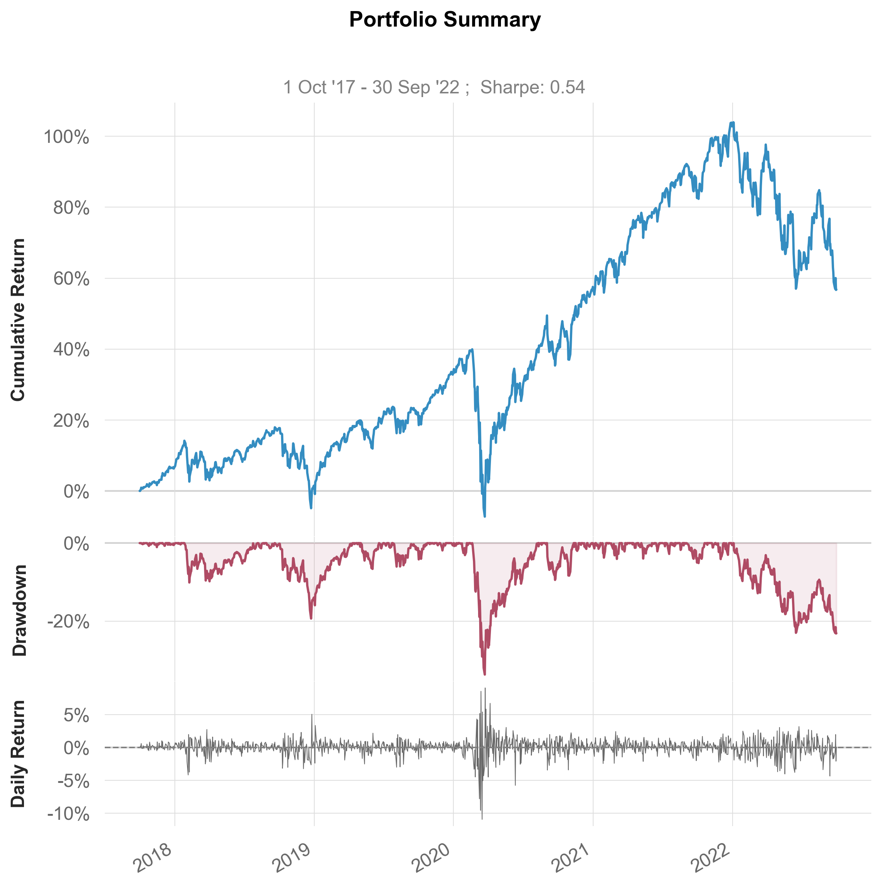
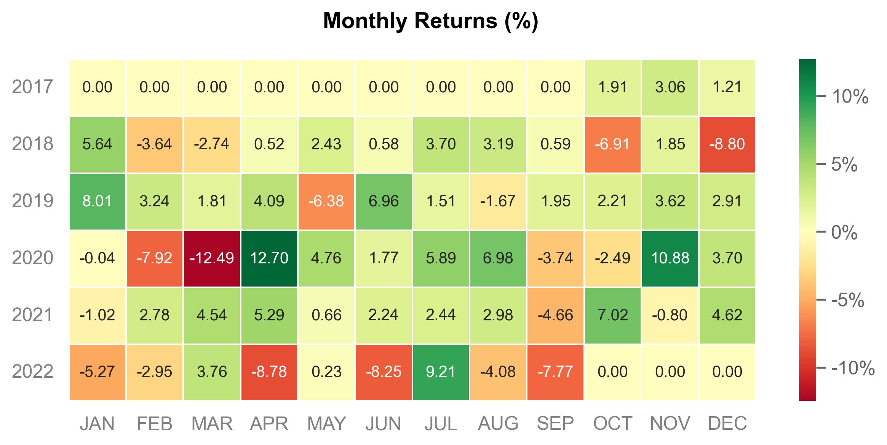

hypersheets
================

<!-- WARNING: THIS FILE WAS AUTOGENERATED! DO NOT EDIT! -->

This file will become your README and also the index of your
documentation.

# About

This is a python package, made in nbdev for creating financial
tearsheets based on
[quanstats](https://github.com/ranaroussi/quantstats).

Documentation can be found
[here](https://kgrewal1.github.io/hypersheets/)

## Install

``` sh
pip install hypersheets
```

## How to use

### Importing of data

The package provides a wrapper for yfinance’s Yahoo API to allow the
downloading of price and return date (based on daily adjusted close)

``` python
SPY_prices = hs.utils.download_prices('SPY',  period="5y")
SPY_returns = hs.utils.download_returns('SPY',  period="5y")
```

Existing price data data can be easily turned into returns

``` python
QQQ_prices = hs.utils.download_prices('QQQ',  period="5y")
QQQ_returns = hs.utils.prepare_returns(QQQ_prices)
```

### Analysis

Prebuilt reports functions allow for the quick analysis of stock
performance

``` python
hs.reports.plots(SPY_returns, QQQ_returns, display=True)
```





More detailed html tearsheets can also be produced:

``` python
hs.reports.html(SPY_returns, QQQ_returns, returns_title = 'SPY', benchmark_title = 'QQQ', download_filename = 'Example_Tearsheet.html', output = False)
```

<!-- generated by QuantStats for Python -->
<!DOCTYPE html>
<html lang="en">

<head>
    <meta charset="utf-8">
    <meta http-equiv="X-UA-Compatible" content="IE=edge,chrome=1">
    <meta name="viewport" content="width=device-width, initial-scale=1, shrink-to-fit=no">
    <title>Tearsheet (generated by QuantStats)</title>
    <script type="text/x-mathjax-config">
        MathJax.Hub.Config({tex2jax: {inlineMath: [['$','$'], ['\\(','\\)']]}});
      </script>
      <script type="text/javascript"
        src="http://cdnjs.cloudflare.com/ajax/libs/mathjax/2.7.1/MathJax.js?config=TeX-AMS-MML_HTMLorMML">
      </script>
    <meta name="robots" content="noindex, nofollow">
    <link rel="shortcut icon" href="https://qtpylib.io/favicon.ico" type="image/x-icon">
    <style>
        body {
            -webkit-font-smoothing: antialiased;
            -moz-osx-font-smoothing: grayscale;
            margin: 30px
        }

        body, p, table, td, th {
            font: 13px/1.4 Arial,sans-serif
        }

        .container {
            max-width: 960px;
            margin: auto
        }

        img, svg {
            width: 100%
        }

        h1,
        h2,
        h3,
        h4 {
            font-weight: 400;
            margin: 0
        }

            h1
            dt {
                display: inline;
                margin-left: 10px;
                font-size: 14px
            }

        h3 {
            margin-bottom: 10px;
            font-weight: 700
        }

        h4 {
            color: grey
        }

            h4
            a {
                color: #09c;
                text-decoration: none
            }

                h4
                a:hover {
                    color: #069;
                    text-decoration: underline
                }

        hr {
            margin: 25px 0 40px;
            height: 0;
            border: 0;
            border-top: 1px solid #ccc
        }

        #left {
            width: 620px;
            margin-right: 18px;
            margin-top: -1.2rem;
            float: left
        }

        #right {
            width: 320px;
            float: right
        }

        #left svg {
            margin: -1.5rem 0
        }

       

        table {
            margin: 0 0 40px;
            border: 0;
            border-spacing: 0;
            width: 100%
        }

            table td,
            table th {
                text-align: right;
                padding: 4px 5px 3px 5px
            }

            table th {
                text-align: right;
                padding: 6px 5px 5px 5px
            }

                table td:first-of-type,
                table th:first-of-type {
                    text-align: left;
                    padding-left: 2px
                }

                table td:last-of-type,
                table th:last-of-type {
                    text-align: right;
                    padding-right: 2px
                }

        td
        hr {
            margin: 5px 0
        }

        table th {
            font-weight: 400
        }

        table thead th {
            font-weight: 700;
            background: #eee
        }

        #eoy table td:after {
            content: "%"
        }

        #eoy table td:first-of-type:after,
        #eoy table td:last-of-type:after,
        #eoy table td:nth-of-type(4):after {
            content: ""
        }

        #eoy table th {
            text-align: right
        }

            #eoy table th:first-of-type {
                text-align: left
            }

        #eoy table td:after {
            content: "%"
        }

        #eoy table td:first-of-type:after,
        #eoy table td:last-of-type:after {
            content: ""
        }

        #eom table td:after {
            content: "%"
        }

        #eom table td:first-of-type:after,
        #eom table td:last-of-type:after,
        #eom table td:nth-of-type(4):after {
            content: ""
        }

        #eom table th {
            text-align: right
        }

            #eom table th:first-of-type {
                text-align: left
            }

        #eom table td:after {
            content: "%"
        }

        #eom table td:first-of-type:after,
        #eom table td:last-of-type:after {
            content: ""
        }

        #ddinfo table td:nth-of-type(3):after {
            content: "%"
        }

        #ddinfo table th {
            text-align: right
        }

            #ddinfo table td:first-of-type,
            #ddinfo table td:nth-of-type(2),
            #ddinfo table th:first-of-type,
            #ddinfo table th:nth-of-type(2) {
                text-align: left
            }

        #ddinfo table td:nth-of-type(3):after {
            content: "%"
        }
    @media print{
        hr{margin:10px 0}
        body{margin:0}
        .container{max-width:100%;margin:0}
        #left{margin:0;width:55%}

        #left svg{margin:0 0 -10%}
        #left svg:first-of-type{margin-top:-30%}

        .page {
            /*display: block;*/
            vertical-align: top;
            margin-top: -30%;
            margin-bottom: -30%;
            /*page-break-inside: avoid;*/
            /*page-break-after: always;*/
        }

        .page svg {            
            display: block;
            margin-top: -30%;
            margin-bottom: -30%;
            page-break-inside: avoid;
        }

        .start svg {
            margin-top: -30%;
        }

        #right{margin:0;width:45%}
        #ddinfo {
            page-break-inside: avoid;
        }
        #eom {
            page-break-before: always;
        }
        
    }
     @page {
         size: auto; /* width height */
         margin: 10mm 10mm 0mm 10mm;  
     }
    </style>
</head>

<body onload="save()">

    <div class="container">

        <h1>Strategy Tearsheet <dt> 2 Oct, 2017 - 30 Sep, 2022</dt></h1>
        <h4>Benchmark is QQQ |  Generated by <a href="http://quantstats.io" target="quantstats">QuantStats</a> (v. 0.0.1)</h4>
        <h4>Modified by Kirpal Grewal, August 2022</h4>
        <hr>


        <div id="right">
            <h3>Key Performance Metrics</h3>
            <table>
<thead>
<tr><th>Metric</th><th>SPY</th><th>QQQ</th></tr>
</thead>
<tbody>
<tr><td>Risk-Free Rate</td><td>0.0%</td><td>0.0%</td></tr>
<tr><td>Time in Market</td><td>100.0%</td><td>100.0%</td></tr>
<tr><td colspan="3"><hr></td></tr>
<tr><td>Cumulative Return</td><td>57.21%</td><td>94.47%</td></tr>
<tr><td>CAGR</td><td>9.48%</td><td>14.24%</td></tr>
<tr><td colspan="3"><hr></td></tr>
<tr><td>Sharpe</td><td>0.54</td><td>0.65</td></tr>
<tr><td>Prob. Sharpe Ratio</td><td>88.3%</td><td>92.57%</td></tr>
<tr><td>Smart Sharpe</td><td>0.45</td><td>0.55</td></tr>
<tr><td>Sortino</td><td>0.74</td><td>0.9</td></tr>
<tr><td>Smart Sortino</td><td>0.62</td><td>0.76</td></tr>
<tr><td>Sortino/$\sqrt{2}$</td><td>0.52</td><td>0.64</td></tr>
<tr><td>Smart Sortino/$\sqrt{2}$</td><td>0.44</td><td>0.54</td></tr>
<tr><td>Omega</td><td>1.11</td><td>1.11</td></tr>
<tr><td colspan="3"><hr></td></tr>
<tr><td>Max Drawdown</td><td>-33.72%</td><td>-32.65%</td></tr>
<tr><td>Longest DD Days</td><td>269</td><td>276</td></tr>
<tr><td>Volatility (ann.)</td><td>20.84%</td><td>25.29%</td></tr>
<tr><td>R^2</td><td>0.87</td><td>0.87</td></tr>
<tr><td>Information Ratio</td><td>-0.03</td><td>-0.03</td></tr>
<tr><td>Calmar</td><td>0.28</td><td>0.44</td></tr>
<tr><td>Skew</td><td>-0.66</td><td>-0.48</td></tr>
<tr><td>Kurtosis</td><td>12.01</td><td>5.9</td></tr>
<tr><td colspan="3"><hr></td></tr>
<tr><td>Expected Daily</td><td>0.04%</td><td>0.05%</td></tr>
<tr><td>Expected Monthly</td><td>0.04%</td><td>0.05%</td></tr>
<tr><td>Expected Yearly</td><td>0.04%</td><td>0.05%</td></tr>
<tr><td>Kelly Criterion</td><td>3.15%</td><td>5.32%</td></tr>
<tr><td>Risk of Ruin</td><td>0.0%</td><td>0.0%</td></tr>
<tr><td>Daily Value-at-Risk</td><td>-2.11%</td><td>-2.56%</td></tr>
<tr><td>Expected Shortfall (cVaR)</td><td>-2.11%</td><td>-2.56%</td></tr>
<tr><td colspan="3"><hr></td></tr>
<tr><td>Max Consecutive Wins</td><td>11</td><td>11</td></tr>
<tr><td>Max Consecutive Losses</td><td>8</td><td>6</td></tr>
<tr><td>Gain/Pain Ratio</td><td>0.11</td><td>0.13</td></tr>
<tr><td>Gain/Pain (1M)</td><td>0.58</td><td>0.77</td></tr>
<tr><td colspan="3"><hr></td></tr>
<tr><td>Payoff Ratio</td><td>0.85</td><td>0.85</td></tr>
<tr><td>Profit Factor</td><td>1.11</td><td>1.13</td></tr>
<tr><td>Common Sense Ratio</td><td>0.92</td><td>0.97</td></tr>
<tr><td>CPC Index</td><td>0.52</td><td>0.54</td></tr>
<tr><td>Tail Ratio</td><td>0.83</td><td>0.86</td></tr>
<tr><td>Outlier Win Ratio</td><td>4.47</td><td>3.47</td></tr>
<tr><td>Outlier Loss Ratio</td><td>4.56</td><td>3.45</td></tr>
<tr><td colspan="3"><hr></td></tr>
<tr><td>MTD</td><td>-7.51%</td><td>-8.41%</td></tr>
<tr><td>3M</td><td>-3.9%</td><td>-3.42%</td></tr>
<tr><td>6M</td><td>-20.47%</td><td>-26.02%</td></tr>
<tr><td>YTD</td><td>-22.47%</td><td>-30.89%</td></tr>
<tr><td>1Y</td><td>-14.95%</td><td>-23.37%</td></tr>
<tr><td>3Y (ann.)</td><td>8.23%</td><td>12.77%</td></tr>
<tr><td>5Y (ann.)</td><td>9.16%</td><td>13.59%</td></tr>
<tr><td>10Y (ann.)</td><td>9.48%</td><td>14.24%</td></tr>
<tr><td>All-time (ann.)</td><td>9.48%</td><td>14.24%</td></tr>
<tr><td colspan="3"><hr></td></tr>
<tr><td>Best Day</td><td>9.06%</td><td>8.47%</td></tr>
<tr><td>Worst Day</td><td>-10.94%</td><td>-11.98%</td></tr>
<tr><td>Best Month</td><td>12.7%</td><td>14.97%</td></tr>
<tr><td>Worst Month</td><td>-12.49%</td><td>-13.6%</td></tr>
<tr><td>Best Year</td><td>31.22%</td><td>48.41%</td></tr>
<tr><td>Worst Year</td><td>-22.47%</td><td>-30.89%</td></tr>
<tr><td colspan="3"><hr></td></tr>
<tr><td>Avg. Drawdown</td><td>-1.91%</td><td>-3.07%</td></tr>
<tr><td>Avg. Drawdown Days</td><td>16</td><td>19</td></tr>
<tr><td>Recovery Factor</td><td>1.7</td><td>2.89</td></tr>
<tr><td>Ulcer Index</td><td>0.08</td><td>0.1</td></tr>
<tr><td>Serenity Index</td><td>0.67</td><td>0.79</td></tr>
<tr><td colspan="3"><hr></td></tr>
<tr><td>Avg. Up Month</td><td>4.21%</td><td>5.31%</td></tr>
<tr><td>Avg. Down Month</td><td>-5.78%</td><td>-6.46%</td></tr>
<tr><td>Win Days</td><td>55.46%</td><td>56.56%</td></tr>
<tr><td>Win Month</td><td>66.67%</td><td>63.33%</td></tr>
<tr><td>Win Quarter</td><td>70.0%</td><td>75.0%</td></tr>
<tr><td>Win Year</td><td>66.67%</td><td>66.67%</td></tr>
<tr><td colspan="3"><hr></td></tr>
<tr><td>Beta</td><td>0.77</td><td>-</td></tr>
<tr><td>Alpha</td><td>-0.01</td><td>-</td></tr>
<tr><td>Correlation</td><td>93.05%</td><td>-</td></tr>
<tr><td>Treynor Ratio</td><td>74.64%</td><td>-</td></tr>
</tbody>
</table>

            <div id="ddinfo">
                <h3>Worst 10 Drawdowns</h3>
                <table>
<thead>
<tr><th>Started</th><th>Recovered</th><th>Drawdown</th><th>Days</th></tr>
</thead>
<tbody>
<tr><td>2020-02-20</td><td>2020-08-10</td><td>-33.72</td><td>172</td></tr>
<tr><td>2022-01-04</td><td>2022-09-30</td><td>-23.18</td><td>269</td></tr>
<tr><td>2018-09-21</td><td>2019-04-12</td><td>-19.35</td><td>203</td></tr>
<tr><td>2018-01-29</td><td>2018-08-06</td><td>-10.10</td><td>189</td></tr>
<tr><td>2020-09-03</td><td>2020-11-11</td><td>-9.44</td><td>69</td></tr>
<tr><td>2019-05-06</td><td>2019-06-20</td><td>-6.62</td><td>45</td></tr>
<tr><td>2019-07-29</td><td>2019-10-25</td><td>-6.02</td><td>88</td></tr>
<tr><td>2021-09-03</td><td>2021-10-20</td><td>-5.11</td><td>47</td></tr>
<tr><td>2021-11-19</td><td>2021-12-10</td><td>-4.09</td><td>21</td></tr>
<tr><td>2021-02-16</td><td>2021-03-11</td><td>-4.06</td><td>23</td></tr>
</tbody>
</table>
            </div>

            <div id="eoy">
                <h3>EOY Returns vs QQQ Benchmark</h3>
                <table>
<thead>
<tr><th>Year</th><th>SPY</th><th>QQQ</th><th>Multiplier</th><th>Won</th></tr>
</thead>
<tbody>
<tr><td>2017</td><td>6.30</td><td>7.22</td><td>0.87</td><td>-</td></tr>
<tr><td>2018</td><td>-4.57</td><td>-0.13</td><td>36.20</td><td>-</td></tr>
<tr><td>2019</td><td>31.22</td><td>38.96</td><td>0.80</td><td>-</td></tr>
<tr><td>2020</td><td>18.33</td><td>48.41</td><td>0.38</td><td>-</td></tr>
<tr><td>2021</td><td>28.73</td><td>27.42</td><td>1.05</td><td>+</td></tr>
<tr><td>2022</td><td>-22.47</td><td>-30.89</td><td>0.73</td><td>+</td></tr>
</tbody>
</table>
            </div>

            <div id="eom">
                <h3>EOM Returns vs QQQ Benchmark</h3>
                <table>
<thead>
<tr><th>Month</th><th>SPY</th><th>QQQ</th><th>Multiplier</th><th>Won</th></tr>
</thead>
<tbody>
<tr><td>(2017, 10)</td><td>1.91</td><td>4.51</td><td>0.42</td><td>-</td></tr>
<tr><td>(2017, 11)</td><td>3.06</td><td>1.97</td><td>1.55</td><td>+</td></tr>
<tr><td>(2017, 12)</td><td>1.21</td><td>0.60</td><td>2.01</td><td>+</td></tr>
<tr><td>(2018, 1)</td><td>5.64</td><td>8.76</td><td>0.64</td><td>-</td></tr>
<tr><td>(2018, 2)</td><td>-3.64</td><td>-1.29</td><td>2.81</td><td>-</td></tr>
<tr><td>(2018, 3)</td><td>-2.74</td><td>-4.08</td><td>0.67</td><td>+</td></tr>
<tr><td>(2018, 4)</td><td>0.52</td><td>0.51</td><td>1.02</td><td>+</td></tr>
<tr><td>(2018, 5)</td><td>2.43</td><td>5.67</td><td>0.43</td><td>-</td></tr>
<tr><td>(2018, 6)</td><td>0.58</td><td>1.15</td><td>0.50</td><td>-</td></tr>
<tr><td>(2018, 7)</td><td>3.70</td><td>2.80</td><td>1.32</td><td>+</td></tr>
<tr><td>(2018, 8)</td><td>3.19</td><td>5.78</td><td>0.55</td><td>-</td></tr>
<tr><td>(2018, 9)</td><td>0.59</td><td>-0.28</td><td>-2.11</td><td>+</td></tr>
<tr><td>(2018, 10)</td><td>-6.91</td><td>-8.60</td><td>0.80</td><td>+</td></tr>
<tr><td>(2018, 11)</td><td>1.85</td><td>-0.26</td><td>-7.00</td><td>+</td></tr>
<tr><td>(2018, 12)</td><td>-8.80</td><td>-8.66</td><td>1.02</td><td>-</td></tr>
<tr><td>(2019, 1)</td><td>8.01</td><td>9.01</td><td>0.89</td><td>-</td></tr>
<tr><td>(2019, 2)</td><td>3.24</td><td>2.99</td><td>1.08</td><td>+</td></tr>
<tr><td>(2019, 3)</td><td>1.81</td><td>3.92</td><td>0.46</td><td>-</td></tr>
<tr><td>(2019, 4)</td><td>4.09</td><td>5.50</td><td>0.74</td><td>-</td></tr>
<tr><td>(2019, 5)</td><td>-6.38</td><td>-8.23</td><td>0.78</td><td>+</td></tr>
<tr><td>(2019, 6)</td><td>6.96</td><td>7.59</td><td>0.92</td><td>-</td></tr>
<tr><td>(2019, 7)</td><td>1.51</td><td>2.33</td><td>0.65</td><td>-</td></tr>
<tr><td>(2019, 8)</td><td>-1.67</td><td>-1.90</td><td>0.88</td><td>+</td></tr>
<tr><td>(2019, 9)</td><td>1.95</td><td>0.92</td><td>2.12</td><td>+</td></tr>
<tr><td>(2019, 10)</td><td>2.21</td><td>4.38</td><td>0.50</td><td>-</td></tr>
<tr><td>(2019, 11)</td><td>3.62</td><td>4.07</td><td>0.89</td><td>-</td></tr>
<tr><td>(2019, 12)</td><td>2.91</td><td>3.89</td><td>0.75</td><td>-</td></tr>
<tr><td>(2020, 1)</td><td>-0.04</td><td>3.04</td><td>-0.01</td><td>-</td></tr>
<tr><td>(2020, 2)</td><td>-7.92</td><td>-6.06</td><td>1.31</td><td>-</td></tr>
<tr><td>(2020, 3)</td><td>-12.49</td><td>-7.29</td><td>1.71</td><td>-</td></tr>
<tr><td>(2020, 4)</td><td>12.70</td><td>14.97</td><td>0.85</td><td>-</td></tr>
<tr><td>(2020, 5)</td><td>4.76</td><td>6.60</td><td>0.72</td><td>-</td></tr>
<tr><td>(2020, 6)</td><td>1.77</td><td>6.29</td><td>0.28</td><td>-</td></tr>
<tr><td>(2020, 7)</td><td>5.89</td><td>7.35</td><td>0.80</td><td>-</td></tr>
<tr><td>(2020, 8)</td><td>6.98</td><td>10.94</td><td>0.64</td><td>-</td></tr>
<tr><td>(2020, 9)</td><td>-3.74</td><td>-5.78</td><td>0.65</td><td>+</td></tr>
<tr><td>(2020, 10)</td><td>-2.49</td><td>-3.04</td><td>0.82</td><td>+</td></tr>
<tr><td>(2020, 11)</td><td>10.88</td><td>11.23</td><td>0.97</td><td>-</td></tr>
<tr><td>(2020, 12)</td><td>3.70</td><td>4.90</td><td>0.76</td><td>-</td></tr>
<tr><td>(2021, 1)</td><td>-1.02</td><td>0.26</td><td>-3.90</td><td>-</td></tr>
<tr><td>(2021, 2)</td><td>2.78</td><td>-0.13</td><td>-20.83</td><td>+</td></tr>
<tr><td>(2021, 3)</td><td>4.54</td><td>1.72</td><td>2.64</td><td>+</td></tr>
<tr><td>(2021, 4)</td><td>5.29</td><td>5.91</td><td>0.90</td><td>-</td></tr>
<tr><td>(2021, 5)</td><td>0.66</td><td>-1.20</td><td>-0.55</td><td>+</td></tr>
<tr><td>(2021, 6)</td><td>2.24</td><td>6.26</td><td>0.36</td><td>-</td></tr>
<tr><td>(2021, 7)</td><td>2.44</td><td>2.86</td><td>0.85</td><td>-</td></tr>
<tr><td>(2021, 8)</td><td>2.98</td><td>4.22</td><td>0.71</td><td>-</td></tr>
<tr><td>(2021, 9)</td><td>-4.66</td><td>-5.68</td><td>0.82</td><td>+</td></tr>
<tr><td>(2021, 10)</td><td>7.02</td><td>7.86</td><td>0.89</td><td>-</td></tr>
<tr><td>(2021, 11)</td><td>-0.80</td><td>2.00</td><td>-0.40</td><td>-</td></tr>
<tr><td>(2021, 12)</td><td>4.62</td><td>1.15</td><td>4.01</td><td>+</td></tr>
<tr><td>(2022, 1)</td><td>-5.27</td><td>-8.75</td><td>0.60</td><td>+</td></tr>
<tr><td>(2022, 2)</td><td>-2.95</td><td>-4.48</td><td>0.66</td><td>+</td></tr>
<tr><td>(2022, 3)</td><td>3.76</td><td>4.67</td><td>0.81</td><td>-</td></tr>
<tr><td>(2022, 4)</td><td>-8.78</td><td>-13.60</td><td>0.65</td><td>+</td></tr>
<tr><td>(2022, 5)</td><td>0.23</td><td>-1.59</td><td>-0.14</td><td>+</td></tr>
<tr><td>(2022, 6)</td><td>-8.25</td><td>-8.91</td><td>0.93</td><td>+</td></tr>
<tr><td>(2022, 7)</td><td>9.21</td><td>12.55</td><td>0.73</td><td>-</td></tr>
<tr><td>(2022, 8)</td><td>-4.08</td><td>-5.13</td><td>0.80</td><td>+</td></tr>
<tr><td>(2022, 9)</td><td>-7.51</td><td>-8.41</td><td>0.89</td><td>+</td></tr>
</tbody>
</table>
            </div>


        </div>

        <div id="left">

            <div class="page" id="p1">
                <div class="tall" id="returns"><?xml version="1.0" encoding="utf-8" standalone="no"?>
<!DOCTYPE svg PUBLIC "-//W3C//DTD SVG 1.1//EN"
  "http://www.w3.org/Graphics/SVG/1.1/DTD/svg11.dtd">
<svg xmlns:xlink="http://www.w3.org/1999/xlink" width="576pt" height="360pt" viewBox="0 0 576 360" xmlns="http://www.w3.org/2000/svg" version="1.1">
 <metadata>
  <rdf:RDF xmlns:dc="http://purl.org/dc/elements/1.1/" xmlns:cc="http://creativecommons.org/ns#" xmlns:rdf="http://www.w3.org/1999/02/22-rdf-syntax-ns#">
   <cc:Work>
    <dc:type rdf:resource="http://purl.org/dc/dcmitype/StillImage"/>
    <dc:date>2022-09-30T15:40:54.373152</dc:date>
    <dc:format>image/svg+xml</dc:format>
    <dc:creator>
     <cc:Agent>
      <dc:title>Matplotlib v3.5.1, https://matplotlib.org/</dc:title>
     </cc:Agent>
    </dc:creator>
   </cc:Work>
  </rdf:RDF>
 </metadata>
 <defs>
  <style type="text/css">*{stroke-linejoin: round; stroke-linecap: butt}</style>
 </defs>
 <g id="figure_1">
  <g id="patch_1">
   <path d="M 0 360 
L 576 360 
L 576 0 
L 0 0 
z
" style="fill: #ffffff"/>
  </g>
  <g id="axes_1">
   <g id="patch_2">
    <path d="M 51.2 316.69908 
L 565.2 316.69908 
L 565.2 49.536 
L 51.2 49.536 
z
" style="fill: #ffffff"/>
   </g>
   <g id="matplotlib.axis_1">
    <g id="xtick_1">
     <g id="line2d_1">
      <path d="M 97.876037 316.69908 
L 97.876037 49.536 
" clip-path="url(#p837367d4b1)" style="fill: none; stroke: #dddddd; stroke-width: 0.5; stroke-linecap: round"/>
     </g>
     <g id="text_1">
      <!-- 2018 -->
      <g style="fill: #666666" transform="translate(73.36458 347.157154)rotate(-30)scale(0.121 -0.121)">
       <defs>
        <path id="ArialMT-32" d="M 3222 541 
L 3222 0 
L 194 0 
Q 188 203 259 391 
Q 375 700 629 1000 
Q 884 1300 1366 1694 
Q 2113 2306 2375 2664 
Q 2638 3022 2638 3341 
Q 2638 3675 2398 3904 
Q 2159 4134 1775 4134 
Q 1369 4134 1125 3890 
Q 881 3647 878 3216 
L 300 3275 
Q 359 3922 746 4261 
Q 1134 4600 1788 4600 
Q 2447 4600 2831 4234 
Q 3216 3869 3216 3328 
Q 3216 3053 3103 2787 
Q 2991 2522 2730 2228 
Q 2469 1934 1863 1422 
Q 1356 997 1212 845 
Q 1069 694 975 541 
L 3222 541 
z
" transform="scale(0.015625)"/>
        <path id="ArialMT-30" d="M 266 2259 
Q 266 3072 433 3567 
Q 600 4063 929 4331 
Q 1259 4600 1759 4600 
Q 2128 4600 2406 4451 
Q 2684 4303 2865 4023 
Q 3047 3744 3150 3342 
Q 3253 2941 3253 2259 
Q 3253 1453 3087 958 
Q 2922 463 2592 192 
Q 2263 -78 1759 -78 
Q 1097 -78 719 397 
Q 266 969 266 2259 
z
M 844 2259 
Q 844 1131 1108 757 
Q 1372 384 1759 384 
Q 2147 384 2411 759 
Q 2675 1134 2675 2259 
Q 2675 3391 2411 3762 
Q 2147 4134 1753 4134 
Q 1366 4134 1134 3806 
Q 844 3388 844 2259 
z
" transform="scale(0.015625)"/>
        <path id="ArialMT-31" d="M 2384 0 
L 1822 0 
L 1822 3584 
Q 1619 3391 1289 3197 
Q 959 3003 697 2906 
L 697 3450 
Q 1169 3672 1522 3987 
Q 1875 4303 2022 4600 
L 2384 4600 
L 2384 0 
z
" transform="scale(0.015625)"/>
        <path id="ArialMT-38" d="M 1131 2484 
Q 781 2613 612 2850 
Q 444 3088 444 3419 
Q 444 3919 803 4259 
Q 1163 4600 1759 4600 
Q 2359 4600 2725 4251 
Q 3091 3903 3091 3403 
Q 3091 3084 2923 2848 
Q 2756 2613 2416 2484 
Q 2838 2347 3058 2040 
Q 3278 1734 3278 1309 
Q 3278 722 2862 322 
Q 2447 -78 1769 -78 
Q 1091 -78 675 323 
Q 259 725 259 1325 
Q 259 1772 486 2073 
Q 713 2375 1131 2484 
z
M 1019 3438 
Q 1019 3113 1228 2906 
Q 1438 2700 1772 2700 
Q 2097 2700 2305 2904 
Q 2513 3109 2513 3406 
Q 2513 3716 2298 3927 
Q 2084 4138 1766 4138 
Q 1444 4138 1231 3931 
Q 1019 3725 1019 3438 
z
M 838 1322 
Q 838 1081 952 856 
Q 1066 631 1291 507 
Q 1516 384 1775 384 
Q 2178 384 2440 643 
Q 2703 903 2703 1303 
Q 2703 1709 2433 1975 
Q 2163 2241 1756 2241 
Q 1359 2241 1098 1978 
Q 838 1716 838 1322 
z
" transform="scale(0.015625)"/>
       </defs>
       <use xlink:href="#ArialMT-32"/>
       <use xlink:href="#ArialMT-30" x="55.615234"/>
       <use xlink:href="#ArialMT-31" x="111.230469"/>
       <use xlink:href="#ArialMT-38" x="166.845703"/>
      </g>
     </g>
    </g>
    <g id="xtick_2">
     <g id="line2d_2">
      <path d="M 191.381818 316.69908 
L 191.381818 49.536 
" clip-path="url(#p837367d4b1)" style="fill: none; stroke: #dddddd; stroke-width: 0.5; stroke-linecap: round"/>
     </g>
     <g id="text_2">
      <!-- 2019 -->
      <g style="fill: #666666" transform="translate(166.870361 347.157154)rotate(-30)scale(0.121 -0.121)">
       <defs>
        <path id="ArialMT-39" d="M 350 1059 
L 891 1109 
Q 959 728 1153 556 
Q 1347 384 1650 384 
Q 1909 384 2104 503 
Q 2300 622 2425 820 
Q 2550 1019 2634 1356 
Q 2719 1694 2719 2044 
Q 2719 2081 2716 2156 
Q 2547 1888 2255 1720 
Q 1963 1553 1622 1553 
Q 1053 1553 659 1965 
Q 266 2378 266 3053 
Q 266 3750 677 4175 
Q 1088 4600 1706 4600 
Q 2153 4600 2523 4359 
Q 2894 4119 3086 3673 
Q 3278 3228 3278 2384 
Q 3278 1506 3087 986 
Q 2897 466 2520 194 
Q 2144 -78 1638 -78 
Q 1100 -78 759 220 
Q 419 519 350 1059 
z
M 2653 3081 
Q 2653 3566 2395 3850 
Q 2138 4134 1775 4134 
Q 1400 4134 1122 3828 
Q 844 3522 844 3034 
Q 844 2597 1108 2323 
Q 1372 2050 1759 2050 
Q 2150 2050 2401 2323 
Q 2653 2597 2653 3081 
z
" transform="scale(0.015625)"/>
       </defs>
       <use xlink:href="#ArialMT-32"/>
       <use xlink:href="#ArialMT-30" x="55.615234"/>
       <use xlink:href="#ArialMT-31" x="111.230469"/>
       <use xlink:href="#ArialMT-39" x="166.845703"/>
      </g>
     </g>
    </g>
    <g id="xtick_3">
     <g id="line2d_3">
      <path d="M 284.8876 316.69908 
L 284.8876 49.536 
" clip-path="url(#p837367d4b1)" style="fill: none; stroke: #dddddd; stroke-width: 0.5; stroke-linecap: round"/>
     </g>
     <g id="text_3">
      <!-- 2020 -->
      <g style="fill: #666666" transform="translate(260.376143 347.157154)rotate(-30)scale(0.121 -0.121)">
       <use xlink:href="#ArialMT-32"/>
       <use xlink:href="#ArialMT-30" x="55.615234"/>
       <use xlink:href="#ArialMT-32" x="111.230469"/>
       <use xlink:href="#ArialMT-30" x="166.845703"/>
      </g>
     </g>
    </g>
    <g id="xtick_4">
     <g id="line2d_4">
      <path d="M 378.649561 316.69908 
L 378.649561 49.536 
" clip-path="url(#p837367d4b1)" style="fill: none; stroke: #dddddd; stroke-width: 0.5; stroke-linecap: round"/>
     </g>
     <g id="text_4">
      <!-- 2021 -->
      <g style="fill: #666666" transform="translate(354.138104 347.157154)rotate(-30)scale(0.121 -0.121)">
       <use xlink:href="#ArialMT-32"/>
       <use xlink:href="#ArialMT-30" x="55.615234"/>
       <use xlink:href="#ArialMT-32" x="111.230469"/>
       <use xlink:href="#ArialMT-31" x="166.845703"/>
      </g>
     </g>
    </g>
    <g id="xtick_5">
     <g id="line2d_5">
      <path d="M 472.155343 316.69908 
L 472.155343 49.536 
" clip-path="url(#p837367d4b1)" style="fill: none; stroke: #dddddd; stroke-width: 0.5; stroke-linecap: round"/>
     </g>
     <g id="text_5">
      <!-- 2022 -->
      <g style="fill: #666666" transform="translate(447.643886 347.157154)rotate(-30)scale(0.121 -0.121)">
       <use xlink:href="#ArialMT-32"/>
       <use xlink:href="#ArialMT-30" x="55.615234"/>
       <use xlink:href="#ArialMT-32" x="111.230469"/>
       <use xlink:href="#ArialMT-32" x="166.845703"/>
      </g>
     </g>
    </g>
   </g>
   <g id="matplotlib.axis_2">
    <g id="ytick_1">
     <g id="line2d_6">
      <path d="M 51.2 295.418927 
L 565.2 295.418927 
" clip-path="url(#p837367d4b1)" style="fill: none; stroke: #dddddd; stroke-width: 0.5; stroke-linecap: round"/>
     </g>
     <g id="text_6">
      <!-- 0% -->
      <g style="fill: #666666" transform="translate(24.211719 299.749404)scale(0.121 -0.121)">
       <defs>
        <path id="ArialMT-25" d="M 372 3481 
Q 372 3972 619 4315 
Q 866 4659 1334 4659 
Q 1766 4659 2048 4351 
Q 2331 4044 2331 3447 
Q 2331 2866 2045 2552 
Q 1759 2238 1341 2238 
Q 925 2238 648 2547 
Q 372 2856 372 3481 
z
M 1350 4272 
Q 1141 4272 1002 4090 
Q 863 3909 863 3425 
Q 863 2984 1003 2804 
Q 1144 2625 1350 2625 
Q 1563 2625 1702 2806 
Q 1841 2988 1841 3469 
Q 1841 3913 1700 4092 
Q 1559 4272 1350 4272 
z
M 1353 -169 
L 3859 4659 
L 4316 4659 
L 1819 -169 
L 1353 -169 
z
M 3334 1075 
Q 3334 1569 3581 1911 
Q 3828 2253 4300 2253 
Q 4731 2253 5014 1945 
Q 5297 1638 5297 1041 
Q 5297 459 5011 145 
Q 4725 -169 4303 -169 
Q 3888 -169 3611 142 
Q 3334 453 3334 1075 
z
M 4316 1866 
Q 4103 1866 3964 1684 
Q 3825 1503 3825 1019 
Q 3825 581 3965 400 
Q 4106 219 4313 219 
Q 4528 219 4667 400 
Q 4806 581 4806 1063 
Q 4806 1506 4665 1686 
Q 4525 1866 4316 1866 
z
" transform="scale(0.015625)"/>
       </defs>
       <use xlink:href="#ArialMT-30"/>
       <use xlink:href="#ArialMT-25" x="55.615234"/>
      </g>
     </g>
    </g>
    <g id="ytick_2">
     <g id="line2d_7">
      <path d="M 51.2 263.894545 
L 565.2 263.894545 
" clip-path="url(#p837367d4b1)" style="fill: none; stroke: #dddddd; stroke-width: 0.5; stroke-linecap: round"/>
     </g>
     <g id="text_7">
      <!-- 25% -->
      <g style="fill: #666666" transform="translate(17.482984 268.225021)scale(0.121 -0.121)">
       <defs>
        <path id="ArialMT-35" d="M 266 1200 
L 856 1250 
Q 922 819 1161 601 
Q 1400 384 1738 384 
Q 2144 384 2425 690 
Q 2706 997 2706 1503 
Q 2706 1984 2436 2262 
Q 2166 2541 1728 2541 
Q 1456 2541 1237 2417 
Q 1019 2294 894 2097 
L 366 2166 
L 809 4519 
L 3088 4519 
L 3088 3981 
L 1259 3981 
L 1013 2750 
Q 1425 3038 1878 3038 
Q 2478 3038 2890 2622 
Q 3303 2206 3303 1553 
Q 3303 931 2941 478 
Q 2500 -78 1738 -78 
Q 1113 -78 717 272 
Q 322 622 266 1200 
z
" transform="scale(0.015625)"/>
       </defs>
       <use xlink:href="#ArialMT-32"/>
       <use xlink:href="#ArialMT-35" x="55.615234"/>
       <use xlink:href="#ArialMT-25" x="111.230469"/>
      </g>
     </g>
    </g>
    <g id="ytick_3">
     <g id="line2d_8">
      <path d="M 51.2 232.370162 
L 565.2 232.370162 
" clip-path="url(#p837367d4b1)" style="fill: none; stroke: #dddddd; stroke-width: 0.5; stroke-linecap: round"/>
     </g>
     <g id="text_8">
      <!-- 50% -->
      <g style="fill: #666666" transform="translate(17.482984 236.700639)scale(0.121 -0.121)">
       <use xlink:href="#ArialMT-35"/>
       <use xlink:href="#ArialMT-30" x="55.615234"/>
       <use xlink:href="#ArialMT-25" x="111.230469"/>
      </g>
     </g>
    </g>
    <g id="ytick_4">
     <g id="line2d_9">
      <path d="M 51.2 200.84578 
L 565.2 200.84578 
" clip-path="url(#p837367d4b1)" style="fill: none; stroke: #dddddd; stroke-width: 0.5; stroke-linecap: round"/>
     </g>
     <g id="text_9">
      <!-- 75% -->
      <g style="fill: #666666" transform="translate(17.482984 205.176257)scale(0.121 -0.121)">
       <defs>
        <path id="ArialMT-37" d="M 303 3981 
L 303 4522 
L 3269 4522 
L 3269 4084 
Q 2831 3619 2401 2847 
Q 1972 2075 1738 1259 
Q 1569 684 1522 0 
L 944 0 
Q 953 541 1156 1306 
Q 1359 2072 1739 2783 
Q 2119 3494 2547 3981 
L 303 3981 
z
" transform="scale(0.015625)"/>
       </defs>
       <use xlink:href="#ArialMT-37"/>
       <use xlink:href="#ArialMT-35" x="55.615234"/>
       <use xlink:href="#ArialMT-25" x="111.230469"/>
      </g>
     </g>
    </g>
    <g id="ytick_5">
     <g id="line2d_10">
      <path d="M 51.2 169.321398 
L 565.2 169.321398 
" clip-path="url(#p837367d4b1)" style="fill: none; stroke: #dddddd; stroke-width: 0.5; stroke-linecap: round"/>
     </g>
     <g id="text_10">
      <!-- 100% -->
      <g style="fill: #666666" transform="translate(10.75425 173.651874)scale(0.121 -0.121)">
       <use xlink:href="#ArialMT-31"/>
       <use xlink:href="#ArialMT-30" x="55.615234"/>
       <use xlink:href="#ArialMT-30" x="111.230469"/>
       <use xlink:href="#ArialMT-25" x="166.845703"/>
      </g>
     </g>
    </g>
    <g id="ytick_6">
     <g id="line2d_11">
      <path d="M 51.2 137.797015 
L 565.2 137.797015 
" clip-path="url(#p837367d4b1)" style="fill: none; stroke: #dddddd; stroke-width: 0.5; stroke-linecap: round"/>
     </g>
     <g id="text_11">
      <!-- 125% -->
      <g style="fill: #666666" transform="translate(10.75425 142.127492)scale(0.121 -0.121)">
       <use xlink:href="#ArialMT-31"/>
       <use xlink:href="#ArialMT-32" x="55.615234"/>
       <use xlink:href="#ArialMT-35" x="111.230469"/>
       <use xlink:href="#ArialMT-25" x="166.845703"/>
      </g>
     </g>
    </g>
    <g id="ytick_7">
     <g id="line2d_12">
      <path d="M 51.2 106.272633 
L 565.2 106.272633 
" clip-path="url(#p837367d4b1)" style="fill: none; stroke: #dddddd; stroke-width: 0.5; stroke-linecap: round"/>
     </g>
     <g id="text_12">
      <!-- 150% -->
      <g style="fill: #666666" transform="translate(10.75425 110.603109)scale(0.121 -0.121)">
       <use xlink:href="#ArialMT-31"/>
       <use xlink:href="#ArialMT-35" x="55.615234"/>
       <use xlink:href="#ArialMT-30" x="111.230469"/>
       <use xlink:href="#ArialMT-25" x="166.845703"/>
      </g>
     </g>
    </g>
    <g id="ytick_8">
     <g id="line2d_13">
      <path d="M 51.2 74.74825 
L 565.2 74.74825 
" clip-path="url(#p837367d4b1)" style="fill: none; stroke: #dddddd; stroke-width: 0.5; stroke-linecap: round"/>
     </g>
     <g id="text_13">
      <!-- 175% -->
      <g style="fill: #666666" transform="translate(10.75425 79.078727)scale(0.121 -0.121)">
       <use xlink:href="#ArialMT-31"/>
       <use xlink:href="#ArialMT-37" x="55.615234"/>
       <use xlink:href="#ArialMT-35" x="111.230469"/>
       <use xlink:href="#ArialMT-25" x="166.845703"/>
      </g>
     </g>
    </g>
   </g>
   <g id="line2d_14">
    <path d="M 51.2 295.418927 
L 565.2 295.418927 
" clip-path="url(#p837367d4b1)" style="fill: none; stroke: #808080; stroke-linecap: round"/>
   </g>
   <g id="line2d_15">
    <path d="M 74.563636 295.418927 
L 75.075997 295.029125 
L 75.332177 293.790477 
L 75.588357 293.617245 
L 76.356898 293.764534 
L 76.613078 293.669214 
L 76.869258 293.28815 
L 77.125439 293.522007 
L 77.381619 293.028268 
L 78.40634 292.421936 
L 78.66252 292.577868 
L 78.9187 293.05428 
L 79.17488 292.707775 
L 79.943421 293.54795 
L 80.199601 293.331434 
L 80.711962 294.223577 
L 80.968142 290.516332 
L 81.736683 290.221864 
L 81.992863 289.728166 
L 82.249043 289.77145 
L 82.505223 290.022662 
L 82.761404 288.758071 
L 83.786124 288.229705 
L 84.042305 287.692628 
L 84.298485 288.394294 
L 84.554665 288.402896 
L 85.323206 288.238334 
L 85.835566 289.347034 
L 86.091746 287.658 
L 86.347927 288.169053 
L 87.116467 288.273016 
L 87.372648 286.826482 
L 87.628828 286.661894 
L 88.141188 286.168182 
L 88.909729 286.228807 
L 89.165909 285.882344 
L 89.422089 288.247005 
L 89.67827 287.129635 
L 90.70299 289.243112 
L 90.959171 289.156434 
L 91.727711 287.51941 
L 92.496252 286.479991 
L 92.752432 286.661894 
L 93.008612 286.402053 
L 93.264793 286.497332 
L 93.520973 284.964203 
L 94.289514 283.819344 
L 94.545694 284.635217 
L 94.801874 284.782779 
L 95.058054 284.765397 
L 96.595136 285.642087 
L 96.851316 285.477197 
L 97.107496 286.319123 
L 98.132217 283.949524 
L 98.388397 282.612821 
L 98.644577 282.369815 
L 98.900758 280.972336 
L 99.669298 280.425494 
L 99.925478 280.416824 
L 100.181659 280.746671 
L 100.694019 278.741589 
L 101.71874 279.14958 
L 101.97492 277.613236 
L 102.2311 277.587198 
L 103.255821 275.59084 
L 103.512002 274.384386 
L 103.768182 275.339082 
L 104.024362 275.391187 
L 104.280542 273.151783 
L 105.049083 273.872184 
L 105.305263 275.087392 
L 105.561443 274.479802 
L 105.817624 275.729732 
L 106.073804 278.637461 
L 106.842344 284.270674 
L 107.098525 280.633832 
L 107.354705 282.456574 
L 107.610885 288.324205 
L 107.867065 286.024012 
L 108.891786 282.907945 
L 109.404147 277.691353 
L 109.660327 278.333652 
L 110.685048 278.047239 
L 110.941228 278.455189 
L 111.197408 278.47253 
L 111.453589 275.547461 
L 112.222129 273.611797 
L 112.478309 275.443278 
L 112.73449 276.380688 
L 112.99067 278.7503 
L 113.24685 277.439608 
L 114.783931 274.080522 
L 115.040112 271.216214 
L 115.808652 270.417628 
L 116.064833 272.47476 
L 116.577193 272.631007 
L 116.833373 273.073721 
L 117.601914 276.240894 
L 117.858094 275.762718 
L 118.114274 276.397345 
L 118.626635 283.708966 
L 119.395175 278.588255 
L 119.651356 283.213409 
L 119.907536 284.804414 
L 120.163716 282.300547 
L 121.188437 286.317153 
L 121.956978 281.848478 
L 122.213158 285.34342 
L 122.981699 284.387096 
L 123.237879 281.361578 
L 123.494059 282.17012 
L 123.750239 280.492191 
L 124.006419 281.222481 
L 124.77496 280.153113 
L 125.03114 277.110253 
L 125.287321 276.814663 
L 125.543501 278.14483 
L 125.799681 280.413965 
L 126.568222 280.770399 
L 126.824402 283.752401 
L 127.080582 283.587251 
L 127.336762 280.683475 
L 127.592943 280.596551 
L 128.361483 281.596351 
L 128.617663 279.996675 
L 128.873844 280.83127 
L 129.130024 280.848665 
L 129.386204 278.179621 
L 130.154745 276.988552 
L 130.410925 277.136374 
L 130.923285 274.049998 
L 131.179466 274.189108 
L 131.948006 273.936967 
L 132.204187 275.571448 
L 132.460367 274.606454 
L 132.972727 275.927854 
L 133.741268 275.110695 
L 133.997448 275.301952 
L 134.253628 274.067407 
L 134.509809 274.110841 
L 134.765989 273.963074 
L 135.79071 274.615097 
L 136.04689 273.563138 
L 136.30307 273.658787 
L 136.55925 271.337533 
L 137.583971 269.511768 
L 137.840152 268.624985 
L 138.096332 269.868242 
L 138.352512 269.859517 
L 139.121053 269.450951 
L 139.377233 268.651065 
L 139.633413 268.659763 
L 139.889593 267.112274 
L 140.145774 267.651266 
L 140.914314 267.740132 
L 141.170494 268.175762 
L 141.426675 267.086714 
L 141.682855 268.42845 
L 141.939035 268.768199 
L 142.707576 272.209682 
L 142.963756 271.599821 
L 143.219936 273.638547 
L 143.476116 272.366516 
L 144.500837 270.963758 
L 144.757018 272.706265 
L 145.269378 270.859248 
L 145.525558 268.515551 
L 146.294099 267.138969 
L 146.550279 267.025733 
L 146.806459 267.809851 
L 147.06264 265.161238 
L 147.31882 265.030538 
L 148.08736 265.405174 
L 148.343541 264.455511 
L 148.599721 264.751729 
L 148.855901 265.535847 
L 149.112081 265.57072 
L 149.880622 265.07411 
L 150.136802 264.429362 
L 150.392982 262.23383 
L 150.905343 266.76432 
L 151.673884 268.951195 
L 151.930064 267.783716 
L 152.186244 267.199991 
L 152.442424 265.100258 
L 152.698604 264.621043 
L 153.467145 263.697514 
L 153.723325 263.1225 
L 153.979506 262.930819 
L 154.235686 263.026659 
L 154.491866 264.237709 
L 155.260407 264.411939 
L 155.516587 263.427416 
L 155.772767 265.361589 
L 156.028947 264.847583 
L 156.285128 264.812723 
L 157.053668 264.952121 
L 157.566029 263.767219 
L 157.822209 263.993732 
L 158.078389 262.530035 
L 158.84693 260.909503 
L 159.10311 260.674265 
L 159.35929 258.818509 
L 159.61547 259.105975 
L 159.871651 258.896926 
L 160.896372 259.593902 
L 161.408732 263.113774 
L 161.664912 263.723676 
L 162.433453 263.192192 
L 162.689633 261.972458 
L 162.945813 262.44292 
L 163.201994 260.743985 
L 163.458174 261.214406 
L 164.226715 263.523256 
L 164.482895 262.216393 
L 164.739075 262.338409 
L 164.995255 260.578452 
L 165.251435 261.458356 
L 166.532337 260.681609 
L 166.788517 259.320002 
L 167.044697 259.35493 
L 167.813238 259.023223 
L 168.069418 259.38979 
L 168.325598 259.215245 
L 168.837959 264.277602 
L 169.606499 265.237741 
L 169.862679 264.731462 
L 170.11886 271.626776 
L 170.37504 273.485897 
L 170.63122 269.366175 
L 171.399761 271.207804 
L 171.655941 266.834996 
L 171.912121 266.773893 
L 172.168301 270.361187 
L 172.424482 270.500818 
L 173.193022 269.72403 
L 173.449203 270.28262 
L 173.705383 277.204097 
L 173.961563 272.211583 
L 174.217743 276.051976 
L 174.986284 279.045766 
L 175.242464 276.697872 
L 175.754825 271.338736 
L 176.011005 273.677878 
L 176.779545 274.044473 
L 177.035726 272.927253 
L 177.291906 268.266419 
L 177.548086 269.243967 
L 177.804266 271.81006 
L 178.572807 276.340016 
L 178.828987 276.217809 
L 179.085167 277.326263 
L 179.341348 274.803851 
L 179.597528 275.318814 
L 180.366069 280.066982 
L 180.622249 282.598133 
L 180.878429 281.542044 
L 181.390789 282.554507 
L 182.15933 279.342546 
L 182.41551 278.862442 
L 182.671691 274.271409 
L 182.927871 274.751486 
L 183.184051 273.686631 
L 183.952592 271.103074 
L 184.208772 276.872416 
L 184.721132 275.851215 
L 184.977313 280.660527 
L 186.002033 278.7141 
L 186.258214 277.457236 
L 186.514394 277.413569 
L 186.770574 280.92231 
L 187.539115 284.108123 
L 187.795295 283.244056 
L 188.563836 292.714148 
L 189.332376 295.908208 
L 189.844737 288.065321 
L 190.100917 287.548881 
L 190.357097 287.618901 
L 191.125638 286.48977 
L 191.637998 285.947058 
L 191.894179 290.376182 
L 192.150359 284.765397 
L 192.9189 283.137289 
L 193.43126 280.747669 
L 193.68744 280.345026 
L 193.94362 280.861452 
L 194.712161 282.104394 
L 194.968341 279.382178 
L 195.224522 279.408436 
L 195.736882 276.87001 
L 196.761603 279.767317 
L 197.017783 279.5835 
L 197.273963 278.664375 
L 197.530144 276.957535 
L 198.298684 278.743175 
L 198.554864 280.091175 
L 199.067225 274.322831 
L 199.323405 274.944274 
L 200.091946 273.123651 
L 200.348126 271.810648 
L 200.604306 272.257055 
L 200.860486 274.261563 
L 201.116667 273.972702 
L 201.885207 274.112742 
L 202.141388 271.933197 
L 202.653748 271.64435 
L 202.909928 271.01414 
L 204.190829 270.742771 
L 204.44701 271.294221 
L 204.70319 270.182554 
L 205.727911 269.473557 
L 205.984091 269.569835 
L 206.240271 269.920005 
L 206.496451 268.869578 
L 207.521172 268.729537 
L 207.777352 269.596093 
L 208.033533 271.460547 
L 208.289713 271.68814 
L 209.570614 266.576263 
L 209.826794 266.838826 
L 210.082974 265.403314 
L 210.851515 265.031537 
L 211.363876 263.882767 
L 211.620056 261.418655 
L 211.876236 264.935067 
L 212.644777 265.233214 
L 212.900957 264.505386 
L 213.157137 265.513788 
L 213.413317 265.154291 
L 213.669498 263.970429 
L 214.950399 260.357601 
L 215.206579 260.418937 
L 215.462759 259.585888 
L 216.2313 259.173739 
L 216.48748 259.743775 
L 216.74366 258.875592 
L 216.999841 259.261442 
L 217.256021 258.559899 
L 218.024561 258.533573 
L 218.536922 257.40239 
L 218.793102 257.191946 
L 219.817823 256.727173 
L 220.074003 254.631351 
L 220.330183 255.157502 
L 220.586364 254.482285 
L 221.611085 254.008732 
L 221.867265 255.306555 
L 222.379625 256.560519 
L 222.635805 253.929808 
L 223.404346 254.955811 
L 223.660526 258.200375 
L 223.916707 258.612524 
L 224.172887 259.489432 
L 224.429067 259.287741 
L 225.197608 264.917521 
L 225.966148 259.349132 
L 226.222329 261.006506 
L 226.990869 263.716154 
L 227.247049 262.067559 
L 227.50323 262.777828 
L 227.75941 265.206888 
L 228.01559 265.285825 
L 229.040311 265.873353 
L 229.296491 267.153657 
L 229.552671 266.504752 
L 229.808852 268.977631 
L 230.577392 272.33621 
L 230.833573 268.135801 
L 231.345933 265.768131 
L 231.602113 262.760322 
L 232.370654 260.91005 
L 232.626834 260.690813 
L 232.883014 261.620346 
L 233.139195 260.673267 
L 233.395375 261.357278 
L 234.163915 260.392666 
L 234.420096 258.051281 
L 234.676276 257.437469 
L 234.932456 255.911628 
L 235.188636 256.157151 
L 235.957177 256.151899 
L 236.213357 258.990592 
L 236.725718 257.61081 
L 236.981898 257.39986 
L 238.006619 254.526034 
L 238.262799 253.269279 
L 238.775159 253.612009 
L 239.5437 254.789677 
L 239.79988 253.954753 
L 240.056061 252.284961 
L 240.312241 252.408003 
L 240.568421 251.432478 
L 241.336962 250.887578 
L 241.849322 252.601338 
L 242.105502 252.408003 
L 242.361683 253.647184 
L 243.130223 252.311301 
L 243.642584 250.008728 
L 243.898764 251.634607 
L 244.154944 249.885686 
L 244.923485 250.474513 
L 245.179665 251.212735 
L 245.435845 253.568069 
L 245.692026 254.402992 
L 245.948206 256.863754 
L 246.716746 262.681768 
L 246.972927 260.458283 
L 247.229107 259.588213 
L 247.485287 256.064032 
L 247.741467 257.619562 
L 248.510008 259.500318 
L 248.766188 255.94977 
L 249.022368 260.897701 
L 249.278549 261.082243 
L 249.534729 258.507247 
L 250.30327 255.914637 
L 250.55945 257.197718 
L 250.81563 255.738834 
L 251.07181 256.274941 
L 251.32799 261.504088 
L 252.096531 259.087253 
L 252.352711 259.43001 
L 252.608892 258.849977 
L 252.865072 256.362808 
L 254.145973 258.357811 
L 254.658333 252.970462 
L 254.914514 253.137444 
L 255.683054 253.488982 
L 255.939234 253.972313 
L 256.195415 252.399209 
L 256.451595 251.696107 
L 256.707775 252.302535 
L 257.476316 253.058357 
L 257.732496 252.249787 
L 257.988676 252.320094 
L 258.244856 252.038878 
L 258.501037 253.831739 
L 259.269577 253.757753 
L 259.525758 255.98571 
L 259.781938 254.127643 
L 260.038118 254.744068 
L 260.294298 256.813522 
L 261.062839 255.246039 
L 261.319019 256.602162 
L 261.575199 259.437778 
L 262.08756 255.246039 
L 262.8561 255.747956 
L 263.112281 258.231324 
L 263.880821 253.220593 
L 264.649362 253.238194 
L 264.905542 251.098268 
L 265.161722 251.520961 
L 265.417903 251.07186 
L 265.674083 252.709801 
L 266.442624 251.212762 
L 266.698804 252.568899 
L 266.954984 252.243086 
L 267.467344 249.23138 
L 268.235885 247.531774 
L 268.492065 248.879118 
L 268.748246 248.042485 
L 269.004426 247.963288 
L 269.260606 246.386984 
L 270.029147 245.303789 
L 270.285327 245.206937 
L 270.541507 245.603208 
L 271.053868 244.308681 
L 271.822408 244.546449 
L 272.078589 244.03567 
L 272.334769 243.991648 
L 272.590949 244.13255 
L 272.847129 242.829215 
L 273.61567 242.688313 
L 273.87185 242.424137 
L 274.12803 243.498524 
L 274.384211 243.894795 
L 274.640391 243.780301 
L 275.408931 241.675604 
L 275.665112 241.332176 
L 275.921292 240.072865 
L 276.433652 240.90069 
L 277.202193 242.749978 
L 277.458373 244.150164 
L 277.714553 243.251949 
L 277.970734 242.899673 
L 278.226914 240.988735 
L 279.251635 241.957381 
L 280.020175 239.060155 
L 280.788716 237.228482 
L 281.301077 236.98188 
L 281.813437 235.079749 
L 282.838158 234.490211 
L 283.350518 232.839893 
L 283.606699 232.998724 
L 284.375239 234.234268 
L 284.631419 233.881253 
L 285.14378 230.748284 
L 285.39996 232.4957 
L 286.168501 231.277812 
L 286.424681 231.304247 
L 286.937041 228.250721 
L 287.193222 228.744924 
L 287.961762 226.520946 
L 288.217943 227.288735 
L 288.474123 227.209306 
L 288.730303 225.34719 
L 288.986483 224.37637 
L 290.011204 224.464634 
L 290.523565 223.308534 
L 290.779745 224.976507 
L 291.548285 229.036165 
L 291.804466 226.079668 
L 292.060646 225.761951 
L 292.316826 225.064771 
L 292.573006 228.180112 
L 293.341547 225.258913 
L 293.597727 220.766811 
L 293.853907 220.104915 
L 294.110088 218.366361 
L 294.366268 219.240055 
L 295.134809 216.795458 
L 295.390989 216.760134 
L 295.647169 214.765609 
L 295.903349 215.030387 
L 296.15953 214.439098 
L 297.18425 214.359642 
L 297.440431 212.373938 
L 297.696611 214.315524 
L 297.952791 218.295739 
L 298.721332 226.132635 
L 298.977512 231.445464 
L 299.233692 230.46585 
L 299.489872 240.032534 
L 299.746053 239.891318 
L 300.514593 230.518817 
L 300.770774 236.643581 
L 301.026954 228.930232 
L 301.283134 234.781438 
L 301.539314 237.932104 
L 302.307855 250.684683 
L 302.564035 241.382777 
L 302.820215 249.228521 
L 303.076396 265.025834 
L 303.332576 251.770203 
L 304.101116 272.103721 
L 304.357297 260.77202 
L 304.613477 265.661254 
L 304.869657 264.725772 
L 305.125837 270.868205 
L 305.894378 270.759387 
L 306.150558 259.085174 
L 306.406738 260.28795 
L 306.662919 251.797595 
L 306.919099 257.634756 
L 307.68764 251.673788 
L 307.94382 253.12422 
L 308.2 260.279102 
L 308.45618 257.006803 
L 308.71236 259.341665 
L 309.480901 247.747005 
L 309.737081 247.81775 
L 309.993262 244.129733 
L 310.249442 243.873242 
L 311.274163 241.954085 
L 311.530343 234.144705 
L 311.786523 236.293862 
L 312.042703 232.915397 
L 312.298884 231.111172 
L 313.067424 233.366427 
L 313.323604 240.309074 
L 313.579785 234.931845 
L 313.835965 235.329825 
L 314.092145 232.393569 
L 314.860686 230.872406 
L 315.116866 234.463092 
L 315.373046 227.830011 
L 315.629226 227.909618 
L 315.885407 233.366427 
L 316.653947 231.173096 
L 316.910128 229.015118 
L 317.166308 227.830011 
L 317.678668 222.647348 
L 318.447209 220.869681 
L 318.959569 227.529307 
L 319.47193 224.053552 
L 320.24047 220.374411 
L 320.496651 220.878529 
L 320.752831 216.872139 
L 321.009011 219.100849 
L 321.265191 218.40215 
L 322.289912 218.950496 
L 322.546093 217.844997 
L 322.802273 218.110294 
L 323.058453 215.129824 
L 323.826994 214.510732 
L 324.339354 212.184746 
L 324.595534 213.652847 
L 324.851715 209.531484 
L 325.620255 207.886473 
L 325.876435 206.338778 
L 326.132616 203.756275 
L 326.388796 214.546112 
L 326.644976 212.9011 
L 327.413517 210.362865 
L 327.669697 206.736772 
L 328.182057 205.472031 
L 328.438238 205.507411 
L 329.206778 202.91692 
L 329.462959 201.056419 
L 329.719139 205.601336 
L 329.975319 203.545927 
L 330.231499 208.693306 
L 331.00004 206.372134 
L 331.5124 199.594595 
L 332.793301 192.595576 
L 333.049482 194.172605 
L 333.561842 189.237844 
L 333.818022 187.651967 
L 334.586563 192.462674 
L 334.842743 190.841391 
L 335.098923 190.371872 
L 335.355104 191.948805 
L 335.611284 191.683001 
L 336.379825 185.162445 
L 336.636005 187.625381 
L 336.892185 186.801467 
L 337.148365 192.932234 
L 337.404545 195.102835 
L 338.173086 191.062884 
L 338.429266 193.995394 
L 338.685447 191.37297 
L 338.941627 190.168074 
L 339.197807 186.039559 
L 340.222528 181.973022 
L 340.478708 181.379436 
L 340.734888 178.198874 
L 340.991069 181.007344 
L 341.759609 182.035055 
L 342.015789 186.571111 
L 342.27197 180.661838 
L 342.52815 180.112561 
L 342.78433 180.396034 
L 343.552871 177.596399 
L 343.809051 175.248641 
L 344.065231 176.905387 
L 344.321411 173.51222 
L 344.577592 171.793469 
L 345.346132 170.234178 
L 345.602313 168.258512 
L 345.858493 162.854205 
L 346.114673 163.660477 
L 346.370853 162.349183 
L 347.139394 160.267229 
L 347.395574 155.802014 
L 347.651754 153.285934 
L 347.907935 166.885266 
L 348.164115 170.278487 
L 349.188836 182.353976 
L 349.445016 175.328399 
L 349.701196 180.236546 
L 349.957376 181.910988 
L 350.725917 177.73819 
L 350.982097 174.282963 
L 351.750638 185.082715 
L 352.519179 184.515688 
L 352.775359 180.112561 
L 353.031539 187.483645 
L 353.287719 186.393927 
L 353.5439 180.927614 
L 354.31244 175.930792 
L 354.56862 177.038261 
L 354.824801 175.363792 
L 355.080981 171.456797 
L 355.337161 178.491236 
L 356.105702 173.308423 
L 356.361882 177.73819 
L 356.618062 173.521082 
L 356.874242 172.200981 
L 357.130423 168.391386 
L 357.898963 160.577288 
L 358.155144 160.586177 
L 358.667504 164.502061 
L 359.692225 170.083552 
L 359.948405 169.543138 
L 360.204585 169.738046 
L 360.460766 169.746908 
L 360.716946 169.250748 
L 361.485486 173.033758 
L 361.741667 171.093567 
L 361.997847 180.856718 
L 362.254027 176.648418 
L 362.510207 182.85897 
L 363.278748 182.32739 
L 363.534928 178.190012 
L 364.047289 160.701327 
L 364.303469 160.506447 
L 365.07201 165.839858 
L 365.32819 170.420196 
L 365.58437 164.803285 
L 365.84055 166.00818 
L 366.09673 163.766738 
L 366.865271 161.755598 
L 367.121451 162.579594 
L 367.377632 164.493199 
L 367.633812 162.482085 
L 367.889992 164.254036 
L 368.658533 164.245119 
L 368.914713 160.630459 
L 369.170893 159.026913 
L 369.683254 156.608232 
L 370.451794 156.067845 
L 370.707974 152.665762 
L 371.220335 151.939302 
L 371.476515 150.840722 
L 372.245056 149.308017 
L 372.501236 148.386648 
L 372.757416 154.57056 
L 373.013596 153.498566 
L 373.269777 154.092125 
L 374.038317 152.151934 
L 374.294498 149.272542 
L 374.806858 145.985664 
L 375.063038 146.818495 
L 375.831579 147.332351 
L 376.087759 146.586881 
L 376.343939 147.971423 
L 376.60012 146.764339 
L 377.624841 143.995201 
L 377.881021 143.746629 
L 378.137201 143.737794 
L 378.393381 143.054386 
L 379.418102 146.986243 
L 379.674282 144.722974 
L 379.930463 148.557213 
L 380.186643 141.953782 
L 380.442823 138.359225 
L 381.211364 142.450789 
L 381.467544 142.894597 
L 381.723724 141.012939 
L 381.979904 142.512932 
L 382.236085 144.722974 
L 383.260805 140.684582 
L 383.516986 134.152156 
L 383.773166 131.853439 
L 384.029346 132.687692 
L 384.797887 130.30022 
L 385.054067 129.874163 
L 385.310247 138.004201 
L 385.566427 136.326723 
L 385.822608 142.326612 
L 386.591148 135.35035 
L 386.847329 130.68183 
L 387.103509 131.835633 
L 387.359689 128.409727 
L 387.615869 127.415631 
L 388.38441 125.445244 
L 388.64059 125.507332 
L 388.89677 126.181934 
L 389.409131 122.897983 
L 390.433852 123.705623 
L 391.202392 127.717402 
L 391.970933 135.332626 
L 392.227113 136.184631 
L 392.483293 133.832661 
L 392.739474 143.862053 
L 392.995654 142.699334 
L 393.764195 134.311917 
L 394.020375 138.918348 
L 394.276555 147.119363 
L 394.532735 151.610398 
L 394.788915 147.545393 
L 395.557456 155.302627 
L 395.813636 144.802868 
L 396.069817 145.592757 
L 396.325997 139.237898 
L 396.582177 141.527752 
L 397.350718 138.53671 
L 397.863078 135.81191 
L 398.119258 144.563213 
L 398.375439 143.586895 
L 399.143979 138.374816 
L 399.400159 139.610072 
L 399.65634 144.364503 
L 399.91252 144.844388 
L 400.1687 140.694265 
L 400.937241 140.774214 
L 401.193421 142.187228 
L 401.705781 133.078274 
L 402.730502 127.319681 
L 402.986683 127.524053 
L 403.242863 126.813101 
L 403.755223 121.934274 
L 404.523764 122.325266 
L 404.779944 118.832786 
L 405.036124 122.467468 
L 405.292305 117.935214 
L 405.548485 117.579752 
L 406.317026 120.361334 
L 406.573206 122.556333 
L 406.829386 119.996955 
L 407.085566 123.631637 
L 407.341746 119.881422 
L 408.110287 117.917435 
L 408.622648 120.254663 
L 408.878828 119.170497 
L 409.135008 121.15229 
L 409.903549 122.751816 
L 410.159729 128.128333 
L 410.415909 129.114799 
L 410.92827 124.520292 
L 411.69681 132.020749 
L 411.95299 132.420685 
L 412.209171 139.903337 
L 412.465351 137.726062 
L 412.721531 131.460861 
L 413.490072 133.220503 
L 413.746252 135.166656 
L 414.002432 134.837862 
L 414.258612 129.29253 
L 414.514793 130.909916 
L 415.283333 126.022173 
L 415.539514 125.613375 
L 415.795694 124.582517 
L 416.051874 125.693351 
L 416.308054 124.760276 
L 417.332775 125.746659 
L 417.588955 125.169047 
L 417.845136 128.252783 
L 418.101316 123.276174 
L 419.126037 122.24529 
L 419.382217 122.174203 
L 419.638397 119.054964 
L 419.894577 118.264036 
L 420.663118 115.35803 
L 420.919298 117.357574 
L 421.175478 118.46838 
L 421.431659 114.620465 
L 421.687839 117.028779 
L 422.45638 115.136372 
L 422.71256 112.28042 
L 422.96874 112.129138 
L 423.22492 110.216244 
L 423.4811 110.59884 
L 424.505821 105.678766 
L 424.762002 106.177032 
L 425.018182 106.052472 
L 425.274362 102.43133 
L 426.299083 101.052259 
L 426.555263 100.376098 
L 426.811443 102.31566 
L 427.067624 100.322708 
L 427.836164 99.068223 
L 428.092344 99.068223 
L 428.348525 98.489927 
L 428.860885 103.35661 
L 429.629426 105.96347 
L 430.141786 99.833386 
L 430.397967 97.706986 
L 430.654147 93.925727 
L 431.422687 93.667691 
L 431.678868 97.279917 
L 431.935048 96.034322 
L 432.191228 95.45597 
L 432.447408 97.15533 
L 433.215949 97.128662 
L 433.472129 95.162378 
L 433.728309 94.690835 
L 433.98449 92.617852 
L 434.24067 94.059175 
L 435.009211 93.454156 
L 435.265391 95.135682 
L 435.521571 95.696228 
L 436.033931 93.374071 
L 436.802472 93.231705 
L 437.314833 99.255063 
L 437.571013 97.698096 
L 437.827193 94.343879 
L 438.851914 88.436192 
L 439.108094 88.053651 
L 439.364274 90.171136 
L 439.620455 86.950394 
L 440.388995 83.195831 
L 440.645175 83.471618 
L 440.901356 82.9111 
L 441.157536 83.071271 
L 441.413716 82.030267 
L 442.438437 81.549889 
L 442.950797 83.898659 
L 443.206978 86.461073 
L 443.975518 86.692359 
L 444.231699 87.644306 
L 444.487879 85.162087 
L 444.744059 84.930774 
L 445.000239 88.916706 
L 445.76878 95.789223 
L 446.02496 95.388439 
L 446.537321 89.304963 
L 446.793501 88.993263 
L 447.562041 91.647497 
L 447.818222 100.981992 
L 448.074402 101.5075 
L 448.330582 102.683212 
L 448.586762 100.705905 
L 449.355303 107.439558 
L 449.611483 103.19983 
L 449.867663 101.160134 
L 450.123844 98.220841 
L 450.380024 99.833003 
L 451.404745 103.413583 
L 451.660925 100.866213 
L 451.917105 94.960933 
L 452.173285 92.903403 
L 452.941826 89.598939 
L 453.198006 87.087153 
L 453.454187 87.523603 
L 453.710367 85.483907 
L 453.966547 88.30742 
L 455.247448 83.052316 
L 455.503628 79.293568 
L 455.759809 77.610209 
L 456.528349 76.434471 
L 456.78453 74.991533 
L 457.29689 66.823832 
L 457.55307 66.485383 
L 458.321611 66.966334 
L 458.577791 69.406869 
L 458.833971 74.581805 
L 459.090152 73.619847 
L 459.346332 69.959072 
L 460.114872 70.03924 
L 460.371053 67.536425 
L 460.627233 67.34934 
L 460.883413 63.679703 
L 461.139593 61.684536 
L 462.164314 67.482953 
L 462.420494 66.34288 
L 462.932855 73.076533 
L 463.701396 65.514508 
L 464.213756 76.710558 
L 464.469936 74.225522 
L 464.726116 80.264415 
L 465.494657 77.529987 
L 465.750837 67.171253 
L 466.007018 65.585786 
L 466.263198 70.823057 
L 466.519378 67.010863 
L 467.287919 72.132408 
L 467.544099 75.7486 
L 467.800279 67.865986 
L 468.056459 76.959951 
L 468.31264 78.678976 
L 469.08118 82.004665 
L 469.33736 74.406262 
L 469.849721 67.530189 
L 470.874442 61.679776 
L 471.130622 63.347517 
L 471.386802 63.401017 
L 471.642982 64.471206 
L 471.899163 66.700804 
L 472.667703 63.285073 
L 472.923884 67.931548 
L 473.180064 78.794044 
L 473.436244 79.034848 
L 473.692424 82.744884 
L 474.460965 82.521913 
L 474.717145 77.429552 
L 474.973325 76.065032 
L 475.229506 84.706874 
L 475.485686 82.611079 
L 476.510407 91.047839 
L 477.022767 98.922685 
L 477.278947 107.867803 
L 478.047488 106.431949 
L 478.303668 113.736076 
L 478.559848 114.21763 
L 478.816029 117.312307 
L 479.072209 107.76972 
L 480.09693 95.533759 
L 480.35311 92.885023 
L 480.60929 106.209033 
L 480.86547 102.231417 
L 481.634011 104.799875 
L 481.890191 101.241478 
L 482.146372 94.454626 
L 482.658732 111.996975 
L 483.427273 111.613532 
L 483.683453 103.908074 
L 483.939633 103.988324 
L 484.195813 113.432801 
L 484.451994 116.946642 
L 485.476715 120.005653 
L 485.732895 127.728917 
L 485.989075 117.856332 
L 486.245255 113.147468 
L 487.013796 112.228862 
L 487.269976 116.964503 
L 487.526156 111.854309 
L 488.038517 120.701261 
L 488.807057 131.7957 
L 489.063238 133.142332 
L 489.319418 122.761416 
L 489.575598 126.079037 
L 489.831778 132.20592 
L 490.600319 137.762029 
L 491.36886 114.333601 
L 491.62504 108.046163 
L 492.393581 108.917696 
L 492.649761 102.774265 
L 492.905941 107.355041 
L 493.162121 100.372269 
L 493.418301 100.640151 
L 494.186842 95.67544 
L 494.443022 90.067801 
L 494.955383 97.791694 
L 495.211563 98.40779 
L 495.980104 91.755454 
L 496.492464 106.078101 
L 496.748644 105.328063 
L 497.004825 109.748093 
L 497.773365 117.123717 
L 498.029545 118.409546 
L 498.285726 112.248309 
L 498.541906 119.320357 
L 499.566627 119.088169 
L 499.822807 112.328669 
L 500.335167 123.142124 
L 500.591348 130.95532 
L 501.359888 127.222856 
L 501.616069 138.330944 
L 501.872249 138.670269 
L 502.128429 128.624739 
L 502.384609 141.804469 
L 503.15315 137.134418 
L 503.40933 136.830814 
L 503.66551 127.204968 
L 503.921691 142.027686 
L 504.946411 156.180725 
L 505.202592 152.957222 
L 505.458772 160.922219 
L 505.714952 161.538343 
L 505.971132 151.903553 
L 506.739673 155.028837 
L 506.995853 148.126452 
L 507.252033 161.54726 
L 507.764394 163.743872 
L 508.532935 159.457784 
L 508.789115 165.029729 
L 509.045295 161.440123 
L 509.557656 145.510128 
L 510.582376 146.242359 
L 510.838557 148.278254 
L 511.094737 140.795439 
L 511.350917 148.099647 
L 512.119458 147.188864 
L 512.375638 144.822616 
L 512.631818 146.813818 
L 513.144179 163.601042 
L 513.912719 175.593135 
L 514.1689 175.146674 
L 514.42508 168.994354 
L 514.68126 179.182741 
L 514.93744 176.236064 
L 515.962161 170.047749 
L 516.218341 170.414534 
L 516.474522 166.674905 
L 516.730702 157.94313 
L 517.499242 159.875553 
L 517.755423 167.846896 
L 518.011603 167.614298 
L 518.267783 170.76346 
L 518.523963 169.108355 
L 519.548684 164.787202 
L 519.804864 163.141042 
L 520.061045 157.612066 
L 520.317225 157.281056 
L 521.598126 165.959194 
L 521.854306 165.046632 
L 522.110486 160.394442 
L 522.879027 162.604238 
L 523.135207 154.641838 
L 523.647568 146.518393 
L 523.903748 151.340574 
L 524.672289 152.879379 
L 524.928469 158.157814 
L 525.184649 147.028364 
L 525.440829 144.3444 
L 525.69701 139.28962 
L 526.46555 139.45961 
L 526.72173 140.300592 
L 526.977911 132.642343 
L 527.234091 131.291444 
L 527.490271 133.66226 
L 528.258812 134.592709 
L 528.514992 137.840282 
L 528.771172 129.92263 
L 529.027352 131.577734 
L 529.283533 125.932459 
L 530.052073 123.543756 
L 530.308254 124.241579 
L 530.564434 127.632311 
L 530.820614 126.925516 
L 531.076794 132.669203 
L 531.845335 140.273733 
L 532.101515 140.506331 
L 532.357695 139.692209 
L 532.613876 134.709008 
L 532.870056 146.464729 
L 533.638596 149.175525 
L 533.894777 152.208388 
L 534.150957 153.774025 
L 534.407137 153.657725 
L 534.663317 157.442075 
L 535.688038 159.338777 
L 535.944219 154.042427 
L 536.200399 152.655724 
L 536.456579 146.77785 
L 537.22512 143.512389 
L 537.4813 158.757225 
L 537.73748 156.6727 
L 537.99366 161.083321 
L 538.249841 162.675817 
L 539.018381 160.660136 
L 539.274561 162.739437 
L 539.786922 170.501048 
L 540.043102 174.587989 
L 540.811643 175.609738 
L 541.067823 175.511135 
L 541.324003 170.617566 
L 541.580183 177.850387 
L 541.836364 176.299848 
L 541.836364 176.299848 
" clip-path="url(#p837367d4b1)" style="fill: none; stroke: #696969; stroke-width: 1.5; stroke-linecap: round"/>
   </g>
   <g id="line2d_16">
    <path d="M 74.563636 295.418927 
L 75.075997 294.999138 
L 75.332177 294.249522 
L 75.588357 294.394454 
L 76.356898 294.604345 
L 76.869258 294.069605 
L 77.125439 294.259536 
L 77.381619 294.104598 
L 78.9187 293.684801 
L 79.17488 293.025147 
L 79.943421 293.524894 
L 80.199601 293.300004 
L 80.455781 293.93467 
L 80.711962 293.769786 
L 80.968142 292.725294 
L 81.736683 293.205039 
L 82.249043 292.835234 
L 82.505223 292.78525 
L 82.761404 292.355464 
L 83.529944 292.15557 
L 83.786124 292.245525 
L 84.042305 292.025654 
L 84.298485 292.495402 
L 84.554665 292.535389 
L 85.323206 292.415453 
L 85.579386 292.715289 
L 85.835566 293.359968 
L 86.091746 292.270529 
L 86.347927 292.650339 
L 87.116467 292.430444 
L 87.372648 291.585846 
L 87.628828 291.700797 
L 88.141188 291.400935 
L 88.909729 291.465893 
L 89.165909 290.146554 
L 89.422089 290.226544 
L 89.67827 289.077083 
L 89.93445 289.35194 
L 90.70299 289.511871 
L 90.959171 289.986639 
L 91.215351 289.961642 
L 91.471531 289.546864 
L 91.727711 288.827197 
L 93.008612 288.207531 
L 93.264793 288.752267 
L 93.520973 287.646657 
L 94.289514 286.797746 
L 94.545694 287.315151 
L 94.801874 287.385469 
L 95.058054 287.1092 
L 96.595136 287.239814 
L 96.851316 286.963536 
L 97.107496 287.47087 
L 98.132217 286.511463 
L 98.900758 284.175736 
L 99.669298 283.924554 
L 99.925478 283.613158 
L 100.181659 283.824104 
L 100.694019 281.915354 
L 101.71874 282.392573 
L 101.97492 281.066502 
L 102.2311 281.302519 
L 102.487281 280.664604 
L 103.512002 279.217973 
L 103.768182 279.273251 
L 104.024362 279.212938 
L 104.280542 277.565408 
L 105.049083 278.519746 
L 105.305263 279.986519 
L 105.561443 279.916168 
L 105.817624 280.076914 
L 106.073804 283.156033 
L 106.842344 288.942621 
L 107.098525 286.330641 
L 107.354705 287.063978 
L 107.610885 292.107165 
L 107.867065 290.163223 
L 108.635606 288.234388 
L 108.891786 287.90285 
L 109.404147 284.371666 
L 109.660327 284.331471 
L 110.685048 285.190395 
L 110.941228 285.868504 
L 111.197408 285.692693 
L 111.453589 283.527733 
L 112.222129 281.925392 
L 112.99067 287.048928 
L 113.24685 286.355745 
L 114.271571 284.446937 
L 114.527751 284.497236 
L 114.783931 283.834151 
L 115.040112 281.438169 
L 115.808652 281.613972 
L 116.321013 283.23142 
L 116.577193 283.382128 
L 116.833373 283.232293 
L 117.601914 285.103341 
L 117.858094 284.871338 
L 118.114274 285.133572 
L 118.626635 291.377061 
L 119.395175 287.816568 
L 119.651356 290.091027 
L 119.907536 290.47938 
L 120.163716 288.805026 
L 121.188437 291.669552 
L 121.700797 288.598252 
L 121.956978 287.549282 
L 122.213158 290.534848 
L 122.981699 289.889305 
L 123.237879 287.796409 
L 123.494059 288.497387 
L 123.750239 287.403012 
L 124.006419 287.796409 
L 124.77496 286.696948 
L 125.03114 285.25463 
L 125.287321 285.153773 
L 125.543501 285.910203 
L 125.799681 287.060105 
L 126.568222 287.080248 
L 126.824402 288.890742 
L 127.080582 288.562952 
L 127.336762 287.21137 
L 127.592943 287.085292 
L 128.361483 288.119155 
L 128.617663 287.882108 
L 128.873844 288.779806 
L 129.130024 289.072321 
L 129.386204 287.357615 
L 130.154745 286.903714 
L 130.410925 286.903714 
L 130.923285 284.331737 
L 131.179466 283.913128 
L 131.948006 283.847563 
L 132.204187 284.795676 
L 132.460367 284.220759 
L 132.716547 284.336739 
L 132.972727 284.679696 
L 133.741268 283.650885 
L 133.997448 284.034177 
L 134.253628 283.655946 
L 134.765989 284.266156 
L 135.79071 285.844697 
L 136.04689 284.034177 
L 136.30307 284.876365 
L 136.55925 283.534879 
L 137.583971 282.778425 
L 137.840152 281.618476 
L 138.096332 281.6336 
L 138.352512 281.220085 
L 139.121053 281.033512 
L 139.377233 280.851908 
L 139.633413 281.300773 
L 139.889593 280.947737 
L 140.145774 281.127081 
L 140.914314 281.415815 
L 141.170494 281.952815 
L 141.426675 281.714688 
L 141.682855 282.591112 
L 141.939035 282.337811 
L 142.707576 284.232434 
L 142.963756 283.928459 
L 143.219936 285.068306 
L 143.476116 284.288177 
L 143.732297 284.090593 
L 144.500837 283.796781 
L 144.757018 284.283083 
L 145.269378 283.163578 
L 145.525558 281.99335 
L 146.550279 280.230414 
L 146.806459 281.263844 
L 147.06264 279.992319 
L 147.31882 279.880884 
L 148.08736 280.007526 
L 148.343541 279.435077 
L 148.599721 279.136188 
L 148.855901 279.673204 
L 149.112081 279.835296 
L 149.880622 279.571857 
L 150.136802 278.857575 
L 150.392982 277.641776 
L 150.649163 277.9812 
L 150.905343 278.953803 
L 151.673884 279.698516 
L 151.930064 278.999441 
L 152.186244 279.237518 
L 152.698604 277.849489 
L 153.467145 277.322627 
L 153.723325 276.846422 
L 153.979506 276.90725 
L 154.235686 277.104809 
L 154.491866 278.072359 
L 155.260407 278.609326 
L 155.516587 277.697535 
L 155.772767 278.771468 
L 156.028947 277.616447 
L 156.285128 277.109845 
L 157.053668 276.800834 
L 157.309848 276.461443 
L 157.822209 276.740023 
L 158.078389 275.868751 
L 158.84693 274.718782 
L 159.10311 274.647866 
L 159.35929 273.857598 
L 159.61547 274.45536 
L 159.871651 274.450274 
L 160.896372 274.703608 
L 161.664912 275.823146 
L 162.433453 275.569862 
L 162.689633 275.088604 
L 162.945813 275.053138 
L 163.201994 274.186918 
L 163.458174 274.161556 
L 164.226715 274.941719 
L 164.482895 274.146333 
L 164.739075 273.989326 
L 164.995255 272.79377 
L 166.276156 273.560687 
L 166.532337 274.00337 
L 166.788517 273.591201 
L 167.044697 273.575911 
L 167.813238 273.061929 
L 168.069418 273.148485 
L 168.325598 273.067048 
L 168.837959 275.051692 
L 169.606499 275.051692 
L 169.862679 275.265438 
L 170.37504 283.015563 
L 170.63122 281.091997 
L 171.399761 281.880768 
L 171.655941 278.82751 
L 171.912121 278.802098 
L 172.168301 280.86306 
L 172.424482 280.939344 
L 173.193022 281.570395 
L 173.449203 282.282816 
L 173.705383 286.501375 
L 173.961563 284.079175 
L 174.217743 286.496323 
L 174.986284 287.244368 
L 175.498644 283.799216 
L 175.754825 282.333689 
L 176.011005 283.158069 
L 176.779545 282.394742 
L 177.035726 281.514387 
L 177.291906 278.51712 
L 177.548086 278.776653 
L 177.804266 280.170981 
L 178.572807 282.81203 
L 178.828987 283.071588 
L 179.085167 284.018056 
L 179.341348 282.583051 
L 179.597528 282.221739 
L 180.366069 284.577842 
L 180.622249 287.112033 
L 180.878429 286.654077 
L 181.390789 287.554758 
L 182.41551 284.934036 
L 182.671691 281.78921 
L 182.927871 282.094531 
L 183.184051 281.244682 
L 183.952592 279.387279 
L 184.208772 283.99262 
L 184.721132 284.201247 
L 184.977313 287.391926 
L 186.002033 287.106964 
L 186.258214 286.430143 
L 186.514394 286.475947 
L 186.770574 288.969429 
L 187.539115 291.5698 
L 187.795295 291.712272 
L 188.563836 298.314631 
L 189.332376 301.570011 
L 189.844737 295.509737 
L 190.100917 294.542312 
L 190.357097 294.706107 
L 191.125638 293.595428 
L 191.637998 293.462337 
L 191.894179 296.518056 
L 192.150359 292.331158 
L 192.9189 291.312552 
L 193.17508 290.089249 
L 193.68744 289.009249 
L 193.94362 288.958044 
L 194.712161 289.766785 
L 194.968341 288.256825 
L 195.224522 287.934361 
L 195.480702 286.920907 
L 195.736882 285.129442 
L 196.761603 286.972095 
L 197.017783 286.690582 
L 197.273963 286.618926 
L 197.530144 285.477509 
L 198.554864 286.690582 
L 199.067225 283.353326 
L 199.323405 283.286772 
L 200.091946 282.314277 
L 200.348126 281.730776 
L 200.604306 281.915038 
L 200.860486 283.245838 
L 201.116667 283.076923 
L 201.885207 283.000115 
L 202.141388 281.218921 
L 202.397568 280.763391 
L 202.653748 281.075609 
L 202.909928 279.545199 
L 203.934649 279.299477 
L 204.190829 279.012853 
L 204.44701 279.519621 
L 204.70319 278.639208 
L 205.47173 278.444708 
L 205.984091 278.608495 
L 206.240271 278.874643 
L 206.496451 277.984092 
L 207.521172 278.700601 
L 208.289713 281.034675 
L 209.570614 277.513156 
L 209.826794 277.605295 
L 210.082974 276.89427 
L 210.851515 276.369885 
L 211.107695 276.333903 
L 211.363876 276.770902 
L 211.620056 275.135987 
L 211.876236 277.953329 
L 212.644777 278.061257 
L 212.900957 276.991945 
L 213.157137 277.747677 
L 213.413317 277.202749 
L 213.669498 276.292753 
L 214.438038 274.570534 
L 214.694219 274.498554 
L 214.950399 274.267208 
L 215.206579 273.876445 
L 215.462759 273.161897 
L 216.2313 273.048816 
L 216.48748 273.809684 
L 216.74366 273.305823 
L 216.999841 273.346974 
L 217.256021 272.344456 
L 218.024561 272.44213 
L 218.280742 272.344456 
L 218.536922 272.709458 
L 218.793102 272.416436 
L 219.817823 272.287932 
L 220.074003 270.946106 
L 220.330183 271.280262 
L 220.586364 271.372817 
L 220.842544 270.673642 
L 221.867265 270.360011 
L 222.123445 271.496218 
L 222.379625 271.820087 
L 222.635805 270.354876 
L 223.404346 270.976952 
L 223.660526 273.490917 
L 223.916707 273.696553 
L 224.172887 274.14379 
L 224.429067 273.403498 
L 225.197608 277.125634 
L 225.966148 273.609133 
L 226.222329 274.565399 
L 226.990869 275.537038 
L 227.247049 274.220922 
L 227.50323 274.673361 
L 227.75941 276.467559 
L 228.01559 276.138555 
L 229.040311 277.490619 
L 229.296491 278.457156 
L 229.552671 278.066393 
L 229.808852 279.999449 
L 230.577392 280.359316 
L 230.833573 277.295254 
L 231.602113 273.634877 
L 232.370654 272.956244 
L 232.626834 272.992226 
L 232.883014 273.254419 
L 233.139195 272.64263 
L 233.395375 272.807149 
L 234.163915 272.750608 
L 234.420096 271.192842 
L 234.676276 270.853584 
L 234.932456 269.4141 
L 235.188636 269.635208 
L 235.957177 269.821183 
L 236.213357 271.308964 
L 236.469537 271.458774 
L 238.006619 268.379854 
L 238.262799 267.155496 
L 238.775159 267.331167 
L 239.5437 268.178357 
L 239.79988 267.987214 
L 240.056061 267.253669 
L 240.312241 266.892007 
L 240.568421 266.199796 
L 241.336962 266.148108 
L 241.593142 266.649226 
L 241.849322 267.703066 
L 242.105502 267.13999 
L 242.361683 267.997551 
L 243.130223 267.620433 
L 243.642584 265.791615 
L 243.898764 266.535564 
L 244.154944 265.497197 
L 244.923485 265.781328 
L 245.179665 266.163581 
L 245.692026 269.201251 
L 245.948206 270.348111 
L 246.716746 274.894203 
L 246.972927 272.838128 
L 247.229107 272.750309 
L 247.485287 269.831504 
L 247.741467 270.864702 
L 248.510008 272.698639 
L 248.766188 270.384259 
L 249.022368 274.85287 
L 249.278549 274.465431 
L 249.534729 272.295677 
L 250.30327 270.497922 
L 250.55945 271.655119 
L 250.81563 270.435913 
L 251.07181 270.482399 
L 251.32799 274.36209 
L 252.096531 272.73482 
L 252.352711 273.318587 
L 252.608892 272.275002 
L 252.865072 270.368753 
L 253.121252 270.435913 
L 254.145973 271.319335 
L 254.658333 267.66175 
L 254.914514 267.542952 
L 255.939234 267.501585 
L 256.195415 266.406412 
L 256.451595 265.86913 
L 256.707775 265.972488 
L 257.476316 266.452898 
L 257.732496 266.060273 
L 258.244856 265.977623 
L 258.501037 266.712531 
L 259.269577 266.748861 
L 259.525758 267.963281 
L 259.781938 267.055063 
L 260.038118 267.376821 
L 260.294298 268.207176 
L 261.062839 267.4962 
L 261.319019 269.328226 
L 261.575199 272.016598 
L 261.83138 270.791775 
L 262.08756 268.752136 
L 262.8561 269.411291 
L 263.112281 271.772671 
L 263.880821 267.750532 
L 264.649362 267.921748 
L 264.905542 266.40116 
L 265.161722 266.650273 
L 265.417903 266.19353 
L 265.674083 266.87341 
L 266.442624 265.825054 
L 266.698804 266.333651 
L 267.467344 264.989465 
L 268.235885 264.107207 
L 268.492065 264.153958 
L 268.748246 263.671238 
L 269.004426 264.091634 
L 269.260606 262.633253 
L 270.029147 261.994923 
L 270.285327 262.171375 
L 270.541507 262.135061 
L 271.053868 261.180108 
L 271.822408 261.48631 
L 272.078589 261.148946 
L 272.334769 261.097043 
L 272.590949 260.863536 
L 272.847129 259.70097 
L 273.87185 259.628341 
L 274.12803 260.230391 
L 274.384211 260.489858 
L 275.665112 258.512493 
L 275.921292 257.785912 
L 276.433652 258.393114 
L 277.202193 259.778833 
L 277.458373 260.863536 
L 277.714553 259.872252 
L 277.970734 259.581623 
L 278.226914 258.102501 
L 279.251635 258.797954 
L 279.507815 258.336058 
L 279.763995 256.929581 
L 280.020175 256.83096 
L 280.788716 255.699606 
L 281.301077 255.652871 
L 281.813437 254.24287 
L 282.838158 253.982074 
L 283.350518 253.090226 
L 283.606699 253.131975 
L 284.375239 254.060319 
L 284.631419 253.653519 
L 285.14378 252.08367 
L 285.39996 253.366662 
L 286.168501 252.725158 
L 286.424681 253.19975 
L 286.937041 251.155309 
L 287.193222 251.645574 
L 287.961762 250.47734 
L 288.217943 250.73812 
L 288.474123 250.35216 
L 288.730303 248.928332 
L 288.986483 248.39115 
L 290.267384 248.709334 
L 290.523565 248.511128 
L 290.779745 250.049682 
L 291.548285 252.798168 
L 291.804466 251.030162 
L 292.060646 251.170964 
L 292.316826 250.618143 
L 292.573006 253.721277 
L 293.341547 252.474831 
L 293.853907 247.916557 
L 294.110088 247.332474 
L 294.366268 248.260785 
L 295.390989 246.664843 
L 295.647169 245.538358 
L 295.903349 245.726094 
L 296.15953 245.444473 
L 297.18425 245.898208 
L 297.440431 245.058547 
L 297.696611 245.783449 
L 298.721332 253.361444 
L 298.977512 258.4569 
L 299.233692 259.05669 
L 299.489872 266.35303 
L 299.746053 267.004922 
L 300.514593 260.313589 
L 300.770774 264.929201 
L 301.026954 258.34736 
L 301.283134 263.771372 
L 301.539314 266.379089 
L 302.307855 278.494484 
L 302.564035 271.093822 
L 302.820215 278.426692 
L 303.076396 292.117121 
L 303.332576 281.055217 
L 304.101116 296.425027 
L 304.357297 289.671063 
L 304.613477 296.346781 
L 304.869657 296.080799 
L 305.125837 301.486355 
L 305.894378 304.555303 
L 306.150558 293.958253 
L 306.406738 292.048681 
L 306.662919 284.489084 
L 306.919099 288.570539 
L 307.68764 284.253018 
L 307.94382 286.29898 
L 308.2 292.38444 
L 308.45618 289.404657 
L 308.71236 291.314222 
L 309.480901 282.569049 
L 309.737081 282.427416 
L 309.993262 277.758396 
L 310.249442 275.570776 
L 311.274163 276.903278 
L 311.530343 272.638209 
L 311.786523 275.801607 
L 312.042703 275.098609 
L 312.298884 271.143083 
L 313.067424 273.792333 
L 313.323604 278.277729 
L 313.579785 275.098609 
L 313.835965 275.10913 
L 314.092145 273.068394 
L 314.860686 270.928007 
L 315.116866 271.620467 
L 315.373046 267.696435 
L 315.629226 269.128589 
L 315.885407 273.162811 
L 316.653947 272.753617 
L 316.910128 271.379182 
L 317.166308 272.396907 
L 317.678668 268.100377 
L 318.447209 268.068899 
L 318.959569 273.787081 
L 319.21575 272.019191 
L 319.47193 271.331916 
L 320.24047 266.757354 
L 320.496651 268.346914 
L 320.752831 265.744897 
L 321.009011 266.820343 
L 321.265191 266.526539 
L 322.289912 264.616983 
L 322.546093 262.282461 
L 322.802273 262.576231 
L 323.058453 261.868032 
L 323.826994 261.222804 
L 324.083174 259.895537 
L 324.339354 257.744629 
L 324.595534 258.174814 
L 324.851715 253.988439 
L 325.620255 251.963426 
L 326.132616 254.166785 
L 326.388796 263.814351 
L 326.644976 261.925735 
L 327.413517 260.43586 
L 327.669697 257.335435 
L 327.925877 258.017425 
L 328.182057 257.954453 
L 328.438238 258.889196 
L 329.206778 257.845893 
L 329.462959 257.092438 
L 329.719139 261.28669 
L 329.975319 259.568959 
L 330.231499 263.415411 
L 331.00004 261.091708 
L 331.25622 259.036779 
L 331.768581 256.997606 
L 332.793301 254.45788 
L 333.049482 256.180863 
L 333.305662 254.916252 
L 333.561842 255.864723 
L 333.818022 254.1733 
L 334.586563 255.622341 
L 335.098923 251.928641 
L 335.355104 252.48718 
L 336.636005 250.263611 
L 336.892185 249.288814 
L 337.148365 251.343776 
L 337.404545 252.439764 
L 338.173086 251.20678 
L 338.429266 252.286962 
L 338.685447 250.205624 
L 338.941627 250.816865 
L 339.197807 249.467958 
L 339.966348 248.271837 
L 340.222528 247.602694 
L 340.734888 245.352782 
L 340.991069 245.226273 
L 341.759609 244.699361 
L 342.015789 246.158938 
L 342.27197 243.714028 
L 342.52815 244.03547 
L 342.78433 244.030185 
L 343.552871 243.466394 
L 343.809051 243.081747 
L 344.065231 243.824699 
L 345.346132 240.826534 
L 345.602313 240.194237 
L 345.858493 238.376422 
L 346.114673 237.97592 
L 346.370853 236.790385 
L 347.139394 237.459561 
L 347.395574 235.725992 
L 347.651754 233.038716 
L 347.907935 239.525044 
L 348.164115 241.010963 
L 349.188836 245.942932 
L 349.445016 242.475776 
L 349.701196 245.584561 
L 349.957376 245.495014 
L 350.982097 242.275541 
L 351.238278 242.986898 
L 351.750638 246.594375 
L 352.519179 248.541193 
L 352.775359 246.779552 
L 353.031539 250.831856 
L 353.287719 250.376907 
L 353.5439 247.610123 
L 354.31244 244.721648 
L 354.56862 245.684445 
L 355.080981 243.213907 
L 355.337161 244.906775 
L 356.105702 241.774939 
L 356.361882 244.330138 
L 356.618062 241.245933 
L 357.130423 238.024167 
L 357.898963 235.072222 
L 358.411324 237.45283 
L 358.923684 237.791391 
L 359.692225 240.584667 
L 359.948405 239.859898 
L 360.204585 240.203777 
L 360.716946 238.590234 
L 361.485486 241.970702 
L 361.741667 242.58967 
L 361.997847 248.705196 
L 362.254027 246.948824 
L 362.510207 248.768667 
L 363.278748 246.832436 
L 363.791108 239.775237 
L 364.047289 236.230799 
L 364.303469 236.273113 
L 365.07201 233.945388 
L 365.32819 234.220478 
L 365.58437 232.829141 
L 365.84055 234.659587 
L 366.09673 232.072645 
L 366.865271 229.707874 
L 367.121451 230.739527 
L 367.377632 233.035475 
L 367.633812 232.241933 
L 367.889992 233.538039 
L 368.658533 232.411238 
L 368.914713 229.364029 
L 369.170893 229.660292 
L 369.683254 229.125968 
L 370.451794 229.977745 
L 370.707974 227.88278 
L 370.964155 227.475414 
L 371.220335 227.528347 
L 371.476515 225.85662 
L 372.245056 226.258651 
L 372.501236 225.687314 
L 372.757416 227.443653 
L 373.013596 227.507174 
L 373.269777 227.734648 
L 374.038317 228.602264 
L 374.294498 225.994164 
L 374.550678 225.687314 
L 374.806858 224.592258 
L 375.063038 225.378553 
L 376.087759 226.409209 
L 376.343939 226.233887 
L 376.60012 225.474167 
L 377.624841 223.790007 
L 377.881021 224.167225 
L 378.137201 223.885637 
L 378.393381 222.881507 
L 379.418102 225.585718 
L 379.930463 223.056828 
L 380.186643 220.10824 
L 380.442823 218.960665 
L 381.211364 220.326058 
L 381.467544 220.283562 
L 381.723724 219.741643 
L 381.979904 220.44828 
L 382.236085 221.914571 
L 383.260805 220.347348 
L 383.516986 217.563379 
L 383.773166 217.377471 
L 384.029346 218.100013 
L 384.797887 217.297746 
L 385.054067 217.616529 
L 385.310247 222.599935 
L 385.566427 220.889218 
L 385.822608 224.905689 
L 386.591148 221.633017 
L 386.847329 218.8066 
L 387.103509 218.647234 
L 387.359689 216.34148 
L 387.615869 215.533928 
L 388.38441 214.046347 
L 388.89677 214.274801 
L 389.152951 213.94008 
L 389.409131 212.914693 
L 390.690032 213.047518 
L 390.946212 213.934778 
L 391.202392 214.30136 
L 391.970933 215.895208 
L 392.227113 215.64548 
L 392.483293 213.376938 
L 392.739474 218.392204 
L 392.995654 219.438831 
L 393.764195 214.540434 
L 394.020375 216.155522 
L 394.532735 221.383322 
L 394.788915 217.701539 
L 395.557456 218.716289 
L 395.813636 215.820784 
L 396.069817 214.540434 
L 396.325997 212.441879 
L 396.582177 212.160307 
L 397.350718 210.911751 
L 397.606898 211.177401 
L 397.863078 210.460193 
L 398.119258 213.530969 
L 398.375439 213.915815 
L 399.143979 212.258148 
L 399.65634 214.960564 
L 399.91252 213.798547 
L 400.1687 210.451185 
L 400.937241 210.557801 
L 401.193421 211.11747 
L 401.449601 210.264645 
L 401.705781 207.983339 
L 402.730502 204.918447 
L 402.986683 205.046369 
L 403.242863 204.795876 
L 403.499043 203.767132 
L 403.755223 202.184087 
L 404.523764 202.104097 
L 404.779944 201.45385 
L 405.036124 202.20536 
L 405.292305 199.849465 
L 405.548485 199.108541 
L 406.317026 200.201238 
L 406.573206 201.821628 
L 406.829386 199.742833 
L 407.085566 201.768312 
L 407.341746 199.385725 
L 408.110287 198.922002 
L 408.622648 199.033902 
L 408.878828 197.61609 
L 409.135008 199.087218 
L 409.903549 198.60749 
L 410.159729 199.982689 
L 410.415909 199.913401 
L 410.92827 196.518042 
L 411.69681 198.746049 
L 411.95299 200.734266 
L 412.209171 205.424816 
L 412.721531 199.471001 
L 413.490072 200.036005 
L 413.746252 201.944182 
L 414.002432 202.519855 
L 414.258612 200.16391 
L 414.514793 200.345132 
L 415.283333 198.090451 
L 415.539514 198.586184 
L 415.795694 198.143783 
L 416.051874 198.026498 
L 416.308054 197.626727 
L 417.332775 197.823937 
L 417.588955 197.472164 
L 417.845136 198.303665 
L 418.101316 196.262198 
L 418.869856 196.480731 
L 419.126037 196.432766 
L 419.382217 196.768584 
L 419.638397 195.723869 
L 419.894577 195.350756 
L 420.663118 194.844353 
L 420.919298 195.260112 
L 421.175478 196.523394 
L 421.431659 196.598 
L 421.687839 199.632245 
L 422.71256 195.25255 
L 422.96874 195.525263 
L 423.4811 193.380887 
L 424.762002 192.605461 
L 425.274362 189.57871 
L 426.299083 190.001167 
L 426.555263 189.182978 
L 426.811443 191.076047 
L 427.067624 188.616129 
L 427.836164 187.781886 
L 428.092344 188.578702 
L 428.348525 188.231084 
L 428.604705 189.027883 
L 428.860885 190.851448 
L 429.629426 194.257876 
L 430.141786 189.134831 
L 430.397967 188.648222 
L 430.654147 186.252456 
L 431.422687 185.674937 
L 431.678868 186.749784 
L 431.935048 186.846046 
L 432.191228 185.872778 
L 432.447408 187.017179 
L 433.215949 187.509156 
L 433.472129 185.605417 
L 433.728309 186.765822 
L 433.98449 185.279188 
L 434.24067 184.888808 
L 435.009211 185.081331 
L 435.265391 184.787211 
L 436.033931 183.054572 
L 436.802472 182.493075 
L 437.058652 184.059916 
L 437.314833 186.658891 
L 437.571013 186.295235 
L 437.827193 184.423572 
L 438.851914 181.958319 
L 439.108094 181.455622 
L 439.364274 182.872753 
L 439.620455 180.739046 
L 440.388995 179.68022 
L 440.645175 180.038508 
L 440.901356 179.910171 
L 441.157536 179.166837 
L 441.413716 179.225688 
L 442.694617 180.38611 
L 442.950797 181.418195 
L 443.206978 183.311264 
L 443.975518 182.701619 
L 444.231699 183.990412 
L 444.487879 182.006416 
L 444.744059 182.38611 
L 445.000239 184.715514 
L 445.76878 188.663977 
L 446.02496 188.883923 
L 446.537321 183.760561 
L 446.793501 183.368951 
L 447.562041 184.05026 
L 447.818222 188.835643 
L 448.074402 188.444015 
L 448.330582 191.292702 
L 448.586762 188.55668 
L 449.355303 191.560944 
L 449.611483 189.16827 
L 449.867663 188.202597 
L 450.123844 186.185462 
L 450.380024 186.614633 
L 451.404745 188.889274 
L 451.660925 188.052388 
L 451.917105 184.125381 
L 452.173285 182.317454 
L 452.941826 181.609288 
L 453.198006 179.758433 
L 453.710367 178.175853 
L 453.966547 178.427974 
L 454.991268 176.904395 
L 455.247448 177.988084 
L 455.503628 175.638304 
L 455.759809 175.139397 
L 456.528349 174.715561 
L 456.78453 173.717746 
L 457.29689 171.029955 
L 457.55307 170.160876 
L 458.321611 169.946299 
L 458.577791 170.777817 
L 458.833971 172.794986 
L 459.090152 172.714513 
L 459.346332 170.836834 
L 460.114872 170.751009 
L 460.371053 169.75853 
L 460.627233 170.370102 
L 460.883413 169.517095 
L 461.139593 169.967739 
L 461.908134 170.675905 
L 462.164314 170.343278 
L 462.420494 169.672689 
L 462.932855 175.289589 
L 463.701396 172.269221 
L 463.957576 177.118988 
L 464.213756 179.833554 
L 464.469936 176.13186 
L 464.726116 178.267029 
L 465.494657 175.386166 
L 465.750837 170.294981 
L 466.007018 169.629777 
L 466.263198 171.330406 
L 466.519378 168.975275 
L 467.287919 171.212373 
L 467.544099 172.934475 
L 467.800279 169.05038 
L 468.31264 173.940035 
L 469.08118 176.572615 
L 469.593541 169.730027 
L 469.849721 168.163385 
L 470.874442 164.577897 
L 471.130622 164.787887 
L 471.386802 164.459464 
L 471.899163 165.816149 
L 472.667703 164.335647 
L 472.923884 164.421804 
L 473.180064 169.358576 
L 473.436244 169.59544 
L 473.692424 170.59141 
L 474.460965 170.903662 
L 474.717145 168.620993 
L 474.973325 167.937291 
L 475.229506 171.431255 
L 475.485686 171.32896 
L 476.510407 175.759695 
L 477.022767 181.003333 
L 477.278947 185.724747 
L 478.047488 184.723408 
L 478.303668 187.614425 
L 478.559848 188.201235 
L 478.816029 189.35333 
L 479.072209 183.58745 
L 480.09693 177.665462 
L 480.35311 175.296686 
L 480.60929 181.084088 
L 480.86547 179.953515 
L 481.634011 180.728742 
L 481.890191 178.747588 
L 482.146372 175.194392 
L 482.658732 184.389634 
L 483.427273 185.164878 
L 483.683453 181.353261 
L 483.939633 181.084088 
L 484.195813 186.220047 
L 484.451994 187.74361 
L 485.476715 190.252374 
L 485.732895 194.354686 
L 485.989075 190.936109 
L 486.245255 185.84858 
L 487.013796 186.451544 
L 487.269976 190.031647 
L 487.526156 185.773193 
L 487.782337 186.946844 
L 488.038517 188.852628 
L 489.063238 197.423352 
L 489.319418 191.415239 
L 489.575598 192.454288 
L 489.831778 195.366811 
L 490.600319 197.019592 
L 491.36886 184.061229 
L 491.62504 181.460425 
L 492.393581 181.530627 
L 492.649761 178.722459 
L 492.905941 181.849244 
L 493.162121 178.236415 
L 493.418301 177.048338 
L 494.186842 175.309433 
L 494.443022 172.263637 
L 494.699203 173.802723 
L 494.955383 177.615353 
L 495.980104 174.828808 
L 496.492464 180.380359 
L 496.748644 179.165292 
L 497.004825 179.813311 
L 498.029545 184.824838 
L 498.285726 182.113863 
L 498.541906 185.094842 
L 499.566627 184.99765 
L 499.822807 181.179602 
L 500.078987 181.357815 
L 500.335167 184.949038 
L 500.591348 191.440252 
L 501.359888 190.10637 
L 501.616069 196.808189 
L 501.872249 196.176357 
L 502.128429 190.484402 
L 502.384609 199.022335 
L 503.15315 197.683051 
L 503.40933 196.656983 
L 503.66551 189.809359 
L 503.921691 198.044879 
L 504.177871 199.378761 
L 504.946411 206.491005 
L 505.202592 205.994175 
L 505.458772 209.418004 
L 505.714952 209.639412 
L 505.971132 204.573887 
L 506.739673 205.45415 
L 506.995853 201.009655 
L 507.252033 209.898646 
L 507.508214 211.194718 
L 507.764394 211.102911 
L 508.532935 207.166048 
L 508.789115 208.802359 
L 509.045295 206.923034 
L 509.557656 197.261824 
L 510.582376 198.520104 
L 510.838557 200.323809 
L 511.094737 196.11154 
L 511.350917 199.810791 
L 512.119458 199.135731 
L 512.375638 197.002607 
L 512.631818 199.443562 
L 513.144179 211.011104 
L 513.912719 219.003611 
L 514.1689 219.613837 
L 514.42508 216.735467 
L 514.68126 223.51289 
L 514.93744 223.086046 
L 515.962161 218.090839 
L 516.218341 218.459647 
L 516.474522 216.46917 
L 516.730702 209.949918 
L 517.499242 210.758035 
L 517.755423 215.064438 
L 518.011603 215.232563 
L 518.267783 216.908479 
L 518.523963 214.744441 
L 519.548684 214.353944 
L 519.804864 213.654271 
L 520.061045 210.541098 
L 520.317225 210.714641 
L 521.085766 213.122756 
L 521.598126 216.051549 
L 521.854306 216.550523 
L 522.110486 212.634618 
L 522.879027 214.359346 
L 523.135207 208.76214 
L 523.391388 207.40622 
L 523.647568 205.225895 
L 523.903748 207.23266 
L 524.672289 206.972312 
L 524.928469 209.510592 
L 525.184649 204.005559 
L 525.69701 198.066651 
L 526.46555 198.728349 
L 526.72173 200.198147 
L 526.977911 196.73242 
L 527.234091 196.884274 
L 527.490271 197.263952 
L 528.258812 197.524283 
L 528.514992 198.413754 
L 528.771172 193.727724 
L 529.027352 193.727724 
L 529.283533 189.871483 
L 530.308254 188.461317 
L 530.564434 190.115544 
L 530.820614 189.44301 
L 531.076794 192.561618 
L 531.845335 197.329035 
L 532.101515 197.871386 
L 532.357695 197.155458 
L 532.613876 193.988039 
L 532.870056 201.689667 
L 533.638596 203.143195 
L 534.150957 207.183848 
L 534.407137 206.511298 
L 534.663317 208.77841 
L 535.688038 209.581093 
L 535.944219 205.773681 
L 536.200399 204.363531 
L 536.456579 200.99001 
L 537.22512 198.619855 
L 537.4813 208.311961 
L 537.73748 207.498409 
L 538.249841 211.542403 
L 539.018381 209.914069 
L 539.274561 212.342958 
L 539.530742 215.991735 
L 539.786922 217.718108 
L 540.043102 221.132713 
L 541.067823 223.621516 
L 541.324003 219.727665 
L 541.580183 223.942825 
L 541.836364 223.279183 
L 541.836364 223.279183 
" clip-path="url(#p837367d4b1)" style="fill: none; stroke: #348dc1; stroke-width: 1.5; stroke-linecap: round"/>
   </g>
   <g id="line2d_17">
    <path d="M 51.2 295.418927 
L 565.2 295.418927 
" clip-path="url(#p837367d4b1)" style="fill: none; stroke-dasharray: 3.7,1.6; stroke-dashoffset: 0; stroke: #000000"/>
   </g>
   <g id="legend_1">
    <g id="patch_3">
     <path d="M 59.6 93.08475 
L 126.00125 93.08475 
Q 128.40125 93.08475 128.40125 90.68475 
L 128.40125 57.936 
Q 128.40125 55.536 126.00125 55.536 
L 59.6 55.536 
Q 57.2 55.536 57.2 57.936 
L 57.2 90.68475 
Q 57.2 93.08475 59.6 93.08475 
z
" style="fill: #ffffff; opacity: 0.8; stroke: #cccccc; stroke-linejoin: miter"/>
    </g>
    <g id="line2d_18">
     <path d="M 62 64.725375 
L 74 64.725375 
L 86 64.725375 
" style="fill: none; stroke: #696969; stroke-width: 1.5; stroke-linecap: round"/>
    </g>
    <g id="text_14">
     <!-- QQQ -->
     <g style="fill: #333333" transform="translate(95.6 68.925375)scale(0.12 -0.12)">
      <defs>
       <path id="ArialMT-51" d="M 3966 491 
Q 4388 200 4744 66 
L 4566 -356 
Q 4072 -178 3581 206 
Q 3072 -78 2456 -78 
Q 1834 -78 1328 222 
Q 822 522 548 1065 
Q 275 1609 275 2291 
Q 275 2969 550 3525 
Q 825 4081 1333 4372 
Q 1841 4663 2469 4663 
Q 3103 4663 3612 4361 
Q 4122 4059 4389 3517 
Q 4656 2975 4656 2294 
Q 4656 1728 4484 1276 
Q 4313 825 3966 491 
z
M 2631 1266 
Q 3156 1119 3497 828 
Q 4031 1316 4031 2294 
Q 4031 2850 3842 3265 
Q 3653 3681 3289 3911 
Q 2925 4141 2472 4141 
Q 1794 4141 1347 3677 
Q 900 3213 900 2291 
Q 900 1397 1342 919 
Q 1784 441 2472 441 
Q 2797 441 3084 563 
Q 2800 747 2484 825 
L 2631 1266 
z
" transform="scale(0.015625)"/>
      </defs>
      <use xlink:href="#ArialMT-51"/>
      <use xlink:href="#ArialMT-51" x="77.783203"/>
      <use xlink:href="#ArialMT-51" x="155.566406"/>
     </g>
    </g>
    <g id="line2d_19">
     <path d="M 62 81.69975 
L 74 81.69975 
L 86 81.69975 
" style="fill: none; stroke: #348dc1; stroke-width: 1.5; stroke-linecap: round"/>
    </g>
    <g id="text_15">
     <!-- SPY -->
     <g style="fill: #333333" transform="translate(95.6 85.89975)scale(0.12 -0.12)">
      <defs>
       <path id="ArialMT-53" d="M 288 1472 
L 859 1522 
Q 900 1178 1048 958 
Q 1197 738 1509 602 
Q 1822 466 2213 466 
Q 2559 466 2825 569 
Q 3091 672 3220 851 
Q 3350 1031 3350 1244 
Q 3350 1459 3225 1620 
Q 3100 1781 2813 1891 
Q 2628 1963 1997 2114 
Q 1366 2266 1113 2400 
Q 784 2572 623 2826 
Q 463 3081 463 3397 
Q 463 3744 659 4045 
Q 856 4347 1234 4503 
Q 1613 4659 2075 4659 
Q 2584 4659 2973 4495 
Q 3363 4331 3572 4012 
Q 3781 3694 3797 3291 
L 3216 3247 
Q 3169 3681 2898 3903 
Q 2628 4125 2100 4125 
Q 1550 4125 1298 3923 
Q 1047 3722 1047 3438 
Q 1047 3191 1225 3031 
Q 1400 2872 2139 2705 
Q 2878 2538 3153 2413 
Q 3553 2228 3743 1945 
Q 3934 1663 3934 1294 
Q 3934 928 3725 604 
Q 3516 281 3123 101 
Q 2731 -78 2241 -78 
Q 1619 -78 1198 103 
Q 778 284 539 648 
Q 300 1013 288 1472 
z
" transform="scale(0.015625)"/>
       <path id="ArialMT-50" d="M 494 0 
L 494 4581 
L 2222 4581 
Q 2678 4581 2919 4538 
Q 3256 4481 3484 4323 
Q 3713 4166 3852 3881 
Q 3991 3597 3991 3256 
Q 3991 2672 3619 2267 
Q 3247 1863 2275 1863 
L 1100 1863 
L 1100 0 
L 494 0 
z
M 1100 2403 
L 2284 2403 
Q 2872 2403 3119 2622 
Q 3366 2841 3366 3238 
Q 3366 3525 3220 3729 
Q 3075 3934 2838 4000 
Q 2684 4041 2272 4041 
L 1100 4041 
L 1100 2403 
z
" transform="scale(0.015625)"/>
       <path id="ArialMT-59" d="M 1784 0 
L 1784 1941 
L 19 4581 
L 756 4581 
L 1659 3200 
Q 1909 2813 2125 2425 
Q 2331 2784 2625 3234 
L 3513 4581 
L 4219 4581 
L 2391 1941 
L 2391 0 
L 1784 0 
z
" transform="scale(0.015625)"/>
      </defs>
      <use xlink:href="#ArialMT-53"/>
      <use xlink:href="#ArialMT-50" x="66.699219"/>
      <use xlink:href="#ArialMT-59" x="133.398438"/>
     </g>
    </g>
   </g>
  </g>
  <g id="text_16">
   <!-- Cumulative Returns vs QQQ -->
   <g transform="translate(193.870781 13.620938)scale(0.14 -0.14)">
    <defs>
     <path id="Arial-BoldMT-43" d="M 3397 1684 
L 4294 1400 
Q 4088 650 3608 286 
Q 3128 -78 2391 -78 
Q 1478 -78 890 545 
Q 303 1169 303 2250 
Q 303 3394 893 4026 
Q 1484 4659 2447 4659 
Q 3288 4659 3813 4163 
Q 4125 3869 4281 3319 
L 3366 3100 
Q 3284 3456 3026 3662 
Q 2769 3869 2400 3869 
Q 1891 3869 1573 3503 
Q 1256 3138 1256 2319 
Q 1256 1450 1568 1081 
Q 1881 713 2381 713 
Q 2750 713 3015 947 
Q 3281 1181 3397 1684 
z
" transform="scale(0.015625)"/>
     <path id="Arial-BoldMT-75" d="M 2644 0 
L 2644 497 
Q 2463 231 2167 78 
Q 1872 -75 1544 -75 
Q 1209 -75 943 72 
Q 678 219 559 484 
Q 441 750 441 1219 
L 441 3319 
L 1319 3319 
L 1319 1794 
Q 1319 1094 1367 936 
Q 1416 778 1544 686 
Q 1672 594 1869 594 
Q 2094 594 2272 717 
Q 2450 841 2515 1023 
Q 2581 1206 2581 1919 
L 2581 3319 
L 3459 3319 
L 3459 0 
L 2644 0 
z
" transform="scale(0.015625)"/>
     <path id="Arial-BoldMT-6d" d="M 394 3319 
L 1203 3319 
L 1203 2866 
Q 1638 3394 2238 3394 
Q 2556 3394 2790 3262 
Q 3025 3131 3175 2866 
Q 3394 3131 3647 3262 
Q 3900 3394 4188 3394 
Q 4553 3394 4806 3245 
Q 5059 3097 5184 2809 
Q 5275 2597 5275 2122 
L 5275 0 
L 4397 0 
L 4397 1897 
Q 4397 2391 4306 2534 
Q 4184 2722 3931 2722 
Q 3747 2722 3584 2609 
Q 3422 2497 3350 2280 
Q 3278 2063 3278 1594 
L 3278 0 
L 2400 0 
L 2400 1819 
Q 2400 2303 2353 2443 
Q 2306 2584 2207 2653 
Q 2109 2722 1941 2722 
Q 1738 2722 1575 2612 
Q 1413 2503 1342 2297 
Q 1272 2091 1272 1613 
L 1272 0 
L 394 0 
L 394 3319 
z
" transform="scale(0.015625)"/>
     <path id="Arial-BoldMT-6c" d="M 459 0 
L 459 4581 
L 1338 4581 
L 1338 0 
L 459 0 
z
" transform="scale(0.015625)"/>
     <path id="Arial-BoldMT-61" d="M 1116 2306 
L 319 2450 
Q 453 2931 781 3162 
Q 1109 3394 1756 3394 
Q 2344 3394 2631 3255 
Q 2919 3116 3036 2902 
Q 3153 2688 3153 2116 
L 3144 1091 
Q 3144 653 3186 445 
Q 3228 238 3344 0 
L 2475 0 
Q 2441 88 2391 259 
Q 2369 338 2359 363 
Q 2134 144 1878 34 
Q 1622 -75 1331 -75 
Q 819 -75 523 203 
Q 228 481 228 906 
Q 228 1188 362 1408 
Q 497 1628 739 1745 
Q 981 1863 1438 1950 
Q 2053 2066 2291 2166 
L 2291 2253 
Q 2291 2506 2166 2614 
Q 2041 2722 1694 2722 
Q 1459 2722 1328 2630 
Q 1197 2538 1116 2306 
z
M 2291 1594 
Q 2122 1538 1756 1459 
Q 1391 1381 1278 1306 
Q 1106 1184 1106 997 
Q 1106 813 1243 678 
Q 1381 544 1594 544 
Q 1831 544 2047 700 
Q 2206 819 2256 991 
Q 2291 1103 2291 1419 
L 2291 1594 
z
" transform="scale(0.015625)"/>
     <path id="Arial-BoldMT-74" d="M 1981 3319 
L 1981 2619 
L 1381 2619 
L 1381 1281 
Q 1381 875 1398 808 
Q 1416 741 1477 697 
Q 1538 653 1625 653 
Q 1747 653 1978 738 
L 2053 56 
Q 1747 -75 1359 -75 
Q 1122 -75 931 4 
Q 741 84 652 211 
Q 563 338 528 553 
Q 500 706 500 1172 
L 500 2619 
L 97 2619 
L 97 3319 
L 500 3319 
L 500 3978 
L 1381 4491 
L 1381 3319 
L 1981 3319 
z
" transform="scale(0.015625)"/>
     <path id="Arial-BoldMT-69" d="M 459 3769 
L 459 4581 
L 1338 4581 
L 1338 3769 
L 459 3769 
z
M 459 0 
L 459 3319 
L 1338 3319 
L 1338 0 
L 459 0 
z
" transform="scale(0.015625)"/>
     <path id="Arial-BoldMT-76" d="M 1372 0 
L 34 3319 
L 956 3319 
L 1581 1625 
L 1763 1059 
Q 1834 1275 1853 1344 
Q 1897 1484 1947 1625 
L 2578 3319 
L 3481 3319 
L 2163 0 
L 1372 0 
z
" transform="scale(0.015625)"/>
     <path id="Arial-BoldMT-65" d="M 2381 1056 
L 3256 909 
Q 3088 428 2723 176 
Q 2359 -75 1813 -75 
Q 947 -75 531 491 
Q 203 944 203 1634 
Q 203 2459 634 2926 
Q 1066 3394 1725 3394 
Q 2466 3394 2894 2905 
Q 3322 2416 3303 1406 
L 1103 1406 
Q 1113 1016 1316 798 
Q 1519 581 1822 581 
Q 2028 581 2168 693 
Q 2309 806 2381 1056 
z
M 2431 1944 
Q 2422 2325 2234 2523 
Q 2047 2722 1778 2722 
Q 1491 2722 1303 2513 
Q 1116 2303 1119 1944 
L 2431 1944 
z
" transform="scale(0.015625)"/>
     <path id="Arial-BoldMT-20" transform="scale(0.015625)"/>
     <path id="Arial-BoldMT-52" d="M 469 0 
L 469 4581 
L 2416 4581 
Q 3150 4581 3483 4457 
Q 3816 4334 4016 4018 
Q 4216 3703 4216 3297 
Q 4216 2781 3912 2445 
Q 3609 2109 3006 2022 
Q 3306 1847 3501 1637 
Q 3697 1428 4028 894 
L 4588 0 
L 3481 0 
L 2813 997 
Q 2456 1531 2325 1670 
Q 2194 1809 2047 1861 
Q 1900 1913 1581 1913 
L 1394 1913 
L 1394 0 
L 469 0 
z
M 1394 2644 
L 2078 2644 
Q 2744 2644 2909 2700 
Q 3075 2756 3169 2893 
Q 3263 3031 3263 3238 
Q 3263 3469 3139 3611 
Q 3016 3753 2791 3791 
Q 2678 3806 2116 3806 
L 1394 3806 
L 1394 2644 
z
" transform="scale(0.015625)"/>
     <path id="Arial-BoldMT-72" d="M 1300 0 
L 422 0 
L 422 3319 
L 1238 3319 
L 1238 2847 
Q 1447 3181 1614 3287 
Q 1781 3394 1994 3394 
Q 2294 3394 2572 3228 
L 2300 2463 
Q 2078 2606 1888 2606 
Q 1703 2606 1575 2504 
Q 1447 2403 1373 2137 
Q 1300 1872 1300 1025 
L 1300 0 
z
" transform="scale(0.015625)"/>
     <path id="Arial-BoldMT-6e" d="M 3478 0 
L 2600 0 
L 2600 1694 
Q 2600 2231 2544 2389 
Q 2488 2547 2361 2634 
Q 2234 2722 2056 2722 
Q 1828 2722 1647 2597 
Q 1466 2472 1398 2265 
Q 1331 2059 1331 1503 
L 1331 0 
L 453 0 
L 453 3319 
L 1269 3319 
L 1269 2831 
Q 1703 3394 2363 3394 
Q 2653 3394 2893 3289 
Q 3134 3184 3257 3021 
Q 3381 2859 3429 2653 
Q 3478 2447 3478 2063 
L 3478 0 
z
" transform="scale(0.015625)"/>
     <path id="Arial-BoldMT-73" d="M 150 947 
L 1031 1081 
Q 1088 825 1259 692 
Q 1431 559 1741 559 
Q 2081 559 2253 684 
Q 2369 772 2369 919 
Q 2369 1019 2306 1084 
Q 2241 1147 2013 1200 
Q 950 1434 666 1628 
Q 272 1897 272 2375 
Q 272 2806 612 3100 
Q 953 3394 1669 3394 
Q 2350 3394 2681 3172 
Q 3013 2950 3138 2516 
L 2309 2363 
Q 2256 2556 2107 2659 
Q 1959 2763 1684 2763 
Q 1338 2763 1188 2666 
Q 1088 2597 1088 2488 
Q 1088 2394 1175 2328 
Q 1294 2241 1995 2081 
Q 2697 1922 2975 1691 
Q 3250 1456 3250 1038 
Q 3250 581 2869 253 
Q 2488 -75 1741 -75 
Q 1063 -75 667 200 
Q 272 475 150 947 
z
" transform="scale(0.015625)"/>
     <path id="Arial-BoldMT-51" d="M 4153 581 
Q 4494 338 4894 194 
L 4553 -459 
Q 4344 -397 4144 -288 
Q 4100 -266 3528 119 
Q 3078 -78 2531 -78 
Q 1475 -78 876 544 
Q 278 1166 278 2291 
Q 278 3413 878 4036 
Q 1478 4659 2506 4659 
Q 3525 4659 4122 4036 
Q 4719 3413 4719 2291 
Q 4719 1697 4553 1247 
Q 4428 903 4153 581 
z
M 3409 1103 
Q 3588 1313 3677 1609 
Q 3766 1906 3766 2291 
Q 3766 3084 3416 3476 
Q 3066 3869 2500 3869 
Q 1934 3869 1582 3475 
Q 1231 3081 1231 2291 
Q 1231 1488 1582 1089 
Q 1934 691 2472 691 
Q 2672 691 2850 756 
Q 2569 941 2278 1044 
L 2538 1572 
Q 2994 1416 3409 1103 
z
" transform="scale(0.015625)"/>
    </defs>
    <use xlink:href="#Arial-BoldMT-43"/>
    <use xlink:href="#Arial-BoldMT-75" x="72.216797"/>
    <use xlink:href="#Arial-BoldMT-6d" x="133.300781"/>
    <use xlink:href="#Arial-BoldMT-75" x="222.216797"/>
    <use xlink:href="#Arial-BoldMT-6c" x="283.300781"/>
    <use xlink:href="#Arial-BoldMT-61" x="311.083984"/>
    <use xlink:href="#Arial-BoldMT-74" x="366.699219"/>
    <use xlink:href="#Arial-BoldMT-69" x="400"/>
    <use xlink:href="#Arial-BoldMT-76" x="427.783203"/>
    <use xlink:href="#Arial-BoldMT-65" x="483.398438"/>
    <use xlink:href="#Arial-BoldMT-20" x="539.013672"/>
    <use xlink:href="#Arial-BoldMT-52" x="566.796875"/>
    <use xlink:href="#Arial-BoldMT-65" x="639.013672"/>
    <use xlink:href="#Arial-BoldMT-74" x="694.628906"/>
    <use xlink:href="#Arial-BoldMT-75" x="727.929688"/>
    <use xlink:href="#Arial-BoldMT-72" x="789.013672"/>
    <use xlink:href="#Arial-BoldMT-6e" x="827.929688"/>
    <use xlink:href="#Arial-BoldMT-73" x="889.013672"/>
    <use xlink:href="#Arial-BoldMT-20" x="944.628906"/>
    <use xlink:href="#Arial-BoldMT-76" x="972.412109"/>
    <use xlink:href="#Arial-BoldMT-73" x="1028.027344"/>
    <use xlink:href="#Arial-BoldMT-20" x="1083.642578"/>
    <use xlink:href="#Arial-BoldMT-51" x="1111.425781"/>
    <use xlink:href="#Arial-BoldMT-51" x="1189.208984"/>
    <use xlink:href="#Arial-BoldMT-51" x="1266.992188"/>
   </g>
   <!--  -->
   <g transform="translate(288 28.408875)scale(0.14 -0.14)"/>
  </g>
 </g>
 <defs>
  <clipPath id="p837367d4b1">
   <rect x="51.2" y="49.536" width="514" height="267.16308"/>
  </clipPath>
 </defs>
</svg>
</div><!--
             --><div class="tall" id="log_returns"><?xml version="1.0" encoding="utf-8" standalone="no"?>
<!DOCTYPE svg PUBLIC "-//W3C//DTD SVG 1.1//EN"
  "http://www.w3.org/Graphics/SVG/1.1/DTD/svg11.dtd">
<svg xmlns:xlink="http://www.w3.org/1999/xlink" width="576pt" height="288pt" viewBox="0 0 576 288" xmlns="http://www.w3.org/2000/svg" version="1.1">
 <metadata>
  <rdf:RDF xmlns:dc="http://purl.org/dc/elements/1.1/" xmlns:cc="http://creativecommons.org/ns#" xmlns:rdf="http://www.w3.org/1999/02/22-rdf-syntax-ns#">
   <cc:Work>
    <dc:type rdf:resource="http://purl.org/dc/dcmitype/StillImage"/>
    <dc:date>2022-09-30T15:40:54.457662</dc:date>
    <dc:format>image/svg+xml</dc:format>
    <dc:creator>
     <cc:Agent>
      <dc:title>Matplotlib v3.5.1, https://matplotlib.org/</dc:title>
     </cc:Agent>
    </dc:creator>
   </cc:Work>
  </rdf:RDF>
 </metadata>
 <defs>
  <style type="text/css">*{stroke-linejoin: round; stroke-linecap: butt}</style>
 </defs>
 <g id="figure_1">
  <g id="patch_1">
   <path d="M 0 288 
L 576 288 
L 576 0 
L 0 0 
z
" style="fill: #ffffff"/>
  </g>
  <g id="axes_1">
   <g id="patch_2">
    <path d="M 51.2 244.69908 
L 565.2 244.69908 
L 565.2 54.2235 
L 51.2 54.2235 
z
" style="fill: #ffffff"/>
   </g>
   <g id="matplotlib.axis_1">
    <g id="xtick_1">
     <g id="line2d_1">
      <path d="M 97.876037 244.69908 
L 97.876037 54.2235 
" clip-path="url(#pdccab2e28a)" style="fill: none; stroke: #dddddd; stroke-width: 0.5; stroke-linecap: round"/>
     </g>
     <g id="text_1">
      <!-- 2018 -->
      <g style="fill: #666666" transform="translate(73.36458 275.157154)rotate(-30)scale(0.121 -0.121)">
       <defs>
        <path id="ArialMT-32" d="M 3222 541 
L 3222 0 
L 194 0 
Q 188 203 259 391 
Q 375 700 629 1000 
Q 884 1300 1366 1694 
Q 2113 2306 2375 2664 
Q 2638 3022 2638 3341 
Q 2638 3675 2398 3904 
Q 2159 4134 1775 4134 
Q 1369 4134 1125 3890 
Q 881 3647 878 3216 
L 300 3275 
Q 359 3922 746 4261 
Q 1134 4600 1788 4600 
Q 2447 4600 2831 4234 
Q 3216 3869 3216 3328 
Q 3216 3053 3103 2787 
Q 2991 2522 2730 2228 
Q 2469 1934 1863 1422 
Q 1356 997 1212 845 
Q 1069 694 975 541 
L 3222 541 
z
" transform="scale(0.015625)"/>
        <path id="ArialMT-30" d="M 266 2259 
Q 266 3072 433 3567 
Q 600 4063 929 4331 
Q 1259 4600 1759 4600 
Q 2128 4600 2406 4451 
Q 2684 4303 2865 4023 
Q 3047 3744 3150 3342 
Q 3253 2941 3253 2259 
Q 3253 1453 3087 958 
Q 2922 463 2592 192 
Q 2263 -78 1759 -78 
Q 1097 -78 719 397 
Q 266 969 266 2259 
z
M 844 2259 
Q 844 1131 1108 757 
Q 1372 384 1759 384 
Q 2147 384 2411 759 
Q 2675 1134 2675 2259 
Q 2675 3391 2411 3762 
Q 2147 4134 1753 4134 
Q 1366 4134 1134 3806 
Q 844 3388 844 2259 
z
" transform="scale(0.015625)"/>
        <path id="ArialMT-31" d="M 2384 0 
L 1822 0 
L 1822 3584 
Q 1619 3391 1289 3197 
Q 959 3003 697 2906 
L 697 3450 
Q 1169 3672 1522 3987 
Q 1875 4303 2022 4600 
L 2384 4600 
L 2384 0 
z
" transform="scale(0.015625)"/>
        <path id="ArialMT-38" d="M 1131 2484 
Q 781 2613 612 2850 
Q 444 3088 444 3419 
Q 444 3919 803 4259 
Q 1163 4600 1759 4600 
Q 2359 4600 2725 4251 
Q 3091 3903 3091 3403 
Q 3091 3084 2923 2848 
Q 2756 2613 2416 2484 
Q 2838 2347 3058 2040 
Q 3278 1734 3278 1309 
Q 3278 722 2862 322 
Q 2447 -78 1769 -78 
Q 1091 -78 675 323 
Q 259 725 259 1325 
Q 259 1772 486 2073 
Q 713 2375 1131 2484 
z
M 1019 3438 
Q 1019 3113 1228 2906 
Q 1438 2700 1772 2700 
Q 2097 2700 2305 2904 
Q 2513 3109 2513 3406 
Q 2513 3716 2298 3927 
Q 2084 4138 1766 4138 
Q 1444 4138 1231 3931 
Q 1019 3725 1019 3438 
z
M 838 1322 
Q 838 1081 952 856 
Q 1066 631 1291 507 
Q 1516 384 1775 384 
Q 2178 384 2440 643 
Q 2703 903 2703 1303 
Q 2703 1709 2433 1975 
Q 2163 2241 1756 2241 
Q 1359 2241 1098 1978 
Q 838 1716 838 1322 
z
" transform="scale(0.015625)"/>
       </defs>
       <use xlink:href="#ArialMT-32"/>
       <use xlink:href="#ArialMT-30" x="55.615234"/>
       <use xlink:href="#ArialMT-31" x="111.230469"/>
       <use xlink:href="#ArialMT-38" x="166.845703"/>
      </g>
     </g>
    </g>
    <g id="xtick_2">
     <g id="line2d_2">
      <path d="M 191.381818 244.69908 
L 191.381818 54.2235 
" clip-path="url(#pdccab2e28a)" style="fill: none; stroke: #dddddd; stroke-width: 0.5; stroke-linecap: round"/>
     </g>
     <g id="text_2">
      <!-- 2019 -->
      <g style="fill: #666666" transform="translate(166.870361 275.157154)rotate(-30)scale(0.121 -0.121)">
       <defs>
        <path id="ArialMT-39" d="M 350 1059 
L 891 1109 
Q 959 728 1153 556 
Q 1347 384 1650 384 
Q 1909 384 2104 503 
Q 2300 622 2425 820 
Q 2550 1019 2634 1356 
Q 2719 1694 2719 2044 
Q 2719 2081 2716 2156 
Q 2547 1888 2255 1720 
Q 1963 1553 1622 1553 
Q 1053 1553 659 1965 
Q 266 2378 266 3053 
Q 266 3750 677 4175 
Q 1088 4600 1706 4600 
Q 2153 4600 2523 4359 
Q 2894 4119 3086 3673 
Q 3278 3228 3278 2384 
Q 3278 1506 3087 986 
Q 2897 466 2520 194 
Q 2144 -78 1638 -78 
Q 1100 -78 759 220 
Q 419 519 350 1059 
z
M 2653 3081 
Q 2653 3566 2395 3850 
Q 2138 4134 1775 4134 
Q 1400 4134 1122 3828 
Q 844 3522 844 3034 
Q 844 2597 1108 2323 
Q 1372 2050 1759 2050 
Q 2150 2050 2401 2323 
Q 2653 2597 2653 3081 
z
" transform="scale(0.015625)"/>
       </defs>
       <use xlink:href="#ArialMT-32"/>
       <use xlink:href="#ArialMT-30" x="55.615234"/>
       <use xlink:href="#ArialMT-31" x="111.230469"/>
       <use xlink:href="#ArialMT-39" x="166.845703"/>
      </g>
     </g>
    </g>
    <g id="xtick_3">
     <g id="line2d_3">
      <path d="M 284.8876 244.69908 
L 284.8876 54.2235 
" clip-path="url(#pdccab2e28a)" style="fill: none; stroke: #dddddd; stroke-width: 0.5; stroke-linecap: round"/>
     </g>
     <g id="text_3">
      <!-- 2020 -->
      <g style="fill: #666666" transform="translate(260.376143 275.157154)rotate(-30)scale(0.121 -0.121)">
       <use xlink:href="#ArialMT-32"/>
       <use xlink:href="#ArialMT-30" x="55.615234"/>
       <use xlink:href="#ArialMT-32" x="111.230469"/>
       <use xlink:href="#ArialMT-30" x="166.845703"/>
      </g>
     </g>
    </g>
    <g id="xtick_4">
     <g id="line2d_4">
      <path d="M 378.649561 244.69908 
L 378.649561 54.2235 
" clip-path="url(#pdccab2e28a)" style="fill: none; stroke: #dddddd; stroke-width: 0.5; stroke-linecap: round"/>
     </g>
     <g id="text_4">
      <!-- 2021 -->
      <g style="fill: #666666" transform="translate(354.138104 275.157154)rotate(-30)scale(0.121 -0.121)">
       <use xlink:href="#ArialMT-32"/>
       <use xlink:href="#ArialMT-30" x="55.615234"/>
       <use xlink:href="#ArialMT-32" x="111.230469"/>
       <use xlink:href="#ArialMT-31" x="166.845703"/>
      </g>
     </g>
    </g>
    <g id="xtick_5">
     <g id="line2d_5">
      <path d="M 472.155343 244.69908 
L 472.155343 54.2235 
" clip-path="url(#pdccab2e28a)" style="fill: none; stroke: #dddddd; stroke-width: 0.5; stroke-linecap: round"/>
     </g>
     <g id="text_5">
      <!-- 2022 -->
      <g style="fill: #666666" transform="translate(447.643886 275.157154)rotate(-30)scale(0.121 -0.121)">
       <use xlink:href="#ArialMT-32"/>
       <use xlink:href="#ArialMT-30" x="55.615234"/>
       <use xlink:href="#ArialMT-32" x="111.230469"/>
       <use xlink:href="#ArialMT-32" x="166.845703"/>
      </g>
     </g>
    </g>
   </g>
   <g id="matplotlib.axis_2">
    <g id="ytick_1">
     <g id="line2d_6">
      <path d="M 51.2 244.69908 
L 565.2 244.69908 
" clip-path="url(#pdccab2e28a)" style="fill: none; stroke: #dddddd; stroke-width: 0.5; stroke-linecap: round"/>
     </g>
     <g id="text_6">
      <!-- -17% -->
      <g style="fill: #666666" transform="translate(13.454062 249.029556)scale(0.121 -0.121)">
       <defs>
        <path id="ArialMT-2d" d="M 203 1375 
L 203 1941 
L 1931 1941 
L 1931 1375 
L 203 1375 
z
" transform="scale(0.015625)"/>
        <path id="ArialMT-37" d="M 303 3981 
L 303 4522 
L 3269 4522 
L 3269 4084 
Q 2831 3619 2401 2847 
Q 1972 2075 1738 1259 
Q 1569 684 1522 0 
L 944 0 
Q 953 541 1156 1306 
Q 1359 2072 1739 2783 
Q 2119 3494 2547 3981 
L 303 3981 
z
" transform="scale(0.015625)"/>
        <path id="ArialMT-25" d="M 372 3481 
Q 372 3972 619 4315 
Q 866 4659 1334 4659 
Q 1766 4659 2048 4351 
Q 2331 4044 2331 3447 
Q 2331 2866 2045 2552 
Q 1759 2238 1341 2238 
Q 925 2238 648 2547 
Q 372 2856 372 3481 
z
M 1350 4272 
Q 1141 4272 1002 4090 
Q 863 3909 863 3425 
Q 863 2984 1003 2804 
Q 1144 2625 1350 2625 
Q 1563 2625 1702 2806 
Q 1841 2988 1841 3469 
Q 1841 3913 1700 4092 
Q 1559 4272 1350 4272 
z
M 1353 -169 
L 3859 4659 
L 4316 4659 
L 1819 -169 
L 1353 -169 
z
M 3334 1075 
Q 3334 1569 3581 1911 
Q 3828 2253 4300 2253 
Q 4731 2253 5014 1945 
Q 5297 1638 5297 1041 
Q 5297 459 5011 145 
Q 4725 -169 4303 -169 
Q 3888 -169 3611 142 
Q 3334 453 3334 1075 
z
M 4316 1866 
Q 4103 1866 3964 1684 
Q 3825 1503 3825 1019 
Q 3825 581 3965 400 
Q 4106 219 4313 219 
Q 4528 219 4667 400 
Q 4806 581 4806 1063 
Q 4806 1506 4665 1686 
Q 4525 1866 4316 1866 
z
" transform="scale(0.015625)"/>
       </defs>
       <use xlink:href="#ArialMT-2d"/>
       <use xlink:href="#ArialMT-31" x="33.300781"/>
       <use xlink:href="#ArialMT-37" x="88.916016"/>
       <use xlink:href="#ArialMT-25" x="144.53125"/>
      </g>
     </g>
    </g>
    <g id="ytick_2">
     <g id="line2d_7">
      <path d="M 51.2 54.2235 
L 565.2 54.2235 
" clip-path="url(#pdccab2e28a)" style="fill: none; stroke: #dddddd; stroke-width: 0.5; stroke-linecap: round"/>
     </g>
     <g id="text_7">
      <!-- 195% -->
      <g style="fill: #666666" transform="translate(10.75425 58.553977)scale(0.121 -0.121)">
       <defs>
        <path id="ArialMT-35" d="M 266 1200 
L 856 1250 
Q 922 819 1161 601 
Q 1400 384 1738 384 
Q 2144 384 2425 690 
Q 2706 997 2706 1503 
Q 2706 1984 2436 2262 
Q 2166 2541 1728 2541 
Q 1456 2541 1237 2417 
Q 1019 2294 894 2097 
L 366 2166 
L 809 4519 
L 3088 4519 
L 3088 3981 
L 1259 3981 
L 1013 2750 
Q 1425 3038 1878 3038 
Q 2478 3038 2890 2622 
Q 3303 2206 3303 1553 
Q 3303 931 2941 478 
Q 2500 -78 1738 -78 
Q 1113 -78 717 272 
Q 322 622 266 1200 
z
" transform="scale(0.015625)"/>
       </defs>
       <use xlink:href="#ArialMT-31"/>
       <use xlink:href="#ArialMT-39" x="55.615234"/>
       <use xlink:href="#ArialMT-35" x="111.230469"/>
       <use xlink:href="#ArialMT-25" x="166.845703"/>
      </g>
     </g>
    </g>
   </g>
   <g id="line2d_8">
    <path d="M 51.2 229.527263 
L 565.2 229.527263 
" clip-path="url(#pdccab2e28a)" style="fill: none; stroke: #808080; stroke-linecap: round"/>
   </g>
   <g id="line2d_9">
    <path d="M 74.563636 229.527263 
L 75.075997 229.249351 
L 75.332177 228.366249 
L 75.588357 228.242742 
L 76.613078 228.279793 
L 76.869258 228.008112 
L 77.125439 228.174841 
L 77.381619 227.822827 
L 78.40634 227.390539 
L 78.66252 227.501712 
L 78.9187 227.841372 
L 79.17488 227.59433 
L 79.943421 228.193338 
L 80.199601 228.038971 
L 80.711962 228.67503 
L 80.968142 226.031927 
L 81.736683 225.821984 
L 81.992863 225.469999 
L 82.249043 225.500859 
L 82.505223 225.679961 
L 82.761404 224.778364 
L 83.786124 224.401662 
L 84.042305 224.018749 
L 84.298485 224.519006 
L 84.554665 224.525139 
L 85.323206 224.407814 
L 85.835566 225.198269 
L 86.091746 223.994062 
L 86.347927 224.358419 
L 87.116467 224.432541 
L 87.372648 223.401226 
L 88.141188 222.931886 
L 88.909729 222.975109 
L 89.165909 222.728096 
L 89.422089 224.413996 
L 89.67827 223.61736 
L 90.70299 225.124177 
L 90.959171 225.062379 
L 91.727711 223.895252 
L 92.496252 223.154193 
L 92.752432 223.283881 
L 93.008612 223.098626 
L 93.264793 223.166556 
L 93.520973 222.073502 
L 94.289514 221.257268 
L 94.545694 221.838949 
L 96.338955 222.569176 
L 96.851316 222.439244 
L 97.107496 223.0395 
L 98.132217 221.35008 
L 98.388397 220.397069 
L 98.644577 220.223817 
L 98.900758 219.227476 
L 99.925478 218.831419 
L 100.181659 219.066586 
L 100.694019 217.63705 
L 101.71874 217.92793 
L 101.97492 216.832585 
L 102.2311 216.81402 
L 103.255821 215.390705 
L 103.512002 214.530555 
L 103.768182 215.211212 
L 104.024362 215.24836 
L 104.280542 213.651763 
L 105.049083 214.165378 
L 105.305263 215.031768 
L 105.561443 214.598583 
L 105.817624 215.489728 
L 106.073804 217.562812 
L 106.842344 221.579046 
L 107.098525 218.986137 
L 107.354705 220.285672 
L 107.610885 224.469036 
L 107.867065 222.829099 
L 108.891786 220.60748 
L 109.404147 216.888278 
L 109.660327 217.346209 
L 110.685048 217.142009 
L 110.941228 217.43286 
L 111.197408 217.445223 
L 111.453589 215.359777 
L 112.222129 213.979733 
L 112.478309 215.285499 
L 112.73449 215.953832 
L 112.99067 217.643261 
L 113.24685 216.708795 
L 114.783931 214.313914 
L 115.040112 212.271788 
L 115.808652 211.70243 
L 116.064833 213.169076 
L 116.577193 213.280473 
L 116.833373 213.596109 
L 117.601914 215.854164 
L 117.858094 215.513246 
L 118.114274 215.965707 
L 118.626635 221.178573 
L 119.395175 217.52773 
L 119.651356 220.825262 
L 119.907536 221.95958 
L 120.163716 220.174432 
L 121.188437 223.038096 
L 121.956978 219.852127 
L 122.213158 222.343867 
L 122.981699 221.66205 
L 123.237879 219.504988 
L 123.494059 220.081443 
L 123.750239 218.885153 
L 124.006419 219.405818 
L 124.77496 218.643405 
L 125.03114 216.473979 
L 125.287321 216.263237 
L 125.543501 217.211587 
L 125.799681 218.829382 
L 126.568222 219.083503 
L 126.824402 221.20954 
L 127.080582 221.091796 
L 127.336762 219.02153 
L 127.592943 218.959558 
L 128.361483 219.672371 
L 128.617663 218.531872 
L 128.873844 219.126901 
L 129.130024 219.139304 
L 129.386204 217.236392 
L 130.154745 216.387212 
L 130.410925 216.492602 
L 130.923285 214.292151 
L 131.179466 214.391331 
L 131.948006 214.211565 
L 132.204187 215.376879 
L 132.460367 214.68888 
L 132.972727 215.630981 
L 133.741268 215.048382 
L 133.997448 215.18474 
L 134.253628 214.304563 
L 134.509809 214.33553 
L 134.765989 214.230179 
L 135.79071 214.695042 
L 136.04689 213.945042 
L 136.30307 214.013235 
L 136.55925 212.358282 
L 137.583971 211.056592 
L 137.840152 210.424355 
L 138.096332 211.310743 
L 138.352512 211.304522 
L 139.121053 211.013232 
L 139.377233 210.442949 
L 139.633413 210.44915 
L 139.889593 209.345858 
L 140.145774 209.730136 
L 140.914314 209.793493 
L 141.170494 210.104078 
L 141.426675 209.327635 
L 141.682855 210.284234 
L 141.939035 210.52646 
L 142.707576 212.980087 
L 142.963756 212.545283 
L 143.219936 213.998805 
L 143.476116 213.091903 
L 144.500837 212.091798 
L 144.757018 213.334129 
L 145.269378 212.017286 
L 145.525558 210.346333 
L 146.294099 209.364891 
L 146.550279 209.284158 
L 146.806459 209.8432 
L 147.06264 207.954855 
L 147.31882 207.861672 
L 148.08736 208.128771 
L 148.343541 207.451702 
L 148.599721 207.662893 
L 148.855901 208.221934 
L 149.112081 208.246798 
L 149.880622 207.892736 
L 150.136802 207.43306 
L 150.392982 205.867741 
L 150.905343 209.097782 
L 151.673884 210.656928 
L 151.930064 209.824567 
L 152.186244 209.408396 
L 152.442424 207.911379 
L 152.698604 207.569719 
L 153.467145 206.911283 
L 153.723325 206.501324 
L 153.979506 206.364664 
L 154.235686 206.432994 
L 154.491866 207.296419 
L 155.260407 207.420638 
L 155.516587 206.718716 
L 155.772767 208.097697 
L 156.028947 207.731233 
L 156.285128 207.706379 
L 157.053668 207.805764 
L 157.566029 206.960981 
L 157.822209 207.122474 
L 158.078389 206.078922 
L 158.84693 204.923554 
L 159.10311 204.75584 
L 159.35929 203.432767 
L 159.61547 203.637718 
L 159.871651 203.488675 
L 160.896372 203.985588 
L 161.408732 206.495103 
L 161.664912 206.929936 
L 162.433453 206.551011 
L 162.689633 205.681394 
L 162.945813 206.016813 
L 163.201994 204.805547 
L 163.458174 205.140936 
L 164.226715 206.787046 
L 164.482895 205.85531 
L 164.739075 205.942301 
L 164.995255 204.687529 
L 165.251435 205.314862 
L 166.532337 204.761076 
L 166.788517 203.790309 
L 167.044697 203.815211 
L 167.813238 203.578719 
L 168.069418 203.840065 
L 168.325598 203.715622 
L 168.837959 207.324861 
L 169.606499 208.009398 
L 169.862679 207.648443 
L 170.11886 212.564501 
L 170.37504 213.889972 
L 170.63122 210.952791 
L 171.399761 212.265791 
L 171.655941 209.148171 
L 171.912121 209.104607 
L 172.168301 211.662191 
L 172.424482 211.761741 
L 173.193022 211.207926 
L 173.449203 211.606176 
L 173.705383 216.540886 
L 173.961563 212.981442 
L 174.217743 215.719474 
L 174.986284 217.853916 
L 175.242464 216.17997 
L 175.754825 212.35914 
L 176.011005 214.026846 
L 176.779545 214.288212 
L 177.035726 213.491683 
L 177.291906 210.168713 
L 177.548086 210.865662 
L 177.804266 212.695174 
L 178.572807 215.924834 
L 178.828987 215.837706 
L 179.085167 216.627985 
L 179.341348 214.829616 
L 179.597528 215.196762 
L 180.366069 218.581998 
L 180.622249 220.386598 
L 180.878429 219.633652 
L 181.390789 220.355494 
L 182.15933 218.065506 
L 182.41551 217.723213 
L 182.671691 214.450008 
L 182.927871 214.792282 
L 183.184051 214.033087 
L 183.952592 212.191124 
L 184.208772 216.304412 
L 184.721132 215.57634 
L 184.977313 219.005169 
L 186.002033 217.617452 
L 186.258214 216.721363 
L 186.514394 216.690231 
L 186.770574 219.191809 
L 187.539115 221.463154 
L 187.795295 220.847113 
L 188.563836 227.598873 
L 189.332376 229.876098 
L 189.844737 224.284464 
L 190.100917 223.916264 
L 190.357097 223.966186 
L 191.637998 222.774234 
L 191.894179 225.932006 
L 192.150359 221.931762 
L 192.9189 220.770992 
L 193.43126 219.067298 
L 193.68744 218.780231 
L 193.94362 219.14842 
L 194.712161 220.034583 
L 194.968341 218.093763 
L 195.224522 218.112483 
L 195.736882 216.302696 
L 196.761603 218.36835 
L 197.017783 218.237296 
L 197.273963 217.582 
L 197.530144 216.365098 
L 198.298684 217.638181 
L 198.554864 218.599246 
L 199.067225 214.486669 
L 199.323405 214.929731 
L 200.091946 213.631707 
L 200.348126 212.695593 
L 200.604306 213.013861 
L 200.860486 214.442988 
L 201.116667 214.237043 
L 201.885207 214.336886 
L 202.141388 212.782965 
L 202.653748 212.57703 
L 202.909928 212.127718 
L 204.190829 211.934243 
L 204.44701 212.327403 
L 204.70319 211.534833 
L 205.727911 211.02935 
L 205.984091 211.097992 
L 206.240271 211.347647 
L 206.496451 210.598739 
L 207.521172 210.498896 
L 207.777352 211.116712 
L 208.033533 212.445986 
L 208.289713 212.60825 
L 209.570614 208.963706 
L 209.826794 209.150901 
L 210.082974 208.127445 
L 210.851515 207.862383 
L 211.363876 207.043361 
L 211.620056 205.286557 
L 211.876236 207.793605 
L 212.644777 208.006171 
L 212.900957 207.487261 
L 213.157137 208.206207 
L 213.413317 207.949902 
L 213.669498 207.10586 
L 214.950399 204.530072 
L 215.206579 204.573802 
L 215.462759 203.979874 
L 216.2313 203.68603 
L 216.48748 204.092441 
L 216.74366 203.473464 
L 216.999841 203.748559 
L 217.256021 203.248389 
L 218.024561 203.22962 
L 218.536922 202.423136 
L 218.793102 202.273099 
L 219.817823 201.941736 
L 220.074003 200.447507 
L 220.330183 200.822629 
L 220.586364 200.341229 
L 221.611085 200.003606 
L 221.867265 200.928897 
L 222.379625 201.822919 
L 222.635805 199.947337 
L 223.404346 200.678832 
L 223.660526 202.992064 
L 223.916707 203.285908 
L 224.172887 203.911105 
L 224.429067 203.767308 
L 225.197608 207.781095 
L 225.966148 203.811077 
L 226.222329 204.992713 
L 226.990869 206.924573 
L 227.247049 205.749197 
L 227.50323 206.255587 
L 227.75941 207.987401 
L 228.01559 208.04368 
L 229.040311 208.462561 
L 229.296491 209.375362 
L 229.552671 208.912722 
L 229.808852 210.675776 
L 230.577392 213.070296 
L 230.833573 210.075588 
L 231.345933 208.387543 
L 231.602113 206.243107 
L 232.370654 204.923944 
L 232.626834 204.767638 
L 232.883014 205.430354 
L 233.139195 204.755128 
L 233.395375 205.242798 
L 234.163915 204.555072 
L 234.420096 202.885767 
L 234.676276 202.448145 
L 234.932456 201.360288 
L 235.188636 201.535335 
L 235.957177 201.531591 
L 236.213357 203.555455 
L 236.725718 202.57173 
L 236.981898 202.421332 
L 238.006619 200.37242 
L 238.262799 199.476409 
L 238.775159 199.72076 
L 239.5437 200.560386 
L 239.79988 199.965122 
L 240.056061 198.774633 
L 240.312241 198.862356 
L 240.568421 198.16685 
L 241.336962 197.77836 
L 241.849322 199.000196 
L 242.105502 198.862356 
L 242.361683 199.745838 
L 243.130223 198.793412 
L 243.642584 197.151778 
L 243.898764 198.310959 
L 244.154944 197.064055 
L 244.923485 197.483863 
L 245.179665 198.010183 
L 245.435845 199.689433 
L 245.692026 200.284697 
L 245.948206 202.039112 
L 246.716746 206.187102 
L 246.972927 204.601854 
L 247.229107 203.981532 
L 247.485287 201.468945 
L 247.741467 202.57797 
L 248.510008 203.918867 
L 248.766188 201.387482 
L 249.022368 204.91514 
L 249.278549 205.04671 
L 249.534729 203.210851 
L 250.30327 201.362433 
L 250.55945 202.277213 
L 250.81563 201.237093 
L 251.07181 201.619314 
L 251.32799 205.347467 
L 252.096531 203.624369 
L 252.352711 203.86874 
L 252.608892 203.455202 
L 252.865072 201.681959 
L 254.145973 203.104309 
L 254.658333 199.263365 
L 255.939234 199.977641 
L 256.195415 198.856087 
L 256.451595 198.354806 
L 256.707775 198.787162 
L 257.476316 199.32603 
L 257.732496 198.749555 
L 257.988676 198.799682 
L 258.244856 198.599187 
L 258.501037 199.877418 
L 259.269577 199.824669 
L 259.525758 201.413105 
L 259.781938 200.088385 
L 260.038118 200.527868 
L 260.294298 202.003299 
L 261.062839 200.885752 
L 261.319019 201.852609 
L 261.575199 203.874279 
L 262.08756 200.885752 
L 262.8561 201.243597 
L 263.112281 203.014129 
L 263.880821 199.441698 
L 264.649362 199.454247 
L 264.905542 197.928573 
L 265.161722 198.229934 
L 265.417903 197.909745 
L 265.674083 199.077525 
L 266.442624 198.010202 
L 266.698804 198.977068 
L 266.954984 198.744778 
L 267.467344 196.597563 
L 268.235885 195.385819 
L 268.492065 196.346416 
L 268.748246 195.749933 
L 269.004426 195.693469 
L 269.260606 194.569633 
L 270.029147 193.797363 
L 270.285327 193.728312 
L 270.541507 194.010836 
L 271.053868 193.087894 
L 271.822408 193.257413 
L 272.078589 192.89325 
L 272.334769 192.861864 
L 272.590949 192.962321 
L 272.847129 192.0331 
L 273.61567 191.932643 
L 273.87185 191.744297 
L 274.12803 192.510288 
L 274.384211 192.792812 
L 274.640391 192.711183 
L 275.408931 191.210626 
L 275.665112 190.965777 
L 275.921292 190.067943 
L 276.433652 190.658146 
L 277.202193 191.976607 
L 277.458373 192.974879 
L 277.714553 192.334491 
L 277.970734 192.083334 
L 278.226914 190.720919 
L 279.251635 191.411521 
L 280.020175 189.345925 
L 280.788716 188.040023 
L 281.301077 187.864206 
L 281.813437 186.50807 
L 282.838158 186.087755 
L 283.350518 184.911151 
L 283.606699 185.024391 
L 284.375239 185.905279 
L 284.631419 185.653595 
L 285.14378 183.419925 
L 285.39996 184.665756 
L 286.168501 183.797455 
L 286.424681 183.816303 
L 286.937041 181.639272 
L 287.193222 181.991617 
L 287.961762 180.406018 
L 288.217943 180.953418 
L 288.474123 180.896789 
L 288.730303 179.569182 
L 288.986483 178.87703 
L 290.011204 178.939958 
L 290.523565 178.115709 
L 290.779745 179.304901 
L 291.548285 182.199259 
L 291.804466 180.091406 
L 292.060646 179.864888 
L 292.316826 179.367829 
L 292.573006 181.588931 
L 293.341547 179.506244 
L 293.597727 176.303572 
L 293.853907 175.831669 
L 294.110088 174.592156 
L 294.366268 175.215062 
L 295.134809 173.472171 
L 295.390989 173.446986 
L 295.647169 172.024978 
L 295.903349 172.213753 
L 296.15953 171.79219 
L 297.18425 171.735541 
L 297.440431 170.319821 
L 297.696611 171.704086 
L 297.952791 174.541805 
L 298.721332 180.129169 
L 298.977512 183.916984 
L 299.233692 183.218562 
L 299.489872 190.039189 
L 299.746053 189.938508 
L 300.514593 183.256325 
L 300.770774 187.623014 
L 301.026954 182.123734 
L 301.283134 186.295387 
L 301.539314 188.541674 
L 302.307855 197.633705 
L 302.564035 191.001853 
L 302.820215 196.595525 
L 303.076396 207.858318 
L 303.332576 198.407633 
L 304.101116 212.904541 
L 304.357297 204.825535 
L 304.613477 208.311344 
L 304.869657 207.644387 
L 305.125837 212.023673 
L 305.894378 211.94609 
L 306.150558 203.622887 
L 306.406738 204.480414 
L 306.662919 198.427163 
L 306.919099 202.588803 
L 307.68764 198.338893 
L 307.94382 199.372988 
L 308.2 204.474106 
L 308.45618 202.1411 
L 308.71236 203.805754 
L 309.480901 195.539269 
L 309.737081 195.589707 
L 309.993262 192.960312 
L 310.249442 192.777446 
L 311.274163 191.409171 
L 311.530343 185.841424 
L 311.786523 187.37368 
L 312.042703 184.964982 
L 312.298884 183.678648 
L 313.067424 185.286546 
L 313.323604 190.23635 
L 313.579785 186.402621 
L 313.835965 186.686363 
L 314.092145 184.592941 
L 314.860686 183.508418 
L 315.116866 186.06842 
L 315.373046 181.339324 
L 315.629226 181.396081 
L 315.885407 185.286546 
L 316.653947 183.722798 
L 316.910128 182.184254 
L 317.166308 181.339324 
L 317.678668 177.644313 
L 318.447209 176.376914 
L 318.959569 181.124935 
L 319.47193 178.646874 
L 320.24047 176.023808 
L 320.496651 176.383222 
L 320.752831 173.526841 
L 321.009011 175.115814 
L 321.265191 174.617672 
L 322.289912 175.008619 
L 322.546093 174.220446 
L 322.802273 174.409592 
L 323.058453 172.284647 
L 323.826994 171.843262 
L 324.339354 170.184936 
L 324.595534 171.231627 
L 324.851715 168.293276 
L 325.620255 167.120454 
L 325.876435 166.017016 
L 326.132616 164.175804 
L 326.388796 171.868486 
L 326.644976 170.695665 
L 327.413517 168.886014 
L 327.669697 166.300769 
L 328.182057 165.399064 
L 328.438238 165.424287 
L 329.206778 163.577381 
L 329.462959 162.250925 
L 329.719139 165.491252 
L 329.975319 164.025835 
L 330.231499 167.695691 
L 331.00004 166.040797 
L 331.5124 161.208709 
L 332.793301 156.218715 
L 333.049482 157.343067 
L 333.561842 153.824799 
L 333.818022 152.694138 
L 334.586563 156.123962 
L 334.842743 154.968057 
L 335.098923 154.633311 
L 335.355104 155.757595 
L 335.611284 155.568089 
L 336.379825 150.919218 
L 336.636005 152.675183 
L 336.892185 152.087769 
L 337.148365 156.458737 
L 337.404545 158.006281 
L 338.173086 155.125973 
L 338.429266 157.216723 
L 338.685447 155.34705 
L 338.941627 154.488012 
L 339.197807 151.544561 
L 340.222528 148.645299 
L 340.478708 148.222098 
L 340.734888 145.954497 
L 340.991069 147.956812 
L 341.759609 148.689526 
L 342.015789 151.923535 
L 342.27197 147.710482 
L 342.52815 147.318872 
L 342.78433 147.520975 
L 343.552871 145.524958 
L 343.809051 143.85111 
L 344.065231 145.032296 
L 344.321411 142.613118 
L 344.577592 141.387723 
L 345.346132 140.276017 
L 345.602313 138.867453 
L 345.858493 135.014419 
L 346.114673 135.589256 
L 346.370853 134.654361 
L 347.139394 133.170019 
L 347.395574 129.986516 
L 347.651754 128.192661 
L 347.907935 137.88839 
L 348.164115 140.307607 
L 349.188836 148.916902 
L 349.445016 143.907973 
L 349.701196 147.407268 
L 349.957376 148.601071 
L 350.725917 145.626049 
L 350.982097 143.162623 
L 351.750638 150.862374 
L 352.519179 150.458108 
L 352.775359 147.318872 
L 353.031539 152.574132 
L 353.287719 151.79721 
L 353.5439 147.899968 
L 354.31244 144.337453 
L 354.56862 145.12703 
L 354.824801 143.933207 
L 355.080981 141.147691 
L 355.337161 146.162938 
L 356.105702 142.467819 
L 356.361882 145.626049 
L 356.618062 142.619436 
L 356.874242 141.678262 
L 357.130423 138.962187 
L 357.898963 133.391077 
L 358.155144 133.397414 
L 358.667504 136.189268 
L 359.692225 140.168627 
L 359.948405 139.783335 
L 360.204585 139.922296 
L 360.460766 139.928614 
L 360.716946 139.574874 
L 361.485486 142.271995 
L 361.741667 140.888724 
L 361.997847 147.849423 
L 362.254027 144.849089 
L 362.510207 149.276941 
L 363.278748 148.897948 
L 363.534928 145.948179 
L 364.047289 133.479512 
L 364.303469 133.34057 
L 365.07201 137.143059 
L 365.32819 140.40864 
L 365.58437 136.404028 
L 365.84055 137.263066 
L 366.09673 135.665016 
L 366.865271 134.23116 
L 367.121451 134.818634 
L 367.377632 136.18295 
L 367.633812 134.749114 
L 367.889992 136.012437 
L 368.658533 136.00608 
L 368.914713 133.428986 
L 369.170893 132.285727 
L 369.683254 130.561314 
L 370.451794 130.176042 
L 370.707974 127.750506 
L 371.220335 127.232571 
L 371.476515 126.449332 
L 372.245056 125.35658 
L 372.501236 124.699685 
L 372.757416 129.108543 
L 373.013596 128.344258 
L 373.269777 128.767439 
L 374.038317 127.384168 
L 374.294498 125.331288 
L 374.806858 122.987888 
L 375.063038 123.58166 
L 375.831579 123.948017 
L 376.087759 123.416529 
L 376.343939 124.403647 
L 376.60012 123.543049 
L 377.624841 121.568775 
L 377.881021 121.391554 
L 378.137201 121.385255 
L 378.393381 120.898015 
L 379.418102 123.701257 
L 379.674282 122.087645 
L 379.930463 124.82129 
L 380.186643 120.113332 
L 380.442823 117.550571 
L 381.211364 120.467677 
L 381.467544 120.784093 
L 381.723724 119.442553 
L 381.979904 120.511982 
L 382.236085 122.087645 
L 383.260805 119.208449 
L 383.516986 114.551115 
L 383.773166 112.91223 
L 384.029346 113.507016 
L 385.054067 111.501093 
L 385.310247 117.297454 
L 385.566427 116.101486 
L 385.822608 120.379144 
L 386.591148 115.405375 
L 386.847329 112.076925 
L 387.103509 112.899536 
L 387.359689 110.457014 
L 387.615869 109.748267 
L 388.38441 108.343468 
L 388.64059 108.387734 
L 388.89677 108.868695 
L 389.409131 106.527382 
L 390.433852 107.103194 
L 391.202392 109.963417 
L 391.970933 115.392738 
L 392.227113 116.00018 
L 392.483293 114.323329 
L 392.739474 121.473846 
L 392.995654 120.644878 
L 393.764195 114.665017 
L 394.020375 117.949201 
L 394.276555 123.796166 
L 394.532735 126.998077 
L 394.788915 124.099906 
L 395.557456 129.630475 
L 395.813636 122.144607 
L 396.069817 122.707763 
L 396.325997 118.177026 
L 396.582177 119.809592 
L 397.350718 117.67711 
L 397.863078 115.734446 
L 398.119258 121.973743 
L 398.375439 121.277671 
L 399.143979 117.561686 
L 399.400159 118.44237 
L 399.65634 121.832071 
L 399.91252 122.174208 
L 400.1687 119.215352 
L 400.937241 119.272352 
L 401.193421 120.27977 
L 401.705781 113.785484 
L 402.730502 109.679859 
L 402.986683 109.825567 
L 403.242863 109.31869 
L 403.755223 105.8403 
L 404.523764 106.11906 
L 404.779944 103.629075 
L 405.036124 106.220443 
L 405.292305 102.989145 
L 405.548485 102.735716 
L 406.317026 104.718863 
L 406.573206 106.283801 
L 406.829386 104.459076 
L 407.085566 107.050445 
L 407.341746 104.376706 
L 408.110287 102.97647 
L 408.622648 104.642811 
L 408.878828 103.869848 
L 409.135008 105.282779 
L 409.903549 106.423171 
L 410.159729 110.256393 
L 410.415909 110.959699 
L 410.92827 107.684018 
L 411.69681 113.031515 
L 411.95299 113.316652 
L 412.209171 118.651455 
L 412.465351 117.099153 
L 412.721531 112.632339 
L 413.490072 113.886887 
L 413.746252 115.274409 
L 414.002432 115.039993 
L 414.258612 111.086414 
L 414.514793 112.23954 
L 415.283333 108.754793 
L 415.539514 108.463337 
L 415.795694 107.728381 
L 416.051874 108.520357 
L 416.308054 107.855116 
L 417.332775 108.558364 
L 417.588955 108.146551 
L 417.845136 110.34512 
L 418.101316 106.797016 
L 419.126037 106.062041 
L 419.382217 106.011359 
L 419.638397 103.787478 
L 419.894577 103.223581 
L 420.663118 101.151726 
L 420.919298 102.577313 
L 421.175478 103.369269 
L 421.431659 100.625874 
L 421.687839 102.342897 
L 422.45638 100.993693 
L 422.71256 98.957525 
L 422.96874 98.849667 
L 423.22492 97.485858 
L 423.4811 97.758631 
L 424.505821 94.250835 
L 424.762002 94.606076 
L 425.018182 94.517271 
L 425.274362 91.935555 
L 426.299083 90.952337 
L 426.555263 90.470264 
L 426.811443 91.853087 
L 427.067624 90.432199 
L 427.836164 89.537807 
L 428.092344 89.537807 
L 428.348525 89.125507 
L 428.860885 92.595238 
L 429.629426 94.453816 
L 430.141786 90.083335 
L 430.397967 88.567304 
L 430.654147 85.871432 
L 431.422687 85.687464 
L 431.678868 88.262822 
L 431.935048 87.374768 
L 432.191228 86.962429 
L 432.447408 88.173997 
L 433.215949 88.154984 
L 433.472129 86.75311 
L 433.728309 86.41692 
L 433.98449 84.938974 
L 434.24067 85.966575 
L 435.009211 85.535223 
L 435.265391 86.734077 
L 435.521571 87.133721 
L 436.033931 85.478125 
L 436.802472 85.376625 
L 437.314833 89.671015 
L 437.571013 88.560966 
L 437.827193 86.169556 
L 438.851914 81.957634 
L 439.108094 81.684899 
L 439.364274 83.194573 
L 439.620455 80.898325 
L 440.388995 78.221486 
L 440.645175 78.41811 
L 440.901356 78.018485 
L 441.157536 78.13268 
L 441.413716 77.39049 
L 442.438437 77.048001 
L 442.950797 78.722572 
L 443.206978 80.54946 
L 443.975518 80.714357 
L 444.231699 81.393054 
L 444.487879 79.623341 
L 444.744059 79.458425 
L 445.000239 82.300219 
L 445.76878 87.200023 
L 446.02496 86.914282 
L 446.537321 82.577029 
L 446.793501 82.354801 
L 447.562041 84.247153 
L 447.818222 90.90224 
L 448.074402 91.276904 
L 448.330582 92.115135 
L 448.586762 90.705402 
L 449.355303 95.506202 
L 449.611483 92.483461 
L 449.867663 91.029247 
L 450.123844 88.933661 
L 450.380024 90.083062 
L 451.404745 92.635858 
L 451.660925 90.819695 
L 451.917105 86.609488 
L 452.173285 85.14256 
L 452.941826 82.786621 
L 453.198006 80.995828 
L 453.454187 81.306998 
L 453.710367 79.852784 
L 453.966547 81.865825 
L 455.247448 78.119166 
L 455.503628 75.439343 
L 455.759809 74.239182 
L 456.528349 73.400932 
L 456.78453 72.372181 
L 457.29689 66.548968 
L 457.55307 66.307668 
L 458.321611 66.650565 
L 458.577791 68.39056 
L 458.833971 72.080063 
L 459.090152 71.394228 
L 459.346332 68.784256 
L 460.114872 68.841412 
L 460.371053 67.057015 
L 460.627233 66.923631 
L 460.883413 64.307341 
L 461.139593 62.884874 
L 462.164314 67.018892 
L 462.420494 66.20607 
L 462.932855 71.00687 
L 463.701396 65.615477 
L 464.213756 73.59777 
L 464.469936 71.826049 
L 464.726116 76.131515 
L 465.494657 74.181987 
L 465.750837 66.796663 
L 466.007018 65.666295 
L 466.263198 69.400239 
L 466.519378 66.682312 
L 467.287919 70.33375 
L 467.544099 72.911936 
L 467.800279 67.291977 
L 468.056459 73.775576 
L 468.31264 75.001166 
L 469.08118 77.372237 
L 469.33736 71.954908 
L 469.849721 67.052569 
L 470.874442 62.881481 
L 471.130622 64.070507 
L 471.386802 64.10865 
L 471.642982 64.871648 
L 471.899163 66.461254 
L 472.667703 64.025987 
L 472.923884 67.33872 
L 473.180064 75.083205 
L 473.436244 75.254888 
L 473.692424 77.89998 
L 474.460965 77.741012 
L 474.717145 74.110381 
L 474.973325 73.137538 
L 475.229506 79.298793 
L 475.485686 77.804584 
L 476.510407 83.819624 
L 477.022767 89.434044 
L 477.278947 95.811522 
L 478.047488 94.787821 
L 478.303668 99.995344 
L 478.559848 100.33867 
L 478.816029 102.54504 
L 479.072209 95.741593 
L 480.09693 87.017888 
L 480.35311 85.129456 
L 480.60929 94.628892 
L 480.86547 91.793025 
L 481.634011 93.624224 
L 481.890191 91.087242 
L 482.146372 86.248514 
L 482.658732 98.755441 
L 483.427273 98.482062 
L 483.683453 92.988408 
L 483.939633 93.045623 
L 484.195813 99.779122 
L 484.451994 102.284337 
L 485.476715 104.465278 
L 485.732895 109.971626 
L 485.989075 102.932905 
L 486.245255 99.575692 
L 487.013796 98.920766 
L 487.269976 102.297071 
L 487.526156 98.653726 
L 488.038517 104.961215 
L 488.807057 112.871065 
L 489.063238 113.831154 
L 489.319418 106.430016 
L 489.575598 108.795334 
L 489.831778 113.163534 
L 490.600319 117.124796 
L 491.36886 100.421352 
L 491.62504 95.938685 
L 492.393581 96.56005 
L 492.649761 92.180052 
L 492.905941 95.445945 
L 493.162121 90.467534 
L 493.418301 90.658523 
L 494.186842 87.118901 
L 494.443022 83.1209 
L 494.955383 88.627697 
L 495.211563 89.066947 
L 495.980104 84.324122 
L 496.492464 94.535543 
L 496.748644 94.000799 
L 497.004825 97.152086 
L 497.773365 102.410583 
L 498.029545 103.327323 
L 498.285726 98.934631 
L 498.541906 103.976691 
L 499.566627 103.811151 
L 499.822807 98.991924 
L 500.335167 106.701444 
L 500.591348 112.271911 
L 501.359888 109.610827 
L 501.616069 117.530407 
L 501.872249 117.772331 
L 502.128429 110.610308 
L 502.384609 120.006879 
L 503.15315 116.677337 
L 503.40933 116.460881 
L 503.66551 109.598074 
L 503.921691 120.166023 
L 504.946411 130.25652 
L 505.202592 127.958303 
L 505.458772 133.636998 
L 505.714952 134.076267 
L 505.971132 127.207084 
L 506.739673 129.435275 
L 506.995853 124.514176 
L 507.252033 134.082625 
L 507.764394 135.648713 
L 508.532935 132.59292 
L 508.789115 136.565473 
L 509.045295 134.006241 
L 509.557656 122.648852 
L 510.582376 123.170901 
L 510.838557 124.622404 
L 511.094737 119.287484 
L 511.350917 124.495065 
L 512.119458 123.845717 
L 512.375638 122.158686 
L 512.631818 123.578325 
L 513.144179 135.546881 
L 513.912719 144.096719 
L 514.1689 143.778412 
L 514.42508 139.392076 
L 514.68126 146.655951 
L 514.93744 144.555099 
L 515.962161 140.143101 
L 516.218341 140.404603 
L 516.474522 137.738411 
L 516.730702 131.513038 
L 517.499242 132.890771 
L 517.755423 138.57399 
L 518.011603 138.408157 
L 518.267783 140.653372 
L 518.523963 139.473355 
L 519.548684 136.392561 
L 519.804864 135.218921 
L 520.061045 131.277003 
L 520.317225 131.041008 
L 521.598126 137.22814 
L 521.854306 136.577524 
L 522.110486 133.260716 
L 522.879027 134.836204 
L 523.135207 129.159361 
L 523.647568 123.3677 
L 523.903748 126.805704 
L 524.672289 127.902805 
L 524.928469 131.666098 
L 525.184649 123.731288 
L 525.440829 121.817738 
L 525.69701 118.213902 
L 526.46555 118.335097 
L 526.72173 118.934681 
L 526.977911 113.474685 
L 527.234091 112.511553 
L 527.490271 114.20184 
L 528.258812 114.86521 
L 528.514992 117.180587 
L 528.771172 111.535648 
L 529.027352 112.715665 
L 529.283533 108.690831 
L 530.052073 106.98779 
L 530.308254 107.485307 
L 530.564434 109.902751 
L 530.820614 109.398837 
L 531.076794 113.493834 
L 531.845335 118.915531 
L 532.101515 119.081364 
L 532.357695 118.50093 
L 532.613876 114.948126 
L 532.870056 123.32944 
L 533.638596 125.262119 
L 533.894777 127.424418 
L 534.150957 128.540648 
L 534.407137 128.457732 
L 534.663317 131.155808 
L 535.688038 132.508073 
L 535.944219 128.732007 
L 536.200399 127.743349 
L 536.456579 123.552682 
L 537.22512 121.224551 
L 537.4813 132.093452 
L 537.73748 130.607277 
L 537.99366 133.751856 
L 538.249841 134.887236 
L 539.018381 133.450144 
L 539.274561 134.932595 
L 539.786922 140.466283 
L 540.043102 143.380093 
L 540.811643 144.108556 
L 541.067823 144.038256 
L 541.324003 140.549356 
L 541.580183 145.70604 
L 541.836364 144.600574 
L 541.836364 144.600574 
" clip-path="url(#pdccab2e28a)" style="fill: none; stroke: #696969; stroke-width: 1.5; stroke-linecap: round"/>
   </g>
   <g id="line2d_10">
    <path d="M 74.563636 229.527263 
L 75.075997 229.227971 
L 75.332177 228.693528 
L 75.588357 228.796858 
L 76.356898 228.946501 
L 76.869258 228.565255 
L 77.125439 228.700667 
L 77.381619 228.590204 
L 78.9187 228.290906 
L 79.17488 227.820602 
L 79.943421 228.1769 
L 80.199601 228.016563 
L 80.455781 228.469052 
L 80.711962 228.351497 
L 80.968142 227.60682 
L 81.736683 227.948857 
L 82.249043 227.685202 
L 82.505223 227.649566 
L 82.761404 227.343147 
L 84.042305 227.108007 
L 84.298485 227.442917 
L 84.554665 227.471426 
L 85.323206 227.385917 
L 85.579386 227.599687 
L 85.835566 228.059315 
L 86.091746 227.282592 
L 86.347927 227.553381 
L 87.116467 227.396605 
L 87.372648 226.794444 
L 87.628828 226.876398 
L 88.141188 226.66261 
L 88.909729 226.708923 
L 89.165909 225.768291 
L 89.422089 225.825321 
L 89.67827 225.005805 
L 89.93445 225.201766 
L 90.70299 225.31579 
L 90.959171 225.654279 
L 91.215351 225.636457 
L 91.471531 225.340739 
L 91.727711 224.827647 
L 93.008612 224.385853 
L 93.264793 224.774226 
L 93.520973 223.985974 
L 94.289514 223.380738 
L 94.545694 223.749625 
L 94.801874 223.799759 
L 95.058054 223.602791 
L 96.595136 223.695913 
L 96.851316 223.498939 
L 97.107496 223.860646 
L 98.132217 223.176631 
L 98.900758 221.511359 
L 99.669298 221.332277 
L 99.925478 221.110266 
L 100.181659 221.260661 
L 100.694019 219.899806 
L 101.71874 220.240042 
L 101.97492 219.294612 
L 102.2311 219.462881 
L 102.487281 219.008076 
L 103.512002 217.976692 
L 104.024362 217.973101 
L 104.280542 216.798485 
L 105.049083 217.478886 
L 105.305263 218.524631 
L 105.561443 218.474474 
L 105.817624 218.589079 
L 106.073804 220.784356 
L 106.842344 224.90994 
L 107.098525 223.047712 
L 107.354705 223.570549 
L 107.610885 227.166121 
L 107.867065 225.780176 
L 108.891786 224.168628 
L 109.404147 221.651049 
L 109.660327 221.622392 
L 110.685048 222.234767 
L 110.941228 222.718229 
L 111.197408 222.592883 
L 111.453589 221.049362 
L 112.222129 219.906963 
L 112.99067 223.55982 
L 113.24685 223.06561 
L 114.271571 221.704714 
L 114.527751 221.740575 
L 114.783931 221.267824 
L 115.040112 219.559594 
L 115.808652 219.684934 
L 116.321013 220.838103 
L 116.577193 220.945551 
L 116.833373 220.838726 
L 117.601914 222.172701 
L 117.858094 222.007293 
L 118.114274 222.194255 
L 118.626635 226.645589 
L 119.395175 224.107114 
L 119.651356 225.728703 
L 119.907536 226.005582 
L 120.163716 224.811841 
L 121.188437 226.854122 
L 121.700797 224.66442 
L 121.956978 223.91655 
L 122.213158 226.045128 
L 122.981699 225.584884 
L 123.237879 224.092741 
L 123.494059 224.592507 
L 123.750239 223.812266 
L 124.006419 224.092741 
L 124.77496 223.308873 
L 125.03114 222.280564 
L 125.287321 222.208657 
L 125.543501 222.747959 
L 125.799681 223.567788 
L 126.568222 223.582149 
L 126.824402 224.872953 
L 127.080582 224.639252 
L 127.336762 223.675633 
L 127.592943 223.585746 
L 128.361483 224.322845 
L 128.617663 224.153841 
L 128.873844 224.79386 
L 129.130024 225.00241 
L 129.386204 223.7799 
L 130.410925 223.456288 
L 130.923285 221.622581 
L 131.179466 221.324131 
L 131.948006 221.277386 
L 132.204187 221.95335 
L 132.460367 221.543459 
L 132.716547 221.626148 
L 132.972727 221.870661 
L 133.741268 221.137164 
L 133.997448 221.410434 
L 134.253628 221.140772 
L 134.765989 221.575825 
L 135.79071 222.701255 
L 136.04689 221.410434 
L 136.30307 222.010877 
L 136.55925 221.054457 
L 137.583971 220.515138 
L 137.840152 219.688145 
L 138.096332 219.698928 
L 138.352512 219.404109 
L 139.377233 219.141616 
L 139.633413 219.461637 
L 139.889593 219.209938 
L 140.145774 219.337802 
L 140.914314 219.543657 
L 141.170494 219.926514 
L 141.426675 219.75674 
L 141.682855 220.381592 
L 141.939035 220.200999 
L 142.707576 221.551783 
L 142.963756 221.335062 
L 143.219936 222.147723 
L 143.476116 221.591525 
L 143.732297 221.450656 
L 144.500837 221.241181 
L 144.757018 221.587893 
L 145.269378 220.789735 
L 145.525558 219.955414 
L 146.550279 218.698517 
L 146.806459 219.435308 
L 147.06264 218.528767 
L 147.31882 218.449318 
L 148.08736 218.539609 
L 148.599721 217.918382 
L 148.855901 218.301251 
L 149.112081 218.416816 
L 149.880622 218.228995 
L 150.136802 217.719743 
L 150.392982 216.852932 
L 150.649163 217.094927 
L 150.905343 217.78835 
L 151.673884 218.319298 
L 151.930064 217.820888 
L 152.186244 217.990626 
L 152.698604 217.001022 
L 153.467145 216.625393 
L 153.723325 216.28588 
L 154.235686 216.470098 
L 154.491866 217.159919 
L 155.260407 217.542753 
L 155.516587 216.892686 
L 155.772767 217.658353 
L 156.028947 216.834874 
L 156.285128 216.473688 
L 157.053668 216.253377 
L 157.309848 216.011406 
L 157.822209 216.210021 
L 158.078389 215.588843 
L 158.84693 214.768965 
L 159.10311 214.718405 
L 159.35929 214.154979 
L 159.61547 214.581157 
L 159.871651 214.577531 
L 160.896372 214.758147 
L 161.664912 215.556329 
L 162.433453 215.375748 
L 162.689633 215.032632 
L 162.945813 215.007346 
L 163.201994 214.389769 
L 163.458174 214.371688 
L 164.226715 214.92791 
L 164.482895 214.360834 
L 164.739075 214.248895 
L 164.995255 213.396516 
L 166.276156 213.943294 
L 166.532337 214.258908 
L 166.788517 213.965049 
L 167.044697 213.954148 
L 167.813238 213.587702 
L 168.069418 213.649412 
L 168.325598 213.591351 
L 168.837959 215.006315 
L 169.606499 215.006315 
L 169.862679 215.158707 
L 170.37504 220.684207 
L 170.63122 219.312788 
L 171.399761 219.875148 
L 171.655941 217.698308 
L 171.912121 217.680191 
L 172.168301 219.149566 
L 172.424482 219.203954 
L 173.193022 219.653866 
L 173.449203 220.16179 
L 173.705383 223.169438 
L 173.961563 221.442516 
L 174.217743 223.165836 
L 174.986284 223.69916 
L 175.498644 221.242917 
L 175.754825 220.198061 
L 176.011005 220.785807 
L 176.779545 220.241588 
L 177.035726 219.613934 
L 177.291906 217.477014 
L 177.548086 217.66205 
L 177.804266 218.656145 
L 178.572807 220.539097 
L 178.828987 220.72415 
L 179.085167 221.398941 
L 179.341348 220.375845 
L 179.597528 220.118245 
L 180.366069 221.798043 
L 180.622249 223.604811 
L 180.878429 223.278308 
L 181.390789 223.920454 
L 182.41551 222.051994 
L 182.671691 219.809871 
L 182.927871 220.027552 
L 183.184051 219.421646 
L 183.952592 218.097399 
L 184.208772 221.380806 
L 184.721132 221.529548 
L 184.977313 223.804362 
L 186.002033 223.601197 
L 186.258214 223.118653 
L 186.514394 223.151309 
L 186.770574 224.929052 
L 187.539115 226.783003 
L 187.795295 226.88458 
L 188.563836 231.591773 
L 189.332376 233.912716 
L 189.844737 229.592006 
L 190.100917 228.902274 
L 190.357097 229.019053 
L 191.125638 228.227188 
L 191.637998 228.1323 
L 191.894179 230.310893 
L 192.150359 227.325818 
L 192.9189 226.599597 
L 193.17508 225.727435 
L 193.68744 224.957443 
L 193.94362 224.920936 
L 194.712161 225.497532 
L 194.968341 224.420997 
L 195.224522 224.191094 
L 195.480702 223.468546 
L 195.736882 222.19131 
L 196.761603 223.505041 
L 197.017783 223.304335 
L 197.273963 223.253247 
L 197.530144 222.439466 
L 198.554864 223.304335 
L 199.067225 220.925017 
L 199.323405 220.877567 
L 200.091946 220.184221 
L 200.348126 219.76821 
L 200.604306 219.899581 
L 200.860486 220.848383 
L 201.116667 220.727954 
L 201.885207 220.673193 
L 202.141388 219.40328 
L 202.397568 219.078507 
L 202.653748 219.301105 
L 202.909928 218.209989 
L 203.934649 218.0348 
L 204.190829 217.83045 
L 204.44701 218.191754 
L 204.70319 217.564058 
L 205.47173 217.425387 
L 206.240271 217.731912 
L 206.496451 217.096988 
L 207.521172 217.607828 
L 208.289713 219.271921 
L 209.570614 216.761231 
L 209.826794 216.826923 
L 210.082974 216.319993 
L 211.107695 215.920476 
L 211.363876 216.232037 
L 211.620056 215.066414 
L 211.876236 217.075056 
L 212.644777 217.152004 
L 212.900957 216.389631 
L 213.157137 216.928434 
L 213.413317 216.539925 
L 213.669498 215.891138 
L 214.438038 214.663271 
L 214.694219 214.611953 
L 215.206579 214.168416 
L 215.462759 213.658974 
L 216.2313 213.578353 
L 216.48748 214.120818 
L 216.74366 213.761588 
L 216.999841 213.790926 
L 217.256021 213.076175 
L 218.280742 213.076175 
L 218.536922 213.336405 
L 218.793102 213.127493 
L 219.817823 213.035876 
L 220.074003 212.079212 
L 220.330183 212.317451 
L 220.586364 212.383439 
L 220.842544 211.884957 
L 221.867265 211.661352 
L 222.123445 212.471418 
L 222.379625 212.702323 
L 222.635805 211.657691 
L 223.404346 212.101204 
L 223.660526 213.893551 
L 223.916707 214.040161 
L 224.172887 214.359021 
L 224.429067 213.831225 
L 225.197608 216.484945 
L 225.966148 213.977834 
L 226.222329 214.65961 
L 226.990869 215.352346 
L 227.247049 214.414013 
L 227.50323 214.736582 
L 227.75941 216.015767 
L 228.01559 215.781201 
L 229.040311 216.745164 
L 229.296491 217.434262 
L 229.552671 217.155665 
L 229.808852 218.53385 
L 230.577392 218.790419 
L 230.833573 216.605877 
L 231.602113 213.996189 
L 232.370654 213.512353 
L 232.626834 213.538006 
L 232.883014 213.724938 
L 233.139195 213.28876 
L 233.395375 213.406054 
L 234.163915 213.365744 
L 234.420096 212.255124 
L 234.676276 212.013248 
L 234.932456 210.986959 
L 235.188636 211.1446 
L 235.957177 211.277192 
L 236.213357 212.337914 
L 236.469537 212.444722 
L 238.006619 210.249587 
L 238.262799 209.376674 
L 238.775159 209.501919 
L 239.5437 210.105929 
L 239.79988 209.969652 
L 240.056061 209.446666 
L 240.312241 209.188817 
L 240.568421 208.695301 
L 241.336962 208.65845 
L 241.593142 209.015725 
L 241.849322 209.767067 
L 242.105502 209.365618 
L 242.361683 209.977022 
L 243.130223 209.708153 
L 243.642584 208.404286 
L 243.898764 208.934689 
L 244.154944 208.194379 
L 244.923485 208.396952 
L 245.179665 208.669482 
L 245.692026 210.835207 
L 245.948206 211.652868 
L 246.716746 214.894033 
L 246.972927 213.428141 
L 247.229107 213.36553 
L 247.485287 211.28455 
L 247.741467 212.021175 
L 248.510008 213.328691 
L 248.766188 211.67864 
L 249.022368 214.864564 
L 249.278549 214.588337 
L 249.534729 213.041397 
L 250.30327 211.759677 
L 250.55945 212.584708 
L 250.81563 211.715467 
L 251.07181 211.748609 
L 251.32799 214.514659 
L 252.096531 213.354487 
L 252.352711 213.770688 
L 252.608892 213.026657 
L 252.865072 211.667585 
L 253.121252 211.715467 
L 254.145973 212.345308 
L 254.658333 209.73761 
L 254.914514 209.652912 
L 255.939234 209.62342 
L 256.195415 208.842609 
L 256.451595 208.459551 
L 256.707775 208.53324 
L 257.476316 208.875751 
L 257.732496 208.595828 
L 258.244856 208.536902 
L 258.501037 209.060859 
L 259.269577 209.086761 
L 259.525758 209.952589 
L 259.781938 209.305069 
L 260.038118 209.534469 
L 260.294298 210.126475 
L 261.062839 209.619581 
L 261.319019 210.925735 
L 261.575199 212.842427 
L 261.83138 211.969181 
L 262.08756 210.515008 
L 262.8561 210.984956 
L 263.112281 212.668517 
L 263.880821 209.800908 
L 264.649362 209.922978 
L 264.905542 208.838865 
L 265.161722 209.016472 
L 265.417903 208.690834 
L 265.674083 209.175558 
L 266.442624 208.428127 
L 266.698804 208.790734 
L 267.467344 207.832388 
L 268.235885 207.203377 
L 268.492065 207.236708 
L 268.748246 206.89255 
L 269.004426 207.192274 
L 269.260606 206.152513 
L 270.029147 205.697411 
L 270.285327 205.823213 
L 270.541507 205.797323 
L 271.053868 205.116484 
L 271.822408 205.334792 
L 272.078589 205.094266 
L 272.334769 205.057262 
L 272.590949 204.890781 
L 272.847129 204.061923 
L 273.87185 204.010142 
L 274.12803 204.439377 
L 274.384211 204.624365 
L 275.665112 203.214591 
L 275.921292 202.696571 
L 276.433652 203.129479 
L 277.202193 204.117436 
L 277.458373 204.890781 
L 277.714553 204.18404 
L 277.970734 203.976834 
L 278.226914 202.922285 
L 279.251635 203.418112 
L 279.507815 203.088801 
L 279.763995 202.086044 
L 280.020175 202.015731 
L 280.788716 201.209125 
L 281.301077 201.175805 
L 281.813437 200.170537 
L 282.838158 199.9846 
L 283.350518 199.348752 
L 283.606699 199.378517 
L 284.375239 200.040386 
L 284.631419 199.750355 
L 285.14378 198.631121 
L 285.39996 199.545839 
L 286.168501 199.088474 
L 286.424681 199.426838 
L 286.937041 197.96924 
L 287.193222 198.318778 
L 287.961762 197.485879 
L 288.217943 197.671803 
L 288.474123 197.396631 
L 288.730303 196.381504 
L 288.986483 195.998516 
L 290.267384 196.225368 
L 290.523565 196.084055 
L 290.779745 197.180977 
L 291.548285 199.140527 
L 291.804466 197.880016 
L 292.060646 197.980402 
L 292.316826 197.586264 
L 292.573006 199.798664 
L 293.341547 198.910002 
L 293.853907 195.660152 
L 294.110088 195.243726 
L 294.366268 195.905571 
L 295.390989 194.767735 
L 295.647169 193.9646 
L 295.903349 194.098448 
L 296.15953 193.897665 
L 297.18425 194.221158 
L 297.440431 193.622516 
L 297.696611 194.13934 
L 298.721332 199.542118 
L 298.977512 203.174956 
L 299.233692 203.602579 
L 299.489872 208.80455 
L 299.746053 209.26932 
L 300.514593 204.498693 
L 300.770774 207.789423 
L 301.026954 203.096858 
L 301.283134 206.963941 
L 301.539314 208.823129 
L 302.307855 217.460875 
L 302.564035 212.184527 
L 302.820215 217.412543 
L 303.076396 227.173219 
L 303.332576 219.286566 
L 304.101116 230.244568 
L 304.357297 225.429287 
L 304.613477 230.188782 
L 304.869657 229.999148 
L 305.125837 233.853073 
L 305.894378 236.041099 
L 306.150558 228.485866 
L 306.406738 227.124424 
L 306.662919 221.734763 
L 306.919099 224.644661 
L 307.68764 221.566458 
L 307.94382 223.02514 
L 308.2 227.363806 
L 308.45618 225.239352 
L 308.71236 226.600787 
L 309.480901 220.365862 
L 309.737081 220.264884 
L 309.993262 216.936077 
L 310.249442 215.376399 
L 311.274163 216.326416 
L 311.530343 213.285608 
L 311.786523 215.540972 
L 312.042703 215.039766 
L 312.298884 212.219648 
L 313.067424 214.108447 
L 313.323604 217.306339 
L 313.579785 215.039766 
L 313.835965 215.047266 
L 314.092145 213.592311 
L 314.860686 212.066308 
L 315.116866 212.560003 
L 315.373046 209.762339 
L 315.629226 210.783403 
L 315.885407 213.659626 
L 316.653947 213.367888 
L 316.910128 212.387977 
L 317.166308 213.11357 
L 317.678668 210.050332 
L 318.447209 210.02789 
L 318.959569 214.104703 
L 319.21575 212.844275 
L 319.47193 212.354278 
L 320.24047 209.092816 
L 320.496651 210.226102 
L 320.752831 208.370978 
L 321.009011 209.137724 
L 321.265191 208.928255 
L 322.289912 207.566825 
L 322.546093 205.902413 
L 322.802273 206.111858 
L 323.058453 205.606943 
L 323.826994 205.146924 
L 324.083174 204.20064 
L 324.339354 202.667137 
L 324.595534 202.97384 
L 324.851715 199.989138 
L 325.620255 198.545393 
L 326.132616 200.116291 
L 326.388796 206.994583 
L 326.644976 205.648083 
L 327.413517 204.585867 
L 327.669697 202.3754 
L 327.925877 202.861629 
L 328.182057 202.816733 
L 328.438238 203.483163 
L 329.206778 202.739334 
L 329.462959 202.202154 
L 329.719139 205.192472 
L 329.975319 203.967805 
L 330.231499 206.710156 
L 331.00004 205.053458 
L 331.25622 203.588384 
L 331.768581 202.134542 
L 332.793301 200.323829 
L 333.049482 201.55224 
L 333.305662 200.650628 
L 333.561842 201.326846 
L 333.818022 200.120936 
L 334.586563 201.154039 
L 335.098923 198.520592 
L 335.355104 198.918806 
L 336.892185 196.638511 
L 337.148365 198.103609 
L 337.404545 198.885001 
L 338.173086 198.005937 
L 338.429266 198.77606 
L 338.685447 197.292157 
L 338.941627 197.727944 
L 339.197807 196.766233 
L 339.966348 195.913451 
L 340.222528 195.436381 
L 340.734888 193.832293 
L 341.759609 193.366432 
L 342.015789 194.407047 
L 342.27197 192.663933 
L 342.52815 192.893107 
L 342.78433 192.889339 
L 343.552871 192.487381 
L 343.809051 192.213144 
L 344.065231 192.742836 
L 345.346132 190.605276 
L 345.602313 190.154476 
L 345.858493 188.858453 
L 346.114673 188.572913 
L 346.370853 187.727679 
L 347.139394 188.204772 
L 347.395574 186.968813 
L 347.651754 185.052903 
L 347.907935 189.677371 
L 348.164115 190.736766 
L 349.188836 194.253044 
L 349.445016 191.781113 
L 349.701196 193.997541 
L 349.957376 193.933698 
L 350.982097 191.638355 
L 351.238278 192.145521 
L 351.750638 194.717494 
L 352.519179 196.10549 
L 352.775359 194.849517 
L 353.031539 197.738632 
L 353.287719 197.414274 
L 353.5439 195.441678 
L 354.31244 193.382322 
L 354.56862 194.068754 
L 355.080981 192.307369 
L 355.337161 193.51431 
L 356.105702 191.281447 
L 356.361882 193.103192 
L 356.618062 190.904289 
L 357.130423 188.607311 
L 357.898963 186.502703 
L 358.411324 188.199973 
L 358.923684 188.441352 
L 359.692225 190.432836 
L 359.948405 189.916107 
L 360.204585 190.161277 
L 360.716946 189.010892 
L 361.741667 191.862315 
L 361.997847 196.222417 
L 362.254027 194.970201 
L 362.510207 196.267669 
L 363.278748 194.887221 
L 363.791108 189.855748 
L 364.047289 187.328718 
L 364.303469 187.358886 
L 365.07201 185.69932 
L 365.32819 185.895447 
L 365.58437 184.903485 
L 365.84055 186.208513 
L 366.09673 184.364136 
L 366.865271 182.678159 
L 367.121451 183.413682 
L 367.377632 185.050592 
L 367.633812 184.484832 
L 367.889992 185.408898 
L 368.658533 184.605539 
L 368.914713 182.433012 
L 369.170893 182.644235 
L 369.683254 182.263285 
L 370.451794 182.870565 
L 370.707974 181.376946 
L 370.964155 181.086512 
L 371.220335 181.124251 
L 371.476515 179.932383 
L 372.245056 180.219013 
L 372.501236 179.811675 
L 372.757416 181.063868 
L 373.013596 181.109156 
L 373.269777 181.271335 
L 374.038317 181.889907 
L 374.294498 180.030446 
L 374.550678 179.811675 
L 374.806858 179.030948 
L 375.063038 179.591542 
L 376.087759 180.326354 
L 376.343939 180.201358 
L 376.60012 179.65971 
L 377.624841 178.458978 
L 377.881021 178.727918 
L 378.137201 178.527158 
L 378.393381 177.811257 
L 379.418102 179.739242 
L 379.930463 177.936254 
L 380.186643 175.83404 
L 380.442823 175.015869 
L 381.211364 175.989335 
L 381.467544 175.959036 
L 381.723724 175.572672 
L 381.979904 176.076473 
L 382.236085 177.121875 
L 383.260805 176.004513 
L 383.516986 174.019665 
L 383.773166 173.887121 
L 384.029346 174.402262 
L 384.797887 173.83028 
L 385.054067 174.057558 
L 385.310247 177.610509 
L 385.566427 176.390842 
L 385.822608 179.254411 
L 386.591148 176.921139 
L 386.847329 174.906028 
L 387.103509 174.792406 
L 387.359689 173.148505 
L 387.615869 172.572755 
L 388.38441 171.512175 
L 388.89677 171.675053 
L 389.152951 171.436412 
L 389.409131 170.705356 
L 390.690032 170.800054 
L 390.946212 171.432632 
L 391.202392 171.693988 
L 391.970933 172.830332 
L 392.227113 172.652287 
L 392.483293 171.034916 
L 392.739474 174.610581 
L 392.995654 175.35678 
L 393.764195 171.864438 
L 394.020375 173.015925 
L 394.532735 176.743117 
L 394.788915 174.118167 
L 395.557456 174.841639 
L 395.813636 172.777271 
L 396.069817 171.864438 
L 396.325997 170.36826 
L 396.582177 170.167512 
L 397.350718 169.277346 
L 397.606898 169.466742 
L 397.863078 168.955405 
L 398.119258 171.144733 
L 398.375439 171.419112 
L 399.143979 170.237268 
L 399.65634 172.163972 
L 399.91252 171.335504 
L 400.1687 168.948982 
L 400.937241 169.024995 
L 401.193421 169.424014 
L 401.449601 168.815988 
L 401.705781 167.189516 
L 402.730502 165.004382 
L 402.986683 165.095585 
L 403.242863 164.916995 
L 403.499043 164.183545 
L 403.755223 163.054903 
L 404.523764 162.997874 
L 404.779944 162.534276 
L 405.036124 163.07007 
L 405.292305 161.39042 
L 405.548485 160.862174 
L 406.317026 161.641219 
L 406.573206 162.796486 
L 406.829386 161.314396 
L 407.085566 162.758474 
L 407.341746 161.059794 
L 408.110287 160.729179 
L 408.622648 160.808959 
L 408.878828 159.798122 
L 409.135008 160.846971 
L 409.903549 160.504946 
L 410.159729 161.485403 
L 410.415909 161.436004 
L 410.92827 159.015261 
L 411.69681 160.603732 
L 411.95299 162.021244 
L 412.209171 165.365401 
L 412.721531 161.120592 
L 413.490072 161.523415 
L 413.746252 162.883861 
L 414.002432 163.294291 
L 414.258612 161.614606 
L 414.514793 161.743809 
L 415.283333 160.13632 
L 415.539514 160.489756 
L 415.795694 160.174343 
L 416.051874 160.090724 
L 416.308054 159.805705 
L 417.332775 159.946307 
L 417.588955 159.695508 
L 417.845136 160.288332 
L 418.101316 158.832856 
L 419.382217 159.193887 
L 419.638397 158.44905 
L 419.894577 158.183037 
L 420.663118 157.821994 
L 420.919298 158.118412 
L 421.175478 159.019077 
L 421.431659 159.072267 
L 421.687839 161.235552 
L 422.71256 158.113021 
L 422.96874 158.307453 
L 423.4811 156.778607 
L 424.762002 156.225762 
L 425.274362 154.067821 
L 426.299083 154.369015 
L 426.555263 153.785682 
L 426.811443 155.135357 
L 427.067624 153.381543 
L 427.836164 152.786764 
L 428.092344 153.354859 
L 428.348525 153.107023 
L 428.604705 153.675106 
L 428.860885 154.975228 
L 429.629426 157.403862 
L 430.141786 153.751355 
L 430.397967 153.404424 
L 430.654147 151.696348 
L 431.422687 151.284602 
L 431.678868 152.050921 
L 431.935048 152.119551 
L 432.191228 151.425654 
L 432.447408 152.241562 
L 433.215949 152.59232 
L 433.472129 151.235037 
L 433.728309 152.062356 
L 433.98449 151.002451 
L 434.24067 150.724126 
L 435.009211 150.861387 
L 435.265391 150.651693 
L 436.033931 149.416397 
L 436.802472 149.016074 
L 437.058652 150.133163 
L 437.314833 151.986118 
L 437.571013 151.726847 
L 437.827193 150.392434 
L 438.851914 148.634816 
L 439.108094 148.276415 
L 439.364274 149.286767 
L 439.620455 147.765528 
L 440.388995 147.010632 
L 440.645175 147.266075 
L 440.901356 147.174576 
L 441.157536 146.644612 
L 441.413716 146.68657 
L 442.694617 147.5139 
L 442.950797 148.249731 
L 443.206978 149.599407 
L 443.975518 149.164757 
L 444.231699 150.08361 
L 444.487879 148.669107 
L 444.744059 148.939813 
L 445.000239 150.600575 
L 445.76878 153.415657 
L 446.02496 153.572468 
L 446.537321 149.919736 
L 446.793501 149.640535 
L 447.562041 150.126278 
L 447.818222 153.538047 
L 448.074402 153.258834 
L 448.330582 155.289823 
L 448.586762 153.339159 
L 449.355303 155.481068 
L 449.611483 153.775195 
L 449.867663 153.086713 
L 450.123844 151.648584 
L 450.380024 151.954564 
L 451.404745 153.576284 
L 451.660925 152.979621 
L 451.917105 150.179836 
L 452.173285 148.890864 
L 452.941826 148.385972 
L 453.198006 147.066394 
L 453.710367 145.938084 
L 453.966547 146.117835 
L 454.991268 145.031589 
L 455.247448 145.804212 
L 455.503628 144.128922 
L 455.759809 143.773223 
L 456.528349 143.471047 
L 456.78453 142.759648 
L 457.29689 140.843371 
L 457.55307 140.223756 
L 458.321611 140.070772 
L 458.577791 140.663608 
L 458.833971 142.101761 
L 459.090152 142.044387 
L 459.346332 140.705684 
L 460.114872 140.644495 
L 460.371053 139.9369 
L 460.627233 140.372925 
L 460.883413 139.764768 
L 461.139593 140.086057 
L 461.908134 140.590949 
L 462.164314 140.3538 
L 462.420494 139.8757 
L 462.932855 143.880304 
L 463.701396 141.726913 
L 463.957576 145.184585 
L 464.213756 147.119952 
L 464.469936 144.480806 
L 464.726116 146.003088 
L 465.494657 143.949159 
L 465.750837 140.319367 
L 466.007018 139.845105 
L 466.263198 141.05758 
L 466.519378 139.378474 
L 467.287919 140.973427 
L 467.544099 142.20121 
L 467.800279 139.432021 
L 468.31264 142.91813 
L 469.08118 144.795045 
L 469.593541 139.916579 
L 469.849721 138.799632 
L 470.874442 136.243336 
L 471.130622 136.39305 
L 471.386802 136.158899 
L 471.899163 137.126155 
L 472.667703 136.070623 
L 472.923884 136.132049 
L 473.180064 139.651751 
L 473.436244 139.820625 
L 473.692424 140.530708 
L 474.460965 140.753329 
L 474.717145 139.125886 
L 474.973325 138.638437 
L 475.229506 141.12948 
L 475.485686 141.056549 
L 476.510407 144.215468 
L 477.022767 147.953953 
L 477.278947 151.320114 
L 478.047488 150.606204 
L 478.303668 152.667372 
L 478.559848 153.085742 
L 478.816029 153.907135 
L 479.072209 149.796315 
L 480.09693 145.574197 
L 480.35311 143.885363 
L 480.60929 148.011528 
L 480.86547 147.205479 
L 481.634011 147.758182 
L 481.890191 146.345706 
L 482.146372 143.812432 
L 482.658732 150.368238 
L 483.427273 150.920952 
L 483.683453 148.203436 
L 483.939633 148.011528 
L 484.195813 151.673242 
L 484.451994 152.759476 
L 485.476715 154.548114 
L 485.732895 157.472883 
L 485.989075 155.035588 
L 486.245255 151.408402 
L 487.013796 151.838288 
L 487.269976 154.390746 
L 487.526156 151.354654 
L 487.782337 152.191416 
L 488.038517 153.550157 
L 489.063238 159.660707 
L 489.319418 155.377186 
L 489.575598 156.117982 
L 489.831778 158.194484 
L 490.600319 159.372844 
L 491.36886 150.134099 
L 491.62504 148.27984 
L 492.393581 148.32989 
L 492.649761 146.32779 
L 492.905941 148.55705 
L 493.162121 145.981262 
L 493.418301 145.134215 
L 494.186842 143.894452 
L 494.443022 141.722932 
L 494.699203 142.820233 
L 494.955383 145.538472 
L 495.980104 143.551787 
L 496.492464 147.5098 
L 496.748644 146.64351 
L 497.004825 147.105519 
L 498.029545 150.678519 
L 498.285726 148.745712 
L 498.541906 150.87102 
L 499.566627 150.801726 
L 499.822807 148.079625 
L 500.078987 148.206683 
L 500.335167 150.767068 
L 500.591348 155.395019 
L 501.359888 154.44402 
L 501.616069 159.222123 
L 501.872249 158.771655 
L 502.128429 154.71354 
L 502.384609 160.800712 
L 503.15315 159.845862 
L 503.40933 159.11432 
L 503.66551 154.232264 
L 503.921691 160.103829 
L 504.177871 161.054829 
L 504.946411 166.125547 
L 505.202592 165.771329 
L 505.458772 168.212369 
L 505.714952 168.370223 
L 505.971132 164.758726 
L 506.739673 165.386315 
L 506.995853 162.217584 
L 507.252033 168.555046 
L 507.508214 169.479089 
L 507.764394 169.413634 
L 508.532935 166.606823 
L 508.789115 167.773442 
L 509.045295 166.433565 
L 509.557656 159.545546 
L 510.582376 160.442643 
L 510.838557 161.728606 
L 511.094737 158.725443 
L 511.350917 161.362847 
L 512.119458 160.881559 
L 512.375638 159.360735 
L 512.631818 161.101029 
L 513.144179 169.34818 
L 513.912719 175.046487 
L 514.1689 175.481552 
L 514.42508 173.4294 
L 514.68126 178.261406 
L 514.93744 177.957085 
L 515.962161 174.395721 
L 516.218341 174.658665 
L 516.474522 173.239542 
L 516.730702 168.591601 
L 517.499242 169.167753 
L 517.755423 172.238029 
L 518.011603 172.357895 
L 518.267783 173.55275 
L 518.523963 172.009886 
L 519.548684 171.731479 
L 519.804864 171.232642 
L 520.061045 169.013086 
L 520.317225 169.136815 
L 521.085766 170.853695 
L 521.598126 172.941797 
L 521.854306 173.297543 
L 522.110486 170.505674 
L 522.879027 171.73533 
L 523.135207 167.744767 
L 523.391388 166.778055 
L 523.647568 165.223579 
L 523.903748 166.654315 
L 524.672289 166.468698 
L 524.928469 168.278381 
L 525.184649 164.353533 
L 525.69701 160.119352 
L 526.46555 160.591113 
L 526.72173 161.639015 
L 526.977911 159.168103 
L 527.234091 159.276369 
L 527.490271 159.547062 
L 528.258812 159.732667 
L 528.514992 160.366821 
L 528.771172 157.025887 
L 529.027352 157.025887 
L 529.283533 154.276556 
L 530.308254 153.271169 
L 530.564434 154.45056 
L 530.820614 153.971073 
L 531.076794 156.194504 
L 531.845335 159.593463 
L 532.101515 159.980136 
L 532.357695 159.469711 
L 532.613876 157.21148 
L 532.870056 162.702404 
L 533.638596 163.738705 
L 534.150957 166.619514 
L 534.407137 166.140015 
L 534.663317 167.756367 
L 535.688038 168.328645 
L 535.944219 165.614127 
L 536.200399 164.608751 
L 536.456579 162.203579 
L 537.22512 160.513762 
L 537.4813 167.423809 
L 537.73748 166.843782 
L 538.249841 169.726973 
L 539.018381 168.566042 
L 539.274561 170.297734 
L 539.530742 172.899152 
L 539.786922 174.12998 
L 540.043102 176.564444 
L 541.067823 178.338852 
L 541.324003 175.562707 
L 541.580183 178.567931 
L 541.836364 178.094783 
L 541.836364 178.094783 
" clip-path="url(#pdccab2e28a)" style="fill: none; stroke: #348dc1; stroke-width: 1.5; stroke-linecap: round"/>
   </g>
   <g id="line2d_11">
    <path d="M 51.2 229.527263 
L 565.2 229.527263 
" clip-path="url(#pdccab2e28a)" style="fill: none; stroke-dasharray: 3.7,1.6; stroke-dashoffset: 0; stroke: #000000"/>
   </g>
   <g id="legend_1">
    <g id="patch_3">
     <path d="M 59.6 97.77225 
L 126.00125 97.77225 
Q 128.40125 97.77225 128.40125 95.37225 
L 128.40125 62.6235 
Q 128.40125 60.2235 126.00125 60.2235 
L 59.6 60.2235 
Q 57.2 60.2235 57.2 62.6235 
L 57.2 95.37225 
Q 57.2 97.77225 59.6 97.77225 
z
" style="fill: #ffffff; opacity: 0.8; stroke: #cccccc; stroke-linejoin: miter"/>
    </g>
    <g id="line2d_12">
     <path d="M 62 69.412875 
L 74 69.412875 
L 86 69.412875 
" style="fill: none; stroke: #696969; stroke-width: 1.5; stroke-linecap: round"/>
    </g>
    <g id="text_8">
     <!-- QQQ -->
     <g style="fill: #333333" transform="translate(95.6 73.612875)scale(0.12 -0.12)">
      <defs>
       <path id="ArialMT-51" d="M 3966 491 
Q 4388 200 4744 66 
L 4566 -356 
Q 4072 -178 3581 206 
Q 3072 -78 2456 -78 
Q 1834 -78 1328 222 
Q 822 522 548 1065 
Q 275 1609 275 2291 
Q 275 2969 550 3525 
Q 825 4081 1333 4372 
Q 1841 4663 2469 4663 
Q 3103 4663 3612 4361 
Q 4122 4059 4389 3517 
Q 4656 2975 4656 2294 
Q 4656 1728 4484 1276 
Q 4313 825 3966 491 
z
M 2631 1266 
Q 3156 1119 3497 828 
Q 4031 1316 4031 2294 
Q 4031 2850 3842 3265 
Q 3653 3681 3289 3911 
Q 2925 4141 2472 4141 
Q 1794 4141 1347 3677 
Q 900 3213 900 2291 
Q 900 1397 1342 919 
Q 1784 441 2472 441 
Q 2797 441 3084 563 
Q 2800 747 2484 825 
L 2631 1266 
z
" transform="scale(0.015625)"/>
      </defs>
      <use xlink:href="#ArialMT-51"/>
      <use xlink:href="#ArialMT-51" x="77.783203"/>
      <use xlink:href="#ArialMT-51" x="155.566406"/>
     </g>
    </g>
    <g id="line2d_13">
     <path d="M 62 86.38725 
L 74 86.38725 
L 86 86.38725 
" style="fill: none; stroke: #348dc1; stroke-width: 1.5; stroke-linecap: round"/>
    </g>
    <g id="text_9">
     <!-- SPY -->
     <g style="fill: #333333" transform="translate(95.6 90.58725)scale(0.12 -0.12)">
      <defs>
       <path id="ArialMT-53" d="M 288 1472 
L 859 1522 
Q 900 1178 1048 958 
Q 1197 738 1509 602 
Q 1822 466 2213 466 
Q 2559 466 2825 569 
Q 3091 672 3220 851 
Q 3350 1031 3350 1244 
Q 3350 1459 3225 1620 
Q 3100 1781 2813 1891 
Q 2628 1963 1997 2114 
Q 1366 2266 1113 2400 
Q 784 2572 623 2826 
Q 463 3081 463 3397 
Q 463 3744 659 4045 
Q 856 4347 1234 4503 
Q 1613 4659 2075 4659 
Q 2584 4659 2973 4495 
Q 3363 4331 3572 4012 
Q 3781 3694 3797 3291 
L 3216 3247 
Q 3169 3681 2898 3903 
Q 2628 4125 2100 4125 
Q 1550 4125 1298 3923 
Q 1047 3722 1047 3438 
Q 1047 3191 1225 3031 
Q 1400 2872 2139 2705 
Q 2878 2538 3153 2413 
Q 3553 2228 3743 1945 
Q 3934 1663 3934 1294 
Q 3934 928 3725 604 
Q 3516 281 3123 101 
Q 2731 -78 2241 -78 
Q 1619 -78 1198 103 
Q 778 284 539 648 
Q 300 1013 288 1472 
z
" transform="scale(0.015625)"/>
       <path id="ArialMT-50" d="M 494 0 
L 494 4581 
L 2222 4581 
Q 2678 4581 2919 4538 
Q 3256 4481 3484 4323 
Q 3713 4166 3852 3881 
Q 3991 3597 3991 3256 
Q 3991 2672 3619 2267 
Q 3247 1863 2275 1863 
L 1100 1863 
L 1100 0 
L 494 0 
z
M 1100 2403 
L 2284 2403 
Q 2872 2403 3119 2622 
Q 3366 2841 3366 3238 
Q 3366 3525 3220 3729 
Q 3075 3934 2838 4000 
Q 2684 4041 2272 4041 
L 1100 4041 
L 1100 2403 
z
" transform="scale(0.015625)"/>
       <path id="ArialMT-59" d="M 1784 0 
L 1784 1941 
L 19 4581 
L 756 4581 
L 1659 3200 
Q 1909 2813 2125 2425 
Q 2331 2784 2625 3234 
L 3513 4581 
L 4219 4581 
L 2391 1941 
L 2391 0 
L 1784 0 
z
" transform="scale(0.015625)"/>
      </defs>
      <use xlink:href="#ArialMT-53"/>
      <use xlink:href="#ArialMT-50" x="66.699219"/>
      <use xlink:href="#ArialMT-59" x="133.398438"/>
     </g>
    </g>
   </g>
  </g>
  <g id="text_10">
   <!-- Cumulative Returns vs QQQ (Log Scaled) -->
   <g transform="translate(149.926094 13.071562)scale(0.14 -0.14)">
    <defs>
     <path id="Arial-BoldMT-43" d="M 3397 1684 
L 4294 1400 
Q 4088 650 3608 286 
Q 3128 -78 2391 -78 
Q 1478 -78 890 545 
Q 303 1169 303 2250 
Q 303 3394 893 4026 
Q 1484 4659 2447 4659 
Q 3288 4659 3813 4163 
Q 4125 3869 4281 3319 
L 3366 3100 
Q 3284 3456 3026 3662 
Q 2769 3869 2400 3869 
Q 1891 3869 1573 3503 
Q 1256 3138 1256 2319 
Q 1256 1450 1568 1081 
Q 1881 713 2381 713 
Q 2750 713 3015 947 
Q 3281 1181 3397 1684 
z
" transform="scale(0.015625)"/>
     <path id="Arial-BoldMT-75" d="M 2644 0 
L 2644 497 
Q 2463 231 2167 78 
Q 1872 -75 1544 -75 
Q 1209 -75 943 72 
Q 678 219 559 484 
Q 441 750 441 1219 
L 441 3319 
L 1319 3319 
L 1319 1794 
Q 1319 1094 1367 936 
Q 1416 778 1544 686 
Q 1672 594 1869 594 
Q 2094 594 2272 717 
Q 2450 841 2515 1023 
Q 2581 1206 2581 1919 
L 2581 3319 
L 3459 3319 
L 3459 0 
L 2644 0 
z
" transform="scale(0.015625)"/>
     <path id="Arial-BoldMT-6d" d="M 394 3319 
L 1203 3319 
L 1203 2866 
Q 1638 3394 2238 3394 
Q 2556 3394 2790 3262 
Q 3025 3131 3175 2866 
Q 3394 3131 3647 3262 
Q 3900 3394 4188 3394 
Q 4553 3394 4806 3245 
Q 5059 3097 5184 2809 
Q 5275 2597 5275 2122 
L 5275 0 
L 4397 0 
L 4397 1897 
Q 4397 2391 4306 2534 
Q 4184 2722 3931 2722 
Q 3747 2722 3584 2609 
Q 3422 2497 3350 2280 
Q 3278 2063 3278 1594 
L 3278 0 
L 2400 0 
L 2400 1819 
Q 2400 2303 2353 2443 
Q 2306 2584 2207 2653 
Q 2109 2722 1941 2722 
Q 1738 2722 1575 2612 
Q 1413 2503 1342 2297 
Q 1272 2091 1272 1613 
L 1272 0 
L 394 0 
L 394 3319 
z
" transform="scale(0.015625)"/>
     <path id="Arial-BoldMT-6c" d="M 459 0 
L 459 4581 
L 1338 4581 
L 1338 0 
L 459 0 
z
" transform="scale(0.015625)"/>
     <path id="Arial-BoldMT-61" d="M 1116 2306 
L 319 2450 
Q 453 2931 781 3162 
Q 1109 3394 1756 3394 
Q 2344 3394 2631 3255 
Q 2919 3116 3036 2902 
Q 3153 2688 3153 2116 
L 3144 1091 
Q 3144 653 3186 445 
Q 3228 238 3344 0 
L 2475 0 
Q 2441 88 2391 259 
Q 2369 338 2359 363 
Q 2134 144 1878 34 
Q 1622 -75 1331 -75 
Q 819 -75 523 203 
Q 228 481 228 906 
Q 228 1188 362 1408 
Q 497 1628 739 1745 
Q 981 1863 1438 1950 
Q 2053 2066 2291 2166 
L 2291 2253 
Q 2291 2506 2166 2614 
Q 2041 2722 1694 2722 
Q 1459 2722 1328 2630 
Q 1197 2538 1116 2306 
z
M 2291 1594 
Q 2122 1538 1756 1459 
Q 1391 1381 1278 1306 
Q 1106 1184 1106 997 
Q 1106 813 1243 678 
Q 1381 544 1594 544 
Q 1831 544 2047 700 
Q 2206 819 2256 991 
Q 2291 1103 2291 1419 
L 2291 1594 
z
" transform="scale(0.015625)"/>
     <path id="Arial-BoldMT-74" d="M 1981 3319 
L 1981 2619 
L 1381 2619 
L 1381 1281 
Q 1381 875 1398 808 
Q 1416 741 1477 697 
Q 1538 653 1625 653 
Q 1747 653 1978 738 
L 2053 56 
Q 1747 -75 1359 -75 
Q 1122 -75 931 4 
Q 741 84 652 211 
Q 563 338 528 553 
Q 500 706 500 1172 
L 500 2619 
L 97 2619 
L 97 3319 
L 500 3319 
L 500 3978 
L 1381 4491 
L 1381 3319 
L 1981 3319 
z
" transform="scale(0.015625)"/>
     <path id="Arial-BoldMT-69" d="M 459 3769 
L 459 4581 
L 1338 4581 
L 1338 3769 
L 459 3769 
z
M 459 0 
L 459 3319 
L 1338 3319 
L 1338 0 
L 459 0 
z
" transform="scale(0.015625)"/>
     <path id="Arial-BoldMT-76" d="M 1372 0 
L 34 3319 
L 956 3319 
L 1581 1625 
L 1763 1059 
Q 1834 1275 1853 1344 
Q 1897 1484 1947 1625 
L 2578 3319 
L 3481 3319 
L 2163 0 
L 1372 0 
z
" transform="scale(0.015625)"/>
     <path id="Arial-BoldMT-65" d="M 2381 1056 
L 3256 909 
Q 3088 428 2723 176 
Q 2359 -75 1813 -75 
Q 947 -75 531 491 
Q 203 944 203 1634 
Q 203 2459 634 2926 
Q 1066 3394 1725 3394 
Q 2466 3394 2894 2905 
Q 3322 2416 3303 1406 
L 1103 1406 
Q 1113 1016 1316 798 
Q 1519 581 1822 581 
Q 2028 581 2168 693 
Q 2309 806 2381 1056 
z
M 2431 1944 
Q 2422 2325 2234 2523 
Q 2047 2722 1778 2722 
Q 1491 2722 1303 2513 
Q 1116 2303 1119 1944 
L 2431 1944 
z
" transform="scale(0.015625)"/>
     <path id="Arial-BoldMT-20" transform="scale(0.015625)"/>
     <path id="Arial-BoldMT-52" d="M 469 0 
L 469 4581 
L 2416 4581 
Q 3150 4581 3483 4457 
Q 3816 4334 4016 4018 
Q 4216 3703 4216 3297 
Q 4216 2781 3912 2445 
Q 3609 2109 3006 2022 
Q 3306 1847 3501 1637 
Q 3697 1428 4028 894 
L 4588 0 
L 3481 0 
L 2813 997 
Q 2456 1531 2325 1670 
Q 2194 1809 2047 1861 
Q 1900 1913 1581 1913 
L 1394 1913 
L 1394 0 
L 469 0 
z
M 1394 2644 
L 2078 2644 
Q 2744 2644 2909 2700 
Q 3075 2756 3169 2893 
Q 3263 3031 3263 3238 
Q 3263 3469 3139 3611 
Q 3016 3753 2791 3791 
Q 2678 3806 2116 3806 
L 1394 3806 
L 1394 2644 
z
" transform="scale(0.015625)"/>
     <path id="Arial-BoldMT-72" d="M 1300 0 
L 422 0 
L 422 3319 
L 1238 3319 
L 1238 2847 
Q 1447 3181 1614 3287 
Q 1781 3394 1994 3394 
Q 2294 3394 2572 3228 
L 2300 2463 
Q 2078 2606 1888 2606 
Q 1703 2606 1575 2504 
Q 1447 2403 1373 2137 
Q 1300 1872 1300 1025 
L 1300 0 
z
" transform="scale(0.015625)"/>
     <path id="Arial-BoldMT-6e" d="M 3478 0 
L 2600 0 
L 2600 1694 
Q 2600 2231 2544 2389 
Q 2488 2547 2361 2634 
Q 2234 2722 2056 2722 
Q 1828 2722 1647 2597 
Q 1466 2472 1398 2265 
Q 1331 2059 1331 1503 
L 1331 0 
L 453 0 
L 453 3319 
L 1269 3319 
L 1269 2831 
Q 1703 3394 2363 3394 
Q 2653 3394 2893 3289 
Q 3134 3184 3257 3021 
Q 3381 2859 3429 2653 
Q 3478 2447 3478 2063 
L 3478 0 
z
" transform="scale(0.015625)"/>
     <path id="Arial-BoldMT-73" d="M 150 947 
L 1031 1081 
Q 1088 825 1259 692 
Q 1431 559 1741 559 
Q 2081 559 2253 684 
Q 2369 772 2369 919 
Q 2369 1019 2306 1084 
Q 2241 1147 2013 1200 
Q 950 1434 666 1628 
Q 272 1897 272 2375 
Q 272 2806 612 3100 
Q 953 3394 1669 3394 
Q 2350 3394 2681 3172 
Q 3013 2950 3138 2516 
L 2309 2363 
Q 2256 2556 2107 2659 
Q 1959 2763 1684 2763 
Q 1338 2763 1188 2666 
Q 1088 2597 1088 2488 
Q 1088 2394 1175 2328 
Q 1294 2241 1995 2081 
Q 2697 1922 2975 1691 
Q 3250 1456 3250 1038 
Q 3250 581 2869 253 
Q 2488 -75 1741 -75 
Q 1063 -75 667 200 
Q 272 475 150 947 
z
" transform="scale(0.015625)"/>
     <path id="Arial-BoldMT-51" d="M 4153 581 
Q 4494 338 4894 194 
L 4553 -459 
Q 4344 -397 4144 -288 
Q 4100 -266 3528 119 
Q 3078 -78 2531 -78 
Q 1475 -78 876 544 
Q 278 1166 278 2291 
Q 278 3413 878 4036 
Q 1478 4659 2506 4659 
Q 3525 4659 4122 4036 
Q 4719 3413 4719 2291 
Q 4719 1697 4553 1247 
Q 4428 903 4153 581 
z
M 3409 1103 
Q 3588 1313 3677 1609 
Q 3766 1906 3766 2291 
Q 3766 3084 3416 3476 
Q 3066 3869 2500 3869 
Q 1934 3869 1582 3475 
Q 1231 3081 1231 2291 
Q 1231 1488 1582 1089 
Q 1934 691 2472 691 
Q 2672 691 2850 756 
Q 2569 941 2278 1044 
L 2538 1572 
Q 2994 1416 3409 1103 
z
" transform="scale(0.015625)"/>
     <path id="Arial-BoldMT-28" d="M 1916 -1347 
L 1313 -1347 
Q 834 -625 584 153 
Q 334 931 334 1659 
Q 334 2563 644 3369 
Q 913 4069 1325 4659 
L 1925 4659 
Q 1497 3713 1336 3048 
Q 1175 2384 1175 1641 
Q 1175 1128 1270 590 
Q 1366 53 1531 -431 
Q 1641 -750 1916 -1347 
z
" transform="scale(0.015625)"/>
     <path id="Arial-BoldMT-4c" d="M 491 0 
L 491 4544 
L 1416 4544 
L 1416 772 
L 3716 772 
L 3716 0 
L 491 0 
z
" transform="scale(0.015625)"/>
     <path id="Arial-BoldMT-6f" d="M 256 1706 
Q 256 2144 472 2553 
Q 688 2963 1083 3178 
Q 1478 3394 1966 3394 
Q 2719 3394 3200 2905 
Q 3681 2416 3681 1669 
Q 3681 916 3195 420 
Q 2709 -75 1972 -75 
Q 1516 -75 1102 131 
Q 688 338 472 736 
Q 256 1134 256 1706 
z
M 1156 1659 
Q 1156 1166 1390 903 
Q 1625 641 1969 641 
Q 2313 641 2545 903 
Q 2778 1166 2778 1666 
Q 2778 2153 2545 2415 
Q 2313 2678 1969 2678 
Q 1625 2678 1390 2415 
Q 1156 2153 1156 1659 
z
" transform="scale(0.015625)"/>
     <path id="Arial-BoldMT-67" d="M 378 -219 
L 1381 -341 
Q 1406 -516 1497 -581 
Q 1622 -675 1891 -675 
Q 2234 -675 2406 -572 
Q 2522 -503 2581 -350 
Q 2622 -241 2622 53 
L 2622 538 
Q 2228 0 1628 0 
Q 959 0 569 566 
Q 263 1013 263 1678 
Q 263 2513 664 2953 
Q 1066 3394 1663 3394 
Q 2278 3394 2678 2853 
L 2678 3319 
L 3500 3319 
L 3500 341 
Q 3500 -247 3403 -537 
Q 3306 -828 3131 -993 
Q 2956 -1159 2664 -1253 
Q 2372 -1347 1925 -1347 
Q 1081 -1347 728 -1058 
Q 375 -769 375 -325 
Q 375 -281 378 -219 
z
M 1163 1728 
Q 1163 1200 1367 954 
Q 1572 709 1872 709 
Q 2194 709 2416 961 
Q 2638 1213 2638 1706 
Q 2638 2222 2425 2472 
Q 2213 2722 1888 2722 
Q 1572 2722 1367 2476 
Q 1163 2231 1163 1728 
z
" transform="scale(0.015625)"/>
     <path id="Arial-BoldMT-53" d="M 231 1491 
L 1131 1578 
Q 1213 1125 1461 912 
Q 1709 700 2131 700 
Q 2578 700 2804 889 
Q 3031 1078 3031 1331 
Q 3031 1494 2936 1608 
Q 2841 1722 2603 1806 
Q 2441 1863 1863 2006 
Q 1119 2191 819 2459 
Q 397 2838 397 3381 
Q 397 3731 595 4036 
Q 794 4341 1167 4500 
Q 1541 4659 2069 4659 
Q 2931 4659 3367 4281 
Q 3803 3903 3825 3272 
L 2900 3231 
Q 2841 3584 2645 3739 
Q 2450 3894 2059 3894 
Q 1656 3894 1428 3728 
Q 1281 3622 1281 3444 
Q 1281 3281 1419 3166 
Q 1594 3019 2269 2859 
Q 2944 2700 3267 2529 
Q 3591 2359 3773 2064 
Q 3956 1769 3956 1334 
Q 3956 941 3737 597 
Q 3519 253 3119 86 
Q 2719 -81 2122 -81 
Q 1253 -81 787 320 
Q 322 722 231 1491 
z
" transform="scale(0.015625)"/>
     <path id="Arial-BoldMT-63" d="M 3353 2338 
L 2488 2181 
Q 2444 2441 2289 2572 
Q 2134 2703 1888 2703 
Q 1559 2703 1364 2476 
Q 1169 2250 1169 1719 
Q 1169 1128 1367 884 
Q 1566 641 1900 641 
Q 2150 641 2309 783 
Q 2469 925 2534 1272 
L 3397 1125 
Q 3263 531 2881 228 
Q 2500 -75 1859 -75 
Q 1131 -75 698 384 
Q 266 844 266 1656 
Q 266 2478 700 2936 
Q 1134 3394 1875 3394 
Q 2481 3394 2839 3133 
Q 3197 2872 3353 2338 
z
" transform="scale(0.015625)"/>
     <path id="Arial-BoldMT-64" d="M 3503 0 
L 2688 0 
L 2688 488 
Q 2484 203 2207 64 
Q 1931 -75 1650 -75 
Q 1078 -75 670 386 
Q 263 847 263 1672 
Q 263 2516 659 2955 
Q 1056 3394 1663 3394 
Q 2219 3394 2625 2931 
L 2625 4581 
L 3503 4581 
L 3503 0 
z
M 1159 1731 
Q 1159 1200 1306 963 
Q 1519 619 1900 619 
Q 2203 619 2415 876 
Q 2628 1134 2628 1647 
Q 2628 2219 2422 2470 
Q 2216 2722 1894 2722 
Q 1581 2722 1370 2473 
Q 1159 2225 1159 1731 
z
" transform="scale(0.015625)"/>
     <path id="Arial-BoldMT-29" d="M 216 -1347 
Q 475 -791 581 -494 
Q 688 -197 778 190 
Q 869 578 912 926 
Q 956 1275 956 1641 
Q 956 2384 797 3048 
Q 638 3713 209 4659 
L 806 4659 
Q 1278 3988 1539 3234 
Q 1800 2481 1800 1706 
Q 1800 1053 1594 306 
Q 1359 -531 822 -1347 
L 216 -1347 
z
" transform="scale(0.015625)"/>
    </defs>
    <use xlink:href="#Arial-BoldMT-43"/>
    <use xlink:href="#Arial-BoldMT-75" x="72.216797"/>
    <use xlink:href="#Arial-BoldMT-6d" x="133.300781"/>
    <use xlink:href="#Arial-BoldMT-75" x="222.216797"/>
    <use xlink:href="#Arial-BoldMT-6c" x="283.300781"/>
    <use xlink:href="#Arial-BoldMT-61" x="311.083984"/>
    <use xlink:href="#Arial-BoldMT-74" x="366.699219"/>
    <use xlink:href="#Arial-BoldMT-69" x="400"/>
    <use xlink:href="#Arial-BoldMT-76" x="427.783203"/>
    <use xlink:href="#Arial-BoldMT-65" x="483.398438"/>
    <use xlink:href="#Arial-BoldMT-20" x="539.013672"/>
    <use xlink:href="#Arial-BoldMT-52" x="566.796875"/>
    <use xlink:href="#Arial-BoldMT-65" x="639.013672"/>
    <use xlink:href="#Arial-BoldMT-74" x="694.628906"/>
    <use xlink:href="#Arial-BoldMT-75" x="727.929688"/>
    <use xlink:href="#Arial-BoldMT-72" x="789.013672"/>
    <use xlink:href="#Arial-BoldMT-6e" x="827.929688"/>
    <use xlink:href="#Arial-BoldMT-73" x="889.013672"/>
    <use xlink:href="#Arial-BoldMT-20" x="944.628906"/>
    <use xlink:href="#Arial-BoldMT-76" x="972.412109"/>
    <use xlink:href="#Arial-BoldMT-73" x="1028.027344"/>
    <use xlink:href="#Arial-BoldMT-20" x="1083.642578"/>
    <use xlink:href="#Arial-BoldMT-51" x="1111.425781"/>
    <use xlink:href="#Arial-BoldMT-51" x="1189.208984"/>
    <use xlink:href="#Arial-BoldMT-51" x="1266.992188"/>
    <use xlink:href="#Arial-BoldMT-20" x="1344.775391"/>
    <use xlink:href="#Arial-BoldMT-28" x="1372.558594"/>
    <use xlink:href="#Arial-BoldMT-4c" x="1405.859375"/>
    <use xlink:href="#Arial-BoldMT-6f" x="1466.943359"/>
    <use xlink:href="#Arial-BoldMT-67" x="1528.027344"/>
    <use xlink:href="#Arial-BoldMT-20" x="1589.111328"/>
    <use xlink:href="#Arial-BoldMT-53" x="1616.894531"/>
    <use xlink:href="#Arial-BoldMT-63" x="1683.59375"/>
    <use xlink:href="#Arial-BoldMT-61" x="1739.208984"/>
    <use xlink:href="#Arial-BoldMT-6c" x="1794.824219"/>
    <use xlink:href="#Arial-BoldMT-65" x="1822.607422"/>
    <use xlink:href="#Arial-BoldMT-64" x="1878.222656"/>
    <use xlink:href="#Arial-BoldMT-29" x="1939.306641"/>
   </g>
   <!--  -->
   <g transform="translate(288 28.04325)scale(0.14 -0.14)"/>
  </g>
 </g>
 <defs>
  <clipPath id="pdccab2e28a">
   <rect x="51.2" y="54.2235" width="514" height="190.47558"/>
  </clipPath>
 </defs>
</svg>
</div><!--
             --><div class="tall" id="vol_returns"><?xml version="1.0" encoding="utf-8" standalone="no"?>
<!DOCTYPE svg PUBLIC "-//W3C//DTD SVG 1.1//EN"
  "http://www.w3.org/Graphics/SVG/1.1/DTD/svg11.dtd">
<svg xmlns:xlink="http://www.w3.org/1999/xlink" width="576pt" height="288pt" viewBox="0 0 576 288" xmlns="http://www.w3.org/2000/svg" version="1.1">
 <metadata>
  <rdf:RDF xmlns:dc="http://purl.org/dc/elements/1.1/" xmlns:cc="http://creativecommons.org/ns#" xmlns:rdf="http://www.w3.org/1999/02/22-rdf-syntax-ns#">
   <cc:Work>
    <dc:type rdf:resource="http://purl.org/dc/dcmitype/StillImage"/>
    <dc:date>2022-09-30T15:40:54.539171</dc:date>
    <dc:format>image/svg+xml</dc:format>
    <dc:creator>
     <cc:Agent>
      <dc:title>Matplotlib v3.5.1, https://matplotlib.org/</dc:title>
     </cc:Agent>
    </dc:creator>
   </cc:Work>
  </rdf:RDF>
 </metadata>
 <defs>
  <style type="text/css">*{stroke-linejoin: round; stroke-linecap: butt}</style>
 </defs>
 <g id="figure_1">
  <g id="patch_1">
   <path d="M 0 288 
L 576 288 
L 576 0 
L 0 0 
z
" style="fill: #ffffff"/>
  </g>
  <g id="axes_1">
   <g id="patch_2">
    <path d="M 51.2 244.69908 
L 565.2 244.69908 
L 565.2 49.9035 
L 51.2 49.9035 
z
" style="fill: #ffffff"/>
   </g>
   <g id="matplotlib.axis_1">
    <g id="xtick_1">
     <g id="line2d_1">
      <path d="M 97.876037 244.69908 
L 97.876037 49.9035 
" clip-path="url(#p13c3bc5bc5)" style="fill: none; stroke: #dddddd; stroke-width: 0.5; stroke-linecap: round"/>
     </g>
     <g id="text_1">
      <!-- 2018 -->
      <g style="fill: #666666" transform="translate(73.36458 275.157154)rotate(-30)scale(0.121 -0.121)">
       <defs>
        <path id="ArialMT-32" d="M 3222 541 
L 3222 0 
L 194 0 
Q 188 203 259 391 
Q 375 700 629 1000 
Q 884 1300 1366 1694 
Q 2113 2306 2375 2664 
Q 2638 3022 2638 3341 
Q 2638 3675 2398 3904 
Q 2159 4134 1775 4134 
Q 1369 4134 1125 3890 
Q 881 3647 878 3216 
L 300 3275 
Q 359 3922 746 4261 
Q 1134 4600 1788 4600 
Q 2447 4600 2831 4234 
Q 3216 3869 3216 3328 
Q 3216 3053 3103 2787 
Q 2991 2522 2730 2228 
Q 2469 1934 1863 1422 
Q 1356 997 1212 845 
Q 1069 694 975 541 
L 3222 541 
z
" transform="scale(0.015625)"/>
        <path id="ArialMT-30" d="M 266 2259 
Q 266 3072 433 3567 
Q 600 4063 929 4331 
Q 1259 4600 1759 4600 
Q 2128 4600 2406 4451 
Q 2684 4303 2865 4023 
Q 3047 3744 3150 3342 
Q 3253 2941 3253 2259 
Q 3253 1453 3087 958 
Q 2922 463 2592 192 
Q 2263 -78 1759 -78 
Q 1097 -78 719 397 
Q 266 969 266 2259 
z
M 844 2259 
Q 844 1131 1108 757 
Q 1372 384 1759 384 
Q 2147 384 2411 759 
Q 2675 1134 2675 2259 
Q 2675 3391 2411 3762 
Q 2147 4134 1753 4134 
Q 1366 4134 1134 3806 
Q 844 3388 844 2259 
z
" transform="scale(0.015625)"/>
        <path id="ArialMT-31" d="M 2384 0 
L 1822 0 
L 1822 3584 
Q 1619 3391 1289 3197 
Q 959 3003 697 2906 
L 697 3450 
Q 1169 3672 1522 3987 
Q 1875 4303 2022 4600 
L 2384 4600 
L 2384 0 
z
" transform="scale(0.015625)"/>
        <path id="ArialMT-38" d="M 1131 2484 
Q 781 2613 612 2850 
Q 444 3088 444 3419 
Q 444 3919 803 4259 
Q 1163 4600 1759 4600 
Q 2359 4600 2725 4251 
Q 3091 3903 3091 3403 
Q 3091 3084 2923 2848 
Q 2756 2613 2416 2484 
Q 2838 2347 3058 2040 
Q 3278 1734 3278 1309 
Q 3278 722 2862 322 
Q 2447 -78 1769 -78 
Q 1091 -78 675 323 
Q 259 725 259 1325 
Q 259 1772 486 2073 
Q 713 2375 1131 2484 
z
M 1019 3438 
Q 1019 3113 1228 2906 
Q 1438 2700 1772 2700 
Q 2097 2700 2305 2904 
Q 2513 3109 2513 3406 
Q 2513 3716 2298 3927 
Q 2084 4138 1766 4138 
Q 1444 4138 1231 3931 
Q 1019 3725 1019 3438 
z
M 838 1322 
Q 838 1081 952 856 
Q 1066 631 1291 507 
Q 1516 384 1775 384 
Q 2178 384 2440 643 
Q 2703 903 2703 1303 
Q 2703 1709 2433 1975 
Q 2163 2241 1756 2241 
Q 1359 2241 1098 1978 
Q 838 1716 838 1322 
z
" transform="scale(0.015625)"/>
       </defs>
       <use xlink:href="#ArialMT-32"/>
       <use xlink:href="#ArialMT-30" x="55.615234"/>
       <use xlink:href="#ArialMT-31" x="111.230469"/>
       <use xlink:href="#ArialMT-38" x="166.845703"/>
      </g>
     </g>
    </g>
    <g id="xtick_2">
     <g id="line2d_2">
      <path d="M 191.381818 244.69908 
L 191.381818 49.9035 
" clip-path="url(#p13c3bc5bc5)" style="fill: none; stroke: #dddddd; stroke-width: 0.5; stroke-linecap: round"/>
     </g>
     <g id="text_2">
      <!-- 2019 -->
      <g style="fill: #666666" transform="translate(166.870361 275.157154)rotate(-30)scale(0.121 -0.121)">
       <defs>
        <path id="ArialMT-39" d="M 350 1059 
L 891 1109 
Q 959 728 1153 556 
Q 1347 384 1650 384 
Q 1909 384 2104 503 
Q 2300 622 2425 820 
Q 2550 1019 2634 1356 
Q 2719 1694 2719 2044 
Q 2719 2081 2716 2156 
Q 2547 1888 2255 1720 
Q 1963 1553 1622 1553 
Q 1053 1553 659 1965 
Q 266 2378 266 3053 
Q 266 3750 677 4175 
Q 1088 4600 1706 4600 
Q 2153 4600 2523 4359 
Q 2894 4119 3086 3673 
Q 3278 3228 3278 2384 
Q 3278 1506 3087 986 
Q 2897 466 2520 194 
Q 2144 -78 1638 -78 
Q 1100 -78 759 220 
Q 419 519 350 1059 
z
M 2653 3081 
Q 2653 3566 2395 3850 
Q 2138 4134 1775 4134 
Q 1400 4134 1122 3828 
Q 844 3522 844 3034 
Q 844 2597 1108 2323 
Q 1372 2050 1759 2050 
Q 2150 2050 2401 2323 
Q 2653 2597 2653 3081 
z
" transform="scale(0.015625)"/>
       </defs>
       <use xlink:href="#ArialMT-32"/>
       <use xlink:href="#ArialMT-30" x="55.615234"/>
       <use xlink:href="#ArialMT-31" x="111.230469"/>
       <use xlink:href="#ArialMT-39" x="166.845703"/>
      </g>
     </g>
    </g>
    <g id="xtick_3">
     <g id="line2d_3">
      <path d="M 284.8876 244.69908 
L 284.8876 49.9035 
" clip-path="url(#p13c3bc5bc5)" style="fill: none; stroke: #dddddd; stroke-width: 0.5; stroke-linecap: round"/>
     </g>
     <g id="text_3">
      <!-- 2020 -->
      <g style="fill: #666666" transform="translate(260.376143 275.157154)rotate(-30)scale(0.121 -0.121)">
       <use xlink:href="#ArialMT-32"/>
       <use xlink:href="#ArialMT-30" x="55.615234"/>
       <use xlink:href="#ArialMT-32" x="111.230469"/>
       <use xlink:href="#ArialMT-30" x="166.845703"/>
      </g>
     </g>
    </g>
    <g id="xtick_4">
     <g id="line2d_4">
      <path d="M 378.649561 244.69908 
L 378.649561 49.9035 
" clip-path="url(#p13c3bc5bc5)" style="fill: none; stroke: #dddddd; stroke-width: 0.5; stroke-linecap: round"/>
     </g>
     <g id="text_4">
      <!-- 2021 -->
      <g style="fill: #666666" transform="translate(354.138104 275.157154)rotate(-30)scale(0.121 -0.121)">
       <use xlink:href="#ArialMT-32"/>
       <use xlink:href="#ArialMT-30" x="55.615234"/>
       <use xlink:href="#ArialMT-32" x="111.230469"/>
       <use xlink:href="#ArialMT-31" x="166.845703"/>
      </g>
     </g>
    </g>
    <g id="xtick_5">
     <g id="line2d_5">
      <path d="M 472.155343 244.69908 
L 472.155343 49.9035 
" clip-path="url(#p13c3bc5bc5)" style="fill: none; stroke: #dddddd; stroke-width: 0.5; stroke-linecap: round"/>
     </g>
     <g id="text_5">
      <!-- 2022 -->
      <g style="fill: #666666" transform="translate(447.643886 275.157154)rotate(-30)scale(0.121 -0.121)">
       <use xlink:href="#ArialMT-32"/>
       <use xlink:href="#ArialMT-30" x="55.615234"/>
       <use xlink:href="#ArialMT-32" x="111.230469"/>
       <use xlink:href="#ArialMT-32" x="166.845703"/>
      </g>
     </g>
    </g>
   </g>
   <g id="matplotlib.axis_2">
    <g id="ytick_1">
     <g id="line2d_6">
      <path d="M 51.2 226.772119 
L 565.2 226.772119 
" clip-path="url(#p13c3bc5bc5)" style="fill: none; stroke: #dddddd; stroke-width: 0.5; stroke-linecap: round"/>
     </g>
     <g id="text_6">
      <!-- 0% -->
      <g style="fill: #666666" transform="translate(24.211719 231.102596)scale(0.121 -0.121)">
       <defs>
        <path id="ArialMT-25" d="M 372 3481 
Q 372 3972 619 4315 
Q 866 4659 1334 4659 
Q 1766 4659 2048 4351 
Q 2331 4044 2331 3447 
Q 2331 2866 2045 2552 
Q 1759 2238 1341 2238 
Q 925 2238 648 2547 
Q 372 2856 372 3481 
z
M 1350 4272 
Q 1141 4272 1002 4090 
Q 863 3909 863 3425 
Q 863 2984 1003 2804 
Q 1144 2625 1350 2625 
Q 1563 2625 1702 2806 
Q 1841 2988 1841 3469 
Q 1841 3913 1700 4092 
Q 1559 4272 1350 4272 
z
M 1353 -169 
L 3859 4659 
L 4316 4659 
L 1819 -169 
L 1353 -169 
z
M 3334 1075 
Q 3334 1569 3581 1911 
Q 3828 2253 4300 2253 
Q 4731 2253 5014 1945 
Q 5297 1638 5297 1041 
Q 5297 459 5011 145 
Q 4725 -169 4303 -169 
Q 3888 -169 3611 142 
Q 3334 453 3334 1075 
z
M 4316 1866 
Q 4103 1866 3964 1684 
Q 3825 1503 3825 1019 
Q 3825 581 3965 400 
Q 4106 219 4313 219 
Q 4528 219 4667 400 
Q 4806 581 4806 1063 
Q 4806 1506 4665 1686 
Q 4525 1866 4316 1866 
z
" transform="scale(0.015625)"/>
       </defs>
       <use xlink:href="#ArialMT-30"/>
       <use xlink:href="#ArialMT-25" x="55.615234"/>
      </g>
     </g>
    </g>
    <g id="ytick_2">
     <g id="line2d_7">
      <path d="M 51.2 181.451973 
L 565.2 181.451973 
" clip-path="url(#p13c3bc5bc5)" style="fill: none; stroke: #dddddd; stroke-width: 0.5; stroke-linecap: round"/>
     </g>
     <g id="text_7">
      <!-- 50% -->
      <g style="fill: #666666" transform="translate(17.482984 185.782449)scale(0.121 -0.121)">
       <defs>
        <path id="ArialMT-35" d="M 266 1200 
L 856 1250 
Q 922 819 1161 601 
Q 1400 384 1738 384 
Q 2144 384 2425 690 
Q 2706 997 2706 1503 
Q 2706 1984 2436 2262 
Q 2166 2541 1728 2541 
Q 1456 2541 1237 2417 
Q 1019 2294 894 2097 
L 366 2166 
L 809 4519 
L 3088 4519 
L 3088 3981 
L 1259 3981 
L 1013 2750 
Q 1425 3038 1878 3038 
Q 2478 3038 2890 2622 
Q 3303 2206 3303 1553 
Q 3303 931 2941 478 
Q 2500 -78 1738 -78 
Q 1113 -78 717 272 
Q 322 622 266 1200 
z
" transform="scale(0.015625)"/>
       </defs>
       <use xlink:href="#ArialMT-35"/>
       <use xlink:href="#ArialMT-30" x="55.615234"/>
       <use xlink:href="#ArialMT-25" x="111.230469"/>
      </g>
     </g>
    </g>
    <g id="ytick_3">
     <g id="line2d_8">
      <path d="M 51.2 136.131827 
L 565.2 136.131827 
" clip-path="url(#p13c3bc5bc5)" style="fill: none; stroke: #dddddd; stroke-width: 0.5; stroke-linecap: round"/>
     </g>
     <g id="text_8">
      <!-- 100% -->
      <g style="fill: #666666" transform="translate(10.75425 140.462303)scale(0.121 -0.121)">
       <use xlink:href="#ArialMT-31"/>
       <use xlink:href="#ArialMT-30" x="55.615234"/>
       <use xlink:href="#ArialMT-30" x="111.230469"/>
       <use xlink:href="#ArialMT-25" x="166.845703"/>
      </g>
     </g>
    </g>
    <g id="ytick_4">
     <g id="line2d_9">
      <path d="M 51.2 90.811681 
L 565.2 90.811681 
" clip-path="url(#p13c3bc5bc5)" style="fill: none; stroke: #dddddd; stroke-width: 0.5; stroke-linecap: round"/>
     </g>
     <g id="text_9">
      <!-- 150% -->
      <g style="fill: #666666" transform="translate(10.75425 95.142157)scale(0.121 -0.121)">
       <use xlink:href="#ArialMT-31"/>
       <use xlink:href="#ArialMT-35" x="55.615234"/>
       <use xlink:href="#ArialMT-30" x="111.230469"/>
       <use xlink:href="#ArialMT-25" x="166.845703"/>
      </g>
     </g>
    </g>
   </g>
   <g id="line2d_10">
    <path d="M 51.2 226.772119 
L 565.2 226.772119 
" clip-path="url(#p13c3bc5bc5)" style="fill: none; stroke: #808080; stroke-linecap: round"/>
   </g>
   <g id="line2d_11">
    <path d="M 74.563636 226.772119 
L 75.075997 226.491925 
L 75.332177 225.601571 
L 75.588357 225.47705 
L 76.613078 225.514406 
L 76.869258 225.240493 
L 77.125439 225.408592 
L 77.381619 225.053687 
L 78.40634 224.617849 
L 78.66252 224.729935 
L 78.9187 225.072384 
L 79.17488 224.823313 
L 79.943421 225.42724 
L 80.199601 225.271606 
L 80.711962 225.912888 
L 80.968142 223.24808 
L 81.736683 223.036413 
L 81.992863 222.681537 
L 82.249043 222.71265 
L 82.505223 222.893224 
L 82.761404 221.984222 
L 83.786124 221.604427 
L 84.042305 221.21837 
L 84.298485 221.722735 
L 84.554665 221.728918 
L 85.323206 221.61063 
L 85.835566 222.407576 
L 86.091746 221.193479 
L 86.347927 221.560829 
L 87.116467 221.63556 
L 87.372648 220.595775 
L 88.141188 220.122582 
L 88.909729 220.16616 
L 89.165909 219.917118 
L 89.422089 221.616862 
L 89.67827 220.813684 
L 90.70299 222.332875 
L 90.959171 222.27057 
L 91.727711 221.093859 
L 92.496252 220.346714 
L 92.752432 220.477467 
L 93.008612 220.29069 
L 93.264793 220.359178 
L 93.520973 219.257148 
L 94.289514 218.434211 
L 94.545694 219.020669 
L 96.338955 219.756893 
L 96.851316 219.625894 
L 97.107496 220.231079 
L 98.132217 218.527786 
L 98.388397 217.566949 
L 98.644577 217.392273 
L 98.900758 216.38775 
L 99.925478 215.988442 
L 100.181659 216.22554 
L 100.694019 214.784264 
L 101.71874 215.077533 
L 101.97492 213.973193 
L 102.2311 213.954476 
L 103.255821 212.519472 
L 103.512002 211.652259 
L 103.768182 212.338505 
L 104.024362 212.375959 
L 104.280542 210.76625 
L 105.049083 211.284083 
L 105.305263 212.157588 
L 105.561443 211.720845 
L 105.817624 212.619309 
L 106.073804 214.709416 
L 106.842344 218.758632 
L 107.098525 216.14443 
L 107.354705 217.454637 
L 107.610885 221.672355 
L 107.867065 220.01895 
L 108.891786 217.779088 
L 109.404147 214.029343 
L 109.660327 214.491035 
L 110.685048 214.285158 
L 110.941228 214.578397 
L 111.197408 214.590862 
L 111.453589 212.48829 
L 112.222129 211.096913 
L 112.478309 212.413403 
L 112.73449 213.087223 
L 112.99067 214.790526 
L 113.24685 213.848387 
L 114.783931 211.433839 
L 115.040112 209.374943 
L 115.808652 208.80091 
L 116.064833 210.279599 
L 116.577193 210.391911 
L 116.833373 210.710139 
L 117.601914 212.986737 
L 117.858094 212.64302 
L 118.114274 213.099197 
L 118.626635 218.35487 
L 119.395175 214.674047 
L 119.651356 217.998658 
L 119.907536 219.14229 
L 120.163716 217.342483 
L 121.188437 220.229664 
L 121.956978 217.017531 
L 122.213158 219.529734 
L 122.981699 218.842318 
L 123.237879 216.667541 
L 123.494059 217.248731 
L 123.750239 216.042617 
L 124.006419 216.567557 
L 124.77496 215.798883 
L 125.03114 213.611642 
L 125.287321 213.399169 
L 125.543501 214.355308 
L 125.799681 215.986387 
L 126.568222 216.242595 
L 126.824402 218.386091 
L 127.080582 218.26738 
L 127.336762 216.180114 
L 127.592943 216.117632 
L 128.361483 216.836299 
L 128.617663 215.686434 
L 128.873844 216.28635 
L 129.130024 216.298855 
L 129.386204 214.380316 
L 130.154745 213.524162 
L 130.410925 213.630418 
L 130.923285 211.411897 
L 131.179466 211.511891 
L 131.948006 211.330649 
L 132.204187 212.505532 
L 132.460367 211.811884 
L 132.972727 212.761721 
L 133.741268 212.174338 
L 133.997448 212.311816 
L 134.253628 211.424411 
L 134.509809 211.455632 
L 134.765989 211.349416 
L 135.79071 211.818097 
L 136.04689 211.061937 
L 136.30307 211.130691 
L 136.55925 209.462147 
L 137.583971 208.149768 
L 137.840152 207.512339 
L 138.096332 208.406005 
L 138.352512 208.399733 
L 139.121053 208.106052 
L 139.377233 207.531085 
L 139.633413 207.537337 
L 139.889593 206.424985 
L 140.145774 206.812418 
L 140.914314 206.876296 
L 141.170494 207.189432 
L 141.426675 206.406612 
L 141.682855 207.371067 
L 141.939035 207.615282 
L 142.707576 210.089058 
L 142.963756 209.650684 
L 143.219936 211.116142 
L 143.476116 210.201792 
L 144.500837 209.193474 
L 144.757018 210.446007 
L 145.269378 209.118351 
L 145.525558 207.433676 
L 146.294099 206.444174 
L 146.550279 206.362779 
L 146.806459 206.926411 
L 147.06264 205.022559 
L 147.31882 204.928611 
L 148.08736 205.197903 
L 148.343541 204.515274 
L 148.599721 204.728199 
L 148.855901 205.291832 
L 149.112081 205.316899 
L 149.880622 204.95993 
L 150.136802 204.496479 
L 150.392982 202.918306 
L 150.905343 206.174872 
L 151.673884 207.746822 
L 151.930064 206.907625 
L 152.186244 206.488037 
L 152.442424 204.978726 
L 152.698604 204.634261 
L 153.467145 203.970418 
L 153.723325 203.557091 
L 153.979506 203.419309 
L 154.235686 203.4882 
L 154.491866 204.358716 
L 155.260407 204.483955 
L 155.516587 203.776269 
L 155.772767 205.166574 
L 156.028947 204.7971 
L 156.285128 204.772043 
L 157.053668 204.872243 
L 157.566029 204.020523 
L 157.822209 204.183343 
L 158.078389 203.131221 
L 158.84693 201.966365 
L 159.10311 201.797274 
L 159.35929 200.463336 
L 159.61547 200.669969 
L 159.871651 200.519703 
L 160.896372 201.020696 
L 161.408732 203.55082 
L 161.664912 203.989223 
L 162.433453 203.607187 
L 162.689633 202.730429 
L 162.945813 203.068602 
L 163.201994 201.847389 
L 163.458174 202.185533 
L 164.226715 203.84516 
L 164.482895 202.905772 
L 164.739075 202.993479 
L 164.995255 201.728402 
L 165.251435 202.360886 
L 166.532337 201.802552 
L 166.788517 200.823814 
L 167.044697 200.848921 
L 167.813238 200.610486 
L 168.069418 200.873979 
L 168.325598 200.748514 
L 168.837959 204.387391 
L 169.606499 205.07755 
L 169.862679 204.713631 
L 170.11886 209.670059 
L 170.37504 211.006415 
L 170.63122 208.045114 
L 171.399761 209.368897 
L 171.655941 206.225675 
L 171.912121 206.181753 
L 172.168301 208.76034 
L 172.424482 208.860708 
L 173.193022 208.302344 
L 173.449203 208.703865 
L 173.705383 213.679098 
L 173.961563 210.090424 
L 174.217743 212.850941 
L 174.986284 215.002911 
L 175.242464 213.315218 
L 175.754825 209.463013 
L 176.011005 211.144414 
L 176.779545 211.407926 
L 177.035726 210.604856 
L 177.291906 207.254597 
L 177.548086 207.95727 
L 177.804266 209.801805 
L 178.572807 213.057988 
L 178.828987 212.970144 
L 179.085167 213.766913 
L 179.341348 211.953775 
L 179.597528 212.323937 
L 180.366069 215.736972 
L 180.622249 217.556391 
L 180.878429 216.797263 
L 181.390789 217.525032 
L 182.15933 215.216239 
L 182.41551 214.871135 
L 182.671691 211.57105 
L 182.927871 211.916135 
L 183.184051 211.150705 
L 183.952592 209.293616 
L 184.208772 213.440683 
L 184.721132 212.706632 
L 184.977313 216.163619 
L 186.002033 214.764505 
L 186.258214 213.861058 
L 186.514394 213.82967 
L 186.770574 216.351791 
L 187.539115 218.641788 
L 187.795295 218.020688 
L 188.563836 224.827894 
L 189.332376 227.123819 
L 189.844737 221.486266 
L 190.100917 221.115043 
L 190.357097 221.165374 
L 191.637998 219.963635 
L 191.894179 223.147338 
L 192.150359 219.114244 
L 192.9189 217.943942 
L 193.43126 216.226257 
L 193.68744 215.936833 
L 193.94362 216.308046 
L 194.712161 217.201486 
L 194.968341 215.244727 
L 195.224522 215.263602 
L 195.736882 213.438953 
L 196.761603 215.521569 
L 197.017783 215.38944 
L 197.273963 214.728762 
L 197.530144 213.501867 
L 198.298684 214.785405 
L 198.554864 215.754362 
L 199.067225 211.608013 
L 199.323405 212.054713 
L 200.091946 210.746029 
L 200.348126 209.802228 
L 200.604306 210.12311 
L 200.860486 211.563973 
L 201.116667 211.356336 
L 201.885207 211.456999 
L 202.141388 209.890318 
L 202.653748 209.682691 
L 202.909928 209.229689 
L 204.190829 209.034626 
L 204.44701 209.431015 
L 204.70319 208.631936 
L 205.727911 208.122302 
L 205.984091 208.191507 
L 206.240271 208.443213 
L 206.496451 207.688154 
L 207.521172 207.587492 
L 207.777352 208.210381 
L 208.033533 209.550571 
L 208.289713 209.714168 
L 209.570614 206.039695 
L 209.826794 206.228427 
L 210.082974 205.196566 
L 210.851515 204.929328 
L 211.363876 204.10358 
L 211.620056 202.332349 
L 211.876236 204.859985 
L 212.644777 205.074296 
L 212.900957 204.551126 
L 213.157137 205.275976 
L 213.413317 205.017565 
L 213.669498 204.166592 
L 214.950399 201.569652 
L 215.206579 201.613741 
L 215.462759 201.014936 
L 216.2313 200.718679 
L 216.48748 201.128427 
L 216.74366 200.504368 
L 216.999841 200.781721 
L 217.256021 200.277444 
L 218.024561 200.258521 
L 218.536922 199.445414 
L 218.793102 199.294144 
L 219.817823 198.96006 
L 220.074003 197.453561 
L 220.330183 197.831763 
L 220.586364 197.34641 
L 221.611085 197.006015 
L 221.867265 197.938904 
L 222.379625 198.840268 
L 222.635805 196.949284 
L 223.404346 197.686785 
L 223.660526 200.019014 
L 223.916707 200.315271 
L 224.172887 200.945602 
L 224.429067 200.800625 
L 225.197608 204.847373 
L 225.966148 200.844753 
L 226.222329 202.036092 
L 226.990869 203.983817 
L 227.247049 202.798789 
L 227.50323 203.309337 
L 227.75941 205.055373 
L 228.01559 205.112114 
L 229.040311 205.534435 
L 229.296491 206.454732 
L 229.552671 205.988292 
L 229.808852 207.765824 
L 230.577392 210.180008 
L 230.833573 207.160707 
L 231.345933 205.4588 
L 231.602113 203.296754 
L 232.370654 201.966758 
L 232.626834 201.809168 
L 232.883014 202.477327 
L 233.139195 201.796556 
L 233.395375 202.28823 
L 234.163915 201.594857 
L 234.420096 199.911844 
L 234.676276 199.470629 
L 234.932456 198.373838 
L 235.188636 198.550322 
L 235.957177 198.546547 
L 236.213357 200.587031 
L 236.725718 199.595228 
L 236.981898 199.443595 
L 238.006619 197.377857 
L 238.262799 196.474488 
L 238.775159 196.720846 
L 239.5437 197.567366 
L 239.79988 196.967214 
L 240.056061 195.766949 
L 240.312241 195.855393 
L 240.568421 195.154175 
L 241.336962 194.762495 
L 241.849322 195.994365 
L 242.105502 195.855393 
L 242.361683 196.74613 
L 243.130223 195.785883 
L 243.642584 194.130768 
L 243.898764 195.299468 
L 244.154944 194.042324 
L 244.923485 194.465579 
L 245.179665 194.996221 
L 245.435845 196.689261 
L 245.692026 197.289414 
L 245.948206 199.058236 
L 246.716746 203.240289 
L 246.972927 201.642023 
L 247.229107 201.016607 
L 247.485287 198.483387 
L 247.741467 199.60152 
L 248.510008 200.953427 
L 248.766188 198.401255 
L 249.022368 201.957882 
L 249.278549 202.090532 
L 249.534729 200.239597 
L 250.30327 198.376 
L 250.55945 199.298293 
L 250.81563 198.249631 
L 251.07181 198.634991 
L 251.32799 202.393759 
L 252.096531 200.656512 
L 252.352711 200.90289 
L 252.608892 200.485955 
L 252.865072 198.698151 
L 254.145973 200.132181 
L 254.658333 196.259695 
L 255.939234 196.979837 
L 256.195415 195.849072 
L 256.451595 195.343675 
L 256.707775 195.779581 
L 257.476316 196.322875 
L 257.732496 195.741666 
L 257.988676 195.792204 
L 258.244856 195.590062 
L 258.501037 196.87879 
L 259.269577 196.825608 
L 259.525758 198.427089 
L 259.781938 197.09149 
L 260.038118 197.534582 
L 260.294298 199.022129 
L 261.062839 197.895405 
L 261.319019 198.870201 
L 261.575199 200.908473 
L 262.08756 197.895405 
L 262.8561 198.256188 
L 263.112281 200.04126 
L 263.880821 196.439492 
L 264.649362 196.452144 
L 264.905542 194.913941 
L 265.161722 195.217777 
L 265.417903 194.894959 
L 265.674083 196.072329 
L 266.442624 194.996241 
L 266.698804 195.971047 
L 266.954984 195.736849 
L 267.467344 193.572001 
L 268.235885 192.350306 
L 268.492065 193.318792 
L 268.748246 192.717411 
L 269.004426 192.660483 
L 269.260606 191.527418 
L 270.029147 190.748806 
L 270.285327 190.679188 
L 270.541507 190.964032 
L 271.053868 190.033511 
L 271.822408 190.204422 
L 272.078589 189.837268 
L 272.334769 189.805624 
L 272.590949 189.906906 
L 272.847129 188.970055 
L 273.61567 188.868773 
L 273.87185 188.678881 
L 274.12803 189.451162 
L 274.384211 189.736006 
L 274.640391 189.653706 
L 275.408931 188.140827 
L 275.665112 187.893967 
L 275.921292 186.98876 
L 276.433652 187.58381 
L 277.202193 188.913098 
L 277.458373 189.919568 
L 277.714553 189.273921 
L 277.970734 189.020701 
L 278.226914 187.647098 
L 279.251635 188.343371 
L 280.020175 186.260813 
L 280.788716 184.944187 
L 281.301077 184.766926 
L 281.813437 183.399653 
L 282.838158 182.975887 
L 283.350518 181.789621 
L 283.606699 181.90379 
L 284.375239 182.791912 
L 284.631419 182.538162 
L 285.14378 180.286149 
L 285.39996 181.542211 
L 286.168501 180.666779 
L 286.424681 180.685781 
L 286.937041 178.490873 
L 287.193222 178.846112 
L 287.961762 177.247492 
L 288.217943 177.799387 
L 288.474123 177.742292 
L 288.730303 176.403783 
L 288.986483 175.705947 
L 290.011204 175.769392 
L 290.523565 174.938374 
L 290.779745 176.137332 
L 291.548285 179.055459 
L 291.804466 176.930296 
L 292.060646 176.701918 
L 292.316826 176.200777 
L 292.573006 178.440119 
L 293.341547 176.340329 
L 293.597727 173.111357 
L 293.853907 172.635578 
L 294.110088 171.385886 
L 294.366268 172.013907 
L 295.134809 170.256704 
L 295.390989 170.231312 
L 295.647169 168.797626 
L 295.903349 168.987951 
L 296.15953 168.562927 
L 297.18425 168.505812 
L 297.440431 167.078467 
L 297.696611 168.4741 
L 297.952791 171.335122 
L 298.721332 176.968369 
L 298.977512 180.78729 
L 299.233692 180.083132 
L 299.489872 186.95977 
L 299.746053 186.858262 
L 300.514593 180.121205 
L 300.770774 184.523753 
L 301.026954 178.979313 
L 301.283134 183.185224 
L 301.539314 185.449958 
L 302.307855 194.616652 
L 302.564035 187.930339 
L 302.820215 193.569947 
L 303.076396 204.925229 
L 303.332576 195.396935 
L 304.101116 210.012892 
L 304.357297 201.867541 
L 304.613477 205.381976 
L 304.869657 204.709542 
L 305.125837 209.12479 
L 305.894378 209.04657 
L 306.150558 200.655018 
L 306.406738 201.519586 
L 306.662919 195.416626 
L 306.919099 199.612441 
L 307.68764 195.327631 
L 307.94382 196.370218 
L 308.2 201.513226 
L 308.45618 199.161061 
L 308.71236 200.839386 
L 309.480901 192.505016 
L 309.737081 192.555869 
L 309.993262 189.904881 
L 310.249442 189.720513 
L 311.274163 188.341002 
L 311.530343 182.727533 
L 311.786523 184.272371 
L 312.042703 181.843894 
L 312.298884 180.546997 
L 313.067424 182.168099 
L 313.323604 187.15855 
L 313.579785 183.293338 
L 313.835965 183.579411 
L 314.092145 181.468798 
L 314.860686 180.375369 
L 315.116866 182.956394 
L 315.373046 178.188462 
L 315.629226 178.245684 
L 315.885407 182.168099 
L 316.653947 180.591508 
L 316.910128 179.04033 
L 317.166308 178.188462 
L 317.678668 174.463107 
L 318.447209 173.1853 
L 318.959569 177.972313 
L 319.47193 175.473902 
L 320.24047 172.829295 
L 320.496651 173.191661 
L 320.752831 170.311823 
L 321.009011 171.913844 
L 321.265191 171.411612 
L 322.289912 171.805769 
L 322.546093 171.011124 
L 322.802273 171.201823 
L 323.058453 169.059428 
L 323.826994 168.614418 
L 324.339354 166.942474 
L 324.595534 167.997761 
L 324.851715 165.035279 
L 325.620255 163.852827 
L 325.876435 162.740327 
L 326.132616 160.883995 
L 326.388796 168.639849 
L 326.644976 167.457397 
L 327.413517 165.632886 
L 327.669697 163.02641 
L 328.182057 162.1173 
L 328.438238 162.142731 
L 329.206778 160.280658 
L 329.462959 158.943309 
L 329.719139 162.210246 
L 329.975319 160.732795 
L 330.231499 164.432788 
L 331.00004 162.764304 
L 331.5124 157.892534 
L 332.793301 152.861563 
L 333.049482 153.995148 
L 333.561842 150.447988 
L 333.818022 149.308042 
L 334.586563 152.766031 
L 334.842743 151.600635 
L 335.098923 151.263139 
L 335.355104 152.396656 
L 335.611284 152.205594 
L 336.379825 147.518546 
L 336.636005 149.288932 
L 336.892185 148.696693 
L 337.148365 153.103556 
L 337.404545 154.663808 
L 338.173086 151.759847 
L 338.429266 153.867767 
L 338.685447 151.98274 
L 338.941627 151.116648 
L 339.197807 148.149025 
L 340.222528 145.225954 
L 340.478708 144.799277 
L 340.734888 142.513055 
L 340.991069 144.531814 
L 341.759609 145.270544 
L 342.015789 148.531111 
L 342.27197 144.28346 
L 342.52815 143.888634 
L 342.78433 144.092397 
L 343.552871 142.079989 
L 343.809051 140.392395 
L 344.065231 141.583281 
L 344.321411 139.144236 
L 344.577592 137.908779 
L 345.346132 136.787943 
L 345.602313 135.367813 
L 345.858493 131.483137 
L 346.114673 132.062695 
L 346.370853 131.120122 
L 347.139394 129.623591 
L 347.395574 126.413945 
L 347.651754 124.605359 
L 347.907935 134.380709 
L 348.164115 136.819793 
L 349.188836 145.499788 
L 349.445016 140.449725 
L 349.701196 143.977756 
L 349.957376 145.181363 
L 350.725917 142.18191 
L 350.982097 139.698255 
L 351.750638 147.461235 
L 352.519179 147.05365 
L 352.775359 143.888634 
L 353.031539 149.18705 
L 353.287719 148.403749 
L 353.5439 144.474503 
L 354.31244 140.882732 
L 354.56862 141.678793 
L 354.824801 140.475166 
L 355.080981 137.666775 
L 355.337161 142.723208 
L 356.105702 138.997745 
L 356.361882 142.18191 
L 356.618062 139.150606 
L 356.874242 138.201703 
L 357.130423 135.463324 
L 357.898963 129.846464 
L 358.155144 129.852854 
L 358.667504 132.667634 
L 359.692225 136.679672 
L 359.948405 136.291216 
L 360.204585 136.431318 
L 360.460766 136.437688 
L 360.716946 136.081043 
L 361.485486 138.800312 
L 361.741667 137.405682 
L 361.997847 144.423542 
L 362.254027 141.398569 
L 362.510207 145.862783 
L 363.278748 145.480677 
L 363.534928 142.506685 
L 364.047289 129.935625 
L 364.303469 129.795543 
L 365.07201 133.629258 
L 365.32819 136.921655 
L 365.58437 132.884157 
L 365.84055 133.75025 
L 366.09673 132.139077 
L 366.865271 130.693446 
L 367.121451 131.285744 
L 367.377632 132.661264 
L 367.633812 131.215654 
L 367.889992 132.489351 
L 368.658533 132.482942 
L 368.914713 129.884685 
L 369.170893 128.732038 
L 369.683254 126.993463 
L 370.451794 126.605027 
L 370.707974 124.159573 
L 371.220335 123.637385 
L 371.476515 122.847714 
L 372.245056 121.745988 
L 372.501236 121.083699 
L 372.757416 125.528762 
L 373.013596 124.758201 
L 373.269777 125.184858 
L 374.038317 123.790227 
L 374.294498 121.720488 
L 374.806858 119.357845 
L 375.063038 119.956493 
L 375.831579 120.325858 
L 376.087759 119.790006 
L 376.343939 120.78523 
L 376.60012 119.917565 
L 377.624841 117.927078 
L 377.881021 117.748402 
L 378.137201 117.742051 
L 378.393381 117.250809 
L 379.418102 120.077072 
L 379.674282 118.450209 
L 379.930463 121.206303 
L 380.186643 116.459683 
L 380.442823 113.875877 
L 381.211364 116.816937 
L 381.467544 117.135952 
L 381.723724 115.783395 
L 381.979904 116.861607 
L 382.236085 118.450209 
L 383.260805 115.547369 
L 383.516986 110.851788 
L 383.773166 109.199446 
L 384.029346 109.799116 
L 385.054067 107.77672 
L 385.310247 113.620681 
L 385.566427 112.414891 
L 385.822608 116.727678 
L 386.591148 111.713064 
L 386.847329 108.357281 
L 387.103509 109.186647 
L 387.359689 106.724068 
L 387.615869 106.0095 
L 388.38441 104.593164 
L 388.64059 104.637794 
L 388.89677 105.122705 
L 389.409131 102.762165 
L 390.433852 103.342706 
L 391.202392 106.226417 
L 391.970933 111.700324 
L 392.227113 112.312754 
L 392.483293 110.622132 
L 392.739474 117.83137 
L 392.995654 116.995594 
L 393.764195 110.966627 
L 394.020375 114.27778 
L 394.276555 120.17276 
L 394.532735 123.400965 
L 394.788915 120.478995 
L 395.557456 126.05498 
L 395.813636 118.507638 
L 396.069817 119.075419 
L 396.325997 114.507476 
L 396.582177 116.153448 
L 397.350718 114.003455 
L 397.863078 112.044838 
L 398.119258 118.335371 
L 398.375439 117.633583 
L 399.143979 113.887083 
L 399.400159 114.774999 
L 399.65634 118.192536 
L 399.91252 118.537483 
L 400.1687 115.554329 
L 400.937241 115.611797 
L 401.193421 116.627487 
L 401.705781 110.079871 
L 402.730502 105.940531 
L 402.986683 106.087435 
L 403.242863 105.576395 
L 403.755223 102.069441 
L 404.523764 102.35049 
L 404.779944 99.840057 
L 405.036124 102.452706 
L 405.292305 99.194872 
L 405.548485 98.939362 
L 406.317026 100.938794 
L 406.573206 102.516584 
L 406.829386 100.676875 
L 407.085566 103.289524 
L 407.341746 100.593828 
L 408.110287 99.182093 
L 408.622648 100.862118 
L 408.878828 100.082808 
L 409.135008 101.507342 
L 409.903549 102.657099 
L 410.159729 106.521799 
L 410.415909 107.230881 
L 410.92827 103.928299 
L 411.69681 109.31971 
L 411.95299 109.607189 
L 412.209171 114.985801 
L 412.465351 113.420751 
L 412.721531 108.917256 
L 413.490072 110.182106 
L 413.746252 111.581023 
L 414.002432 111.344682 
L 414.258612 107.358636 
L 414.514793 108.521231 
L 415.283333 105.007867 
L 415.539514 104.714019 
L 415.795694 103.973027 
L 416.051874 104.771506 
L 416.308054 104.100802 
L 417.332775 104.809825 
L 417.588955 104.394631 
L 417.845136 106.611255 
L 418.101316 103.034013 
L 419.126037 102.293002 
L 419.382217 102.241904 
L 419.638397 99.999761 
L 419.894577 99.431233 
L 420.663118 97.342364 
L 420.919298 98.779658 
L 421.175478 99.578118 
L 421.431659 96.812194 
L 421.687839 98.543317 
L 422.45638 97.183034 
L 422.71256 95.130144 
L 422.96874 95.021401 
L 423.22492 93.646392 
L 423.4811 93.921406 
L 424.505821 90.384803 
L 424.762002 90.742962 
L 425.018182 90.653427 
L 425.274362 88.05051 
L 426.299083 87.059218 
L 426.555263 86.573187 
L 426.811443 87.967365 
L 427.067624 86.534809 
L 427.836164 85.633072 
L 428.092344 85.633072 
L 428.348525 85.217386 
L 428.860885 88.715611 
L 429.629426 90.589451 
L 430.141786 86.183079 
L 430.397967 84.654599 
L 430.654147 81.936589 
L 431.422687 81.75111 
L 431.678868 84.347617 
L 431.935048 83.45227 
L 432.191228 83.036545 
L 432.447408 84.258063 
L 433.215949 84.238894 
L 433.472129 82.825507 
L 433.728309 82.486557 
L 433.98449 80.996474 
L 434.24067 82.032513 
L 435.009211 81.597619 
L 435.265391 82.806318 
L 435.521571 83.209244 
L 436.033931 81.540052 
L 436.802472 81.437718 
L 437.314833 85.767374 
L 437.571013 84.648209 
L 437.827193 82.237161 
L 438.851914 77.99065 
L 439.108094 77.715676 
L 439.364274 79.237747 
L 439.620455 76.922643 
L 440.388995 74.223821 
L 440.645175 74.42206 
L 440.901356 74.019153 
L 441.157536 74.134286 
L 441.413716 73.386001 
L 442.438437 73.0407 
L 442.950797 74.729022 
L 443.206978 76.570913 
L 443.975518 76.737164 
L 444.231699 77.421434 
L 444.487879 75.637188 
L 444.744059 75.470918 
L 445.000239 78.336049 
L 445.76878 83.27609 
L 446.02496 82.988002 
L 446.537321 78.615133 
L 446.793501 78.39108 
L 447.562041 80.298972 
L 447.818222 87.00871 
L 448.074402 87.386451 
L 448.330582 88.231565 
L 448.586762 86.810255 
L 449.355303 91.650479 
L 449.611483 88.602916 
L 449.867663 87.13676 
L 450.123844 85.023964 
L 450.380024 86.182804 
L 451.404745 88.756564 
L 451.660925 86.925486 
L 451.917105 82.680706 
L 452.173285 81.201731 
L 452.941826 78.826446 
L 453.198006 77.020946 
L 453.454187 77.334672 
L 453.710367 75.868516 
L 453.966547 77.898088 
L 455.247448 74.120662 
L 455.503628 71.418832 
L 455.759809 70.208815 
L 456.528349 69.363681 
L 456.78453 68.326482 
L 457.29689 62.455449 
L 457.55307 62.212167 
L 458.321611 62.557881 
L 458.577791 64.312164 
L 458.833971 68.031965 
L 459.090152 67.340499 
L 459.346332 64.709093 
L 460.114872 64.766719 
L 460.371053 62.967668 
L 460.627233 62.833189 
L 460.883413 60.195414 
L 461.139593 58.761265 
L 462.164314 62.929232 
L 462.420494 62.109735 
L 462.932855 66.949959 
L 463.701396 61.514292 
L 464.213756 69.562136 
L 464.469936 67.775865 
L 464.726116 72.116688 
L 465.494657 70.15115 
L 465.750837 62.705178 
L 466.007018 61.565527 
L 466.263198 65.330135 
L 466.519378 62.589888 
L 467.287919 66.271312 
L 467.544099 68.87067 
L 467.800279 63.20456 
L 468.056459 69.741402 
L 468.31264 70.977056 
L 469.08118 73.367599 
L 469.33736 67.905783 
L 469.849721 62.963186 
L 470.874442 58.757845 
L 471.130622 59.956635 
L 471.386802 59.995091 
L 471.642982 60.764355 
L 471.899163 62.367015 
L 472.667703 59.91175 
L 472.923884 63.251686 
L 473.180064 71.059769 
L 473.436244 71.232861 
L 473.692424 73.899676 
L 474.460965 73.739402 
L 474.717145 70.078956 
L 474.973325 69.098124 
L 475.229506 75.309976 
L 475.485686 73.803495 
L 476.510407 79.867931 
L 477.022767 85.528457 
L 477.278947 91.958306 
L 478.047488 90.926199 
L 478.303668 96.176486 
L 478.559848 96.522632 
L 478.816029 98.74712 
L 479.072209 91.887803 
L 480.09693 83.09246 
L 480.35311 81.188519 
L 480.60929 90.765965 
L 480.86547 87.90681 
L 481.634011 89.753046 
L 481.890191 87.195231 
L 482.146372 82.316767 
L 482.658732 94.926401 
L 483.427273 94.650778 
L 483.683453 89.11201 
L 483.939633 89.169694 
L 484.195813 95.958488 
L 484.451994 98.484276 
L 485.476715 100.683127 
L 485.732895 106.234694 
L 485.989075 99.138171 
L 486.245255 95.753388 
L 487.013796 95.093084 
L 487.269976 98.497115 
L 487.526156 94.823851 
L 488.038517 101.183137 
L 488.807057 109.157942 
L 489.063238 110.125916 
L 489.319418 102.663999 
L 489.575598 105.048742 
L 489.831778 109.452813 
L 490.600319 113.446605 
L 491.36886 96.605993 
L 491.62504 92.086514 
L 492.393581 92.712981 
L 492.649761 88.297016 
L 492.905941 91.589727 
L 493.162121 86.570434 
L 493.418301 86.762991 
L 494.186842 83.194302 
L 494.443022 79.163469 
L 494.955383 84.715488 
L 495.211563 85.158345 
L 495.980104 80.376572 
L 496.492464 90.671849 
L 496.748644 90.132714 
L 497.004825 93.30988 
L 497.773365 98.611559 
L 498.029545 99.535828 
L 498.285726 95.107063 
L 498.541906 100.190528 
L 499.566627 100.023629 
L 499.822807 95.164826 
L 500.335167 102.937656 
L 500.591348 108.553868 
L 501.359888 105.870932 
L 501.616069 113.855547 
L 501.872249 114.099458 
L 502.128429 106.87862 
L 502.384609 116.352356 
L 503.15315 112.995471 
L 503.40933 112.777238 
L 503.66551 105.858074 
L 503.921691 116.512806 
L 504.946411 126.686167 
L 505.202592 124.369077 
L 505.458772 130.094405 
L 505.714952 130.537282 
L 505.971132 123.611689 
L 506.739673 125.858177 
L 506.995853 120.896666 
L 507.252033 130.543691 
L 507.764394 132.12264 
L 508.532935 129.041753 
L 508.789115 133.046928 
L 509.045295 130.46668 
L 509.557656 119.016024 
L 510.582376 119.54236 
L 510.838557 121.005783 
L 511.094737 115.627053 
L 511.350917 120.877399 
L 512.119458 120.222718 
L 512.375638 118.521833 
L 512.631818 119.953131 
L 513.144179 132.019972 
L 513.912719 140.640021 
L 514.1689 140.3191 
L 514.42508 135.896744 
L 514.68126 143.220269 
L 514.93744 141.102165 
L 515.962161 136.653936 
L 516.218341 136.917586 
L 516.474522 134.229499 
L 516.730702 127.953003 
L 517.499242 129.34205 
L 517.755423 135.071939 
L 518.011603 134.904745 
L 518.267783 137.168397 
L 518.523963 135.97869 
L 519.548684 132.872597 
L 519.804864 131.689319 
L 520.061045 127.71503 
L 520.317225 127.477097 
L 521.598126 133.715037 
L 521.854306 133.059079 
L 522.110486 129.715033 
L 522.879027 131.303458 
L 523.135207 125.579998 
L 523.647568 119.740776 
L 523.903748 123.207013 
L 524.672289 124.313123 
L 524.928469 128.10732 
L 525.184649 120.107349 
L 525.440829 118.178086 
L 525.69701 114.544654 
L 526.46555 114.666845 
L 526.72173 115.271352 
L 526.977911 109.766519 
L 527.234091 108.795478 
L 527.490271 110.499646 
L 528.258812 111.168463 
L 528.514992 113.502854 
L 528.771172 107.811559 
L 529.027352 109.001266 
L 529.283533 104.94338 
L 530.052073 103.226354 
L 530.308254 103.727957 
L 530.564434 106.165252 
L 530.820614 105.657201 
L 531.076794 109.785826 
L 531.845335 115.252046 
L 532.101515 115.41924 
L 532.357695 114.83404 
L 532.613876 111.25206 
L 532.870056 119.702201 
L 533.638596 121.650752 
L 533.894777 123.830807 
L 534.150957 124.956204 
L 534.407137 124.872607 
L 534.663317 127.592839 
L 535.688038 128.956209 
L 535.944219 125.149134 
L 536.200399 124.152357 
L 536.456579 119.927277 
L 537.22512 117.580028 
L 537.4813 128.538183 
L 537.73748 127.039804 
L 537.99366 130.210206 
L 538.249841 131.35491 
L 539.018381 129.906016 
L 539.274561 131.400641 
L 539.786922 136.979772 
L 540.043102 139.917511 
L 540.811643 140.651955 
L 541.067823 140.581078 
L 541.324003 137.063527 
L 541.580183 142.262558 
L 541.836364 141.148014 
L 541.836364 141.148014 
" clip-path="url(#p13c3bc5bc5)" style="fill: none; stroke: #696969; stroke-width: 1.5; stroke-linecap: round"/>
   </g>
   <g id="line2d_12">
    <path d="M 74.563636 226.772119 
L 75.075997 226.405764 
L 75.332177 225.751206 
L 75.588357 225.877919 
L 76.356898 226.06138 
L 76.869258 225.594043 
L 77.125439 225.760147 
L 77.381619 225.624689 
L 78.9187 225.257486 
L 79.17488 224.680212 
L 79.943421 225.118029 
L 80.199601 224.921173 
L 80.455781 225.476933 
L 80.711962 225.332702 
L 80.968142 224.418788 
L 81.736683 224.839286 
L 82.249043 224.51536 
L 82.505223 224.471558 
L 82.761404 224.094888 
L 83.529944 223.919574 
L 83.786124 223.998493 
L 84.042305 223.805623 
L 84.298485 224.217834 
L 84.554665 224.252896 
L 85.323206 224.147739 
L 85.579386 224.41068 
L 85.835566 224.975748 
L 86.091746 224.02187 
L 86.347927 224.355019 
L 87.116467 224.16226 
L 87.372648 223.421622 
L 87.628828 223.522564 
L 88.141188 223.259296 
L 88.909729 223.316355 
L 89.165909 222.157573 
L 89.422089 222.22798 
L 89.67827 221.216366 
L 89.93445 221.45871 
L 90.70299 221.599661 
L 90.959171 222.017974 
L 91.215351 221.995967 
L 91.471531 221.630777 
L 91.727711 220.996724 
L 93.008612 220.450021 
L 93.264793 220.93099 
L 93.520973 219.955662 
L 94.289514 219.205462 
L 94.545694 219.66332 
L 94.801874 219.725494 
L 95.058054 219.481248 
L 96.595136 219.596783 
L 96.851316 219.352474 
L 97.107496 219.8013 
L 98.132217 218.953223 
L 98.900758 216.882907 
L 99.669298 216.65972 
L 99.925478 216.382923 
L 100.181659 216.570522 
L 100.694019 214.872338 
L 101.71874 215.297846 
L 101.97492 214.116333 
L 102.2311 214.327046 
L 102.487281 213.757729 
L 103.512002 212.464945 
L 104.024362 212.460441 
L 104.280542 210.985434 
L 105.049083 211.841929 
L 105.305263 213.156443 
L 105.561443 213.093535 
L 105.817624 213.23729 
L 106.073804 215.990286 
L 106.842344 221.139362 
L 107.098525 218.836845 
L 107.354705 219.485969 
L 107.610885 223.944812 
L 107.867065 222.240438 
L 108.635606 220.543956 
L 108.891786 220.251453 
L 109.404147 217.130033 
L 109.660327 217.094355 
L 110.685048 217.856808 
L 110.941228 218.457944 
L 111.197408 218.302256 
L 111.453589 216.384567 
L 112.222129 214.960475 
L 112.99067 219.513232 
L 113.24685 218.900605 
L 114.271571 217.211026 
L 114.527751 217.255661 
L 114.783931 216.667287 
L 115.040112 214.539072 
L 115.808652 214.6958 
L 116.321013 216.136471 
L 116.577193 216.270455 
L 116.833373 216.137278 
L 117.601914 217.800695 
L 117.858094 217.595043 
L 118.114274 217.827577 
L 118.626635 223.347894 
L 119.395175 220.22388 
L 119.651356 222.230882 
L 119.907536 222.5723 
L 120.163716 221.101238 
L 121.188437 223.624758 
L 121.700797 220.928507 
L 121.956978 220.004193 
L 122.213158 222.639371 
L 122.981699 222.072367 
L 123.237879 220.232174 
L 123.494059 220.850577 
L 123.750239 219.886207 
L 124.006419 220.233476 
L 124.77496 219.263544 
L 125.03114 217.988928 
L 125.287321 217.899596 
L 125.543501 218.569694 
L 125.799681 219.58714 
L 126.568222 219.604931 
L 126.824402 221.203895 
L 127.080582 220.915247 
L 127.336762 219.724436 
L 127.592943 219.613116 
L 128.361483 220.526145 
L 128.617663 220.31715 
L 128.873844 221.108915 
L 129.130024 221.366538 
L 129.386204 219.857078 
L 130.154745 219.456415 
L 130.410925 219.456415 
L 130.923285 217.182172 
L 131.179466 216.810904 
L 131.948006 216.752716 
L 132.204187 217.594239 
L 132.460367 217.084713 
L 132.716547 217.187594 
L 132.972727 217.491759 
L 133.741268 216.579803 
L 133.997448 216.920103 
L 134.253628 216.584497 
L 134.765989 217.126128 
L 135.79071 218.526263 
L 136.04689 216.924364 
L 136.30307 217.671608 
L 136.55925 216.482924 
L 137.583971 215.811148 
L 137.840152 214.779983 
L 138.096332 214.793452 
L 138.352512 214.425203 
L 139.377233 214.097078 
L 139.633413 214.497283 
L 139.889593 214.182734 
L 140.145774 214.342612 
L 140.914314 214.599936 
L 141.170494 215.078308 
L 141.426675 214.866354 
L 141.682855 215.646734 
L 141.939035 215.421496 
L 142.707576 217.106875 
L 142.963756 216.83727 
L 143.219936 217.848715 
L 143.476116 217.157703 
L 143.732297 216.982477 
L 144.500837 216.721832 
L 144.757018 217.153435 
L 145.269378 216.160604 
L 145.525558 215.120993 
L 146.550279 213.551158 
L 146.806459 214.473351 
L 147.06264 213.340481 
L 147.31882 213.241006 
L 148.08736 213.354075 
L 148.599721 212.576048 
L 148.855901 213.056042 
L 149.112081 213.200805 
L 149.880622 212.965587 
L 150.136802 212.327571 
L 150.392982 211.240422 
L 150.649163 211.544479 
L 150.905343 212.415296 
L 151.673884 213.0811 
L 151.930064 212.4568 
L 152.186244 212.669635 
L 152.698604 211.428583 
L 153.467145 210.956775 
L 153.723325 210.529997 
L 153.979506 210.58455 
L 154.235686 210.761712 
L 154.491866 211.629115 
L 155.260407 212.109808 
L 155.516587 211.294228 
L 155.772767 212.256144 
L 156.028947 211.223263 
L 156.285128 210.769455 
L 157.053668 210.49244 
L 157.309848 210.18805 
L 157.822209 210.438003 
L 158.078389 209.656516 
L 158.84693 208.623732 
L 159.10311 208.559936 
L 159.35929 207.848936 
L 159.61547 208.387355 
L 159.871651 208.382778 
L 160.896372 208.610766 
L 161.664912 209.617379 
L 162.433453 209.389894 
L 162.689633 208.957496 
L 162.945813 208.925608 
L 163.201994 208.146743 
L 163.458174 208.12391 
L 164.226715 208.826305 
L 164.482895 208.111019 
L 164.739075 207.969661 
L 164.995255 206.89302 
L 166.276156 207.584644 
L 166.532337 207.98354 
L 166.788517 207.612378 
L 167.044697 207.598601 
L 167.813238 207.135471 
L 168.069418 207.213521 
L 168.325598 207.140096 
L 168.837959 208.928446 
L 169.606499 208.928446 
L 169.862679 209.120629 
L 170.37504 216.067142 
L 170.63122 214.358528 
L 171.399761 215.06121 
L 171.655941 212.344483 
L 171.912121 212.321769 
L 172.168301 214.164034 
L 172.424482 214.23201 
L 173.193022 214.794264 
L 173.449203 215.428406 
L 173.705383 219.179326 
L 173.961563 217.040028 
L 174.217743 219.182912 
L 174.986284 219.843541 
L 175.498644 216.800607 
L 175.754825 215.500915 
L 176.011005 216.233657 
L 176.779545 215.556046 
L 177.035726 214.773631 
L 177.291906 212.10623 
L 177.548086 212.338236 
L 177.804266 213.58419 
L 178.572807 215.939216 
L 178.828987 216.169722 
L 179.085167 217.009914 
L 179.341348 215.737917 
L 179.597528 215.416939 
L 180.366069 217.511179 
L 180.622249 219.755424 
L 180.878429 219.3515 
L 181.390789 220.14649 
L 182.41551 217.835252 
L 182.671691 215.052033 
L 182.927871 215.323548 
L 183.184051 214.568151 
L 183.952592 212.91504 
L 184.208772 217.025305 
L 184.721132 217.210171 
L 184.977313 220.036533 
L 186.002033 219.785383 
L 186.258214 219.188622 
L 186.514394 219.229051 
L 186.770574 221.429777 
L 187.539115 223.715607 
L 187.795295 223.84031 
L 188.563836 229.596632 
L 189.332376 232.413347 
L 189.844737 227.200142 
L 190.100917 226.359375 
L 190.357097 226.501958 
L 191.125638 225.535387 
L 191.637998 225.41935 
L 191.894179 228.084126 
L 192.150359 224.451984 
L 192.9189 223.562215 
L 193.17508 222.491852 
L 193.68744 221.544589 
L 193.94362 221.499618 
L 194.712161 222.209955 
L 194.968341 220.885461 
L 195.224522 220.601919 
L 195.480702 219.710331 
L 195.736882 218.131749 
L 196.761603 219.759999 
L 197.017783 219.511971 
L 197.273963 219.44881 
L 197.530144 218.442594 
L 198.554864 219.513638 
L 199.067225 216.568531 
L 199.323405 216.509564 
L 200.091946 215.647826 
L 200.348126 215.130006 
L 200.604306 215.293673 
L 200.860486 216.475392 
L 201.116667 216.325708 
L 201.885207 216.257627 
L 202.141388 214.678626 
L 202.397568 214.273709 
L 202.653748 214.551429 
L 202.909928 213.190765 
L 203.934649 212.971793 
L 204.190829 212.716278 
L 204.44701 213.168239 
L 204.70319 212.383644 
L 205.47173 212.210083 
L 206.240271 212.593777 
L 206.496451 211.799382 
L 207.521172 212.43924 
L 208.289713 214.519662 
L 209.570614 211.383965 
L 209.826794 211.466318 
L 210.082974 210.830898 
L 211.107695 210.329564 
L 211.363876 210.72083 
L 211.620056 209.257959 
L 211.876236 211.784851 
L 212.644777 211.881246 
L 212.900957 210.926352 
L 213.157137 211.602287 
L 213.413317 211.115446 
L 213.669498 210.301794 
L 214.438038 208.759848 
L 214.694219 208.695241 
L 214.950399 208.48757 
L 215.206579 208.136678 
L 215.462759 207.494675 
L 216.2313 207.39297 
L 216.48748 208.077406 
L 216.74366 207.62466 
L 216.999841 207.661662 
L 217.256021 206.760243 
L 218.024561 206.848194 
L 218.280742 206.760255 
L 218.536922 207.088921 
L 218.793102 206.825208 
L 219.817823 206.709509 
L 220.074003 205.501169 
L 220.330183 205.802656 
L 220.586364 205.886123 
L 220.842544 205.255686 
L 221.867265 204.972585 
L 222.123445 205.99856 
L 222.379625 206.290534 
L 222.635805 204.970229 
L 223.404346 205.531945 
L 223.660526 207.799976 
L 223.916707 207.984821 
L 224.172887 208.386721 
L 224.429067 207.721905 
L 225.197608 211.068122 
L 225.966148 207.918901 
L 226.222329 208.778238 
L 226.990869 209.650173 
L 227.247049 208.47079 
L 227.50323 208.876999 
L 227.75941 210.486808 
L 228.01559 210.192397 
L 229.040311 211.402885 
L 229.296491 212.266477 
L 229.552671 211.917839 
L 229.808852 213.643517 
L 230.577392 213.963838 
L 230.833573 211.237969 
L 231.602113 207.961032 
L 232.370654 207.351315 
L 232.626834 207.383675 
L 232.883014 207.619459 
L 233.139195 207.069498 
L 233.395375 207.217521 
L 234.163915 207.166662 
L 234.420096 205.765311 
L 234.676276 205.459441 
L 234.932456 204.161001 
L 235.188636 204.360848 
L 235.957177 204.528888 
L 236.213357 205.872839 
L 236.469537 206.00788 
L 238.006619 203.228922 
L 238.262799 202.12072 
L 238.775159 202.279994 
L 239.5437 203.047924 
L 239.79988 202.874868 
L 240.056061 202.210561 
L 240.312241 201.882702 
L 240.568421 201.254875 
L 241.336962 201.20795 
L 241.593142 201.662924 
L 241.849322 202.619061 
L 242.105502 202.108937 
L 242.361683 202.886458 
L 243.130223 202.544946 
L 243.642584 200.886931 
L 243.898764 201.56269 
L 244.154944 200.620467 
L 244.923485 200.878657 
L 245.179665 201.225875 
L 245.692026 203.980802 
L 245.948206 205.017584 
L 246.716746 209.12066 
L 246.972927 207.277256 
L 247.229107 207.198288 
L 247.485287 204.573319 
L 247.741467 205.50633 
L 248.510008 207.160003 
L 248.766188 205.078613 
L 249.022368 209.110532 
L 249.278549 208.763234 
L 249.534729 206.81718 
L 250.30327 205.199757 
L 250.55945 206.243528 
L 250.81563 205.145643 
L 251.07181 205.187575 
L 251.32799 208.687004 
L 252.096531 207.227506 
L 252.352711 207.752312 
L 252.608892 206.814921 
L 252.865072 205.100091 
L 253.121252 205.16067 
L 254.145973 205.95745 
L 254.658333 202.65851 
L 254.914514 202.55095 
L 255.939234 202.513494 
L 256.195415 201.521699 
L 256.451595 201.034398 
L 256.707775 201.12821 
L 257.476316 201.564189 
L 257.732496 201.208113 
L 258.244856 201.133117 
L 258.501037 201.80005 
L 259.269577 201.832987 
L 259.525758 202.933905 
L 259.781938 202.111963 
L 260.038118 202.403522 
L 260.294298 203.155606 
L 261.062839 202.512395 
L 261.319019 204.171445 
L 261.575199 206.59972 
L 261.83138 205.497653 
L 262.08756 203.659244 
L 262.8561 204.255063 
L 263.112281 206.387571 
L 263.880821 202.76077 
L 264.649362 202.915741 
L 264.905542 201.539755 
L 265.161722 201.765651 
L 265.417903 201.351618 
L 265.674083 201.968309 
L 266.442624 201.018283 
L 266.698804 201.47984 
L 267.467344 200.260126 
L 268.235885 199.458553 
L 268.492065 199.50108 
L 268.748246 199.062008 
L 269.004426 199.444641 
L 269.260606 198.11802 
L 270.029147 197.536221 
L 270.285327 197.697183 
L 270.541507 197.664065 
L 271.053868 196.792832 
L 271.822408 197.072459 
L 272.078589 196.764501 
L 272.334769 196.7171 
L 272.590949 196.503835 
L 272.847129 195.441719 
L 273.87185 195.375271 
L 274.12803 195.926199 
L 274.384211 196.163445 
L 275.665112 194.354793 
L 275.921292 193.688937 
L 276.433652 194.245919 
L 277.202193 195.516018 
L 277.458373 196.508394 
L 277.714553 195.602796 
L 277.970734 195.33694 
L 278.226914 193.983378 
L 279.251635 194.620915 
L 279.507815 194.197797 
L 279.763995 192.90862 
L 280.020175 192.818058 
L 280.788716 191.779029 
L 281.301077 191.736045 
L 281.813437 190.438555 
L 282.838158 190.198242 
L 283.350518 189.376174 
L 283.606699 189.414699 
L 284.375239 190.271333 
L 284.631419 189.896401 
L 285.14378 188.448784 
L 285.39996 189.634225 
L 286.168501 189.042464 
L 286.424681 189.480612 
L 286.937041 187.593106 
L 287.193222 188.046615 
L 287.961762 186.966634 
L 288.217943 187.208066 
L 288.474123 186.850858 
L 288.730303 185.532463 
L 288.986483 185.034181 
L 290.267384 185.329528 
L 290.523565 185.145625 
L 290.779745 186.573499 
L 291.548285 189.11937 
L 291.804466 187.487406 
L 292.060646 187.617663 
L 292.316826 187.106337 
L 292.573006 189.978528 
L 293.341547 188.82941 
L 293.853907 184.61456 
L 294.110088 184.072181 
L 294.366268 184.934827 
L 295.390989 183.453031 
L 295.647169 182.405385 
L 295.903349 182.580221 
L 296.15953 182.318011 
L 297.18425 182.740617 
L 297.440431 181.958994 
L 297.696611 182.634477 
L 298.721332 189.677663 
L 298.977512 194.376261 
L 299.233692 194.925638 
L 299.489872 201.603452 
L 299.746053 202.194081 
L 300.514593 196.137059 
L 300.770774 200.352228 
L 301.026954 194.379316 
L 301.283134 199.343988 
L 301.539314 201.713311 
L 302.307855 212.681553 
L 302.564035 206.10303 
L 302.820215 212.689891 
L 303.076396 224.852715 
L 303.332576 215.247533 
L 304.101116 228.818147 
L 304.357297 223.011537 
L 304.613477 228.813767 
L 304.869657 228.585225 
L 305.125837 233.231994 
L 305.894378 235.844735 
L 306.150558 226.873602 
L 306.406738 225.228289 
L 306.662919 218.694292 
L 306.919099 222.263652 
L 307.68764 218.51264 
L 307.94382 220.302108 
L 308.2 225.607431 
L 308.45618 223.035834 
L 308.71236 224.691768 
L 309.480901 217.131934 
L 309.737081 217.007849 
L 309.993262 212.916447 
L 310.249442 210.986146 
L 311.274163 212.165683 
L 311.530343 208.397667 
L 311.786523 211.209527 
L 312.042703 210.587553 
L 312.298884 207.084324 
L 313.067424 209.443846 
L 313.323604 213.423384 
L 313.579785 210.621695 
L 313.835965 210.631009 
L 314.092145 208.824229 
L 314.860686 206.923648 
L 315.116866 207.540396 
L 315.373046 204.048868 
L 315.629226 205.330125 
L 315.885407 208.932029 
L 316.653947 208.56881 
L 316.910128 207.348084 
L 317.166308 208.253763 
L 317.678668 204.43018 
L 318.447209 204.40204 
L 318.959569 209.503828 
L 319.21575 207.936247 
L 319.47193 207.3253 
L 320.24047 203.254811 
L 320.496651 204.67816 
L 320.752831 202.353393 
L 321.009011 203.317681 
L 321.265191 203.054637 
L 322.289912 201.344304 
L 322.546093 199.247899 
L 322.802273 199.512532 
L 323.058453 198.874825 
L 323.826994 198.293271 
L 324.083174 197.095953 
L 324.339354 195.152227 
L 324.595534 195.542067 
L 324.851715 191.750445 
L 325.620255 189.906575 
L 326.132616 191.916585 
L 326.388796 200.69888 
L 326.644976 199.002149 
L 327.413517 197.660257 
L 327.669697 194.86226 
L 327.925877 195.480212 
L 328.182057 195.423204 
L 328.438238 196.26949 
L 329.206778 195.326079 
L 329.462959 194.643835 
L 329.719139 198.4454 
L 329.975319 196.897209 
L 330.231499 200.371881 
L 331.00004 198.2837 
L 331.25622 196.43133 
L 331.768581 194.586978 
L 332.793301 192.285295 
L 333.049482 193.851865 
L 333.305662 192.704619 
L 333.561842 193.566462 
L 333.818022 192.031407 
L 334.586563 193.349331 
L 335.098923 189.992298 
L 335.355104 190.501726 
L 336.636005 188.473559 
L 336.892185 187.582624 
L 337.148365 189.463071 
L 337.404545 190.463393 
L 338.173086 189.339593 
L 338.429266 190.325647 
L 338.685447 188.428274 
L 338.941627 188.986936 
L 339.197807 187.755005 
L 339.966348 186.660778 
L 340.222528 186.047733 
L 340.734888 183.983332 
L 340.991069 183.867015 
L 341.759609 183.382481 
L 342.015789 184.725526 
L 342.27197 182.479822 
L 342.52815 182.775942 
L 342.78433 182.771075 
L 343.552871 182.251896 
L 343.809051 181.897445 
L 344.065231 182.582388 
L 345.346132 179.81803 
L 345.602313 179.233544 
L 345.858493 177.551931 
L 346.114673 177.18065 
L 346.370853 176.081101 
L 347.139394 176.702595 
L 347.395574 175.093804 
L 347.651754 172.594976 
L 347.907935 178.64484 
L 348.164115 180.020205 
L 349.188836 184.577193 
L 349.445016 181.392897 
L 349.701196 184.259886 
L 349.957376 184.177616 
L 350.982097 181.217147 
L 351.238278 181.87329 
L 351.750638 185.194361 
L 352.519179 186.980673 
L 352.775359 185.368162 
L 353.031539 189.08542 
L 353.287719 188.670207 
L 353.5439 186.143634 
L 354.31244 183.49696 
L 354.56862 184.382243 
L 355.080981 182.111586 
L 355.337161 183.670966 
L 356.105702 180.792 
L 356.361882 183.149642 
L 356.618062 180.312674 
L 357.130423 177.335508 
L 357.898963 174.599969 
L 358.411324 176.812007 
L 358.923684 177.125916 
L 359.692225 179.715006 
L 359.948405 179.045435 
L 360.204585 179.363395 
L 360.716946 177.871406 
L 361.485486 181.001725 
L 361.741667 181.572582 
L 361.997847 187.208588 
L 362.254027 185.602186 
L 362.510207 187.270221 
L 363.278748 185.499506 
L 363.791108 179.016764 
L 364.047289 175.740324 
L 364.303469 175.779598 
L 365.07201 173.619175 
L 365.32819 173.875171 
L 365.58437 172.580813 
L 365.84055 174.28636 
L 366.09673 171.880987 
L 366.865271 169.675771 
L 367.121451 170.640354 
L 367.377632 172.784555 
L 367.633812 172.045392 
L 367.889992 173.253762 
L 368.658533 172.204786 
L 368.914713 169.364421 
L 369.170893 169.641511 
L 369.683254 169.141932 
L 370.451794 169.938794 
L 370.707974 167.980759 
L 370.964155 167.599138 
L 371.220335 167.648748 
L 371.476515 166.082059 
L 372.245056 166.459518 
L 372.501236 165.923338 
L 372.757416 167.572633 
L 373.013596 167.632166 
L 373.269777 167.845348 
L 374.038317 168.658247 
L 374.294498 166.216981 
L 374.550678 165.92894 
L 374.806858 164.900662 
L 375.063038 165.639886 
L 376.087759 166.607773 
L 376.343939 166.443274 
L 376.60012 165.730315 
L 377.624841 164.148508 
L 377.881021 164.503446 
L 378.137201 164.238598 
L 378.393381 163.293872 
L 379.418102 165.840853 
L 379.930463 163.464411 
L 380.186643 160.687885 
L 380.442823 159.603891 
L 381.211364 160.895198 
L 381.467544 160.855065 
L 381.723724 160.343271 
L 381.979904 161.01101 
L 382.236085 162.395543 
L 383.260805 160.918031 
L 383.516986 158.289048 
L 383.773166 158.112977 
L 384.029346 158.797421 
L 384.797887 158.038034 
L 385.054067 158.340031 
L 385.310247 163.059466 
L 385.566427 161.448047 
L 385.822608 165.238281 
L 386.591148 162.163445 
L 386.847329 159.498588 
L 387.103509 159.347883 
L 387.359689 157.167077 
L 387.615869 156.40145 
L 388.38441 154.989915 
L 388.89677 155.207011 
L 389.152951 154.888989 
L 389.409131 153.914422 
L 390.690032 154.040805 
L 390.946212 154.884863 
L 391.202392 155.233275 
L 391.970933 156.747556 
L 392.227113 156.510688 
L 392.483293 154.358411 
L 392.739474 159.127735 
L 392.995654 160.117779 
L 393.764195 155.48933 
L 394.020375 157.023137 
L 394.532735 161.972665 
L 394.788915 158.501404 
L 395.557456 159.461828 
L 395.813636 156.724272 
L 396.069817 155.51012 
L 396.325997 153.517431 
L 396.582177 153.249491 
L 397.350718 152.061034 
L 397.606898 152.314217 
L 397.863078 151.630851 
L 398.119258 154.558858 
L 398.375439 154.924652 
L 399.143979 153.349671 
L 399.65634 155.919934 
L 399.91252 154.817092 
L 400.1687 151.636393 
L 400.937241 151.738044 
L 401.193421 152.271594 
L 401.449601 151.459032 
L 401.705781 149.283552 
L 402.730502 146.354156 
L 402.986683 146.476793 
L 403.242863 146.23668 
L 403.499043 145.25032 
L 403.755223 143.730963 
L 404.523764 143.654072 
L 404.779944 143.028973 
L 405.036124 143.751876 
L 405.292305 141.487324 
L 405.548485 140.773508 
L 406.317026 141.826977 
L 406.573206 143.387544 
L 406.829386 141.388654 
L 407.085566 143.340183 
L 407.341746 141.04911 
L 408.110287 140.602175 
L 408.622648 140.710069 
L 408.878828 139.343125 
L 409.135008 140.763394 
L 409.903549 140.300906 
L 410.159729 141.627294 
L 410.415909 141.560554 
L 410.92827 138.287185 
L 411.69681 140.440361 
L 411.95299 142.357691 
L 412.209171 146.872294 
L 412.721531 141.160252 
L 413.490072 141.704667 
L 413.746252 143.542305 
L 414.002432 144.095668 
L 414.258612 141.832305 
L 414.514793 142.006801 
L 415.283333 139.836172 
L 415.539514 140.314454 
L 415.795694 139.88783 
L 416.051874 139.774679 
L 416.308054 139.388957 
L 417.332775 139.579309 
L 417.588955 139.239833 
L 417.845136 140.042537 
L 418.101316 138.073341 
L 418.869856 138.284546 
L 419.126037 138.2382 
L 419.382217 138.562705 
L 419.638397 137.553506 
L 419.894577 137.192721 
L 420.663118 136.702877 
L 420.919298 137.105233 
L 421.175478 138.32731 
L 421.431659 138.399395 
L 421.687839 141.330938 
L 422.71256 137.108365 
L 422.96874 137.37217 
L 423.4811 135.297397 
L 424.762002 134.54583 
L 425.274362 131.608671 
L 426.299083 132.019491 
L 426.555263 131.224151 
L 426.811443 133.06574 
L 427.067624 130.676922 
L 427.836164 129.86496 
L 428.092344 130.641086 
L 428.348525 130.302742 
L 428.604705 131.078531 
L 428.860885 132.85271 
L 429.629426 136.161279 
L 430.141786 131.1959 
L 430.397967 130.72255 
L 430.654147 128.391021 
L 431.422687 127.827763 
L 431.678868 128.876619 
L 431.935048 128.97046 
L 432.191228 128.021742 
L 432.447408 129.138262 
L 433.215949 129.617753 
L 433.472129 127.763166 
L 433.728309 128.895563 
L 433.98449 127.446346 
L 434.24067 127.065278 
L 435.009211 127.253275 
L 435.265391 126.966121 
L 436.033931 125.273202 
L 436.802472 124.724002 
L 437.058652 126.257298 
L 437.314833 128.797041 
L 437.571013 128.442514 
L 437.827193 126.617234 
L 438.851914 124.208321 
L 439.108094 123.716171 
L 439.364274 125.104191 
L 439.620455 123.01697 
L 440.388995 121.979249 
L 440.645175 122.330724 
L 440.901356 122.204867 
L 441.157536 121.475816 
L 441.413716 121.533573 
L 442.694617 122.672165 
L 442.950797 123.683989 
L 443.206978 125.53819 
L 443.975518 124.942078 
L 444.231699 126.202951 
L 444.487879 124.264188 
L 444.744059 124.635883 
L 445.000239 126.915438 
L 445.76878 130.771275 
L 446.02496 130.985281 
L 446.537321 125.995527 
L 446.793501 125.6128 
L 447.562041 126.278888 
L 447.818222 130.954491 
L 448.074402 130.573531 
L 448.330582 133.345618 
L 448.586762 130.690214 
L 449.355303 133.613282 
L 449.611483 131.291779 
L 449.867663 130.352768 
L 450.123844 128.389586 
L 450.380024 128.808044 
L 451.404745 131.024163 
L 451.660925 130.21019 
L 451.917105 126.387769 
L 452.173285 124.621765 
L 452.941826 123.928901 
L 453.198006 122.116898 
L 453.710367 120.564481 
L 453.966547 120.812059 
L 454.991268 119.316021 
L 455.247448 120.381364 
L 455.503628 118.073564 
L 455.759809 117.582568 
L 456.528349 117.165273 
L 456.78453 116.182495 
L 457.29689 113.531424 
L 457.55307 112.672733 
L 458.321611 112.460563 
L 458.577791 113.282901 
L 458.833971 115.276384 
L 459.090152 115.196995 
L 459.346332 113.344454 
L 460.114872 113.259643 
L 460.371053 112.278809 
L 460.627233 112.883715 
L 460.883413 112.040446 
L 461.139593 112.486268 
L 461.908134 113.186587 
L 462.164314 112.857845 
L 462.420494 112.194898 
L 462.932855 117.750944 
L 463.701396 114.777878 
L 463.957576 119.564068 
L 464.213756 122.231675 
L 464.469936 118.602755 
L 464.726116 120.702702 
L 465.494657 117.874682 
L 465.750837 112.86437 
L 466.007018 112.206895 
L 466.263198 113.888715 
L 466.519378 111.563019 
L 467.287919 113.776564 
L 467.544099 115.477277 
L 467.800279 111.647107 
L 468.31264 116.479729 
L 469.08118 119.073364 
L 469.593541 112.338356 
L 469.849721 110.789419 
L 470.874442 107.239759 
L 471.130622 107.448271 
L 471.386802 107.122217 
L 471.899163 108.469106 
L 472.667703 107.000545 
L 472.923884 107.086112 
L 473.180064 111.988746 
L 473.436244 112.222987 
L 473.692424 113.20773 
L 474.460965 113.516199 
L 474.717145 111.26178 
L 474.973325 110.585235 
L 475.229506 114.044616 
L 475.485686 113.943637 
L 476.510407 118.317788 
L 477.022767 123.468556 
L 477.278947 128.090185 
L 478.047488 127.114208 
L 478.303668 129.934553 
L 478.559848 130.505504 
L 478.816029 131.625862 
L 479.072209 126.024773 
L 480.09693 120.236167 
L 480.35311 117.911077 
L 480.60929 123.603438 
L 480.86547 122.497157 
L 481.634011 123.256486 
L 481.890191 121.317296 
L 482.146372 117.83329 
L 482.658732 126.858937 
L 483.427273 127.615178 
L 483.683453 123.8996 
L 483.939633 123.636318 
L 484.195813 128.661071 
L 484.451994 130.144685 
L 485.476715 132.584262 
L 485.732895 136.564184 
L 485.989075 133.26041 
L 486.245255 128.328139 
L 487.013796 128.915401 
L 487.269976 132.400364 
L 487.526156 128.268791 
L 487.782337 129.411873 
L 488.038517 131.266031 
L 489.063238 139.579171 
L 489.319418 133.79144 
L 489.575598 134.797966 
L 489.831778 137.616589 
L 490.600319 139.211678 
L 491.36886 126.67658 
L 491.62504 124.140611 
L 492.393581 124.209221 
L 492.649761 121.464883 
L 492.905941 124.528156 
L 493.162121 120.99859 
L 493.418301 119.834206 
L 494.186842 118.128208 
L 494.443022 115.135535 
L 494.699203 116.65173 
L 494.955383 120.402662 
L 495.980104 117.669135 
L 496.492464 123.119221 
L 496.748644 121.930768 
L 497.004825 122.565273 
L 498.029545 127.466263 
L 498.285726 124.82532 
L 498.541906 127.736327 
L 499.566627 127.641672 
L 499.822807 123.922974 
L 500.078987 124.09714 
L 500.335167 127.606243 
L 500.591348 133.928428 
L 501.359888 132.63712 
L 501.616069 139.133034 
L 501.872249 138.524521 
L 502.128429 133.039355 
L 502.384609 141.310465 
L 503.15315 140.023686 
L 503.40933 139.036581 
L 503.66551 132.442556 
L 503.921691 140.423211 
L 504.177871 141.705624 
L 504.946411 148.53465 
L 505.202592 148.060979 
L 505.458772 151.326817 
L 505.714952 151.537279 
L 505.971132 146.723261 
L 506.739673 147.563997 
L 506.995853 143.322777 
L 507.252033 151.84179 
L 507.508214 153.072756 
L 507.764394 152.985676 
L 508.532935 149.251155 
L 508.789115 150.809463 
L 509.045295 149.022671 
L 509.557656 139.798494 
L 510.582376 141.008251 
L 510.838557 142.740309 
L 511.094737 138.702417 
L 511.350917 142.262705 
L 512.119458 141.615322 
L 512.375638 139.568328 
L 512.631818 141.915484 
L 513.144179 152.98094 
L 513.912719 160.55957 
L 514.1689 161.133312 
L 514.42508 158.428784 
L 514.68126 164.816024 
L 514.93744 164.416699 
L 515.962161 159.741389 
L 516.218341 160.088392 
L 516.474522 158.216328 
L 516.730702 152.072175 
L 517.499242 152.838816 
L 517.755423 156.920842 
L 518.011603 157.079496 
L 518.267783 158.660727 
L 518.523963 156.622529 
L 519.548684 156.253917 
L 519.804864 155.593187 
L 520.061045 152.65118 
L 520.317225 152.815699 
L 521.085766 155.098194 
L 521.598126 157.865387 
L 521.854306 158.33573 
L 522.110486 154.646439 
L 522.879027 156.277873 
L 523.135207 150.99286 
L 523.391388 149.705364 
L 523.647568 147.632261 
L 523.903748 149.544454 
L 524.672289 149.296873 
L 524.928469 151.711314 
L 525.184649 146.488274 
L 525.69701 140.814964 
L 526.46555 141.449783 
L 526.72173 142.858981 
L 526.977911 139.540867 
L 527.234091 139.686733 
L 527.490271 140.051385 
L 528.258812 140.301324 
L 528.514992 141.155073 
L 528.771172 136.661071 
L 529.027352 136.661071 
L 529.283533 132.94658 
L 530.308254 131.583025 
L 530.564434 133.184193 
L 530.820614 132.534226 
L 531.076794 135.550056 
L 531.845335 140.146923 
L 532.101515 140.667494 
L 532.357695 139.980674 
L 532.613876 136.939961 
L 532.870056 144.355517 
L 533.638596 145.744566 
L 534.150957 149.596753 
L 534.407137 148.957526 
L 534.663317 151.11375 
L 535.688038 151.875431 
L 535.944219 148.26543 
L 536.200399 146.923347 
L 536.456579 143.708206 
L 537.22512 141.441932 
L 537.4813 150.730322 
L 537.73748 149.958239 
L 538.249841 153.795452 
L 539.018381 152.255199 
L 539.274561 154.556485 
L 539.530742 158.004983 
L 539.786922 159.630402 
L 540.043102 162.839501 
L 541.067823 165.168978 
L 541.324003 161.532599 
L 541.580183 165.48529 
L 541.836364 164.865811 
L 541.836364 164.865811 
" clip-path="url(#p13c3bc5bc5)" style="fill: none; stroke: #348dc1; stroke-width: 1.5; stroke-linecap: round"/>
   </g>
   <g id="line2d_13">
    <path d="M 51.2 226.772119 
L 565.2 226.772119 
" clip-path="url(#p13c3bc5bc5)" style="fill: none; stroke-dasharray: 3.7,1.6; stroke-dashoffset: 0; stroke: #000000"/>
   </g>
   <g id="legend_1">
    <g id="patch_3">
     <path d="M 59.6 93.45225 
L 126.00125 93.45225 
Q 128.40125 93.45225 128.40125 91.05225 
L 128.40125 58.3035 
Q 128.40125 55.9035 126.00125 55.9035 
L 59.6 55.9035 
Q 57.2 55.9035 57.2 58.3035 
L 57.2 91.05225 
Q 57.2 93.45225 59.6 93.45225 
z
" style="fill: #ffffff; opacity: 0.8; stroke: #cccccc; stroke-linejoin: miter"/>
    </g>
    <g id="line2d_14">
     <path d="M 62 65.092875 
L 74 65.092875 
L 86 65.092875 
" style="fill: none; stroke: #696969; stroke-width: 1.5; stroke-linecap: round"/>
    </g>
    <g id="text_10">
     <!-- QQQ -->
     <g style="fill: #333333" transform="translate(95.6 69.292875)scale(0.12 -0.12)">
      <defs>
       <path id="ArialMT-51" d="M 3966 491 
Q 4388 200 4744 66 
L 4566 -356 
Q 4072 -178 3581 206 
Q 3072 -78 2456 -78 
Q 1834 -78 1328 222 
Q 822 522 548 1065 
Q 275 1609 275 2291 
Q 275 2969 550 3525 
Q 825 4081 1333 4372 
Q 1841 4663 2469 4663 
Q 3103 4663 3612 4361 
Q 4122 4059 4389 3517 
Q 4656 2975 4656 2294 
Q 4656 1728 4484 1276 
Q 4313 825 3966 491 
z
M 2631 1266 
Q 3156 1119 3497 828 
Q 4031 1316 4031 2294 
Q 4031 2850 3842 3265 
Q 3653 3681 3289 3911 
Q 2925 4141 2472 4141 
Q 1794 4141 1347 3677 
Q 900 3213 900 2291 
Q 900 1397 1342 919 
Q 1784 441 2472 441 
Q 2797 441 3084 563 
Q 2800 747 2484 825 
L 2631 1266 
z
" transform="scale(0.015625)"/>
      </defs>
      <use xlink:href="#ArialMT-51"/>
      <use xlink:href="#ArialMT-51" x="77.783203"/>
      <use xlink:href="#ArialMT-51" x="155.566406"/>
     </g>
    </g>
    <g id="line2d_15">
     <path d="M 62 82.06725 
L 74 82.06725 
L 86 82.06725 
" style="fill: none; stroke: #348dc1; stroke-width: 1.5; stroke-linecap: round"/>
    </g>
    <g id="text_11">
     <!-- SPY -->
     <g style="fill: #333333" transform="translate(95.6 86.26725)scale(0.12 -0.12)">
      <defs>
       <path id="ArialMT-53" d="M 288 1472 
L 859 1522 
Q 900 1178 1048 958 
Q 1197 738 1509 602 
Q 1822 466 2213 466 
Q 2559 466 2825 569 
Q 3091 672 3220 851 
Q 3350 1031 3350 1244 
Q 3350 1459 3225 1620 
Q 3100 1781 2813 1891 
Q 2628 1963 1997 2114 
Q 1366 2266 1113 2400 
Q 784 2572 623 2826 
Q 463 3081 463 3397 
Q 463 3744 659 4045 
Q 856 4347 1234 4503 
Q 1613 4659 2075 4659 
Q 2584 4659 2973 4495 
Q 3363 4331 3572 4012 
Q 3781 3694 3797 3291 
L 3216 3247 
Q 3169 3681 2898 3903 
Q 2628 4125 2100 4125 
Q 1550 4125 1298 3923 
Q 1047 3722 1047 3438 
Q 1047 3191 1225 3031 
Q 1400 2872 2139 2705 
Q 2878 2538 3153 2413 
Q 3553 2228 3743 1945 
Q 3934 1663 3934 1294 
Q 3934 928 3725 604 
Q 3516 281 3123 101 
Q 2731 -78 2241 -78 
Q 1619 -78 1198 103 
Q 778 284 539 648 
Q 300 1013 288 1472 
z
" transform="scale(0.015625)"/>
       <path id="ArialMT-50" d="M 494 0 
L 494 4581 
L 2222 4581 
Q 2678 4581 2919 4538 
Q 3256 4481 3484 4323 
Q 3713 4166 3852 3881 
Q 3991 3597 3991 3256 
Q 3991 2672 3619 2267 
Q 3247 1863 2275 1863 
L 1100 1863 
L 1100 0 
L 494 0 
z
M 1100 2403 
L 2284 2403 
Q 2872 2403 3119 2622 
Q 3366 2841 3366 3238 
Q 3366 3525 3220 3729 
Q 3075 3934 2838 4000 
Q 2684 4041 2272 4041 
L 1100 4041 
L 1100 2403 
z
" transform="scale(0.015625)"/>
       <path id="ArialMT-59" d="M 1784 0 
L 1784 1941 
L 19 4581 
L 756 4581 
L 1659 3200 
Q 1909 2813 2125 2425 
Q 2331 2784 2625 3234 
L 3513 4581 
L 4219 4581 
L 2391 1941 
L 2391 0 
L 1784 0 
z
" transform="scale(0.015625)"/>
      </defs>
      <use xlink:href="#ArialMT-53"/>
      <use xlink:href="#ArialMT-50" x="66.699219"/>
      <use xlink:href="#ArialMT-59" x="133.398438"/>
     </g>
    </g>
   </g>
  </g>
  <g id="text_12">
   <!-- Cumulative Returns vs QQQ (Volatility Matched) -->
   <g transform="translate(128.275312 13.071562)scale(0.14 -0.14)">
    <defs>
     <path id="Arial-BoldMT-43" d="M 3397 1684 
L 4294 1400 
Q 4088 650 3608 286 
Q 3128 -78 2391 -78 
Q 1478 -78 890 545 
Q 303 1169 303 2250 
Q 303 3394 893 4026 
Q 1484 4659 2447 4659 
Q 3288 4659 3813 4163 
Q 4125 3869 4281 3319 
L 3366 3100 
Q 3284 3456 3026 3662 
Q 2769 3869 2400 3869 
Q 1891 3869 1573 3503 
Q 1256 3138 1256 2319 
Q 1256 1450 1568 1081 
Q 1881 713 2381 713 
Q 2750 713 3015 947 
Q 3281 1181 3397 1684 
z
" transform="scale(0.015625)"/>
     <path id="Arial-BoldMT-75" d="M 2644 0 
L 2644 497 
Q 2463 231 2167 78 
Q 1872 -75 1544 -75 
Q 1209 -75 943 72 
Q 678 219 559 484 
Q 441 750 441 1219 
L 441 3319 
L 1319 3319 
L 1319 1794 
Q 1319 1094 1367 936 
Q 1416 778 1544 686 
Q 1672 594 1869 594 
Q 2094 594 2272 717 
Q 2450 841 2515 1023 
Q 2581 1206 2581 1919 
L 2581 3319 
L 3459 3319 
L 3459 0 
L 2644 0 
z
" transform="scale(0.015625)"/>
     <path id="Arial-BoldMT-6d" d="M 394 3319 
L 1203 3319 
L 1203 2866 
Q 1638 3394 2238 3394 
Q 2556 3394 2790 3262 
Q 3025 3131 3175 2866 
Q 3394 3131 3647 3262 
Q 3900 3394 4188 3394 
Q 4553 3394 4806 3245 
Q 5059 3097 5184 2809 
Q 5275 2597 5275 2122 
L 5275 0 
L 4397 0 
L 4397 1897 
Q 4397 2391 4306 2534 
Q 4184 2722 3931 2722 
Q 3747 2722 3584 2609 
Q 3422 2497 3350 2280 
Q 3278 2063 3278 1594 
L 3278 0 
L 2400 0 
L 2400 1819 
Q 2400 2303 2353 2443 
Q 2306 2584 2207 2653 
Q 2109 2722 1941 2722 
Q 1738 2722 1575 2612 
Q 1413 2503 1342 2297 
Q 1272 2091 1272 1613 
L 1272 0 
L 394 0 
L 394 3319 
z
" transform="scale(0.015625)"/>
     <path id="Arial-BoldMT-6c" d="M 459 0 
L 459 4581 
L 1338 4581 
L 1338 0 
L 459 0 
z
" transform="scale(0.015625)"/>
     <path id="Arial-BoldMT-61" d="M 1116 2306 
L 319 2450 
Q 453 2931 781 3162 
Q 1109 3394 1756 3394 
Q 2344 3394 2631 3255 
Q 2919 3116 3036 2902 
Q 3153 2688 3153 2116 
L 3144 1091 
Q 3144 653 3186 445 
Q 3228 238 3344 0 
L 2475 0 
Q 2441 88 2391 259 
Q 2369 338 2359 363 
Q 2134 144 1878 34 
Q 1622 -75 1331 -75 
Q 819 -75 523 203 
Q 228 481 228 906 
Q 228 1188 362 1408 
Q 497 1628 739 1745 
Q 981 1863 1438 1950 
Q 2053 2066 2291 2166 
L 2291 2253 
Q 2291 2506 2166 2614 
Q 2041 2722 1694 2722 
Q 1459 2722 1328 2630 
Q 1197 2538 1116 2306 
z
M 2291 1594 
Q 2122 1538 1756 1459 
Q 1391 1381 1278 1306 
Q 1106 1184 1106 997 
Q 1106 813 1243 678 
Q 1381 544 1594 544 
Q 1831 544 2047 700 
Q 2206 819 2256 991 
Q 2291 1103 2291 1419 
L 2291 1594 
z
" transform="scale(0.015625)"/>
     <path id="Arial-BoldMT-74" d="M 1981 3319 
L 1981 2619 
L 1381 2619 
L 1381 1281 
Q 1381 875 1398 808 
Q 1416 741 1477 697 
Q 1538 653 1625 653 
Q 1747 653 1978 738 
L 2053 56 
Q 1747 -75 1359 -75 
Q 1122 -75 931 4 
Q 741 84 652 211 
Q 563 338 528 553 
Q 500 706 500 1172 
L 500 2619 
L 97 2619 
L 97 3319 
L 500 3319 
L 500 3978 
L 1381 4491 
L 1381 3319 
L 1981 3319 
z
" transform="scale(0.015625)"/>
     <path id="Arial-BoldMT-69" d="M 459 3769 
L 459 4581 
L 1338 4581 
L 1338 3769 
L 459 3769 
z
M 459 0 
L 459 3319 
L 1338 3319 
L 1338 0 
L 459 0 
z
" transform="scale(0.015625)"/>
     <path id="Arial-BoldMT-76" d="M 1372 0 
L 34 3319 
L 956 3319 
L 1581 1625 
L 1763 1059 
Q 1834 1275 1853 1344 
Q 1897 1484 1947 1625 
L 2578 3319 
L 3481 3319 
L 2163 0 
L 1372 0 
z
" transform="scale(0.015625)"/>
     <path id="Arial-BoldMT-65" d="M 2381 1056 
L 3256 909 
Q 3088 428 2723 176 
Q 2359 -75 1813 -75 
Q 947 -75 531 491 
Q 203 944 203 1634 
Q 203 2459 634 2926 
Q 1066 3394 1725 3394 
Q 2466 3394 2894 2905 
Q 3322 2416 3303 1406 
L 1103 1406 
Q 1113 1016 1316 798 
Q 1519 581 1822 581 
Q 2028 581 2168 693 
Q 2309 806 2381 1056 
z
M 2431 1944 
Q 2422 2325 2234 2523 
Q 2047 2722 1778 2722 
Q 1491 2722 1303 2513 
Q 1116 2303 1119 1944 
L 2431 1944 
z
" transform="scale(0.015625)"/>
     <path id="Arial-BoldMT-20" transform="scale(0.015625)"/>
     <path id="Arial-BoldMT-52" d="M 469 0 
L 469 4581 
L 2416 4581 
Q 3150 4581 3483 4457 
Q 3816 4334 4016 4018 
Q 4216 3703 4216 3297 
Q 4216 2781 3912 2445 
Q 3609 2109 3006 2022 
Q 3306 1847 3501 1637 
Q 3697 1428 4028 894 
L 4588 0 
L 3481 0 
L 2813 997 
Q 2456 1531 2325 1670 
Q 2194 1809 2047 1861 
Q 1900 1913 1581 1913 
L 1394 1913 
L 1394 0 
L 469 0 
z
M 1394 2644 
L 2078 2644 
Q 2744 2644 2909 2700 
Q 3075 2756 3169 2893 
Q 3263 3031 3263 3238 
Q 3263 3469 3139 3611 
Q 3016 3753 2791 3791 
Q 2678 3806 2116 3806 
L 1394 3806 
L 1394 2644 
z
" transform="scale(0.015625)"/>
     <path id="Arial-BoldMT-72" d="M 1300 0 
L 422 0 
L 422 3319 
L 1238 3319 
L 1238 2847 
Q 1447 3181 1614 3287 
Q 1781 3394 1994 3394 
Q 2294 3394 2572 3228 
L 2300 2463 
Q 2078 2606 1888 2606 
Q 1703 2606 1575 2504 
Q 1447 2403 1373 2137 
Q 1300 1872 1300 1025 
L 1300 0 
z
" transform="scale(0.015625)"/>
     <path id="Arial-BoldMT-6e" d="M 3478 0 
L 2600 0 
L 2600 1694 
Q 2600 2231 2544 2389 
Q 2488 2547 2361 2634 
Q 2234 2722 2056 2722 
Q 1828 2722 1647 2597 
Q 1466 2472 1398 2265 
Q 1331 2059 1331 1503 
L 1331 0 
L 453 0 
L 453 3319 
L 1269 3319 
L 1269 2831 
Q 1703 3394 2363 3394 
Q 2653 3394 2893 3289 
Q 3134 3184 3257 3021 
Q 3381 2859 3429 2653 
Q 3478 2447 3478 2063 
L 3478 0 
z
" transform="scale(0.015625)"/>
     <path id="Arial-BoldMT-73" d="M 150 947 
L 1031 1081 
Q 1088 825 1259 692 
Q 1431 559 1741 559 
Q 2081 559 2253 684 
Q 2369 772 2369 919 
Q 2369 1019 2306 1084 
Q 2241 1147 2013 1200 
Q 950 1434 666 1628 
Q 272 1897 272 2375 
Q 272 2806 612 3100 
Q 953 3394 1669 3394 
Q 2350 3394 2681 3172 
Q 3013 2950 3138 2516 
L 2309 2363 
Q 2256 2556 2107 2659 
Q 1959 2763 1684 2763 
Q 1338 2763 1188 2666 
Q 1088 2597 1088 2488 
Q 1088 2394 1175 2328 
Q 1294 2241 1995 2081 
Q 2697 1922 2975 1691 
Q 3250 1456 3250 1038 
Q 3250 581 2869 253 
Q 2488 -75 1741 -75 
Q 1063 -75 667 200 
Q 272 475 150 947 
z
" transform="scale(0.015625)"/>
     <path id="Arial-BoldMT-51" d="M 4153 581 
Q 4494 338 4894 194 
L 4553 -459 
Q 4344 -397 4144 -288 
Q 4100 -266 3528 119 
Q 3078 -78 2531 -78 
Q 1475 -78 876 544 
Q 278 1166 278 2291 
Q 278 3413 878 4036 
Q 1478 4659 2506 4659 
Q 3525 4659 4122 4036 
Q 4719 3413 4719 2291 
Q 4719 1697 4553 1247 
Q 4428 903 4153 581 
z
M 3409 1103 
Q 3588 1313 3677 1609 
Q 3766 1906 3766 2291 
Q 3766 3084 3416 3476 
Q 3066 3869 2500 3869 
Q 1934 3869 1582 3475 
Q 1231 3081 1231 2291 
Q 1231 1488 1582 1089 
Q 1934 691 2472 691 
Q 2672 691 2850 756 
Q 2569 941 2278 1044 
L 2538 1572 
Q 2994 1416 3409 1103 
z
" transform="scale(0.015625)"/>
     <path id="Arial-BoldMT-28" d="M 1916 -1347 
L 1313 -1347 
Q 834 -625 584 153 
Q 334 931 334 1659 
Q 334 2563 644 3369 
Q 913 4069 1325 4659 
L 1925 4659 
Q 1497 3713 1336 3048 
Q 1175 2384 1175 1641 
Q 1175 1128 1270 590 
Q 1366 53 1531 -431 
Q 1641 -750 1916 -1347 
z
" transform="scale(0.015625)"/>
     <path id="Arial-BoldMT-56" d="M 1634 0 
L -3 4581 
L 1000 4581 
L 2159 1191 
L 3281 4581 
L 4263 4581 
L 2622 0 
L 1634 0 
z
" transform="scale(0.015625)"/>
     <path id="Arial-BoldMT-6f" d="M 256 1706 
Q 256 2144 472 2553 
Q 688 2963 1083 3178 
Q 1478 3394 1966 3394 
Q 2719 3394 3200 2905 
Q 3681 2416 3681 1669 
Q 3681 916 3195 420 
Q 2709 -75 1972 -75 
Q 1516 -75 1102 131 
Q 688 338 472 736 
Q 256 1134 256 1706 
z
M 1156 1659 
Q 1156 1166 1390 903 
Q 1625 641 1969 641 
Q 2313 641 2545 903 
Q 2778 1166 2778 1666 
Q 2778 2153 2545 2415 
Q 2313 2678 1969 2678 
Q 1625 2678 1390 2415 
Q 1156 2153 1156 1659 
z
" transform="scale(0.015625)"/>
     <path id="Arial-BoldMT-79" d="M 44 3319 
L 978 3319 
L 1772 963 
L 2547 3319 
L 3456 3319 
L 2284 125 
L 2075 -453 
Q 1959 -744 1854 -897 
Q 1750 -1050 1614 -1145 
Q 1478 -1241 1279 -1294 
Q 1081 -1347 831 -1347 
Q 578 -1347 334 -1294 
L 256 -606 
Q 463 -647 628 -647 
Q 934 -647 1081 -467 
Q 1228 -288 1306 -9 
L 44 3319 
z
" transform="scale(0.015625)"/>
     <path id="Arial-BoldMT-4d" d="M 453 0 
L 453 4581 
L 1838 4581 
L 2669 1456 
L 3491 4581 
L 4878 4581 
L 4878 0 
L 4019 0 
L 4019 3606 
L 3109 0 
L 2219 0 
L 1313 3606 
L 1313 0 
L 453 0 
z
" transform="scale(0.015625)"/>
     <path id="Arial-BoldMT-63" d="M 3353 2338 
L 2488 2181 
Q 2444 2441 2289 2572 
Q 2134 2703 1888 2703 
Q 1559 2703 1364 2476 
Q 1169 2250 1169 1719 
Q 1169 1128 1367 884 
Q 1566 641 1900 641 
Q 2150 641 2309 783 
Q 2469 925 2534 1272 
L 3397 1125 
Q 3263 531 2881 228 
Q 2500 -75 1859 -75 
Q 1131 -75 698 384 
Q 266 844 266 1656 
Q 266 2478 700 2936 
Q 1134 3394 1875 3394 
Q 2481 3394 2839 3133 
Q 3197 2872 3353 2338 
z
" transform="scale(0.015625)"/>
     <path id="Arial-BoldMT-68" d="M 1334 4581 
L 1334 2897 
Q 1759 3394 2350 3394 
Q 2653 3394 2897 3281 
Q 3141 3169 3264 2994 
Q 3388 2819 3433 2606 
Q 3478 2394 3478 1947 
L 3478 0 
L 2600 0 
L 2600 1753 
Q 2600 2275 2550 2415 
Q 2500 2556 2373 2639 
Q 2247 2722 2056 2722 
Q 1838 2722 1666 2615 
Q 1494 2509 1414 2295 
Q 1334 2081 1334 1663 
L 1334 0 
L 456 0 
L 456 4581 
L 1334 4581 
z
" transform="scale(0.015625)"/>
     <path id="Arial-BoldMT-64" d="M 3503 0 
L 2688 0 
L 2688 488 
Q 2484 203 2207 64 
Q 1931 -75 1650 -75 
Q 1078 -75 670 386 
Q 263 847 263 1672 
Q 263 2516 659 2955 
Q 1056 3394 1663 3394 
Q 2219 3394 2625 2931 
L 2625 4581 
L 3503 4581 
L 3503 0 
z
M 1159 1731 
Q 1159 1200 1306 963 
Q 1519 619 1900 619 
Q 2203 619 2415 876 
Q 2628 1134 2628 1647 
Q 2628 2219 2422 2470 
Q 2216 2722 1894 2722 
Q 1581 2722 1370 2473 
Q 1159 2225 1159 1731 
z
" transform="scale(0.015625)"/>
     <path id="Arial-BoldMT-29" d="M 216 -1347 
Q 475 -791 581 -494 
Q 688 -197 778 190 
Q 869 578 912 926 
Q 956 1275 956 1641 
Q 956 2384 797 3048 
Q 638 3713 209 4659 
L 806 4659 
Q 1278 3988 1539 3234 
Q 1800 2481 1800 1706 
Q 1800 1053 1594 306 
Q 1359 -531 822 -1347 
L 216 -1347 
z
" transform="scale(0.015625)"/>
    </defs>
    <use xlink:href="#Arial-BoldMT-43"/>
    <use xlink:href="#Arial-BoldMT-75" x="72.216797"/>
    <use xlink:href="#Arial-BoldMT-6d" x="133.300781"/>
    <use xlink:href="#Arial-BoldMT-75" x="222.216797"/>
    <use xlink:href="#Arial-BoldMT-6c" x="283.300781"/>
    <use xlink:href="#Arial-BoldMT-61" x="311.083984"/>
    <use xlink:href="#Arial-BoldMT-74" x="366.699219"/>
    <use xlink:href="#Arial-BoldMT-69" x="400"/>
    <use xlink:href="#Arial-BoldMT-76" x="427.783203"/>
    <use xlink:href="#Arial-BoldMT-65" x="483.398438"/>
    <use xlink:href="#Arial-BoldMT-20" x="539.013672"/>
    <use xlink:href="#Arial-BoldMT-52" x="566.796875"/>
    <use xlink:href="#Arial-BoldMT-65" x="639.013672"/>
    <use xlink:href="#Arial-BoldMT-74" x="694.628906"/>
    <use xlink:href="#Arial-BoldMT-75" x="727.929688"/>
    <use xlink:href="#Arial-BoldMT-72" x="789.013672"/>
    <use xlink:href="#Arial-BoldMT-6e" x="827.929688"/>
    <use xlink:href="#Arial-BoldMT-73" x="889.013672"/>
    <use xlink:href="#Arial-BoldMT-20" x="944.628906"/>
    <use xlink:href="#Arial-BoldMT-76" x="972.412109"/>
    <use xlink:href="#Arial-BoldMT-73" x="1028.027344"/>
    <use xlink:href="#Arial-BoldMT-20" x="1083.642578"/>
    <use xlink:href="#Arial-BoldMT-51" x="1111.425781"/>
    <use xlink:href="#Arial-BoldMT-51" x="1189.208984"/>
    <use xlink:href="#Arial-BoldMT-51" x="1266.992188"/>
    <use xlink:href="#Arial-BoldMT-20" x="1344.775391"/>
    <use xlink:href="#Arial-BoldMT-28" x="1372.558594"/>
    <use xlink:href="#Arial-BoldMT-56" x="1405.859375"/>
    <use xlink:href="#Arial-BoldMT-6f" x="1465.183594"/>
    <use xlink:href="#Arial-BoldMT-6c" x="1526.267578"/>
    <use xlink:href="#Arial-BoldMT-61" x="1554.050781"/>
    <use xlink:href="#Arial-BoldMT-74" x="1609.666016"/>
    <use xlink:href="#Arial-BoldMT-69" x="1642.966797"/>
    <use xlink:href="#Arial-BoldMT-6c" x="1670.75"/>
    <use xlink:href="#Arial-BoldMT-69" x="1698.533203"/>
    <use xlink:href="#Arial-BoldMT-74" x="1726.316406"/>
    <use xlink:href="#Arial-BoldMT-79" x="1759.617188"/>
    <use xlink:href="#Arial-BoldMT-20" x="1815.232422"/>
    <use xlink:href="#Arial-BoldMT-4d" x="1843.015625"/>
    <use xlink:href="#Arial-BoldMT-61" x="1926.316406"/>
    <use xlink:href="#Arial-BoldMT-74" x="1981.931641"/>
    <use xlink:href="#Arial-BoldMT-63" x="2015.232422"/>
    <use xlink:href="#Arial-BoldMT-68" x="2070.847656"/>
    <use xlink:href="#Arial-BoldMT-65" x="2131.931641"/>
    <use xlink:href="#Arial-BoldMT-64" x="2187.546875"/>
    <use xlink:href="#Arial-BoldMT-29" x="2248.630859"/>
   </g>
   <!--  -->
   <g transform="translate(288 28.04325)scale(0.14 -0.14)"/>
  </g>
 </g>
 <defs>
  <clipPath id="p13c3bc5bc5">
   <rect x="51.2" y="49.9035" width="514" height="194.79558"/>
  </clipPath>
 </defs>
</svg>
</div>
            </div>

            <div class="page"  id="p2">
                <div class="tall start" id="eoy_returns"><?xml version="1.0" encoding="utf-8" standalone="no"?>
<!DOCTYPE svg PUBLIC "-//W3C//DTD SVG 1.1//EN"
  "http://www.w3.org/Graphics/SVG/1.1/DTD/svg11.dtd">
<svg xmlns:xlink="http://www.w3.org/1999/xlink" width="576pt" height="288pt" viewBox="0 0 576 288" xmlns="http://www.w3.org/2000/svg" version="1.1">
 <metadata>
  <rdf:RDF xmlns:dc="http://purl.org/dc/elements/1.1/" xmlns:cc="http://creativecommons.org/ns#" xmlns:rdf="http://www.w3.org/1999/02/22-rdf-syntax-ns#">
   <cc:Work>
    <dc:type rdf:resource="http://purl.org/dc/dcmitype/StillImage"/>
    <dc:date>2022-09-30T15:40:54.635175</dc:date>
    <dc:format>image/svg+xml</dc:format>
    <dc:creator>
     <cc:Agent>
      <dc:title>Matplotlib v3.5.1, https://matplotlib.org/</dc:title>
     </cc:Agent>
    </dc:creator>
   </cc:Work>
  </rdf:RDF>
 </metadata>
 <defs>
  <style type="text/css">*{stroke-linejoin: round; stroke-linecap: butt}</style>
 </defs>
 <g id="figure_1">
  <g id="patch_1">
   <path d="M 0 288 
L 576 288 
L 576 0 
L 0 0 
z
" style="fill: #ffffff"/>
  </g>
  <g id="axes_1">
   <g id="patch_2">
    <path d="M 48.53 244.69908 
L 565.2 244.69908 
L 565.2 49.536 
L 48.53 49.536 
z
" style="fill: #ffffff"/>
   </g>
   <g id="matplotlib.axis_1">
    <g id="xtick_1">
     <g id="line2d_1">
      <path d="M 91.585833 244.69908 
L 91.585833 49.536 
" clip-path="url(#p76905bbc0b)" style="fill: none; stroke: #dddddd; stroke-width: 0.5; stroke-linecap: round"/>
     </g>
     <g id="text_1">
      <!-- 2017 -->
      <g style="fill: #666666" transform="translate(67.074376 275.157154)rotate(-30)scale(0.121 -0.121)">
       <defs>
        <path id="ArialMT-32" d="M 3222 541 
L 3222 0 
L 194 0 
Q 188 203 259 391 
Q 375 700 629 1000 
Q 884 1300 1366 1694 
Q 2113 2306 2375 2664 
Q 2638 3022 2638 3341 
Q 2638 3675 2398 3904 
Q 2159 4134 1775 4134 
Q 1369 4134 1125 3890 
Q 881 3647 878 3216 
L 300 3275 
Q 359 3922 746 4261 
Q 1134 4600 1788 4600 
Q 2447 4600 2831 4234 
Q 3216 3869 3216 3328 
Q 3216 3053 3103 2787 
Q 2991 2522 2730 2228 
Q 2469 1934 1863 1422 
Q 1356 997 1212 845 
Q 1069 694 975 541 
L 3222 541 
z
" transform="scale(0.015625)"/>
        <path id="ArialMT-30" d="M 266 2259 
Q 266 3072 433 3567 
Q 600 4063 929 4331 
Q 1259 4600 1759 4600 
Q 2128 4600 2406 4451 
Q 2684 4303 2865 4023 
Q 3047 3744 3150 3342 
Q 3253 2941 3253 2259 
Q 3253 1453 3087 958 
Q 2922 463 2592 192 
Q 2263 -78 1759 -78 
Q 1097 -78 719 397 
Q 266 969 266 2259 
z
M 844 2259 
Q 844 1131 1108 757 
Q 1372 384 1759 384 
Q 2147 384 2411 759 
Q 2675 1134 2675 2259 
Q 2675 3391 2411 3762 
Q 2147 4134 1753 4134 
Q 1366 4134 1134 3806 
Q 844 3388 844 2259 
z
" transform="scale(0.015625)"/>
        <path id="ArialMT-31" d="M 2384 0 
L 1822 0 
L 1822 3584 
Q 1619 3391 1289 3197 
Q 959 3003 697 2906 
L 697 3450 
Q 1169 3672 1522 3987 
Q 1875 4303 2022 4600 
L 2384 4600 
L 2384 0 
z
" transform="scale(0.015625)"/>
        <path id="ArialMT-37" d="M 303 3981 
L 303 4522 
L 3269 4522 
L 3269 4084 
Q 2831 3619 2401 2847 
Q 1972 2075 1738 1259 
Q 1569 684 1522 0 
L 944 0 
Q 953 541 1156 1306 
Q 1359 2072 1739 2783 
Q 2119 3494 2547 3981 
L 303 3981 
z
" transform="scale(0.015625)"/>
       </defs>
       <use xlink:href="#ArialMT-32"/>
       <use xlink:href="#ArialMT-30" x="55.615234"/>
       <use xlink:href="#ArialMT-31" x="111.230469"/>
       <use xlink:href="#ArialMT-37" x="166.845703"/>
      </g>
     </g>
    </g>
    <g id="xtick_2">
     <g id="line2d_2">
      <path d="M 177.6975 244.69908 
L 177.6975 49.536 
" clip-path="url(#p76905bbc0b)" style="fill: none; stroke: #dddddd; stroke-width: 0.5; stroke-linecap: round"/>
     </g>
     <g id="text_2">
      <!-- 2018 -->
      <g style="fill: #666666" transform="translate(153.186043 275.157154)rotate(-30)scale(0.121 -0.121)">
       <defs>
        <path id="ArialMT-38" d="M 1131 2484 
Q 781 2613 612 2850 
Q 444 3088 444 3419 
Q 444 3919 803 4259 
Q 1163 4600 1759 4600 
Q 2359 4600 2725 4251 
Q 3091 3903 3091 3403 
Q 3091 3084 2923 2848 
Q 2756 2613 2416 2484 
Q 2838 2347 3058 2040 
Q 3278 1734 3278 1309 
Q 3278 722 2862 322 
Q 2447 -78 1769 -78 
Q 1091 -78 675 323 
Q 259 725 259 1325 
Q 259 1772 486 2073 
Q 713 2375 1131 2484 
z
M 1019 3438 
Q 1019 3113 1228 2906 
Q 1438 2700 1772 2700 
Q 2097 2700 2305 2904 
Q 2513 3109 2513 3406 
Q 2513 3716 2298 3927 
Q 2084 4138 1766 4138 
Q 1444 4138 1231 3931 
Q 1019 3725 1019 3438 
z
M 838 1322 
Q 838 1081 952 856 
Q 1066 631 1291 507 
Q 1516 384 1775 384 
Q 2178 384 2440 643 
Q 2703 903 2703 1303 
Q 2703 1709 2433 1975 
Q 2163 2241 1756 2241 
Q 1359 2241 1098 1978 
Q 838 1716 838 1322 
z
" transform="scale(0.015625)"/>
       </defs>
       <use xlink:href="#ArialMT-32"/>
       <use xlink:href="#ArialMT-30" x="55.615234"/>
       <use xlink:href="#ArialMT-31" x="111.230469"/>
       <use xlink:href="#ArialMT-38" x="166.845703"/>
      </g>
     </g>
    </g>
    <g id="xtick_3">
     <g id="line2d_3">
      <path d="M 263.809167 244.69908 
L 263.809167 49.536 
" clip-path="url(#p76905bbc0b)" style="fill: none; stroke: #dddddd; stroke-width: 0.5; stroke-linecap: round"/>
     </g>
     <g id="text_3">
      <!-- 2019 -->
      <g style="fill: #666666" transform="translate(239.29771 275.157154)rotate(-30)scale(0.121 -0.121)">
       <defs>
        <path id="ArialMT-39" d="M 350 1059 
L 891 1109 
Q 959 728 1153 556 
Q 1347 384 1650 384 
Q 1909 384 2104 503 
Q 2300 622 2425 820 
Q 2550 1019 2634 1356 
Q 2719 1694 2719 2044 
Q 2719 2081 2716 2156 
Q 2547 1888 2255 1720 
Q 1963 1553 1622 1553 
Q 1053 1553 659 1965 
Q 266 2378 266 3053 
Q 266 3750 677 4175 
Q 1088 4600 1706 4600 
Q 2153 4600 2523 4359 
Q 2894 4119 3086 3673 
Q 3278 3228 3278 2384 
Q 3278 1506 3087 986 
Q 2897 466 2520 194 
Q 2144 -78 1638 -78 
Q 1100 -78 759 220 
Q 419 519 350 1059 
z
M 2653 3081 
Q 2653 3566 2395 3850 
Q 2138 4134 1775 4134 
Q 1400 4134 1122 3828 
Q 844 3522 844 3034 
Q 844 2597 1108 2323 
Q 1372 2050 1759 2050 
Q 2150 2050 2401 2323 
Q 2653 2597 2653 3081 
z
" transform="scale(0.015625)"/>
       </defs>
       <use xlink:href="#ArialMT-32"/>
       <use xlink:href="#ArialMT-30" x="55.615234"/>
       <use xlink:href="#ArialMT-31" x="111.230469"/>
       <use xlink:href="#ArialMT-39" x="166.845703"/>
      </g>
     </g>
    </g>
    <g id="xtick_4">
     <g id="line2d_4">
      <path d="M 349.920833 244.69908 
L 349.920833 49.536 
" clip-path="url(#p76905bbc0b)" style="fill: none; stroke: #dddddd; stroke-width: 0.5; stroke-linecap: round"/>
     </g>
     <g id="text_4">
      <!-- 2020 -->
      <g style="fill: #666666" transform="translate(325.409376 275.157154)rotate(-30)scale(0.121 -0.121)">
       <use xlink:href="#ArialMT-32"/>
       <use xlink:href="#ArialMT-30" x="55.615234"/>
       <use xlink:href="#ArialMT-32" x="111.230469"/>
       <use xlink:href="#ArialMT-30" x="166.845703"/>
      </g>
     </g>
    </g>
    <g id="xtick_5">
     <g id="line2d_5">
      <path d="M 436.0325 244.69908 
L 436.0325 49.536 
" clip-path="url(#p76905bbc0b)" style="fill: none; stroke: #dddddd; stroke-width: 0.5; stroke-linecap: round"/>
     </g>
     <g id="text_5">
      <!-- 2021 -->
      <g style="fill: #666666" transform="translate(411.521043 275.157154)rotate(-30)scale(0.121 -0.121)">
       <use xlink:href="#ArialMT-32"/>
       <use xlink:href="#ArialMT-30" x="55.615234"/>
       <use xlink:href="#ArialMT-32" x="111.230469"/>
       <use xlink:href="#ArialMT-31" x="166.845703"/>
      </g>
     </g>
    </g>
    <g id="xtick_6">
     <g id="line2d_6">
      <path d="M 522.144167 244.69908 
L 522.144167 49.536 
" clip-path="url(#p76905bbc0b)" style="fill: none; stroke: #dddddd; stroke-width: 0.5; stroke-linecap: round"/>
     </g>
     <g id="text_6">
      <!-- 2022 -->
      <g style="fill: #666666" transform="translate(497.63271 275.157154)rotate(-30)scale(0.121 -0.121)">
       <use xlink:href="#ArialMT-32"/>
       <use xlink:href="#ArialMT-30" x="55.615234"/>
       <use xlink:href="#ArialMT-32" x="111.230469"/>
       <use xlink:href="#ArialMT-32" x="166.845703"/>
      </g>
     </g>
    </g>
   </g>
   <g id="matplotlib.axis_2">
    <g id="ytick_1">
     <g id="line2d_7">
      <path d="M 48.53 211.464118 
L 565.2 211.464118 
" clip-path="url(#p76905bbc0b)" style="fill: none; stroke: #dddddd; stroke-width: 0.5; stroke-linecap: round"/>
     </g>
     <g id="text_7">
      <!-- -20% -->
      <g style="fill: #666666" transform="translate(10.784062 215.794595)scale(0.121 -0.121)">
       <defs>
        <path id="ArialMT-2d" d="M 203 1375 
L 203 1941 
L 1931 1941 
L 1931 1375 
L 203 1375 
z
" transform="scale(0.015625)"/>
        <path id="ArialMT-25" d="M 372 3481 
Q 372 3972 619 4315 
Q 866 4659 1334 4659 
Q 1766 4659 2048 4351 
Q 2331 4044 2331 3447 
Q 2331 2866 2045 2552 
Q 1759 2238 1341 2238 
Q 925 2238 648 2547 
Q 372 2856 372 3481 
z
M 1350 4272 
Q 1141 4272 1002 4090 
Q 863 3909 863 3425 
Q 863 2984 1003 2804 
Q 1144 2625 1350 2625 
Q 1563 2625 1702 2806 
Q 1841 2988 1841 3469 
Q 1841 3913 1700 4092 
Q 1559 4272 1350 4272 
z
M 1353 -169 
L 3859 4659 
L 4316 4659 
L 1819 -169 
L 1353 -169 
z
M 3334 1075 
Q 3334 1569 3581 1911 
Q 3828 2253 4300 2253 
Q 4731 2253 5014 1945 
Q 5297 1638 5297 1041 
Q 5297 459 5011 145 
Q 4725 -169 4303 -169 
Q 3888 -169 3611 142 
Q 3334 453 3334 1075 
z
M 4316 1866 
Q 4103 1866 3964 1684 
Q 3825 1503 3825 1019 
Q 3825 581 3965 400 
Q 4106 219 4313 219 
Q 4528 219 4667 400 
Q 4806 581 4806 1063 
Q 4806 1506 4665 1686 
Q 4525 1866 4316 1866 
z
" transform="scale(0.015625)"/>
       </defs>
       <use xlink:href="#ArialMT-2d"/>
       <use xlink:href="#ArialMT-32" x="33.300781"/>
       <use xlink:href="#ArialMT-30" x="88.916016"/>
       <use xlink:href="#ArialMT-25" x="144.53125"/>
      </g>
     </g>
    </g>
    <g id="ytick_2">
     <g id="line2d_8">
      <path d="M 48.53 166.714574 
L 565.2 166.714574 
" clip-path="url(#p76905bbc0b)" style="fill: none; stroke: #dddddd; stroke-width: 0.5; stroke-linecap: round"/>
     </g>
     <g id="text_8">
      <!-- 0% -->
      <g style="fill: #666666" transform="translate(21.541719 171.045051)scale(0.121 -0.121)">
       <use xlink:href="#ArialMT-30"/>
       <use xlink:href="#ArialMT-25" x="55.615234"/>
      </g>
     </g>
    </g>
    <g id="ytick_3">
     <g id="line2d_9">
      <path d="M 48.53 121.96503 
L 565.2 121.96503 
" clip-path="url(#p76905bbc0b)" style="fill: none; stroke: #dddddd; stroke-width: 0.5; stroke-linecap: round"/>
     </g>
     <g id="text_9">
      <!-- 20% -->
      <g style="fill: #666666" transform="translate(14.812984 126.295507)scale(0.121 -0.121)">
       <use xlink:href="#ArialMT-32"/>
       <use xlink:href="#ArialMT-30" x="55.615234"/>
       <use xlink:href="#ArialMT-25" x="111.230469"/>
      </g>
     </g>
    </g>
    <g id="ytick_4">
     <g id="line2d_10">
      <path d="M 48.53 77.215486 
L 565.2 77.215486 
" clip-path="url(#p76905bbc0b)" style="fill: none; stroke: #dddddd; stroke-width: 0.5; stroke-linecap: round"/>
     </g>
     <g id="text_10">
      <!-- 40% -->
      <g style="fill: #666666" transform="translate(14.812984 81.545963)scale(0.121 -0.121)">
       <defs>
        <path id="ArialMT-34" d="M 2069 0 
L 2069 1097 
L 81 1097 
L 81 1613 
L 2172 4581 
L 2631 4581 
L 2631 1613 
L 3250 1613 
L 3250 1097 
L 2631 1097 
L 2631 0 
L 2069 0 
z
M 2069 1613 
L 2069 3678 
L 634 1613 
L 2069 1613 
z
" transform="scale(0.015625)"/>
       </defs>
       <use xlink:href="#ArialMT-34"/>
       <use xlink:href="#ArialMT-30" x="55.615234"/>
       <use xlink:href="#ArialMT-25" x="111.230469"/>
      </g>
     </g>
    </g>
   </g>
   <g id="patch_3">
    <path d="M 70.057917 166.714574 
L 91.585833 166.714574 
L 91.585833 150.567862 
L 70.057917 150.567862 
z
" clip-path="url(#p76905bbc0b)" style="fill: #696969; stroke: #ffffff; stroke-linejoin: miter"/>
   </g>
   <g id="patch_4">
    <path d="M 156.169583 166.714574 
L 177.6975 166.714574 
L 177.6975 166.99699 
L 156.169583 166.99699 
z
" clip-path="url(#p76905bbc0b)" style="fill: #696969; stroke: #ffffff; stroke-linejoin: miter"/>
   </g>
   <g id="patch_5">
    <path d="M 242.28125 166.714574 
L 263.809167 166.714574 
L 263.809167 79.538952 
L 242.28125 79.538952 
z
" clip-path="url(#p76905bbc0b)" style="fill: #696969; stroke: #ffffff; stroke-linejoin: miter"/>
   </g>
   <g id="patch_6">
    <path d="M 328.392917 166.714574 
L 349.920833 166.714574 
L 349.920833 58.407049 
L 328.392917 58.407049 
z
" clip-path="url(#p76905bbc0b)" style="fill: #696969; stroke: #ffffff; stroke-linejoin: miter"/>
   </g>
   <g id="patch_7">
    <path d="M 414.504583 166.714574 
L 436.0325 166.714574 
L 436.0325 105.363527 
L 414.504583 105.363527 
z
" clip-path="url(#p76905bbc0b)" style="fill: #696969; stroke: #ffffff; stroke-linejoin: miter"/>
   </g>
   <g id="patch_8">
    <path d="M 500.61625 166.714574 
L 522.144167 166.714574 
L 522.144167 235.82803 
L 500.61625 235.82803 
z
" clip-path="url(#p76905bbc0b)" style="fill: #696969; stroke: #ffffff; stroke-linejoin: miter"/>
   </g>
   <g id="patch_9">
    <path d="M 91.585833 166.714574 
L 113.11375 166.714574 
L 113.11375 152.611524 
L 91.585833 152.611524 
z
" clip-path="url(#p76905bbc0b)" style="fill: #348dc1; stroke: #ffffff; stroke-linejoin: miter"/>
   </g>
   <g id="patch_10">
    <path d="M 177.6975 166.714574 
L 199.225417 166.714574 
L 199.225417 176.937633 
L 177.6975 176.937633 
z
" clip-path="url(#p76905bbc0b)" style="fill: #348dc1; stroke: #ffffff; stroke-linejoin: miter"/>
   </g>
   <g id="patch_11">
    <path d="M 263.809167 166.714574 
L 285.337083 166.714574 
L 285.337083 96.851853 
L 263.809167 96.851853 
z
" clip-path="url(#p76905bbc0b)" style="fill: #348dc1; stroke: #ffffff; stroke-linejoin: miter"/>
   </g>
   <g id="patch_12">
    <path d="M 349.920833 166.714574 
L 371.44875 166.714574 
L 371.44875 125.697971 
L 349.920833 125.697971 
z
" clip-path="url(#p76905bbc0b)" style="fill: #348dc1; stroke: #ffffff; stroke-linejoin: miter"/>
   </g>
   <g id="patch_13">
    <path d="M 436.0325 166.714574 
L 457.560417 166.714574 
L 457.560417 102.434629 
L 436.0325 102.434629 
z
" clip-path="url(#p76905bbc0b)" style="fill: #348dc1; stroke: #ffffff; stroke-linejoin: miter"/>
   </g>
   <g id="patch_14">
    <path d="M 522.144167 166.714574 
L 543.672083 166.714574 
L 543.672083 216.996966 
L 522.144167 216.996966 
z
" clip-path="url(#p76905bbc0b)" style="fill: #348dc1; stroke: #ffffff; stroke-linejoin: miter"/>
   </g>
   <g id="line2d_11">
    <path d="M 48.53 145.255096 
L 565.2 145.255096 
" clip-path="url(#p76905bbc0b)" style="fill: none; stroke-dasharray: 5.55,2.4; stroke-dashoffset: 0; stroke: #ff0000; stroke-width: 1.5"/>
   </g>
   <g id="line2d_12">
    <path d="M 48.53 166.714574 
L 565.2 166.714574 
" clip-path="url(#p76905bbc0b)" style="fill: none; stroke-dasharray: 3.7,1.6; stroke-dashoffset: 0; stroke: #000000"/>
   </g>
   <g id="legend_1">
    <g id="patch_15">
     <path d="M 490.39875 93.08475 
L 556.8 93.08475 
Q 559.2 93.08475 559.2 90.68475 
L 559.2 57.936 
Q 559.2 55.536 556.8 55.536 
L 490.39875 55.536 
Q 487.99875 55.536 487.99875 57.936 
L 487.99875 90.68475 
Q 487.99875 93.08475 490.39875 93.08475 
z
" style="fill: #ffffff; opacity: 0.8; stroke: #cccccc; stroke-linejoin: miter"/>
    </g>
    <g id="patch_16">
     <path d="M 492.79875 68.925375 
L 516.79875 68.925375 
L 516.79875 60.525375 
L 492.79875 60.525375 
z
" style="fill: #696969; stroke: #ffffff; stroke-linejoin: miter"/>
    </g>
    <g id="text_11">
     <!-- QQQ -->
     <g style="fill: #333333" transform="translate(526.39875 68.925375)scale(0.12 -0.12)">
      <defs>
       <path id="ArialMT-51" d="M 3966 491 
Q 4388 200 4744 66 
L 4566 -356 
Q 4072 -178 3581 206 
Q 3072 -78 2456 -78 
Q 1834 -78 1328 222 
Q 822 522 548 1065 
Q 275 1609 275 2291 
Q 275 2969 550 3525 
Q 825 4081 1333 4372 
Q 1841 4663 2469 4663 
Q 3103 4663 3612 4361 
Q 4122 4059 4389 3517 
Q 4656 2975 4656 2294 
Q 4656 1728 4484 1276 
Q 4313 825 3966 491 
z
M 2631 1266 
Q 3156 1119 3497 828 
Q 4031 1316 4031 2294 
Q 4031 2850 3842 3265 
Q 3653 3681 3289 3911 
Q 2925 4141 2472 4141 
Q 1794 4141 1347 3677 
Q 900 3213 900 2291 
Q 900 1397 1342 919 
Q 1784 441 2472 441 
Q 2797 441 3084 563 
Q 2800 747 2484 825 
L 2631 1266 
z
" transform="scale(0.015625)"/>
      </defs>
      <use xlink:href="#ArialMT-51"/>
      <use xlink:href="#ArialMT-51" x="77.783203"/>
      <use xlink:href="#ArialMT-51" x="155.566406"/>
     </g>
    </g>
    <g id="patch_17">
     <path d="M 492.79875 85.89975 
L 516.79875 85.89975 
L 516.79875 77.49975 
L 492.79875 77.49975 
z
" style="fill: #348dc1; stroke: #ffffff; stroke-linejoin: miter"/>
    </g>
    <g id="text_12">
     <!-- SPY -->
     <g style="fill: #333333" transform="translate(526.39875 85.89975)scale(0.12 -0.12)">
      <defs>
       <path id="ArialMT-53" d="M 288 1472 
L 859 1522 
Q 900 1178 1048 958 
Q 1197 738 1509 602 
Q 1822 466 2213 466 
Q 2559 466 2825 569 
Q 3091 672 3220 851 
Q 3350 1031 3350 1244 
Q 3350 1459 3225 1620 
Q 3100 1781 2813 1891 
Q 2628 1963 1997 2114 
Q 1366 2266 1113 2400 
Q 784 2572 623 2826 
Q 463 3081 463 3397 
Q 463 3744 659 4045 
Q 856 4347 1234 4503 
Q 1613 4659 2075 4659 
Q 2584 4659 2973 4495 
Q 3363 4331 3572 4012 
Q 3781 3694 3797 3291 
L 3216 3247 
Q 3169 3681 2898 3903 
Q 2628 4125 2100 4125 
Q 1550 4125 1298 3923 
Q 1047 3722 1047 3438 
Q 1047 3191 1225 3031 
Q 1400 2872 2139 2705 
Q 2878 2538 3153 2413 
Q 3553 2228 3743 1945 
Q 3934 1663 3934 1294 
Q 3934 928 3725 604 
Q 3516 281 3123 101 
Q 2731 -78 2241 -78 
Q 1619 -78 1198 103 
Q 778 284 539 648 
Q 300 1013 288 1472 
z
" transform="scale(0.015625)"/>
       <path id="ArialMT-50" d="M 494 0 
L 494 4581 
L 2222 4581 
Q 2678 4581 2919 4538 
Q 3256 4481 3484 4323 
Q 3713 4166 3852 3881 
Q 3991 3597 3991 3256 
Q 3991 2672 3619 2267 
Q 3247 1863 2275 1863 
L 1100 1863 
L 1100 0 
L 494 0 
z
M 1100 2403 
L 2284 2403 
Q 2872 2403 3119 2622 
Q 3366 2841 3366 3238 
Q 3366 3525 3220 3729 
Q 3075 3934 2838 4000 
Q 2684 4041 2272 4041 
L 1100 4041 
L 1100 2403 
z
" transform="scale(0.015625)"/>
       <path id="ArialMT-59" d="M 1784 0 
L 1784 1941 
L 19 4581 
L 756 4581 
L 1659 3200 
Q 1909 2813 2125 2425 
Q 2331 2784 2625 3234 
L 3513 4581 
L 4219 4581 
L 2391 1941 
L 2391 0 
L 1784 0 
z
" transform="scale(0.015625)"/>
      </defs>
      <use xlink:href="#ArialMT-53"/>
      <use xlink:href="#ArialMT-50" x="66.699219"/>
      <use xlink:href="#ArialMT-59" x="133.398438"/>
     </g>
    </g>
   </g>
  </g>
  <g id="text_13">
   <!-- EOY Returns vs QQQ -->
   <g transform="translate(216.939062 12.900937)scale(0.14 -0.14)">
    <defs>
     <path id="Arial-BoldMT-45" d="M 466 0 
L 466 4581 
L 3863 4581 
L 3863 3806 
L 1391 3806 
L 1391 2791 
L 3691 2791 
L 3691 2019 
L 1391 2019 
L 1391 772 
L 3950 772 
L 3950 0 
L 466 0 
z
" transform="scale(0.015625)"/>
     <path id="Arial-BoldMT-4f" d="M 278 2263 
Q 278 2963 488 3438 
Q 644 3788 914 4066 
Q 1184 4344 1506 4478 
Q 1934 4659 2494 4659 
Q 3506 4659 4114 4031 
Q 4722 3403 4722 2284 
Q 4722 1175 4119 548 
Q 3516 -78 2506 -78 
Q 1484 -78 881 545 
Q 278 1169 278 2263 
z
M 1231 2294 
Q 1231 1516 1590 1114 
Q 1950 713 2503 713 
Q 3056 713 3411 1111 
Q 3766 1509 3766 2306 
Q 3766 3094 3420 3481 
Q 3075 3869 2503 3869 
Q 1931 3869 1581 3476 
Q 1231 3084 1231 2294 
z
" transform="scale(0.015625)"/>
     <path id="Arial-BoldMT-59" d="M 1669 0 
L 1669 1928 
L -9 4581 
L 1075 4581 
L 2153 2769 
L 3209 4581 
L 4275 4581 
L 2591 1922 
L 2591 0 
L 1669 0 
z
" transform="scale(0.015625)"/>
     <path id="Arial-BoldMT-20" transform="scale(0.015625)"/>
     <path id="Arial-BoldMT-52" d="M 469 0 
L 469 4581 
L 2416 4581 
Q 3150 4581 3483 4457 
Q 3816 4334 4016 4018 
Q 4216 3703 4216 3297 
Q 4216 2781 3912 2445 
Q 3609 2109 3006 2022 
Q 3306 1847 3501 1637 
Q 3697 1428 4028 894 
L 4588 0 
L 3481 0 
L 2813 997 
Q 2456 1531 2325 1670 
Q 2194 1809 2047 1861 
Q 1900 1913 1581 1913 
L 1394 1913 
L 1394 0 
L 469 0 
z
M 1394 2644 
L 2078 2644 
Q 2744 2644 2909 2700 
Q 3075 2756 3169 2893 
Q 3263 3031 3263 3238 
Q 3263 3469 3139 3611 
Q 3016 3753 2791 3791 
Q 2678 3806 2116 3806 
L 1394 3806 
L 1394 2644 
z
" transform="scale(0.015625)"/>
     <path id="Arial-BoldMT-65" d="M 2381 1056 
L 3256 909 
Q 3088 428 2723 176 
Q 2359 -75 1813 -75 
Q 947 -75 531 491 
Q 203 944 203 1634 
Q 203 2459 634 2926 
Q 1066 3394 1725 3394 
Q 2466 3394 2894 2905 
Q 3322 2416 3303 1406 
L 1103 1406 
Q 1113 1016 1316 798 
Q 1519 581 1822 581 
Q 2028 581 2168 693 
Q 2309 806 2381 1056 
z
M 2431 1944 
Q 2422 2325 2234 2523 
Q 2047 2722 1778 2722 
Q 1491 2722 1303 2513 
Q 1116 2303 1119 1944 
L 2431 1944 
z
" transform="scale(0.015625)"/>
     <path id="Arial-BoldMT-74" d="M 1981 3319 
L 1981 2619 
L 1381 2619 
L 1381 1281 
Q 1381 875 1398 808 
Q 1416 741 1477 697 
Q 1538 653 1625 653 
Q 1747 653 1978 738 
L 2053 56 
Q 1747 -75 1359 -75 
Q 1122 -75 931 4 
Q 741 84 652 211 
Q 563 338 528 553 
Q 500 706 500 1172 
L 500 2619 
L 97 2619 
L 97 3319 
L 500 3319 
L 500 3978 
L 1381 4491 
L 1381 3319 
L 1981 3319 
z
" transform="scale(0.015625)"/>
     <path id="Arial-BoldMT-75" d="M 2644 0 
L 2644 497 
Q 2463 231 2167 78 
Q 1872 -75 1544 -75 
Q 1209 -75 943 72 
Q 678 219 559 484 
Q 441 750 441 1219 
L 441 3319 
L 1319 3319 
L 1319 1794 
Q 1319 1094 1367 936 
Q 1416 778 1544 686 
Q 1672 594 1869 594 
Q 2094 594 2272 717 
Q 2450 841 2515 1023 
Q 2581 1206 2581 1919 
L 2581 3319 
L 3459 3319 
L 3459 0 
L 2644 0 
z
" transform="scale(0.015625)"/>
     <path id="Arial-BoldMT-72" d="M 1300 0 
L 422 0 
L 422 3319 
L 1238 3319 
L 1238 2847 
Q 1447 3181 1614 3287 
Q 1781 3394 1994 3394 
Q 2294 3394 2572 3228 
L 2300 2463 
Q 2078 2606 1888 2606 
Q 1703 2606 1575 2504 
Q 1447 2403 1373 2137 
Q 1300 1872 1300 1025 
L 1300 0 
z
" transform="scale(0.015625)"/>
     <path id="Arial-BoldMT-6e" d="M 3478 0 
L 2600 0 
L 2600 1694 
Q 2600 2231 2544 2389 
Q 2488 2547 2361 2634 
Q 2234 2722 2056 2722 
Q 1828 2722 1647 2597 
Q 1466 2472 1398 2265 
Q 1331 2059 1331 1503 
L 1331 0 
L 453 0 
L 453 3319 
L 1269 3319 
L 1269 2831 
Q 1703 3394 2363 3394 
Q 2653 3394 2893 3289 
Q 3134 3184 3257 3021 
Q 3381 2859 3429 2653 
Q 3478 2447 3478 2063 
L 3478 0 
z
" transform="scale(0.015625)"/>
     <path id="Arial-BoldMT-73" d="M 150 947 
L 1031 1081 
Q 1088 825 1259 692 
Q 1431 559 1741 559 
Q 2081 559 2253 684 
Q 2369 772 2369 919 
Q 2369 1019 2306 1084 
Q 2241 1147 2013 1200 
Q 950 1434 666 1628 
Q 272 1897 272 2375 
Q 272 2806 612 3100 
Q 953 3394 1669 3394 
Q 2350 3394 2681 3172 
Q 3013 2950 3138 2516 
L 2309 2363 
Q 2256 2556 2107 2659 
Q 1959 2763 1684 2763 
Q 1338 2763 1188 2666 
Q 1088 2597 1088 2488 
Q 1088 2394 1175 2328 
Q 1294 2241 1995 2081 
Q 2697 1922 2975 1691 
Q 3250 1456 3250 1038 
Q 3250 581 2869 253 
Q 2488 -75 1741 -75 
Q 1063 -75 667 200 
Q 272 475 150 947 
z
" transform="scale(0.015625)"/>
     <path id="Arial-BoldMT-76" d="M 1372 0 
L 34 3319 
L 956 3319 
L 1581 1625 
L 1763 1059 
Q 1834 1275 1853 1344 
Q 1897 1484 1947 1625 
L 2578 3319 
L 3481 3319 
L 2163 0 
L 1372 0 
z
" transform="scale(0.015625)"/>
     <path id="Arial-BoldMT-51" d="M 4153 581 
Q 4494 338 4894 194 
L 4553 -459 
Q 4344 -397 4144 -288 
Q 4100 -266 3528 119 
Q 3078 -78 2531 -78 
Q 1475 -78 876 544 
Q 278 1166 278 2291 
Q 278 3413 878 4036 
Q 1478 4659 2506 4659 
Q 3525 4659 4122 4036 
Q 4719 3413 4719 2291 
Q 4719 1697 4553 1247 
Q 4428 903 4153 581 
z
M 3409 1103 
Q 3588 1313 3677 1609 
Q 3766 1906 3766 2291 
Q 3766 3084 3416 3476 
Q 3066 3869 2500 3869 
Q 1934 3869 1582 3475 
Q 1231 3081 1231 2291 
Q 1231 1488 1582 1089 
Q 1934 691 2472 691 
Q 2672 691 2850 756 
Q 2569 941 2278 1044 
L 2538 1572 
Q 2994 1416 3409 1103 
z
" transform="scale(0.015625)"/>
    </defs>
    <use xlink:href="#Arial-BoldMT-45"/>
    <use xlink:href="#Arial-BoldMT-4f" x="66.699219"/>
    <use xlink:href="#Arial-BoldMT-59" x="144.482422"/>
    <use xlink:href="#Arial-BoldMT-20" x="209.431641"/>
    <use xlink:href="#Arial-BoldMT-52" x="237.214844"/>
    <use xlink:href="#Arial-BoldMT-65" x="309.431641"/>
    <use xlink:href="#Arial-BoldMT-74" x="365.046875"/>
    <use xlink:href="#Arial-BoldMT-75" x="398.347656"/>
    <use xlink:href="#Arial-BoldMT-72" x="459.431641"/>
    <use xlink:href="#Arial-BoldMT-6e" x="498.347656"/>
    <use xlink:href="#Arial-BoldMT-73" x="559.431641"/>
    <use xlink:href="#Arial-BoldMT-20" x="615.046875"/>
    <use xlink:href="#Arial-BoldMT-76" x="642.830078"/>
    <use xlink:href="#Arial-BoldMT-73" x="698.445312"/>
    <use xlink:href="#Arial-BoldMT-20" x="754.060547"/>
    <use xlink:href="#Arial-BoldMT-51" x="781.84375"/>
    <use xlink:href="#Arial-BoldMT-51" x="859.626953"/>
    <use xlink:href="#Arial-BoldMT-51" x="937.410156"/>
   </g>
   <!--  -->
   <g transform="translate(288 27.688875)scale(0.14 -0.14)"/>
  </g>
 </g>
 <defs>
  <clipPath id="p76905bbc0b">
   <rect x="48.53" y="49.536" width="516.67" height="195.16308"/>
  </clipPath>
 </defs>
</svg>
</div><!--
             --><div class="tall" id="monthly_dist"><?xml version="1.0" encoding="utf-8" standalone="no"?>
<!DOCTYPE svg PUBLIC "-//W3C//DTD SVG 1.1//EN"
  "http://www.w3.org/Graphics/SVG/1.1/DTD/svg11.dtd">
<svg xmlns:xlink="http://www.w3.org/1999/xlink" width="576pt" height="288pt" viewBox="0 0 576 288" xmlns="http://www.w3.org/2000/svg" version="1.1">
 <metadata>
  <rdf:RDF xmlns:dc="http://purl.org/dc/elements/1.1/" xmlns:cc="http://creativecommons.org/ns#" xmlns:rdf="http://www.w3.org/1999/02/22-rdf-syntax-ns#">
   <cc:Work>
    <dc:type rdf:resource="http://purl.org/dc/dcmitype/StillImage"/>
    <dc:date>2022-09-30T15:40:54.710683</dc:date>
    <dc:format>image/svg+xml</dc:format>
    <dc:creator>
     <cc:Agent>
      <dc:title>Matplotlib v3.5.1, https://matplotlib.org/</dc:title>
     </cc:Agent>
    </dc:creator>
   </cc:Work>
  </rdf:RDF>
 </metadata>
 <defs>
  <style type="text/css">*{stroke-linejoin: round; stroke-linecap: butt}</style>
 </defs>
 <g id="figure_1">
  <g id="patch_1">
   <path d="M 0 288 
L 576 288 
L 576 0 
L 0 0 
z
" style="fill: #ffffff"/>
  </g>
  <g id="axes_1">
   <g id="patch_2">
    <path d="M 49.86 256.66 
L 565.2 256.66 
L 565.2 49.7835 
L 49.86 49.7835 
z
" style="fill: #ffffff"/>
   </g>
   <g id="matplotlib.axis_1">
    <g id="xtick_1">
     <g id="line2d_1">
      <path d="M 64.798511 256.66 
L 64.798511 49.7835 
" clip-path="url(#p949a069da0)" style="fill: none; stroke: #dddddd; stroke-width: 0.5; stroke-linecap: round"/>
     </g>
     <g id="text_1">
      <!-- -20% -->
      <g style="fill: #666666" transform="translate(50.675543 274.820953)scale(0.121 -0.121)">
       <defs>
        <path id="ArialMT-2d" d="M 203 1375 
L 203 1941 
L 1931 1941 
L 1931 1375 
L 203 1375 
z
" transform="scale(0.015625)"/>
        <path id="ArialMT-32" d="M 3222 541 
L 3222 0 
L 194 0 
Q 188 203 259 391 
Q 375 700 629 1000 
Q 884 1300 1366 1694 
Q 2113 2306 2375 2664 
Q 2638 3022 2638 3341 
Q 2638 3675 2398 3904 
Q 2159 4134 1775 4134 
Q 1369 4134 1125 3890 
Q 881 3647 878 3216 
L 300 3275 
Q 359 3922 746 4261 
Q 1134 4600 1788 4600 
Q 2447 4600 2831 4234 
Q 3216 3869 3216 3328 
Q 3216 3053 3103 2787 
Q 2991 2522 2730 2228 
Q 2469 1934 1863 1422 
Q 1356 997 1212 845 
Q 1069 694 975 541 
L 3222 541 
z
" transform="scale(0.015625)"/>
        <path id="ArialMT-30" d="M 266 2259 
Q 266 3072 433 3567 
Q 600 4063 929 4331 
Q 1259 4600 1759 4600 
Q 2128 4600 2406 4451 
Q 2684 4303 2865 4023 
Q 3047 3744 3150 3342 
Q 3253 2941 3253 2259 
Q 3253 1453 3087 958 
Q 2922 463 2592 192 
Q 2263 -78 1759 -78 
Q 1097 -78 719 397 
Q 266 969 266 2259 
z
M 844 2259 
Q 844 1131 1108 757 
Q 1372 384 1759 384 
Q 2147 384 2411 759 
Q 2675 1134 2675 2259 
Q 2675 3391 2411 3762 
Q 2147 4134 1753 4134 
Q 1366 4134 1134 3806 
Q 844 3388 844 2259 
z
" transform="scale(0.015625)"/>
        <path id="ArialMT-25" d="M 372 3481 
Q 372 3972 619 4315 
Q 866 4659 1334 4659 
Q 1766 4659 2048 4351 
Q 2331 4044 2331 3447 
Q 2331 2866 2045 2552 
Q 1759 2238 1341 2238 
Q 925 2238 648 2547 
Q 372 2856 372 3481 
z
M 1350 4272 
Q 1141 4272 1002 4090 
Q 863 3909 863 3425 
Q 863 2984 1003 2804 
Q 1144 2625 1350 2625 
Q 1563 2625 1702 2806 
Q 1841 2988 1841 3469 
Q 1841 3913 1700 4092 
Q 1559 4272 1350 4272 
z
M 1353 -169 
L 3859 4659 
L 4316 4659 
L 1819 -169 
L 1353 -169 
z
M 3334 1075 
Q 3334 1569 3581 1911 
Q 3828 2253 4300 2253 
Q 4731 2253 5014 1945 
Q 5297 1638 5297 1041 
Q 5297 459 5011 145 
Q 4725 -169 4303 -169 
Q 3888 -169 3611 142 
Q 3334 453 3334 1075 
z
M 4316 1866 
Q 4103 1866 3964 1684 
Q 3825 1503 3825 1019 
Q 3825 581 3965 400 
Q 4106 219 4313 219 
Q 4528 219 4667 400 
Q 4806 581 4806 1063 
Q 4806 1506 4665 1686 
Q 4525 1866 4316 1866 
z
" transform="scale(0.015625)"/>
       </defs>
       <use xlink:href="#ArialMT-2d"/>
       <use xlink:href="#ArialMT-32" x="33.300781"/>
       <use xlink:href="#ArialMT-30" x="88.916016"/>
       <use xlink:href="#ArialMT-25" x="144.53125"/>
      </g>
     </g>
    </g>
    <g id="xtick_2">
     <g id="line2d_2">
      <path d="M 125.162631 256.66 
L 125.162631 49.7835 
" clip-path="url(#p949a069da0)" style="fill: none; stroke: #dddddd; stroke-width: 0.5; stroke-linecap: round"/>
     </g>
     <g id="text_2">
      <!-- -15% -->
      <g style="fill: #666666" transform="translate(111.039662 274.820953)scale(0.121 -0.121)">
       <defs>
        <path id="ArialMT-31" d="M 2384 0 
L 1822 0 
L 1822 3584 
Q 1619 3391 1289 3197 
Q 959 3003 697 2906 
L 697 3450 
Q 1169 3672 1522 3987 
Q 1875 4303 2022 4600 
L 2384 4600 
L 2384 0 
z
" transform="scale(0.015625)"/>
        <path id="ArialMT-35" d="M 266 1200 
L 856 1250 
Q 922 819 1161 601 
Q 1400 384 1738 384 
Q 2144 384 2425 690 
Q 2706 997 2706 1503 
Q 2706 1984 2436 2262 
Q 2166 2541 1728 2541 
Q 1456 2541 1237 2417 
Q 1019 2294 894 2097 
L 366 2166 
L 809 4519 
L 3088 4519 
L 3088 3981 
L 1259 3981 
L 1013 2750 
Q 1425 3038 1878 3038 
Q 2478 3038 2890 2622 
Q 3303 2206 3303 1553 
Q 3303 931 2941 478 
Q 2500 -78 1738 -78 
Q 1113 -78 717 272 
Q 322 622 266 1200 
z
" transform="scale(0.015625)"/>
       </defs>
       <use xlink:href="#ArialMT-2d"/>
       <use xlink:href="#ArialMT-31" x="33.300781"/>
       <use xlink:href="#ArialMT-35" x="88.916016"/>
       <use xlink:href="#ArialMT-25" x="144.53125"/>
      </g>
     </g>
    </g>
    <g id="xtick_3">
     <g id="line2d_3">
      <path d="M 185.52675 256.66 
L 185.52675 49.7835 
" clip-path="url(#p949a069da0)" style="fill: none; stroke: #dddddd; stroke-width: 0.5; stroke-linecap: round"/>
     </g>
     <g id="text_3">
      <!-- -9% -->
      <g style="fill: #666666" transform="translate(174.768148 274.820953)scale(0.121 -0.121)">
       <defs>
        <path id="ArialMT-39" d="M 350 1059 
L 891 1109 
Q 959 728 1153 556 
Q 1347 384 1650 384 
Q 1909 384 2104 503 
Q 2300 622 2425 820 
Q 2550 1019 2634 1356 
Q 2719 1694 2719 2044 
Q 2719 2081 2716 2156 
Q 2547 1888 2255 1720 
Q 1963 1553 1622 1553 
Q 1053 1553 659 1965 
Q 266 2378 266 3053 
Q 266 3750 677 4175 
Q 1088 4600 1706 4600 
Q 2153 4600 2523 4359 
Q 2894 4119 3086 3673 
Q 3278 3228 3278 2384 
Q 3278 1506 3087 986 
Q 2897 466 2520 194 
Q 2144 -78 1638 -78 
Q 1100 -78 759 220 
Q 419 519 350 1059 
z
M 2653 3081 
Q 2653 3566 2395 3850 
Q 2138 4134 1775 4134 
Q 1400 4134 1122 3828 
Q 844 3522 844 3034 
Q 844 2597 1108 2323 
Q 1372 2050 1759 2050 
Q 2150 2050 2401 2323 
Q 2653 2597 2653 3081 
z
" transform="scale(0.015625)"/>
       </defs>
       <use xlink:href="#ArialMT-2d"/>
       <use xlink:href="#ArialMT-39" x="33.300781"/>
       <use xlink:href="#ArialMT-25" x="88.916016"/>
      </g>
     </g>
    </g>
    <g id="xtick_4">
     <g id="line2d_4">
      <path d="M 245.890869 256.66 
L 245.890869 49.7835 
" clip-path="url(#p949a069da0)" style="fill: none; stroke: #dddddd; stroke-width: 0.5; stroke-linecap: round"/>
     </g>
     <g id="text_4">
      <!-- -4% -->
      <g style="fill: #666666" transform="translate(235.132268 274.820953)scale(0.121 -0.121)">
       <defs>
        <path id="ArialMT-34" d="M 2069 0 
L 2069 1097 
L 81 1097 
L 81 1613 
L 2172 4581 
L 2631 4581 
L 2631 1613 
L 3250 1613 
L 3250 1097 
L 2631 1097 
L 2631 0 
L 2069 0 
z
M 2069 1613 
L 2069 3678 
L 634 1613 
L 2069 1613 
z
" transform="scale(0.015625)"/>
       </defs>
       <use xlink:href="#ArialMT-2d"/>
       <use xlink:href="#ArialMT-34" x="33.300781"/>
       <use xlink:href="#ArialMT-25" x="88.916016"/>
      </g>
     </g>
    </g>
    <g id="xtick_5">
     <g id="line2d_5">
      <path d="M 306.254988 256.66 
L 306.254988 49.7835 
" clip-path="url(#p949a069da0)" style="fill: none; stroke: #dddddd; stroke-width: 0.5; stroke-linecap: round"/>
     </g>
     <g id="text_5">
      <!-- 0% -->
      <g style="fill: #666666" transform="translate(297.510848 274.820953)scale(0.121 -0.121)">
       <use xlink:href="#ArialMT-30"/>
       <use xlink:href="#ArialMT-25" x="55.615234"/>
      </g>
     </g>
    </g>
    <g id="xtick_6">
     <g id="line2d_6">
      <path d="M 366.619108 256.66 
L 366.619108 49.7835 
" clip-path="url(#p949a069da0)" style="fill: none; stroke: #dddddd; stroke-width: 0.5; stroke-linecap: round"/>
     </g>
     <g id="text_6">
      <!-- 5% -->
      <g style="fill: #666666" transform="translate(357.874967 274.820953)scale(0.121 -0.121)">
       <use xlink:href="#ArialMT-35"/>
       <use xlink:href="#ArialMT-25" x="55.615234"/>
      </g>
     </g>
    </g>
    <g id="xtick_7">
     <g id="line2d_7">
      <path d="M 426.983227 256.66 
L 426.983227 49.7835 
" clip-path="url(#p949a069da0)" style="fill: none; stroke: #dddddd; stroke-width: 0.5; stroke-linecap: round"/>
     </g>
     <g id="text_7">
      <!-- 10% -->
      <g style="fill: #666666" transform="translate(414.874719 274.820953)scale(0.121 -0.121)">
       <use xlink:href="#ArialMT-31"/>
       <use xlink:href="#ArialMT-30" x="55.615234"/>
       <use xlink:href="#ArialMT-25" x="111.230469"/>
      </g>
     </g>
    </g>
    <g id="xtick_8">
     <g id="line2d_8">
      <path d="M 487.347346 256.66 
L 487.347346 49.7835 
" clip-path="url(#p949a069da0)" style="fill: none; stroke: #dddddd; stroke-width: 0.5; stroke-linecap: round"/>
     </g>
     <g id="text_8">
      <!-- 15% -->
      <g style="fill: #666666" transform="translate(475.238838 274.820953)scale(0.121 -0.121)">
       <use xlink:href="#ArialMT-31"/>
       <use xlink:href="#ArialMT-35" x="55.615234"/>
       <use xlink:href="#ArialMT-25" x="111.230469"/>
      </g>
     </g>
    </g>
    <g id="xtick_9">
     <g id="line2d_9">
      <path d="M 547.711466 256.66 
L 547.711466 49.7835 
" clip-path="url(#p949a069da0)" style="fill: none; stroke: #dddddd; stroke-width: 0.5; stroke-linecap: round"/>
     </g>
     <g id="text_9">
      <!-- 20% -->
      <g style="fill: #666666" transform="translate(535.602958 274.820953)scale(0.121 -0.121)">
       <use xlink:href="#ArialMT-32"/>
       <use xlink:href="#ArialMT-30" x="55.615234"/>
       <use xlink:href="#ArialMT-25" x="111.230469"/>
      </g>
     </g>
    </g>
   </g>
   <g id="matplotlib.axis_2">
    <g id="ytick_1">
     <g id="line2d_10">
      <path d="M 49.86 256.66 
L 565.2 256.66 
" clip-path="url(#p949a069da0)" style="fill: none; stroke: #dddddd; stroke-width: 0.5; stroke-linecap: round"/>
     </g>
     <g id="text_10">
      <!-- 0 -->
      <g style="fill: #666666" transform="translate(33.631266 260.990477)scale(0.121 -0.121)">
       <use xlink:href="#ArialMT-30"/>
      </g>
     </g>
    </g>
    <g id="ytick_2">
     <g id="line2d_11">
      <path d="M 49.86 226.886945 
L 565.2 226.886945 
" clip-path="url(#p949a069da0)" style="fill: none; stroke: #dddddd; stroke-width: 0.5; stroke-linecap: round"/>
     </g>
     <g id="text_11">
      <!-- 2 -->
      <g style="fill: #666666" transform="translate(33.631266 231.217422)scale(0.121 -0.121)">
       <use xlink:href="#ArialMT-32"/>
      </g>
     </g>
    </g>
    <g id="ytick_3">
     <g id="line2d_12">
      <path d="M 49.86 197.113891 
L 565.2 197.113891 
" clip-path="url(#p949a069da0)" style="fill: none; stroke: #dddddd; stroke-width: 0.5; stroke-linecap: round"/>
     </g>
     <g id="text_12">
      <!-- 4 -->
      <g style="fill: #666666" transform="translate(33.631266 201.444367)scale(0.121 -0.121)">
       <use xlink:href="#ArialMT-34"/>
      </g>
     </g>
    </g>
    <g id="ytick_4">
     <g id="line2d_13">
      <path d="M 49.86 167.340836 
L 565.2 167.340836 
" clip-path="url(#p949a069da0)" style="fill: none; stroke: #dddddd; stroke-width: 0.5; stroke-linecap: round"/>
     </g>
     <g id="text_13">
      <!-- 6 -->
      <g style="fill: #666666" transform="translate(33.631266 171.671313)scale(0.121 -0.121)">
       <defs>
        <path id="ArialMT-36" d="M 3184 3459 
L 2625 3416 
Q 2550 3747 2413 3897 
Q 2184 4138 1850 4138 
Q 1581 4138 1378 3988 
Q 1113 3794 959 3422 
Q 806 3050 800 2363 
Q 1003 2672 1297 2822 
Q 1591 2972 1913 2972 
Q 2475 2972 2870 2558 
Q 3266 2144 3266 1488 
Q 3266 1056 3080 686 
Q 2894 316 2569 119 
Q 2244 -78 1831 -78 
Q 1128 -78 684 439 
Q 241 956 241 2144 
Q 241 3472 731 4075 
Q 1159 4600 1884 4600 
Q 2425 4600 2770 4297 
Q 3116 3994 3184 3459 
z
M 888 1484 
Q 888 1194 1011 928 
Q 1134 663 1356 523 
Q 1578 384 1822 384 
Q 2178 384 2434 671 
Q 2691 959 2691 1453 
Q 2691 1928 2437 2201 
Q 2184 2475 1800 2475 
Q 1419 2475 1153 2201 
Q 888 1928 888 1484 
z
" transform="scale(0.015625)"/>
       </defs>
       <use xlink:href="#ArialMT-36"/>
      </g>
     </g>
    </g>
    <g id="ytick_5">
     <g id="line2d_14">
      <path d="M 49.86 137.567781 
L 565.2 137.567781 
" clip-path="url(#p949a069da0)" style="fill: none; stroke: #dddddd; stroke-width: 0.5; stroke-linecap: round"/>
     </g>
     <g id="text_14">
      <!-- 8 -->
      <g style="fill: #666666" transform="translate(33.631266 141.898258)scale(0.121 -0.121)">
       <defs>
        <path id="ArialMT-38" d="M 1131 2484 
Q 781 2613 612 2850 
Q 444 3088 444 3419 
Q 444 3919 803 4259 
Q 1163 4600 1759 4600 
Q 2359 4600 2725 4251 
Q 3091 3903 3091 3403 
Q 3091 3084 2923 2848 
Q 2756 2613 2416 2484 
Q 2838 2347 3058 2040 
Q 3278 1734 3278 1309 
Q 3278 722 2862 322 
Q 2447 -78 1769 -78 
Q 1091 -78 675 323 
Q 259 725 259 1325 
Q 259 1772 486 2073 
Q 713 2375 1131 2484 
z
M 1019 3438 
Q 1019 3113 1228 2906 
Q 1438 2700 1772 2700 
Q 2097 2700 2305 2904 
Q 2513 3109 2513 3406 
Q 2513 3716 2298 3927 
Q 2084 4138 1766 4138 
Q 1444 4138 1231 3931 
Q 1019 3725 1019 3438 
z
M 838 1322 
Q 838 1081 952 856 
Q 1066 631 1291 507 
Q 1516 384 1775 384 
Q 2178 384 2440 643 
Q 2703 903 2703 1303 
Q 2703 1709 2433 1975 
Q 2163 2241 1756 2241 
Q 1359 2241 1098 1978 
Q 838 1716 838 1322 
z
" transform="scale(0.015625)"/>
       </defs>
       <use xlink:href="#ArialMT-38"/>
      </g>
     </g>
    </g>
    <g id="ytick_6">
     <g id="line2d_15">
      <path d="M 49.86 107.794727 
L 565.2 107.794727 
" clip-path="url(#p949a069da0)" style="fill: none; stroke: #dddddd; stroke-width: 0.5; stroke-linecap: round"/>
     </g>
     <g id="text_15">
      <!-- 10 -->
      <g style="fill: #666666" transform="translate(26.902531 112.125203)scale(0.121 -0.121)">
       <use xlink:href="#ArialMT-31"/>
       <use xlink:href="#ArialMT-30" x="55.615234"/>
      </g>
     </g>
    </g>
    <g id="ytick_7">
     <g id="line2d_16">
      <path d="M 49.86 78.021672 
L 565.2 78.021672 
" clip-path="url(#p949a069da0)" style="fill: none; stroke: #dddddd; stroke-width: 0.5; stroke-linecap: round"/>
     </g>
     <g id="text_16">
      <!-- 12 -->
      <g style="fill: #666666" transform="translate(26.902531 82.352149)scale(0.121 -0.121)">
       <use xlink:href="#ArialMT-31"/>
       <use xlink:href="#ArialMT-32" x="55.615234"/>
      </g>
     </g>
    </g>
    <g id="text_17">
     <!-- Density -->
     <g style="fill: #262626" transform="translate(20.124344 175.228625)rotate(-90)scale(0.132 -0.132)">
      <defs>
       <path id="ArialMT-44" d="M 494 0 
L 494 4581 
L 2072 4581 
Q 2606 4581 2888 4516 
Q 3281 4425 3559 4188 
Q 3922 3881 4101 3404 
Q 4281 2928 4281 2316 
Q 4281 1794 4159 1391 
Q 4038 988 3847 723 
Q 3656 459 3429 307 
Q 3203 156 2883 78 
Q 2563 0 2147 0 
L 494 0 
z
M 1100 541 
L 2078 541 
Q 2531 541 2789 625 
Q 3047 709 3200 863 
Q 3416 1078 3536 1442 
Q 3656 1806 3656 2325 
Q 3656 3044 3420 3430 
Q 3184 3816 2847 3947 
Q 2603 4041 2063 4041 
L 1100 4041 
L 1100 541 
z
" transform="scale(0.015625)"/>
       <path id="ArialMT-65" d="M 2694 1069 
L 3275 997 
Q 3138 488 2766 206 
Q 2394 -75 1816 -75 
Q 1088 -75 661 373 
Q 234 822 234 1631 
Q 234 2469 665 2931 
Q 1097 3394 1784 3394 
Q 2450 3394 2872 2941 
Q 3294 2488 3294 1666 
Q 3294 1616 3291 1516 
L 816 1516 
Q 847 969 1125 678 
Q 1403 388 1819 388 
Q 2128 388 2347 550 
Q 2566 713 2694 1069 
z
M 847 1978 
L 2700 1978 
Q 2663 2397 2488 2606 
Q 2219 2931 1791 2931 
Q 1403 2931 1139 2672 
Q 875 2413 847 1978 
z
" transform="scale(0.015625)"/>
       <path id="ArialMT-6e" d="M 422 0 
L 422 3319 
L 928 3319 
L 928 2847 
Q 1294 3394 1984 3394 
Q 2284 3394 2536 3286 
Q 2788 3178 2913 3003 
Q 3038 2828 3088 2588 
Q 3119 2431 3119 2041 
L 3119 0 
L 2556 0 
L 2556 2019 
Q 2556 2363 2490 2533 
Q 2425 2703 2258 2804 
Q 2091 2906 1866 2906 
Q 1506 2906 1245 2678 
Q 984 2450 984 1813 
L 984 0 
L 422 0 
z
" transform="scale(0.015625)"/>
       <path id="ArialMT-73" d="M 197 991 
L 753 1078 
Q 800 744 1014 566 
Q 1228 388 1613 388 
Q 2000 388 2187 545 
Q 2375 703 2375 916 
Q 2375 1106 2209 1216 
Q 2094 1291 1634 1406 
Q 1016 1563 777 1677 
Q 538 1791 414 1992 
Q 291 2194 291 2438 
Q 291 2659 392 2848 
Q 494 3038 669 3163 
Q 800 3259 1026 3326 
Q 1253 3394 1513 3394 
Q 1903 3394 2198 3281 
Q 2494 3169 2634 2976 
Q 2775 2784 2828 2463 
L 2278 2388 
Q 2241 2644 2061 2787 
Q 1881 2931 1553 2931 
Q 1166 2931 1000 2803 
Q 834 2675 834 2503 
Q 834 2394 903 2306 
Q 972 2216 1119 2156 
Q 1203 2125 1616 2013 
Q 2213 1853 2448 1751 
Q 2684 1650 2818 1456 
Q 2953 1263 2953 975 
Q 2953 694 2789 445 
Q 2625 197 2315 61 
Q 2006 -75 1616 -75 
Q 969 -75 630 194 
Q 291 463 197 991 
z
" transform="scale(0.015625)"/>
       <path id="ArialMT-69" d="M 425 3934 
L 425 4581 
L 988 4581 
L 988 3934 
L 425 3934 
z
M 425 0 
L 425 3319 
L 988 3319 
L 988 0 
L 425 0 
z
" transform="scale(0.015625)"/>
       <path id="ArialMT-74" d="M 1650 503 
L 1731 6 
Q 1494 -44 1306 -44 
Q 1000 -44 831 53 
Q 663 150 594 308 
Q 525 466 525 972 
L 525 2881 
L 113 2881 
L 113 3319 
L 525 3319 
L 525 4141 
L 1084 4478 
L 1084 3319 
L 1650 3319 
L 1650 2881 
L 1084 2881 
L 1084 941 
Q 1084 700 1114 631 
Q 1144 563 1211 522 
Q 1278 481 1403 481 
Q 1497 481 1650 503 
z
" transform="scale(0.015625)"/>
       <path id="ArialMT-79" d="M 397 -1278 
L 334 -750 
Q 519 -800 656 -800 
Q 844 -800 956 -737 
Q 1069 -675 1141 -563 
Q 1194 -478 1313 -144 
Q 1328 -97 1363 -6 
L 103 3319 
L 709 3319 
L 1400 1397 
Q 1534 1031 1641 628 
Q 1738 1016 1872 1384 
L 2581 3319 
L 3144 3319 
L 1881 -56 
Q 1678 -603 1566 -809 
Q 1416 -1088 1222 -1217 
Q 1028 -1347 759 -1347 
Q 597 -1347 397 -1278 
z
" transform="scale(0.015625)"/>
      </defs>
      <use xlink:href="#ArialMT-44"/>
      <use xlink:href="#ArialMT-65" x="72.216797"/>
      <use xlink:href="#ArialMT-6e" x="127.832031"/>
      <use xlink:href="#ArialMT-73" x="183.447266"/>
      <use xlink:href="#ArialMT-69" x="233.447266"/>
      <use xlink:href="#ArialMT-74" x="255.664062"/>
      <use xlink:href="#ArialMT-79" x="283.447266"/>
     </g>
    </g>
   </g>
   <g id="patch_3">
    <path d="M 155.50005 256.66 
L 170.703045 256.66 
L 170.703045 236.957476 
L 155.50005 236.957476 
z
" clip-path="url(#p949a069da0)" style="fill: #348dc1; stroke: #ffffff; stroke-linejoin: miter"/>
   </g>
   <g id="patch_4">
    <path d="M 170.703045 256.66 
L 185.90604 256.66 
L 185.90604 256.66 
L 170.703045 256.66 
z
" clip-path="url(#p949a069da0)" style="fill: #348dc1; stroke: #ffffff; stroke-linejoin: miter"/>
   </g>
   <g id="patch_5">
    <path d="M 185.90604 256.66 
L 201.109035 256.66 
L 201.109035 217.254952 
L 185.90604 217.254952 
z
" clip-path="url(#p949a069da0)" style="fill: #348dc1; stroke: #ffffff; stroke-linejoin: miter"/>
   </g>
   <g id="patch_6">
    <path d="M 201.109035 256.66 
L 216.31203 256.66 
L 216.31203 197.552429 
L 201.109035 197.552429 
z
" clip-path="url(#p949a069da0)" style="fill: #348dc1; stroke: #ffffff; stroke-linejoin: miter"/>
   </g>
   <g id="patch_7">
    <path d="M 216.31203 256.66 
L 231.515025 256.66 
L 231.515025 217.254952 
L 216.31203 217.254952 
z
" clip-path="url(#p949a069da0)" style="fill: #348dc1; stroke: #ffffff; stroke-linejoin: miter"/>
   </g>
   <g id="patch_8">
    <path d="M 231.515025 256.66 
L 246.71802 256.66 
L 246.71802 236.957476 
L 231.515025 236.957476 
z
" clip-path="url(#p949a069da0)" style="fill: #348dc1; stroke: #ffffff; stroke-linejoin: miter"/>
   </g>
   <g id="patch_9">
    <path d="M 246.71802 256.66 
L 261.921015 256.66 
L 261.921015 197.552429 
L 246.71802 197.552429 
z
" clip-path="url(#p949a069da0)" style="fill: #348dc1; stroke: #ffffff; stroke-linejoin: miter"/>
   </g>
   <g id="patch_10">
    <path d="M 261.921015 256.66 
L 277.12401 256.66 
L 277.12401 177.849905 
L 261.921015 177.849905 
z
" clip-path="url(#p949a069da0)" style="fill: #348dc1; stroke: #ffffff; stroke-linejoin: miter"/>
   </g>
   <g id="patch_11">
    <path d="M 277.12401 256.66 
L 292.327005 256.66 
L 292.327005 236.957476 
L 277.12401 236.957476 
z
" clip-path="url(#p949a069da0)" style="fill: #348dc1; stroke: #ffffff; stroke-linejoin: miter"/>
   </g>
   <g id="patch_12">
    <path d="M 292.327005 256.66 
L 307.53 256.66 
L 307.53 197.552429 
L 292.327005 197.552429 
z
" clip-path="url(#p949a069da0)" style="fill: #348dc1; stroke: #ffffff; stroke-linejoin: miter"/>
   </g>
   <g id="patch_13">
    <path d="M 307.53 256.66 
L 322.732995 256.66 
L 322.732995 138.444857 
L 307.53 138.444857 
z
" clip-path="url(#p949a069da0)" style="fill: #348dc1; stroke: #ffffff; stroke-linejoin: miter"/>
   </g>
   <g id="patch_14">
    <path d="M 322.732995 256.66 
L 337.93599 256.66 
L 337.93599 59.634762 
L 322.732995 59.634762 
z
" clip-path="url(#p949a069da0)" style="fill: #348dc1; stroke: #ffffff; stroke-linejoin: miter"/>
   </g>
   <g id="patch_15">
    <path d="M 337.93599 256.66 
L 353.138985 256.66 
L 353.138985 59.634762 
L 337.93599 59.634762 
z
" clip-path="url(#p949a069da0)" style="fill: #348dc1; stroke: #ffffff; stroke-linejoin: miter"/>
   </g>
   <g id="patch_16">
    <path d="M 353.138985 256.66 
L 368.34198 256.66 
L 368.34198 177.849905 
L 353.138985 177.849905 
z
" clip-path="url(#p949a069da0)" style="fill: #348dc1; stroke: #ffffff; stroke-linejoin: miter"/>
   </g>
   <g id="patch_17">
    <path d="M 368.34198 256.66 
L 383.544975 256.66 
L 383.544975 197.552429 
L 368.34198 197.552429 
z
" clip-path="url(#p949a069da0)" style="fill: #348dc1; stroke: #ffffff; stroke-linejoin: miter"/>
   </g>
   <g id="patch_18">
    <path d="M 383.544975 256.66 
L 398.74797 256.66 
L 398.74797 197.552429 
L 383.544975 197.552429 
z
" clip-path="url(#p949a069da0)" style="fill: #348dc1; stroke: #ffffff; stroke-linejoin: miter"/>
   </g>
   <g id="patch_19">
    <path d="M 398.74797 256.66 
L 413.950965 256.66 
L 413.950965 236.957476 
L 398.74797 236.957476 
z
" clip-path="url(#p949a069da0)" style="fill: #348dc1; stroke: #ffffff; stroke-linejoin: miter"/>
   </g>
   <g id="patch_20">
    <path d="M 413.950965 256.66 
L 429.15396 256.66 
L 429.15396 236.957476 
L 413.950965 236.957476 
z
" clip-path="url(#p949a069da0)" style="fill: #348dc1; stroke: #ffffff; stroke-linejoin: miter"/>
   </g>
   <g id="patch_21">
    <path d="M 429.15396 256.66 
L 444.356955 256.66 
L 444.356955 236.957476 
L 429.15396 236.957476 
z
" clip-path="url(#p949a069da0)" style="fill: #348dc1; stroke: #ffffff; stroke-linejoin: miter"/>
   </g>
   <g id="patch_22">
    <path d="M 444.356955 256.66 
L 459.55995 256.66 
L 459.55995 236.957476 
L 444.356955 236.957476 
z
" clip-path="url(#p949a069da0)" style="fill: #348dc1; stroke: #ffffff; stroke-linejoin: miter"/>
   </g>
   <g id="line2d_17">
    <path d="M 316.977145 256.66 
L 316.977145 49.7835 
" clip-path="url(#p949a069da0)" style="fill: none; stroke-dasharray: 5.55,2.4; stroke-dashoffset: 0; stroke: #ff0000; stroke-width: 1.5"/>
   </g>
   <g id="line2d_18">
    <path d="M 155.50005 247.873509 
L 160.083868 246.396162 
L 164.667685 244.696808 
L 169.251503 242.75663 
L 173.835321 240.572364 
L 178.419138 238.161419 
L 184.530895 234.667293 
L 201.338226 224.740462 
L 205.922044 222.321833 
L 210.505861 220.135111 
L 215.089679 218.195352 
L 219.673496 216.488625 
L 225.785253 214.505767 
L 234.952888 211.872351 
L 244.120523 209.198806 
L 250.23228 207.178934 
L 254.816098 205.460634 
L 259.399915 203.513764 
L 263.983733 201.280442 
L 267.039611 199.598744 
L 270.09549 197.736257 
L 273.151368 195.668937 
L 276.207247 193.372987 
L 279.263125 190.826587 
L 282.319003 188.011926 
L 285.374882 184.917401 
L 288.43076 181.539822 
L 291.486638 177.88643 
L 296.070456 171.9351 
L 300.654274 165.531493 
L 314.405726 145.806856 
L 317.461605 141.872365 
L 320.517483 138.308242 
L 323.573362 135.20688 
L 326.62924 132.652435 
L 328.157179 131.603468 
L 329.685118 130.717268 
L 331.213058 130.000533 
L 332.740997 129.458879 
L 334.268936 129.096777 
L 335.796875 128.917516 
L 337.324814 128.923172 
L 338.852753 129.114593 
L 340.380693 129.491398 
L 341.908632 130.051999 
L 343.436571 130.79362 
L 344.96451 131.712349 
L 346.492449 132.803186 
L 348.020389 134.060117 
L 351.076267 137.043588 
L 354.132145 140.597466 
L 357.188024 144.645977 
L 360.243902 149.106255 
L 364.82772 156.379332 
L 370.939477 166.716125 
L 380.107112 182.362646 
L 384.690929 189.815687 
L 389.274747 196.838815 
L 393.858564 203.350387 
L 396.914443 207.383838 
L 399.970321 211.163613 
L 403.0262 214.688579 
L 406.082078 217.961382 
L 409.137956 220.98769 
L 412.193835 223.775591 
L 415.249713 226.33514 
L 418.305592 228.678023 
L 421.36147 230.817304 
L 424.417348 232.767212 
L 429.001166 235.37042 
L 433.584983 237.63591 
L 438.168801 239.619198 
L 442.752619 241.374644 
L 448.864375 243.446762 
L 456.504071 245.739863 
L 459.55995 246.592229 
L 459.55995 246.592229 
" clip-path="url(#p949a069da0)" style="fill: none; stroke: #348dc1; stroke-width: 1.5; stroke-linecap: round"/>
   </g>
   <g id="line2d_19">
    <path d="M 73.284545 256.611311 
L 89.764125 256.410916 
L 99.181028 256.118484 
L 108.597931 255.604289 
L 115.660608 255.031858 
L 122.723285 254.278384 
L 129.785962 253.334226 
L 136.848639 252.188334 
L 143.911316 250.811594 
L 150.973993 249.14165 
L 155.682444 247.818633 
L 160.390895 246.289548 
L 165.099347 244.524556 
L 169.807798 242.504422 
L 174.516249 240.227834 
L 179.224701 237.716975 
L 186.287378 233.622567 
L 200.412732 225.253512 
L 205.121183 222.728565 
L 209.829635 220.442208 
L 214.538086 218.415909 
L 219.246537 216.638643 
L 223.954989 215.070963 
L 231.017666 212.978949 
L 242.788794 209.607215 
L 249.851471 207.312979 
L 254.559922 205.562207 
L 259.268374 203.573323 
L 263.976825 201.284057 
L 268.685276 198.619734 
L 273.393728 195.495498 
L 275.747953 193.733558 
L 278.102179 191.824726 
L 280.456405 189.760225 
L 282.81063 187.533167 
L 285.164856 185.139158 
L 287.519082 182.576892 
L 292.227533 176.961029 
L 296.935984 170.755746 
L 301.644436 164.106037 
L 313.415564 147.145118 
L 315.76979 144.010977 
L 318.124016 141.065068 
L 320.478241 138.351268 
L 322.832467 135.911606 
L 325.186693 133.78522 
L 327.540918 132.007373 
L 329.895144 130.608564 
L 332.24937 129.61376 
L 334.603595 129.041785 
L 336.957821 128.904875 
L 339.312047 129.208421 
L 341.666272 129.950913 
L 344.020498 131.124067 
L 346.374724 132.71315 
L 348.728949 134.697467 
L 351.083175 137.051005 
L 353.437401 139.743198 
L 355.791626 142.739785 
L 358.145852 146.003726 
L 362.854303 153.177278 
L 367.562755 160.947318 
L 381.688109 184.974994 
L 386.39656 192.484455 
L 391.105011 199.503406 
L 395.813463 205.959696 
L 400.521914 211.818691 
L 405.230365 217.074279 
L 409.938817 221.740997 
L 414.647268 225.848079 
L 419.35572 229.435435 
L 424.064171 232.551053 
L 428.772622 235.249085 
L 433.481074 237.587889 
L 438.189525 239.627608 
L 442.897976 241.427157 
L 449.960653 243.793017 
L 457.02333 245.886928 
L 466.440233 248.407335 
L 475.857136 250.665861 
L 482.919813 252.154629 
L 489.98249 253.425052 
L 497.045167 254.451154 
L 504.107844 255.230769 
L 511.170521 255.786009 
L 520.587423 256.245982 
L 532.358552 256.520219 
L 541.775455 256.608232 
L 541.775455 256.608232 
" clip-path="url(#p949a069da0)" style="fill: none; stroke: #000000; stroke-width: 1.5; stroke-linecap: round"/>
   </g>
   <g id="line2d_20">
    <path d="M 49.86 256.511135 
L 565.2 256.511135 
" clip-path="url(#p949a069da0)" style="fill: none; stroke: #000000; stroke-linecap: round"/>
   </g>
   <g id="line2d_21">
    <path d="M 306.254988 256.66 
L 306.254988 49.7835 
" clip-path="url(#p949a069da0)" style="fill: none; stroke: #000000; stroke-linecap: round"/>
   </g>
   <g id="legend_1">
    <g id="patch_23">
     <path d="M 473.9175 76.4985 
L 556.8 76.4985 
Q 559.2 76.4985 559.2 74.0985 
L 559.2 58.1835 
Q 559.2 55.7835 556.8 55.7835 
L 473.9175 55.7835 
Q 471.5175 55.7835 471.5175 58.1835 
L 471.5175 74.0985 
Q 471.5175 76.4985 473.9175 76.4985 
z
" style="fill: #ffffff; opacity: 0.8; stroke: #cccccc; stroke-linejoin: miter"/>
    </g>
    <g id="line2d_22">
     <path d="M 476.3175 64.972875 
L 488.3175 64.972875 
L 500.3175 64.972875 
" style="fill: none; stroke-dasharray: 5.55,2.4; stroke-dashoffset: 0; stroke: #ff0000; stroke-width: 1.5"/>
    </g>
    <g id="text_18">
     <!-- Average -->
     <g style="fill: #333333" transform="translate(509.9175 69.172875)scale(0.12 -0.12)">
      <defs>
       <path id="ArialMT-41" d="M -9 0 
L 1750 4581 
L 2403 4581 
L 4278 0 
L 3588 0 
L 3053 1388 
L 1138 1388 
L 634 0 
L -9 0 
z
M 1313 1881 
L 2866 1881 
L 2388 3150 
Q 2169 3728 2063 4100 
Q 1975 3659 1816 3225 
L 1313 1881 
z
" transform="scale(0.015625)"/>
       <path id="ArialMT-76" d="M 1344 0 
L 81 3319 
L 675 3319 
L 1388 1331 
Q 1503 1009 1600 663 
Q 1675 925 1809 1294 
L 2547 3319 
L 3125 3319 
L 1869 0 
L 1344 0 
z
" transform="scale(0.015625)"/>
       <path id="ArialMT-72" d="M 416 0 
L 416 3319 
L 922 3319 
L 922 2816 
Q 1116 3169 1280 3281 
Q 1444 3394 1641 3394 
Q 1925 3394 2219 3213 
L 2025 2691 
Q 1819 2813 1613 2813 
Q 1428 2813 1281 2702 
Q 1134 2591 1072 2394 
Q 978 2094 978 1738 
L 978 0 
L 416 0 
z
" transform="scale(0.015625)"/>
       <path id="ArialMT-61" d="M 2588 409 
Q 2275 144 1986 34 
Q 1697 -75 1366 -75 
Q 819 -75 525 192 
Q 231 459 231 875 
Q 231 1119 342 1320 
Q 453 1522 633 1644 
Q 813 1766 1038 1828 
Q 1203 1872 1538 1913 
Q 2219 1994 2541 2106 
Q 2544 2222 2544 2253 
Q 2544 2597 2384 2738 
Q 2169 2928 1744 2928 
Q 1347 2928 1158 2789 
Q 969 2650 878 2297 
L 328 2372 
Q 403 2725 575 2942 
Q 747 3159 1072 3276 
Q 1397 3394 1825 3394 
Q 2250 3394 2515 3294 
Q 2781 3194 2906 3042 
Q 3031 2891 3081 2659 
Q 3109 2516 3109 2141 
L 3109 1391 
Q 3109 606 3145 398 
Q 3181 191 3288 0 
L 2700 0 
Q 2613 175 2588 409 
z
M 2541 1666 
Q 2234 1541 1622 1453 
Q 1275 1403 1131 1340 
Q 988 1278 909 1158 
Q 831 1038 831 891 
Q 831 666 1001 516 
Q 1172 366 1500 366 
Q 1825 366 2078 508 
Q 2331 650 2450 897 
Q 2541 1088 2541 1459 
L 2541 1666 
z
" transform="scale(0.015625)"/>
       <path id="ArialMT-67" d="M 319 -275 
L 866 -356 
Q 900 -609 1056 -725 
Q 1266 -881 1628 -881 
Q 2019 -881 2231 -725 
Q 2444 -569 2519 -288 
Q 2563 -116 2559 434 
Q 2191 0 1641 0 
Q 956 0 581 494 
Q 206 988 206 1678 
Q 206 2153 378 2554 
Q 550 2956 876 3175 
Q 1203 3394 1644 3394 
Q 2231 3394 2613 2919 
L 2613 3319 
L 3131 3319 
L 3131 450 
Q 3131 -325 2973 -648 
Q 2816 -972 2473 -1159 
Q 2131 -1347 1631 -1347 
Q 1038 -1347 672 -1080 
Q 306 -813 319 -275 
z
M 784 1719 
Q 784 1066 1043 766 
Q 1303 466 1694 466 
Q 2081 466 2343 764 
Q 2606 1063 2606 1700 
Q 2606 2309 2336 2618 
Q 2066 2928 1684 2928 
Q 1309 2928 1046 2623 
Q 784 2319 784 1719 
z
" transform="scale(0.015625)"/>
      </defs>
      <use xlink:href="#ArialMT-41"/>
      <use xlink:href="#ArialMT-76" x="64.949219"/>
      <use xlink:href="#ArialMT-65" x="114.949219"/>
      <use xlink:href="#ArialMT-72" x="170.564453"/>
      <use xlink:href="#ArialMT-61" x="203.865234"/>
      <use xlink:href="#ArialMT-67" x="259.480469"/>
      <use xlink:href="#ArialMT-65" x="315.095703"/>
     </g>
    </g>
   </g>
  </g>
  <g id="text_19">
   <!-- Distribution of Monthly Returns -->
   <g transform="translate(183.0175 13.071562)scale(0.14 -0.14)">
    <defs>
     <path id="Arial-BoldMT-44" d="M 463 4581 
L 2153 4581 
Q 2725 4581 3025 4494 
Q 3428 4375 3715 4072 
Q 4003 3769 4153 3330 
Q 4303 2891 4303 2247 
Q 4303 1681 4163 1272 
Q 3991 772 3672 463 
Q 3431 228 3022 97 
Q 2716 0 2203 0 
L 463 0 
L 463 4581 
z
M 1388 3806 
L 1388 772 
L 2078 772 
Q 2466 772 2638 816 
Q 2863 872 3011 1006 
Q 3159 1141 3253 1448 
Q 3347 1756 3347 2288 
Q 3347 2819 3253 3103 
Q 3159 3388 2990 3547 
Q 2822 3706 2563 3763 
Q 2369 3806 1803 3806 
L 1388 3806 
z
" transform="scale(0.015625)"/>
     <path id="Arial-BoldMT-69" d="M 459 3769 
L 459 4581 
L 1338 4581 
L 1338 3769 
L 459 3769 
z
M 459 0 
L 459 3319 
L 1338 3319 
L 1338 0 
L 459 0 
z
" transform="scale(0.015625)"/>
     <path id="Arial-BoldMT-73" d="M 150 947 
L 1031 1081 
Q 1088 825 1259 692 
Q 1431 559 1741 559 
Q 2081 559 2253 684 
Q 2369 772 2369 919 
Q 2369 1019 2306 1084 
Q 2241 1147 2013 1200 
Q 950 1434 666 1628 
Q 272 1897 272 2375 
Q 272 2806 612 3100 
Q 953 3394 1669 3394 
Q 2350 3394 2681 3172 
Q 3013 2950 3138 2516 
L 2309 2363 
Q 2256 2556 2107 2659 
Q 1959 2763 1684 2763 
Q 1338 2763 1188 2666 
Q 1088 2597 1088 2488 
Q 1088 2394 1175 2328 
Q 1294 2241 1995 2081 
Q 2697 1922 2975 1691 
Q 3250 1456 3250 1038 
Q 3250 581 2869 253 
Q 2488 -75 1741 -75 
Q 1063 -75 667 200 
Q 272 475 150 947 
z
" transform="scale(0.015625)"/>
     <path id="Arial-BoldMT-74" d="M 1981 3319 
L 1981 2619 
L 1381 2619 
L 1381 1281 
Q 1381 875 1398 808 
Q 1416 741 1477 697 
Q 1538 653 1625 653 
Q 1747 653 1978 738 
L 2053 56 
Q 1747 -75 1359 -75 
Q 1122 -75 931 4 
Q 741 84 652 211 
Q 563 338 528 553 
Q 500 706 500 1172 
L 500 2619 
L 97 2619 
L 97 3319 
L 500 3319 
L 500 3978 
L 1381 4491 
L 1381 3319 
L 1981 3319 
z
" transform="scale(0.015625)"/>
     <path id="Arial-BoldMT-72" d="M 1300 0 
L 422 0 
L 422 3319 
L 1238 3319 
L 1238 2847 
Q 1447 3181 1614 3287 
Q 1781 3394 1994 3394 
Q 2294 3394 2572 3228 
L 2300 2463 
Q 2078 2606 1888 2606 
Q 1703 2606 1575 2504 
Q 1447 2403 1373 2137 
Q 1300 1872 1300 1025 
L 1300 0 
z
" transform="scale(0.015625)"/>
     <path id="Arial-BoldMT-62" d="M 422 0 
L 422 4581 
L 1300 4581 
L 1300 2931 
Q 1706 3394 2263 3394 
Q 2869 3394 3266 2955 
Q 3663 2516 3663 1694 
Q 3663 844 3258 384 
Q 2853 -75 2275 -75 
Q 1991 -75 1714 67 
Q 1438 209 1238 488 
L 1238 0 
L 422 0 
z
M 1294 1731 
Q 1294 1216 1456 969 
Q 1684 619 2063 619 
Q 2353 619 2558 867 
Q 2763 1116 2763 1650 
Q 2763 2219 2556 2470 
Q 2350 2722 2028 2722 
Q 1713 2722 1503 2476 
Q 1294 2231 1294 1731 
z
" transform="scale(0.015625)"/>
     <path id="Arial-BoldMT-75" d="M 2644 0 
L 2644 497 
Q 2463 231 2167 78 
Q 1872 -75 1544 -75 
Q 1209 -75 943 72 
Q 678 219 559 484 
Q 441 750 441 1219 
L 441 3319 
L 1319 3319 
L 1319 1794 
Q 1319 1094 1367 936 
Q 1416 778 1544 686 
Q 1672 594 1869 594 
Q 2094 594 2272 717 
Q 2450 841 2515 1023 
Q 2581 1206 2581 1919 
L 2581 3319 
L 3459 3319 
L 3459 0 
L 2644 0 
z
" transform="scale(0.015625)"/>
     <path id="Arial-BoldMT-6f" d="M 256 1706 
Q 256 2144 472 2553 
Q 688 2963 1083 3178 
Q 1478 3394 1966 3394 
Q 2719 3394 3200 2905 
Q 3681 2416 3681 1669 
Q 3681 916 3195 420 
Q 2709 -75 1972 -75 
Q 1516 -75 1102 131 
Q 688 338 472 736 
Q 256 1134 256 1706 
z
M 1156 1659 
Q 1156 1166 1390 903 
Q 1625 641 1969 641 
Q 2313 641 2545 903 
Q 2778 1166 2778 1666 
Q 2778 2153 2545 2415 
Q 2313 2678 1969 2678 
Q 1625 2678 1390 2415 
Q 1156 2153 1156 1659 
z
" transform="scale(0.015625)"/>
     <path id="Arial-BoldMT-6e" d="M 3478 0 
L 2600 0 
L 2600 1694 
Q 2600 2231 2544 2389 
Q 2488 2547 2361 2634 
Q 2234 2722 2056 2722 
Q 1828 2722 1647 2597 
Q 1466 2472 1398 2265 
Q 1331 2059 1331 1503 
L 1331 0 
L 453 0 
L 453 3319 
L 1269 3319 
L 1269 2831 
Q 1703 3394 2363 3394 
Q 2653 3394 2893 3289 
Q 3134 3184 3257 3021 
Q 3381 2859 3429 2653 
Q 3478 2447 3478 2063 
L 3478 0 
z
" transform="scale(0.015625)"/>
     <path id="Arial-BoldMT-20" transform="scale(0.015625)"/>
     <path id="Arial-BoldMT-66" d="M 75 3319 
L 563 3319 
L 563 3569 
Q 563 3988 652 4194 
Q 741 4400 980 4529 
Q 1219 4659 1584 4659 
Q 1959 4659 2319 4547 
L 2200 3934 
Q 1991 3984 1797 3984 
Q 1606 3984 1523 3895 
Q 1441 3806 1441 3553 
L 1441 3319 
L 2097 3319 
L 2097 2628 
L 1441 2628 
L 1441 0 
L 563 0 
L 563 2628 
L 75 2628 
L 75 3319 
z
" transform="scale(0.015625)"/>
     <path id="Arial-BoldMT-4d" d="M 453 0 
L 453 4581 
L 1838 4581 
L 2669 1456 
L 3491 4581 
L 4878 4581 
L 4878 0 
L 4019 0 
L 4019 3606 
L 3109 0 
L 2219 0 
L 1313 3606 
L 1313 0 
L 453 0 
z
" transform="scale(0.015625)"/>
     <path id="Arial-BoldMT-68" d="M 1334 4581 
L 1334 2897 
Q 1759 3394 2350 3394 
Q 2653 3394 2897 3281 
Q 3141 3169 3264 2994 
Q 3388 2819 3433 2606 
Q 3478 2394 3478 1947 
L 3478 0 
L 2600 0 
L 2600 1753 
Q 2600 2275 2550 2415 
Q 2500 2556 2373 2639 
Q 2247 2722 2056 2722 
Q 1838 2722 1666 2615 
Q 1494 2509 1414 2295 
Q 1334 2081 1334 1663 
L 1334 0 
L 456 0 
L 456 4581 
L 1334 4581 
z
" transform="scale(0.015625)"/>
     <path id="Arial-BoldMT-6c" d="M 459 0 
L 459 4581 
L 1338 4581 
L 1338 0 
L 459 0 
z
" transform="scale(0.015625)"/>
     <path id="Arial-BoldMT-79" d="M 44 3319 
L 978 3319 
L 1772 963 
L 2547 3319 
L 3456 3319 
L 2284 125 
L 2075 -453 
Q 1959 -744 1854 -897 
Q 1750 -1050 1614 -1145 
Q 1478 -1241 1279 -1294 
Q 1081 -1347 831 -1347 
Q 578 -1347 334 -1294 
L 256 -606 
Q 463 -647 628 -647 
Q 934 -647 1081 -467 
Q 1228 -288 1306 -9 
L 44 3319 
z
" transform="scale(0.015625)"/>
     <path id="Arial-BoldMT-52" d="M 469 0 
L 469 4581 
L 2416 4581 
Q 3150 4581 3483 4457 
Q 3816 4334 4016 4018 
Q 4216 3703 4216 3297 
Q 4216 2781 3912 2445 
Q 3609 2109 3006 2022 
Q 3306 1847 3501 1637 
Q 3697 1428 4028 894 
L 4588 0 
L 3481 0 
L 2813 997 
Q 2456 1531 2325 1670 
Q 2194 1809 2047 1861 
Q 1900 1913 1581 1913 
L 1394 1913 
L 1394 0 
L 469 0 
z
M 1394 2644 
L 2078 2644 
Q 2744 2644 2909 2700 
Q 3075 2756 3169 2893 
Q 3263 3031 3263 3238 
Q 3263 3469 3139 3611 
Q 3016 3753 2791 3791 
Q 2678 3806 2116 3806 
L 1394 3806 
L 1394 2644 
z
" transform="scale(0.015625)"/>
     <path id="Arial-BoldMT-65" d="M 2381 1056 
L 3256 909 
Q 3088 428 2723 176 
Q 2359 -75 1813 -75 
Q 947 -75 531 491 
Q 203 944 203 1634 
Q 203 2459 634 2926 
Q 1066 3394 1725 3394 
Q 2466 3394 2894 2905 
Q 3322 2416 3303 1406 
L 1103 1406 
Q 1113 1016 1316 798 
Q 1519 581 1822 581 
Q 2028 581 2168 693 
Q 2309 806 2381 1056 
z
M 2431 1944 
Q 2422 2325 2234 2523 
Q 2047 2722 1778 2722 
Q 1491 2722 1303 2513 
Q 1116 2303 1119 1944 
L 2431 1944 
z
" transform="scale(0.015625)"/>
    </defs>
    <use xlink:href="#Arial-BoldMT-44"/>
    <use xlink:href="#Arial-BoldMT-69" x="72.216797"/>
    <use xlink:href="#Arial-BoldMT-73" x="100"/>
    <use xlink:href="#Arial-BoldMT-74" x="155.615234"/>
    <use xlink:href="#Arial-BoldMT-72" x="188.916016"/>
    <use xlink:href="#Arial-BoldMT-69" x="227.832031"/>
    <use xlink:href="#Arial-BoldMT-62" x="255.615234"/>
    <use xlink:href="#Arial-BoldMT-75" x="316.699219"/>
    <use xlink:href="#Arial-BoldMT-74" x="377.783203"/>
    <use xlink:href="#Arial-BoldMT-69" x="411.083984"/>
    <use xlink:href="#Arial-BoldMT-6f" x="438.867188"/>
    <use xlink:href="#Arial-BoldMT-6e" x="499.951172"/>
    <use xlink:href="#Arial-BoldMT-20" x="561.035156"/>
    <use xlink:href="#Arial-BoldMT-6f" x="588.818359"/>
    <use xlink:href="#Arial-BoldMT-66" x="649.902344"/>
    <use xlink:href="#Arial-BoldMT-20" x="683.203125"/>
    <use xlink:href="#Arial-BoldMT-4d" x="710.986328"/>
    <use xlink:href="#Arial-BoldMT-6f" x="794.287109"/>
    <use xlink:href="#Arial-BoldMT-6e" x="855.371094"/>
    <use xlink:href="#Arial-BoldMT-74" x="916.455078"/>
    <use xlink:href="#Arial-BoldMT-68" x="949.755859"/>
    <use xlink:href="#Arial-BoldMT-6c" x="1010.839844"/>
    <use xlink:href="#Arial-BoldMT-79" x="1038.623047"/>
    <use xlink:href="#Arial-BoldMT-20" x="1094.238281"/>
    <use xlink:href="#Arial-BoldMT-52" x="1122.021484"/>
    <use xlink:href="#Arial-BoldMT-65" x="1194.238281"/>
    <use xlink:href="#Arial-BoldMT-74" x="1249.853516"/>
    <use xlink:href="#Arial-BoldMT-75" x="1283.154297"/>
    <use xlink:href="#Arial-BoldMT-72" x="1344.238281"/>
    <use xlink:href="#Arial-BoldMT-6e" x="1383.154297"/>
    <use xlink:href="#Arial-BoldMT-73" x="1444.238281"/>
   </g>
   <!--  -->
   <g transform="translate(288 28.04325)scale(0.14 -0.14)"/>
  </g>
 </g>
 <defs>
  <clipPath id="p949a069da0">
   <rect x="49.86" y="49.7835" width="515.34" height="206.8765"/>
  </clipPath>
 </defs>
</svg>
</div><!--
             --><div class="short" id="daily_returns"><?xml version="1.0" encoding="utf-8" standalone="no"?>
<!DOCTYPE svg PUBLIC "-//W3C//DTD SVG 1.1//EN"
  "http://www.w3.org/Graphics/SVG/1.1/DTD/svg11.dtd">
<svg xmlns:xlink="http://www.w3.org/1999/xlink" width="576pt" height="216pt" viewBox="0 0 576 216" xmlns="http://www.w3.org/2000/svg" version="1.1">
 <metadata>
  <rdf:RDF xmlns:dc="http://purl.org/dc/elements/1.1/" xmlns:cc="http://creativecommons.org/ns#" xmlns:rdf="http://www.w3.org/1999/02/22-rdf-syntax-ns#">
   <cc:Work>
    <dc:type rdf:resource="http://purl.org/dc/dcmitype/StillImage"/>
    <dc:date>2022-09-30T15:40:54.783192</dc:date>
    <dc:format>image/svg+xml</dc:format>
    <dc:creator>
     <cc:Agent>
      <dc:title>Matplotlib v3.5.1, https://matplotlib.org/</dc:title>
     </cc:Agent>
    </dc:creator>
   </cc:Work>
  </rdf:RDF>
 </metadata>
 <defs>
  <style type="text/css">*{stroke-linejoin: round; stroke-linecap: butt}</style>
 </defs>
 <g id="figure_1">
  <g id="patch_1">
   <path d="M 0 216 
L 576 216 
L 576 0 
L 0 0 
z
" style="fill: #ffffff"/>
  </g>
  <g id="axes_1">
   <g id="patch_2">
    <path d="M 48.53 172.69908 
L 565.2 172.69908 
L 565.2 53.390063 
L 48.53 53.390063 
z
" style="fill: #ffffff"/>
   </g>
   <g id="matplotlib.axis_1">
    <g id="xtick_1">
     <g id="line2d_1">
      <path d="M 95.448498 172.69908 
L 95.448498 53.390063 
" clip-path="url(#pfbe94e1157)" style="fill: none; stroke: #dddddd; stroke-width: 0.5; stroke-linecap: round"/>
     </g>
     <g id="text_1">
      <!-- 2018 -->
      <g style="fill: #666666" transform="translate(70.937041 203.157154)rotate(-30)scale(0.121 -0.121)">
       <defs>
        <path id="ArialMT-32" d="M 3222 541 
L 3222 0 
L 194 0 
Q 188 203 259 391 
Q 375 700 629 1000 
Q 884 1300 1366 1694 
Q 2113 2306 2375 2664 
Q 2638 3022 2638 3341 
Q 2638 3675 2398 3904 
Q 2159 4134 1775 4134 
Q 1369 4134 1125 3890 
Q 881 3647 878 3216 
L 300 3275 
Q 359 3922 746 4261 
Q 1134 4600 1788 4600 
Q 2447 4600 2831 4234 
Q 3216 3869 3216 3328 
Q 3216 3053 3103 2787 
Q 2991 2522 2730 2228 
Q 2469 1934 1863 1422 
Q 1356 997 1212 845 
Q 1069 694 975 541 
L 3222 541 
z
" transform="scale(0.015625)"/>
        <path id="ArialMT-30" d="M 266 2259 
Q 266 3072 433 3567 
Q 600 4063 929 4331 
Q 1259 4600 1759 4600 
Q 2128 4600 2406 4451 
Q 2684 4303 2865 4023 
Q 3047 3744 3150 3342 
Q 3253 2941 3253 2259 
Q 3253 1453 3087 958 
Q 2922 463 2592 192 
Q 2263 -78 1759 -78 
Q 1097 -78 719 397 
Q 266 969 266 2259 
z
M 844 2259 
Q 844 1131 1108 757 
Q 1372 384 1759 384 
Q 2147 384 2411 759 
Q 2675 1134 2675 2259 
Q 2675 3391 2411 3762 
Q 2147 4134 1753 4134 
Q 1366 4134 1134 3806 
Q 844 3388 844 2259 
z
" transform="scale(0.015625)"/>
        <path id="ArialMT-31" d="M 2384 0 
L 1822 0 
L 1822 3584 
Q 1619 3391 1289 3197 
Q 959 3003 697 2906 
L 697 3450 
Q 1169 3672 1522 3987 
Q 1875 4303 2022 4600 
L 2384 4600 
L 2384 0 
z
" transform="scale(0.015625)"/>
        <path id="ArialMT-38" d="M 1131 2484 
Q 781 2613 612 2850 
Q 444 3088 444 3419 
Q 444 3919 803 4259 
Q 1163 4600 1759 4600 
Q 2359 4600 2725 4251 
Q 3091 3903 3091 3403 
Q 3091 3084 2923 2848 
Q 2756 2613 2416 2484 
Q 2838 2347 3058 2040 
Q 3278 1734 3278 1309 
Q 3278 722 2862 322 
Q 2447 -78 1769 -78 
Q 1091 -78 675 323 
Q 259 725 259 1325 
Q 259 1772 486 2073 
Q 713 2375 1131 2484 
z
M 1019 3438 
Q 1019 3113 1228 2906 
Q 1438 2700 1772 2700 
Q 2097 2700 2305 2904 
Q 2513 3109 2513 3406 
Q 2513 3716 2298 3927 
Q 2084 4138 1766 4138 
Q 1444 4138 1231 3931 
Q 1019 3725 1019 3438 
z
M 838 1322 
Q 838 1081 952 856 
Q 1066 631 1291 507 
Q 1516 384 1775 384 
Q 2178 384 2440 643 
Q 2703 903 2703 1303 
Q 2703 1709 2433 1975 
Q 2163 2241 1756 2241 
Q 1359 2241 1098 1978 
Q 838 1716 838 1322 
z
" transform="scale(0.015625)"/>
       </defs>
       <use xlink:href="#ArialMT-32"/>
       <use xlink:href="#ArialMT-30" x="55.615234"/>
       <use xlink:href="#ArialMT-31" x="111.230469"/>
       <use xlink:href="#ArialMT-38" x="166.845703"/>
      </g>
     </g>
    </g>
    <g id="xtick_2">
     <g id="line2d_2">
      <path d="M 189.44 172.69908 
L 189.44 53.390063 
" clip-path="url(#pfbe94e1157)" style="fill: none; stroke: #dddddd; stroke-width: 0.5; stroke-linecap: round"/>
     </g>
     <g id="text_2">
      <!-- 2019 -->
      <g style="fill: #666666" transform="translate(164.928543 203.157154)rotate(-30)scale(0.121 -0.121)">
       <defs>
        <path id="ArialMT-39" d="M 350 1059 
L 891 1109 
Q 959 728 1153 556 
Q 1347 384 1650 384 
Q 1909 384 2104 503 
Q 2300 622 2425 820 
Q 2550 1019 2634 1356 
Q 2719 1694 2719 2044 
Q 2719 2081 2716 2156 
Q 2547 1888 2255 1720 
Q 1963 1553 1622 1553 
Q 1053 1553 659 1965 
Q 266 2378 266 3053 
Q 266 3750 677 4175 
Q 1088 4600 1706 4600 
Q 2153 4600 2523 4359 
Q 2894 4119 3086 3673 
Q 3278 3228 3278 2384 
Q 3278 1506 3087 986 
Q 2897 466 2520 194 
Q 2144 -78 1638 -78 
Q 1100 -78 759 220 
Q 419 519 350 1059 
z
M 2653 3081 
Q 2653 3566 2395 3850 
Q 2138 4134 1775 4134 
Q 1400 4134 1122 3828 
Q 844 3522 844 3034 
Q 844 2597 1108 2323 
Q 1372 2050 1759 2050 
Q 2150 2050 2401 2323 
Q 2653 2597 2653 3081 
z
" transform="scale(0.015625)"/>
       </defs>
       <use xlink:href="#ArialMT-32"/>
       <use xlink:href="#ArialMT-30" x="55.615234"/>
       <use xlink:href="#ArialMT-31" x="111.230469"/>
       <use xlink:href="#ArialMT-39" x="166.845703"/>
      </g>
     </g>
    </g>
    <g id="xtick_3">
     <g id="line2d_3">
      <path d="M 283.431502 172.69908 
L 283.431502 53.390063 
" clip-path="url(#pfbe94e1157)" style="fill: none; stroke: #dddddd; stroke-width: 0.5; stroke-linecap: round"/>
     </g>
     <g id="text_3">
      <!-- 2020 -->
      <g style="fill: #666666" transform="translate(258.920045 203.157154)rotate(-30)scale(0.121 -0.121)">
       <use xlink:href="#ArialMT-32"/>
       <use xlink:href="#ArialMT-30" x="55.615234"/>
       <use xlink:href="#ArialMT-32" x="111.230469"/>
       <use xlink:href="#ArialMT-30" x="166.845703"/>
      </g>
     </g>
    </g>
    <g id="xtick_4">
     <g id="line2d_4">
      <path d="M 377.680515 172.69908 
L 377.680515 53.390063 
" clip-path="url(#pfbe94e1157)" style="fill: none; stroke: #dddddd; stroke-width: 0.5; stroke-linecap: round"/>
     </g>
     <g id="text_4">
      <!-- 2021 -->
      <g style="fill: #666666" transform="translate(353.169058 203.157154)rotate(-30)scale(0.121 -0.121)">
       <use xlink:href="#ArialMT-32"/>
       <use xlink:href="#ArialMT-30" x="55.615234"/>
       <use xlink:href="#ArialMT-32" x="111.230469"/>
       <use xlink:href="#ArialMT-31" x="166.845703"/>
      </g>
     </g>
    </g>
    <g id="xtick_5">
     <g id="line2d_5">
      <path d="M 471.672018 172.69908 
L 471.672018 53.390063 
" clip-path="url(#pfbe94e1157)" style="fill: none; stroke: #dddddd; stroke-width: 0.5; stroke-linecap: round"/>
     </g>
     <g id="text_5">
      <!-- 2022 -->
      <g style="fill: #666666" transform="translate(447.16056 203.157154)rotate(-30)scale(0.121 -0.121)">
       <use xlink:href="#ArialMT-32"/>
       <use xlink:href="#ArialMT-30" x="55.615234"/>
       <use xlink:href="#ArialMT-32" x="111.230469"/>
       <use xlink:href="#ArialMT-32" x="166.845703"/>
      </g>
     </g>
    </g>
   </g>
   <g id="matplotlib.axis_2">
    <g id="ytick_1">
     <g id="line2d_6">
      <path d="M 48.53 162.165948 
L 565.2 162.165948 
" clip-path="url(#pfbe94e1157)" style="fill: none; stroke: #dddddd; stroke-width: 0.5; stroke-linecap: round"/>
     </g>
     <g id="text_6">
      <!-- -10% -->
      <g style="fill: #666666" transform="translate(10.784062 166.496425)scale(0.121 -0.121)">
       <defs>
        <path id="ArialMT-2d" d="M 203 1375 
L 203 1941 
L 1931 1941 
L 1931 1375 
L 203 1375 
z
" transform="scale(0.015625)"/>
        <path id="ArialMT-25" d="M 372 3481 
Q 372 3972 619 4315 
Q 866 4659 1334 4659 
Q 1766 4659 2048 4351 
Q 2331 4044 2331 3447 
Q 2331 2866 2045 2552 
Q 1759 2238 1341 2238 
Q 925 2238 648 2547 
Q 372 2856 372 3481 
z
M 1350 4272 
Q 1141 4272 1002 4090 
Q 863 3909 863 3425 
Q 863 2984 1003 2804 
Q 1144 2625 1350 2625 
Q 1563 2625 1702 2806 
Q 1841 2988 1841 3469 
Q 1841 3913 1700 4092 
Q 1559 4272 1350 4272 
z
M 1353 -169 
L 3859 4659 
L 4316 4659 
L 1819 -169 
L 1353 -169 
z
M 3334 1075 
Q 3334 1569 3581 1911 
Q 3828 2253 4300 2253 
Q 4731 2253 5014 1945 
Q 5297 1638 5297 1041 
Q 5297 459 5011 145 
Q 4725 -169 4303 -169 
Q 3888 -169 3611 142 
Q 3334 453 3334 1075 
z
M 4316 1866 
Q 4103 1866 3964 1684 
Q 3825 1503 3825 1019 
Q 3825 581 3965 400 
Q 4106 219 4313 219 
Q 4528 219 4667 400 
Q 4806 581 4806 1063 
Q 4806 1506 4665 1686 
Q 4525 1866 4316 1866 
z
" transform="scale(0.015625)"/>
       </defs>
       <use xlink:href="#ArialMT-2d"/>
       <use xlink:href="#ArialMT-31" x="33.300781"/>
       <use xlink:href="#ArialMT-30" x="88.916016"/>
       <use xlink:href="#ArialMT-25" x="144.53125"/>
      </g>
     </g>
    </g>
    <g id="ytick_2">
     <g id="line2d_7">
      <path d="M 48.53 107.9419 
L 565.2 107.9419 
" clip-path="url(#pfbe94e1157)" style="fill: none; stroke: #dddddd; stroke-width: 0.5; stroke-linecap: round"/>
     </g>
     <g id="text_7">
      <!-- 0% -->
      <g style="fill: #666666" transform="translate(21.541719 112.272376)scale(0.121 -0.121)">
       <use xlink:href="#ArialMT-30"/>
       <use xlink:href="#ArialMT-25" x="55.615234"/>
      </g>
     </g>
    </g>
    <g id="ytick_3">
     <g id="line2d_8">
      <path d="M 48.53 53.717852 
L 565.2 53.717852 
" clip-path="url(#pfbe94e1157)" style="fill: none; stroke: #dddddd; stroke-width: 0.5; stroke-linecap: round"/>
     </g>
     <g id="text_8">
      <!-- 10% -->
      <g style="fill: #666666" transform="translate(14.812984 58.048328)scale(0.121 -0.121)">
       <use xlink:href="#ArialMT-31"/>
       <use xlink:href="#ArialMT-30" x="55.615234"/>
       <use xlink:href="#ArialMT-25" x="111.230469"/>
      </g>
     </g>
    </g>
   </g>
   <g id="line2d_9">
    <path d="M 48.53 107.9419 
L 565.2 107.9419 
" clip-path="url(#pfbe94e1157)" style="fill: none; stroke: #808080; stroke-linecap: round"/>
   </g>
   <g id="line2d_10">
    <path d="M 72.015 107.9419 
L 72.272511 106.781588 
L 72.530022 107.298425 
L 72.787533 104.729122 
L 73.045044 108.559406 
L 73.302555 107.9419 
L 73.560066 107.9419 
L 73.817577 108.83719 
L 74.075088 106.511355 
L 74.332599 107.089982 
L 74.59011 108.749984 
L 74.847621 107.281713 
L 75.105132 107.9419 
L 75.362643 107.9419 
L 75.620154 107.218717 
L 75.877664 107.559652 
L 76.135175 107.411231 
L 76.392686 107.793461 
L 76.650197 105.143761 
L 76.907708 107.9419 
L 77.165219 107.9419 
L 77.42273 110.050859 
L 77.680241 106.989147 
L 77.937752 110.625966 
L 78.452774 103.508395 
L 78.710285 107.9419 
L 78.967796 107.9419 
L 79.225307 109.961736 
L 79.482818 107.09712 
L 79.740329 107.22501 
L 79.99784 107.731277 
L 80.255351 106.131559 
L 80.512862 107.9419 
L 80.770373 107.9419 
L 81.027884 107.102711 
L 81.285395 108.31896 
L 81.542906 107.01963 
L 81.800417 109.908962 
L 82.057928 108.109955 
L 82.315439 107.9419 
L 82.57295 107.9419 
L 82.830461 107.437684 
L 83.345482 110.655936 
L 83.602993 103.332394 
L 83.860504 109.535363 
L 84.118015 107.9419 
L 84.375526 107.9419 
L 84.633037 107.016628 
L 84.890548 104.394072 
L 85.148059 108.421623 
L 85.40557 107.9419 
L 85.663081 106.689378 
L 85.920592 107.9419 
L 86.178103 107.9419 
L 86.435614 108.212605 
L 86.693125 102.440966 
L 86.950636 108.272068 
L 87.208147 103.194509 
L 87.465658 109.067234 
L 87.723169 107.9419 
L 87.98068 107.9419 
L 88.238191 108.598062 
L 88.495702 109.89212 
L 89.010724 106.232273 
L 89.268235 104.984911 
L 89.525746 107.9419 
L 89.783257 107.9419 
L 90.040768 106.308185 
L 90.298279 106.984875 
L 90.555789 108.002937 
L 90.8133 110.157641 
L 91.070811 103.426325 
L 91.328322 107.9419 
L 91.585833 107.9419 
L 91.843344 104.503383 
L 92.100855 110.024447 
L 92.615877 106.825047 
L 92.873388 108.083843 
L 93.130899 107.9419 
L 93.645921 107.9419 
L 93.903432 108.590468 
L 94.418454 106.826225 
L 94.675965 109.986425 
L 94.933476 107.9419 
L 95.448498 107.9419 
L 95.706009 104.060913 
L 95.96352 104.512237 
L 96.221031 105.656507 
L 96.478542 104.328268 
L 96.736053 107.9419 
L 96.993564 107.9419 
L 97.251075 106.950197 
L 97.508586 106.714711 
L 97.766096 108.771346 
L 98.023607 103.985809 
L 98.281118 104.407012 
L 98.538629 107.9419 
L 99.053651 107.9419 
L 99.311162 109.795519 
L 99.568673 102.773489 
L 99.826184 108.853098 
L 100.083695 105.474933 
L 100.341206 107.9419 
L 100.598717 107.9419 
L 100.856228 103.533076 
L 101.113739 106.790957 
L 101.37125 108.152538 
L 101.628761 107.711983 
L 101.886272 101.66407 
L 102.143783 107.9419 
L 102.401294 107.9419 
L 102.658805 111.536736 
L 102.916316 113.503874 
L 103.173827 107.672365 
L 103.431338 108.557456 
L 103.688849 119.746399 
L 103.94636 107.9419 
L 104.203871 107.9419 
L 104.461382 130.619788 
L 104.718893 97.258635 
L 105.233914 128.280838 
L 105.491425 99.796548 
L 105.748936 107.9419 
L 106.006447 107.9419 
L 106.263958 99.979459 
L 106.521469 106.593079 
L 106.77898 100.623591 
L 107.036491 101.02308 
L 107.294002 107.782978 
L 107.551513 107.9419 
L 108.066535 107.9419 
L 108.324046 111.336902 
L 108.581557 110.639098 
L 108.839068 107.239108 
L 109.096579 99.298871 
L 109.35409 107.9419 
L 109.611601 107.9419 
L 109.869112 101.645343 
L 110.126623 114.712512 
L 110.384134 113.434879 
L 110.641645 115.82656 
L 110.899156 105.146636 
L 111.156667 107.9419 
L 111.414178 107.9419 
L 111.671689 101.674685 
L 111.9292 106.567208 
L 112.186711 108.140883 
L 112.444221 105.317803 
L 112.701732 98.505695 
L 112.959243 107.9419 
L 113.216754 107.9419 
L 113.474265 108.622432 
L 113.731776 111.446295 
L 113.989287 110.724467 
L 114.246798 108.532852 
L 114.504309 107.353729 
L 114.76182 107.9419 
L 115.019331 107.9419 
L 115.276842 115.278662 
L 115.534353 107.019691 
L 115.791864 108.982508 
L 116.049375 121.496413 
L 116.306886 119.499592 
L 116.564397 107.9419 
L 116.821908 107.9419 
L 117.079419 93.106705 
L 117.33693 117.166317 
L 117.851952 101.013308 
L 118.109463 107.9419 
L 118.624485 107.9419 
L 118.881996 119.645952 
L 119.139507 100.991999 
L 119.654529 103.66262 
L 119.912039 120.026167 
L 120.16955 107.9419 
L 120.427061 107.9419 
L 120.684572 105.269466 
L 120.942083 99.320174 
L 121.199594 110.784397 
L 121.457105 103.480775 
L 121.714616 109.532463 
L 121.972127 107.9419 
L 122.229638 107.9419 
L 122.487149 103.483539 
L 122.74466 102.140937 
L 123.259682 110.949812 
L 123.517193 112.539943 
L 123.774704 107.9419 
L 124.289726 108.023134 
L 124.547237 115.244421 
L 124.804748 106.601727 
L 125.062259 102.429578 
L 125.31977 107.432878 
L 125.577281 107.9419 
L 125.834792 107.9419 
L 126.092303 112.112081 
L 126.349814 106.978338 
L 126.607325 111.584436 
L 126.864836 109.13685 
L 127.122346 100.921708 
L 127.379857 107.9419 
L 127.637368 107.9419 
L 127.894879 106.107331 
L 128.15239 107.9419 
L 128.409901 102.700706 
L 128.667412 102.87179 
L 128.924923 106.287292 
L 129.182434 107.9419 
L 129.439945 107.9419 
L 129.697456 107.683535 
L 129.954967 111.676262 
L 130.212478 105.661752 
L 130.469989 108.399958 
L 130.7275 109.297529 
L 130.985011 107.9419 
L 131.242522 107.9419 
L 131.500033 103.865051 
L 131.757544 109.449431 
L 132.015055 106.450126 
L 132.272566 109.05266 
L 132.530077 109.233896 
L 132.787588 107.9419 
L 133.30261 107.9419 
L 133.560121 114.178308 
L 133.817632 100.705782 
L 134.075143 111.263552 
L 134.332654 102.618368 
L 134.590164 107.9419 
L 134.847675 107.9419 
L 135.105186 105.36543 
L 135.362697 107.547524 
L 135.620208 103.408384 
L 135.877719 108.00052 
L 136.13523 106.338953 
L 136.392741 107.9419 
L 136.650252 107.9419 
L 136.907763 107.220802 
L 137.165274 107.24094 
L 137.422785 109.672208 
L 137.680296 106.576643 
L 137.937807 108.633713 
L 138.195318 107.9419 
L 138.452829 107.9419 
L 138.967851 110.020285 
L 139.225362 107.016714 
L 139.482873 111.341233 
L 139.740384 106.953238 
L 139.997895 107.9419 
L 140.255406 107.9419 
L 140.512917 115.323359 
L 140.770428 106.741269 
L 141.027939 112.434088 
L 141.28545 104.84169 
L 141.542961 107.161173 
L 141.800471 107.9419 
L 142.057982 107.9419 
L 142.315493 106.782609 
L 142.573004 109.856603 
L 142.830515 107.9419 
L 143.088026 103.518482 
L 143.345537 103.355476 
L 143.603048 107.9419 
L 143.860559 107.9419 
L 144.11807 103.059171 
L 144.375581 105.990747 
L 144.633092 111.908095 
L 144.890603 103.025968 
L 145.148114 107.514943 
L 145.405625 107.9419 
L 145.663136 107.9419 
L 145.920647 108.42674 
L 146.178158 105.748361 
L 146.435669 106.801217 
L 146.69318 109.987071 
L 146.950691 108.561548 
L 147.208202 107.9419 
L 147.465713 107.9419 
L 147.723224 106.933668 
L 148.238246 103.320698 
L 148.495757 109.221136 
L 148.753268 111.616151 
L 149.010779 107.9419 
L 149.268289 107.9419 
L 149.5258 110.774434 
L 149.783311 105.268987 
L 150.040822 108.847723 
L 150.298333 104.987996 
L 150.555844 105.61853 
L 150.813355 107.9419 
L 151.070866 107.9419 
L 151.328377 105.953372 
L 151.585888 106.151133 
L 151.843399 108.169891 
L 152.10091 108.682685 
L 152.358421 111.574882 
L 152.615932 107.9419 
L 152.873443 107.9419 
L 153.130954 109.971715 
L 153.388465 104.48224 
L 153.645976 111.99095 
L 153.903487 103.554362 
L 154.418509 107.9419 
L 154.67602 107.9419 
L 154.933531 106.781579 
L 155.191042 106.670222 
L 155.448553 108.263782 
L 155.706064 108.661824 
L 155.963575 104.678668 
L 156.221086 107.9419 
L 156.478596 107.9419 
L 156.736107 103.660615 
L 156.993618 107.679949 
L 157.251129 105.024223 
L 157.50864 110.137031 
L 157.766151 107.923148 
L 158.538684 107.9419 
L 159.053706 109.401292 
L 159.311217 109.573937 
L 159.568728 108.995777 
L 159.826239 107.9419 
L 160.08375 107.9419 
L 160.598772 106.153868 
L 160.856283 107.810563 
L 161.113794 104.734957 
L 161.371305 107.848557 
L 161.886327 107.9419 
L 162.143838 110.812764 
L 162.401349 104.999436 
L 162.65886 107.364203 
L 162.916371 103.547596 
L 163.173882 108.437327 
L 163.431393 107.9419 
L 163.688904 107.9419 
L 163.946414 109.743163 
L 164.203925 108.445152 
L 164.461436 109.564281 
L 164.718947 106.426816 
L 164.976458 107.885852 
L 165.49148 107.9419 
L 165.748991 106.058024 
L 166.006502 108.25805 
L 166.264013 107.644273 
L 166.521524 112.179779 
L 166.779035 110.977042 
L 167.036546 107.9419 
L 167.551568 107.9419 
L 167.809079 108.733229 
L 168.06659 125.110762 
L 168.324101 119.885582 
L 168.581612 100.411005 
L 168.839123 107.9419 
L 169.096634 107.9419 
L 169.354145 110.987695 
L 169.611656 96.085328 
L 170.126678 115.772485 
L 170.384189 108.235988 
L 170.6417 107.9419 
L 170.899211 107.9419 
L 171.156721 110.376018 
L 171.414232 110.702274 
L 171.671743 124.370928 
L 171.929254 98.213989 
L 172.186765 117.478432 
L 172.444276 107.9419 
L 172.701787 107.9419 
L 172.959298 110.946048 
L 173.216809 99.9066 
L 173.47432 102.150224 
L 173.731831 102.171612 
L 173.989342 111.153591 
L 174.246853 107.9419 
L 174.504364 107.9419 
L 174.761875 104.950344 
L 175.019386 104.510631 
L 175.276897 96.333218 
L 175.534408 108.926028 
L 175.791919 113.238679 
L 176.04943 107.9419 
L 176.306941 107.9419 
L 176.564452 118.073694 
L 176.821963 108.956598 
L 177.079474 111.648887 
L 177.336985 102.282796 
L 177.594496 106.531739 
L 177.852007 107.9419 
L 178.109518 107.9419 
L 178.367029 117.113636 
L 178.624539 117.976625 
L 178.88205 106.094323 
L 179.139561 107.9419 
L 179.397072 111.563263 
L 179.654583 107.9419 
L 179.912094 107.9419 
L 180.169605 99.187848 
L 180.427116 106.117436 
L 180.684627 95.456754 
L 180.942138 109.126761 
L 181.199649 104.636661 
L 181.45716 107.9419 
L 181.714671 107.9419 
L 181.972182 100.761843 
L 182.229693 125.511849 
L 182.487204 107.9419 
L 182.744715 108.764493 
L 183.002226 120.54149 
L 183.259737 107.9419 
L 183.517248 107.9419 
L 183.774759 106.913349 
L 184.03227 107.818638 
L 184.289781 105.211438 
L 184.547292 108.125758 
L 184.804803 117.954204 
L 185.062314 107.9419 
L 185.319825 107.9419 
L 185.577336 118.579835 
L 185.834846 108.536408 
L 186.092357 116.062368 
L 186.349868 116.768433 
L 186.607379 119.052124 
L 186.86489 107.9419 
L 187.122401 107.9419 
L 187.379912 122.269598 
L 187.637423 107.9419 
L 187.894934 80.545294 
L 188.152445 103.77881 
L 188.409956 108.641386 
L 188.667467 107.9419 
L 188.924978 107.9419 
L 189.182489 103.19264 
L 189.44 107.9419 
L 189.697511 107.377746 
L 189.955022 120.881228 
L 190.212533 89.779222 
L 190.470044 107.9419 
L 190.727555 107.9419 
L 190.985066 103.666418 
L 191.242577 102.847396 
L 191.500088 105.407746 
L 191.757599 106.029147 
L 192.01511 107.732359 
L 192.272621 107.9419 
L 192.530132 107.9419 
L 192.787643 111.250116 
L 193.045154 101.727377 
L 193.302664 106.629776 
L 193.817686 100.724688 
L 194.075197 107.9419 
L 194.590219 107.9419 
L 194.84773 115.267827 
L 195.105241 106.807346 
L 195.362752 107.653715 
L 195.620263 103.353804 
L 195.877774 107.9419 
L 196.135285 107.9419 
L 196.392796 112.062995 
L 196.650307 108.661489 
L 196.907818 99.357754 
L 197.42284 107.680701 
L 197.680351 107.9419 
L 197.937862 107.9419 
L 198.195373 104.127047 
L 198.452884 105.668959 
L 198.710395 108.656671 
L 198.967906 113.110996 
L 199.225417 107.279487 
L 199.482928 107.9419 
L 199.740439 107.9419 
L 199.99795 107.641058 
L 200.255461 100.969182 
L 200.770482 109.144696 
L 201.027993 102.033003 
L 201.285504 107.9419 
L 201.800526 107.9419 
L 202.058037 107.003395 
L 202.315548 106.84907 
L 202.573059 109.870205 
L 202.83057 104.579884 
L 203.088081 107.9419 
L 203.345592 107.9419 
L 203.603103 107.203741 
L 203.860614 108.329847 
L 204.118125 108.174872 
L 204.375636 108.951755 
L 204.633147 104.556547 
L 204.890658 107.9419 
L 205.148169 107.9419 
L 205.40568 109.914022 
L 205.663191 108.679309 
L 205.920702 111.226456 
L 206.178213 112.477974 
L 206.435724 109.026297 
L 206.693235 107.9419 
L 206.950746 107.9419 
L 207.208257 100.078603 
L 207.465768 105.897265 
L 207.723279 104.352677 
L 207.980789 108.28885 
L 208.2383 105.262841 
L 208.495811 107.9419 
L 208.753322 107.9419 
L 209.010833 105.975791 
L 209.525855 109.574042 
L 209.783366 101.817241 
L 210.040877 118.378243 
L 210.298388 107.9419 
L 210.555899 107.9419 
L 210.81341 108.349548 
L 211.070921 103.900048 
L 211.328432 110.777325 
L 211.585943 105.886644 
L 211.843454 104.522704 
L 212.100965 107.9419 
L 212.358476 107.9419 
L 212.615987 101.51143 
L 212.873498 107.676289 
L 213.38852 106.502929 
L 213.646031 105.317564 
L 213.903542 107.9419 
L 214.161053 107.9419 
L 214.418564 107.528587 
L 214.676075 110.720776 
L 214.933586 106.092199 
L 215.191096 108.092452 
L 215.448607 104.273088 
L 215.706118 107.9419 
L 215.963629 107.9419 
L 216.22114 108.296945 
L 216.478651 107.586622 
L 216.736162 109.268684 
L 216.993673 106.874151 
L 217.251184 107.9419 
L 217.766206 107.9419 
L 218.023717 107.474563 
L 218.281228 103.066206 
L 218.538739 109.145277 
L 218.79625 108.275955 
L 219.053761 105.416844 
L 219.311272 107.9419 
L 219.568783 107.9419 
L 219.826294 107.091749 
L 220.083805 107.665064 
L 220.341316 112.017793 
L 220.598827 109.112506 
L 220.856338 102.634511 
L 221.113849 107.9419 
L 221.37136 107.9419 
L 221.628871 110.173385 
L 221.886382 116.997157 
L 222.143893 108.695176 
L 222.401404 109.582476 
L 222.658914 105.218081 
L 222.916425 107.9419 
L 223.173936 107.9419 
L 223.431447 121.568613 
L 223.688958 103.037974 
L 223.946469 104.76571 
L 224.20398 102.920091 
L 224.461491 111.447648 
L 224.719002 107.9419 
L 224.976513 107.9419 
L 225.234024 111.527188 
L 225.491535 103.053189 
L 226.006557 114.567251 
L 226.264068 106.711975 
L 226.521579 107.9419 
L 227.036601 107.9419 
L 227.294112 112.984922 
L 227.551623 111.580797 
L 227.809134 106.460784 
L 228.066645 115.248843 
L 228.324156 107.9419 
L 228.581667 107.9419 
L 228.839178 109.320776 
L 229.096689 96.171626 
L 229.3542 103.245036 
L 229.611711 104.415771 
L 229.869221 102.515802 
L 230.126732 107.9419 
L 230.384243 107.9419 
L 230.641754 105.453542 
L 230.899265 108.073232 
L 231.156776 108.899128 
L 231.414287 105.704398 
L 231.671798 108.541123 
L 231.929309 107.9419 
L 232.18682 107.9419 
L 232.444331 107.735736 
L 232.701842 102.263957 
L 232.959353 106.718143 
L 233.216864 102.761151 
L 233.474375 108.730146 
L 233.731886 107.9419 
L 233.989397 107.9419 
L 234.246908 108.605859 
L 234.504419 113.260029 
L 234.76193 108.482706 
L 235.019441 106.019203 
L 235.276952 105.151676 
L 235.534463 107.9419 
L 235.791974 107.9419 
L 236.049485 103.019154 
L 236.306996 106.529748 
L 236.564507 103.606577 
L 236.822018 107.9419 
L 237.079529 108.558997 
L 237.337039 107.9419 
L 237.59455 107.9419 
L 237.852061 110.921308 
L 238.109572 107.265971 
L 238.367083 105.351139 
L 238.624594 106.670643 
L 238.882105 105.514438 
L 239.139616 107.9419 
L 239.397127 107.9419 
L 239.654638 107.761449 
L 240.16966 111.631736 
L 240.427171 105.95688 
L 240.684682 110.954045 
L 240.942193 107.9419 
L 241.199704 107.9419 
L 241.457215 106.60989 
L 241.714726 104.064874 
L 241.972237 105.393454 
L 242.229748 110.53236 
L 242.487259 104.308906 
L 242.74477 107.9419 
L 243.002281 107.9419 
L 243.259792 108.929388 
L 243.517303 109.272835 
L 243.774814 113.874262 
L 244.032325 112.663817 
L 244.289836 112.024711 
L 244.547346 107.9419 
L 244.804857 107.9419 
L 245.062368 124.248721 
L 245.319879 100.338092 
L 245.57739 107.621619 
L 245.834901 97.303093 
L 246.092412 111.635357 
L 246.349923 107.9419 
L 246.607434 107.9419 
L 246.864945 114.542782 
L 247.122456 99.509105 
L 247.379967 123.97463 
L 247.637478 106.509472 
L 247.894989 99.941081 
L 248.1525 107.9419 
L 248.410011 107.9419 
L 248.667522 101.409193 
L 248.925033 112.096884 
L 249.182544 103.530469 
L 249.440055 108.10874 
L 249.697566 121.870716 
L 249.955077 107.9419 
L 250.212588 107.9419 
L 250.470099 101.945668 
L 250.72761 110.069464 
L 250.985121 104.12353 
L 251.242632 101.015907 
L 251.500143 108.182837 
L 251.757654 107.9419 
L 252.272675 107.9419 
L 252.530186 111.112571 
L 252.787697 101.78718 
L 253.045208 100.971156 
L 253.302719 107.523213 
L 253.56023 107.9419 
L 253.817741 107.9419 
L 254.075252 107.668863 
L 254.332763 108.069194 
L 254.590274 104.086122 
L 255.105296 108.301976 
L 255.362807 107.9419 
L 255.620318 107.9419 
L 255.877829 109.616652 
L 256.13534 106.568935 
L 256.392851 107.617612 
L 256.650362 107.977878 
L 256.907873 110.503939 
L 257.165384 107.9419 
L 257.422895 107.9419 
L 257.680406 108.069158 
L 257.937917 112.196715 
L 258.195428 104.734721 
L 258.452939 109.071438 
L 258.71045 110.862964 
L 258.967961 107.9419 
L 259.225471 107.9419 
L 259.482982 105.427248 
L 259.740493 114.391689 
L 259.998004 117.520463 
L 260.255515 103.499428 
L 260.513026 100.604186 
L 260.770537 107.9419 
L 261.028048 107.9419 
L 261.285559 110.281585 
L 261.54307 116.359995 
L 261.800581 102.792545 
L 262.058092 104.274449 
L 262.315603 102.320642 
L 262.573114 107.9419 
L 262.830625 107.9419 
L 263.088136 108.545678 
L 263.345647 102.573717 
L 263.603158 108.812731 
L 263.860669 106.342683 
L 264.11818 110.315395 
L 264.375691 107.9419 
L 264.633202 107.9419 
L 264.890713 104.265946 
L 265.148224 109.713235 
L 265.405735 106.364239 
L 265.663246 107.055849 
L 265.920757 105.721427 
L 266.178268 107.9419 
L 266.435779 107.9419 
L 266.693289 104.885584 
L 266.9508 108.102948 
L 267.208311 106.278542 
L 267.465822 109.386072 
L 267.723333 102.918595 
L 267.980844 107.9419 
L 268.238355 107.9419 
L 268.495866 105.763391 
L 268.753377 108.541688 
L 269.010888 107.818326 
L 269.268399 106.034991 
L 269.52591 106.604614 
L 269.783421 107.9419 
L 270.040932 107.9419 
L 270.298443 108.977442 
L 270.555954 106.798789 
L 270.813465 107.766402 
L 271.070976 107.152613 
L 271.328487 104.017972 
L 271.585998 107.9419 
L 271.843509 107.9419 
L 272.10102 107.541973 
L 272.358531 108.098336 
L 272.616042 109.95845 
L 272.873553 108.814223 
L 273.131064 106.736018 
L 273.388575 107.9419 
L 273.646086 107.9419 
L 273.903596 103.739417 
L 274.161107 106.713315 
L 274.418618 105.524894 
L 274.93364 109.952821 
L 275.191151 107.9419 
L 275.448662 107.9419 
L 275.706173 112.548187 
L 275.963684 111.578467 
L 276.221195 104.596091 
L 276.478706 106.966976 
L 276.736217 102.989045 
L 276.993728 107.9419 
L 277.251239 107.9419 
L 277.50875 109.646788 
L 277.766261 108.546564 
L 278.023772 106.402688 
L 278.281283 103.268245 
L 278.538794 107.616986 
L 278.796305 107.9419 
L 279.053816 107.9419 
L 279.311327 104.216823 
L 279.568838 107.82304 
L 279.826349 107.90794 
L 280.08386 105.719186 
L 280.341371 105.56479 
L 280.598882 107.9419 
L 280.856393 107.9419 
L 281.113904 107.113354 
L 281.371414 107.925063 
L 281.628925 107.9419 
L 281.886436 105.055353 
L 282.143947 108.076308 
L 282.401458 107.9419 
L 282.658969 107.9419 
L 282.91648 110.931403 
L 283.173991 106.624636 
L 283.431502 107.9419 
L 283.689013 102.870884 
L 283.946524 112.047897 
L 284.204035 107.9419 
L 284.461546 107.9419 
L 284.719057 105.87321 
L 284.976568 109.466525 
L 285.234079 105.052011 
L 285.49159 104.265115 
L 285.749101 109.502359 
L 286.006612 107.9419 
L 286.264123 107.9419 
L 286.521634 104.212812 
L 286.779145 108.768644 
L 287.036656 106.716434 
L 287.294167 103.431279 
L 287.809189 107.9419 
L 288.324211 107.9419 
L 288.581721 109.0037 
L 288.839232 107.876548 
L 289.096743 107.319959 
L 289.354254 112.7641 
L 289.611765 107.9419 
L 289.869276 107.9419 
L 290.126787 116.633616 
L 290.384298 102.259739 
L 290.641809 108.389729 
L 290.89932 106.182168 
L 291.156831 117.787785 
L 291.414342 107.9419 
L 291.671853 107.9419 
L 292.186875 99.67737 
L 292.444386 101.680139 
L 292.959408 110.831763 
L 293.216919 107.9419 
L 293.47443 107.9419 
L 293.731941 103.893836 
L 293.989452 107.002139 
L 294.246963 104.448506 
L 294.504474 108.520371 
L 294.761985 107.073215 
L 295.019496 107.9419 
L 295.534518 107.9419 
L 295.792029 109.339246 
L 296.049539 105.349353 
L 296.564561 113.526066 
L 296.822072 107.9419 
L 297.079583 107.9419 
L 297.337094 125.92554 
L 297.594605 124.372947 
L 297.852116 109.936447 
L 298.109627 132.294828 
L 298.367138 110.220028 
L 298.624649 107.9419 
L 298.88216 107.9419 
L 299.139671 84.459438 
L 299.397182 123.467504 
L 299.654693 85.149873 
L 299.912204 125.966875 
L 300.427226 107.9419 
L 300.684737 107.9419 
L 300.942248 150.287966 
L 301.199759 79.883704 
L 301.45727 134.375283 
L 301.714781 159.821953 
L 301.972292 61.587629 
L 302.229803 107.9419 
L 302.487314 107.9419 
L 302.744825 167.275942 
L 303.002336 78.665133 
L 303.259846 135.397122 
L 303.517357 106.789654 
L 303.774868 131.309348 
L 304.032379 107.9419 
L 304.28989 107.9419 
L 304.547401 121.805987 
L 304.804912 58.8132 
L 305.062423 99.824448 
L 305.319934 76.280591 
L 305.577445 124.092905 
L 305.834956 107.9419 
L 306.092467 107.9419 
L 306.349978 90.332223 
L 306.865 132.345424 
L 307.122511 95.429442 
L 307.380022 115.779528 
L 307.637533 107.9419 
L 307.895044 107.9419 
L 308.152555 71.521737 
L 308.410066 107.389178 
L 308.667577 89.739664 
L 309.182599 107.9419 
L 309.697621 107.9419 
L 309.955132 112.892625 
L 310.212643 91.949629 
L 310.470154 119.463545 
L 310.985175 93.293093 
L 311.242686 107.9419 
L 311.500197 107.9419 
L 312.015219 124.406128 
L 312.27273 95.907113 
L 312.530241 107.98086 
L 312.787752 100.383744 
L 313.045263 107.9419 
L 313.302774 107.9419 
L 313.560285 100.123646 
L 313.817796 110.43532 
L 314.075307 93.746929 
L 314.332818 112.990477 
L 314.590329 122.296836 
L 314.84784 107.9419 
L 315.105351 107.9419 
L 315.362862 106.446273 
L 315.620373 102.932087 
L 315.877884 111.617548 
L 316.135395 101.398775 
L 316.392906 98.9699 
L 316.650417 107.9419 
L 316.907928 107.9419 
L 317.165439 107.830644 
L 317.42295 118.749581 
L 317.680461 117.531804 
L 317.937971 101.452863 
L 318.452993 107.9419 
L 318.710504 107.9419 
L 318.968015 91.42547 
L 319.225526 113.511354 
L 319.483037 98.730416 
L 319.740548 111.685524 
L 319.998059 106.912061 
L 320.25557 107.9419 
L 320.770592 107.9419 
L 321.028103 101.261216 
L 321.285614 99.873852 
L 321.543125 108.942277 
L 321.800636 105.525806 
L 322.058147 107.9419 
L 322.315658 107.9419 
L 323.088191 100.725574 
L 323.345702 109.366221 
L 323.603213 94.044514 
L 323.860724 107.9419 
L 324.118235 107.9419 
L 324.375746 101.387509 
L 324.633257 111.985297 
L 324.890768 110.967537 
L 325.148279 139.201599 
L 325.405789 101.448114 
L 325.6633 107.9419 
L 325.920811 107.9419 
L 326.435833 97.505036 
L 326.693344 110.194308 
L 326.950855 107.733054 
L 327.208366 111.040758 
L 327.465877 107.9419 
L 327.723388 107.9419 
L 327.980899 104.463263 
L 328.23841 105.445704 
L 328.495921 121.773781 
L 328.753432 102.128851 
L 329.010943 120.820776 
L 329.268454 107.9419 
L 329.525965 107.9419 
L 329.783476 99.972277 
L 330.040987 100.996179 
L 330.298498 104.143622 
L 330.556009 104.955799 
L 330.81352 107.9419 
L 331.328542 107.9419 
L 331.586053 99.571174 
L 331.843564 113.534377 
L 332.101075 103.794436 
L 332.358586 111.028927 
L 332.616096 102.405238 
L 332.873607 107.9419 
L 333.131118 107.9419 
L 333.388629 112.637212 
L 333.64614 100.914987 
L 333.903651 102.960167 
L 334.161162 109.727774 
L 334.418673 106.369945 
L 334.676184 107.9419 
L 334.933695 107.9419 
L 335.191206 103.559751 
L 335.448717 106.788264 
L 335.706228 104.855387 
L 335.963739 114.41173 
L 336.478761 107.9419 
L 336.736272 107.9419 
L 336.993783 103.987637 
L 337.251294 111.381038 
L 337.508805 101.272936 
L 337.766316 109.876624 
L 338.023827 103.656994 
L 338.281338 107.9419 
L 338.538849 107.9419 
L 338.79636 104.172117 
L 339.053871 105.84754 
L 339.311382 104.574084 
L 339.568893 104.317297 
L 339.826404 107.552498 
L 340.083914 107.9419 
L 340.341425 107.9419 
L 340.598936 106.321204 
L 340.856447 112.417948 
L 341.113958 100.381748 
L 341.371469 108.922195 
L 341.62898 107.925753 
L 342.144002 107.9419 
L 342.401513 106.219456 
L 342.659024 106.770482 
L 342.916535 110.199635 
L 343.174046 106.253602 
L 343.431557 106.018333 
L 343.689068 107.9419 
L 343.946579 107.9419 
L 344.20409 102.447278 
L 344.461601 106.044411 
L 344.719112 102.50576 
L 344.976623 106.756095 
L 345.234134 104.439432 
L 345.491645 107.9419 
L 345.749156 107.9419 
L 346.006667 109.906184 
L 346.264178 102.83472 
L 346.521689 100.098926 
L 346.7792 126.602722 
L 347.036711 112.369173 
L 347.294221 107.9419 
L 347.809243 107.9419 
L 348.066754 122.757588 
L 348.324265 97.23395 
L 348.581776 117.35713 
L 348.839287 107.665907 
L 349.096798 107.9419 
L 349.354309 107.9419 
L 349.61182 100.799929 
L 350.384353 112.710998 
L 350.641864 114.184548 
L 350.899375 107.9419 
L 351.156886 107.9419 
L 351.414397 113.976834 
L 351.671908 102.419533 
L 351.929419 120.516937 
L 352.18693 106.496595 
L 352.444441 99.175588 
L 352.701952 107.9419 
L 352.959463 107.9419 
L 353.216974 98.935628 
L 353.474485 110.894857 
L 353.731996 103.830707 
L 353.989507 104.460705 
L 354.247018 113.090125 
L 354.504529 107.9419 
L 354.762039 107.9419 
L 355.01955 98.326296 
L 355.277061 115.650371 
L 355.534572 98.503357 
L 355.792083 103.136225 
L 356.049594 103.099654 
L 356.307105 107.9419 
L 356.564616 107.9419 
L 356.822127 99.218568 
L 357.079638 111.480643 
L 357.337149 111.348977 
L 357.59466 108.612025 
L 358.109682 107.9419 
L 358.367193 107.9419 
L 358.624704 116.18589 
L 358.882215 105.769814 
L 359.139726 108.968369 
L 359.397237 104.96749 
L 359.654748 106.100889 
L 359.912259 107.9419 
L 360.16977 107.9419 
L 360.427281 117.962478 
L 360.684792 109.811226 
L 360.942303 126.475098 
L 361.199814 102.430823 
L 361.457325 113.59468 
L 361.714836 107.9419 
L 361.972346 107.9419 
L 362.487368 98.368204 
L 362.744879 95.823157 
L 363.00239 97.366766 
L 363.259901 108.065732 
L 363.517412 107.9419 
L 363.774923 107.9419 
L 364.032434 101.128232 
L 364.289945 108.737144 
L 364.547456 103.913842 
L 364.804967 113.202148 
L 365.062478 100.434844 
L 365.319989 107.9419 
L 365.5775 107.9419 
L 365.835011 101.173275 
L 366.092522 110.858369 
L 366.350033 114.467615 
L 366.607544 105.658961 
L 366.865055 111.65503 
L 367.122566 107.9419 
L 367.380077 107.9419 
L 367.637588 104.691544 
L 367.895099 99.204329 
L 368.15261 108.777933 
L 368.410121 107.9419 
L 368.667632 106.431747 
L 368.925143 107.9419 
L 369.182654 107.9419 
L 369.440164 110.342581 
L 369.697675 102.011113 
L 369.955186 106.801136 
L 370.212697 108.089821 
L 370.470208 103.269044 
L 370.727719 107.9419 
L 370.98523 107.9419 
L 371.242741 109.056066 
L 371.500252 106.355271 
L 371.757763 112.805109 
L 372.015274 108.119377 
L 372.272785 108.577672 
L 372.530296 107.9419 
L 372.787807 107.9419 
L 373.045318 110.369664 
L 373.302829 100.611091 
L 373.56034 107.090915 
L 373.817851 104.909746 
L 374.075362 110.107004 
L 374.332873 107.9419 
L 374.590384 107.9419 
L 374.847895 109.880712 
L 375.362917 107.454648 
L 375.620428 105.832386 
L 375.877939 107.9419 
L 376.392961 107.9419 
L 376.650471 103.283622 
L 376.907982 108.976373 
L 377.423004 105.186864 
L 377.680515 107.9419 
L 378.195537 107.9419 
L 378.453048 115.323949 
L 378.710559 104.207315 
L 378.96807 104.700082 
L 379.225581 99.885633 
L 379.740603 107.9419 
L 379.998114 107.9419 
L 380.255625 111.597048 
L 380.513136 107.827365 
L 380.770647 106.481649 
L 381.285669 111.896194 
L 381.54318 107.9419 
L 382.058202 107.9419 
L 382.573224 100.43786 
L 382.830735 107.447634 
L 383.088246 109.86114 
L 383.345757 107.9419 
L 383.603268 107.9419 
L 383.860779 105.803323 
L 384.118289 108.788331 
L 384.3758 121.194503 
L 384.633311 103.278535 
L 384.890822 118.797322 
L 385.148333 107.9419 
L 385.405844 107.9419 
L 385.663355 98.91607 
L 385.920866 100.274445 
L 386.178377 107.515601 
L 386.435888 101.77895 
L 386.693399 105.807685 
L 386.95091 107.9419 
L 387.208421 107.9419 
L 387.465932 104.025904 
L 387.723443 108.302905 
L 387.980954 108.178137 
L 388.238465 107.066114 
L 388.495976 105.263337 
L 388.753487 107.9419 
L 389.268509 107.9419 
L 389.52602 108.411456 
L 389.783531 107.817502 
L 390.041042 110.249719 
L 390.556064 107.9419 
L 390.813575 107.9419 
L 391.071086 112.112681 
L 391.586107 101.966821 
L 391.843618 121.007562 
L 392.101129 110.735872 
L 392.35864 107.9419 
L 392.616151 107.9419 
L 392.873662 94.797896 
L 393.131173 112.173144 
L 393.388684 115.124168 
L 393.646195 114.652134 
L 393.903706 97.96648 
L 394.161217 107.9419 
L 394.418728 107.9419 
L 394.676239 110.641598 
L 394.93375 100.199995 
L 395.191261 104.566731 
L 395.448772 102.444056 
L 395.706283 107.211637 
L 395.963794 107.9419 
L 396.221305 107.9419 
L 396.478816 104.70809 
L 396.736327 108.625864 
L 396.993838 106.092986 
L 397.251349 115.831261 
L 397.50886 108.945235 
L 397.766371 107.9419 
L 398.023882 107.9419 
L 398.281393 103.612171 
L 398.538904 112.209682 
L 398.796414 110.698449 
L 399.311436 99.203728 
L 399.568947 107.9419 
L 399.826458 107.9419 
L 400.083969 108.215802 
L 400.34148 109.380453 
L 400.856502 102.086251 
L 401.114013 107.9419 
L 401.629035 107.9419 
L 401.886546 100.158991 
L 402.144057 108.262145 
L 402.401568 107.314436 
L 402.91659 103.999793 
L 403.174101 107.9419 
L 403.431612 107.9419 
L 403.689123 107.744144 
L 403.946634 106.334926 
L 404.204145 109.793643 
L 404.461656 102.117015 
L 404.719167 106.129457 
L 404.976678 107.9419 
L 405.234189 107.9419 
L 405.4917 110.605944 
L 405.749211 111.911988 
L 406.006721 102.811116 
L 406.264232 112.894231 
L 406.521743 102.062738 
L 406.779254 107.9419 
L 407.036765 107.9419 
L 407.294276 106.809911 
L 407.551787 108.058661 
L 407.809298 108.097763 
L 408.066809 104.486371 
L 408.32432 111.504668 
L 408.581831 107.9419 
L 408.839342 107.9419 
L 409.096853 106.772413 
L 409.354364 111.28716 
L 409.869386 103.611822 
L 410.126897 103.995389 
L 410.384408 107.9419 
L 410.641919 107.9419 
L 410.89943 113.311339 
L 411.156941 112.781375 
L 411.414452 119.46188 
L 411.671963 101.428236 
L 411.929474 99.615626 
L 412.186985 107.9419 
L 412.444496 107.9419 
L 412.702007 109.321654 
L 412.959518 112.613602 
L 413.217029 109.363544 
L 413.474539 102.108527 
L 413.73205 108.385832 
L 413.989561 107.9419 
L 414.247072 107.9419 
L 414.504583 102.414152 
L 414.762094 109.145012 
L 415.019605 106.865835 
L 415.277116 107.657188 
L 415.534627 106.97196 
L 415.792138 107.9419 
L 416.30716 107.9419 
L 416.564671 108.419524 
L 416.822182 107.089187 
L 417.079693 109.954331 
L 417.337204 102.982659 
L 417.594715 107.9419 
L 417.852226 107.9419 
L 418.109737 108.46796 
L 418.367248 107.826326 
L 418.624759 108.750906 
L 418.88227 105.421355 
L 419.139781 107.04587 
L 419.397292 107.9419 
L 419.654803 107.9419 
L 419.912314 106.727781 
L 420.427336 110.96945 
L 420.684846 108.121703 
L 420.942357 115.256955 
L 421.199868 107.9419 
L 421.457379 107.9419 
L 421.71489 100.179227 
L 422.229912 108.595455 
L 422.487423 104.734182 
L 422.744934 106.015823 
L 423.002445 107.9419 
L 423.259956 107.9419 
L 423.517467 106.848713 
L 423.774978 107.65021 
L 424.032489 107.485471 
L 424.29 104.939775 
L 424.547511 103.797257 
L 424.805022 107.9419 
L 425.320044 107.9419 
L 425.577555 108.929549 
L 425.835066 106.02559 
L 426.092577 112.360113 
L 426.350088 102.153561 
L 426.607599 107.9419 
L 426.86511 107.9419 
L 427.122621 105.999607 
L 427.380132 109.790432 
L 427.637643 107.132703 
L 428.152664 112.19506 
L 428.410175 107.9419 
L 428.667686 107.9419 
L 428.925197 115.94963 
L 429.182708 100.17135 
L 429.69773 106.806444 
L 429.955241 102.363289 
L 430.212752 107.9419 
L 430.470263 107.9419 
L 430.727774 106.610825 
L 430.985285 110.41316 
L 431.500307 105.693022 
L 431.757818 110.575284 
L 432.015329 107.9419 
L 432.27284 107.9419 
L 432.530351 109.079515 
L 432.787862 103.530566 
L 433.045373 110.609087 
L 433.302884 104.507987 
L 433.560395 107.045851 
L 433.817906 107.9419 
L 434.075417 107.9419 
L 434.332928 108.383073 
L 434.84795 106.594472 
L 435.105461 106.316804 
L 435.362971 106.95518 
L 435.620482 107.9419 
L 435.877993 107.9419 
L 436.135504 106.665107 
L 436.393015 111.496383 
L 436.650526 113.876753 
L 436.908037 107.102289 
L 437.165548 103.627274 
L 437.423059 107.9419 
L 437.68057 107.9419 
L 437.938081 103.172071 
L 438.195592 107.081172 
L 438.453103 106.804045 
L 438.710614 111.142861 
L 438.968125 103.093744 
L 439.225636 107.9419 
L 439.483147 107.9419 
L 439.740658 105.557381 
L 439.998169 108.745246 
L 440.513191 106.273625 
L 440.770702 108.073574 
L 441.028213 107.9419 
L 441.543235 107.9419 
L 441.800746 109.880701 
L 442.058257 108.602456 
L 442.573279 112.217228 
L 442.830789 107.9419 
L 443.0883 107.9419 
L 443.345811 106.55413 
L 443.603322 110.868166 
L 443.860833 103.4127 
L 444.375855 113.223943 
L 444.633366 107.9419 
L 444.890877 107.9419 
L 445.148388 116.98332 
L 445.66341 102.652438 
L 445.920921 101.353645 
L 446.178432 107.048769 
L 446.435943 107.9419 
L 446.693454 107.9419 
L 446.950965 109.493179 
L 447.208476 118.869048 
L 447.465987 107.02925 
L 447.723498 114.569338 
L 447.981009 101.497814 
L 448.23852 107.9419 
L 448.496031 107.9419 
L 448.753542 114.934667 
L 449.011053 102.299917 
L 449.268564 105.688271 
L 449.526075 103.253912 
L 449.783586 108.930779 
L 450.041096 107.9419 
L 450.298607 107.9419 
L 450.556118 111.867545 
L 451.07114 105.991167 
L 451.328651 98.821086 
L 451.843673 107.9419 
L 452.101184 107.9419 
L 452.358695 106.336557 
L 452.616206 103.758579 
L 452.873717 105.812146 
L 453.131228 106.527631 
L 453.388739 108.503706 
L 453.64625 107.9419 
L 453.903761 107.9419 
L 454.161272 105.034011 
L 454.676294 110.344153 
L 454.933805 102.709879 
L 455.191316 106.841648 
L 455.448827 107.9419 
L 455.706338 107.9419 
L 456.22136 105.749624 
L 456.478871 104.631379 
L 456.993893 106.060563 
L 457.251404 107.9419 
L 457.508914 107.9419 
L 457.766425 107.479 
L 458.281447 112.304174 
L 458.796469 103.849674 
L 459.05398 107.9419 
L 459.311491 107.9419 
L 459.569002 107.756255 
L 459.826513 105.79582 
L 460.084024 109.259115 
L 460.341535 106.100205 
L 460.599046 108.911574 
L 460.856557 107.9419 
L 461.114068 107.9419 
L 461.371579 109.468429 
L 461.62909 107.222862 
L 461.886601 106.494211 
L 462.144112 107.9419 
L 462.401623 120.035552 
L 462.659134 107.9419 
L 462.916645 107.9419 
L 463.174156 101.290449 
L 463.431667 118.49263 
L 463.689178 113.96466 
L 463.946689 99.636769 
L 464.2042 112.660105 
L 464.461711 107.9419 
L 464.719221 107.9419 
L 465.234243 96.725698 
L 465.491754 106.506112 
L 465.749265 111.602872 
L 466.006776 102.83751 
L 466.264287 107.9419 
L 466.521798 107.9419 
L 466.779309 112.745255 
L 467.03682 111.672536 
L 467.294331 99.469388 
L 467.551842 112.72366 
L 467.809353 113.712913 
L 468.066864 107.9419 
L 468.324375 107.9419 
L 468.581886 113.707763 
L 468.839397 98.312203 
L 469.096908 102.520211 
L 469.354419 104.568023 
L 469.61193 107.9419 
L 470.126952 107.9419 
L 470.384463 100.268035 
L 470.641974 108.385061 
L 470.899485 107.248234 
L 471.156996 109.440907 
L 471.414507 109.308485 
L 471.672018 107.9419 
L 471.929529 107.9419 
L 472.187039 104.802335 
L 472.44455 108.123553 
L 472.702061 118.354087 
L 472.959572 108.451253 
L 473.217083 110.085648 
L 473.474594 107.9419 
L 473.732105 107.9419 
L 473.989616 108.616664 
L 474.247127 103.002984 
L 474.504638 106.475954 
L 474.762149 115.41321 
L 475.01966 107.720103 
L 475.277171 107.9419 
L 475.792193 107.9419 
L 476.049704 117.544792 
L 476.307215 113.572276 
L 476.564726 113.943464 
L 476.822237 118.586398 
L 477.079748 107.9419 
L 477.337259 107.9419 
L 477.59477 105.639164 
L 477.852281 114.562139 
L 478.109792 109.302263 
L 478.367303 110.619449 
L 478.624814 94.475104 
L 478.882325 107.9419 
L 479.139836 107.9419 
L 479.397346 98.175593 
L 479.654857 104.277978 
L 479.912368 102.67456 
L 480.169879 120.687277 
L 480.42739 105.39215 
L 480.684901 107.9419 
L 480.942412 107.9419 
L 481.199923 109.682065 
L 481.457434 103.480452 
L 481.714945 100.005598 
L 481.972456 117.683633 
L 482.229967 118.634187 
L 482.487478 107.9419 
L 482.744989 107.9419 
L 483.0025 109.714658 
L 483.260011 99.197246 
L 483.517522 107.334161 
L 483.775033 119.524887 
L 484.032544 111.45295 
L 484.290055 107.9419 
L 484.805077 107.9419 
L 485.320099 117.560513 
L 485.57761 99.781677 
L 485.835121 95.977895 
L 486.092632 107.9419 
L 486.350143 107.9419 
L 486.607654 109.329239 
L 486.865164 116.200373 
L 487.122675 97.966704 
L 487.380186 110.641452 
L 487.637697 112.347385 
L 487.895208 107.9419 
L 488.152719 107.9419 
L 488.41023 123.926753 
L 488.667741 112.052952 
L 488.925252 93.404006 
L 489.182763 110.390449 
L 489.440274 114.836482 
L 489.697785 107.9419 
L 489.955296 107.9419 
L 490.212807 111.904785 
L 490.470318 96.017784 
L 490.727829 95.918179 
L 490.98534 101.157965 
L 491.242851 102.002839 
L 491.500362 107.9419 
L 491.757873 107.9419 
L 492.015384 108.100472 
L 492.272895 101.596933 
L 492.530406 114.925059 
L 492.787917 99.767975 
L 493.045428 105.293825 
L 493.302939 107.9419 
L 493.56045 107.9419 
L 494.075471 101.23391 
L 494.332982 111.290125 
L 494.590493 116.287673 
L 494.848004 106.405157 
L 495.105515 107.9419 
L 495.363026 107.9419 
L 495.620537 103.296765 
L 495.878048 114.79113 
L 496.135559 113.363942 
L 496.39307 105.209588 
L 496.650581 109.391789 
L 496.908092 107.9419 
L 497.165603 107.9419 
L 497.423114 117.210002 
L 497.938136 101.731284 
L 498.195647 114.693739 
L 498.453158 107.9419 
L 498.96818 107.9419 
L 499.225691 107.718987 
L 499.483202 99.188683 
L 500.255735 122.82053 
L 500.513246 107.9419 
L 500.770757 107.9419 
L 501.028268 104.798224 
L 501.285779 123.645614 
L 501.8008 94.245232 
L 502.058311 127.980733 
L 502.315822 107.9419 
L 502.573333 107.9419 
L 502.830844 104.677931 
L 503.088355 105.456231 
L 503.345866 91.429102 
L 503.603377 127.214648 
L 503.860888 111.178486 
L 504.118399 107.9419 
L 504.37591 107.9419 
L 504.633421 125.302962 
L 504.890932 106.689019 
L 505.148443 116.556037 
L 505.405954 108.507941 
L 505.663465 94.978095 
L 505.920976 107.9419 
L 506.178487 107.9419 
L 506.435998 110.142088 
L 506.693509 96.787777 
L 506.95102 129.800504 
L 507.208531 111.262901 
L 507.466042 107.705207 
L 507.723553 107.9419 
L 507.981064 107.9419 
L 508.238575 97.796515 
L 508.496086 112.081263 
L 509.011107 97.10719 
L 509.268618 94.630384 
L 509.526129 107.9419 
L 510.041151 107.9419 
L 510.298662 110.984378 
L 510.556173 112.32781 
L 510.813684 97.615777 
L 511.071195 116.840923 
L 511.328706 107.9419 
L 511.586217 107.9419 
L 511.843728 106.290861 
L 512.101239 102.740611 
L 512.616261 120.837936 
L 512.873772 123.664525 
L 513.131283 107.9419 
L 513.388794 107.9419 
L 513.646305 128.529789 
L 513.903816 109.575818 
L 514.161327 100.211597 
L 514.418838 125.887867 
L 514.676349 106.77297 
L 514.93386 107.9419 
L 515.448882 107.9419 
L 515.706393 94.291758 
L 515.963904 108.924975 
L 516.221414 102.626553 
L 516.478925 90.701963 
L 516.736436 107.9419 
L 516.993947 107.9419 
L 517.251458 110.013087 
L 517.508969 119.021437 
L 517.76648 108.383476 
L 518.023991 112.347234 
L 518.281502 102.206891 
L 518.539013 107.9419 
L 519.054035 107.9419 
L 519.569057 106.110529 
L 519.826568 99.82071 
L 520.084079 108.387934 
L 520.34159 107.9419 
L 520.599101 107.9419 
L 520.856612 114.136235 
L 521.371634 110.789582 
L 521.629145 109.258737 
L 521.886656 97.582313 
L 522.144167 107.9419 
L 522.401678 107.9419 
L 522.659189 112.419156 
L 522.9167 93.29103 
L 523.174211 104.486108 
L 523.431721 102.420164 
L 523.689232 112.97286 
L 523.946743 107.9419 
L 524.204254 107.9419 
L 524.461765 107.283095 
L 524.719276 114.357168 
L 524.976787 93.861856 
L 525.234298 101.14094 
L 525.491809 100.0367 
L 525.74932 107.9419 
L 526.006831 107.9419 
L 526.521853 111.519219 
L 526.779364 99.450702 
L 527.036875 108.308214 
L 527.294386 108.858405 
L 527.551897 107.9419 
L 527.809408 107.9419 
L 528.066919 108.571379 
L 528.32443 110.095132 
L 528.581941 96.552727 
L 528.839452 107.9419 
L 529.096963 98.762298 
L 529.354474 107.9419 
L 529.611985 107.9419 
L 529.869496 105.707456 
L 530.127007 106.879766 
L 530.384518 111.790727 
L 530.642029 106.365956 
L 530.899539 115.228538 
L 531.15705 107.9419 
L 531.414561 107.9419 
L 531.672072 119.232713 
L 531.929583 109.253681 
L 532.187094 106.206091 
L 532.444605 100.286812 
L 532.702116 126.296244 
L 532.959627 107.9419 
L 533.217138 107.9419 
L 533.73216 113.894558 
L 533.989671 112.067841 
L 534.247182 106.240414 
L 534.504693 113.659532 
L 534.762204 107.9419 
L 535.277226 107.9419 
L 535.534737 109.987829 
L 535.792248 98.200567 
L 536.049759 104.397677 
L 536.30727 99.518069 
L 536.564781 107.9419 
L 536.822292 107.9419 
L 537.079803 102.114055 
L 537.337314 131.519883 
L 537.594825 105.872803 
L 537.852336 114.098099 
L 538.109846 112.078611 
L 538.367357 107.9419 
L 538.624868 107.9419 
L 538.882379 103.736864 
L 539.13989 114.166036 
L 539.397401 117.400624 
L 539.654912 112.49663 
L 539.912423 117.027042 
L 540.169934 107.9419 
L 540.427445 107.9419 
L 540.684956 113.306116 
L 540.942467 109.326105 
L 541.199978 97.272584 
L 541.457489 119.268745 
L 541.715 106.120535 
L 541.715 106.120535 
" clip-path="url(#pfbe94e1157)" style="fill: none; stroke: #348dc1; stroke-width: 0.5; stroke-linecap: round"/>
   </g>
   <g id="line2d_11">
    <path d="M 48.53 107.9419 
L 565.2 107.9419 
" clip-path="url(#pfbe94e1157)" style="fill: none; stroke-dasharray: 3.7,1.6; stroke-dashoffset: 0; stroke: #000000"/>
   </g>
  </g>
  <g id="text_9">
   <!-- Daily Returns -->
   <g transform="translate(242.878437 12.180937)scale(0.14 -0.14)">
    <defs>
     <path id="Arial-BoldMT-44" d="M 463 4581 
L 2153 4581 
Q 2725 4581 3025 4494 
Q 3428 4375 3715 4072 
Q 4003 3769 4153 3330 
Q 4303 2891 4303 2247 
Q 4303 1681 4163 1272 
Q 3991 772 3672 463 
Q 3431 228 3022 97 
Q 2716 0 2203 0 
L 463 0 
L 463 4581 
z
M 1388 3806 
L 1388 772 
L 2078 772 
Q 2466 772 2638 816 
Q 2863 872 3011 1006 
Q 3159 1141 3253 1448 
Q 3347 1756 3347 2288 
Q 3347 2819 3253 3103 
Q 3159 3388 2990 3547 
Q 2822 3706 2563 3763 
Q 2369 3806 1803 3806 
L 1388 3806 
z
" transform="scale(0.015625)"/>
     <path id="Arial-BoldMT-61" d="M 1116 2306 
L 319 2450 
Q 453 2931 781 3162 
Q 1109 3394 1756 3394 
Q 2344 3394 2631 3255 
Q 2919 3116 3036 2902 
Q 3153 2688 3153 2116 
L 3144 1091 
Q 3144 653 3186 445 
Q 3228 238 3344 0 
L 2475 0 
Q 2441 88 2391 259 
Q 2369 338 2359 363 
Q 2134 144 1878 34 
Q 1622 -75 1331 -75 
Q 819 -75 523 203 
Q 228 481 228 906 
Q 228 1188 362 1408 
Q 497 1628 739 1745 
Q 981 1863 1438 1950 
Q 2053 2066 2291 2166 
L 2291 2253 
Q 2291 2506 2166 2614 
Q 2041 2722 1694 2722 
Q 1459 2722 1328 2630 
Q 1197 2538 1116 2306 
z
M 2291 1594 
Q 2122 1538 1756 1459 
Q 1391 1381 1278 1306 
Q 1106 1184 1106 997 
Q 1106 813 1243 678 
Q 1381 544 1594 544 
Q 1831 544 2047 700 
Q 2206 819 2256 991 
Q 2291 1103 2291 1419 
L 2291 1594 
z
" transform="scale(0.015625)"/>
     <path id="Arial-BoldMT-69" d="M 459 3769 
L 459 4581 
L 1338 4581 
L 1338 3769 
L 459 3769 
z
M 459 0 
L 459 3319 
L 1338 3319 
L 1338 0 
L 459 0 
z
" transform="scale(0.015625)"/>
     <path id="Arial-BoldMT-6c" d="M 459 0 
L 459 4581 
L 1338 4581 
L 1338 0 
L 459 0 
z
" transform="scale(0.015625)"/>
     <path id="Arial-BoldMT-79" d="M 44 3319 
L 978 3319 
L 1772 963 
L 2547 3319 
L 3456 3319 
L 2284 125 
L 2075 -453 
Q 1959 -744 1854 -897 
Q 1750 -1050 1614 -1145 
Q 1478 -1241 1279 -1294 
Q 1081 -1347 831 -1347 
Q 578 -1347 334 -1294 
L 256 -606 
Q 463 -647 628 -647 
Q 934 -647 1081 -467 
Q 1228 -288 1306 -9 
L 44 3319 
z
" transform="scale(0.015625)"/>
     <path id="Arial-BoldMT-20" transform="scale(0.015625)"/>
     <path id="Arial-BoldMT-52" d="M 469 0 
L 469 4581 
L 2416 4581 
Q 3150 4581 3483 4457 
Q 3816 4334 4016 4018 
Q 4216 3703 4216 3297 
Q 4216 2781 3912 2445 
Q 3609 2109 3006 2022 
Q 3306 1847 3501 1637 
Q 3697 1428 4028 894 
L 4588 0 
L 3481 0 
L 2813 997 
Q 2456 1531 2325 1670 
Q 2194 1809 2047 1861 
Q 1900 1913 1581 1913 
L 1394 1913 
L 1394 0 
L 469 0 
z
M 1394 2644 
L 2078 2644 
Q 2744 2644 2909 2700 
Q 3075 2756 3169 2893 
Q 3263 3031 3263 3238 
Q 3263 3469 3139 3611 
Q 3016 3753 2791 3791 
Q 2678 3806 2116 3806 
L 1394 3806 
L 1394 2644 
z
" transform="scale(0.015625)"/>
     <path id="Arial-BoldMT-65" d="M 2381 1056 
L 3256 909 
Q 3088 428 2723 176 
Q 2359 -75 1813 -75 
Q 947 -75 531 491 
Q 203 944 203 1634 
Q 203 2459 634 2926 
Q 1066 3394 1725 3394 
Q 2466 3394 2894 2905 
Q 3322 2416 3303 1406 
L 1103 1406 
Q 1113 1016 1316 798 
Q 1519 581 1822 581 
Q 2028 581 2168 693 
Q 2309 806 2381 1056 
z
M 2431 1944 
Q 2422 2325 2234 2523 
Q 2047 2722 1778 2722 
Q 1491 2722 1303 2513 
Q 1116 2303 1119 1944 
L 2431 1944 
z
" transform="scale(0.015625)"/>
     <path id="Arial-BoldMT-74" d="M 1981 3319 
L 1981 2619 
L 1381 2619 
L 1381 1281 
Q 1381 875 1398 808 
Q 1416 741 1477 697 
Q 1538 653 1625 653 
Q 1747 653 1978 738 
L 2053 56 
Q 1747 -75 1359 -75 
Q 1122 -75 931 4 
Q 741 84 652 211 
Q 563 338 528 553 
Q 500 706 500 1172 
L 500 2619 
L 97 2619 
L 97 3319 
L 500 3319 
L 500 3978 
L 1381 4491 
L 1381 3319 
L 1981 3319 
z
" transform="scale(0.015625)"/>
     <path id="Arial-BoldMT-75" d="M 2644 0 
L 2644 497 
Q 2463 231 2167 78 
Q 1872 -75 1544 -75 
Q 1209 -75 943 72 
Q 678 219 559 484 
Q 441 750 441 1219 
L 441 3319 
L 1319 3319 
L 1319 1794 
Q 1319 1094 1367 936 
Q 1416 778 1544 686 
Q 1672 594 1869 594 
Q 2094 594 2272 717 
Q 2450 841 2515 1023 
Q 2581 1206 2581 1919 
L 2581 3319 
L 3459 3319 
L 3459 0 
L 2644 0 
z
" transform="scale(0.015625)"/>
     <path id="Arial-BoldMT-72" d="M 1300 0 
L 422 0 
L 422 3319 
L 1238 3319 
L 1238 2847 
Q 1447 3181 1614 3287 
Q 1781 3394 1994 3394 
Q 2294 3394 2572 3228 
L 2300 2463 
Q 2078 2606 1888 2606 
Q 1703 2606 1575 2504 
Q 1447 2403 1373 2137 
Q 1300 1872 1300 1025 
L 1300 0 
z
" transform="scale(0.015625)"/>
     <path id="Arial-BoldMT-6e" d="M 3478 0 
L 2600 0 
L 2600 1694 
Q 2600 2231 2544 2389 
Q 2488 2547 2361 2634 
Q 2234 2722 2056 2722 
Q 1828 2722 1647 2597 
Q 1466 2472 1398 2265 
Q 1331 2059 1331 1503 
L 1331 0 
L 453 0 
L 453 3319 
L 1269 3319 
L 1269 2831 
Q 1703 3394 2363 3394 
Q 2653 3394 2893 3289 
Q 3134 3184 3257 3021 
Q 3381 2859 3429 2653 
Q 3478 2447 3478 2063 
L 3478 0 
z
" transform="scale(0.015625)"/>
     <path id="Arial-BoldMT-73" d="M 150 947 
L 1031 1081 
Q 1088 825 1259 692 
Q 1431 559 1741 559 
Q 2081 559 2253 684 
Q 2369 772 2369 919 
Q 2369 1019 2306 1084 
Q 2241 1147 2013 1200 
Q 950 1434 666 1628 
Q 272 1897 272 2375 
Q 272 2806 612 3100 
Q 953 3394 1669 3394 
Q 2350 3394 2681 3172 
Q 3013 2950 3138 2516 
L 2309 2363 
Q 2256 2556 2107 2659 
Q 1959 2763 1684 2763 
Q 1338 2763 1188 2666 
Q 1088 2597 1088 2488 
Q 1088 2394 1175 2328 
Q 1294 2241 1995 2081 
Q 2697 1922 2975 1691 
Q 3250 1456 3250 1038 
Q 3250 581 2869 253 
Q 2488 -75 1741 -75 
Q 1063 -75 667 200 
Q 272 475 150 947 
z
" transform="scale(0.015625)"/>
    </defs>
    <use xlink:href="#Arial-BoldMT-44"/>
    <use xlink:href="#Arial-BoldMT-61" x="72.216797"/>
    <use xlink:href="#Arial-BoldMT-69" x="127.832031"/>
    <use xlink:href="#Arial-BoldMT-6c" x="155.615234"/>
    <use xlink:href="#Arial-BoldMT-79" x="183.398438"/>
    <use xlink:href="#Arial-BoldMT-20" x="239.013672"/>
    <use xlink:href="#Arial-BoldMT-52" x="266.796875"/>
    <use xlink:href="#Arial-BoldMT-65" x="339.013672"/>
    <use xlink:href="#Arial-BoldMT-74" x="394.628906"/>
    <use xlink:href="#Arial-BoldMT-75" x="427.929688"/>
    <use xlink:href="#Arial-BoldMT-72" x="489.013672"/>
    <use xlink:href="#Arial-BoldMT-6e" x="527.929688"/>
    <use xlink:href="#Arial-BoldMT-73" x="589.013672"/>
   </g>
   <!--  -->
   <g transform="translate(288 27.152625)scale(0.14 -0.14)"/>
  </g>
 </g>
 <defs>
  <clipPath id="pfbe94e1157">
   <rect x="48.53" y="53.390063" width="516.67" height="119.309017"/>
  </clipPath>
 </defs>
</svg>
</div><!--
             --><div class="short" id="rolling_beta"><?xml version="1.0" encoding="utf-8" standalone="no"?>
<!DOCTYPE svg PUBLIC "-//W3C//DTD SVG 1.1//EN"
  "http://www.w3.org/Graphics/SVG/1.1/DTD/svg11.dtd">
<svg xmlns:xlink="http://www.w3.org/1999/xlink" width="576pt" height="216pt" viewBox="0 0 576 216" xmlns="http://www.w3.org/2000/svg" version="1.1">
 <metadata>
  <rdf:RDF xmlns:dc="http://purl.org/dc/elements/1.1/" xmlns:cc="http://creativecommons.org/ns#" xmlns:rdf="http://www.w3.org/1999/02/22-rdf-syntax-ns#">
   <cc:Work>
    <dc:type rdf:resource="http://purl.org/dc/dcmitype/StillImage"/>
    <dc:date>2022-09-30T15:40:54.901595</dc:date>
    <dc:format>image/svg+xml</dc:format>
    <dc:creator>
     <cc:Agent>
      <dc:title>Matplotlib v3.5.1, https://matplotlib.org/</dc:title>
     </cc:Agent>
    </dc:creator>
   </cc:Work>
  </rdf:RDF>
 </metadata>
 <defs>
  <style type="text/css">*{stroke-linejoin: round; stroke-linecap: butt}</style>
 </defs>
 <g id="figure_1">
  <g id="patch_1">
   <path d="M 0 216 
L 576 216 
L 576 0 
L 0 0 
L 0 216 
z
" style="fill: none"/>
  </g>
  <g id="axes_1">
   <g id="patch_2">
    <path d="M 44.15 172.69908 
L 565.2 172.69908 
L 565.2 49.7835 
L 44.15 49.7835 
z
" style="fill: #ffffff"/>
   </g>
   <g id="matplotlib.axis_1">
    <g id="xtick_1">
     <g id="line2d_1">
      <path d="M 91.466243 172.69908 
L 91.466243 49.7835 
" clip-path="url(#p62b0ffaaaf)" style="fill: none; stroke: #dddddd; stroke-width: 0.5; stroke-linecap: round"/>
     </g>
     <g id="text_1">
      <!-- 2018 -->
      <g style="fill: #666666" transform="translate(66.954786 203.157154)rotate(-30)scale(0.121 -0.121)">
       <defs>
        <path id="ArialMT-32" d="M 3222 541 
L 3222 0 
L 194 0 
Q 188 203 259 391 
Q 375 700 629 1000 
Q 884 1300 1366 1694 
Q 2113 2306 2375 2664 
Q 2638 3022 2638 3341 
Q 2638 3675 2398 3904 
Q 2159 4134 1775 4134 
Q 1369 4134 1125 3890 
Q 881 3647 878 3216 
L 300 3275 
Q 359 3922 746 4261 
Q 1134 4600 1788 4600 
Q 2447 4600 2831 4234 
Q 3216 3869 3216 3328 
Q 3216 3053 3103 2787 
Q 2991 2522 2730 2228 
Q 2469 1934 1863 1422 
Q 1356 997 1212 845 
Q 1069 694 975 541 
L 3222 541 
z
" transform="scale(0.015625)"/>
        <path id="ArialMT-30" d="M 266 2259 
Q 266 3072 433 3567 
Q 600 4063 929 4331 
Q 1259 4600 1759 4600 
Q 2128 4600 2406 4451 
Q 2684 4303 2865 4023 
Q 3047 3744 3150 3342 
Q 3253 2941 3253 2259 
Q 3253 1453 3087 958 
Q 2922 463 2592 192 
Q 2263 -78 1759 -78 
Q 1097 -78 719 397 
Q 266 969 266 2259 
z
M 844 2259 
Q 844 1131 1108 757 
Q 1372 384 1759 384 
Q 2147 384 2411 759 
Q 2675 1134 2675 2259 
Q 2675 3391 2411 3762 
Q 2147 4134 1753 4134 
Q 1366 4134 1134 3806 
Q 844 3388 844 2259 
z
" transform="scale(0.015625)"/>
        <path id="ArialMT-31" d="M 2384 0 
L 1822 0 
L 1822 3584 
Q 1619 3391 1289 3197 
Q 959 3003 697 2906 
L 697 3450 
Q 1169 3672 1522 3987 
Q 1875 4303 2022 4600 
L 2384 4600 
L 2384 0 
z
" transform="scale(0.015625)"/>
        <path id="ArialMT-38" d="M 1131 2484 
Q 781 2613 612 2850 
Q 444 3088 444 3419 
Q 444 3919 803 4259 
Q 1163 4600 1759 4600 
Q 2359 4600 2725 4251 
Q 3091 3903 3091 3403 
Q 3091 3084 2923 2848 
Q 2756 2613 2416 2484 
Q 2838 2347 3058 2040 
Q 3278 1734 3278 1309 
Q 3278 722 2862 322 
Q 2447 -78 1769 -78 
Q 1091 -78 675 323 
Q 259 725 259 1325 
Q 259 1772 486 2073 
Q 713 2375 1131 2484 
z
M 1019 3438 
Q 1019 3113 1228 2906 
Q 1438 2700 1772 2700 
Q 2097 2700 2305 2904 
Q 2513 3109 2513 3406 
Q 2513 3716 2298 3927 
Q 2084 4138 1766 4138 
Q 1444 4138 1231 3931 
Q 1019 3725 1019 3438 
z
M 838 1322 
Q 838 1081 952 856 
Q 1066 631 1291 507 
Q 1516 384 1775 384 
Q 2178 384 2440 643 
Q 2703 903 2703 1303 
Q 2703 1709 2433 1975 
Q 2163 2241 1756 2241 
Q 1359 2241 1098 1978 
Q 838 1716 838 1322 
z
" transform="scale(0.015625)"/>
       </defs>
       <use xlink:href="#ArialMT-32"/>
       <use xlink:href="#ArialMT-30" x="55.615234"/>
       <use xlink:href="#ArialMT-31" x="111.230469"/>
       <use xlink:href="#ArialMT-38" x="166.845703"/>
      </g>
     </g>
    </g>
    <g id="xtick_2">
     <g id="line2d_2">
      <path d="M 186.254545 172.69908 
L 186.254545 49.7835 
" clip-path="url(#p62b0ffaaaf)" style="fill: none; stroke: #dddddd; stroke-width: 0.5; stroke-linecap: round"/>
     </g>
     <g id="text_2">
      <!-- 2019 -->
      <g style="fill: #666666" transform="translate(161.743088 203.157154)rotate(-30)scale(0.121 -0.121)">
       <defs>
        <path id="ArialMT-39" d="M 350 1059 
L 891 1109 
Q 959 728 1153 556 
Q 1347 384 1650 384 
Q 1909 384 2104 503 
Q 2300 622 2425 820 
Q 2550 1019 2634 1356 
Q 2719 1694 2719 2044 
Q 2719 2081 2716 2156 
Q 2547 1888 2255 1720 
Q 1963 1553 1622 1553 
Q 1053 1553 659 1965 
Q 266 2378 266 3053 
Q 266 3750 677 4175 
Q 1088 4600 1706 4600 
Q 2153 4600 2523 4359 
Q 2894 4119 3086 3673 
Q 3278 3228 3278 2384 
Q 3278 1506 3087 986 
Q 2897 466 2520 194 
Q 2144 -78 1638 -78 
Q 1100 -78 759 220 
Q 419 519 350 1059 
z
M 2653 3081 
Q 2653 3566 2395 3850 
Q 2138 4134 1775 4134 
Q 1400 4134 1122 3828 
Q 844 3522 844 3034 
Q 844 2597 1108 2323 
Q 1372 2050 1759 2050 
Q 2150 2050 2401 2323 
Q 2653 2597 2653 3081 
z
" transform="scale(0.015625)"/>
       </defs>
       <use xlink:href="#ArialMT-32"/>
       <use xlink:href="#ArialMT-30" x="55.615234"/>
       <use xlink:href="#ArialMT-31" x="111.230469"/>
       <use xlink:href="#ArialMT-39" x="166.845703"/>
      </g>
     </g>
    </g>
    <g id="xtick_3">
     <g id="line2d_3">
      <path d="M 281.042848 172.69908 
L 281.042848 49.7835 
" clip-path="url(#p62b0ffaaaf)" style="fill: none; stroke: #dddddd; stroke-width: 0.5; stroke-linecap: round"/>
     </g>
     <g id="text_3">
      <!-- 2020 -->
      <g style="fill: #666666" transform="translate(256.531391 203.157154)rotate(-30)scale(0.121 -0.121)">
       <use xlink:href="#ArialMT-32"/>
       <use xlink:href="#ArialMT-30" x="55.615234"/>
       <use xlink:href="#ArialMT-32" x="111.230469"/>
       <use xlink:href="#ArialMT-30" x="166.845703"/>
      </g>
     </g>
    </g>
    <g id="xtick_4">
     <g id="line2d_4">
      <path d="M 376.090844 172.69908 
L 376.090844 49.7835 
" clip-path="url(#p62b0ffaaaf)" style="fill: none; stroke: #dddddd; stroke-width: 0.5; stroke-linecap: round"/>
     </g>
     <g id="text_4">
      <!-- 2021 -->
      <g style="fill: #666666" transform="translate(351.579387 203.157154)rotate(-30)scale(0.121 -0.121)">
       <use xlink:href="#ArialMT-32"/>
       <use xlink:href="#ArialMT-30" x="55.615234"/>
       <use xlink:href="#ArialMT-32" x="111.230469"/>
       <use xlink:href="#ArialMT-31" x="166.845703"/>
      </g>
     </g>
    </g>
    <g id="xtick_5">
     <g id="line2d_5">
      <path d="M 470.879147 172.69908 
L 470.879147 49.7835 
" clip-path="url(#p62b0ffaaaf)" style="fill: none; stroke: #dddddd; stroke-width: 0.5; stroke-linecap: round"/>
     </g>
     <g id="text_5">
      <!-- 2022 -->
      <g style="fill: #666666" transform="translate(446.36769 203.157154)rotate(-30)scale(0.121 -0.121)">
       <use xlink:href="#ArialMT-32"/>
       <use xlink:href="#ArialMT-30" x="55.615234"/>
       <use xlink:href="#ArialMT-32" x="111.230469"/>
       <use xlink:href="#ArialMT-32" x="166.845703"/>
      </g>
     </g>
    </g>
   </g>
   <g id="matplotlib.axis_2">
    <g id="ytick_1">
     <g id="line2d_6">
      <path d="M 44.15 172.69908 
L 565.2 172.69908 
" clip-path="url(#p62b0ffaaaf)" style="fill: none; stroke: #dddddd; stroke-width: 0.5; stroke-linecap: round"/>
     </g>
     <g id="text_6">
      <!-- −1.0 -->
      <g style="fill: #666666" transform="translate(10.763844 177.029556)scale(0.121 -0.121)">
       <defs>
        <path id="ArialMT-2212" d="M 3381 1997 
L 356 1997 
L 356 2522 
L 3381 2522 
L 3381 1997 
z
" transform="scale(0.015625)"/>
        <path id="ArialMT-2e" d="M 581 0 
L 581 641 
L 1222 641 
L 1222 0 
L 581 0 
z
" transform="scale(0.015625)"/>
       </defs>
       <use xlink:href="#ArialMT-2212"/>
       <use xlink:href="#ArialMT-31" x="58.398438"/>
       <use xlink:href="#ArialMT-2e" x="114.013672"/>
       <use xlink:href="#ArialMT-30" x="141.796875"/>
      </g>
     </g>
    </g>
    <g id="ytick_2">
     <g id="line2d_7">
      <path d="M 44.15 142.252676 
L 565.2 142.252676 
" clip-path="url(#p62b0ffaaaf)" style="fill: none; stroke: #dddddd; stroke-width: 0.5; stroke-linecap: round"/>
     </g>
     <g id="text_7">
      <!-- −0.5 -->
      <g style="fill: #666666" transform="translate(10.763844 146.583153)scale(0.121 -0.121)">
       <defs>
        <path id="ArialMT-35" d="M 266 1200 
L 856 1250 
Q 922 819 1161 601 
Q 1400 384 1738 384 
Q 2144 384 2425 690 
Q 2706 997 2706 1503 
Q 2706 1984 2436 2262 
Q 2166 2541 1728 2541 
Q 1456 2541 1237 2417 
Q 1019 2294 894 2097 
L 366 2166 
L 809 4519 
L 3088 4519 
L 3088 3981 
L 1259 3981 
L 1013 2750 
Q 1425 3038 1878 3038 
Q 2478 3038 2890 2622 
Q 3303 2206 3303 1553 
Q 3303 931 2941 478 
Q 2500 -78 1738 -78 
Q 1113 -78 717 272 
Q 322 622 266 1200 
z
" transform="scale(0.015625)"/>
       </defs>
       <use xlink:href="#ArialMT-2212"/>
       <use xlink:href="#ArialMT-30" x="58.398438"/>
       <use xlink:href="#ArialMT-2e" x="114.013672"/>
       <use xlink:href="#ArialMT-35" x="141.796875"/>
      </g>
     </g>
    </g>
    <g id="ytick_3">
     <g id="line2d_8">
      <path d="M 44.15 111.806273 
L 565.2 111.806273 
" clip-path="url(#p62b0ffaaaf)" style="fill: none; stroke: #dddddd; stroke-width: 0.5; stroke-linecap: round"/>
     </g>
     <g id="text_8">
      <!-- 0.0 -->
      <g style="fill: #666666" transform="translate(17.831 116.136749)scale(0.121 -0.121)">
       <use xlink:href="#ArialMT-30"/>
       <use xlink:href="#ArialMT-2e" x="55.615234"/>
       <use xlink:href="#ArialMT-30" x="83.398438"/>
      </g>
     </g>
    </g>
    <g id="ytick_4">
     <g id="line2d_9">
      <path d="M 44.15 81.35987 
L 565.2 81.35987 
" clip-path="url(#p62b0ffaaaf)" style="fill: none; stroke: #dddddd; stroke-width: 0.5; stroke-linecap: round"/>
     </g>
     <g id="text_9">
      <!-- 0.5 -->
      <g style="fill: #666666" transform="translate(17.831 85.690346)scale(0.121 -0.121)">
       <use xlink:href="#ArialMT-30"/>
       <use xlink:href="#ArialMT-2e" x="55.615234"/>
       <use xlink:href="#ArialMT-35" x="83.398438"/>
      </g>
     </g>
    </g>
   </g>
   <g id="line2d_10">
    <path d="M 67.834091 111.806273 
L 115.098395 111.806273 
L 115.358089 66.854427 
L 115.877477 66.8341 
L 116.137171 66.521389 
L 118.734111 66.474909 
L 118.993805 66.795501 
L 119.513193 66.833764 
L 119.772887 66.993026 
L 120.551969 66.968603 
L 120.811663 67.138701 
L 121.071357 67.113269 
L 121.331051 67.422308 
L 121.590745 67.450387 
L 122.369827 67.350337 
L 122.629521 66.441051 
L 123.148908 66.357555 
L 123.408602 66.409846 
L 124.447378 66.361502 
L 125.22646 66.26435 
L 126.784624 66.346267 
L 127.044318 66.395122 
L 128.083094 66.301598 
L 128.342788 66.368934 
L 128.862176 66.318868 
L 129.900952 66.191754 
L 130.160646 66.037496 
L 130.42034 66.058624 
L 130.680034 65.434715 
L 131.71881 65.520047 
L 131.978504 65.154942 
L 132.238198 65.343188 
L 133.276974 65.331929 
L 133.536668 65.385487 
L 133.796362 65.324545 
L 134.31575 65.453534 
L 136.133607 65.552221 
L 137.172383 65.811721 
L 137.951465 65.861841 
L 140.808099 65.867042 
L 141.067793 65.809189 
L 141.587181 66.011782 
L 144.443815 66.080833 
L 144.703509 66.04014 
L 144.963203 66.458713 
L 145.222897 66.623773 
L 146.521367 67.010042 
L 146.781061 67.028693 
L 147.040755 67.414207 
L 147.819837 69.023755 
L 148.079531 69.114482 
L 148.339224 68.944386 
L 148.598918 70.129667 
L 148.858612 70.275101 
L 150.157082 70.467578 
L 151.455552 70.35157 
L 152.234634 70.582217 
L 152.494328 70.721112 
L 153.533104 71.058402 
L 153.792798 71.408219 
L 154.052492 71.344019 
L 154.312186 71.514548 
L 155.350962 71.534239 
L 155.610656 71.838211 
L 155.87035 71.965534 
L 156.130044 72.326106 
L 157.688208 72.253316 
L 157.947902 72.239058 
L 158.986678 72.459995 
L 159.246372 72.453075 
L 159.76576 74.106759 
L 160.544842 74.880582 
L 161.064229 74.158587 
L 161.323923 74.390888 
L 161.583617 75.135935 
L 162.882087 75.733842 
L 163.141781 77.505618 
L 163.401475 77.625778 
L 164.440251 78.4046 
L 164.959639 75.487301 
L 165.219333 76.007406 
L 165.998415 75.890884 
L 166.258109 75.21859 
L 166.517803 75.221366 
L 167.037191 75.056569 
L 167.816273 75.301578 
L 168.075967 75.240934 
L 168.335661 74.459045 
L 168.595355 74.905109 
L 168.855049 74.807691 
L 169.634131 75.150345 
L 169.893825 74.92322 
L 170.153519 75.23413 
L 170.413213 75.210996 
L 170.672907 75.358011 
L 171.711683 75.498005 
L 171.971377 75.325459 
L 172.490765 75.361878 
L 174.048928 75.238432 
L 174.308622 75.365584 
L 175.087704 75.615394 
L 175.347398 75.127403 
L 175.607092 75.157005 
L 176.905562 75.059955 
L 177.165256 75.240097 
L 177.42495 74.927555 
L 177.944338 74.874621 
L 178.72342 74.743146 
L 178.983114 73.889397 
L 179.502502 73.904573 
L 179.762196 73.685887 
L 181.060666 73.806309 
L 182.61883 73.324938 
L 182.878524 73.307718 
L 183.138218 73.097578 
L 183.397912 73.043545 
L 184.176994 72.443905 
L 184.696382 71.152859 
L 185.21577 71.084384 
L 186.514239 71.00619 
L 186.773933 70.800464 
L 187.033627 70.420096 
L 189.630567 70.325725 
L 190.149955 70.388365 
L 191.708119 70.229359 
L 192.487201 70.257704 
L 193.525977 70.09167 
L 194.305059 70.084727 
L 195.863223 70.062763 
L 203.134654 69.875793 
L 203.394348 69.737436 
L 206.77037 69.508505 
L 207.030064 69.358579 
L 208.328534 69.275103 
L 210.66578 69.169349 
L 212.223943 68.837884 
L 212.483637 68.855802 
L 213.262719 69.182082 
L 213.522413 68.900752 
L 213.782107 68.85526 
L 214.041801 68.929647 
L 215.599965 68.841893 
L 216.898435 68.619911 
L 217.158129 68.238419 
L 217.417823 68.142861 
L 217.677517 67.689464 
L 217.937211 67.851941 
L 219.755069 67.19072 
L 221.053539 67.069544 
L 221.313233 66.7454 
L 221.572927 66.779357 
L 222.352009 67.055356 
L 222.871397 66.876828 
L 223.131091 66.248576 
L 223.390784 66.497608 
L 225.208642 66.289183 
L 225.987724 67.02897 
L 226.766806 66.91537 
L 227.0265 67.562511 
L 228.065276 67.497718 
L 228.584664 67.379316 
L 229.62344 67.43419 
L 229.883134 67.504502 
L 230.142828 67.741376 
L 230.662216 67.379331 
L 231.441298 67.668957 
L 231.700992 67.631278 
L 231.960686 68.450841 
L 232.22038 69.918536 
L 232.480074 69.968561 
L 233.778544 70.001558 
L 234.297932 70.272377 
L 235.077014 71.070097 
L 235.336708 71.092515 
L 235.596402 71.304794 
L 237.154565 71.273194 
L 237.414259 70.974033 
L 237.933647 70.991635 
L 238.712729 71.399218 
L 239.491811 71.341208 
L 239.751505 71.376745 
L 240.530587 71.351613 
L 241.309669 70.405719 
L 241.569363 70.525387 
L 242.608139 68.89886 
L 242.867833 68.965328 
L 243.127527 68.526398 
L 243.387221 68.514728 
L 244.166303 68.256312 
L 244.425997 68.424064 
L 244.685691 67.283978 
L 245.205079 67.217332 
L 246.763243 67.125096 
L 247.022937 66.799107 
L 248.321406 66.720212 
L 248.840794 66.685965 
L 252.216816 66.768662 
L 252.47651 66.73353 
L 253.77498 66.665127 
L 254.034674 66.645166 
L 254.294368 67.068389 
L 255.07345 67.06311 
L 255.592838 67.350303 
L 255.852532 67.371719 
L 256.112226 67.570996 
L 256.891308 67.767888 
L 257.151002 67.527055 
L 257.410696 67.108522 
L 257.67039 67.099668 
L 257.930084 66.969643 
L 258.709166 66.931969 
L 259.228554 66.613532 
L 259.747942 66.590389 
L 262.864269 66.554606 
L 263.123963 66.766093 
L 263.383657 66.820794 
L 264.162739 66.69805 
L 264.422433 66.926696 
L 264.682127 66.920855 
L 265.201515 66.716332 
L 266.240291 66.908771 
L 267.798455 66.889442 
L 268.058149 66.63203 
L 268.577537 66.664535 
L 268.837231 66.16903 
L 270.395395 66.276898 
L 270.655089 66.421732 
L 271.953559 66.655081 
L 272.472947 65.125932 
L 273.771416 65.142771 
L 274.290804 64.418919 
L 275.589274 64.345097 
L 276.108662 64.108045 
L 277.407132 64.175808 
L 277.92652 64.188544 
L 278.965296 63.757182 
L 279.744378 63.838659 
L 280.783154 63.711622 
L 281.302542 64.094333 
L 283.380094 63.857426 
L 285.197952 64.026948 
L 286.496421 63.953835 
L 286.756115 63.944989 
L 287.015809 63.68078 
L 288.573973 63.710807 
L 288.833667 63.387157 
L 289.612749 63.339108 
L 289.872443 63.998415 
L 290.651525 64.447246 
L 291.430607 64.504849 
L 291.690301 64.757877 
L 291.949995 64.655579 
L 292.209689 65.976076 
L 292.469383 65.902828 
L 293.767853 66.280609 
L 294.027547 66.620741 
L 294.287241 67.253005 
L 295.066323 66.109301 
L 295.326017 64.850466 
L 295.585711 64.987862 
L 295.845405 63.562001 
L 296.105099 63.615253 
L 296.884181 63.100656 
L 297.143875 62.764236 
L 297.663263 60.674752 
L 297.922957 60.454944 
L 298.702038 57.052973 
L 298.961732 56.606519 
L 299.221426 55.784061 
L 299.48112 54.186549 
L 299.740814 53.465702 
L 300.519896 54.219931 
L 300.77959 55.432713 
L 301.039284 54.822953 
L 301.298978 54.836934 
L 301.558672 54.649369 
L 302.337754 54.620602 
L 302.597448 53.365293 
L 302.857142 53.442924 
L 303.116836 53.02587 
L 303.37653 53.14147 
L 304.415306 53.043217 
L 305.194388 52.889262 
L 306.233164 52.943535 
L 306.492858 52.736965 
L 306.752552 52.737734 
L 307.791328 52.871798 
L 308.051022 53.210585 
L 308.310716 53.129203 
L 308.57041 53.259416 
L 308.830104 53.142313 
L 309.609186 53.097163 
L 310.128574 53.319215 
L 311.427043 53.217766 
L 311.946431 53.546738 
L 312.465819 53.519217 
L 315.322453 53.623263 
L 317.400005 53.401889 
L 317.919393 53.424931 
L 320.776027 53.468343 
L 322.334191 53.339893 
L 322.853579 53.483127 
L 323.113273 53.190974 
L 324.671436 53.140197 
L 330.644398 53.189925 
L 331.683174 53.32065 
L 332.462256 53.331402 
L 334.280114 53.981278 
L 335.838278 54.038242 
L 336.097971 54.134164 
L 338.694911 54.193412 
L 339.214299 54.441529 
L 341.291851 54.425984 
L 341.551545 54.318322 
L 343.109709 54.377543 
L 343.369403 54.241665 
L 344.148485 54.207225 
L 344.667873 54.404356 
L 345.187261 55.595573 
L 346.226037 56.324098 
L 346.485731 56.714581 
L 347.005119 58.466305 
L 347.784201 59.017919 
L 348.043895 58.124015 
L 348.303589 59.357387 
L 348.563282 59.463131 
L 348.822976 59.956183 
L 349.602058 60.034102 
L 349.861752 62.741865 
L 350.121446 62.504139 
L 350.38114 63.669821 
L 350.640834 63.857894 
L 351.67961 64.17449 
L 351.939304 65.017593 
L 352.198998 65.33771 
L 352.458692 66.042086 
L 353.237774 67.63645 
L 353.497468 67.58275 
L 353.757162 68.05294 
L 354.016856 67.994895 
L 354.27655 67.80089 
L 355.055632 67.977445 
L 355.315326 68.281311 
L 355.57502 68.042042 
L 356.094408 68.654043 
L 357.912266 69.087172 
L 358.691348 68.451438 
L 358.951042 68.629472 
L 359.210736 68.169765 
L 359.730124 68.909169 
L 360.509206 68.926739 
L 360.7689 68.673008 
L 361.028594 69.459221 
L 361.288287 69.546024 
L 361.547981 69.471025 
L 362.846451 71.773575 
L 363.106145 71.686106 
L 363.365839 72.12315 
L 364.924003 72.092606 
L 365.183697 71.930997 
L 365.962779 72.02146 
L 366.482167 71.80258 
L 368.040331 71.878234 
L 368.300025 71.847694 
L 368.559719 72.256202 
L 368.819413 72.308352 
L 369.598495 72.23033 
L 369.858189 71.981753 
L 370.117883 74.821705 
L 371.416353 75.295968 
L 371.676047 75.162448 
L 372.455129 75.140674 
L 373.234211 75.10898 
L 373.493905 75.724233 
L 373.753598 75.844072 
L 374.013292 76.380639 
L 375.83115 76.521694 
L 376.869926 76.361917 
L 377.12962 76.459992 
L 377.389314 76.883621 
L 377.649008 76.708722 
L 377.908702 76.823983 
L 378.687784 76.738315 
L 379.207172 76.859877 
L 379.72656 76.779062 
L 381.544418 75.990329 
L 382.3235 76.035609 
L 382.583194 75.912253 
L 382.842888 75.362594 
L 383.102582 75.427166 
L 383.362276 75.012565 
L 386.218909 74.303181 
L 386.738297 74.095539 
L 388.815849 73.953809 
L 389.854625 74.272745 
L 390.114319 74.253346 
L 390.633707 73.912788 
L 391.412789 73.585805 
L 391.932177 73.79829 
L 392.451565 73.558558 
L 393.230647 74.594208 
L 393.490341 75.394547 
L 393.750035 75.369585 
L 394.269423 76.052272 
L 395.048505 76.001444 
L 395.308199 76.127649 
L 395.567893 76.01709 
L 396.087281 76.064378 
L 396.866363 76.336754 
L 397.126057 76.237433 
L 397.385751 76.348892 
L 397.645445 76.821474 
L 397.905139 76.616969 
L 398.68422 76.705563 
L 399.463302 77.114071 
L 400.502078 76.913578 
L 400.761772 76.509907 
L 401.540854 77.201253 
L 404.137794 77.264458 
L 404.397488 77.152452 
L 404.657182 77.376289 
L 405.17657 77.210206 
L 406.215346 77.243537 
L 406.47504 77.690827 
L 406.734734 77.5414 
L 406.994428 78.868563 
L 408.292898 78.926979 
L 408.552592 79.190609 
L 408.812286 78.826079 
L 409.591368 79.360589 
L 409.851062 79.299813 
L 410.110756 77.260069 
L 410.630144 76.169264 
L 411.668919 76.365276 
L 412.448001 76.862831 
L 413.746471 76.923852 
L 414.006165 77.231386 
L 414.265859 77.151437 
L 415.564329 77.06151 
L 416.083717 77.269159 
L 417.641881 77.306758 
L 417.901575 77.0846 
L 418.940351 77.186381 
L 419.200045 76.959999 
L 419.459739 77.433784 
L 419.719433 77.158572 
L 420.758209 77.068656 
L 421.277597 77.046421 
L 421.537291 77.014824 
L 423.095455 77.29261 
L 423.355149 77.288822 
L 424.653618 77.642445 
L 424.913312 76.934337 
L 426.211782 76.718972 
L 426.990864 76.601733 
L 427.769946 76.38887 
L 428.02964 76.111908 
L 428.808722 75.904349 
L 429.847498 75.917395 
L 430.107192 76.767798 
L 430.366886 76.833634 
L 430.62658 77.423802 
L 432.184744 77.809812 
L 432.444438 77.888007 
L 435.041378 78.049194 
L 435.82046 77.76604 
L 436.080154 77.096744 
L 436.859235 77.072159 
L 437.118929 77.224387 
L 437.378623 77.904212 
L 437.638317 77.730212 
L 437.898011 78.44107 
L 438.677093 78.500553 
L 438.936787 78.192948 
L 439.196481 78.509707 
L 439.456175 79.134511 
L 439.715869 77.679266 
L 440.754645 75.941117 
L 441.014339 75.762964 
L 441.533727 74.69451 
L 442.312809 74.690584 
L 442.832197 74.35989 
L 443.091891 73.486445 
L 443.351585 73.224089 
L 444.130667 72.264739 
L 444.390361 72.446518 
L 444.650055 71.589782 
L 444.909749 71.154024 
L 445.169443 71.695771 
L 445.948525 71.841148 
L 446.208219 71.524627 
L 446.727607 70.674519 
L 446.987301 70.504023 
L 447.766383 70.669889 
L 448.545465 70.41788 
L 448.805158 70.453334 
L 449.58424 69.99444 
L 449.843934 69.626024 
L 450.103628 69.735543 
L 450.363322 69.310571 
L 450.623016 69.122176 
L 452.440874 70.057872 
L 453.999038 70.143689 
L 454.258732 69.94596 
L 455.297508 69.076593 
L 455.557202 69.261985 
L 455.816896 69.636818 
L 456.07659 68.214035 
L 456.855672 68.418911 
L 457.37506 69.663471 
L 457.634754 69.703907 
L 457.894448 69.576068 
L 458.933224 69.884768 
L 459.192918 69.503824 
L 459.712306 69.59709 
L 460.751082 70.37607 
L 461.010776 70.239524 
L 461.530163 68.796843 
L 462.309245 69.168026 
L 462.568939 68.151294 
L 462.828633 67.998436 
L 463.088327 67.252794 
L 463.348021 67.744581 
L 464.127103 67.457688 
L 464.386797 67.673255 
L 464.646491 67.523804 
L 464.906185 67.910546 
L 465.165879 67.581114 
L 465.944961 67.599324 
L 466.204655 67.723697 
L 466.464349 67.208185 
L 466.724043 69.008973 
L 466.983737 69.047996 
L 468.541901 68.459581 
L 469.580677 67.906585 
L 470.100065 67.928965 
L 470.619453 67.921401 
L 471.398535 67.891872 
L 471.917923 68.973989 
L 472.437311 69.308675 
L 473.735781 69.39063 
L 474.255168 70.317918 
L 475.293944 70.48504 
L 475.553638 70.41397 
L 475.813332 70.206905 
L 476.852108 70.189728 
L 477.111802 70.375828 
L 477.371496 70.314877 
L 477.63119 70.399351 
L 477.890884 70.056604 
L 478.92966 70.546393 
L 479.189354 70.411458 
L 479.449048 70.912073 
L 479.708742 71.018453 
L 480.747518 70.968559 
L 481.007212 70.941626 
L 481.266906 70.744661 
L 481.5266 70.861816 
L 482.565376 70.95889 
L 482.82507 71.082731 
L 483.084764 70.92317 
L 483.344458 70.9713 
L 484.642928 70.750612 
L 484.902622 71.41629 
L 485.162316 70.990037 
L 485.941398 71.085497 
L 486.460785 70.515365 
L 486.980173 70.701545 
L 488.278643 70.058073 
L 489.836807 70.424846 
L 490.096501 70.722131 
L 490.356195 70.618754 
L 490.615889 70.797009 
L 493.732217 71.21758 
L 493.991911 71.114606 
L 495.550075 71.65419 
L 495.809769 71.678834 
L 496.069463 71.826844 
L 497.367933 71.827322 
L 497.627627 72.062046 
L 498.666403 72.10152 
L 498.926096 71.978866 
L 499.18579 72.22075 
L 499.445484 72.150572 
L 499.705178 71.667771 
L 500.48426 71.68257 
L 500.743954 71.392219 
L 501.263342 71.266156 
L 501.523036 70.81888 
L 502.561812 70.934225 
L 502.821506 70.557785 
L 503.340894 70.354126 
L 504.119976 70.076911 
L 504.639364 70.341836 
L 505.158752 70.38282 
L 506.197528 70.335106 
L 506.457222 69.9134 
L 506.97661 69.832531 
L 507.755692 69.617069 
L 508.27508 69.729031 
L 508.534774 69.71423 
L 508.794468 69.844224 
L 509.833244 69.7525 
L 510.612326 70.015652 
L 511.910795 69.934709 
L 512.430183 69.532403 
L 513.468959 69.275801 
L 513.728653 69.374938 
L 514.248041 69.02989 
L 515.546511 68.864997 
L 515.806205 68.928942 
L 516.065899 68.659652 
L 517.883757 68.700352 
L 519.182227 68.901939 
L 519.701615 68.740038 
L 521.000085 68.758765 
L 521.259779 68.761449 
L 521.519473 68.628667 
L 522.298555 68.51693 
L 522.558249 68.311004 
L 523.337331 68.501035 
L 524.376106 68.569949 
L 524.6358 68.654768 
L 525.155188 68.547862 
L 525.93427 68.628771 
L 526.193964 68.457942 
L 526.713352 68.639249 
L 526.973046 68.448415 
L 531.387844 68.19814 
L 531.907232 68.218071 
L 532.166926 67.847941 
L 533.465396 67.859366 
L 533.72509 67.959845 
L 534.244478 67.83825 
L 535.802642 67.921371 
L 536.841417 67.809204 
L 537.101111 67.444224 
L 537.360805 67.432364 
L 537.620499 67.238594 
L 537.880193 67.27476 
L 540.736827 66.803615 
L 540.996521 66.669892 
L 541.515909 66.750277 
L 541.515909 66.750277 
" clip-path="url(#p62b0ffaaaf)" style="fill: none; stroke: #348dc1; stroke-width: 1.5; stroke-linecap: round"/>
   </g>
   <g id="line2d_11">
    <path d="M 162.362699 69.941279 
L 162.882087 69.950454 
L 163.141781 70.191814 
L 163.401475 70.257516 
L 164.440251 70.342002 
L 164.699945 70.185305 
L 164.959639 69.824456 
L 165.219333 70.106386 
L 165.998415 70.167677 
L 166.517803 70.051403 
L 167.037191 70.089688 
L 168.335661 70.234621 
L 168.595355 70.575251 
L 168.855049 70.550735 
L 169.893825 70.183776 
L 170.153519 70.383311 
L 170.413213 70.344871 
L 170.672907 70.463641 
L 172.490765 70.498863 
L 175.347398 70.712751 
L 177.165256 70.673473 
L 177.42495 70.642373 
L 177.684644 70.351922 
L 178.72342 70.335626 
L 178.983114 69.884998 
L 180.800972 70.003606 
L 181.580054 69.929429 
L 182.61883 69.868392 
L 182.878524 69.944507 
L 183.138218 69.824932 
L 183.397912 69.866764 
L 184.176994 69.582926 
L 184.696382 69.036158 
L 185.21577 68.994695 
L 186.773933 68.842101 
L 187.033627 68.671487 
L 193.785671 68.837925 
L 194.305059 68.910054 
L 195.084141 68.884827 
L 195.343835 69.069615 
L 195.603529 69.69986 
L 196.122917 69.685338 
L 197.161693 70.118273 
L 197.681081 70.16696 
L 199.498938 70.107931 
L 201.057102 70.201778 
L 201.57649 70.297638 
L 203.394348 70.382621 
L 206.77037 70.383947 
L 207.030064 70.260803 
L 208.328534 70.703658 
L 208.847922 70.403912 
L 209.886698 70.450949 
L 210.406086 70.544376 
L 210.66578 70.563653 
L 211.964249 70.772057 
L 213.522413 70.803304 
L 214.041801 70.708507 
L 216.119353 70.624173 
L 217.158129 70.575807 
L 218.716293 70.543132 
L 219.235681 70.417998 
L 225.208642 70.4615 
L 225.987724 70.838661 
L 226.507112 70.669739 
L 226.766806 70.653456 
L 227.0265 70.765664 
L 233.778544 70.608542 
L 235.336708 70.496004 
L 236.115789 70.586524 
L 237.933647 70.483922 
L 239.751505 70.514691 
L 241.569363 70.182878 
L 242.608139 69.763694 
L 242.867833 69.782174 
L 243.387221 69.651739 
L 244.425997 69.594097 
L 244.685691 69.261878 
L 245.205079 69.196508 
L 246.763243 69.160812 
L 247.022937 69.00836 
L 250.398958 68.899019 
L 250.658652 68.799746 
L 255.852532 68.682141 
L 256.112226 68.731084 
L 257.151002 68.660549 
L 257.67039 68.542802 
L 259.747942 68.111069 
L 260.527024 68.32238 
L 260.786718 68.103489 
L 261.306105 68.086614 
L 261.565799 68.118547 
L 262.864269 68.023379 
L 263.123963 68.101915 
L 264.162739 67.652345 
L 264.422433 67.678515 
L 264.682127 67.399112 
L 264.941821 67.45899 
L 265.201515 67.214767 
L 265.980597 67.235847 
L 266.499985 67.079679 
L 267.019373 67.010277 
L 268.058149 66.907534 
L 268.317843 66.733203 
L 269.616313 66.671366 
L 269.876007 66.637228 
L 270.135701 66.261067 
L 270.395395 66.416753 
L 271.693865 66.389776 
L 272.472947 66.346764 
L 273.771416 66.312587 
L 274.03111 66.569819 
L 274.290804 66.476898 
L 276.887744 66.272527 
L 277.147438 66.39564 
L 277.666826 66.184109 
L 277.92652 66.34691 
L 278.705602 66.183718 
L 278.965296 66.612638 
L 279.484684 67.211037 
L 283.380094 67.573437 
L 284.41887 67.58765 
L 284.938258 67.421444 
L 286.496421 67.535769 
L 286.756115 67.541591 
L 287.015809 67.410768 
L 288.054585 67.323563 
L 288.573973 66.978947 
L 288.833667 66.598807 
L 289.872443 66.718003 
L 290.132137 66.621251 
L 290.651525 66.620377 
L 293.767853 66.844972 
L 294.027547 66.916127 
L 294.287241 67.136808 
L 295.066323 66.686274 
L 295.326017 66.010076 
L 295.585711 66.083204 
L 295.845405 65.30374 
L 296.105099 65.303012 
L 297.143875 64.676555 
L 297.663263 63.453123 
L 297.922957 63.32571 
L 299.221426 59.607402 
L 299.48112 57.833817 
L 299.740814 56.895241 
L 300.519896 56.776543 
L 300.77959 57.595662 
L 301.039284 57.057466 
L 301.298978 57.052079 
L 301.558672 56.813698 
L 302.337754 56.808133 
L 302.597448 55.65842 
L 302.857142 55.789901 
L 303.116836 55.414754 
L 303.37653 55.477056 
L 304.415306 55.454632 
L 304.934694 55.2337 
L 306.233164 55.172085 
L 306.492858 54.99562 
L 306.752552 54.984489 
L 307.791328 55.096762 
L 308.051022 55.371919 
L 308.310716 55.298837 
L 308.57041 55.415287 
L 308.830104 55.309672 
L 309.86888 55.359938 
L 310.388268 55.425984 
L 311.427043 55.388558 
L 311.946431 55.620568 
L 315.062759 55.620676 
L 315.582147 55.422561 
L 317.400005 55.098519 
L 318.958169 55.126552 
L 320.516333 55.150709 
L 320.776027 54.89107 
L 321.555109 54.760745 
L 322.593885 54.6753 
L 322.853579 54.774858 
L 323.113273 54.453897 
L 325.190824 54.374944 
L 326.2296 54.410145 
L 326.748988 54.250005 
L 328.566846 54.269154 
L 333.241338 54.745915 
L 334.280114 55.001674 
L 336.877053 55.135527 
L 337.396441 55.070308 
L 338.954605 55.314566 
L 339.473993 55.402159 
L 341.032157 55.463081 
L 341.551545 55.52153 
L 342.590321 55.420361 
L 343.109709 55.540036 
L 344.667873 55.543975 
L 344.927567 55.899737 
L 345.187261 55.936482 
L 346.485731 56.481713 
L 348.303589 56.68169 
L 348.822976 56.740743 
L 349.861752 56.761786 
L 350.640834 56.834041 
L 352.198998 56.861014 
L 352.458692 57.115167 
L 354.27655 57.174178 
L 355.57502 57.332695 
L 356.87349 57.345977 
L 359.47043 57.309757 
L 359.730124 57.486096 
L 360.7689 57.46473 
L 361.028594 57.817788 
L 361.547981 57.846465 
L 363.106145 58.426176 
L 364.664309 58.358825 
L 369.858189 58.340193 
L 370.117883 58.476408 
L 377.389314 58.589678 
L 377.908702 58.674759 
L 381.544418 58.822434 
L 385.180134 58.783047 
L 388.815849 58.762575 
L 391.932177 59.350124 
L 392.451565 59.566983 
L 393.230647 59.876186 
L 393.490341 60.928177 
L 393.750035 61.126906 
L 394.009729 61.526473 
L 394.269423 62.654778 
L 395.048505 63.535707 
L 395.308199 64.831867 
L 395.567893 64.569931 
L 395.827587 65.493943 
L 396.087281 65.490502 
L 396.866363 66.021802 
L 397.126057 66.034651 
L 397.385751 68.186911 
L 397.645445 68.045614 
L 397.905139 68.884482 
L 398.68422 69.074548 
L 399.203608 69.457156 
L 399.463302 70.137319 
L 400.761772 70.358055 
L 401.021466 71.625937 
L 401.28116 71.644212 
L 401.540854 72.004089 
L 402.839324 71.990749 
L 403.099018 72.182295 
L 403.358712 72.058094 
L 404.397488 72.347927 
L 404.657182 72.609911 
L 405.17657 72.63195 
L 406.215346 72.768472 
L 406.47504 72.615244 
L 407.77351 73.061384 
L 408.292898 73.141205 
L 408.812286 73.098899 
L 409.591368 73.366492 
L 410.110756 73.304689 
L 410.630144 73.448533 
L 411.409225 73.454028 
L 411.668919 73.754498 
L 413.227083 73.950328 
L 413.746471 73.933299 
L 414.265859 73.879369 
L 416.083717 73.99078 
L 417.122493 74.310323 
L 417.641881 74.091715 
L 417.901575 75.736045 
L 418.940351 75.858641 
L 419.459739 76.090939 
L 419.719433 75.986481 
L 421.017903 75.923572 
L 421.277597 76.277773 
L 421.537291 76.334173 
L 422.576067 76.817402 
L 423.355149 76.848886 
L 424.913312 76.903119 
L 425.173006 76.768228 
L 426.990864 76.746876 
L 427.769946 76.621932 
L 428.02964 76.231937 
L 428.289334 76.092515 
L 428.549028 76.115809 
L 428.808722 75.973357 
L 430.62658 75.947606 
L 435.82046 75.411263 
L 436.080154 75.299963 
L 437.638317 75.217595 
L 437.898011 75.166506 
L 438.936787 75.133919 
L 439.196481 75.10602 
L 439.456175 75.206613 
L 439.715869 75.539084 
L 441.274033 75.55121 
L 441.533727 75.696011 
L 442.832197 75.57206 
L 443.351585 75.358547 
L 444.650055 75.181239 
L 444.909749 75.379326 
L 446.727607 75.389042 
L 447.766383 74.870801 
L 448.805158 75.297418 
L 449.58424 75.236719 
L 449.843934 75.080947 
L 450.103628 75.112474 
L 450.623016 74.915589 
L 451.402098 74.945378 
L 451.921486 75.114405 
L 453.219956 75.205321 
L 453.47965 75.494335 
L 453.739344 75.406955 
L 453.999038 76.210744 
L 454.258732 76.201045 
L 455.297508 76.015529 
L 455.557202 76.236898 
L 455.816896 75.9441 
L 456.07659 76.13256 
L 456.855672 76.14009 
L 457.115366 75.051776 
L 457.634754 74.416532 
L 460.491388 75.171052 
L 460.751082 75.201925 
L 461.010776 75.399547 
L 461.530163 74.862071 
L 462.309245 74.861682 
L 462.568939 74.495937 
L 462.828633 74.527736 
L 463.088327 74.394622 
L 463.348021 74.455795 
L 464.127103 74.398175 
L 464.386797 74.239324 
L 464.646491 74.244558 
L 465.165879 74.024193 
L 465.944961 74.017649 
L 466.204655 73.886124 
L 466.464349 73.962533 
L 466.724043 74.287568 
L 466.983737 74.210458 
L 468.022513 74.001754 
L 468.541901 73.892615 
L 470.359759 73.83937 
L 471.398535 74.017159 
L 471.658229 74.223511 
L 471.917923 73.808671 
L 473.735781 73.711735 
L 474.255168 73.867554 
L 475.553638 73.584213 
L 476.073026 73.332061 
L 477.111802 73.379897 
L 477.371496 73.734733 
L 478.92966 74.038595 
L 479.189354 73.961545 
L 479.708742 74.191331 
L 481.007212 74.182404 
L 481.266906 74.002227 
L 483.084764 73.824061 
L 483.344458 73.504811 
L 484.642928 73.409604 
L 484.902622 73.856694 
L 485.162316 73.539832 
L 485.941398 73.78515 
L 486.201092 73.594121 
L 486.460785 73.188026 
L 486.980173 73.546902 
L 487.759255 72.619339 
L 488.018949 71.876757 
L 488.538337 71.533949 
L 488.798031 71.475657 
L 489.577113 71.607919 
L 489.836807 71.518488 
L 490.096501 71.660434 
L 490.356195 71.338937 
L 490.615889 71.403903 
L 491.394971 71.283333 
L 491.654665 71.36711 
L 491.914359 71.138755 
L 492.174053 71.116461 
L 492.433747 71.250482 
L 493.472523 71.30319 
L 494.251605 71.064056 
L 496.069463 71.521721 
L 497.367933 71.377908 
L 497.627627 71.459975 
L 498.926096 71.443787 
L 499.18579 71.658114 
L 499.445484 71.63749 
L 499.705178 71.310894 
L 500.48426 71.340381 
L 500.743954 71.127768 
L 501.263342 71.082682 
L 501.523036 70.717985 
L 502.302118 70.792613 
L 502.561812 70.66083 
L 502.821506 70.351715 
L 503.340894 70.338275 
L 504.119976 69.901081 
L 504.37967 69.995613 
L 504.639364 70.239488 
L 505.158752 70.362673 
L 506.197528 70.349223 
L 506.457222 69.991148 
L 507.755692 69.762906 
L 508.015386 69.904532 
L 508.534774 69.885553 
L 508.794468 69.821562 
L 511.651101 69.7 
L 511.910795 69.657737 
L 512.430183 69.336719 
L 513.468959 69.050062 
L 513.728653 69.137896 
L 513.988347 68.850847 
L 514.248041 68.977551 
L 515.806205 68.867435 
L 516.065899 68.649543 
L 519.701615 68.742281 
L 521.259779 68.838323 
L 521.519473 68.732924 
L 523.337331 68.827283 
L 524.376106 68.89865 
L 524.6358 69.009365 
L 525.155188 68.934062 
L 526.713352 69.034652 
L 526.973046 69.067997 
L 532.166926 68.959446 
L 532.42662 68.80892 
L 534.244478 68.742152 
L 536.841417 68.664981 
L 537.101111 68.477321 
L 538.918969 68.499387 
L 539.438357 68.45946 
L 541.515909 68.352988 
L 541.515909 68.352988 
" clip-path="url(#p62b0ffaaaf)" style="fill: none; stroke: #808080; stroke-opacity: 0.8; stroke-width: 1.5; stroke-linecap: round"/>
   </g>
   <g id="line2d_12">
    <path d="M 44.15 72.718837 
L 565.2 72.718837 
" clip-path="url(#p62b0ffaaaf)" style="fill: none; stroke-dasharray: 5.55,2.4; stroke-dashoffset: 0; stroke: #ff0000; stroke-width: 1.5"/>
   </g>
   <g id="line2d_13">
    <path d="M 44.15 111.806273 
L 565.2 111.806273 
" clip-path="url(#p62b0ffaaaf)" style="fill: none; stroke-dasharray: 3.7,1.6; stroke-dashoffset: 0; stroke: #000000"/>
   </g>
   <g id="legend_1">
    <g id="patch_3">
     <path d="M 52.55 166.69908 
L 147.640625 166.69908 
Q 150.040625 166.69908 150.040625 164.29908 
L 150.040625 131.55033 
Q 150.040625 129.15033 147.640625 129.15033 
L 52.55 129.15033 
Q 50.15 129.15033 50.15 131.55033 
L 50.15 164.29908 
Q 50.15 166.69908 52.55 166.69908 
z
" style="fill: #ffffff; opacity: 0.8; stroke: #cccccc; stroke-linejoin: miter"/>
    </g>
    <g id="line2d_14">
     <path d="M 54.95 138.339705 
L 66.95 138.339705 
L 78.95 138.339705 
" style="fill: none; stroke: #348dc1; stroke-width: 1.5; stroke-linecap: round"/>
    </g>
    <g id="text_10">
     <!-- 6-Months -->
     <g style="fill: #333333" transform="translate(88.55 142.539705)scale(0.12 -0.12)">
      <defs>
       <path id="ArialMT-36" d="M 3184 3459 
L 2625 3416 
Q 2550 3747 2413 3897 
Q 2184 4138 1850 4138 
Q 1581 4138 1378 3988 
Q 1113 3794 959 3422 
Q 806 3050 800 2363 
Q 1003 2672 1297 2822 
Q 1591 2972 1913 2972 
Q 2475 2972 2870 2558 
Q 3266 2144 3266 1488 
Q 3266 1056 3080 686 
Q 2894 316 2569 119 
Q 2244 -78 1831 -78 
Q 1128 -78 684 439 
Q 241 956 241 2144 
Q 241 3472 731 4075 
Q 1159 4600 1884 4600 
Q 2425 4600 2770 4297 
Q 3116 3994 3184 3459 
z
M 888 1484 
Q 888 1194 1011 928 
Q 1134 663 1356 523 
Q 1578 384 1822 384 
Q 2178 384 2434 671 
Q 2691 959 2691 1453 
Q 2691 1928 2437 2201 
Q 2184 2475 1800 2475 
Q 1419 2475 1153 2201 
Q 888 1928 888 1484 
z
" transform="scale(0.015625)"/>
       <path id="ArialMT-2d" d="M 203 1375 
L 203 1941 
L 1931 1941 
L 1931 1375 
L 203 1375 
z
" transform="scale(0.015625)"/>
       <path id="ArialMT-4d" d="M 475 0 
L 475 4581 
L 1388 4581 
L 2472 1338 
Q 2622 884 2691 659 
Q 2769 909 2934 1394 
L 4031 4581 
L 4847 4581 
L 4847 0 
L 4263 0 
L 4263 3834 
L 2931 0 
L 2384 0 
L 1059 3900 
L 1059 0 
L 475 0 
z
" transform="scale(0.015625)"/>
       <path id="ArialMT-6f" d="M 213 1659 
Q 213 2581 725 3025 
Q 1153 3394 1769 3394 
Q 2453 3394 2887 2945 
Q 3322 2497 3322 1706 
Q 3322 1066 3130 698 
Q 2938 331 2570 128 
Q 2203 -75 1769 -75 
Q 1072 -75 642 372 
Q 213 819 213 1659 
z
M 791 1659 
Q 791 1022 1069 705 
Q 1347 388 1769 388 
Q 2188 388 2466 706 
Q 2744 1025 2744 1678 
Q 2744 2294 2464 2611 
Q 2184 2928 1769 2928 
Q 1347 2928 1069 2612 
Q 791 2297 791 1659 
z
" transform="scale(0.015625)"/>
       <path id="ArialMT-6e" d="M 422 0 
L 422 3319 
L 928 3319 
L 928 2847 
Q 1294 3394 1984 3394 
Q 2284 3394 2536 3286 
Q 2788 3178 2913 3003 
Q 3038 2828 3088 2588 
Q 3119 2431 3119 2041 
L 3119 0 
L 2556 0 
L 2556 2019 
Q 2556 2363 2490 2533 
Q 2425 2703 2258 2804 
Q 2091 2906 1866 2906 
Q 1506 2906 1245 2678 
Q 984 2450 984 1813 
L 984 0 
L 422 0 
z
" transform="scale(0.015625)"/>
       <path id="ArialMT-74" d="M 1650 503 
L 1731 6 
Q 1494 -44 1306 -44 
Q 1000 -44 831 53 
Q 663 150 594 308 
Q 525 466 525 972 
L 525 2881 
L 113 2881 
L 113 3319 
L 525 3319 
L 525 4141 
L 1084 4478 
L 1084 3319 
L 1650 3319 
L 1650 2881 
L 1084 2881 
L 1084 941 
Q 1084 700 1114 631 
Q 1144 563 1211 522 
Q 1278 481 1403 481 
Q 1497 481 1650 503 
z
" transform="scale(0.015625)"/>
       <path id="ArialMT-68" d="M 422 0 
L 422 4581 
L 984 4581 
L 984 2938 
Q 1378 3394 1978 3394 
Q 2347 3394 2619 3248 
Q 2891 3103 3008 2847 
Q 3125 2591 3125 2103 
L 3125 0 
L 2563 0 
L 2563 2103 
Q 2563 2525 2380 2717 
Q 2197 2909 1863 2909 
Q 1613 2909 1392 2779 
Q 1172 2650 1078 2428 
Q 984 2206 984 1816 
L 984 0 
L 422 0 
z
" transform="scale(0.015625)"/>
       <path id="ArialMT-73" d="M 197 991 
L 753 1078 
Q 800 744 1014 566 
Q 1228 388 1613 388 
Q 2000 388 2187 545 
Q 2375 703 2375 916 
Q 2375 1106 2209 1216 
Q 2094 1291 1634 1406 
Q 1016 1563 777 1677 
Q 538 1791 414 1992 
Q 291 2194 291 2438 
Q 291 2659 392 2848 
Q 494 3038 669 3163 
Q 800 3259 1026 3326 
Q 1253 3394 1513 3394 
Q 1903 3394 2198 3281 
Q 2494 3169 2634 2976 
Q 2775 2784 2828 2463 
L 2278 2388 
Q 2241 2644 2061 2787 
Q 1881 2931 1553 2931 
Q 1166 2931 1000 2803 
Q 834 2675 834 2503 
Q 834 2394 903 2306 
Q 972 2216 1119 2156 
Q 1203 2125 1616 2013 
Q 2213 1853 2448 1751 
Q 2684 1650 2818 1456 
Q 2953 1263 2953 975 
Q 2953 694 2789 445 
Q 2625 197 2315 61 
Q 2006 -75 1616 -75 
Q 969 -75 630 194 
Q 291 463 197 991 
z
" transform="scale(0.015625)"/>
      </defs>
      <use xlink:href="#ArialMT-36"/>
      <use xlink:href="#ArialMT-2d" x="55.615234"/>
      <use xlink:href="#ArialMT-4d" x="88.916016"/>
      <use xlink:href="#ArialMT-6f" x="172.216797"/>
      <use xlink:href="#ArialMT-6e" x="227.832031"/>
      <use xlink:href="#ArialMT-74" x="283.447266"/>
      <use xlink:href="#ArialMT-68" x="311.230469"/>
      <use xlink:href="#ArialMT-73" x="366.845703"/>
     </g>
    </g>
    <g id="line2d_15">
     <path d="M 54.95 155.31408 
L 66.95 155.31408 
L 78.95 155.31408 
" style="fill: none; stroke: #808080; stroke-opacity: 0.8; stroke-width: 1.5; stroke-linecap: round"/>
    </g>
    <g id="text_11">
     <!-- 12-Months -->
     <g style="fill: #333333" transform="translate(88.55 159.51408)scale(0.12 -0.12)">
      <use xlink:href="#ArialMT-31"/>
      <use xlink:href="#ArialMT-32" x="55.615234"/>
      <use xlink:href="#ArialMT-2d" x="111.230469"/>
      <use xlink:href="#ArialMT-4d" x="144.53125"/>
      <use xlink:href="#ArialMT-6f" x="227.832031"/>
      <use xlink:href="#ArialMT-6e" x="283.447266"/>
      <use xlink:href="#ArialMT-74" x="339.0625"/>
      <use xlink:href="#ArialMT-68" x="366.845703"/>
      <use xlink:href="#ArialMT-73" x="422.460938"/>
     </g>
    </g>
   </g>
  </g>
  <g id="text_12">
   <!-- Rolling Beta to QQQ -->
   <g transform="translate(220.338437 12.351562)scale(0.14 -0.14)">
    <defs>
     <path id="Arial-BoldMT-52" d="M 469 0 
L 469 4581 
L 2416 4581 
Q 3150 4581 3483 4457 
Q 3816 4334 4016 4018 
Q 4216 3703 4216 3297 
Q 4216 2781 3912 2445 
Q 3609 2109 3006 2022 
Q 3306 1847 3501 1637 
Q 3697 1428 4028 894 
L 4588 0 
L 3481 0 
L 2813 997 
Q 2456 1531 2325 1670 
Q 2194 1809 2047 1861 
Q 1900 1913 1581 1913 
L 1394 1913 
L 1394 0 
L 469 0 
z
M 1394 2644 
L 2078 2644 
Q 2744 2644 2909 2700 
Q 3075 2756 3169 2893 
Q 3263 3031 3263 3238 
Q 3263 3469 3139 3611 
Q 3016 3753 2791 3791 
Q 2678 3806 2116 3806 
L 1394 3806 
L 1394 2644 
z
" transform="scale(0.015625)"/>
     <path id="Arial-BoldMT-6f" d="M 256 1706 
Q 256 2144 472 2553 
Q 688 2963 1083 3178 
Q 1478 3394 1966 3394 
Q 2719 3394 3200 2905 
Q 3681 2416 3681 1669 
Q 3681 916 3195 420 
Q 2709 -75 1972 -75 
Q 1516 -75 1102 131 
Q 688 338 472 736 
Q 256 1134 256 1706 
z
M 1156 1659 
Q 1156 1166 1390 903 
Q 1625 641 1969 641 
Q 2313 641 2545 903 
Q 2778 1166 2778 1666 
Q 2778 2153 2545 2415 
Q 2313 2678 1969 2678 
Q 1625 2678 1390 2415 
Q 1156 2153 1156 1659 
z
" transform="scale(0.015625)"/>
     <path id="Arial-BoldMT-6c" d="M 459 0 
L 459 4581 
L 1338 4581 
L 1338 0 
L 459 0 
z
" transform="scale(0.015625)"/>
     <path id="Arial-BoldMT-69" d="M 459 3769 
L 459 4581 
L 1338 4581 
L 1338 3769 
L 459 3769 
z
M 459 0 
L 459 3319 
L 1338 3319 
L 1338 0 
L 459 0 
z
" transform="scale(0.015625)"/>
     <path id="Arial-BoldMT-6e" d="M 3478 0 
L 2600 0 
L 2600 1694 
Q 2600 2231 2544 2389 
Q 2488 2547 2361 2634 
Q 2234 2722 2056 2722 
Q 1828 2722 1647 2597 
Q 1466 2472 1398 2265 
Q 1331 2059 1331 1503 
L 1331 0 
L 453 0 
L 453 3319 
L 1269 3319 
L 1269 2831 
Q 1703 3394 2363 3394 
Q 2653 3394 2893 3289 
Q 3134 3184 3257 3021 
Q 3381 2859 3429 2653 
Q 3478 2447 3478 2063 
L 3478 0 
z
" transform="scale(0.015625)"/>
     <path id="Arial-BoldMT-67" d="M 378 -219 
L 1381 -341 
Q 1406 -516 1497 -581 
Q 1622 -675 1891 -675 
Q 2234 -675 2406 -572 
Q 2522 -503 2581 -350 
Q 2622 -241 2622 53 
L 2622 538 
Q 2228 0 1628 0 
Q 959 0 569 566 
Q 263 1013 263 1678 
Q 263 2513 664 2953 
Q 1066 3394 1663 3394 
Q 2278 3394 2678 2853 
L 2678 3319 
L 3500 3319 
L 3500 341 
Q 3500 -247 3403 -537 
Q 3306 -828 3131 -993 
Q 2956 -1159 2664 -1253 
Q 2372 -1347 1925 -1347 
Q 1081 -1347 728 -1058 
Q 375 -769 375 -325 
Q 375 -281 378 -219 
z
M 1163 1728 
Q 1163 1200 1367 954 
Q 1572 709 1872 709 
Q 2194 709 2416 961 
Q 2638 1213 2638 1706 
Q 2638 2222 2425 2472 
Q 2213 2722 1888 2722 
Q 1572 2722 1367 2476 
Q 1163 2231 1163 1728 
z
" transform="scale(0.015625)"/>
     <path id="Arial-BoldMT-20" transform="scale(0.015625)"/>
     <path id="Arial-BoldMT-42" d="M 469 4581 
L 2300 4581 
Q 2844 4581 3111 4536 
Q 3378 4491 3589 4347 
Q 3800 4203 3940 3964 
Q 4081 3725 4081 3428 
Q 4081 3106 3907 2837 
Q 3734 2569 3438 2434 
Q 3856 2313 4081 2019 
Q 4306 1725 4306 1328 
Q 4306 1016 4161 720 
Q 4016 425 3764 248 
Q 3513 72 3144 31 
Q 2913 6 2028 0 
L 469 0 
L 469 4581 
z
M 1394 3819 
L 1394 2759 
L 2000 2759 
Q 2541 2759 2672 2775 
Q 2909 2803 3045 2939 
Q 3181 3075 3181 3297 
Q 3181 3509 3064 3642 
Q 2947 3775 2716 3803 
Q 2578 3819 1925 3819 
L 1394 3819 
z
M 1394 1997 
L 1394 772 
L 2250 772 
Q 2750 772 2884 800 
Q 3091 838 3220 983 
Q 3350 1128 3350 1372 
Q 3350 1578 3250 1722 
Q 3150 1866 2961 1931 
Q 2772 1997 2141 1997 
L 1394 1997 
z
" transform="scale(0.015625)"/>
     <path id="Arial-BoldMT-65" d="M 2381 1056 
L 3256 909 
Q 3088 428 2723 176 
Q 2359 -75 1813 -75 
Q 947 -75 531 491 
Q 203 944 203 1634 
Q 203 2459 634 2926 
Q 1066 3394 1725 3394 
Q 2466 3394 2894 2905 
Q 3322 2416 3303 1406 
L 1103 1406 
Q 1113 1016 1316 798 
Q 1519 581 1822 581 
Q 2028 581 2168 693 
Q 2309 806 2381 1056 
z
M 2431 1944 
Q 2422 2325 2234 2523 
Q 2047 2722 1778 2722 
Q 1491 2722 1303 2513 
Q 1116 2303 1119 1944 
L 2431 1944 
z
" transform="scale(0.015625)"/>
     <path id="Arial-BoldMT-74" d="M 1981 3319 
L 1981 2619 
L 1381 2619 
L 1381 1281 
Q 1381 875 1398 808 
Q 1416 741 1477 697 
Q 1538 653 1625 653 
Q 1747 653 1978 738 
L 2053 56 
Q 1747 -75 1359 -75 
Q 1122 -75 931 4 
Q 741 84 652 211 
Q 563 338 528 553 
Q 500 706 500 1172 
L 500 2619 
L 97 2619 
L 97 3319 
L 500 3319 
L 500 3978 
L 1381 4491 
L 1381 3319 
L 1981 3319 
z
" transform="scale(0.015625)"/>
     <path id="Arial-BoldMT-61" d="M 1116 2306 
L 319 2450 
Q 453 2931 781 3162 
Q 1109 3394 1756 3394 
Q 2344 3394 2631 3255 
Q 2919 3116 3036 2902 
Q 3153 2688 3153 2116 
L 3144 1091 
Q 3144 653 3186 445 
Q 3228 238 3344 0 
L 2475 0 
Q 2441 88 2391 259 
Q 2369 338 2359 363 
Q 2134 144 1878 34 
Q 1622 -75 1331 -75 
Q 819 -75 523 203 
Q 228 481 228 906 
Q 228 1188 362 1408 
Q 497 1628 739 1745 
Q 981 1863 1438 1950 
Q 2053 2066 2291 2166 
L 2291 2253 
Q 2291 2506 2166 2614 
Q 2041 2722 1694 2722 
Q 1459 2722 1328 2630 
Q 1197 2538 1116 2306 
z
M 2291 1594 
Q 2122 1538 1756 1459 
Q 1391 1381 1278 1306 
Q 1106 1184 1106 997 
Q 1106 813 1243 678 
Q 1381 544 1594 544 
Q 1831 544 2047 700 
Q 2206 819 2256 991 
Q 2291 1103 2291 1419 
L 2291 1594 
z
" transform="scale(0.015625)"/>
     <path id="Arial-BoldMT-51" d="M 4153 581 
Q 4494 338 4894 194 
L 4553 -459 
Q 4344 -397 4144 -288 
Q 4100 -266 3528 119 
Q 3078 -78 2531 -78 
Q 1475 -78 876 544 
Q 278 1166 278 2291 
Q 278 3413 878 4036 
Q 1478 4659 2506 4659 
Q 3525 4659 4122 4036 
Q 4719 3413 4719 2291 
Q 4719 1697 4553 1247 
Q 4428 903 4153 581 
z
M 3409 1103 
Q 3588 1313 3677 1609 
Q 3766 1906 3766 2291 
Q 3766 3084 3416 3476 
Q 3066 3869 2500 3869 
Q 1934 3869 1582 3475 
Q 1231 3081 1231 2291 
Q 1231 1488 1582 1089 
Q 1934 691 2472 691 
Q 2672 691 2850 756 
Q 2569 941 2278 1044 
L 2538 1572 
Q 2994 1416 3409 1103 
z
" transform="scale(0.015625)"/>
    </defs>
    <use xlink:href="#Arial-BoldMT-52"/>
    <use xlink:href="#Arial-BoldMT-6f" x="72.216797"/>
    <use xlink:href="#Arial-BoldMT-6c" x="133.300781"/>
    <use xlink:href="#Arial-BoldMT-6c" x="161.083984"/>
    <use xlink:href="#Arial-BoldMT-69" x="188.867188"/>
    <use xlink:href="#Arial-BoldMT-6e" x="216.650391"/>
    <use xlink:href="#Arial-BoldMT-67" x="277.734375"/>
    <use xlink:href="#Arial-BoldMT-20" x="338.818359"/>
    <use xlink:href="#Arial-BoldMT-42" x="366.601562"/>
    <use xlink:href="#Arial-BoldMT-65" x="438.818359"/>
    <use xlink:href="#Arial-BoldMT-74" x="494.433594"/>
    <use xlink:href="#Arial-BoldMT-61" x="527.734375"/>
    <use xlink:href="#Arial-BoldMT-20" x="583.349609"/>
    <use xlink:href="#Arial-BoldMT-74" x="611.132812"/>
    <use xlink:href="#Arial-BoldMT-6f" x="644.433594"/>
    <use xlink:href="#Arial-BoldMT-20" x="705.517578"/>
    <use xlink:href="#Arial-BoldMT-51" x="733.300781"/>
    <use xlink:href="#Arial-BoldMT-51" x="811.083984"/>
    <use xlink:href="#Arial-BoldMT-51" x="888.867188"/>
   </g>
   <!--  -->
   <g transform="translate(288 27.32325)scale(0.14 -0.14)"/>
  </g>
 </g>
 <defs>
  <clipPath id="p62b0ffaaaf">
   <rect x="44.15" y="49.7835" width="521.05" height="122.91558"/>
  </clipPath>
 </defs>
</svg>
</div>
            </div>

            <div  class="page" id="p3">
                <div class="short start" id="rolling_vol"><?xml version="1.0" encoding="utf-8" standalone="no"?>
<!DOCTYPE svg PUBLIC "-//W3C//DTD SVG 1.1//EN"
  "http://www.w3.org/Graphics/SVG/1.1/DTD/svg11.dtd">
<svg xmlns:xlink="http://www.w3.org/1999/xlink" width="576pt" height="216pt" viewBox="0 0 576 216" xmlns="http://www.w3.org/2000/svg" version="1.1">
 <metadata>
  <rdf:RDF xmlns:dc="http://purl.org/dc/elements/1.1/" xmlns:cc="http://creativecommons.org/ns#" xmlns:rdf="http://www.w3.org/1999/02/22-rdf-syntax-ns#">
   <cc:Work>
    <dc:type rdf:resource="http://purl.org/dc/dcmitype/StillImage"/>
    <dc:date>2022-09-30T15:40:54.993106</dc:date>
    <dc:format>image/svg+xml</dc:format>
    <dc:creator>
     <cc:Agent>
      <dc:title>Matplotlib v3.5.1, https://matplotlib.org/</dc:title>
     </cc:Agent>
    </dc:creator>
   </cc:Work>
  </rdf:RDF>
 </metadata>
 <defs>
  <style type="text/css">*{stroke-linejoin: round; stroke-linecap: butt}</style>
 </defs>
 <g id="figure_1">
  <g id="patch_1">
   <path d="M 0 216 
L 576 216 
L 576 0 
L 0 0 
L 0 216 
z
" style="fill: none"/>
  </g>
  <g id="axes_1">
   <g id="patch_2">
    <path d="M 43.82 163.95408 
L 565.2 163.95408 
L 565.2 49.9035 
L 43.82 49.9035 
z
" style="fill: #ffffff"/>
   </g>
   <g id="matplotlib.axis_1">
    <g id="xtick_1">
     <g id="line2d_1">
      <path d="M 93.2256 163.95408 
L 93.2256 49.9035 
" clip-path="url(#pe7b32775f3)" style="fill: none; stroke: #dddddd; stroke-width: 0.5; stroke-linecap: round"/>
     </g>
     <g id="text_1">
      <!-- 2018-07 -->
      <g style="fill: #666666" transform="translate(53.570485 203.155349)rotate(-30)scale(0.121 -0.121)">
       <defs>
        <path id="ArialMT-32" d="M 3222 541 
L 3222 0 
L 194 0 
Q 188 203 259 391 
Q 375 700 629 1000 
Q 884 1300 1366 1694 
Q 2113 2306 2375 2664 
Q 2638 3022 2638 3341 
Q 2638 3675 2398 3904 
Q 2159 4134 1775 4134 
Q 1369 4134 1125 3890 
Q 881 3647 878 3216 
L 300 3275 
Q 359 3922 746 4261 
Q 1134 4600 1788 4600 
Q 2447 4600 2831 4234 
Q 3216 3869 3216 3328 
Q 3216 3053 3103 2787 
Q 2991 2522 2730 2228 
Q 2469 1934 1863 1422 
Q 1356 997 1212 845 
Q 1069 694 975 541 
L 3222 541 
z
" transform="scale(0.015625)"/>
        <path id="ArialMT-30" d="M 266 2259 
Q 266 3072 433 3567 
Q 600 4063 929 4331 
Q 1259 4600 1759 4600 
Q 2128 4600 2406 4451 
Q 2684 4303 2865 4023 
Q 3047 3744 3150 3342 
Q 3253 2941 3253 2259 
Q 3253 1453 3087 958 
Q 2922 463 2592 192 
Q 2263 -78 1759 -78 
Q 1097 -78 719 397 
Q 266 969 266 2259 
z
M 844 2259 
Q 844 1131 1108 757 
Q 1372 384 1759 384 
Q 2147 384 2411 759 
Q 2675 1134 2675 2259 
Q 2675 3391 2411 3762 
Q 2147 4134 1753 4134 
Q 1366 4134 1134 3806 
Q 844 3388 844 2259 
z
" transform="scale(0.015625)"/>
        <path id="ArialMT-31" d="M 2384 0 
L 1822 0 
L 1822 3584 
Q 1619 3391 1289 3197 
Q 959 3003 697 2906 
L 697 3450 
Q 1169 3672 1522 3987 
Q 1875 4303 2022 4600 
L 2384 4600 
L 2384 0 
z
" transform="scale(0.015625)"/>
        <path id="ArialMT-38" d="M 1131 2484 
Q 781 2613 612 2850 
Q 444 3088 444 3419 
Q 444 3919 803 4259 
Q 1163 4600 1759 4600 
Q 2359 4600 2725 4251 
Q 3091 3903 3091 3403 
Q 3091 3084 2923 2848 
Q 2756 2613 2416 2484 
Q 2838 2347 3058 2040 
Q 3278 1734 3278 1309 
Q 3278 722 2862 322 
Q 2447 -78 1769 -78 
Q 1091 -78 675 323 
Q 259 725 259 1325 
Q 259 1772 486 2073 
Q 713 2375 1131 2484 
z
M 1019 3438 
Q 1019 3113 1228 2906 
Q 1438 2700 1772 2700 
Q 2097 2700 2305 2904 
Q 2513 3109 2513 3406 
Q 2513 3716 2298 3927 
Q 2084 4138 1766 4138 
Q 1444 4138 1231 3931 
Q 1019 3725 1019 3438 
z
M 838 1322 
Q 838 1081 952 856 
Q 1066 631 1291 507 
Q 1516 384 1775 384 
Q 2178 384 2440 643 
Q 2703 903 2703 1303 
Q 2703 1709 2433 1975 
Q 2163 2241 1756 2241 
Q 1359 2241 1098 1978 
Q 838 1716 838 1322 
z
" transform="scale(0.015625)"/>
        <path id="ArialMT-2d" d="M 203 1375 
L 203 1941 
L 1931 1941 
L 1931 1375 
L 203 1375 
z
" transform="scale(0.015625)"/>
        <path id="ArialMT-37" d="M 303 3981 
L 303 4522 
L 3269 4522 
L 3269 4084 
Q 2831 3619 2401 2847 
Q 1972 2075 1738 1259 
Q 1569 684 1522 0 
L 944 0 
Q 953 541 1156 1306 
Q 1359 2072 1739 2783 
Q 2119 3494 2547 3981 
L 303 3981 
z
" transform="scale(0.015625)"/>
       </defs>
       <use xlink:href="#ArialMT-32"/>
       <use xlink:href="#ArialMT-30" x="55.615234"/>
       <use xlink:href="#ArialMT-31" x="111.230469"/>
       <use xlink:href="#ArialMT-38" x="166.845703"/>
       <use xlink:href="#ArialMT-2d" x="222.460938"/>
       <use xlink:href="#ArialMT-30" x="255.761719"/>
       <use xlink:href="#ArialMT-37" x="311.376953"/>
      </g>
     </g>
    </g>
    <g id="xtick_2">
     <g id="line2d_2">
      <path d="M 146.371642 163.95408 
L 146.371642 49.9035 
" clip-path="url(#pe7b32775f3)" style="fill: none; stroke: #dddddd; stroke-width: 0.5; stroke-linecap: round"/>
     </g>
     <g id="text_2">
      <!-- 2019-01 -->
      <g style="fill: #666666" transform="translate(106.716526 203.155349)rotate(-30)scale(0.121 -0.121)">
       <defs>
        <path id="ArialMT-39" d="M 350 1059 
L 891 1109 
Q 959 728 1153 556 
Q 1347 384 1650 384 
Q 1909 384 2104 503 
Q 2300 622 2425 820 
Q 2550 1019 2634 1356 
Q 2719 1694 2719 2044 
Q 2719 2081 2716 2156 
Q 2547 1888 2255 1720 
Q 1963 1553 1622 1553 
Q 1053 1553 659 1965 
Q 266 2378 266 3053 
Q 266 3750 677 4175 
Q 1088 4600 1706 4600 
Q 2153 4600 2523 4359 
Q 2894 4119 3086 3673 
Q 3278 3228 3278 2384 
Q 3278 1506 3087 986 
Q 2897 466 2520 194 
Q 2144 -78 1638 -78 
Q 1100 -78 759 220 
Q 419 519 350 1059 
z
M 2653 3081 
Q 2653 3566 2395 3850 
Q 2138 4134 1775 4134 
Q 1400 4134 1122 3828 
Q 844 3522 844 3034 
Q 844 2597 1108 2323 
Q 1372 2050 1759 2050 
Q 2150 2050 2401 2323 
Q 2653 2597 2653 3081 
z
" transform="scale(0.015625)"/>
       </defs>
       <use xlink:href="#ArialMT-32"/>
       <use xlink:href="#ArialMT-30" x="55.615234"/>
       <use xlink:href="#ArialMT-31" x="111.230469"/>
       <use xlink:href="#ArialMT-39" x="166.845703"/>
       <use xlink:href="#ArialMT-2d" x="222.460938"/>
       <use xlink:href="#ArialMT-30" x="255.761719"/>
       <use xlink:href="#ArialMT-31" x="311.376953"/>
      </g>
     </g>
    </g>
    <g id="xtick_3">
     <g id="line2d_3">
      <path d="M 198.651172 163.95408 
L 198.651172 49.9035 
" clip-path="url(#pe7b32775f3)" style="fill: none; stroke: #dddddd; stroke-width: 0.5; stroke-linecap: round"/>
     </g>
     <g id="text_3">
      <!-- 2019-07 -->
      <g style="fill: #666666" transform="translate(158.996057 203.155349)rotate(-30)scale(0.121 -0.121)">
       <use xlink:href="#ArialMT-32"/>
       <use xlink:href="#ArialMT-30" x="55.615234"/>
       <use xlink:href="#ArialMT-31" x="111.230469"/>
       <use xlink:href="#ArialMT-39" x="166.845703"/>
       <use xlink:href="#ArialMT-2d" x="222.460938"/>
       <use xlink:href="#ArialMT-30" x="255.761719"/>
       <use xlink:href="#ArialMT-37" x="311.376953"/>
      </g>
     </g>
    </g>
    <g id="xtick_4">
     <g id="line2d_4">
      <path d="M 251.797214 163.95408 
L 251.797214 49.9035 
" clip-path="url(#pe7b32775f3)" style="fill: none; stroke: #dddddd; stroke-width: 0.5; stroke-linecap: round"/>
     </g>
     <g id="text_4">
      <!-- 2020-01 -->
      <g style="fill: #666666" transform="translate(212.142098 203.155349)rotate(-30)scale(0.121 -0.121)">
       <use xlink:href="#ArialMT-32"/>
       <use xlink:href="#ArialMT-30" x="55.615234"/>
       <use xlink:href="#ArialMT-32" x="111.230469"/>
       <use xlink:href="#ArialMT-30" x="166.845703"/>
       <use xlink:href="#ArialMT-2d" x="222.460938"/>
       <use xlink:href="#ArialMT-30" x="255.761719"/>
       <use xlink:href="#ArialMT-31" x="311.376953"/>
      </g>
     </g>
    </g>
    <g id="xtick_5">
     <g id="line2d_5">
      <path d="M 304.365581 163.95408 
L 304.365581 49.9035 
" clip-path="url(#pe7b32775f3)" style="fill: none; stroke: #dddddd; stroke-width: 0.5; stroke-linecap: round"/>
     </g>
     <g id="text_5">
      <!-- 2020-07 -->
      <g style="fill: #666666" transform="translate(264.710466 203.155349)rotate(-30)scale(0.121 -0.121)">
       <use xlink:href="#ArialMT-32"/>
       <use xlink:href="#ArialMT-30" x="55.615234"/>
       <use xlink:href="#ArialMT-32" x="111.230469"/>
       <use xlink:href="#ArialMT-30" x="166.845703"/>
       <use xlink:href="#ArialMT-2d" x="222.460938"/>
       <use xlink:href="#ArialMT-30" x="255.761719"/>
       <use xlink:href="#ArialMT-37" x="311.376953"/>
      </g>
     </g>
    </g>
    <g id="xtick_6">
     <g id="line2d_6">
      <path d="M 357.511623 163.95408 
L 357.511623 49.9035 
" clip-path="url(#pe7b32775f3)" style="fill: none; stroke: #dddddd; stroke-width: 0.5; stroke-linecap: round"/>
     </g>
     <g id="text_6">
      <!-- 2021-01 -->
      <g style="fill: #666666" transform="translate(317.856508 203.155349)rotate(-30)scale(0.121 -0.121)">
       <use xlink:href="#ArialMT-32"/>
       <use xlink:href="#ArialMT-30" x="55.615234"/>
       <use xlink:href="#ArialMT-32" x="111.230469"/>
       <use xlink:href="#ArialMT-31" x="166.845703"/>
       <use xlink:href="#ArialMT-2d" x="222.460938"/>
       <use xlink:href="#ArialMT-30" x="255.761719"/>
       <use xlink:href="#ArialMT-31" x="311.376953"/>
      </g>
     </g>
    </g>
    <g id="xtick_7">
     <g id="line2d_7">
      <path d="M 409.791153 163.95408 
L 409.791153 49.9035 
" clip-path="url(#pe7b32775f3)" style="fill: none; stroke: #dddddd; stroke-width: 0.5; stroke-linecap: round"/>
     </g>
     <g id="text_7">
      <!-- 2021-07 -->
      <g style="fill: #666666" transform="translate(370.136038 203.155349)rotate(-30)scale(0.121 -0.121)">
       <use xlink:href="#ArialMT-32"/>
       <use xlink:href="#ArialMT-30" x="55.615234"/>
       <use xlink:href="#ArialMT-32" x="111.230469"/>
       <use xlink:href="#ArialMT-31" x="166.845703"/>
       <use xlink:href="#ArialMT-2d" x="222.460938"/>
       <use xlink:href="#ArialMT-30" x="255.761719"/>
       <use xlink:href="#ArialMT-37" x="311.376953"/>
      </g>
     </g>
    </g>
    <g id="xtick_8">
     <g id="line2d_8">
      <path d="M 462.937195 163.95408 
L 462.937195 49.9035 
" clip-path="url(#pe7b32775f3)" style="fill: none; stroke: #dddddd; stroke-width: 0.5; stroke-linecap: round"/>
     </g>
     <g id="text_8">
      <!-- 2022-01 -->
      <g style="fill: #666666" transform="translate(423.28208 203.155349)rotate(-30)scale(0.121 -0.121)">
       <use xlink:href="#ArialMT-32"/>
       <use xlink:href="#ArialMT-30" x="55.615234"/>
       <use xlink:href="#ArialMT-32" x="111.230469"/>
       <use xlink:href="#ArialMT-32" x="166.845703"/>
       <use xlink:href="#ArialMT-2d" x="222.460938"/>
       <use xlink:href="#ArialMT-30" x="255.761719"/>
       <use xlink:href="#ArialMT-31" x="311.376953"/>
      </g>
     </g>
    </g>
    <g id="xtick_9">
     <g id="line2d_9">
      <path d="M 515.216725 163.95408 
L 515.216725 49.9035 
" clip-path="url(#pe7b32775f3)" style="fill: none; stroke: #dddddd; stroke-width: 0.5; stroke-linecap: round"/>
     </g>
     <g id="text_9">
      <!-- 2022-07 -->
      <g style="fill: #666666" transform="translate(475.56161 203.155349)rotate(-30)scale(0.121 -0.121)">
       <use xlink:href="#ArialMT-32"/>
       <use xlink:href="#ArialMT-30" x="55.615234"/>
       <use xlink:href="#ArialMT-32" x="111.230469"/>
       <use xlink:href="#ArialMT-32" x="166.845703"/>
       <use xlink:href="#ArialMT-2d" x="222.460938"/>
       <use xlink:href="#ArialMT-30" x="255.761719"/>
       <use xlink:href="#ArialMT-37" x="311.376953"/>
      </g>
     </g>
    </g>
   </g>
   <g id="matplotlib.axis_2">
    <g id="ytick_1">
     <g id="line2d_10">
      <path d="M 43.82 158.769962 
L 565.2 158.769962 
" clip-path="url(#pe7b32775f3)" style="fill: none; stroke: #dddddd; stroke-width: 0.5; stroke-linecap: round"/>
     </g>
     <g id="text_10">
      <!-- 0.00 -->
      <g style="fill: #666666" transform="translate(10.772266 163.100439)scale(0.121 -0.121)">
       <defs>
        <path id="ArialMT-2e" d="M 581 0 
L 581 641 
L 1222 641 
L 1222 0 
L 581 0 
z
" transform="scale(0.015625)"/>
       </defs>
       <use xlink:href="#ArialMT-30"/>
       <use xlink:href="#ArialMT-2e" x="55.615234"/>
       <use xlink:href="#ArialMT-30" x="83.398438"/>
       <use xlink:href="#ArialMT-30" x="139.013672"/>
      </g>
     </g>
    </g>
    <g id="ytick_2">
     <g id="line2d_11">
      <path d="M 43.82 112.738154 
L 565.2 112.738154 
" clip-path="url(#pe7b32775f3)" style="fill: none; stroke: #dddddd; stroke-width: 0.5; stroke-linecap: round"/>
     </g>
     <g id="text_11">
      <!-- 0.20 -->
      <g style="fill: #666666" transform="translate(10.772266 117.06863)scale(0.121 -0.121)">
       <use xlink:href="#ArialMT-30"/>
       <use xlink:href="#ArialMT-2e" x="55.615234"/>
       <use xlink:href="#ArialMT-32" x="83.398438"/>
       <use xlink:href="#ArialMT-30" x="139.013672"/>
      </g>
     </g>
    </g>
    <g id="ytick_3">
     <g id="line2d_12">
      <path d="M 43.82 66.706345 
L 565.2 66.706345 
" clip-path="url(#pe7b32775f3)" style="fill: none; stroke: #dddddd; stroke-width: 0.5; stroke-linecap: round"/>
     </g>
     <g id="text_12">
      <!-- 0.40 -->
      <g style="fill: #666666" transform="translate(10.772266 71.036821)scale(0.121 -0.121)">
       <defs>
        <path id="ArialMT-34" d="M 2069 0 
L 2069 1097 
L 81 1097 
L 81 1613 
L 2172 4581 
L 2631 4581 
L 2631 1613 
L 3250 1613 
L 3250 1097 
L 2631 1097 
L 2631 0 
L 2069 0 
z
M 2069 1613 
L 2069 3678 
L 634 1613 
L 2069 1613 
z
" transform="scale(0.015625)"/>
       </defs>
       <use xlink:href="#ArialMT-30"/>
       <use xlink:href="#ArialMT-2e" x="55.615234"/>
       <use xlink:href="#ArialMT-34" x="83.398438"/>
       <use xlink:href="#ArialMT-30" x="139.013672"/>
      </g>
     </g>
    </g>
   </g>
   <g id="line2d_13">
    <path d="M 67.519091 115.627889 
L 67.807928 115.351187 
L 68.096765 115.324327 
L 68.385602 114.514749 
L 69.252114 114.566646 
L 69.540951 114.020188 
L 71.273974 113.739664 
L 71.562811 113.249717 
L 71.851649 113.255406 
L 72.140486 113.134954 
L 72.429323 112.815514 
L 73.295835 112.826135 
L 73.584672 112.276796 
L 73.873509 112.335483 
L 74.162346 111.864989 
L 74.451183 111.889346 
L 75.317695 111.836066 
L 75.606532 112.628328 
L 76.184206 112.592329 
L 76.473044 112.207835 
L 80.516764 111.865717 
L 81.672113 112.021869 
L 81.96095 111.959074 
L 82.538624 112.072295 
L 85.426996 112.129802 
L 85.715833 112.157452 
L 86.004671 112.317016 
L 86.582345 112.229134 
L 90.626066 112.22952 
L 91.492577 111.606059 
L 91.781414 111.598132 
L 92.359089 111.339301 
L 93.514437 111.35391 
L 93.803275 111.49529 
L 94.380949 111.432339 
L 94.669786 111.187841 
L 96.113972 111.180879 
L 96.402809 110.891684 
L 97.558158 110.966948 
L 97.846995 110.951309 
L 98.135832 111.054416 
L 98.713507 111.023443 
L 99.868855 111.1809 
L 100.157693 111.040646 
L 100.44653 110.76134 
L 100.735367 110.785689 
L 101.890716 110.606825 
L 102.46839 110.511859 
L 102.757227 110.981448 
L 104.201413 113.797368 
L 104.49025 116.096421 
L 104.779088 116.312939 
L 105.645599 116.652991 
L 105.934436 116.64008 
L 106.223274 116.817579 
L 106.512111 117.213037 
L 107.667459 117.246206 
L 108.245134 117.241531 
L 108.533971 117.737043 
L 108.822808 117.846937 
L 109.978157 118.022915 
L 110.266994 118.270716 
L 110.844668 118.482492 
L 112.000017 118.461545 
L 112.288854 118.215954 
L 112.577692 118.124549 
L 112.866529 118.570406 
L 113.73304 118.590574 
L 114.021877 118.78772 
L 114.310715 118.771786 
L 114.599552 118.639992 
L 114.888389 118.64045 
L 115.754901 118.98449 
L 116.332575 118.949335 
L 117.776761 122.549909 
L 118.065598 124.240111 
L 118.643272 124.866658 
L 118.93211 126.332881 
L 119.798621 126.49098 
L 120.087458 126.815758 
L 120.376295 126.848784 
L 120.665133 127.307361 
L 120.95397 127.059878 
L 121.820481 127.727803 
L 122.109319 127.796086 
L 122.398156 124.719624 
L 122.686993 124.509775 
L 122.97583 123.444401 
L 123.842342 123.875412 
L 124.131179 122.647277 
L 124.420016 122.789703 
L 124.708853 122.35289 
L 124.99769 122.363826 
L 125.864202 123.044856 
L 126.153039 123.015135 
L 126.730714 118.931705 
L 127.019551 118.098908 
L 127.886062 117.695952 
L 128.174899 117.401087 
L 128.463737 116.717259 
L 128.752574 116.947367 
L 129.041411 116.705698 
L 130.19676 116.774466 
L 130.485597 115.689597 
L 130.774434 115.635544 
L 131.929783 114.309419 
L 132.507457 114.309085 
L 132.796294 113.977369 
L 133.085132 113.998072 
L 134.24048 112.493111 
L 135.106992 112.367794 
L 135.973503 111.761295 
L 136.262341 111.808265 
L 136.551178 110.639867 
L 136.840015 110.903146 
L 137.128852 110.935831 
L 137.995364 110.605005 
L 138.284201 109.053567 
L 138.861875 109.061672 
L 139.150712 107.929083 
L 140.594898 107.744732 
L 140.883736 107.86049 
L 141.172573 107.278121 
L 142.327921 106.734155 
L 142.616759 106.224602 
L 142.905596 106.099656 
L 143.194433 105.204398 
L 144.060945 105.103173 
L 144.638619 101.258636 
L 145.216293 101.4734 
L 146.660479 101.436525 
L 146.949316 100.604412 
L 147.238154 99.044138 
L 148.393502 99.137257 
L 148.971177 99.077449 
L 149.260014 99.355111 
L 150.126525 99.298568 
L 150.415363 98.93501 
L 150.993037 98.911975 
L 152.72606 98.50532 
L 153.303734 98.529439 
L 154.459083 98.672907 
L 154.74792 98.247149 
L 155.036758 98.098255 
L 156.769781 98.089992 
L 157.058618 97.954336 
L 158.213967 97.951459 
L 158.502804 97.797222 
L 159.080478 97.832489 
L 159.369315 97.941911 
L 162.835361 97.981409 
L 163.124199 98.074041 
L 163.413036 98.030825 
L 164.857222 98.132816 
L 165.146059 98.02258 
L 165.434896 98.158846 
L 166.590245 97.820355 
L 167.456756 97.762041 
L 169.18978 97.871891 
L 169.478617 97.447413 
L 170.922803 97.529526 
L 171.500477 97.476228 
L 173.522337 97.331962 
L 174.966523 97.796061 
L 175.25536 97.79607 
L 175.544198 99.54969 
L 176.410709 99.707706 
L 176.699546 100.36575 
L 176.988383 100.510486 
L 177.277221 101.253065 
L 178.432569 101.248551 
L 178.721407 101.649652 
L 179.587918 101.664554 
L 180.45443 103.756643 
L 181.032104 105.472031 
L 181.320941 105.918532 
L 181.609778 105.934601 
L 182.47629 106.388449 
L 182.765127 106.119853 
L 183.053964 106.381812 
L 183.631639 106.399739 
L 184.786987 106.034819 
L 185.075825 106.15408 
L 185.364662 107.055428 
L 185.653499 106.927131 
L 186.520011 106.677877 
L 186.808848 106.868644 
L 187.097685 106.859434 
L 187.386522 107.740074 
L 187.675359 108.111107 
L 189.119545 108.115451 
L 189.408382 108.628531 
L 189.69722 108.341544 
L 190.563731 108.880635 
L 190.852568 108.071601 
L 191.141405 108.069029 
L 191.430243 108.316616 
L 191.71908 109.567708 
L 192.585591 109.482908 
L 192.874429 110.752836 
L 193.74094 110.815623 
L 194.607452 110.78743 
L 195.185126 111.961121 
L 195.473963 111.917915 
L 195.7628 112.693413 
L 196.629312 112.997 
L 197.206986 114.697874 
L 197.495824 119.379214 
L 197.784661 119.385505 
L 198.651172 119.204978 
L 199.228847 119.220501 
L 200.673033 123.170406 
L 200.96187 123.312698 
L 201.828381 123.324277 
L 202.98373 123.456739 
L 203.272567 123.887448 
L 204.716753 123.88598 
L 205.00559 124.554546 
L 205.872102 124.409243 
L 207.027451 124.80378 
L 207.316288 125.35657 
L 207.605125 125.604171 
L 207.893962 125.251588 
L 208.760474 123.439261 
L 209.049311 123.271261 
L 209.338148 123.257402 
L 209.626985 122.906332 
L 209.915822 122.749395 
L 210.782334 122.529942 
L 211.071171 122.163696 
L 211.360008 120.82074 
L 211.648845 120.816966 
L 211.937683 120.502093 
L 213.381869 120.022781 
L 213.670706 120.06052 
L 213.959543 118.662886 
L 215.114892 118.3738 
L 215.403729 118.37318 
L 215.692566 118.14273 
L 217.136752 117.990636 
L 217.714426 117.623526 
L 218.003264 117.626586 
L 218.869775 118.132007 
L 221.46931 118.139055 
L 221.758147 118.436785 
L 222.046984 118.947358 
L 222.913496 118.955811 
L 223.202333 118.722544 
L 224.068844 118.460621 
L 224.935356 118.569304 
L 225.224193 118.489436 
L 225.51303 118.130845 
L 226.090705 117.735338 
L 226.957216 117.728281 
L 227.246053 117.447824 
L 228.112565 117.116487 
L 228.979077 117.116289 
L 229.267914 116.933036 
L 229.845588 116.929483 
L 230.134425 116.812279 
L 231.289774 116.845101 
L 231.578611 116.860373 
L 232.156286 116.673499 
L 233.600471 116.57882 
L 233.889309 116.885694 
L 234.178146 116.843975 
L 235.044657 117.318198 
L 235.911169 117.359369 
L 236.200006 119.013234 
L 237.066518 119.139996 
L 237.644192 119.486356 
L 237.933029 119.648654 
L 238.221866 120.028415 
L 239.377215 120.192118 
L 239.666052 120.494649 
L 241.399075 120.492276 
L 242.265587 121.601363 
L 243.132098 122.442805 
L 243.709773 122.425255 
L 243.99861 122.917158 
L 244.287447 122.946213 
L 246.02047 122.952183 
L 247.464656 123.144203 
L 247.753493 123.249041 
L 248.331168 123.20282 
L 249.197679 123.702382 
L 249.486517 123.720559 
L 250.353028 123.635674 
L 251.508377 123.794757 
L 252.374888 123.342874 
L 254.396749 123.410287 
L 255.552097 123.272813 
L 255.840935 123.32723 
L 256.129772 123.221317 
L 256.418609 123.312311 
L 258.440469 123.491837 
L 259.595818 122.635046 
L 259.884655 122.678555 
L 260.173492 123.007245 
L 260.46233 122.630036 
L 261.328841 122.730014 
L 261.617678 124.11929 
L 261.906515 124.343814 
L 262.195353 124.291916 
L 262.48419 124.860872 
L 263.350701 124.886755 
L 263.639539 125.163482 
L 263.928376 125.708505 
L 264.217213 127.367189 
L 264.50605 127.383444 
L 265.661399 127.716504 
L 265.950236 127.952766 
L 266.239073 127.897477 
L 266.52791 127.231187 
L 267.394422 124.655118 
L 267.972096 125.364887 
L 268.260933 121.421854 
L 268.549771 121.431782 
L 269.705119 116.800823 
L 269.993957 114.903858 
L 270.282794 113.912975 
L 270.571631 113.898737 
L 271.438142 108.414404 
L 272.015817 103.519331 
L 272.593491 90.165389 
L 273.74884 76.005239 
L 274.037677 75.436621 
L 274.326514 75.410641 
L 274.615352 74.461002 
L 275.481863 74.5227 
L 275.7707 70.779034 
L 276.059537 70.853249 
L 276.348375 69.272159 
L 276.637212 68.566668 
L 277.503723 67.897984 
L 277.792561 67.898094 
L 278.081398 66.871036 
L 278.659072 66.759206 
L 279.525584 63.990776 
L 280.392095 63.948593 
L 281.547444 63.91989 
L 281.836281 62.990062 
L 282.702793 62.782485 
L 283.569304 62.689211 
L 283.858141 61.955609 
L 284.146979 61.537107 
L 284.435816 61.576502 
L 284.724653 61.459939 
L 285.591164 61.474099 
L 285.880002 61.281749 
L 286.168839 60.67932 
L 286.457676 60.721797 
L 286.746513 60.262027 
L 289.634885 59.999407 
L 289.923722 59.736739 
L 290.501397 59.58494 
L 290.790234 59.570285 
L 292.812094 59.182818 
L 296.566977 59.231033 
L 296.855815 59.060826 
L 298.300001 59.034603 
L 298.588838 57.641301 
L 302.054884 57.427755 
L 302.343721 57.168014 
L 302.632558 57.135369 
L 302.921395 56.833457 
L 303.787907 56.788672 
L 304.365581 56.600242 
L 304.654419 56.704469 
L 306.676279 56.395826 
L 306.965116 56.405675 
L 307.831628 56.154154 
L 308.986976 56.201073 
L 310.142325 55.763195 
L 310.431162 55.76199 
L 310.719999 55.364267 
L 311.008837 55.352567 
L 312.164185 55.463587 
L 312.74186 55.408475 
L 313.897208 55.458169 
L 314.186046 55.68484 
L 314.76372 55.642168 
L 315.052557 55.569264 
L 315.919069 55.60645 
L 316.496743 55.137264 
L 318.807441 55.267427 
L 319.096278 56.114942 
L 319.962789 56.566444 
L 320.251627 56.555445 
L 320.540464 57.853202 
L 320.829301 57.835262 
L 321.118138 59.091319 
L 321.98465 59.736769 
L 322.562324 61.027776 
L 322.851161 59.673692 
L 323.139998 62.40893 
L 324.295347 62.429995 
L 324.584184 63.240254 
L 325.161859 72.037093 
L 326.317207 85.447583 
L 326.606045 86.015871 
L 326.894882 85.747812 
L 327.183719 86.901859 
L 328.05023 86.90739 
L 328.339068 90.907018 
L 328.627905 90.103793 
L 328.916742 92.051018 
L 329.205579 92.845252 
L 330.072091 93.490982 
L 330.360928 93.554511 
L 330.649765 95.285281 
L 330.938602 95.393905 
L 331.227439 94.819088 
L 332.093951 98.550713 
L 332.382788 98.179875 
L 332.960463 98.290129 
L 333.2493 98.209603 
L 334.404648 99.15448 
L 334.693486 99.259024 
L 334.982323 99.225344 
L 335.27116 99.35336 
L 336.137672 100.445458 
L 336.426509 101.119202 
L 336.715346 101.129201 
L 337.004183 101.287783 
L 338.159532 101.455228 
L 338.448369 102.461845 
L 338.737206 100.895588 
L 339.026043 101.521285 
L 339.314881 100.908417 
L 340.181392 100.990799 
L 340.470229 100.788675 
L 340.759067 99.247568 
L 341.047904 98.857289 
L 342.203252 98.915647 
L 343.069764 98.435598 
L 343.358601 98.637642 
L 344.225113 98.628452 
L 344.51395 98.887997 
L 345.091624 98.929672 
L 345.380461 98.879295 
L 346.246973 98.886398 
L 346.53581 98.768162 
L 346.824647 98.894281 
L 348.846508 98.845538 
L 349.135345 99.125289 
L 350.579531 99.252043 
L 350.868368 101.122622 
L 351.446042 101.22854 
L 352.312554 101.417572 
L 353.179065 101.322538 
L 353.467903 101.392022 
L 354.334414 101.419541 
L 354.623251 101.894968 
L 354.912089 101.902052 
L 355.200926 102.517901 
L 356.356274 102.531024 
L 356.645112 102.822418 
L 357.222786 102.931944 
L 358.666972 103.220518 
L 358.955809 103.121299 
L 359.244646 102.675787 
L 359.533483 102.581385 
L 360.688832 102.822933 
L 361.555344 102.733108 
L 362.710692 103.259301 
L 362.99953 102.949002 
L 363.288367 102.914828 
L 363.577204 103.64745 
L 364.443716 103.738964 
L 364.732553 103.981255 
L 365.02139 103.328796 
L 365.310227 103.403197 
L 365.599064 102.918049 
L 367.332087 102.454533 
L 367.620925 102.579032 
L 368.776273 102.753134 
L 369.353948 103.661532 
L 371.086971 103.690146 
L 371.664645 103.750487 
L 372.531157 103.179241 
L 373.108831 103.170495 
L 373.397668 101.991391 
L 373.686505 102.379216 
L 374.841854 101.339446 
L 375.130691 100.575803 
L 375.419529 100.574508 
L 375.708366 100.451584 
L 376.574877 102.11047 
L 376.863714 100.892737 
L 377.152552 103.14989 
L 377.730226 103.804744 
L 378.596738 103.787365 
L 379.174412 104.175161 
L 379.463249 103.476199 
L 379.752086 103.745601 
L 381.196272 103.58269 
L 381.485109 104.56442 
L 381.773947 104.394546 
L 382.640458 104.861286 
L 382.929295 105.201588 
L 383.50697 104.82156 
L 384.662318 104.687769 
L 384.951156 105.557341 
L 385.52883 106.25392 
L 385.817667 106.483727 
L 386.973016 106.577645 
L 387.261853 107.291436 
L 387.55069 107.092686 
L 387.839527 107.189805 
L 388.994876 107.113916 
L 389.283713 107.388583 
L 389.861388 107.076541 
L 391.016736 107.018181 
L 391.305574 107.276994 
L 391.594411 107.312728 
L 391.883248 108.988714 
L 392.74976 109.200512 
L 393.038597 109.572992 
L 393.327434 109.545394 
L 393.616271 109.773993 
L 393.905108 111.799218 
L 395.060457 111.710987 
L 395.349294 111.414751 
L 395.638131 111.765611 
L 397.371155 111.814971 
L 397.659992 111.451191 
L 397.948829 111.482665 
L 398.81534 111.25514 
L 399.970689 111.507605 
L 401.703712 111.58061 
L 401.992549 111.287182 
L 403.725573 111.223828 
L 404.01441 111.852397 
L 408.924642 111.467836 
L 409.502316 111.543172 
L 409.791153 111.543894 
L 410.079991 111.424932 
L 411.524176 111.735062 
L 411.813014 111.934863 
L 412.101851 112.50991 
L 412.968362 112.659679 
L 413.2572 112.941431 
L 414.123711 112.857313 
L 415.27906 112.934533 
L 415.567897 113.461019 
L 415.856734 113.481775 
L 416.145571 113.365904 
L 417.012083 113.427155 
L 417.30092 113.25858 
L 417.589757 114.241352 
L 417.878595 114.2681 
L 418.167432 114.815527 
L 419.32278 115.767062 
L 421.344641 115.877263 
L 423.366501 115.857223 
L 423.944175 115.768553 
L 424.233013 116.565727 
L 425.099524 116.34894 
L 425.388361 116.406423 
L 425.677198 118.095018 
L 425.966036 118.024377 
L 426.254873 119.026663 
L 427.121384 119.305077 
L 427.410222 120.586505 
L 427.699059 121.049948 
L 427.987896 121.292679 
L 428.276733 122.610563 
L 429.432082 124.763444 
L 429.720919 124.753922 
L 430.009756 125.44469 
L 431.742779 125.5428 
L 432.031617 127.24028 
L 432.320454 126.945833 
L 433.186965 126.64799 
L 433.475802 126.698968 
L 433.76464 127.143759 
L 434.053477 127.05873 
L 434.342314 127.369713 
L 435.208826 127.226535 
L 435.497663 125.847528 
L 436.075337 126.559927 
L 436.364174 127.126353 
L 437.519523 126.081953 
L 437.80836 126.184507 
L 438.386035 126.067812 
L 439.252546 126.160366 
L 439.83022 126.653495 
L 440.119058 126.127211 
L 440.407895 126.233368 
L 441.563244 126.223675 
L 442.140918 126.673547 
L 442.429755 126.585226 
L 444.162778 126.439724 
L 444.451615 126.484381 
L 445.318127 127.094348 
L 445.895801 127.038785 
L 446.184639 126.896025 
L 446.473476 128.12283 
L 447.339987 128.123113 
L 447.628824 129.346859 
L 447.917662 128.926502 
L 448.206499 129.687267 
L 448.495336 129.645475 
L 449.650685 129.714374 
L 449.939522 130.29443 
L 450.228359 130.247189 
L 450.517196 130.652465 
L 451.672545 130.265727 
L 451.961382 130.310495 
L 452.539057 129.549231 
L 453.405568 128.845814 
L 453.983242 128.038136 
L 454.27208 128.406954 
L 454.560917 127.813336 
L 455.427428 127.731992 
L 455.716266 126.333058 
L 456.005103 126.452539 
L 456.29394 126.036466 
L 456.582777 125.998564 
L 457.738126 125.524015 
L 458.026963 124.989135 
L 458.3158 123.993926 
L 459.471149 123.919866 
L 459.759986 123.218452 
L 460.337661 123.015776 
L 462.359521 122.789099 
L 462.648358 122.876323 
L 463.51487 122.780761 
L 463.803707 122.499789 
L 464.092544 121.137661 
L 464.381381 121.180675 
L 464.670218 121.014925 
L 465.53673 121.015145 
L 465.825567 120.720506 
L 466.114404 120.78619 
L 466.403241 119.979856 
L 466.692079 120.041462 
L 468.425102 119.061758 
L 468.713939 118.233337 
L 469.58045 118.203875 
L 469.869288 117.669506 
L 470.158125 117.690726 
L 470.446962 117.57672 
L 470.735799 116.323032 
L 471.602311 115.050056 
L 472.179985 114.961955 
L 472.468822 113.056901 
L 472.757659 112.886238 
L 473.913008 112.697511 
L 474.490683 111.615247 
L 474.77952 110.521327 
L 475.646031 110.519171 
L 475.934868 109.907106 
L 476.223706 110.007017 
L 476.512543 109.085095 
L 476.80138 109.078825 
L 477.956729 109.241977 
L 478.245566 108.597551 
L 478.534403 107.358997 
L 478.82324 107.126334 
L 479.978589 107.144145 
L 480.556263 106.645333 
L 480.845101 106.453105 
L 481.711612 105.171039 
L 482.000449 105.165696 
L 482.289286 103.821834 
L 482.578124 103.727216 
L 482.866961 103.392355 
L 483.733472 103.078195 
L 484.311147 100.807576 
L 484.599984 100.659618 
L 484.888821 100.376221 
L 485.755333 100.751884 
L 486.04417 100.394564 
L 486.333007 100.292004 
L 486.621844 99.915306 
L 486.910681 99.915947 
L 487.777193 99.754181 
L 488.06603 100.230146 
L 488.643705 99.983387 
L 489.799053 100.053455 
L 490.376728 99.353268 
L 490.665565 99.424108 
L 491.820914 98.829492 
L 492.109751 98.824757 
L 492.398588 98.510251 
L 492.687425 98.370699 
L 493.842774 98.410191 
L 494.131611 98.048476 
L 494.420448 97.931912 
L 494.998123 97.067864 
L 495.864634 96.952163 
L 496.153471 95.906604 
L 496.442308 95.922973 
L 497.019983 93.345597 
L 498.175332 93.125232 
L 498.464169 92.156491 
L 498.753006 90.371617 
L 499.041843 90.454201 
L 499.908355 89.390047 
L 500.197192 89.234899 
L 500.486029 88.671984 
L 500.774866 88.791898 
L 501.063703 87.655954 
L 501.930215 87.701996 
L 502.219052 87.125525 
L 502.507889 85.554053 
L 502.796726 85.552812 
L 503.085564 85.67027 
L 503.952075 85.453295 
L 504.52975 85.066172 
L 505.107424 83.802999 
L 506.55161 84.291202 
L 507.129284 83.489492 
L 508.284633 83.640574 
L 508.57347 84.339789 
L 508.862307 83.927447 
L 509.151145 83.260157 
L 510.017656 82.023895 
L 510.306493 82.107711 
L 510.884168 81.086045 
L 511.173005 81.302815 
L 512.328354 80.785063 
L 512.617191 80.823249 
L 512.906028 81.037236 
L 513.194865 80.271624 
L 514.061377 80.316374 
L 514.350214 80.0216 
L 515.216725 79.898012 
L 516.660911 79.69468 
L 516.949748 79.396567 
L 517.238586 79.948141 
L 518.393934 79.706002 
L 518.682772 79.710757 
L 518.971609 79.886493 
L 519.260446 79.635641 
L 520.126958 79.967404 
L 520.415795 79.297248 
L 520.704632 79.462879 
L 521.282306 79.27705 
L 522.148818 79.741026 
L 522.437655 79.530351 
L 522.726492 78.612473 
L 523.304167 78.369778 
L 524.170678 79.046325 
L 524.459515 79.763478 
L 524.748352 79.272856 
L 525.03719 79.305933 
L 525.326027 80.345415 
L 526.481376 80.418346 
L 526.770213 79.96164 
L 527.05905 80.267209 
L 527.347887 80.325767 
L 528.214399 80.956129 
L 528.503236 80.953862 
L 528.792073 81.301952 
L 529.08091 81.29661 
L 529.369747 81.640457 
L 530.236259 81.258823 
L 530.525096 81.323151 
L 531.10277 82.334428 
L 531.391608 81.371098 
L 532.546956 81.394971 
L 533.124631 81.715817 
L 533.413468 81.72262 
L 534.568817 82.606054 
L 534.857654 82.318993 
L 535.146491 83.232343 
L 535.435328 82.959182 
L 536.30184 83.152166 
L 536.590677 81.323592 
L 537.168351 82.803436 
L 538.3237 83.181654 
L 538.612537 83.151507 
L 539.479049 83.56446 
L 540.34556 83.561641 
L 540.634398 83.773697 
L 540.923235 83.695212 
L 541.212072 83.244558 
L 541.500909 83.269823 
L 541.500909 83.269823 
" clip-path="url(#pe7b32775f3)" style="fill: none; stroke: #696969; stroke-opacity: 0.8; stroke-width: 1.5; stroke-linecap: round"/>
   </g>
   <g id="line2d_14">
    <path d="M 67.519091 124.510174 
L 68.096765 124.265415 
L 68.385602 123.477834 
L 69.252114 123.493243 
L 69.540951 123.134042 
L 72.140486 122.703012 
L 72.429323 122.584451 
L 73.295835 122.583965 
L 73.584672 122.335863 
L 73.873509 122.35517 
L 74.162346 122.217909 
L 74.451183 122.260038 
L 75.317695 122.16482 
L 75.606532 122.250956 
L 76.184206 122.195509 
L 76.473044 121.96546 
L 77.91723 121.84268 
L 78.494904 121.723968 
L 79.650253 121.670688 
L 80.516764 121.69163 
L 82.538624 121.742346 
L 83.693973 121.542355 
L 83.98281 121.305456 
L 84.271648 121.378827 
L 84.560485 121.254007 
L 85.715833 121.334925 
L 86.293508 121.27403 
L 88.604205 121.290715 
L 90.626066 121.383173 
L 92.070252 121.008204 
L 92.647926 120.968038 
L 94.669786 120.923809 
L 96.113972 120.787271 
L 96.402809 120.682014 
L 96.691646 120.751337 
L 102.46839 121.099327 
L 102.757227 121.76925 
L 103.912576 124.998503 
L 104.201413 125.054303 
L 104.49025 127.452305 
L 104.779088 127.700661 
L 105.645599 128.006752 
L 105.934436 127.955041 
L 106.512111 128.298635 
L 106.800948 128.281924 
L 108.245134 128.402891 
L 108.533971 128.820069 
L 108.822808 128.988552 
L 109.68932 129.189966 
L 109.978157 129.397515 
L 110.266994 129.782133 
L 110.555831 129.775883 
L 110.844668 129.994907 
L 112.577692 129.985194 
L 112.866529 130.514801 
L 114.021877 130.589461 
L 114.599552 130.598301 
L 114.888389 130.598616 
L 115.754901 130.91192 
L 116.332575 130.882023 
L 116.910249 133.085194 
L 117.776761 134.537559 
L 118.065598 135.247368 
L 118.354435 135.246706 
L 118.643272 135.559924 
L 118.93211 136.759309 
L 119.798621 137.084867 
L 120.376295 137.438312 
L 120.665133 138.626134 
L 120.95397 138.557086 
L 122.109319 139.251673 
L 122.398156 136.724863 
L 122.686993 135.566327 
L 122.97583 135.288064 
L 123.842342 135.456462 
L 124.131179 134.414778 
L 124.420016 134.492459 
L 124.708853 134.183301 
L 124.99769 134.182065 
L 125.864202 134.551041 
L 126.153039 134.49349 
L 126.441876 132.725474 
L 127.019551 131.582382 
L 127.886062 131.525641 
L 128.463737 131.001921 
L 128.752574 131.103742 
L 129.041411 131.047998 
L 129.907923 130.995126 
L 130.19676 131.09438 
L 130.485597 130.401924 
L 130.774434 130.407018 
L 131.929783 129.650524 
L 132.507457 129.58786 
L 132.796294 129.405372 
L 133.085132 129.493613 
L 133.951643 128.987294 
L 134.24048 128.398961 
L 135.106992 128.316939 
L 135.973503 128.088065 
L 136.262341 128.378907 
L 136.551178 127.535113 
L 136.840015 127.685271 
L 137.128852 127.66081 
L 137.995364 127.369805 
L 138.284201 125.736484 
L 138.861875 125.733241 
L 139.150712 124.90293 
L 140.883736 124.883965 
L 141.172573 124.371764 
L 142.039084 123.811683 
L 142.327921 123.827774 
L 142.905596 123.202083 
L 143.194433 122.636904 
L 144.060945 121.922746 
L 144.638619 118.293289 
L 146.660479 118.2301 
L 146.949316 117.534443 
L 147.238154 116.153035 
L 148.971177 116.183441 
L 149.260014 116.295552 
L 150.126525 116.257861 
L 150.415363 116.080042 
L 150.993037 116.022967 
L 151.281874 115.806741 
L 152.72606 115.58968 
L 153.303734 115.625971 
L 154.459083 115.615826 
L 154.74792 115.325354 
L 155.325595 115.260915 
L 158.213967 115.160764 
L 158.502804 115.004797 
L 165.434896 115.003255 
L 166.879082 114.686386 
L 168.900942 114.718898 
L 169.18978 114.600044 
L 169.478617 114.158828 
L 170.633965 114.171425 
L 171.500477 114.096062 
L 172.655826 113.937022 
L 175.25536 113.984288 
L 175.544198 115.171008 
L 176.699546 116.018912 
L 176.988383 116.055293 
L 177.277221 116.627404 
L 178.432569 116.627226 
L 178.721407 116.819937 
L 179.587918 116.864489 
L 181.032104 118.860386 
L 182.47629 119.155379 
L 182.765127 118.884655 
L 183.631639 118.969954 
L 184.786987 118.599127 
L 185.075825 118.692287 
L 185.364662 119.079109 
L 185.653499 119.020828 
L 187.097685 119.049116 
L 187.386522 119.239751 
L 187.675359 119.73199 
L 189.119545 119.607242 
L 189.408382 119.934594 
L 189.69722 119.682538 
L 190.563731 120.387758 
L 190.852568 119.759346 
L 191.141405 119.709891 
L 191.430243 119.886302 
L 191.71908 121.26878 
L 192.585591 121.253425 
L 192.874429 122.081221 
L 194.607452 122.07964 
L 194.896289 122.497227 
L 195.185126 123.135011 
L 195.473963 123.040493 
L 195.7628 123.429585 
L 196.629312 123.897787 
L 196.918149 124.449225 
L 197.206986 125.692409 
L 197.495824 129.800416 
L 197.784661 129.846888 
L 198.651172 129.754137 
L 198.940009 129.849361 
L 199.228847 129.771644 
L 200.673033 132.911211 
L 201.539544 133.131468 
L 202.694893 133.120509 
L 203.561404 133.265675 
L 203.850242 133.259893 
L 204.716753 133.573401 
L 205.00559 133.947899 
L 205.872102 133.897136 
L 207.605125 134.127535 
L 207.893962 133.979075 
L 208.760474 132.114194 
L 209.049311 131.776434 
L 209.338148 131.783142 
L 209.626985 131.280671 
L 211.071171 130.714865 
L 211.360008 129.058713 
L 211.648845 129.061631 
L 211.937683 128.889982 
L 213.670706 128.522793 
L 213.959543 127.348877 
L 215.981403 126.885815 
L 217.425589 126.700596 
L 217.714426 126.588817 
L 218.003264 126.601417 
L 219.158612 126.933737 
L 221.46931 126.949395 
L 221.758147 127.142547 
L 222.046984 127.764665 
L 224.068844 127.737628 
L 224.935356 127.932356 
L 225.224193 127.673449 
L 225.51303 127.131139 
L 225.801867 127.033254 
L 226.090705 126.772544 
L 226.957216 126.738217 
L 227.246053 126.375719 
L 228.112565 126.082427 
L 228.979077 126.080684 
L 229.267914 125.931105 
L 232.156286 125.936774 
L 233.022797 125.89126 
L 233.889309 126.120024 
L 234.178146 126.02567 
L 235.044657 126.494678 
L 235.911169 126.536522 
L 236.200006 127.661597 
L 237.644192 127.932401 
L 238.221866 128.04413 
L 239.377215 128.185145 
L 239.666052 128.44779 
L 239.954889 128.440531 
L 240.243727 128.620828 
L 241.399075 128.64757 
L 241.687913 129.007586 
L 242.265587 128.989556 
L 243.132098 129.596189 
L 243.709773 129.608352 
L 243.99861 129.762606 
L 244.287447 129.660858 
L 247.464656 129.65433 
L 247.753493 129.795738 
L 248.331168 129.767425 
L 249.486517 129.981847 
L 250.353028 129.989648 
L 252.086051 130.003149 
L 252.374888 129.88158 
L 253.819074 129.904373 
L 254.396749 129.843165 
L 255.552097 129.794612 
L 255.840935 129.898912 
L 256.129772 129.811326 
L 256.418609 129.880848 
L 258.440469 129.849523 
L 259.595818 129.237348 
L 259.884655 129.251472 
L 260.173492 129.492018 
L 260.46233 129.004148 
L 261.328841 129.053106 
L 261.617678 130.473864 
L 262.195353 130.574213 
L 262.48419 131.143358 
L 263.350701 131.188317 
L 263.928376 131.888757 
L 264.217213 133.847151 
L 264.50605 133.85011 
L 265.661399 134.202008 
L 266.239073 134.540052 
L 266.52791 134.354313 
L 267.683259 131.400083 
L 267.972096 131.567665 
L 268.260933 127.807696 
L 268.549771 127.848993 
L 269.416282 125.063171 
L 269.705119 123.750855 
L 269.993957 121.272637 
L 270.282794 119.842131 
L 270.571631 119.675012 
L 272.015817 106.650421 
L 272.593491 91.946949 
L 273.74884 81.021134 
L 274.037677 79.3748 
L 274.326514 79.36898 
L 274.615352 78.223078 
L 275.481863 77.85757 
L 275.7707 72.429004 
L 276.059537 72.295805 
L 276.348375 70.182073 
L 276.637212 69.676902 
L 277.792561 68.927467 
L 278.081398 67.8481 
L 278.659072 67.61611 
L 279.525584 65.07618 
L 279.814421 65.083758 
L 280.103258 64.569906 
L 280.392095 64.490003 
L 281.547444 64.468851 
L 282.125118 63.78479 
L 282.413955 63.82738 
L 282.702793 63.419049 
L 283.569304 63.249655 
L 283.858141 62.750911 
L 284.146979 62.499418 
L 284.724653 62.401004 
L 285.880002 62.284891 
L 286.168839 61.925862 
L 286.457676 61.876804 
L 286.746513 61.497157 
L 288.479536 61.400646 
L 288.768373 61.25046 
L 289.634885 61.257061 
L 290.212559 60.879478 
L 290.790234 60.788976 
L 291.656745 60.284295 
L 291.945583 60.255537 
L 292.23442 60.099406 
L 294.833954 59.906743 
L 296.566977 59.857109 
L 296.855815 59.535678 
L 298.300001 59.456553 
L 298.588838 57.664658 
L 298.877675 57.594847 
L 299.744186 57.588217 
L 300.033024 57.398729 
L 302.054884 57.378843 
L 302.343721 57.033926 
L 302.632558 56.97449 
L 302.921395 56.6937 
L 304.654419 56.519105 
L 311.008837 56.109885 
L 312.164185 56.254256 
L 312.74186 56.177078 
L 313.030697 56.329563 
L 314.186046 56.43976 
L 315.052557 56.488536 
L 316.207906 56.47182 
L 316.78558 56.394057 
L 318.807441 56.461351 
L 319.096278 57.058717 
L 319.962789 57.532099 
L 320.251627 57.542079 
L 320.540464 58.644535 
L 320.829301 58.663108 
L 321.118138 59.582643 
L 321.98465 60.059817 
L 322.562324 61.490423 
L 322.851161 60.958448 
L 323.139998 64.459594 
L 324.295347 65.390156 
L 324.584184 66.678044 
L 325.161859 76.562627 
L 326.317207 86.989118 
L 326.606045 89.111346 
L 326.894882 89.006079 
L 327.183719 90.488751 
L 328.05023 90.977621 
L 328.339068 97.279647 
L 328.627905 96.843771 
L 328.916742 99.636985 
L 329.205579 100.379232 
L 330.360928 101.247747 
L 330.649765 103.349072 
L 330.938602 103.741589 
L 331.227439 103.881229 
L 332.093951 107.885143 
L 332.382788 107.608359 
L 332.671625 108.408453 
L 333.2493 108.623123 
L 334.115811 109.222157 
L 334.404648 109.726876 
L 334.693486 109.66206 
L 335.27116 110.757756 
L 336.137672 111.596701 
L 336.426509 112.061542 
L 336.715346 112.05001 
L 337.29302 112.387504 
L 338.159532 111.970367 
L 338.448369 112.649135 
L 338.737206 111.347326 
L 339.026043 112.127923 
L 339.314881 111.972585 
L 340.181392 111.932395 
L 341.047904 111.232874 
L 341.336741 111.231322 
L 342.203252 111.626619 
L 342.49209 112.050267 
L 342.780927 112.130725 
L 343.069764 111.98604 
L 343.358601 112.766283 
L 344.225113 112.801696 
L 344.51395 113.011433 
L 344.802787 112.878259 
L 345.380461 112.921888 
L 346.246973 113.107648 
L 346.53581 112.872227 
L 348.846508 112.967245 
L 349.135345 113.656984 
L 349.424182 113.732005 
L 350.579531 113.86171 
L 350.868368 118.092609 
L 352.312554 118.671077 
L 352.601391 118.517369 
L 354.334414 118.537185 
L 354.623251 119.505245 
L 354.912089 119.61832 
L 355.200926 120.501691 
L 356.356274 120.67087 
L 356.933949 120.869195 
L 360.399995 120.960555 
L 360.977669 121.225533 
L 362.710692 121.123136 
L 362.99953 120.904888 
L 363.288367 120.930238 
L 363.577204 121.148111 
L 364.732553 121.263518 
L 365.02139 120.407468 
L 365.310227 120.501547 
L 365.599064 119.907588 
L 367.620925 119.394989 
L 368.776273 119.346633 
L 369.642785 119.679285 
L 372.819994 119.568682 
L 373.108831 119.546001 
L 373.397668 118.700915 
L 373.686505 118.763063 
L 374.553017 118.04628 
L 374.841854 117.985307 
L 375.419529 117.626001 
L 375.708366 117.465429 
L 376.574877 119.056089 
L 376.863714 118.932622 
L 377.152552 120.006399 
L 377.730226 120.85924 
L 378.596738 120.831901 
L 378.885575 121.016552 
L 379.174412 121.029909 
L 379.463249 120.714816 
L 379.752086 120.843995 
L 381.196272 121.167543 
L 381.485109 122.018348 
L 381.773947 121.717597 
L 382.640458 122.015779 
L 382.929295 122.323232 
L 383.218133 122.383554 
L 384.662318 122.106748 
L 384.951156 122.280228 
L 385.817667 123.345694 
L 386.973016 123.503747 
L 387.261853 123.795755 
L 387.55069 123.758623 
L 387.839527 123.846247 
L 388.994876 123.68275 
L 389.283713 124.017259 
L 389.861388 123.737698 
L 391.016736 123.759588 
L 391.305574 124.37875 
L 391.594411 124.388617 
L 391.883248 126.358204 
L 393.038597 126.612975 
L 393.327434 126.750385 
L 393.616271 127.104906 
L 393.905108 127.773889 
L 394.77162 128.098287 
L 395.060457 127.915923 
L 395.349294 127.263394 
L 395.926969 126.810055 
L 397.082317 127.088955 
L 397.371155 127.282059 
L 397.659992 127.198099 
L 397.948829 127.491163 
L 398.81534 127.371421 
L 399.393015 127.500324 
L 399.681852 127.876454 
L 403.725573 128.034481 
L 404.01441 128.214586 
L 405.458596 128.186599 
L 405.747433 128.448539 
L 406.03627 128.077021 
L 407.191619 127.822983 
L 408.05813 127.819843 
L 410.079991 127.863015 
L 411.524176 128.278565 
L 411.813014 128.161916 
L 412.101851 128.331101 
L 414.123711 128.294634 
L 414.990223 127.978636 
L 415.27906 127.754755 
L 415.567897 127.950603 
L 417.012083 127.85215 
L 417.30092 127.808439 
L 417.589757 128.963516 
L 417.878595 129.044124 
L 418.167432 129.806119 
L 419.900455 130.516081 
L 423.077664 130.625923 
L 423.944175 130.313169 
L 424.233013 130.369966 
L 425.099524 130.261417 
L 425.388361 130.442883 
L 425.677198 131.679475 
L 425.966036 131.659128 
L 426.254873 132.597632 
L 427.121384 132.746312 
L 428.276733 134.265258 
L 430.009756 134.730135 
L 430.298593 134.552304 
L 431.453942 134.521783 
L 431.742779 134.415895 
L 432.031617 134.941459 
L 432.320454 134.698903 
L 433.186965 134.124463 
L 433.475802 134.284223 
L 433.76464 134.196951 
L 434.053477 133.976252 
L 434.342314 134.469927 
L 435.208826 134.442463 
L 435.497663 133.515663 
L 435.7865 133.536266 
L 436.075337 133.39786 
L 436.364174 133.528175 
L 437.80836 132.95938 
L 439.541383 132.807072 
L 439.83022 133.004883 
L 440.119058 132.474494 
L 440.407895 132.435932 
L 441.563244 132.611719 
L 442.140918 132.99375 
L 445.895801 133.03834 
L 446.184639 133.092793 
L 446.473476 133.324419 
L 447.339987 133.53282 
L 447.628824 134.57198 
L 447.917662 134.64829 
L 448.206499 135.108928 
L 448.495336 135.039028 
L 450.517196 135.618446 
L 451.961382 135.604708 
L 452.539057 134.399884 
L 453.405568 134.121267 
L 453.694405 133.249166 
L 454.560917 132.532218 
L 455.427428 132.280712 
L 455.716266 131.507645 
L 456.005103 131.529159 
L 456.582777 131.278147 
L 457.738126 131.074062 
L 458.026963 130.661015 
L 458.604637 130.968061 
L 459.471149 130.762214 
L 459.759986 130.222002 
L 460.337661 130.073165 
L 461.781846 129.745564 
L 463.803707 129.802363 
L 464.092544 129.218693 
L 464.381381 129.394082 
L 466.114404 129.289593 
L 466.403241 129.043178 
L 466.692079 129.477868 
L 468.136264 129.096416 
L 468.425102 128.868544 
L 468.713939 128.355529 
L 469.58045 128.334827 
L 469.869288 128.109613 
L 470.446962 128.087949 
L 470.735799 127.075844 
L 471.602311 126.556727 
L 471.891148 126.589368 
L 472.179985 126.490541 
L 472.468822 125.625042 
L 473.913008 125.477246 
L 474.201845 125.156403 
L 474.77952 124.041206 
L 475.646031 124.033678 
L 475.934868 123.704685 
L 476.223706 123.892443 
L 476.512543 123.194634 
L 476.80138 123.227081 
L 477.956729 123.178697 
L 478.82324 121.720326 
L 479.689752 121.829386 
L 479.978589 121.535562 
L 480.267426 121.044274 
L 480.845101 120.939363 
L 481.711612 119.763018 
L 482.000449 119.707558 
L 482.289286 118.707375 
L 482.578124 118.704811 
L 482.866961 118.576687 
L 483.733472 118.52472 
L 484.311147 117.349919 
L 484.599984 117.150137 
L 484.888821 117.122794 
L 485.755333 117.49077 
L 486.621844 117.117046 
L 487.777193 117.045778 
L 488.06603 117.411248 
L 488.643705 117.236954 
L 488.932542 117.397197 
L 489.799053 117.547069 
L 490.376728 117.328483 
L 490.954402 117.38365 
L 492.398588 116.912258 
L 492.687425 117.064599 
L 493.842774 117.138642 
L 494.131611 116.817812 
L 494.420448 116.891943 
L 494.709285 116.630321 
L 494.998123 115.714391 
L 495.864634 115.668152 
L 496.153471 114.714205 
L 496.442308 114.702888 
L 496.731146 113.927206 
L 497.019983 112.493364 
L 498.175332 112.424676 
L 498.753006 110.048622 
L 499.041843 110.053161 
L 499.908355 109.031674 
L 500.197192 109.023159 
L 500.486029 108.796501 
L 500.774866 108.846464 
L 501.063703 108.18486 
L 501.930215 108.253069 
L 502.219052 107.765372 
L 502.507889 106.206201 
L 503.085564 106.203206 
L 504.240912 105.761271 
L 504.52975 105.666752 
L 504.818587 105.236786 
L 505.107424 105.055496 
L 506.262773 105.199028 
L 506.55161 105.495445 
L 506.840447 105.222103 
L 508.284633 105.325625 
L 508.57347 105.683381 
L 508.862307 105.175936 
L 509.151145 104.440656 
L 510.017656 103.258591 
L 510.306493 103.307228 
L 510.59533 103.096265 
L 510.884168 102.434721 
L 511.173005 102.467325 
L 512.328354 101.869651 
L 512.617191 101.949523 
L 512.906028 102.176973 
L 513.194865 101.269555 
L 514.061377 101.316163 
L 514.639051 101.209129 
L 516.660911 101.058556 
L 516.949748 100.80906 
L 517.238586 101.102488 
L 518.682772 100.949852 
L 518.971609 101.052997 
L 519.260446 100.678463 
L 520.126958 100.776275 
L 520.415795 100.046981 
L 520.704632 100.249099 
L 521.282306 100.250307 
L 522.148818 100.574643 
L 522.437655 100.483091 
L 522.726492 99.962386 
L 523.304167 99.635843 
L 524.459515 100.48061 
L 524.748352 100.289081 
L 525.03719 100.385521 
L 525.326027 100.869684 
L 526.481376 100.889339 
L 526.770213 100.535754 
L 527.05905 100.744279 
L 527.347887 100.754667 
L 528.792073 101.296657 
L 529.08091 101.28943 
L 529.369747 101.544276 
L 530.236259 101.184023 
L 530.525096 101.282765 
L 530.813933 101.56389 
L 531.10277 101.589223 
L 531.391608 100.998418 
L 532.546956 101.066951 
L 532.835794 101.352719 
L 533.413468 101.318148 
L 534.568817 102.094674 
L 534.857654 101.831804 
L 535.146491 102.479454 
L 535.435328 102.260329 
L 536.30184 102.300008 
L 536.590677 100.597871 
L 537.168351 101.413465 
L 537.457189 101.534126 
L 538.3237 101.595138 
L 538.901374 101.39446 
L 539.479049 101.500014 
L 540.634398 101.541065 
L 541.212072 100.976511 
L 541.500909 101.129927 
L 541.500909 101.129927 
" clip-path="url(#pe7b32775f3)" style="fill: none; stroke: #348dc1; stroke-width: 1.5; stroke-linecap: round"/>
   </g>
   <g id="line2d_15">
    <path d="M 43.82 115.056773 
L 565.2 115.056773 
" clip-path="url(#pe7b32775f3)" style="fill: none; stroke-dasharray: 5.55,2.4; stroke-dashoffset: 0; stroke: #ff0000; stroke-width: 1.5"/>
   </g>
   <g id="line2d_16">
    <path d="M 43.82 158.769962 
L 565.2 158.769962 
" clip-path="url(#pe7b32775f3)" style="fill: none; stroke-dasharray: 3.7,1.6; stroke-dashoffset: 0; stroke: #000000"/>
   </g>
   <g id="legend_1">
    <g id="patch_3">
     <path d="M 52.22 93.45225 
L 118.62125 93.45225 
Q 121.02125 93.45225 121.02125 91.05225 
L 121.02125 58.3035 
Q 121.02125 55.9035 118.62125 55.9035 
L 52.22 55.9035 
Q 49.82 55.9035 49.82 58.3035 
L 49.82 91.05225 
Q 49.82 93.45225 52.22 93.45225 
z
" style="fill: #ffffff; opacity: 0.8; stroke: #cccccc; stroke-linejoin: miter"/>
    </g>
    <g id="line2d_17">
     <path d="M 54.62 65.092875 
L 66.62 65.092875 
L 78.62 65.092875 
" style="fill: none; stroke: #696969; stroke-opacity: 0.8; stroke-width: 1.5; stroke-linecap: round"/>
    </g>
    <g id="text_13">
     <!-- QQQ -->
     <g style="fill: #333333" transform="translate(88.22 69.292875)scale(0.12 -0.12)">
      <defs>
       <path id="ArialMT-51" d="M 3966 491 
Q 4388 200 4744 66 
L 4566 -356 
Q 4072 -178 3581 206 
Q 3072 -78 2456 -78 
Q 1834 -78 1328 222 
Q 822 522 548 1065 
Q 275 1609 275 2291 
Q 275 2969 550 3525 
Q 825 4081 1333 4372 
Q 1841 4663 2469 4663 
Q 3103 4663 3612 4361 
Q 4122 4059 4389 3517 
Q 4656 2975 4656 2294 
Q 4656 1728 4484 1276 
Q 4313 825 3966 491 
z
M 2631 1266 
Q 3156 1119 3497 828 
Q 4031 1316 4031 2294 
Q 4031 2850 3842 3265 
Q 3653 3681 3289 3911 
Q 2925 4141 2472 4141 
Q 1794 4141 1347 3677 
Q 900 3213 900 2291 
Q 900 1397 1342 919 
Q 1784 441 2472 441 
Q 2797 441 3084 563 
Q 2800 747 2484 825 
L 2631 1266 
z
" transform="scale(0.015625)"/>
      </defs>
      <use xlink:href="#ArialMT-51"/>
      <use xlink:href="#ArialMT-51" x="77.783203"/>
      <use xlink:href="#ArialMT-51" x="155.566406"/>
     </g>
    </g>
    <g id="line2d_18">
     <path d="M 54.62 82.06725 
L 66.62 82.06725 
L 78.62 82.06725 
" style="fill: none; stroke: #348dc1; stroke-width: 1.5; stroke-linecap: round"/>
    </g>
    <g id="text_14">
     <!-- SPY -->
     <g style="fill: #333333" transform="translate(88.22 86.26725)scale(0.12 -0.12)">
      <defs>
       <path id="ArialMT-53" d="M 288 1472 
L 859 1522 
Q 900 1178 1048 958 
Q 1197 738 1509 602 
Q 1822 466 2213 466 
Q 2559 466 2825 569 
Q 3091 672 3220 851 
Q 3350 1031 3350 1244 
Q 3350 1459 3225 1620 
Q 3100 1781 2813 1891 
Q 2628 1963 1997 2114 
Q 1366 2266 1113 2400 
Q 784 2572 623 2826 
Q 463 3081 463 3397 
Q 463 3744 659 4045 
Q 856 4347 1234 4503 
Q 1613 4659 2075 4659 
Q 2584 4659 2973 4495 
Q 3363 4331 3572 4012 
Q 3781 3694 3797 3291 
L 3216 3247 
Q 3169 3681 2898 3903 
Q 2628 4125 2100 4125 
Q 1550 4125 1298 3923 
Q 1047 3722 1047 3438 
Q 1047 3191 1225 3031 
Q 1400 2872 2139 2705 
Q 2878 2538 3153 2413 
Q 3553 2228 3743 1945 
Q 3934 1663 3934 1294 
Q 3934 928 3725 604 
Q 3516 281 3123 101 
Q 2731 -78 2241 -78 
Q 1619 -78 1198 103 
Q 778 284 539 648 
Q 300 1013 288 1472 
z
" transform="scale(0.015625)"/>
       <path id="ArialMT-50" d="M 494 0 
L 494 4581 
L 2222 4581 
Q 2678 4581 2919 4538 
Q 3256 4481 3484 4323 
Q 3713 4166 3852 3881 
Q 3991 3597 3991 3256 
Q 3991 2672 3619 2267 
Q 3247 1863 2275 1863 
L 1100 1863 
L 1100 0 
L 494 0 
z
M 1100 2403 
L 2284 2403 
Q 2872 2403 3119 2622 
Q 3366 2841 3366 3238 
Q 3366 3525 3220 3729 
Q 3075 3934 2838 4000 
Q 2684 4041 2272 4041 
L 1100 4041 
L 1100 2403 
z
" transform="scale(0.015625)"/>
       <path id="ArialMT-59" d="M 1784 0 
L 1784 1941 
L 19 4581 
L 756 4581 
L 1659 3200 
Q 1909 2813 2125 2425 
Q 2331 2784 2625 3234 
L 3513 4581 
L 4219 4581 
L 2391 1941 
L 2391 0 
L 1784 0 
z
" transform="scale(0.015625)"/>
      </defs>
      <use xlink:href="#ArialMT-53"/>
      <use xlink:href="#ArialMT-50" x="66.699219"/>
      <use xlink:href="#ArialMT-59" x="133.398438"/>
     </g>
    </g>
   </g>
  </g>
  <g id="text_15">
   <!-- Rolling Volatility (6-Months) -->
   <g transform="translate(195.975156 12.351562)scale(0.14 -0.14)">
    <defs>
     <path id="Arial-BoldMT-52" d="M 469 0 
L 469 4581 
L 2416 4581 
Q 3150 4581 3483 4457 
Q 3816 4334 4016 4018 
Q 4216 3703 4216 3297 
Q 4216 2781 3912 2445 
Q 3609 2109 3006 2022 
Q 3306 1847 3501 1637 
Q 3697 1428 4028 894 
L 4588 0 
L 3481 0 
L 2813 997 
Q 2456 1531 2325 1670 
Q 2194 1809 2047 1861 
Q 1900 1913 1581 1913 
L 1394 1913 
L 1394 0 
L 469 0 
z
M 1394 2644 
L 2078 2644 
Q 2744 2644 2909 2700 
Q 3075 2756 3169 2893 
Q 3263 3031 3263 3238 
Q 3263 3469 3139 3611 
Q 3016 3753 2791 3791 
Q 2678 3806 2116 3806 
L 1394 3806 
L 1394 2644 
z
" transform="scale(0.015625)"/>
     <path id="Arial-BoldMT-6f" d="M 256 1706 
Q 256 2144 472 2553 
Q 688 2963 1083 3178 
Q 1478 3394 1966 3394 
Q 2719 3394 3200 2905 
Q 3681 2416 3681 1669 
Q 3681 916 3195 420 
Q 2709 -75 1972 -75 
Q 1516 -75 1102 131 
Q 688 338 472 736 
Q 256 1134 256 1706 
z
M 1156 1659 
Q 1156 1166 1390 903 
Q 1625 641 1969 641 
Q 2313 641 2545 903 
Q 2778 1166 2778 1666 
Q 2778 2153 2545 2415 
Q 2313 2678 1969 2678 
Q 1625 2678 1390 2415 
Q 1156 2153 1156 1659 
z
" transform="scale(0.015625)"/>
     <path id="Arial-BoldMT-6c" d="M 459 0 
L 459 4581 
L 1338 4581 
L 1338 0 
L 459 0 
z
" transform="scale(0.015625)"/>
     <path id="Arial-BoldMT-69" d="M 459 3769 
L 459 4581 
L 1338 4581 
L 1338 3769 
L 459 3769 
z
M 459 0 
L 459 3319 
L 1338 3319 
L 1338 0 
L 459 0 
z
" transform="scale(0.015625)"/>
     <path id="Arial-BoldMT-6e" d="M 3478 0 
L 2600 0 
L 2600 1694 
Q 2600 2231 2544 2389 
Q 2488 2547 2361 2634 
Q 2234 2722 2056 2722 
Q 1828 2722 1647 2597 
Q 1466 2472 1398 2265 
Q 1331 2059 1331 1503 
L 1331 0 
L 453 0 
L 453 3319 
L 1269 3319 
L 1269 2831 
Q 1703 3394 2363 3394 
Q 2653 3394 2893 3289 
Q 3134 3184 3257 3021 
Q 3381 2859 3429 2653 
Q 3478 2447 3478 2063 
L 3478 0 
z
" transform="scale(0.015625)"/>
     <path id="Arial-BoldMT-67" d="M 378 -219 
L 1381 -341 
Q 1406 -516 1497 -581 
Q 1622 -675 1891 -675 
Q 2234 -675 2406 -572 
Q 2522 -503 2581 -350 
Q 2622 -241 2622 53 
L 2622 538 
Q 2228 0 1628 0 
Q 959 0 569 566 
Q 263 1013 263 1678 
Q 263 2513 664 2953 
Q 1066 3394 1663 3394 
Q 2278 3394 2678 2853 
L 2678 3319 
L 3500 3319 
L 3500 341 
Q 3500 -247 3403 -537 
Q 3306 -828 3131 -993 
Q 2956 -1159 2664 -1253 
Q 2372 -1347 1925 -1347 
Q 1081 -1347 728 -1058 
Q 375 -769 375 -325 
Q 375 -281 378 -219 
z
M 1163 1728 
Q 1163 1200 1367 954 
Q 1572 709 1872 709 
Q 2194 709 2416 961 
Q 2638 1213 2638 1706 
Q 2638 2222 2425 2472 
Q 2213 2722 1888 2722 
Q 1572 2722 1367 2476 
Q 1163 2231 1163 1728 
z
" transform="scale(0.015625)"/>
     <path id="Arial-BoldMT-20" transform="scale(0.015625)"/>
     <path id="Arial-BoldMT-56" d="M 1634 0 
L -3 4581 
L 1000 4581 
L 2159 1191 
L 3281 4581 
L 4263 4581 
L 2622 0 
L 1634 0 
z
" transform="scale(0.015625)"/>
     <path id="Arial-BoldMT-61" d="M 1116 2306 
L 319 2450 
Q 453 2931 781 3162 
Q 1109 3394 1756 3394 
Q 2344 3394 2631 3255 
Q 2919 3116 3036 2902 
Q 3153 2688 3153 2116 
L 3144 1091 
Q 3144 653 3186 445 
Q 3228 238 3344 0 
L 2475 0 
Q 2441 88 2391 259 
Q 2369 338 2359 363 
Q 2134 144 1878 34 
Q 1622 -75 1331 -75 
Q 819 -75 523 203 
Q 228 481 228 906 
Q 228 1188 362 1408 
Q 497 1628 739 1745 
Q 981 1863 1438 1950 
Q 2053 2066 2291 2166 
L 2291 2253 
Q 2291 2506 2166 2614 
Q 2041 2722 1694 2722 
Q 1459 2722 1328 2630 
Q 1197 2538 1116 2306 
z
M 2291 1594 
Q 2122 1538 1756 1459 
Q 1391 1381 1278 1306 
Q 1106 1184 1106 997 
Q 1106 813 1243 678 
Q 1381 544 1594 544 
Q 1831 544 2047 700 
Q 2206 819 2256 991 
Q 2291 1103 2291 1419 
L 2291 1594 
z
" transform="scale(0.015625)"/>
     <path id="Arial-BoldMT-74" d="M 1981 3319 
L 1981 2619 
L 1381 2619 
L 1381 1281 
Q 1381 875 1398 808 
Q 1416 741 1477 697 
Q 1538 653 1625 653 
Q 1747 653 1978 738 
L 2053 56 
Q 1747 -75 1359 -75 
Q 1122 -75 931 4 
Q 741 84 652 211 
Q 563 338 528 553 
Q 500 706 500 1172 
L 500 2619 
L 97 2619 
L 97 3319 
L 500 3319 
L 500 3978 
L 1381 4491 
L 1381 3319 
L 1981 3319 
z
" transform="scale(0.015625)"/>
     <path id="Arial-BoldMT-79" d="M 44 3319 
L 978 3319 
L 1772 963 
L 2547 3319 
L 3456 3319 
L 2284 125 
L 2075 -453 
Q 1959 -744 1854 -897 
Q 1750 -1050 1614 -1145 
Q 1478 -1241 1279 -1294 
Q 1081 -1347 831 -1347 
Q 578 -1347 334 -1294 
L 256 -606 
Q 463 -647 628 -647 
Q 934 -647 1081 -467 
Q 1228 -288 1306 -9 
L 44 3319 
z
" transform="scale(0.015625)"/>
     <path id="Arial-BoldMT-28" d="M 1916 -1347 
L 1313 -1347 
Q 834 -625 584 153 
Q 334 931 334 1659 
Q 334 2563 644 3369 
Q 913 4069 1325 4659 
L 1925 4659 
Q 1497 3713 1336 3048 
Q 1175 2384 1175 1641 
Q 1175 1128 1270 590 
Q 1366 53 1531 -431 
Q 1641 -750 1916 -1347 
z
" transform="scale(0.015625)"/>
     <path id="Arial-BoldMT-36" d="M 3247 3459 
L 2397 3366 
Q 2366 3628 2234 3753 
Q 2103 3878 1894 3878 
Q 1616 3878 1423 3628 
Q 1231 3378 1181 2588 
Q 1509 2975 1997 2975 
Q 2547 2975 2939 2556 
Q 3331 2138 3331 1475 
Q 3331 772 2918 347 
Q 2506 -78 1859 -78 
Q 1166 -78 719 461 
Q 272 1000 272 2228 
Q 272 3488 737 4044 
Q 1203 4600 1947 4600 
Q 2469 4600 2811 4308 
Q 3153 4016 3247 3459 
z
M 1256 1544 
Q 1256 1116 1453 883 
Q 1650 650 1903 650 
Q 2147 650 2309 840 
Q 2472 1031 2472 1466 
Q 2472 1913 2297 2120 
Q 2122 2328 1859 2328 
Q 1606 2328 1431 2129 
Q 1256 1931 1256 1544 
z
" transform="scale(0.015625)"/>
     <path id="Arial-BoldMT-2d" d="M 359 1222 
L 359 2100 
L 2084 2100 
L 2084 1222 
L 359 1222 
z
" transform="scale(0.015625)"/>
     <path id="Arial-BoldMT-4d" d="M 453 0 
L 453 4581 
L 1838 4581 
L 2669 1456 
L 3491 4581 
L 4878 4581 
L 4878 0 
L 4019 0 
L 4019 3606 
L 3109 0 
L 2219 0 
L 1313 3606 
L 1313 0 
L 453 0 
z
" transform="scale(0.015625)"/>
     <path id="Arial-BoldMT-68" d="M 1334 4581 
L 1334 2897 
Q 1759 3394 2350 3394 
Q 2653 3394 2897 3281 
Q 3141 3169 3264 2994 
Q 3388 2819 3433 2606 
Q 3478 2394 3478 1947 
L 3478 0 
L 2600 0 
L 2600 1753 
Q 2600 2275 2550 2415 
Q 2500 2556 2373 2639 
Q 2247 2722 2056 2722 
Q 1838 2722 1666 2615 
Q 1494 2509 1414 2295 
Q 1334 2081 1334 1663 
L 1334 0 
L 456 0 
L 456 4581 
L 1334 4581 
z
" transform="scale(0.015625)"/>
     <path id="Arial-BoldMT-73" d="M 150 947 
L 1031 1081 
Q 1088 825 1259 692 
Q 1431 559 1741 559 
Q 2081 559 2253 684 
Q 2369 772 2369 919 
Q 2369 1019 2306 1084 
Q 2241 1147 2013 1200 
Q 950 1434 666 1628 
Q 272 1897 272 2375 
Q 272 2806 612 3100 
Q 953 3394 1669 3394 
Q 2350 3394 2681 3172 
Q 3013 2950 3138 2516 
L 2309 2363 
Q 2256 2556 2107 2659 
Q 1959 2763 1684 2763 
Q 1338 2763 1188 2666 
Q 1088 2597 1088 2488 
Q 1088 2394 1175 2328 
Q 1294 2241 1995 2081 
Q 2697 1922 2975 1691 
Q 3250 1456 3250 1038 
Q 3250 581 2869 253 
Q 2488 -75 1741 -75 
Q 1063 -75 667 200 
Q 272 475 150 947 
z
" transform="scale(0.015625)"/>
     <path id="Arial-BoldMT-29" d="M 216 -1347 
Q 475 -791 581 -494 
Q 688 -197 778 190 
Q 869 578 912 926 
Q 956 1275 956 1641 
Q 956 2384 797 3048 
Q 638 3713 209 4659 
L 806 4659 
Q 1278 3988 1539 3234 
Q 1800 2481 1800 1706 
Q 1800 1053 1594 306 
Q 1359 -531 822 -1347 
L 216 -1347 
z
" transform="scale(0.015625)"/>
    </defs>
    <use xlink:href="#Arial-BoldMT-52"/>
    <use xlink:href="#Arial-BoldMT-6f" x="72.216797"/>
    <use xlink:href="#Arial-BoldMT-6c" x="133.300781"/>
    <use xlink:href="#Arial-BoldMT-6c" x="161.083984"/>
    <use xlink:href="#Arial-BoldMT-69" x="188.867188"/>
    <use xlink:href="#Arial-BoldMT-6e" x="216.650391"/>
    <use xlink:href="#Arial-BoldMT-67" x="277.734375"/>
    <use xlink:href="#Arial-BoldMT-20" x="338.818359"/>
    <use xlink:href="#Arial-BoldMT-56" x="366.601562"/>
    <use xlink:href="#Arial-BoldMT-6f" x="425.925781"/>
    <use xlink:href="#Arial-BoldMT-6c" x="487.009766"/>
    <use xlink:href="#Arial-BoldMT-61" x="514.792969"/>
    <use xlink:href="#Arial-BoldMT-74" x="570.408203"/>
    <use xlink:href="#Arial-BoldMT-69" x="603.708984"/>
    <use xlink:href="#Arial-BoldMT-6c" x="631.492188"/>
    <use xlink:href="#Arial-BoldMT-69" x="659.275391"/>
    <use xlink:href="#Arial-BoldMT-74" x="687.058594"/>
    <use xlink:href="#Arial-BoldMT-79" x="720.359375"/>
    <use xlink:href="#Arial-BoldMT-20" x="775.974609"/>
    <use xlink:href="#Arial-BoldMT-28" x="803.757812"/>
    <use xlink:href="#Arial-BoldMT-36" x="837.058594"/>
    <use xlink:href="#Arial-BoldMT-2d" x="892.673828"/>
    <use xlink:href="#Arial-BoldMT-4d" x="925.974609"/>
    <use xlink:href="#Arial-BoldMT-6f" x="1009.275391"/>
    <use xlink:href="#Arial-BoldMT-6e" x="1070.359375"/>
    <use xlink:href="#Arial-BoldMT-74" x="1131.443359"/>
    <use xlink:href="#Arial-BoldMT-68" x="1164.744141"/>
    <use xlink:href="#Arial-BoldMT-73" x="1225.828125"/>
    <use xlink:href="#Arial-BoldMT-29" x="1281.443359"/>
   </g>
   <!--  -->
   <g transform="translate(288 27.32325)scale(0.14 -0.14)"/>
  </g>
 </g>
 <defs>
  <clipPath id="pe7b32775f3">
   <rect x="43.82" y="49.9035" width="521.38" height="114.05058"/>
  </clipPath>
 </defs>
</svg>
</div>
                <div class="short" id="rolling_sharpe"><?xml version="1.0" encoding="utf-8" standalone="no"?>
<!DOCTYPE svg PUBLIC "-//W3C//DTD SVG 1.1//EN"
  "http://www.w3.org/Graphics/SVG/1.1/DTD/svg11.dtd">
<svg xmlns:xlink="http://www.w3.org/1999/xlink" width="576pt" height="216pt" viewBox="0 0 576 216" xmlns="http://www.w3.org/2000/svg" version="1.1">
 <metadata>
  <rdf:RDF xmlns:dc="http://purl.org/dc/elements/1.1/" xmlns:cc="http://creativecommons.org/ns#" xmlns:rdf="http://www.w3.org/1999/02/22-rdf-syntax-ns#">
   <cc:Work>
    <dc:type rdf:resource="http://purl.org/dc/dcmitype/StillImage"/>
    <dc:date>2022-09-30T15:40:55.097619</dc:date>
    <dc:format>image/svg+xml</dc:format>
    <dc:creator>
     <cc:Agent>
      <dc:title>Matplotlib v3.5.1, https://matplotlib.org/</dc:title>
     </cc:Agent>
    </dc:creator>
   </cc:Work>
  </rdf:RDF>
 </metadata>
 <defs>
  <style type="text/css">*{stroke-linejoin: round; stroke-linecap: butt}</style>
 </defs>
 <g id="figure_1">
  <g id="patch_1">
   <path d="M 0 216 
L 576 216 
L 576 0 
L 0 0 
L 0 216 
z
" style="fill: none"/>
  </g>
  <g id="axes_1">
   <g id="patch_2">
    <path d="M 47.87 163.95408 
L 565.2 163.95408 
L 565.2 49.9035 
L 47.87 49.9035 
z
" style="fill: #ffffff"/>
   </g>
   <g id="matplotlib.axis_1">
    <g id="xtick_1">
     <g id="line2d_1">
      <path d="M 96.891825 163.95408 
L 96.891825 49.9035 
" clip-path="url(#p96c70f2db5)" style="fill: none; stroke: #dddddd; stroke-width: 0.5; stroke-linecap: round"/>
     </g>
     <g id="text_1">
      <!-- 2018-07 -->
      <g style="fill: #666666" transform="translate(57.236709 203.155349)rotate(-30)scale(0.121 -0.121)">
       <defs>
        <path id="ArialMT-32" d="M 3222 541 
L 3222 0 
L 194 0 
Q 188 203 259 391 
Q 375 700 629 1000 
Q 884 1300 1366 1694 
Q 2113 2306 2375 2664 
Q 2638 3022 2638 3341 
Q 2638 3675 2398 3904 
Q 2159 4134 1775 4134 
Q 1369 4134 1125 3890 
Q 881 3647 878 3216 
L 300 3275 
Q 359 3922 746 4261 
Q 1134 4600 1788 4600 
Q 2447 4600 2831 4234 
Q 3216 3869 3216 3328 
Q 3216 3053 3103 2787 
Q 2991 2522 2730 2228 
Q 2469 1934 1863 1422 
Q 1356 997 1212 845 
Q 1069 694 975 541 
L 3222 541 
z
" transform="scale(0.015625)"/>
        <path id="ArialMT-30" d="M 266 2259 
Q 266 3072 433 3567 
Q 600 4063 929 4331 
Q 1259 4600 1759 4600 
Q 2128 4600 2406 4451 
Q 2684 4303 2865 4023 
Q 3047 3744 3150 3342 
Q 3253 2941 3253 2259 
Q 3253 1453 3087 958 
Q 2922 463 2592 192 
Q 2263 -78 1759 -78 
Q 1097 -78 719 397 
Q 266 969 266 2259 
z
M 844 2259 
Q 844 1131 1108 757 
Q 1372 384 1759 384 
Q 2147 384 2411 759 
Q 2675 1134 2675 2259 
Q 2675 3391 2411 3762 
Q 2147 4134 1753 4134 
Q 1366 4134 1134 3806 
Q 844 3388 844 2259 
z
" transform="scale(0.015625)"/>
        <path id="ArialMT-31" d="M 2384 0 
L 1822 0 
L 1822 3584 
Q 1619 3391 1289 3197 
Q 959 3003 697 2906 
L 697 3450 
Q 1169 3672 1522 3987 
Q 1875 4303 2022 4600 
L 2384 4600 
L 2384 0 
z
" transform="scale(0.015625)"/>
        <path id="ArialMT-38" d="M 1131 2484 
Q 781 2613 612 2850 
Q 444 3088 444 3419 
Q 444 3919 803 4259 
Q 1163 4600 1759 4600 
Q 2359 4600 2725 4251 
Q 3091 3903 3091 3403 
Q 3091 3084 2923 2848 
Q 2756 2613 2416 2484 
Q 2838 2347 3058 2040 
Q 3278 1734 3278 1309 
Q 3278 722 2862 322 
Q 2447 -78 1769 -78 
Q 1091 -78 675 323 
Q 259 725 259 1325 
Q 259 1772 486 2073 
Q 713 2375 1131 2484 
z
M 1019 3438 
Q 1019 3113 1228 2906 
Q 1438 2700 1772 2700 
Q 2097 2700 2305 2904 
Q 2513 3109 2513 3406 
Q 2513 3716 2298 3927 
Q 2084 4138 1766 4138 
Q 1444 4138 1231 3931 
Q 1019 3725 1019 3438 
z
M 838 1322 
Q 838 1081 952 856 
Q 1066 631 1291 507 
Q 1516 384 1775 384 
Q 2178 384 2440 643 
Q 2703 903 2703 1303 
Q 2703 1709 2433 1975 
Q 2163 2241 1756 2241 
Q 1359 2241 1098 1978 
Q 838 1716 838 1322 
z
" transform="scale(0.015625)"/>
        <path id="ArialMT-2d" d="M 203 1375 
L 203 1941 
L 1931 1941 
L 1931 1375 
L 203 1375 
z
" transform="scale(0.015625)"/>
        <path id="ArialMT-37" d="M 303 3981 
L 303 4522 
L 3269 4522 
L 3269 4084 
Q 2831 3619 2401 2847 
Q 1972 2075 1738 1259 
Q 1569 684 1522 0 
L 944 0 
Q 953 541 1156 1306 
Q 1359 2072 1739 2783 
Q 2119 3494 2547 3981 
L 303 3981 
z
" transform="scale(0.015625)"/>
       </defs>
       <use xlink:href="#ArialMT-32"/>
       <use xlink:href="#ArialMT-30" x="55.615234"/>
       <use xlink:href="#ArialMT-31" x="111.230469"/>
       <use xlink:href="#ArialMT-38" x="166.845703"/>
       <use xlink:href="#ArialMT-2d" x="222.460938"/>
       <use xlink:href="#ArialMT-30" x="255.761719"/>
       <use xlink:href="#ArialMT-37" x="311.376953"/>
      </g>
     </g>
    </g>
    <g id="xtick_2">
     <g id="line2d_2">
      <path d="M 149.625037 163.95408 
L 149.625037 49.9035 
" clip-path="url(#p96c70f2db5)" style="fill: none; stroke: #dddddd; stroke-width: 0.5; stroke-linecap: round"/>
     </g>
     <g id="text_2">
      <!-- 2019-01 -->
      <g style="fill: #666666" transform="translate(109.969921 203.155349)rotate(-30)scale(0.121 -0.121)">
       <defs>
        <path id="ArialMT-39" d="M 350 1059 
L 891 1109 
Q 959 728 1153 556 
Q 1347 384 1650 384 
Q 1909 384 2104 503 
Q 2300 622 2425 820 
Q 2550 1019 2634 1356 
Q 2719 1694 2719 2044 
Q 2719 2081 2716 2156 
Q 2547 1888 2255 1720 
Q 1963 1553 1622 1553 
Q 1053 1553 659 1965 
Q 266 2378 266 3053 
Q 266 3750 677 4175 
Q 1088 4600 1706 4600 
Q 2153 4600 2523 4359 
Q 2894 4119 3086 3673 
Q 3278 3228 3278 2384 
Q 3278 1506 3087 986 
Q 2897 466 2520 194 
Q 2144 -78 1638 -78 
Q 1100 -78 759 220 
Q 419 519 350 1059 
z
M 2653 3081 
Q 2653 3566 2395 3850 
Q 2138 4134 1775 4134 
Q 1400 4134 1122 3828 
Q 844 3522 844 3034 
Q 844 2597 1108 2323 
Q 1372 2050 1759 2050 
Q 2150 2050 2401 2323 
Q 2653 2597 2653 3081 
z
" transform="scale(0.015625)"/>
       </defs>
       <use xlink:href="#ArialMT-32"/>
       <use xlink:href="#ArialMT-30" x="55.615234"/>
       <use xlink:href="#ArialMT-31" x="111.230469"/>
       <use xlink:href="#ArialMT-39" x="166.845703"/>
       <use xlink:href="#ArialMT-2d" x="222.460938"/>
       <use xlink:href="#ArialMT-30" x="255.761719"/>
       <use xlink:href="#ArialMT-31" x="311.376953"/>
      </g>
     </g>
    </g>
    <g id="xtick_3">
     <g id="line2d_3">
      <path d="M 201.498467 163.95408 
L 201.498467 49.9035 
" clip-path="url(#p96c70f2db5)" style="fill: none; stroke: #dddddd; stroke-width: 0.5; stroke-linecap: round"/>
     </g>
     <g id="text_3">
      <!-- 2019-07 -->
      <g style="fill: #666666" transform="translate(161.843352 203.155349)rotate(-30)scale(0.121 -0.121)">
       <use xlink:href="#ArialMT-32"/>
       <use xlink:href="#ArialMT-30" x="55.615234"/>
       <use xlink:href="#ArialMT-31" x="111.230469"/>
       <use xlink:href="#ArialMT-39" x="166.845703"/>
       <use xlink:href="#ArialMT-2d" x="222.460938"/>
       <use xlink:href="#ArialMT-30" x="255.761719"/>
       <use xlink:href="#ArialMT-37" x="311.376953"/>
      </g>
     </g>
    </g>
    <g id="xtick_4">
     <g id="line2d_4">
      <path d="M 254.231679 163.95408 
L 254.231679 49.9035 
" clip-path="url(#p96c70f2db5)" style="fill: none; stroke: #dddddd; stroke-width: 0.5; stroke-linecap: round"/>
     </g>
     <g id="text_4">
      <!-- 2020-01 -->
      <g style="fill: #666666" transform="translate(214.576563 203.155349)rotate(-30)scale(0.121 -0.121)">
       <use xlink:href="#ArialMT-32"/>
       <use xlink:href="#ArialMT-30" x="55.615234"/>
       <use xlink:href="#ArialMT-32" x="111.230469"/>
       <use xlink:href="#ArialMT-30" x="166.845703"/>
       <use xlink:href="#ArialMT-2d" x="222.460938"/>
       <use xlink:href="#ArialMT-30" x="255.761719"/>
       <use xlink:href="#ArialMT-31" x="311.376953"/>
      </g>
     </g>
    </g>
    <g id="xtick_5">
     <g id="line2d_5">
      <path d="M 306.391703 163.95408 
L 306.391703 49.9035 
" clip-path="url(#p96c70f2db5)" style="fill: none; stroke: #dddddd; stroke-width: 0.5; stroke-linecap: round"/>
     </g>
     <g id="text_5">
      <!-- 2020-07 -->
      <g style="fill: #666666" transform="translate(266.736588 203.155349)rotate(-30)scale(0.121 -0.121)">
       <use xlink:href="#ArialMT-32"/>
       <use xlink:href="#ArialMT-30" x="55.615234"/>
       <use xlink:href="#ArialMT-32" x="111.230469"/>
       <use xlink:href="#ArialMT-30" x="166.845703"/>
       <use xlink:href="#ArialMT-2d" x="222.460938"/>
       <use xlink:href="#ArialMT-30" x="255.761719"/>
       <use xlink:href="#ArialMT-37" x="311.376953"/>
      </g>
     </g>
    </g>
    <g id="xtick_6">
     <g id="line2d_6">
      <path d="M 359.124915 163.95408 
L 359.124915 49.9035 
" clip-path="url(#p96c70f2db5)" style="fill: none; stroke: #dddddd; stroke-width: 0.5; stroke-linecap: round"/>
     </g>
     <g id="text_6">
      <!-- 2021-01 -->
      <g style="fill: #666666" transform="translate(319.469799 203.155349)rotate(-30)scale(0.121 -0.121)">
       <use xlink:href="#ArialMT-32"/>
       <use xlink:href="#ArialMT-30" x="55.615234"/>
       <use xlink:href="#ArialMT-32" x="111.230469"/>
       <use xlink:href="#ArialMT-31" x="166.845703"/>
       <use xlink:href="#ArialMT-2d" x="222.460938"/>
       <use xlink:href="#ArialMT-30" x="255.761719"/>
       <use xlink:href="#ArialMT-31" x="311.376953"/>
      </g>
     </g>
    </g>
    <g id="xtick_7">
     <g id="line2d_7">
      <path d="M 410.998346 163.95408 
L 410.998346 49.9035 
" clip-path="url(#p96c70f2db5)" style="fill: none; stroke: #dddddd; stroke-width: 0.5; stroke-linecap: round"/>
     </g>
     <g id="text_7">
      <!-- 2021-07 -->
      <g style="fill: #666666" transform="translate(371.34323 203.155349)rotate(-30)scale(0.121 -0.121)">
       <use xlink:href="#ArialMT-32"/>
       <use xlink:href="#ArialMT-30" x="55.615234"/>
       <use xlink:href="#ArialMT-32" x="111.230469"/>
       <use xlink:href="#ArialMT-31" x="166.845703"/>
       <use xlink:href="#ArialMT-2d" x="222.460938"/>
       <use xlink:href="#ArialMT-30" x="255.761719"/>
       <use xlink:href="#ArialMT-37" x="311.376953"/>
      </g>
     </g>
    </g>
    <g id="xtick_8">
     <g id="line2d_8">
      <path d="M 463.731557 163.95408 
L 463.731557 49.9035 
" clip-path="url(#p96c70f2db5)" style="fill: none; stroke: #dddddd; stroke-width: 0.5; stroke-linecap: round"/>
     </g>
     <g id="text_8">
      <!-- 2022-01 -->
      <g style="fill: #666666" transform="translate(424.076441 203.155349)rotate(-30)scale(0.121 -0.121)">
       <use xlink:href="#ArialMT-32"/>
       <use xlink:href="#ArialMT-30" x="55.615234"/>
       <use xlink:href="#ArialMT-32" x="111.230469"/>
       <use xlink:href="#ArialMT-32" x="166.845703"/>
       <use xlink:href="#ArialMT-2d" x="222.460938"/>
       <use xlink:href="#ArialMT-30" x="255.761719"/>
       <use xlink:href="#ArialMT-31" x="311.376953"/>
      </g>
     </g>
    </g>
    <g id="xtick_9">
     <g id="line2d_9">
      <path d="M 515.604988 163.95408 
L 515.604988 49.9035 
" clip-path="url(#p96c70f2db5)" style="fill: none; stroke: #dddddd; stroke-width: 0.5; stroke-linecap: round"/>
     </g>
     <g id="text_9">
      <!-- 2022-07 -->
      <g style="fill: #666666" transform="translate(475.949872 203.155349)rotate(-30)scale(0.121 -0.121)">
       <use xlink:href="#ArialMT-32"/>
       <use xlink:href="#ArialMT-30" x="55.615234"/>
       <use xlink:href="#ArialMT-32" x="111.230469"/>
       <use xlink:href="#ArialMT-32" x="166.845703"/>
       <use xlink:href="#ArialMT-2d" x="222.460938"/>
       <use xlink:href="#ArialMT-30" x="255.761719"/>
       <use xlink:href="#ArialMT-37" x="311.376953"/>
      </g>
     </g>
    </g>
   </g>
   <g id="matplotlib.axis_2">
    <g id="ytick_1">
     <g id="line2d_10">
      <path d="M 47.87 161.369541 
L 565.2 161.369541 
" clip-path="url(#p96c70f2db5)" style="fill: none; stroke: #dddddd; stroke-width: 0.5; stroke-linecap: round"/>
     </g>
     <g id="text_10">
      <!-- -2.00 -->
      <g style="fill: #666666" transform="translate(10.793344 165.700018)scale(0.121 -0.121)">
       <defs>
        <path id="ArialMT-2e" d="M 581 0 
L 581 641 
L 1222 641 
L 1222 0 
L 581 0 
z
" transform="scale(0.015625)"/>
       </defs>
       <use xlink:href="#ArialMT-2d"/>
       <use xlink:href="#ArialMT-32" x="33.300781"/>
       <use xlink:href="#ArialMT-2e" x="88.916016"/>
       <use xlink:href="#ArialMT-30" x="116.699219"/>
       <use xlink:href="#ArialMT-30" x="172.314453"/>
      </g>
     </g>
    </g>
    <g id="ytick_2">
     <g id="line2d_11">
      <path d="M 47.87 123.801833 
L 565.2 123.801833 
" clip-path="url(#p96c70f2db5)" style="fill: none; stroke: #dddddd; stroke-width: 0.5; stroke-linecap: round"/>
     </g>
     <g id="text_11">
      <!-- 0.00 -->
      <g style="fill: #666666" transform="translate(14.822266 128.13231)scale(0.121 -0.121)">
       <use xlink:href="#ArialMT-30"/>
       <use xlink:href="#ArialMT-2e" x="55.615234"/>
       <use xlink:href="#ArialMT-30" x="83.398438"/>
       <use xlink:href="#ArialMT-30" x="139.013672"/>
      </g>
     </g>
    </g>
    <g id="ytick_3">
     <g id="line2d_12">
      <path d="M 47.87 86.234125 
L 565.2 86.234125 
" clip-path="url(#p96c70f2db5)" style="fill: none; stroke: #dddddd; stroke-width: 0.5; stroke-linecap: round"/>
     </g>
     <g id="text_12">
      <!-- 2.00 -->
      <g style="fill: #666666" transform="translate(14.822266 90.564602)scale(0.121 -0.121)">
       <use xlink:href="#ArialMT-32"/>
       <use xlink:href="#ArialMT-2e" x="55.615234"/>
       <use xlink:href="#ArialMT-30" x="83.398438"/>
       <use xlink:href="#ArialMT-30" x="139.013672"/>
      </g>
     </g>
    </g>
   </g>
   <g id="line2d_13">
    <path d="M 71.385 111.792724 
L 71.671594 109.162548 
L 71.958187 107.755405 
L 72.244781 113.864246 
L 73.104561 114.104154 
L 73.391155 110.067636 
L 73.677748 110.954001 
L 73.964342 109.632612 
L 74.250935 110.72727 
L 75.110716 108.416032 
L 75.39731 106.204924 
L 75.683903 106.347038 
L 75.970497 107.872558 
L 76.25709 110.184832 
L 77.116871 110.286224 
L 77.403464 114.798976 
L 78.263245 109.925213 
L 79.123026 112.083203 
L 79.409619 113.570707 
L 79.982806 115.182988 
L 80.2694 112.505884 
L 81.12918 111.806517 
L 81.415774 112.586823 
L 81.988961 108.417313 
L 83.135335 107.135853 
L 83.421929 108.703955 
L 83.708522 107.948844 
L 83.995116 107.600659 
L 84.281709 107.002864 
L 85.428083 107.184843 
L 85.714677 106.943337 
L 86.001271 108.930794 
L 86.287864 109.284302 
L 87.434238 112.570079 
L 87.720832 109.445982 
L 88.007425 113.180325 
L 88.294019 110.812588 
L 89.1538 111.712086 
L 89.440393 111.061903 
L 89.726987 108.884973 
L 90.300174 107.43677 
L 91.159954 107.853352 
L 91.446548 108.799322 
L 91.733141 110.234976 
L 92.019735 110.062569 
L 92.306328 110.332352 
L 93.166109 109.856492 
L 93.452703 112.644732 
L 93.739296 113.703356 
L 94.02589 114.275123 
L 94.312483 113.7328 
L 95.172264 117.403703 
L 95.458857 116.836156 
L 95.745451 118.477572 
L 96.032044 117.287201 
L 96.318638 117.428034 
L 97.178419 116.072948 
L 97.465012 118.512169 
L 98.038199 118.097769 
L 98.324793 117.13932 
L 99.184573 116.614122 
L 99.471167 116.212857 
L 99.757761 118.407973 
L 100.044354 116.01751 
L 100.330948 117.483523 
L 101.190728 119.162832 
L 101.477322 117.463338 
L 101.763915 119.14053 
L 102.050509 119.620157 
L 102.337102 120.918052 
L 103.196883 122.347713 
L 103.483477 121.682967 
L 103.77007 119.654618 
L 104.056664 120.290683 
L 104.343257 124.481148 
L 105.203038 124.159524 
L 105.489631 120.670891 
L 105.776225 121.169275 
L 106.062818 119.660984 
L 106.349412 113.497412 
L 107.209193 101.238358 
L 107.495786 105.06408 
L 107.78238 103.749718 
L 108.068973 92.235559 
L 108.355567 98.028326 
L 109.215347 102.951322 
L 109.501941 101.894003 
L 109.788534 107.681871 
L 110.075128 108.920276 
L 111.221502 105.585938 
L 111.508096 103.473181 
L 111.794689 104.012169 
L 112.081283 108.721552 
L 112.367876 110.260382 
L 113.227657 104.210327 
L 113.51425 100.947605 
L 113.800844 94.702093 
L 114.374031 100.715036 
L 115.520405 101.996685 
L 115.806999 102.708329 
L 116.093592 105.057822 
L 116.380186 110.626629 
L 117.239966 109.709932 
L 117.52656 106.678506 
L 118.099747 102.874063 
L 118.386341 103.15392 
L 119.819308 98.310064 
L 120.392495 78.112395 
L 121.252276 86.321513 
L 121.53887 79.278444 
L 121.825463 79.293321 
L 122.112057 82.411916 
L 122.39865 71.636744 
L 123.258431 74.578851 
L 123.831618 81.312755 
L 124.118211 72.596055 
L 124.404805 77.273691 
L 125.264586 82.839485 
L 125.551179 80.985905 
L 125.837773 101.539168 
L 126.124366 109.765576 
L 126.41096 107.845427 
L 127.27074 113.781175 
L 127.557334 106.709735 
L 127.843927 104.615959 
L 128.130521 106.953709 
L 128.417115 107.092599 
L 129.276895 103.632631 
L 129.563489 106.373883 
L 129.850082 120.990753 
L 130.136676 115.549446 
L 130.423269 118.849366 
L 131.28305 121.181961 
L 131.569644 114.459198 
L 131.856237 110.513194 
L 132.142831 111.184694 
L 132.429424 114.112726 
L 133.289205 112.413672 
L 133.575798 113.415662 
L 133.862392 109.993788 
L 134.148985 111.474834 
L 134.435579 114.659049 
L 135.29536 118.340373 
L 135.868547 121.927814 
L 136.15514 118.130223 
L 137.301514 123.741112 
L 137.588108 129.794152 
L 137.874701 128.238598 
L 138.447888 129.448667 
L 139.307669 121.615717 
L 139.594263 124.434251 
L 139.880856 116.347506 
L 140.16745 119.650201 
L 140.454043 119.279913 
L 141.313824 115.875842 
L 141.600417 126.937553 
L 142.173605 127.305995 
L 142.460198 133.907211 
L 143.319979 133.761438 
L 143.606572 134.034503 
L 143.893166 131.92667 
L 144.179759 132.658569 
L 144.466353 136.847387 
L 145.326133 140.982102 
L 145.612727 140.312842 
L 145.899321 144.261355 
L 146.185914 146.510929 
L 146.472508 151.495111 
L 147.332288 153.964418 
L 147.905475 140.939783 
L 148.192069 137.526144 
L 148.478662 139.041786 
L 149.338443 137.440146 
L 149.91163 137.676281 
L 150.198224 141.705487 
L 150.484817 135.984333 
L 151.344598 136.104267 
L 151.631191 136.022286 
L 151.917785 135.800633 
L 152.204378 133.610571 
L 152.490972 135.403359 
L 153.350753 136.794108 
L 153.637346 134.237578 
L 153.92394 134.570555 
L 154.210533 133.443358 
L 154.497127 129.957064 
L 155.643501 132.402938 
L 155.930094 132.356022 
L 156.216688 133.264906 
L 156.503282 133.277436 
L 157.363062 134.313306 
L 157.649656 133.233526 
L 157.936249 128.980072 
L 158.222843 128.20646 
L 158.509436 127.778977 
L 159.369217 127.461346 
L 159.65581 127.479902 
L 159.942404 128.471871 
L 160.228998 131.007211 
L 160.515591 130.681181 
L 161.375372 130.300406 
L 161.661965 126.41303 
L 161.948559 125.032066 
L 162.235152 126.734003 
L 162.521746 123.103043 
L 163.954714 124.657677 
L 164.241307 125.784057 
L 164.527901 125.020482 
L 165.674275 124.513216 
L 165.960868 125.789266 
L 166.247462 127.726045 
L 166.534055 126.581621 
L 167.393836 128.368678 
L 167.68043 127.837895 
L 168.253617 130.342506 
L 168.54021 130.206406 
L 169.973178 124.647596 
L 170.259771 125.420347 
L 170.546365 124.498033 
L 171.406146 124.947389 
L 171.692739 124.932526 
L 171.979333 124.484708 
L 172.265926 123.334052 
L 172.55252 127.275577 
L 173.4123 129.001535 
L 173.698894 127.371191 
L 173.985488 127.739288 
L 174.272081 126.823689 
L 174.558675 125.021519 
L 175.418455 123.268909 
L 175.705049 123.194375 
L 175.991642 123.560877 
L 177.42461 120.451025 
L 177.711204 120.359298 
L 177.997797 119.701723 
L 178.284391 119.473306 
L 178.570984 111.734276 
L 179.430765 107.257553 
L 179.717358 109.848896 
L 180.003952 109.195282 
L 180.290545 113.07928 
L 181.43692 112.939034 
L 181.723513 108.059245 
L 182.010107 108.407984 
L 182.2967 107.597836 
L 182.583294 105.578169 
L 183.443074 98.239011 
L 183.729668 101.737906 
L 184.016261 99.357246 
L 184.302855 98.597444 
L 185.449229 102.76477 
L 185.735823 108.834746 
L 186.022416 107.831347 
L 186.30901 109.679987 
L 186.595603 109.957015 
L 187.455384 120.09294 
L 187.741977 117.764821 
L 188.028571 114.379593 
L 188.315165 108.199742 
L 188.601758 109.22194 
L 189.461539 109.171508 
L 189.748132 109.467927 
L 190.034726 110.706729 
L 190.321319 109.616399 
L 190.607913 104.836224 
L 191.754287 107.702032 
L 192.040881 107.709435 
L 192.614068 114.370692 
L 193.473848 119.957244 
L 193.760442 114.72364 
L 194.047035 114.167014 
L 194.333629 115.621756 
L 194.620222 105.541996 
L 195.480003 104.142188 
L 195.766597 98.279556 
L 196.05319 99.148213 
L 196.339784 98.24003 
L 196.626377 99.673034 
L 197.486158 99.502432 
L 198.059345 86.453806 
L 198.345938 83.975124 
L 198.632532 80.22826 
L 199.492313 75.910739 
L 199.778906 72.450164 
L 200.0655 63.873807 
L 200.352093 69.397583 
L 200.638687 70.067063 
L 201.498467 67.14907 
L 201.785061 68.802518 
L 202.071654 66.87618 
L 202.644842 57.337098 
L 203.791216 67.431294 
L 204.077809 68.744072 
L 204.364403 69.483275 
L 204.650996 69.186055 
L 205.510777 69.20458 
L 205.797371 68.079942 
L 206.083964 74.092413 
L 206.370558 73.690664 
L 206.657151 78.15637 
L 207.516932 81.312953 
L 207.803525 73.475009 
L 208.090119 72.61848 
L 208.376712 74.613333 
L 208.663306 75.129091 
L 209.523087 72.822019 
L 209.80968 73.246548 
L 210.382867 88.572528 
L 210.669461 91.577647 
L 211.529241 105.869255 
L 211.815835 102.94452 
L 212.102428 102.327745 
L 212.389022 93.55043 
L 212.675615 96.18751 
L 213.535396 100.442803 
L 213.82199 99.729246 
L 214.108583 110.620729 
L 214.68177 108.172438 
L 215.541551 105.332735 
L 215.828144 108.169995 
L 216.114738 104.872459 
L 216.401332 106.697697 
L 216.687925 114.7801 
L 217.547706 111.615442 
L 217.834299 112.581567 
L 218.407486 108.49317 
L 218.69408 107.614526 
L 219.840454 108.860021 
L 220.413641 98.590691 
L 220.700235 97.835736 
L 221.846609 102.454326 
L 222.133202 102.327754 
L 222.419796 101.221058 
L 222.706389 102.723628 
L 223.56617 104.552031 
L 223.852764 103.935586 
L 224.139357 102.941567 
L 224.425951 105.920252 
L 224.712544 101.51172 
L 225.572325 101.36606 
L 225.858918 105.65716 
L 226.145512 102.547606 
L 226.432105 104.180467 
L 226.718699 107.439762 
L 227.57848 109.361291 
L 227.865073 112.925108 
L 228.151667 118.369184 
L 228.43826 116.876844 
L 228.724854 114.584349 
L 229.584634 115.964717 
L 229.871228 118.828304 
L 230.731009 114.44826 
L 231.590789 114.570091 
L 231.877383 112.177964 
L 232.45057 111.698556 
L 232.737163 113.08968 
L 233.883537 113.93387 
L 234.170131 113.008494 
L 234.456725 113.795845 
L 234.743318 113.136641 
L 235.603099 111.803374 
L 236.176286 108.483329 
L 236.462879 111.720649 
L 236.749473 108.22249 
L 237.609254 102.445932 
L 237.895847 102.36893 
L 238.182441 101.48204 
L 238.469034 101.873676 
L 238.755628 93.410157 
L 239.902002 97.373756 
L 240.188595 99.771842 
L 240.475189 97.475467 
L 240.761782 93.558341 
L 241.621563 95.781267 
L 241.908157 94.972397 
L 242.19475 92.298984 
L 242.481344 93.411799 
L 242.767937 89.924998 
L 243.627718 85.746933 
L 243.914311 85.877595 
L 244.200905 80.208993 
L 244.774092 80.573814 
L 245.633873 88.626134 
L 245.920466 93.175353 
L 246.20706 93.266898 
L 246.493653 95.551426 
L 246.780247 94.300121 
L 247.640027 95.187952 
L 247.926621 94.989787 
L 248.213215 95.359506 
L 248.499808 92.58475 
L 248.786402 92.519653 
L 249.646182 93.477942 
L 249.932776 94.079678 
L 250.219369 96.767155 
L 250.792556 93.466064 
L 251.652337 89.841655 
L 252.512118 89.020703 
L 253.658492 94.935106 
L 253.945085 94.986629 
L 254.518272 94.618749 
L 254.804866 96.66738 
L 255.664647 93.823842 
L 255.95124 95.064192 
L 256.237834 94.907666 
L 256.524427 93.643541 
L 256.811021 95.841103 
L 257.957395 93.427541 
L 258.243988 90.603007 
L 258.530582 89.312705 
L 258.817176 86.63551 
L 259.96355 87.971372 
L 260.250143 89.991922 
L 260.82333 92.390052 
L 261.683111 99.563077 
L 261.969704 96.094598 
L 262.256298 95.604284 
L 262.542892 91.183187 
L 262.829485 94.462797 
L 263.689266 90.062246 
L 263.975859 74.521245 
L 264.262453 75.092022 
L 264.549046 74.254202 
L 264.83564 81.042148 
L 265.69542 76.49679 
L 265.982014 71.471772 
L 266.268608 73.721108 
L 266.555201 59.897994 
L 266.841795 60.251141 
L 267.988169 65.440806 
L 268.274762 67.479711 
L 268.561356 65.951188 
L 268.847949 72.919445 
L 269.70773 88.107645 
L 269.994324 90.249623 
L 270.280917 94.72711 
L 270.567511 109.704209 
L 270.854104 112.829349 
L 271.713885 105.903697 
L 272.000478 113.534297 
L 272.287072 103.172088 
L 272.860259 120.376876 
L 273.72004 135.548813 
L 274.006633 125.915713 
L 274.293227 133.864115 
L 274.57982 147.132283 
L 274.866414 134.336979 
L 275.726194 145.546179 
L 276.012788 138.603794 
L 276.299381 144.086802 
L 276.585975 143.919038 
L 276.872569 148.2518 
L 277.732349 150.368724 
L 278.018943 139.601483 
L 278.305536 137.295681 
L 278.59213 131.851924 
L 278.878723 134.494836 
L 279.738504 130.769759 
L 280.025098 132.64251 
L 280.311691 135.686303 
L 280.598285 131.797094 
L 280.884878 133.939786 
L 281.744659 128.715348 
L 282.031252 128.22344 
L 282.317846 123.693093 
L 282.604439 123.16851 
L 283.750814 124.625953 
L 284.037407 122.876479 
L 284.324001 124.711823 
L 284.610594 125.174467 
L 284.897188 122.573169 
L 285.756968 124.437092 
L 286.043562 126.773852 
L 286.330155 125.381556 
L 286.616749 125.094684 
L 286.903342 124.103711 
L 287.763123 122.957646 
L 288.049717 123.73673 
L 288.33631 121.902925 
L 288.622904 122.70824 
L 288.909497 125.338393 
L 289.769278 124.85646 
L 290.055871 124.858674 
L 290.342465 125.818036 
L 290.915652 123.198421 
L 291.775433 123.492017 
L 292.34862 126.865049 
L 292.635213 125.99247 
L 292.921807 125.615062 
L 293.781587 123.059365 
L 294.068181 124.596221 
L 294.354775 123.170944 
L 294.641368 123.750677 
L 294.927962 123.258454 
L 296.074336 122.03949 
L 296.360929 120.934935 
L 296.647523 121.773364 
L 296.934116 121.581981 
L 297.793897 121.618314 
L 298.080491 120.570624 
L 298.367084 118.666669 
L 298.653678 118.308851 
L 298.940271 116.631109 
L 299.800052 115.740164 
L 300.086645 117.184564 
L 300.373239 117.397491 
L 300.659832 122.345797 
L 300.946426 121.565923 
L 301.806207 121.504846 
L 302.0928 119.918503 
L 302.379394 120.858426 
L 302.665987 120.84427 
L 302.952581 121.337585 
L 304.098955 121.121656 
L 304.385548 123.428598 
L 304.672142 122.520856 
L 304.958736 124.987194 
L 305.818516 123.721303 
L 306.10511 122.172076 
L 306.391703 121.785619 
L 306.678297 122.110186 
L 307.824671 120.167592 
L 308.111264 121.362556 
L 308.397858 120.479971 
L 308.684452 121.410696 
L 308.971045 121.121901 
L 309.830826 121.610605 
L 310.117419 121.099108 
L 310.404013 120.197281 
L 310.9772 121.121485 
L 311.83698 120.703396 
L 312.410168 119.889971 
L 312.696761 120.994262 
L 312.983355 120.787133 
L 313.843135 118.817268 
L 314.129729 120.234635 
L 314.416322 119.130974 
L 314.702916 119.705387 
L 314.989509 117.499677 
L 315.84929 117.539666 
L 316.135884 118.494612 
L 316.422477 118.943348 
L 316.709071 118.663488 
L 316.995664 118.15135 
L 317.855445 118.528647 
L 318.142038 119.374847 
L 318.428632 118.744702 
L 319.001819 118.940126 
L 319.8616 118.454131 
L 320.148193 118.675081 
L 320.434787 118.679794 
L 320.72138 117.543406 
L 321.007974 114.38566 
L 321.867754 110.888121 
L 322.154348 110.273753 
L 322.440941 105.380595 
L 322.727535 104.82541 
L 323.014129 107.861592 
L 323.873909 105.593795 
L 324.160503 108.316087 
L 324.447096 103.984659 
L 324.73369 105.673306 
L 325.020283 98.589012 
L 326.166658 105.659099 
L 326.453251 98.974254 
L 326.739845 89.570638 
L 327.026438 96.689905 
L 327.886219 79.176828 
L 328.172812 83.879433 
L 328.459406 76.870843 
L 328.745999 78.295102 
L 329.032593 73.307741 
L 329.892374 71.102058 
L 330.752154 88.871898 
L 331.038748 81.623191 
L 331.898528 83.522894 
L 332.185122 81.949405 
L 332.471715 72.158147 
L 332.758309 74.406827 
L 333.044902 73.499853 
L 333.904683 77.941644 
L 334.47787 82.855697 
L 334.764464 83.837815 
L 335.051057 80.662108 
L 335.910838 82.479909 
L 336.197431 79.459075 
L 336.484025 81.47338 
L 336.770619 85.918139 
L 337.057212 82.531187 
L 337.916993 79.018531 
L 338.203586 81.939913 
L 338.49018 82.287292 
L 339.063367 85.616013 
L 339.923147 88.521092 
L 340.496335 98.920501 
L 340.782928 91.712303 
L 341.069522 94.254603 
L 341.929302 93.916405 
L 342.215896 89.570421 
L 342.502489 87.958994 
L 342.789083 87.503723 
L 343.075676 87.583764 
L 343.935457 81.319756 
L 344.222051 77.932816 
L 344.508644 78.695095 
L 345.081831 83.882186 
L 345.941612 79.571467 
L 346.228205 83.595092 
L 346.514799 84.67846 
L 346.801392 84.249524 
L 347.087986 87.820372 
L 347.947767 89.356406 
L 348.23436 86.14989 
L 348.520954 87.280927 
L 349.094141 87.513288 
L 349.953921 89.897648 
L 350.240515 90.301283 
L 350.527108 89.394638 
L 350.813702 93.833139 
L 351.100296 94.449388 
L 351.960076 93.360365 
L 352.24667 91.686787 
L 352.533263 77.998752 
L 353.10645 82.640931 
L 353.966231 87.372621 
L 354.252824 83.71536 
L 354.539418 83.459377 
L 354.826012 80.979501 
L 355.112605 83.227152 
L 355.972386 85.005766 
L 356.258979 78.803039 
L 356.545573 80.842206 
L 356.832166 73.605045 
L 357.978541 74.768075 
L 358.265134 77.919201 
L 358.551728 79.141526 
L 358.838321 79.233458 
L 359.984695 85.90472 
L 360.271289 81.818025 
L 360.557882 82.172286 
L 360.844476 77.683415 
L 361.131069 78.61549 
L 361.99085 78.116768 
L 362.277444 80.82484 
L 362.564037 82.22583 
L 362.850631 82.27704 
L 363.137224 84.73204 
L 364.283598 84.780346 
L 364.570192 82.330939 
L 364.856785 83.395551 
L 365.143379 81.232792 
L 366.00316 78.748652 
L 366.289753 80.748866 
L 366.576347 85.788701 
L 366.86294 86.530958 
L 367.149534 90.760924 
L 368.009314 89.052445 
L 368.295908 87.631713 
L 368.582502 88.300593 
L 368.869095 87.263847 
L 369.155689 87.839763 
L 370.015469 86.45579 
L 370.302063 87.258994 
L 370.588656 85.426399 
L 370.87525 87.94094 
L 371.161843 86.452682 
L 372.308218 86.654891 
L 372.594811 87.30383 
L 372.881405 88.759668 
L 373.167998 88.204669 
L 374.314372 91.189934 
L 374.600966 91.013469 
L 374.887559 97.659768 
L 375.174153 100.899519 
L 376.033934 96.620215 
L 376.893714 106.497514 
L 377.180308 105.741536 
L 378.040088 98.609436 
L 378.326682 93.816474 
L 378.613275 85.502781 
L 378.899869 87.305014 
L 379.186463 82.565288 
L 380.046243 81.351787 
L 380.332837 84.449616 
L 380.61943 84.812042 
L 380.906024 87.538958 
L 382.052398 81.191418 
L 382.338991 80.328167 
L 382.625585 83.783446 
L 382.912179 76.077345 
L 383.198772 73.326142 
L 384.058553 76.838776 
L 384.345146 81.01237 
L 384.63174 78.684124 
L 384.918333 78.010694 
L 386.064707 76.395094 
L 386.351301 74.059891 
L 386.637895 77.502263 
L 386.924488 72.4527 
L 387.211082 74.455359 
L 388.070862 76.425207 
L 388.357456 77.780579 
L 388.644049 82.217882 
L 388.930643 77.997308 
L 389.217236 75.499181 
L 390.077017 76.479754 
L 390.363611 78.28579 
L 390.650204 71.710786 
L 390.936798 75.214759 
L 391.223391 72.226063 
L 392.083172 73.032538 
L 392.369765 73.924667 
L 392.656359 68.452791 
L 392.942952 65.967254 
L 393.229546 55.087617 
L 394.089327 56.997684 
L 394.37592 55.551864 
L 396.382075 73.334284 
L 396.668668 83.658457 
L 396.955262 80.21508 
L 397.241856 78.436657 
L 398.101636 76.233492 
L 398.674823 86.106683 
L 399.24801 78.293507 
L 400.107791 76.819159 
L 400.394385 75.400886 
L 400.680978 76.454278 
L 400.967572 80.24084 
L 401.254165 79.290004 
L 402.400539 80.321709 
L 402.687133 78.560302 
L 402.973726 82.50605 
L 403.26032 80.675345 
L 404.120101 80.877209 
L 404.406694 83.110559 
L 404.693288 82.944583 
L 404.979881 82.480969 
L 405.266475 79.231828 
L 406.126255 78.501547 
L 406.412849 78.698271 
L 406.699442 79.046846 
L 407.272629 87.351149 
L 408.13241 85.231218 
L 408.419004 82.603557 
L 408.705597 81.901751 
L 408.992191 79.809524 
L 409.278784 79.080785 
L 410.138565 79.588794 
L 410.425158 81.712805 
L 411.284939 79.159671 
L 412.431313 75.279377 
L 412.717907 76.15811 
L 413.0045 80.330353 
L 413.291094 81.276827 
L 414.150874 81.84242 
L 414.437468 80.791501 
L 414.724062 80.424139 
L 415.297249 83.584172 
L 416.157029 86.09607 
L 416.443623 84.562087 
L 416.730216 85.923854 
L 417.01681 85.594269 
L 417.303403 81.860789 
L 418.163184 82.263205 
L 418.449778 83.158677 
L 418.736371 74.612668 
L 419.022965 75.774495 
L 419.309558 69.984347 
L 421.029119 79.491902 
L 421.315713 80.168646 
L 422.175494 82.535414 
L 422.462087 81.9409 
L 422.748681 81.043278 
L 423.035274 80.628703 
L 423.321868 81.545828 
L 424.181648 80.549765 
L 424.754835 85.138179 
L 425.041429 84.111982 
L 425.328023 79.26824 
L 426.187803 77.138205 
L 426.474397 79.71826 
L 426.76099 69.345535 
L 427.047584 69.625785 
L 427.334177 72.737502 
L 428.193958 68.391956 
L 428.767145 58.109525 
L 429.053739 61.86773 
L 429.340332 59.986903 
L 430.486706 65.544296 
L 430.7733 68.110566 
L 431.346487 76.706115 
L 432.206268 77.829537 
L 432.492861 79.453949 
L 432.779455 77.891835 
L 433.066048 72.174952 
L 434.212422 85.306069 
L 434.499016 82.609123 
L 434.785609 77.534188 
L 435.072203 75.670726 
L 435.358796 79.840912 
L 436.218577 80.727822 
L 436.505171 88.299832 
L 436.791764 89.083035 
L 437.078358 97.11785 
L 437.364951 97.825863 
L 438.224732 102.361355 
L 438.511325 99.431573 
L 438.797919 99.620523 
L 439.084512 99.199713 
L 439.371106 99.942517 
L 440.230887 103.441662 
L 440.51748 103.113584 
L 440.804074 105.352457 
L 441.377261 97.211907 
L 442.237041 93.699005 
L 442.523635 94.212027 
L 442.810229 89.659815 
L 443.096822 92.154399 
L 443.383416 93.205468 
L 444.52979 90.987027 
L 444.816383 94.592895 
L 445.102977 89.229245 
L 445.38957 89.27104 
L 446.535945 85.265741 
L 447.109132 86.609242 
L 447.395725 81.726839 
L 448.255506 78.029115 
L 448.542099 69.653093 
L 449.115286 81.247058 
L 449.40188 77.695515 
L 450.261661 73.991686 
L 450.548254 71.544217 
L 450.834848 76.016882 
L 451.121441 74.464341 
L 451.408035 78.564722 
L 452.267815 78.806064 
L 452.554409 79.047755 
L 452.841002 78.259393 
L 453.41419 89.058793 
L 454.27397 84.839505 
L 454.560564 93.296058 
L 454.847157 96.072669 
L 455.133751 94.338092 
L 455.420344 97.081215 
L 456.280125 93.538652 
L 456.566718 87.363165 
L 456.853312 87.969372 
L 457.139906 90.772933 
L 457.426499 88.683258 
L 458.28628 91.093258 
L 458.572873 91.539757 
L 458.859467 87.105449 
L 459.14606 85.373092 
L 459.432654 93.009519 
L 460.292434 98.169051 
L 460.579028 92.910208 
L 461.152215 91.03569 
L 462.298589 87.783341 
L 462.585183 88.193836 
L 462.871776 88.063716 
L 463.444963 93.482426 
L 464.304744 91.245058 
L 464.591338 92.387932 
L 465.164525 99.496763 
L 465.451118 101.731458 
L 466.310899 101.076967 
L 466.884086 97.129683 
L 467.170679 99.077048 
L 467.457273 94.230165 
L 468.603647 103.874358 
L 469.463428 121.931244 
L 470.323208 121.423432 
L 470.609802 123.598721 
L 470.896395 124.190456 
L 471.182989 126.750664 
L 471.469583 118.556165 
L 472.329363 113.243118 
L 472.615957 113.602762 
L 472.90255 109.714348 
L 473.189144 117.866038 
L 473.475737 117.076393 
L 474.335518 117.703911 
L 474.622112 115.908706 
L 474.908705 112.858344 
L 475.481892 123.791424 
L 476.341673 125.191346 
L 476.628266 119.585266 
L 476.91486 116.571301 
L 477.488047 125.790846 
L 478.634421 130.532314 
L 478.921015 135.085259 
L 479.207608 131.901795 
L 479.494202 125.228327 
L 480.353982 127.924185 
L 480.640576 132.449611 
L 480.927169 127.7811 
L 481.213763 129.039494 
L 481.500356 131.589572 
L 482.360137 137.835465 
L 482.646731 138.702291 
L 482.933324 132.280911 
L 483.219918 132.331175 
L 483.506511 133.343128 
L 484.366292 135.450843 
L 484.652885 129.479147 
L 485.226073 123.576519 
L 485.512666 119.280304 
L 486.372447 115.808594 
L 486.65904 113.201843 
L 486.945634 117.939381 
L 487.518821 116.678892 
L 488.378601 114.619904 
L 488.665195 107.739492 
L 488.951789 109.402223 
L 489.238382 110.102524 
L 489.524976 111.940861 
L 490.384756 107.39593 
L 490.957943 115.242333 
L 491.244537 115.983383 
L 491.53113 116.162062 
L 492.390911 118.26258 
L 492.677505 118.521806 
L 492.964098 116.917446 
L 493.250692 122.961177 
L 494.397066 124.456054 
L 494.683659 121.734152 
L 494.970253 123.476482 
L 495.256846 127.352705 
L 495.54344 133.311368 
L 496.403221 131.930284 
L 496.689814 138.49074 
L 496.976408 138.111857 
L 497.263001 132.139591 
L 497.549595 140.58907 
L 498.409375 139.828447 
L 498.695969 139.285429 
L 498.982562 134.11975 
L 499.269156 141.234629 
L 500.41553 148.904151 
L 500.702124 148.646631 
L 500.988717 150.710725 
L 501.275311 149.525109 
L 501.561904 145.157391 
L 502.421685 147.172464 
L 502.708278 143.519837 
L 502.994872 150.217115 
L 503.568059 151.310325 
L 504.42784 147.755109 
L 504.714433 148.523364 
L 505.001027 147.256718 
L 505.28762 144.272215 
L 505.574214 136.661212 
L 506.720588 139.581168 
L 507.007182 137.823729 
L 507.293775 132.883634 
L 507.580369 138.007256 
L 508.440149 136.122248 
L 508.726743 136.498177 
L 509.29993 145.818138 
L 509.586523 149.06034 
L 510.446304 155.902739 
L 510.732898 155.019652 
L 511.019491 151.618737 
L 511.306085 158.769962 
L 511.592678 157.104865 
L 513.025646 150.008834 
L 513.312239 151.329796 
L 513.598833 147.617949 
L 514.458614 149.148515 
L 514.745207 154.296603 
L 515.031801 154.296162 
L 515.318394 155.691585 
L 515.604988 153.617782 
L 516.751362 152.952303 
L 517.037956 153.327603 
L 517.611143 148.29843 
L 518.757517 150.539879 
L 519.04411 151.132931 
L 519.330704 152.910105 
L 519.617297 150.281153 
L 520.477078 149.502567 
L 521.050265 141.781088 
L 521.336859 138.734816 
L 521.623452 138.478152 
L 522.483233 135.462754 
L 522.769826 137.829486 
L 523.05642 132.092296 
L 523.629607 126.992034 
L 524.489388 131.12656 
L 524.775981 134.811951 
L 525.062575 133.45964 
L 525.349168 135.014257 
L 525.635762 131.850297 
L 526.495542 132.729575 
L 526.782136 132.842699 
L 527.068729 130.890823 
L 527.355323 133.097263 
L 527.641917 127.898248 
L 528.788291 123.564634 
L 529.074884 127.057878 
L 529.361478 126.788874 
L 529.648071 125.604997 
L 530.507852 127.747989 
L 530.794445 126.504508 
L 531.081039 123.35279 
L 531.367633 123.493457 
L 531.654226 131.86501 
L 532.514007 132.467053 
L 532.8006 131.844802 
L 533.087194 135.801012 
L 533.373787 134.579659 
L 533.660381 134.936458 
L 534.806755 131.16721 
L 535.093349 127.25374 
L 535.379942 130.407741 
L 535.666536 127.314142 
L 536.526316 123.724056 
L 536.81291 129.103166 
L 537.099503 131.866155 
L 537.386097 136.972682 
L 537.67269 140.042951 
L 538.532471 140.543899 
L 538.819065 142.202236 
L 539.105658 146.563308 
L 539.392252 145.918805 
L 539.678845 150.73463 
L 540.538626 152.95109 
L 540.825219 154.446825 
L 541.111813 153.219951 
L 541.398406 155.255893 
L 541.685 152.5269 
L 541.685 152.5269 
" clip-path="url(#p96c70f2db5)" style="fill: none; stroke: #348dc1; stroke-width: 1.25; stroke-linecap: round"/>
   </g>
   <g id="line2d_14">
    <path d="M 47.87 105.894297 
L 565.2 105.894297 
" clip-path="url(#p96c70f2db5)" style="fill: none; stroke-dasharray: 5.55,2.4; stroke-dashoffset: 0; stroke: #ff0000; stroke-width: 1.5"/>
   </g>
   <g id="line2d_15">
    <path d="M 47.87 123.801833 
L 565.2 123.801833 
" clip-path="url(#p96c70f2db5)" style="fill: none; stroke-dasharray: 3.7,1.6; stroke-dashoffset: 0; stroke: #000000"/>
   </g>
   <g id="legend_1">
    <g id="patch_3">
     <path d="M 494.386875 76.477875 
L 556.8 76.477875 
Q 559.2 76.477875 559.2 74.077875 
L 559.2 58.3035 
Q 559.2 55.9035 556.8 55.9035 
L 494.386875 55.9035 
Q 491.986875 55.9035 491.986875 58.3035 
L 491.986875 74.077875 
Q 491.986875 76.477875 494.386875 76.477875 
z
" style="fill: #ffffff; opacity: 0.8; stroke: #cccccc; stroke-linejoin: miter"/>
    </g>
    <g id="line2d_16">
     <path d="M 496.786875 65.092875 
L 508.786875 65.092875 
L 520.786875 65.092875 
" style="fill: none; stroke: #348dc1; stroke-width: 1.25; stroke-linecap: round"/>
    </g>
    <g id="text_13">
     <!-- SPY -->
     <g style="fill: #333333" transform="translate(530.386875 69.292875)scale(0.12 -0.12)">
      <defs>
       <path id="ArialMT-53" d="M 288 1472 
L 859 1522 
Q 900 1178 1048 958 
Q 1197 738 1509 602 
Q 1822 466 2213 466 
Q 2559 466 2825 569 
Q 3091 672 3220 851 
Q 3350 1031 3350 1244 
Q 3350 1459 3225 1620 
Q 3100 1781 2813 1891 
Q 2628 1963 1997 2114 
Q 1366 2266 1113 2400 
Q 784 2572 623 2826 
Q 463 3081 463 3397 
Q 463 3744 659 4045 
Q 856 4347 1234 4503 
Q 1613 4659 2075 4659 
Q 2584 4659 2973 4495 
Q 3363 4331 3572 4012 
Q 3781 3694 3797 3291 
L 3216 3247 
Q 3169 3681 2898 3903 
Q 2628 4125 2100 4125 
Q 1550 4125 1298 3923 
Q 1047 3722 1047 3438 
Q 1047 3191 1225 3031 
Q 1400 2872 2139 2705 
Q 2878 2538 3153 2413 
Q 3553 2228 3743 1945 
Q 3934 1663 3934 1294 
Q 3934 928 3725 604 
Q 3516 281 3123 101 
Q 2731 -78 2241 -78 
Q 1619 -78 1198 103 
Q 778 284 539 648 
Q 300 1013 288 1472 
z
" transform="scale(0.015625)"/>
       <path id="ArialMT-50" d="M 494 0 
L 494 4581 
L 2222 4581 
Q 2678 4581 2919 4538 
Q 3256 4481 3484 4323 
Q 3713 4166 3852 3881 
Q 3991 3597 3991 3256 
Q 3991 2672 3619 2267 
Q 3247 1863 2275 1863 
L 1100 1863 
L 1100 0 
L 494 0 
z
M 1100 2403 
L 2284 2403 
Q 2872 2403 3119 2622 
Q 3366 2841 3366 3238 
Q 3366 3525 3220 3729 
Q 3075 3934 2838 4000 
Q 2684 4041 2272 4041 
L 1100 4041 
L 1100 2403 
z
" transform="scale(0.015625)"/>
       <path id="ArialMT-59" d="M 1784 0 
L 1784 1941 
L 19 4581 
L 756 4581 
L 1659 3200 
Q 1909 2813 2125 2425 
Q 2331 2784 2625 3234 
L 3513 4581 
L 4219 4581 
L 2391 1941 
L 2391 0 
L 1784 0 
z
" transform="scale(0.015625)"/>
      </defs>
      <use xlink:href="#ArialMT-53"/>
      <use xlink:href="#ArialMT-50" x="66.699219"/>
      <use xlink:href="#ArialMT-59" x="133.398438"/>
     </g>
    </g>
   </g>
  </g>
  <g id="text_14">
   <!-- Rolling Sharpe (6-Months) -->
   <g transform="translate(200.899219 12.351562)scale(0.14 -0.14)">
    <defs>
     <path id="Arial-BoldMT-52" d="M 469 0 
L 469 4581 
L 2416 4581 
Q 3150 4581 3483 4457 
Q 3816 4334 4016 4018 
Q 4216 3703 4216 3297 
Q 4216 2781 3912 2445 
Q 3609 2109 3006 2022 
Q 3306 1847 3501 1637 
Q 3697 1428 4028 894 
L 4588 0 
L 3481 0 
L 2813 997 
Q 2456 1531 2325 1670 
Q 2194 1809 2047 1861 
Q 1900 1913 1581 1913 
L 1394 1913 
L 1394 0 
L 469 0 
z
M 1394 2644 
L 2078 2644 
Q 2744 2644 2909 2700 
Q 3075 2756 3169 2893 
Q 3263 3031 3263 3238 
Q 3263 3469 3139 3611 
Q 3016 3753 2791 3791 
Q 2678 3806 2116 3806 
L 1394 3806 
L 1394 2644 
z
" transform="scale(0.015625)"/>
     <path id="Arial-BoldMT-6f" d="M 256 1706 
Q 256 2144 472 2553 
Q 688 2963 1083 3178 
Q 1478 3394 1966 3394 
Q 2719 3394 3200 2905 
Q 3681 2416 3681 1669 
Q 3681 916 3195 420 
Q 2709 -75 1972 -75 
Q 1516 -75 1102 131 
Q 688 338 472 736 
Q 256 1134 256 1706 
z
M 1156 1659 
Q 1156 1166 1390 903 
Q 1625 641 1969 641 
Q 2313 641 2545 903 
Q 2778 1166 2778 1666 
Q 2778 2153 2545 2415 
Q 2313 2678 1969 2678 
Q 1625 2678 1390 2415 
Q 1156 2153 1156 1659 
z
" transform="scale(0.015625)"/>
     <path id="Arial-BoldMT-6c" d="M 459 0 
L 459 4581 
L 1338 4581 
L 1338 0 
L 459 0 
z
" transform="scale(0.015625)"/>
     <path id="Arial-BoldMT-69" d="M 459 3769 
L 459 4581 
L 1338 4581 
L 1338 3769 
L 459 3769 
z
M 459 0 
L 459 3319 
L 1338 3319 
L 1338 0 
L 459 0 
z
" transform="scale(0.015625)"/>
     <path id="Arial-BoldMT-6e" d="M 3478 0 
L 2600 0 
L 2600 1694 
Q 2600 2231 2544 2389 
Q 2488 2547 2361 2634 
Q 2234 2722 2056 2722 
Q 1828 2722 1647 2597 
Q 1466 2472 1398 2265 
Q 1331 2059 1331 1503 
L 1331 0 
L 453 0 
L 453 3319 
L 1269 3319 
L 1269 2831 
Q 1703 3394 2363 3394 
Q 2653 3394 2893 3289 
Q 3134 3184 3257 3021 
Q 3381 2859 3429 2653 
Q 3478 2447 3478 2063 
L 3478 0 
z
" transform="scale(0.015625)"/>
     <path id="Arial-BoldMT-67" d="M 378 -219 
L 1381 -341 
Q 1406 -516 1497 -581 
Q 1622 -675 1891 -675 
Q 2234 -675 2406 -572 
Q 2522 -503 2581 -350 
Q 2622 -241 2622 53 
L 2622 538 
Q 2228 0 1628 0 
Q 959 0 569 566 
Q 263 1013 263 1678 
Q 263 2513 664 2953 
Q 1066 3394 1663 3394 
Q 2278 3394 2678 2853 
L 2678 3319 
L 3500 3319 
L 3500 341 
Q 3500 -247 3403 -537 
Q 3306 -828 3131 -993 
Q 2956 -1159 2664 -1253 
Q 2372 -1347 1925 -1347 
Q 1081 -1347 728 -1058 
Q 375 -769 375 -325 
Q 375 -281 378 -219 
z
M 1163 1728 
Q 1163 1200 1367 954 
Q 1572 709 1872 709 
Q 2194 709 2416 961 
Q 2638 1213 2638 1706 
Q 2638 2222 2425 2472 
Q 2213 2722 1888 2722 
Q 1572 2722 1367 2476 
Q 1163 2231 1163 1728 
z
" transform="scale(0.015625)"/>
     <path id="Arial-BoldMT-20" transform="scale(0.015625)"/>
     <path id="Arial-BoldMT-53" d="M 231 1491 
L 1131 1578 
Q 1213 1125 1461 912 
Q 1709 700 2131 700 
Q 2578 700 2804 889 
Q 3031 1078 3031 1331 
Q 3031 1494 2936 1608 
Q 2841 1722 2603 1806 
Q 2441 1863 1863 2006 
Q 1119 2191 819 2459 
Q 397 2838 397 3381 
Q 397 3731 595 4036 
Q 794 4341 1167 4500 
Q 1541 4659 2069 4659 
Q 2931 4659 3367 4281 
Q 3803 3903 3825 3272 
L 2900 3231 
Q 2841 3584 2645 3739 
Q 2450 3894 2059 3894 
Q 1656 3894 1428 3728 
Q 1281 3622 1281 3444 
Q 1281 3281 1419 3166 
Q 1594 3019 2269 2859 
Q 2944 2700 3267 2529 
Q 3591 2359 3773 2064 
Q 3956 1769 3956 1334 
Q 3956 941 3737 597 
Q 3519 253 3119 86 
Q 2719 -81 2122 -81 
Q 1253 -81 787 320 
Q 322 722 231 1491 
z
" transform="scale(0.015625)"/>
     <path id="Arial-BoldMT-68" d="M 1334 4581 
L 1334 2897 
Q 1759 3394 2350 3394 
Q 2653 3394 2897 3281 
Q 3141 3169 3264 2994 
Q 3388 2819 3433 2606 
Q 3478 2394 3478 1947 
L 3478 0 
L 2600 0 
L 2600 1753 
Q 2600 2275 2550 2415 
Q 2500 2556 2373 2639 
Q 2247 2722 2056 2722 
Q 1838 2722 1666 2615 
Q 1494 2509 1414 2295 
Q 1334 2081 1334 1663 
L 1334 0 
L 456 0 
L 456 4581 
L 1334 4581 
z
" transform="scale(0.015625)"/>
     <path id="Arial-BoldMT-61" d="M 1116 2306 
L 319 2450 
Q 453 2931 781 3162 
Q 1109 3394 1756 3394 
Q 2344 3394 2631 3255 
Q 2919 3116 3036 2902 
Q 3153 2688 3153 2116 
L 3144 1091 
Q 3144 653 3186 445 
Q 3228 238 3344 0 
L 2475 0 
Q 2441 88 2391 259 
Q 2369 338 2359 363 
Q 2134 144 1878 34 
Q 1622 -75 1331 -75 
Q 819 -75 523 203 
Q 228 481 228 906 
Q 228 1188 362 1408 
Q 497 1628 739 1745 
Q 981 1863 1438 1950 
Q 2053 2066 2291 2166 
L 2291 2253 
Q 2291 2506 2166 2614 
Q 2041 2722 1694 2722 
Q 1459 2722 1328 2630 
Q 1197 2538 1116 2306 
z
M 2291 1594 
Q 2122 1538 1756 1459 
Q 1391 1381 1278 1306 
Q 1106 1184 1106 997 
Q 1106 813 1243 678 
Q 1381 544 1594 544 
Q 1831 544 2047 700 
Q 2206 819 2256 991 
Q 2291 1103 2291 1419 
L 2291 1594 
z
" transform="scale(0.015625)"/>
     <path id="Arial-BoldMT-72" d="M 1300 0 
L 422 0 
L 422 3319 
L 1238 3319 
L 1238 2847 
Q 1447 3181 1614 3287 
Q 1781 3394 1994 3394 
Q 2294 3394 2572 3228 
L 2300 2463 
Q 2078 2606 1888 2606 
Q 1703 2606 1575 2504 
Q 1447 2403 1373 2137 
Q 1300 1872 1300 1025 
L 1300 0 
z
" transform="scale(0.015625)"/>
     <path id="Arial-BoldMT-70" d="M 434 3319 
L 1253 3319 
L 1253 2831 
Q 1413 3081 1684 3237 
Q 1956 3394 2288 3394 
Q 2866 3394 3269 2941 
Q 3672 2488 3672 1678 
Q 3672 847 3265 386 
Q 2859 -75 2281 -75 
Q 2006 -75 1782 34 
Q 1559 144 1313 409 
L 1313 -1263 
L 434 -1263 
L 434 3319 
z
M 1303 1716 
Q 1303 1156 1525 889 
Q 1747 622 2066 622 
Q 2372 622 2575 867 
Q 2778 1113 2778 1672 
Q 2778 2194 2568 2447 
Q 2359 2700 2050 2700 
Q 1728 2700 1515 2451 
Q 1303 2203 1303 1716 
z
" transform="scale(0.015625)"/>
     <path id="Arial-BoldMT-65" d="M 2381 1056 
L 3256 909 
Q 3088 428 2723 176 
Q 2359 -75 1813 -75 
Q 947 -75 531 491 
Q 203 944 203 1634 
Q 203 2459 634 2926 
Q 1066 3394 1725 3394 
Q 2466 3394 2894 2905 
Q 3322 2416 3303 1406 
L 1103 1406 
Q 1113 1016 1316 798 
Q 1519 581 1822 581 
Q 2028 581 2168 693 
Q 2309 806 2381 1056 
z
M 2431 1944 
Q 2422 2325 2234 2523 
Q 2047 2722 1778 2722 
Q 1491 2722 1303 2513 
Q 1116 2303 1119 1944 
L 2431 1944 
z
" transform="scale(0.015625)"/>
     <path id="Arial-BoldMT-28" d="M 1916 -1347 
L 1313 -1347 
Q 834 -625 584 153 
Q 334 931 334 1659 
Q 334 2563 644 3369 
Q 913 4069 1325 4659 
L 1925 4659 
Q 1497 3713 1336 3048 
Q 1175 2384 1175 1641 
Q 1175 1128 1270 590 
Q 1366 53 1531 -431 
Q 1641 -750 1916 -1347 
z
" transform="scale(0.015625)"/>
     <path id="Arial-BoldMT-36" d="M 3247 3459 
L 2397 3366 
Q 2366 3628 2234 3753 
Q 2103 3878 1894 3878 
Q 1616 3878 1423 3628 
Q 1231 3378 1181 2588 
Q 1509 2975 1997 2975 
Q 2547 2975 2939 2556 
Q 3331 2138 3331 1475 
Q 3331 772 2918 347 
Q 2506 -78 1859 -78 
Q 1166 -78 719 461 
Q 272 1000 272 2228 
Q 272 3488 737 4044 
Q 1203 4600 1947 4600 
Q 2469 4600 2811 4308 
Q 3153 4016 3247 3459 
z
M 1256 1544 
Q 1256 1116 1453 883 
Q 1650 650 1903 650 
Q 2147 650 2309 840 
Q 2472 1031 2472 1466 
Q 2472 1913 2297 2120 
Q 2122 2328 1859 2328 
Q 1606 2328 1431 2129 
Q 1256 1931 1256 1544 
z
" transform="scale(0.015625)"/>
     <path id="Arial-BoldMT-2d" d="M 359 1222 
L 359 2100 
L 2084 2100 
L 2084 1222 
L 359 1222 
z
" transform="scale(0.015625)"/>
     <path id="Arial-BoldMT-4d" d="M 453 0 
L 453 4581 
L 1838 4581 
L 2669 1456 
L 3491 4581 
L 4878 4581 
L 4878 0 
L 4019 0 
L 4019 3606 
L 3109 0 
L 2219 0 
L 1313 3606 
L 1313 0 
L 453 0 
z
" transform="scale(0.015625)"/>
     <path id="Arial-BoldMT-74" d="M 1981 3319 
L 1981 2619 
L 1381 2619 
L 1381 1281 
Q 1381 875 1398 808 
Q 1416 741 1477 697 
Q 1538 653 1625 653 
Q 1747 653 1978 738 
L 2053 56 
Q 1747 -75 1359 -75 
Q 1122 -75 931 4 
Q 741 84 652 211 
Q 563 338 528 553 
Q 500 706 500 1172 
L 500 2619 
L 97 2619 
L 97 3319 
L 500 3319 
L 500 3978 
L 1381 4491 
L 1381 3319 
L 1981 3319 
z
" transform="scale(0.015625)"/>
     <path id="Arial-BoldMT-73" d="M 150 947 
L 1031 1081 
Q 1088 825 1259 692 
Q 1431 559 1741 559 
Q 2081 559 2253 684 
Q 2369 772 2369 919 
Q 2369 1019 2306 1084 
Q 2241 1147 2013 1200 
Q 950 1434 666 1628 
Q 272 1897 272 2375 
Q 272 2806 612 3100 
Q 953 3394 1669 3394 
Q 2350 3394 2681 3172 
Q 3013 2950 3138 2516 
L 2309 2363 
Q 2256 2556 2107 2659 
Q 1959 2763 1684 2763 
Q 1338 2763 1188 2666 
Q 1088 2597 1088 2488 
Q 1088 2394 1175 2328 
Q 1294 2241 1995 2081 
Q 2697 1922 2975 1691 
Q 3250 1456 3250 1038 
Q 3250 581 2869 253 
Q 2488 -75 1741 -75 
Q 1063 -75 667 200 
Q 272 475 150 947 
z
" transform="scale(0.015625)"/>
     <path id="Arial-BoldMT-29" d="M 216 -1347 
Q 475 -791 581 -494 
Q 688 -197 778 190 
Q 869 578 912 926 
Q 956 1275 956 1641 
Q 956 2384 797 3048 
Q 638 3713 209 4659 
L 806 4659 
Q 1278 3988 1539 3234 
Q 1800 2481 1800 1706 
Q 1800 1053 1594 306 
Q 1359 -531 822 -1347 
L 216 -1347 
z
" transform="scale(0.015625)"/>
    </defs>
    <use xlink:href="#Arial-BoldMT-52"/>
    <use xlink:href="#Arial-BoldMT-6f" x="72.216797"/>
    <use xlink:href="#Arial-BoldMT-6c" x="133.300781"/>
    <use xlink:href="#Arial-BoldMT-6c" x="161.083984"/>
    <use xlink:href="#Arial-BoldMT-69" x="188.867188"/>
    <use xlink:href="#Arial-BoldMT-6e" x="216.650391"/>
    <use xlink:href="#Arial-BoldMT-67" x="277.734375"/>
    <use xlink:href="#Arial-BoldMT-20" x="338.818359"/>
    <use xlink:href="#Arial-BoldMT-53" x="366.601562"/>
    <use xlink:href="#Arial-BoldMT-68" x="433.300781"/>
    <use xlink:href="#Arial-BoldMT-61" x="494.384766"/>
    <use xlink:href="#Arial-BoldMT-72" x="550"/>
    <use xlink:href="#Arial-BoldMT-70" x="588.916016"/>
    <use xlink:href="#Arial-BoldMT-65" x="650"/>
    <use xlink:href="#Arial-BoldMT-20" x="705.615234"/>
    <use xlink:href="#Arial-BoldMT-28" x="733.398438"/>
    <use xlink:href="#Arial-BoldMT-36" x="766.699219"/>
    <use xlink:href="#Arial-BoldMT-2d" x="822.314453"/>
    <use xlink:href="#Arial-BoldMT-4d" x="855.615234"/>
    <use xlink:href="#Arial-BoldMT-6f" x="938.916016"/>
    <use xlink:href="#Arial-BoldMT-6e" x="1000"/>
    <use xlink:href="#Arial-BoldMT-74" x="1061.083984"/>
    <use xlink:href="#Arial-BoldMT-68" x="1094.384766"/>
    <use xlink:href="#Arial-BoldMT-73" x="1155.46875"/>
    <use xlink:href="#Arial-BoldMT-29" x="1211.083984"/>
   </g>
   <!--  -->
   <g transform="translate(288 27.32325)scale(0.14 -0.14)"/>
  </g>
 </g>
 <defs>
  <clipPath id="p96c70f2db5">
   <rect x="47.87" y="49.9035" width="517.33" height="114.05058"/>
  </clipPath>
 </defs>
</svg>
</div>
                <div class="short" id="rolling_sortino"><?xml version="1.0" encoding="utf-8" standalone="no"?>
<!DOCTYPE svg PUBLIC "-//W3C//DTD SVG 1.1//EN"
  "http://www.w3.org/Graphics/SVG/1.1/DTD/svg11.dtd">
<svg xmlns:xlink="http://www.w3.org/1999/xlink" width="576pt" height="216pt" viewBox="0 0 576 216" xmlns="http://www.w3.org/2000/svg" version="1.1">
 <metadata>
  <rdf:RDF xmlns:dc="http://purl.org/dc/elements/1.1/" xmlns:cc="http://creativecommons.org/ns#" xmlns:rdf="http://www.w3.org/1999/02/22-rdf-syntax-ns#">
   <cc:Work>
    <dc:type rdf:resource="http://purl.org/dc/dcmitype/StillImage"/>
    <dc:date>2022-09-30T15:40:55.231131</dc:date>
    <dc:format>image/svg+xml</dc:format>
    <dc:creator>
     <cc:Agent>
      <dc:title>Matplotlib v3.5.1, https://matplotlib.org/</dc:title>
     </cc:Agent>
    </dc:creator>
   </cc:Work>
  </rdf:RDF>
 </metadata>
 <defs>
  <style type="text/css">*{stroke-linejoin: round; stroke-linecap: butt}</style>
 </defs>
 <g id="figure_1">
  <g id="patch_1">
   <path d="M 0 216 
L 576 216 
L 576 0 
L 0 0 
L 0 216 
z
" style="fill: none"/>
  </g>
  <g id="axes_1">
   <g id="patch_2">
    <path d="M 47.87 163.95408 
L 565.2 163.95408 
L 565.2 49.9035 
L 47.87 49.9035 
z
" style="fill: #ffffff"/>
   </g>
   <g id="matplotlib.axis_1">
    <g id="xtick_1">
     <g id="line2d_1">
      <path d="M 96.891825 163.95408 
L 96.891825 49.9035 
" clip-path="url(#p93c669cd03)" style="fill: none; stroke: #dddddd; stroke-width: 0.5; stroke-linecap: round"/>
     </g>
     <g id="text_1">
      <!-- 2018-07 -->
      <g style="fill: #666666" transform="translate(57.236709 203.155349)rotate(-30)scale(0.121 -0.121)">
       <defs>
        <path id="ArialMT-32" d="M 3222 541 
L 3222 0 
L 194 0 
Q 188 203 259 391 
Q 375 700 629 1000 
Q 884 1300 1366 1694 
Q 2113 2306 2375 2664 
Q 2638 3022 2638 3341 
Q 2638 3675 2398 3904 
Q 2159 4134 1775 4134 
Q 1369 4134 1125 3890 
Q 881 3647 878 3216 
L 300 3275 
Q 359 3922 746 4261 
Q 1134 4600 1788 4600 
Q 2447 4600 2831 4234 
Q 3216 3869 3216 3328 
Q 3216 3053 3103 2787 
Q 2991 2522 2730 2228 
Q 2469 1934 1863 1422 
Q 1356 997 1212 845 
Q 1069 694 975 541 
L 3222 541 
z
" transform="scale(0.015625)"/>
        <path id="ArialMT-30" d="M 266 2259 
Q 266 3072 433 3567 
Q 600 4063 929 4331 
Q 1259 4600 1759 4600 
Q 2128 4600 2406 4451 
Q 2684 4303 2865 4023 
Q 3047 3744 3150 3342 
Q 3253 2941 3253 2259 
Q 3253 1453 3087 958 
Q 2922 463 2592 192 
Q 2263 -78 1759 -78 
Q 1097 -78 719 397 
Q 266 969 266 2259 
z
M 844 2259 
Q 844 1131 1108 757 
Q 1372 384 1759 384 
Q 2147 384 2411 759 
Q 2675 1134 2675 2259 
Q 2675 3391 2411 3762 
Q 2147 4134 1753 4134 
Q 1366 4134 1134 3806 
Q 844 3388 844 2259 
z
" transform="scale(0.015625)"/>
        <path id="ArialMT-31" d="M 2384 0 
L 1822 0 
L 1822 3584 
Q 1619 3391 1289 3197 
Q 959 3003 697 2906 
L 697 3450 
Q 1169 3672 1522 3987 
Q 1875 4303 2022 4600 
L 2384 4600 
L 2384 0 
z
" transform="scale(0.015625)"/>
        <path id="ArialMT-38" d="M 1131 2484 
Q 781 2613 612 2850 
Q 444 3088 444 3419 
Q 444 3919 803 4259 
Q 1163 4600 1759 4600 
Q 2359 4600 2725 4251 
Q 3091 3903 3091 3403 
Q 3091 3084 2923 2848 
Q 2756 2613 2416 2484 
Q 2838 2347 3058 2040 
Q 3278 1734 3278 1309 
Q 3278 722 2862 322 
Q 2447 -78 1769 -78 
Q 1091 -78 675 323 
Q 259 725 259 1325 
Q 259 1772 486 2073 
Q 713 2375 1131 2484 
z
M 1019 3438 
Q 1019 3113 1228 2906 
Q 1438 2700 1772 2700 
Q 2097 2700 2305 2904 
Q 2513 3109 2513 3406 
Q 2513 3716 2298 3927 
Q 2084 4138 1766 4138 
Q 1444 4138 1231 3931 
Q 1019 3725 1019 3438 
z
M 838 1322 
Q 838 1081 952 856 
Q 1066 631 1291 507 
Q 1516 384 1775 384 
Q 2178 384 2440 643 
Q 2703 903 2703 1303 
Q 2703 1709 2433 1975 
Q 2163 2241 1756 2241 
Q 1359 2241 1098 1978 
Q 838 1716 838 1322 
z
" transform="scale(0.015625)"/>
        <path id="ArialMT-2d" d="M 203 1375 
L 203 1941 
L 1931 1941 
L 1931 1375 
L 203 1375 
z
" transform="scale(0.015625)"/>
        <path id="ArialMT-37" d="M 303 3981 
L 303 4522 
L 3269 4522 
L 3269 4084 
Q 2831 3619 2401 2847 
Q 1972 2075 1738 1259 
Q 1569 684 1522 0 
L 944 0 
Q 953 541 1156 1306 
Q 1359 2072 1739 2783 
Q 2119 3494 2547 3981 
L 303 3981 
z
" transform="scale(0.015625)"/>
       </defs>
       <use xlink:href="#ArialMT-32"/>
       <use xlink:href="#ArialMT-30" x="55.615234"/>
       <use xlink:href="#ArialMT-31" x="111.230469"/>
       <use xlink:href="#ArialMT-38" x="166.845703"/>
       <use xlink:href="#ArialMT-2d" x="222.460938"/>
       <use xlink:href="#ArialMT-30" x="255.761719"/>
       <use xlink:href="#ArialMT-37" x="311.376953"/>
      </g>
     </g>
    </g>
    <g id="xtick_2">
     <g id="line2d_2">
      <path d="M 149.625037 163.95408 
L 149.625037 49.9035 
" clip-path="url(#p93c669cd03)" style="fill: none; stroke: #dddddd; stroke-width: 0.5; stroke-linecap: round"/>
     </g>
     <g id="text_2">
      <!-- 2019-01 -->
      <g style="fill: #666666" transform="translate(109.969921 203.155349)rotate(-30)scale(0.121 -0.121)">
       <defs>
        <path id="ArialMT-39" d="M 350 1059 
L 891 1109 
Q 959 728 1153 556 
Q 1347 384 1650 384 
Q 1909 384 2104 503 
Q 2300 622 2425 820 
Q 2550 1019 2634 1356 
Q 2719 1694 2719 2044 
Q 2719 2081 2716 2156 
Q 2547 1888 2255 1720 
Q 1963 1553 1622 1553 
Q 1053 1553 659 1965 
Q 266 2378 266 3053 
Q 266 3750 677 4175 
Q 1088 4600 1706 4600 
Q 2153 4600 2523 4359 
Q 2894 4119 3086 3673 
Q 3278 3228 3278 2384 
Q 3278 1506 3087 986 
Q 2897 466 2520 194 
Q 2144 -78 1638 -78 
Q 1100 -78 759 220 
Q 419 519 350 1059 
z
M 2653 3081 
Q 2653 3566 2395 3850 
Q 2138 4134 1775 4134 
Q 1400 4134 1122 3828 
Q 844 3522 844 3034 
Q 844 2597 1108 2323 
Q 1372 2050 1759 2050 
Q 2150 2050 2401 2323 
Q 2653 2597 2653 3081 
z
" transform="scale(0.015625)"/>
       </defs>
       <use xlink:href="#ArialMT-32"/>
       <use xlink:href="#ArialMT-30" x="55.615234"/>
       <use xlink:href="#ArialMT-31" x="111.230469"/>
       <use xlink:href="#ArialMT-39" x="166.845703"/>
       <use xlink:href="#ArialMT-2d" x="222.460938"/>
       <use xlink:href="#ArialMT-30" x="255.761719"/>
       <use xlink:href="#ArialMT-31" x="311.376953"/>
      </g>
     </g>
    </g>
    <g id="xtick_3">
     <g id="line2d_3">
      <path d="M 201.498467 163.95408 
L 201.498467 49.9035 
" clip-path="url(#p93c669cd03)" style="fill: none; stroke: #dddddd; stroke-width: 0.5; stroke-linecap: round"/>
     </g>
     <g id="text_3">
      <!-- 2019-07 -->
      <g style="fill: #666666" transform="translate(161.843352 203.155349)rotate(-30)scale(0.121 -0.121)">
       <use xlink:href="#ArialMT-32"/>
       <use xlink:href="#ArialMT-30" x="55.615234"/>
       <use xlink:href="#ArialMT-31" x="111.230469"/>
       <use xlink:href="#ArialMT-39" x="166.845703"/>
       <use xlink:href="#ArialMT-2d" x="222.460938"/>
       <use xlink:href="#ArialMT-30" x="255.761719"/>
       <use xlink:href="#ArialMT-37" x="311.376953"/>
      </g>
     </g>
    </g>
    <g id="xtick_4">
     <g id="line2d_4">
      <path d="M 254.231679 163.95408 
L 254.231679 49.9035 
" clip-path="url(#p93c669cd03)" style="fill: none; stroke: #dddddd; stroke-width: 0.5; stroke-linecap: round"/>
     </g>
     <g id="text_4">
      <!-- 2020-01 -->
      <g style="fill: #666666" transform="translate(214.576563 203.155349)rotate(-30)scale(0.121 -0.121)">
       <use xlink:href="#ArialMT-32"/>
       <use xlink:href="#ArialMT-30" x="55.615234"/>
       <use xlink:href="#ArialMT-32" x="111.230469"/>
       <use xlink:href="#ArialMT-30" x="166.845703"/>
       <use xlink:href="#ArialMT-2d" x="222.460938"/>
       <use xlink:href="#ArialMT-30" x="255.761719"/>
       <use xlink:href="#ArialMT-31" x="311.376953"/>
      </g>
     </g>
    </g>
    <g id="xtick_5">
     <g id="line2d_5">
      <path d="M 306.391703 163.95408 
L 306.391703 49.9035 
" clip-path="url(#p93c669cd03)" style="fill: none; stroke: #dddddd; stroke-width: 0.5; stroke-linecap: round"/>
     </g>
     <g id="text_5">
      <!-- 2020-07 -->
      <g style="fill: #666666" transform="translate(266.736588 203.155349)rotate(-30)scale(0.121 -0.121)">
       <use xlink:href="#ArialMT-32"/>
       <use xlink:href="#ArialMT-30" x="55.615234"/>
       <use xlink:href="#ArialMT-32" x="111.230469"/>
       <use xlink:href="#ArialMT-30" x="166.845703"/>
       <use xlink:href="#ArialMT-2d" x="222.460938"/>
       <use xlink:href="#ArialMT-30" x="255.761719"/>
       <use xlink:href="#ArialMT-37" x="311.376953"/>
      </g>
     </g>
    </g>
    <g id="xtick_6">
     <g id="line2d_6">
      <path d="M 359.124915 163.95408 
L 359.124915 49.9035 
" clip-path="url(#p93c669cd03)" style="fill: none; stroke: #dddddd; stroke-width: 0.5; stroke-linecap: round"/>
     </g>
     <g id="text_6">
      <!-- 2021-01 -->
      <g style="fill: #666666" transform="translate(319.469799 203.155349)rotate(-30)scale(0.121 -0.121)">
       <use xlink:href="#ArialMT-32"/>
       <use xlink:href="#ArialMT-30" x="55.615234"/>
       <use xlink:href="#ArialMT-32" x="111.230469"/>
       <use xlink:href="#ArialMT-31" x="166.845703"/>
       <use xlink:href="#ArialMT-2d" x="222.460938"/>
       <use xlink:href="#ArialMT-30" x="255.761719"/>
       <use xlink:href="#ArialMT-31" x="311.376953"/>
      </g>
     </g>
    </g>
    <g id="xtick_7">
     <g id="line2d_7">
      <path d="M 410.998346 163.95408 
L 410.998346 49.9035 
" clip-path="url(#p93c669cd03)" style="fill: none; stroke: #dddddd; stroke-width: 0.5; stroke-linecap: round"/>
     </g>
     <g id="text_7">
      <!-- 2021-07 -->
      <g style="fill: #666666" transform="translate(371.34323 203.155349)rotate(-30)scale(0.121 -0.121)">
       <use xlink:href="#ArialMT-32"/>
       <use xlink:href="#ArialMT-30" x="55.615234"/>
       <use xlink:href="#ArialMT-32" x="111.230469"/>
       <use xlink:href="#ArialMT-31" x="166.845703"/>
       <use xlink:href="#ArialMT-2d" x="222.460938"/>
       <use xlink:href="#ArialMT-30" x="255.761719"/>
       <use xlink:href="#ArialMT-37" x="311.376953"/>
      </g>
     </g>
    </g>
    <g id="xtick_8">
     <g id="line2d_8">
      <path d="M 463.731557 163.95408 
L 463.731557 49.9035 
" clip-path="url(#p93c669cd03)" style="fill: none; stroke: #dddddd; stroke-width: 0.5; stroke-linecap: round"/>
     </g>
     <g id="text_8">
      <!-- 2022-01 -->
      <g style="fill: #666666" transform="translate(424.076441 203.155349)rotate(-30)scale(0.121 -0.121)">
       <use xlink:href="#ArialMT-32"/>
       <use xlink:href="#ArialMT-30" x="55.615234"/>
       <use xlink:href="#ArialMT-32" x="111.230469"/>
       <use xlink:href="#ArialMT-32" x="166.845703"/>
       <use xlink:href="#ArialMT-2d" x="222.460938"/>
       <use xlink:href="#ArialMT-30" x="255.761719"/>
       <use xlink:href="#ArialMT-31" x="311.376953"/>
      </g>
     </g>
    </g>
    <g id="xtick_9">
     <g id="line2d_9">
      <path d="M 515.604988 163.95408 
L 515.604988 49.9035 
" clip-path="url(#p93c669cd03)" style="fill: none; stroke: #dddddd; stroke-width: 0.5; stroke-linecap: round"/>
     </g>
     <g id="text_9">
      <!-- 2022-07 -->
      <g style="fill: #666666" transform="translate(475.949872 203.155349)rotate(-30)scale(0.121 -0.121)">
       <use xlink:href="#ArialMT-32"/>
       <use xlink:href="#ArialMT-30" x="55.615234"/>
       <use xlink:href="#ArialMT-32" x="111.230469"/>
       <use xlink:href="#ArialMT-32" x="166.845703"/>
       <use xlink:href="#ArialMT-2d" x="222.460938"/>
       <use xlink:href="#ArialMT-30" x="255.761719"/>
       <use xlink:href="#ArialMT-37" x="311.376953"/>
      </g>
     </g>
    </g>
   </g>
   <g id="matplotlib.axis_2">
    <g id="ytick_1">
     <g id="line2d_10">
      <path d="M 47.87 160.61347 
L 565.2 160.61347 
" clip-path="url(#p93c669cd03)" style="fill: none; stroke: #dddddd; stroke-width: 0.5; stroke-linecap: round"/>
     </g>
     <g id="text_10">
      <!-- -2.50 -->
      <g style="fill: #666666" transform="translate(10.793344 164.943947)scale(0.121 -0.121)">
       <defs>
        <path id="ArialMT-2e" d="M 581 0 
L 581 641 
L 1222 641 
L 1222 0 
L 581 0 
z
" transform="scale(0.015625)"/>
        <path id="ArialMT-35" d="M 266 1200 
L 856 1250 
Q 922 819 1161 601 
Q 1400 384 1738 384 
Q 2144 384 2425 690 
Q 2706 997 2706 1503 
Q 2706 1984 2436 2262 
Q 2166 2541 1728 2541 
Q 1456 2541 1237 2417 
Q 1019 2294 894 2097 
L 366 2166 
L 809 4519 
L 3088 4519 
L 3088 3981 
L 1259 3981 
L 1013 2750 
Q 1425 3038 1878 3038 
Q 2478 3038 2890 2622 
Q 3303 2206 3303 1553 
Q 3303 931 2941 478 
Q 2500 -78 1738 -78 
Q 1113 -78 717 272 
Q 322 622 266 1200 
z
" transform="scale(0.015625)"/>
       </defs>
       <use xlink:href="#ArialMT-2d"/>
       <use xlink:href="#ArialMT-32" x="33.300781"/>
       <use xlink:href="#ArialMT-2e" x="88.916016"/>
       <use xlink:href="#ArialMT-35" x="116.699219"/>
       <use xlink:href="#ArialMT-30" x="172.314453"/>
      </g>
     </g>
    </g>
    <g id="ytick_2">
     <g id="line2d_11">
      <path d="M 47.87 130.04812 
L 565.2 130.04812 
" clip-path="url(#p93c669cd03)" style="fill: none; stroke: #dddddd; stroke-width: 0.5; stroke-linecap: round"/>
     </g>
     <g id="text_11">
      <!-- 0.00 -->
      <g style="fill: #666666" transform="translate(14.822266 134.378597)scale(0.121 -0.121)">
       <use xlink:href="#ArialMT-30"/>
       <use xlink:href="#ArialMT-2e" x="55.615234"/>
       <use xlink:href="#ArialMT-30" x="83.398438"/>
       <use xlink:href="#ArialMT-30" x="139.013672"/>
      </g>
     </g>
    </g>
    <g id="ytick_3">
     <g id="line2d_12">
      <path d="M 47.87 99.48277 
L 565.2 99.48277 
" clip-path="url(#p93c669cd03)" style="fill: none; stroke: #dddddd; stroke-width: 0.5; stroke-linecap: round"/>
     </g>
     <g id="text_12">
      <!-- 2.50 -->
      <g style="fill: #666666" transform="translate(14.822266 103.813247)scale(0.121 -0.121)">
       <use xlink:href="#ArialMT-32"/>
       <use xlink:href="#ArialMT-2e" x="55.615234"/>
       <use xlink:href="#ArialMT-35" x="83.398438"/>
       <use xlink:href="#ArialMT-30" x="139.013672"/>
      </g>
     </g>
    </g>
    <g id="ytick_4">
     <g id="line2d_13">
      <path d="M 47.87 68.917421 
L 565.2 68.917421 
" clip-path="url(#p93c669cd03)" style="fill: none; stroke: #dddddd; stroke-width: 0.5; stroke-linecap: round"/>
     </g>
     <g id="text_13">
      <!-- 5.00 -->
      <g style="fill: #666666" transform="translate(14.822266 73.247897)scale(0.121 -0.121)">
       <use xlink:href="#ArialMT-35"/>
       <use xlink:href="#ArialMT-2e" x="55.615234"/>
       <use xlink:href="#ArialMT-30" x="83.398438"/>
       <use xlink:href="#ArialMT-30" x="139.013672"/>
      </g>
     </g>
    </g>
   </g>
   <g id="line2d_14">
    <path d="M 71.385 119.952986 
L 71.671594 117.683088 
L 71.958187 116.462755 
L 72.244781 121.74739 
L 73.104561 121.951319 
L 73.391155 118.463329 
L 73.677748 119.217049 
L 73.964342 118.075166 
L 74.250935 119.002094 
L 75.110716 117.016938 
L 75.39731 115.080823 
L 75.683903 115.202032 
L 75.970497 116.507862 
L 76.25709 118.492864 
L 77.116871 118.578768 
L 77.403464 122.450089 
L 78.263245 118.281139 
L 79.123026 120.124647 
L 79.409619 121.404671 
L 79.982806 122.773256 
L 80.2694 120.453636 
L 81.12918 119.856023 
L 81.415774 120.52223 
L 81.988961 116.897302 
L 83.135335 115.796311 
L 83.421929 117.150575 
L 83.708522 116.498491 
L 83.995116 116.199977 
L 84.281709 115.683116 
L 85.428083 115.846544 
L 85.714677 115.6382 
L 86.001271 117.355045 
L 86.287864 117.657725 
L 87.434238 120.49388 
L 87.720832 117.758471 
L 88.007425 120.995299 
L 88.294019 118.940027 
L 89.1538 119.729132 
L 89.440393 119.173691 
L 89.726987 117.285561 
L 90.300174 116.040553 
L 91.159954 116.400309 
L 91.446548 117.221347 
L 91.733141 118.453305 
L 92.019735 118.304835 
L 92.306328 118.535451 
L 93.166109 118.125571 
L 93.452703 120.534519 
L 93.739296 121.448363 
L 94.02589 121.940075 
L 94.312483 121.477878 
L 95.172264 124.627697 
L 95.458857 124.146032 
L 95.745451 125.544027 
L 96.032044 124.530775 
L 96.318638 124.650428 
L 97.178419 123.500088 
L 97.465012 125.575829 
L 98.038199 125.220792 
L 98.324793 124.398708 
L 99.184573 123.9453 
L 99.471167 123.602519 
L 99.757761 125.473286 
L 100.044354 123.426538 
L 100.330948 124.683356 
L 101.190728 126.115083 
L 101.477322 124.669934 
L 101.763915 126.105289 
L 102.050509 126.511918 
L 102.337102 127.611307 
L 103.196883 128.822209 
L 103.483477 128.260421 
L 103.77007 126.539838 
L 104.056664 127.078262 
L 104.343257 130.61923 
L 105.203038 130.34896 
L 105.489631 127.405633 
L 105.776225 127.826405 
L 106.062818 126.549683 
L 106.349412 121.230275 
L 107.209193 109.579756 
L 107.495786 113.326722 
L 107.78238 112.137566 
L 108.068973 99.875064 
L 108.355567 105.734331 
L 109.215347 110.603672 
L 109.501941 109.583313 
L 109.788534 115.173188 
L 110.075128 116.38902 
L 111.221502 113.285693 
L 111.508096 111.317691 
L 111.794689 111.814214 
L 112.081283 116.347034 
L 112.367876 117.814338 
L 113.227657 112.144098 
L 113.51425 109.050184 
L 113.800844 102.951804 
L 114.374031 108.753546 
L 115.520405 109.941304 
L 115.806999 110.603043 
L 116.093592 112.795729 
L 116.380186 118.150241 
L 117.239966 117.320427 
L 117.52656 114.539651 
L 118.099747 111.032229 
L 118.386341 111.286729 
L 119.819308 106.629845 
L 120.392495 84.085479 
L 121.252276 94.550765 
L 121.53887 86.654205 
L 121.825463 86.669536 
L 122.112057 90.246086 
L 122.39865 76.861378 
L 123.258431 80.60342 
L 123.831618 88.067131 
L 124.118211 75.471095 
L 124.404805 80.823659 
L 125.264586 88.01951 
L 125.551179 85.92272 
L 125.837773 110.167139 
L 126.124366 117.981963 
L 126.41096 116.166827 
L 127.27074 121.439642 
L 127.557334 114.708683 
L 127.843927 112.794147 
L 128.130521 115.05112 
L 128.417115 115.174665 
L 129.276895 111.877673 
L 129.563489 114.380055 
L 129.850082 127.683634 
L 130.136676 122.936 
L 130.423269 125.834906 
L 131.28305 127.82301 
L 131.569644 121.973525 
L 131.856237 118.474343 
L 132.142831 119.099482 
L 132.429424 121.659492 
L 133.289205 120.169681 
L 133.575798 121.071033 
L 133.862392 117.814789 
L 134.148985 119.133277 
L 134.435579 121.991798 
L 135.29536 125.307454 
L 135.868547 128.426827 
L 136.15514 125.107292 
L 137.301514 129.996041 
L 137.588108 135.112319 
L 137.874701 133.801175 
L 138.447888 134.817224 
L 139.307669 128.163807 
L 139.594263 130.588063 
L 139.880856 123.482742 
L 140.16745 126.410886 
L 140.454043 126.08336 
L 141.313824 123.033709 
L 141.600417 132.703716 
L 142.173605 133.015477 
L 142.460198 138.455524 
L 143.319979 138.335086 
L 143.606572 138.561386 
L 143.893166 136.819188 
L 144.179759 137.426421 
L 144.466353 140.807815 
L 145.326133 144.070168 
L 145.612727 143.530135 
L 145.899321 146.648548 
L 146.185914 148.368729 
L 146.472508 152.15554 
L 147.332288 153.868378 
L 148.192069 142.004765 
L 148.478662 143.307229 
L 149.338443 141.945687 
L 149.91163 142.14987 
L 150.198224 145.443674 
L 150.484817 140.874935 
L 151.631191 140.907911 
L 151.917785 140.714045 
L 152.204378 138.784562 
L 152.490972 140.354159 
L 153.350753 141.576405 
L 153.637346 139.347085 
L 153.92394 139.640456 
L 154.210533 138.650867 
L 154.497127 135.57225 
L 155.643501 137.730513 
L 155.930094 137.688845 
L 156.216688 138.493831 
L 156.503282 138.504751 
L 157.363062 139.416022 
L 157.649656 138.463922 
L 157.936249 134.70651 
L 158.222843 134.016645 
L 158.509436 133.631837 
L 159.65581 133.364169 
L 159.942404 134.256522 
L 160.228998 136.523279 
L 160.515591 136.230737 
L 161.375372 135.889018 
L 161.661965 132.409085 
L 161.948559 131.161218 
L 162.235152 132.697657 
L 162.521746 129.413655 
L 163.954714 130.823648 
L 164.241307 131.843476 
L 164.527901 131.152915 
L 165.674275 130.693105 
L 165.960868 131.848188 
L 166.247462 133.595635 
L 166.534055 132.563905 
L 167.393836 134.176186 
L 167.68043 133.697854 
L 168.253617 135.946264 
L 168.54021 135.824064 
L 169.973178 130.816915 
L 170.259771 131.518872 
L 170.546365 130.681191 
L 171.406146 131.089172 
L 171.692739 131.075666 
L 171.979333 130.669005 
L 172.265926 129.621655 
L 172.55252 133.185377 
L 173.4123 134.735405 
L 173.698894 133.270863 
L 173.985488 133.601747 
L 174.272081 132.776608 
L 174.558675 131.150858 
L 175.418455 129.564582 
L 175.705049 129.496952 
L 175.991642 129.829547 
L 177.42461 127.001657 
L 177.711204 126.917877 
L 177.997797 126.318905 
L 178.284391 126.110991 
L 178.570984 118.763169 
L 179.430765 114.355738 
L 179.717358 116.8814 
L 180.003952 116.254847 
L 180.290545 120.058207 
L 181.43692 119.927501 
L 181.723513 115.258474 
L 182.010107 115.587388 
L 182.2967 114.818772 
L 182.583294 112.901563 
L 183.443074 105.235091 
L 183.729668 108.833503 
L 184.016261 106.322918 
L 184.302855 105.564699 
L 185.449229 109.767431 
L 185.735823 115.811588 
L 186.022416 114.840804 
L 186.30901 116.615267 
L 186.595603 116.884758 
L 187.455384 126.647658 
L 187.741977 124.498236 
L 188.028571 121.351739 
L 188.315165 115.44484 
L 188.601758 116.417812 
L 189.461539 116.369314 
L 189.748132 116.658301 
L 190.034726 117.820035 
L 190.321319 116.739041 
L 190.607913 112.035877 
L 191.754287 114.806274 
L 192.040881 114.813515 
L 192.614068 121.252798 
L 193.473848 126.52903 
L 193.760442 121.599605 
L 194.047035 121.07022 
L 194.333629 122.460201 
L 194.620222 112.335438 
L 195.480003 110.966093 
L 195.766597 104.647445 
L 196.05319 105.513442 
L 196.339784 104.599175 
L 196.626377 106.041738 
L 197.486158 105.872843 
L 198.059345 91.280013 
L 198.345938 88.592144 
L 198.632532 84.089276 
L 199.492313 78.674281 
L 199.778906 73.629723 
L 200.0655 60.02952 
L 200.352093 74.377688 
L 200.638687 75.150955 
L 201.498467 71.969155 
L 201.785061 73.849268 
L 202.071654 71.724607 
L 202.644842 58.089881 
L 203.504622 71.556761 
L 204.077809 75.326395 
L 204.364403 76.10641 
L 204.650996 75.788505 
L 205.510777 75.806472 
L 205.797371 74.563533 
L 206.083964 81.139162 
L 206.370558 80.725066 
L 206.657151 85.366393 
L 207.516932 88.967474 
L 207.803525 80.415515 
L 208.090119 79.519745 
L 208.376712 81.561442 
L 208.663306 82.163839 
L 209.523087 79.647747 
L 209.80968 80.080069 
L 210.382867 96.647077 
L 210.669461 99.629723 
L 211.529241 114.253407 
L 211.815835 111.444571 
L 212.102428 110.894657 
L 212.389022 102.215854 
L 212.675615 104.704705 
L 213.535396 108.795482 
L 213.82199 108.036658 
L 214.108583 118.549666 
L 214.68177 116.329208 
L 215.541551 113.708696 
L 215.828144 116.254069 
L 216.114738 113.280352 
L 216.401332 114.925382 
L 216.687925 122.29077 
L 217.547706 119.504412 
L 217.834299 120.345003 
L 218.407486 116.693786 
L 218.69408 115.921935 
L 219.840454 117.023311 
L 220.413641 107.685921 
L 220.700235 107.016545 
L 221.846609 111.308879 
L 222.133202 111.191681 
L 222.419796 110.212537 
L 222.706389 111.549603 
L 223.56617 113.165705 
L 223.852764 112.62164 
L 224.139357 111.746483 
L 224.425951 114.455051 
L 224.712544 110.32942 
L 225.572325 110.200821 
L 225.858918 114.07554 
L 226.145512 111.291643 
L 226.432105 112.743265 
L 226.718699 115.658888 
L 227.57848 117.428419 
L 227.865073 120.596409 
L 228.151667 125.384884 
L 228.43826 124.085511 
L 228.724854 122.046411 
L 229.584634 123.249052 
L 229.871228 125.768012 
L 230.731009 121.925709 
L 231.590789 122.031651 
L 231.877383 119.908238 
L 232.45057 119.486801 
L 232.737163 120.706298 
L 233.883537 121.458379 
L 234.170131 120.649815 
L 234.456725 121.342789 
L 234.743318 120.763414 
L 235.603099 119.588244 
L 236.176286 116.662775 
L 236.462879 119.539422 
L 236.749473 116.436947 
L 237.609254 111.183116 
L 237.895847 111.114876 
L 238.182441 110.327969 
L 238.469034 110.684827 
L 238.755628 102.461553 
L 239.902002 106.180304 
L 240.188595 108.434332 
L 240.475189 106.331009 
L 240.761782 102.69417 
L 241.621563 104.801167 
L 241.908157 104.066455 
L 242.19475 101.477619 
L 242.481344 102.488231 
L 242.767937 99.20912 
L 243.627718 95.254607 
L 243.914311 95.376823 
L 244.200905 89.820407 
L 244.774092 90.167818 
L 245.633873 98.529349 
L 245.920466 102.75516 
L 246.20706 102.843009 
L 246.493653 105.011549 
L 246.780247 103.810886 
L 247.640027 104.606661 
L 247.926621 104.429506 
L 248.213215 104.769386 
L 248.499808 102.198945 
L 248.786402 102.141137 
L 249.646182 103.091795 
L 249.932776 103.629661 
L 250.219369 106.135124 
L 250.792556 103.177674 
L 251.652337 99.843419 
L 252.512118 99.090313 
L 253.658492 104.521415 
L 253.945085 104.56799 
L 254.518272 104.206881 
L 254.804866 106.078011 
L 255.664647 103.522685 
L 255.95124 104.623173 
L 256.237834 104.476932 
L 256.524427 103.300894 
L 256.811021 105.274651 
L 257.957395 103.06546 
L 258.243988 100.501235 
L 258.530582 99.259749 
L 258.817176 96.827442 
L 259.96355 98.023179 
L 260.250143 99.902894 
L 260.82333 102.140673 
L 261.683111 108.812452 
L 261.969704 105.631006 
L 262.256298 105.196012 
L 262.542892 101.145481 
L 262.829485 104.354765 
L 263.689266 100.366935 
L 263.975859 83.947302 
L 264.262453 84.654799 
L 264.549046 83.861867 
L 264.83564 91.144602 
L 265.69542 86.80626 
L 265.982014 81.829622 
L 266.268608 84.494798 
L 266.555201 67.818858 
L 266.841795 68.170098 
L 267.988169 74.09649 
L 268.274762 76.548293 
L 268.561356 74.907892 
L 268.847949 82.15091 
L 269.70773 98.923207 
L 269.994324 101.186803 
L 270.280917 105.232863 
L 270.567511 118.838866 
L 270.854104 121.348007 
L 271.713885 114.578058 
L 272.000478 121.392808 
L 272.287072 111.380708 
L 272.573665 121.358308 
L 272.860259 127.099327 
L 273.72004 139.198371 
L 274.006633 131.800701 
L 274.293227 138.158478 
L 274.57982 147.616553 
L 274.866414 138.799872 
L 275.726194 146.950512 
L 276.012788 141.878862 
L 276.299381 146.070664 
L 276.585975 145.939317 
L 276.872569 149.205285 
L 277.732349 150.80392 
L 278.018943 143.220017 
L 278.305536 141.32316 
L 278.59213 136.938943 
L 278.878723 139.160018 
L 279.738504 136.030733 
L 280.025098 137.628224 
L 280.311691 140.146051 
L 280.598285 136.87743 
L 280.884878 138.693801 
L 281.744659 134.35514 
L 282.031252 133.924427 
L 282.317846 129.952014 
L 282.604439 129.487903 
L 283.750814 130.776605 
L 284.037407 129.226414 
L 284.324001 130.854367 
L 284.610594 131.263722 
L 284.897188 128.955307 
L 285.756968 130.612241 
L 286.043562 132.675597 
L 286.330155 131.448366 
L 286.616749 131.194151 
L 286.903342 130.316004 
L 287.763123 129.298114 
L 288.049717 129.990291 
L 288.33631 128.355113 
L 288.622904 129.073507 
L 288.909497 131.412792 
L 289.769278 130.984849 
L 290.055871 130.986814 
L 290.342465 131.838339 
L 290.915652 129.51106 
L 291.775433 129.772391 
L 292.34862 132.764954 
L 292.635213 131.992596 
L 292.921807 131.6578 
L 293.781587 129.385605 
L 294.068181 130.756404 
L 294.354775 129.484722 
L 294.641368 130.002446 
L 294.927962 129.562937 
L 296.074336 128.473224 
L 296.360929 127.483193 
L 296.647523 128.233893 
L 296.934116 128.062572 
L 297.793897 128.095107 
L 298.080491 127.156838 
L 298.367084 125.447564 
L 298.653678 125.126203 
L 298.940271 123.602004 
L 299.800052 122.796038 
L 300.086645 124.09896 
L 300.373239 124.29089 
L 300.659832 128.758751 
L 300.946426 128.06678 
L 301.806207 128.012523 
L 302.0928 126.600256 
L 302.379394 127.435523 
L 302.665987 127.422957 
L 302.952581 127.861109 
L 304.098955 127.669163 
L 304.385548 129.717758 
L 304.672142 128.913627 
L 304.958736 131.09525 
L 305.818516 129.976901 
L 306.10511 128.605438 
L 306.391703 128.262963 
L 306.678297 128.550761 
L 307.824671 126.826762 
L 308.111264 127.887021 
L 308.397858 127.104197 
L 308.684452 127.929566 
L 308.971045 127.673008 
L 309.830826 128.106652 
L 310.117419 127.652022 
L 310.404013 126.851211 
L 310.9772 127.671722 
L 311.83698 127.300306 
L 312.410168 126.578335 
L 312.696761 127.559255 
L 312.983355 127.375228 
L 313.843135 125.62305 
L 314.129729 126.883418 
L 314.416322 125.901304 
L 314.702916 126.41156 
L 314.989509 124.444466 
L 315.84929 124.4802 
L 316.135884 125.334202 
L 316.422477 125.734748 
L 316.709071 125.485584 
L 316.995664 125.030364 
L 317.855445 125.366421 
L 318.142038 126.118737 
L 318.428632 125.556075 
L 319.001819 125.729711 
L 319.8616 125.297779 
L 320.148193 125.49441 
L 320.434787 125.498604 
L 320.72138 124.486819 
L 321.007974 121.641994 
L 321.867754 118.47042 
L 322.154348 117.919198 
L 322.440941 113.378863 
L 322.727535 112.876569 
L 323.014129 115.75647 
L 323.873909 113.666176 
L 324.160503 116.236528 
L 324.447096 112.271591 
L 324.73369 113.853539 
L 325.020283 106.82076 
L 326.166658 113.644476 
L 326.453251 107.266277 
L 326.739845 96.617667 
L 327.026438 104.906155 
L 327.886219 82.892503 
L 328.172812 88.95983 
L 328.459406 79.765709 
L 328.745999 81.329349 
L 329.032593 74.228335 
L 329.892374 71.175704 
L 330.178967 82.634074 
L 330.752154 96.616248 
L 331.038748 88.973562 
L 331.898528 91.26157 
L 332.185122 89.625906 
L 332.471715 78.142633 
L 332.758309 80.754324 
L 333.044902 79.730205 
L 334.47787 92.778814 
L 334.764464 93.771887 
L 335.051057 90.815773 
L 335.910838 92.917833 
L 336.197431 89.928917 
L 336.484025 91.765016 
L 336.770619 96.266066 
L 337.057212 93.06749 
L 337.916993 89.378625 
L 338.203586 92.40626 
L 338.49018 92.715593 
L 339.063367 95.95705 
L 339.923147 98.728748 
L 340.496335 108.692331 
L 340.782928 102.146052 
L 341.069522 104.391914 
L 341.929302 104.075966 
L 342.215896 100.096542 
L 342.502489 98.443595 
L 342.789083 97.968331 
L 343.075676 98.038097 
L 343.935457 92.157851 
L 344.222051 88.928947 
L 344.508644 89.681927 
L 345.081831 94.962369 
L 345.941612 91.015167 
L 346.228205 94.774871 
L 346.514799 95.778127 
L 346.801392 95.396727 
L 347.087986 98.627286 
L 347.947767 100.090499 
L 348.23436 97.127839 
L 348.520954 98.119161 
L 349.094141 98.326105 
L 349.953921 100.44529 
L 350.240515 100.835401 
L 350.527108 100.047622 
L 350.813702 104.311246 
L 351.100296 104.882395 
L 351.960076 103.932337 
L 352.24667 102.489901 
L 352.533263 87.614336 
L 353.10645 92.110149 
L 353.966231 96.824963 
L 354.252824 93.308408 
L 354.539418 93.075264 
L 354.826012 90.765999 
L 355.112605 92.858024 
L 355.972386 94.49952 
L 356.258979 88.002677 
L 356.545573 90.023606 
L 356.832166 82.392959 
L 357.978541 83.702896 
L 358.265134 86.871878 
L 358.551728 88.068039 
L 358.838321 88.15942 
L 359.984695 94.887021 
L 360.271289 90.937488 
L 360.557882 91.293497 
L 360.844476 86.806442 
L 361.131069 87.770777 
L 361.99085 87.264252 
L 362.277444 89.994388 
L 362.564037 91.385244 
L 362.850631 91.434117 
L 363.137224 93.764235 
L 364.283598 93.813248 
L 364.570192 91.315511 
L 364.856785 92.335092 
L 365.143379 90.149202 
L 366.00316 87.775979 
L 366.289753 89.696964 
L 366.576347 95.096039 
L 366.86294 95.862566 
L 367.149534 100.09558 
L 368.009314 98.332117 
L 368.295908 96.882316 
L 368.582502 97.502778 
L 368.869095 96.463083 
L 369.155689 97.017456 
L 370.015469 95.705683 
L 370.302063 96.443822 
L 370.588656 94.703027 
L 370.87525 97.200882 
L 371.161843 95.825936 
L 372.308218 96.00923 
L 372.594811 96.606502 
L 372.881405 97.946789 
L 373.167998 97.429663 
L 374.314372 100.21253 
L 374.600966 100.033732 
L 374.887559 106.514964 
L 375.174153 109.497779 
L 376.033934 105.220955 
L 376.893714 114.444681 
L 377.180308 113.699454 
L 378.040088 106.413947 
L 378.326682 101.697808 
L 378.613275 92.800596 
L 378.899869 94.885006 
L 379.186463 89.860861 
L 380.046243 88.648405 
L 380.332837 91.861401 
L 380.61943 92.226479 
L 380.906024 95.138553 
L 382.052398 88.665318 
L 382.338991 87.72296 
L 382.625585 91.220473 
L 382.912179 82.617999 
L 383.198772 79.473252 
L 384.058553 83.372559 
L 384.345146 87.903464 
L 384.63174 85.563215 
L 384.918333 84.809448 
L 386.064707 82.950707 
L 386.351301 80.454009 
L 386.637895 84.370141 
L 386.924488 78.916178 
L 387.211082 81.357475 
L 388.070862 83.404128 
L 388.357456 84.841105 
L 388.644049 89.583883 
L 388.930643 85.24455 
L 389.217236 82.736609 
L 390.077017 83.731228 
L 390.363611 85.58779 
L 390.650204 78.482049 
L 390.936798 82.12196 
L 391.223391 78.993262 
L 392.083172 79.823424 
L 392.369765 80.705789 
L 392.656359 74.328108 
L 392.942952 71.76836 
L 393.229546 55.087617 
L 394.089327 57.417762 
L 394.37592 55.429137 
L 396.382075 78.415937 
L 396.668668 90.492534 
L 396.955262 86.836177 
L 397.241856 84.692071 
L 398.101636 82.240906 
L 398.674823 92.887433 
L 399.24801 84.506337 
L 400.107791 82.850913 
L 400.394385 81.307838 
L 400.680978 82.423116 
L 400.967572 86.758914 
L 401.254165 85.818955 
L 402.400539 86.843216 
L 402.687133 85.059792 
L 402.973726 89.218497 
L 403.26032 87.257968 
L 404.120101 87.456902 
L 404.406694 89.796495 
L 404.693288 89.629377 
L 404.979881 89.149804 
L 405.266475 85.727675 
L 406.126255 85.004869 
L 406.412849 85.202884 
L 406.699442 85.57952 
L 407.272629 94.544183 
L 408.13241 92.150361 
L 408.419004 89.506296 
L 408.705597 88.795452 
L 408.992191 86.686993 
L 409.278784 85.956116 
L 410.138565 86.472377 
L 410.425158 88.690464 
L 410.711752 87.913671 
L 411.284939 86.074975 
L 412.431313 81.694265 
L 412.717907 82.64045 
L 413.0045 87.005399 
L 413.291094 88.175275 
L 414.150874 88.767072 
L 414.437468 87.647121 
L 414.724062 87.287194 
L 415.297249 90.53968 
L 416.157029 93.400186 
L 416.443623 91.631934 
L 416.730216 93.199284 
L 417.01681 92.876546 
L 417.303403 89.038496 
L 418.163184 89.445582 
L 418.449778 90.355554 
L 418.736371 79.928453 
L 419.022965 81.2446 
L 419.309558 73.5584 
L 421.029119 84.889668 
L 421.315713 85.601848 
L 422.175494 88.11256 
L 422.462087 87.513927 
L 422.748681 86.601711 
L 423.035274 86.170718 
L 423.321868 87.143843 
L 424.181648 86.134009 
L 424.754835 91.239788 
L 425.041429 90.21014 
L 425.328023 85.021199 
L 426.187803 82.687238 
L 426.474397 85.590642 
L 426.76099 71.905577 
L 427.047584 72.254427 
L 427.334177 77.45968 
L 428.193958 72.627661 
L 428.767145 59.40311 
L 429.053739 65.056542 
L 429.340332 62.929777 
L 430.486706 69.73277 
L 430.7733 72.506339 
L 431.346487 82.129435 
L 432.206268 83.366188 
L 432.492861 85.140488 
L 432.779455 83.355645 
L 433.066048 76.157497 
L 434.212422 91.7442 
L 434.499016 88.809997 
L 434.785609 83.311237 
L 435.072203 80.992209 
L 435.358796 86.134659 
L 436.218577 87.043975 
L 436.505171 96.003387 
L 436.791764 96.781603 
L 437.078358 105.005697 
L 437.364951 105.795362 
L 438.224732 110.28433 
L 438.511325 107.40722 
L 438.797919 107.591003 
L 439.084512 107.163049 
L 439.371106 107.855833 
L 440.230887 111.18768 
L 440.51748 110.876595 
L 440.804074 113.081589 
L 441.377261 104.958695 
L 442.237041 101.526631 
L 442.523635 102.072689 
L 442.810229 97.545107 
L 443.096822 100.154187 
L 443.383416 101.149172 
L 444.52979 99.005154 
L 444.816383 102.518185 
L 445.102977 97.158931 
L 445.38957 97.199543 
L 446.535945 93.265981 
L 447.109132 94.689247 
L 447.395725 89.724858 
L 448.255506 85.912313 
L 448.542099 75.400044 
L 449.115286 88.632859 
L 449.40188 84.982088 
L 450.261661 81.013586 
L 450.548254 78.554976 
L 450.834848 83.394776 
L 451.121441 81.861992 
L 451.408035 86.230504 
L 452.267815 86.474898 
L 452.554409 86.712933 
L 452.841002 85.93756 
L 453.41419 97.964306 
L 454.27397 93.651538 
L 454.560564 102.36525 
L 454.847157 105.068246 
L 455.133751 103.203155 
L 455.420344 105.81527 
L 456.280125 102.339445 
L 456.566718 95.700138 
L 456.853312 96.298218 
L 457.139906 99.021421 
L 457.426499 96.89099 
L 458.28628 99.315337 
L 458.572873 99.766696 
L 458.859467 95.090391 
L 459.14606 93.165096 
L 459.432654 101.07277 
L 460.292434 106.133506 
L 460.579028 100.665343 
L 461.152215 98.719899 
L 462.298589 95.223682 
L 462.585183 95.617289 
L 462.871776 95.49126 
L 463.444963 100.866803 
L 464.304744 98.664127 
L 464.591338 99.777463 
L 465.164525 107.235293 
L 465.451118 109.358361 
L 466.310899 108.734203 
L 466.884086 104.90488 
L 467.170679 106.92216 
L 467.457273 102.026144 
L 468.603647 111.725377 
L 469.463428 128.397458 
L 470.323208 127.947921 
L 470.609802 129.86983 
L 470.896395 130.389154 
L 471.182989 132.630342 
L 471.469583 125.291647 
L 472.329363 120.31288 
L 472.615957 120.654004 
L 472.90255 117.000255 
L 473.189144 124.699005 
L 473.475737 123.982047 
L 474.335518 124.550117 
L 474.622112 122.90977 
L 474.908705 120.05572 
L 475.481892 130.038887 
L 476.341673 131.279738 
L 476.628266 126.262031 
L 476.91486 123.526156 
L 477.201453 128.699686 
L 477.488047 131.804713 
L 478.634421 135.947999 
L 478.921015 139.83284 
L 479.207608 137.138437 
L 479.494202 131.323032 
L 480.353982 133.719831 
L 480.640576 137.68413 
L 480.927169 133.608734 
L 481.213763 134.730575 
L 481.500356 136.991695 
L 482.360137 142.235046 
L 482.646731 142.970458 
L 482.933324 137.590524 
L 483.219918 137.634753 
L 483.506511 138.510265 
L 484.366292 140.359473 
L 484.652885 135.160132 
L 485.226073 129.841471 
L 485.512666 125.874313 
L 486.372447 122.606626 
L 486.65904 120.140021 
L 486.945634 124.610944 
L 487.518821 123.421966 
L 488.378601 121.492722 
L 488.665195 114.822318 
L 488.951789 116.413656 
L 489.238382 117.113855 
L 489.524976 118.892736 
L 490.384756 114.506142 
L 490.67135 119.197317 
L 490.957943 122.032581 
L 491.244537 122.737269 
L 491.53113 122.905128 
L 492.390911 124.907753 
L 492.677505 125.149407 
L 492.964098 123.638489 
L 493.250692 129.275659 
L 494.397066 130.648202 
L 494.683659 128.136929 
L 494.970253 129.747934 
L 495.256846 133.300954 
L 495.54344 138.577448 
L 496.403221 137.346976 
L 496.689814 142.9551 
L 496.976408 142.62541 
L 497.263001 137.512581 
L 497.549595 144.598812 
L 498.409375 143.952571 
L 498.695969 143.488774 
L 498.982562 139.211642 
L 499.269156 145.142144 
L 500.41553 151.361563 
L 500.702124 151.146524 
L 500.988717 152.80416 
L 501.275311 151.829454 
L 501.561904 148.370705 
L 502.421685 150.060707 
L 502.708278 147.095921 
L 502.994872 152.319957 
L 503.568059 153.219458 
L 504.42784 150.381432 
L 504.714433 151.015256 
L 505.001027 149.976443 
L 505.28762 147.581499 
L 505.574214 141.280078 
L 506.720588 143.779385 
L 507.007182 142.309897 
L 507.293775 138.064049 
L 507.580369 142.472808 
L 508.440149 140.841127 
L 508.726743 141.159858 
L 509.29993 148.942203 
L 509.586523 151.482357 
L 510.446304 156.732705 
L 510.732898 156.026477 
L 511.019491 153.315428 
L 511.306085 158.769962 
L 511.592678 157.443153 
L 513.025646 151.934923 
L 513.312239 152.946098 
L 513.598833 150.176197 
L 514.458614 151.443953 
L 514.745207 155.551751 
L 515.031801 155.551387 
L 515.318394 156.686385 
L 515.604988 155.018295 
L 516.751362 154.469352 
L 517.037956 154.772028 
L 517.611143 150.746732 
L 518.757517 152.579198 
L 519.04411 153.06837 
L 519.330704 154.517671 
L 519.617297 152.452117 
L 520.477078 151.827149 
L 521.336859 142.970133 
L 521.623452 142.754035 
L 522.483233 140.195105 
L 522.769826 142.226206 
L 523.05642 137.339984 
L 523.629607 132.872061 
L 524.489388 136.468277 
L 524.775981 139.640917 
L 525.062575 138.490336 
L 525.349168 139.832992 
L 525.635762 137.123097 
L 526.495542 137.892462 
L 526.782136 137.991207 
L 527.068729 136.314382 
L 527.355323 138.235328 
L 527.641917 133.689525 
L 528.788291 129.836016 
L 529.074884 132.945307 
L 529.361478 132.706285 
L 529.648071 131.659006 
L 530.507852 133.55408 
L 530.794445 132.45303 
L 531.081039 129.646701 
L 531.367633 129.772572 
L 531.654226 137.085346 
L 532.514007 137.606833 
L 532.8006 137.07429 
L 533.087194 140.461177 
L 533.373787 139.407111 
L 533.660381 139.711097 
L 534.806755 136.513272 
L 535.093349 133.097437 
L 535.379942 135.817215 
L 535.666536 133.129335 
L 536.526316 129.979602 
L 536.81291 134.610748 
L 537.099503 136.935751 
L 537.386097 141.185548 
L 537.67269 143.731287 
L 538.532471 144.1383 
L 538.819065 145.506972 
L 539.105658 149.048385 
L 539.392252 148.531673 
L 539.678845 152.379725 
L 540.538626 154.167712 
L 540.825219 155.370332 
L 541.111813 154.458283 
L 541.398406 156.026975 
L 541.685 153.854495 
L 541.685 153.854495 
" clip-path="url(#p93c669cd03)" style="fill: none; stroke: #348dc1; stroke-width: 1.25; stroke-linecap: round"/>
   </g>
   <g id="line2d_15">
    <path d="M 47.87 112.751997 
L 565.2 112.751997 
" clip-path="url(#p93c669cd03)" style="fill: none; stroke-dasharray: 5.55,2.4; stroke-dashoffset: 0; stroke: #ff0000; stroke-width: 1.5"/>
   </g>
   <g id="line2d_16">
    <path d="M 47.87 130.04812 
L 565.2 130.04812 
" clip-path="url(#p93c669cd03)" style="fill: none; stroke-dasharray: 3.7,1.6; stroke-dashoffset: 0; stroke: #000000"/>
   </g>
   <g id="legend_1">
    <g id="patch_3">
     <path d="M 494.386875 76.477875 
L 556.8 76.477875 
Q 559.2 76.477875 559.2 74.077875 
L 559.2 58.3035 
Q 559.2 55.9035 556.8 55.9035 
L 494.386875 55.9035 
Q 491.986875 55.9035 491.986875 58.3035 
L 491.986875 74.077875 
Q 491.986875 76.477875 494.386875 76.477875 
z
" style="fill: #ffffff; opacity: 0.8; stroke: #cccccc; stroke-linejoin: miter"/>
    </g>
    <g id="line2d_17">
     <path d="M 496.786875 65.092875 
L 508.786875 65.092875 
L 520.786875 65.092875 
" style="fill: none; stroke: #348dc1; stroke-width: 1.25; stroke-linecap: round"/>
    </g>
    <g id="text_14">
     <!-- SPY -->
     <g style="fill: #333333" transform="translate(530.386875 69.292875)scale(0.12 -0.12)">
      <defs>
       <path id="ArialMT-53" d="M 288 1472 
L 859 1522 
Q 900 1178 1048 958 
Q 1197 738 1509 602 
Q 1822 466 2213 466 
Q 2559 466 2825 569 
Q 3091 672 3220 851 
Q 3350 1031 3350 1244 
Q 3350 1459 3225 1620 
Q 3100 1781 2813 1891 
Q 2628 1963 1997 2114 
Q 1366 2266 1113 2400 
Q 784 2572 623 2826 
Q 463 3081 463 3397 
Q 463 3744 659 4045 
Q 856 4347 1234 4503 
Q 1613 4659 2075 4659 
Q 2584 4659 2973 4495 
Q 3363 4331 3572 4012 
Q 3781 3694 3797 3291 
L 3216 3247 
Q 3169 3681 2898 3903 
Q 2628 4125 2100 4125 
Q 1550 4125 1298 3923 
Q 1047 3722 1047 3438 
Q 1047 3191 1225 3031 
Q 1400 2872 2139 2705 
Q 2878 2538 3153 2413 
Q 3553 2228 3743 1945 
Q 3934 1663 3934 1294 
Q 3934 928 3725 604 
Q 3516 281 3123 101 
Q 2731 -78 2241 -78 
Q 1619 -78 1198 103 
Q 778 284 539 648 
Q 300 1013 288 1472 
z
" transform="scale(0.015625)"/>
       <path id="ArialMT-50" d="M 494 0 
L 494 4581 
L 2222 4581 
Q 2678 4581 2919 4538 
Q 3256 4481 3484 4323 
Q 3713 4166 3852 3881 
Q 3991 3597 3991 3256 
Q 3991 2672 3619 2267 
Q 3247 1863 2275 1863 
L 1100 1863 
L 1100 0 
L 494 0 
z
M 1100 2403 
L 2284 2403 
Q 2872 2403 3119 2622 
Q 3366 2841 3366 3238 
Q 3366 3525 3220 3729 
Q 3075 3934 2838 4000 
Q 2684 4041 2272 4041 
L 1100 4041 
L 1100 2403 
z
" transform="scale(0.015625)"/>
       <path id="ArialMT-59" d="M 1784 0 
L 1784 1941 
L 19 4581 
L 756 4581 
L 1659 3200 
Q 1909 2813 2125 2425 
Q 2331 2784 2625 3234 
L 3513 4581 
L 4219 4581 
L 2391 1941 
L 2391 0 
L 1784 0 
z
" transform="scale(0.015625)"/>
      </defs>
      <use xlink:href="#ArialMT-53"/>
      <use xlink:href="#ArialMT-50" x="66.699219"/>
      <use xlink:href="#ArialMT-59" x="133.398438"/>
     </g>
    </g>
   </g>
  </g>
  <g id="text_15">
   <!-- Rolling Sortino (6-Months) -->
   <g transform="translate(200.133594 12.351562)scale(0.14 -0.14)">
    <defs>
     <path id="Arial-BoldMT-52" d="M 469 0 
L 469 4581 
L 2416 4581 
Q 3150 4581 3483 4457 
Q 3816 4334 4016 4018 
Q 4216 3703 4216 3297 
Q 4216 2781 3912 2445 
Q 3609 2109 3006 2022 
Q 3306 1847 3501 1637 
Q 3697 1428 4028 894 
L 4588 0 
L 3481 0 
L 2813 997 
Q 2456 1531 2325 1670 
Q 2194 1809 2047 1861 
Q 1900 1913 1581 1913 
L 1394 1913 
L 1394 0 
L 469 0 
z
M 1394 2644 
L 2078 2644 
Q 2744 2644 2909 2700 
Q 3075 2756 3169 2893 
Q 3263 3031 3263 3238 
Q 3263 3469 3139 3611 
Q 3016 3753 2791 3791 
Q 2678 3806 2116 3806 
L 1394 3806 
L 1394 2644 
z
" transform="scale(0.015625)"/>
     <path id="Arial-BoldMT-6f" d="M 256 1706 
Q 256 2144 472 2553 
Q 688 2963 1083 3178 
Q 1478 3394 1966 3394 
Q 2719 3394 3200 2905 
Q 3681 2416 3681 1669 
Q 3681 916 3195 420 
Q 2709 -75 1972 -75 
Q 1516 -75 1102 131 
Q 688 338 472 736 
Q 256 1134 256 1706 
z
M 1156 1659 
Q 1156 1166 1390 903 
Q 1625 641 1969 641 
Q 2313 641 2545 903 
Q 2778 1166 2778 1666 
Q 2778 2153 2545 2415 
Q 2313 2678 1969 2678 
Q 1625 2678 1390 2415 
Q 1156 2153 1156 1659 
z
" transform="scale(0.015625)"/>
     <path id="Arial-BoldMT-6c" d="M 459 0 
L 459 4581 
L 1338 4581 
L 1338 0 
L 459 0 
z
" transform="scale(0.015625)"/>
     <path id="Arial-BoldMT-69" d="M 459 3769 
L 459 4581 
L 1338 4581 
L 1338 3769 
L 459 3769 
z
M 459 0 
L 459 3319 
L 1338 3319 
L 1338 0 
L 459 0 
z
" transform="scale(0.015625)"/>
     <path id="Arial-BoldMT-6e" d="M 3478 0 
L 2600 0 
L 2600 1694 
Q 2600 2231 2544 2389 
Q 2488 2547 2361 2634 
Q 2234 2722 2056 2722 
Q 1828 2722 1647 2597 
Q 1466 2472 1398 2265 
Q 1331 2059 1331 1503 
L 1331 0 
L 453 0 
L 453 3319 
L 1269 3319 
L 1269 2831 
Q 1703 3394 2363 3394 
Q 2653 3394 2893 3289 
Q 3134 3184 3257 3021 
Q 3381 2859 3429 2653 
Q 3478 2447 3478 2063 
L 3478 0 
z
" transform="scale(0.015625)"/>
     <path id="Arial-BoldMT-67" d="M 378 -219 
L 1381 -341 
Q 1406 -516 1497 -581 
Q 1622 -675 1891 -675 
Q 2234 -675 2406 -572 
Q 2522 -503 2581 -350 
Q 2622 -241 2622 53 
L 2622 538 
Q 2228 0 1628 0 
Q 959 0 569 566 
Q 263 1013 263 1678 
Q 263 2513 664 2953 
Q 1066 3394 1663 3394 
Q 2278 3394 2678 2853 
L 2678 3319 
L 3500 3319 
L 3500 341 
Q 3500 -247 3403 -537 
Q 3306 -828 3131 -993 
Q 2956 -1159 2664 -1253 
Q 2372 -1347 1925 -1347 
Q 1081 -1347 728 -1058 
Q 375 -769 375 -325 
Q 375 -281 378 -219 
z
M 1163 1728 
Q 1163 1200 1367 954 
Q 1572 709 1872 709 
Q 2194 709 2416 961 
Q 2638 1213 2638 1706 
Q 2638 2222 2425 2472 
Q 2213 2722 1888 2722 
Q 1572 2722 1367 2476 
Q 1163 2231 1163 1728 
z
" transform="scale(0.015625)"/>
     <path id="Arial-BoldMT-20" transform="scale(0.015625)"/>
     <path id="Arial-BoldMT-53" d="M 231 1491 
L 1131 1578 
Q 1213 1125 1461 912 
Q 1709 700 2131 700 
Q 2578 700 2804 889 
Q 3031 1078 3031 1331 
Q 3031 1494 2936 1608 
Q 2841 1722 2603 1806 
Q 2441 1863 1863 2006 
Q 1119 2191 819 2459 
Q 397 2838 397 3381 
Q 397 3731 595 4036 
Q 794 4341 1167 4500 
Q 1541 4659 2069 4659 
Q 2931 4659 3367 4281 
Q 3803 3903 3825 3272 
L 2900 3231 
Q 2841 3584 2645 3739 
Q 2450 3894 2059 3894 
Q 1656 3894 1428 3728 
Q 1281 3622 1281 3444 
Q 1281 3281 1419 3166 
Q 1594 3019 2269 2859 
Q 2944 2700 3267 2529 
Q 3591 2359 3773 2064 
Q 3956 1769 3956 1334 
Q 3956 941 3737 597 
Q 3519 253 3119 86 
Q 2719 -81 2122 -81 
Q 1253 -81 787 320 
Q 322 722 231 1491 
z
" transform="scale(0.015625)"/>
     <path id="Arial-BoldMT-72" d="M 1300 0 
L 422 0 
L 422 3319 
L 1238 3319 
L 1238 2847 
Q 1447 3181 1614 3287 
Q 1781 3394 1994 3394 
Q 2294 3394 2572 3228 
L 2300 2463 
Q 2078 2606 1888 2606 
Q 1703 2606 1575 2504 
Q 1447 2403 1373 2137 
Q 1300 1872 1300 1025 
L 1300 0 
z
" transform="scale(0.015625)"/>
     <path id="Arial-BoldMT-74" d="M 1981 3319 
L 1981 2619 
L 1381 2619 
L 1381 1281 
Q 1381 875 1398 808 
Q 1416 741 1477 697 
Q 1538 653 1625 653 
Q 1747 653 1978 738 
L 2053 56 
Q 1747 -75 1359 -75 
Q 1122 -75 931 4 
Q 741 84 652 211 
Q 563 338 528 553 
Q 500 706 500 1172 
L 500 2619 
L 97 2619 
L 97 3319 
L 500 3319 
L 500 3978 
L 1381 4491 
L 1381 3319 
L 1981 3319 
z
" transform="scale(0.015625)"/>
     <path id="Arial-BoldMT-28" d="M 1916 -1347 
L 1313 -1347 
Q 834 -625 584 153 
Q 334 931 334 1659 
Q 334 2563 644 3369 
Q 913 4069 1325 4659 
L 1925 4659 
Q 1497 3713 1336 3048 
Q 1175 2384 1175 1641 
Q 1175 1128 1270 590 
Q 1366 53 1531 -431 
Q 1641 -750 1916 -1347 
z
" transform="scale(0.015625)"/>
     <path id="Arial-BoldMT-36" d="M 3247 3459 
L 2397 3366 
Q 2366 3628 2234 3753 
Q 2103 3878 1894 3878 
Q 1616 3878 1423 3628 
Q 1231 3378 1181 2588 
Q 1509 2975 1997 2975 
Q 2547 2975 2939 2556 
Q 3331 2138 3331 1475 
Q 3331 772 2918 347 
Q 2506 -78 1859 -78 
Q 1166 -78 719 461 
Q 272 1000 272 2228 
Q 272 3488 737 4044 
Q 1203 4600 1947 4600 
Q 2469 4600 2811 4308 
Q 3153 4016 3247 3459 
z
M 1256 1544 
Q 1256 1116 1453 883 
Q 1650 650 1903 650 
Q 2147 650 2309 840 
Q 2472 1031 2472 1466 
Q 2472 1913 2297 2120 
Q 2122 2328 1859 2328 
Q 1606 2328 1431 2129 
Q 1256 1931 1256 1544 
z
" transform="scale(0.015625)"/>
     <path id="Arial-BoldMT-2d" d="M 359 1222 
L 359 2100 
L 2084 2100 
L 2084 1222 
L 359 1222 
z
" transform="scale(0.015625)"/>
     <path id="Arial-BoldMT-4d" d="M 453 0 
L 453 4581 
L 1838 4581 
L 2669 1456 
L 3491 4581 
L 4878 4581 
L 4878 0 
L 4019 0 
L 4019 3606 
L 3109 0 
L 2219 0 
L 1313 3606 
L 1313 0 
L 453 0 
z
" transform="scale(0.015625)"/>
     <path id="Arial-BoldMT-68" d="M 1334 4581 
L 1334 2897 
Q 1759 3394 2350 3394 
Q 2653 3394 2897 3281 
Q 3141 3169 3264 2994 
Q 3388 2819 3433 2606 
Q 3478 2394 3478 1947 
L 3478 0 
L 2600 0 
L 2600 1753 
Q 2600 2275 2550 2415 
Q 2500 2556 2373 2639 
Q 2247 2722 2056 2722 
Q 1838 2722 1666 2615 
Q 1494 2509 1414 2295 
Q 1334 2081 1334 1663 
L 1334 0 
L 456 0 
L 456 4581 
L 1334 4581 
z
" transform="scale(0.015625)"/>
     <path id="Arial-BoldMT-73" d="M 150 947 
L 1031 1081 
Q 1088 825 1259 692 
Q 1431 559 1741 559 
Q 2081 559 2253 684 
Q 2369 772 2369 919 
Q 2369 1019 2306 1084 
Q 2241 1147 2013 1200 
Q 950 1434 666 1628 
Q 272 1897 272 2375 
Q 272 2806 612 3100 
Q 953 3394 1669 3394 
Q 2350 3394 2681 3172 
Q 3013 2950 3138 2516 
L 2309 2363 
Q 2256 2556 2107 2659 
Q 1959 2763 1684 2763 
Q 1338 2763 1188 2666 
Q 1088 2597 1088 2488 
Q 1088 2394 1175 2328 
Q 1294 2241 1995 2081 
Q 2697 1922 2975 1691 
Q 3250 1456 3250 1038 
Q 3250 581 2869 253 
Q 2488 -75 1741 -75 
Q 1063 -75 667 200 
Q 272 475 150 947 
z
" transform="scale(0.015625)"/>
     <path id="Arial-BoldMT-29" d="M 216 -1347 
Q 475 -791 581 -494 
Q 688 -197 778 190 
Q 869 578 912 926 
Q 956 1275 956 1641 
Q 956 2384 797 3048 
Q 638 3713 209 4659 
L 806 4659 
Q 1278 3988 1539 3234 
Q 1800 2481 1800 1706 
Q 1800 1053 1594 306 
Q 1359 -531 822 -1347 
L 216 -1347 
z
" transform="scale(0.015625)"/>
    </defs>
    <use xlink:href="#Arial-BoldMT-52"/>
    <use xlink:href="#Arial-BoldMT-6f" x="72.216797"/>
    <use xlink:href="#Arial-BoldMT-6c" x="133.300781"/>
    <use xlink:href="#Arial-BoldMT-6c" x="161.083984"/>
    <use xlink:href="#Arial-BoldMT-69" x="188.867188"/>
    <use xlink:href="#Arial-BoldMT-6e" x="216.650391"/>
    <use xlink:href="#Arial-BoldMT-67" x="277.734375"/>
    <use xlink:href="#Arial-BoldMT-20" x="338.818359"/>
    <use xlink:href="#Arial-BoldMT-53" x="366.601562"/>
    <use xlink:href="#Arial-BoldMT-6f" x="433.300781"/>
    <use xlink:href="#Arial-BoldMT-72" x="494.384766"/>
    <use xlink:href="#Arial-BoldMT-74" x="533.300781"/>
    <use xlink:href="#Arial-BoldMT-69" x="566.601562"/>
    <use xlink:href="#Arial-BoldMT-6e" x="594.384766"/>
    <use xlink:href="#Arial-BoldMT-6f" x="655.46875"/>
    <use xlink:href="#Arial-BoldMT-20" x="716.552734"/>
    <use xlink:href="#Arial-BoldMT-28" x="744.335938"/>
    <use xlink:href="#Arial-BoldMT-36" x="777.636719"/>
    <use xlink:href="#Arial-BoldMT-2d" x="833.251953"/>
    <use xlink:href="#Arial-BoldMT-4d" x="866.552734"/>
    <use xlink:href="#Arial-BoldMT-6f" x="949.853516"/>
    <use xlink:href="#Arial-BoldMT-6e" x="1010.9375"/>
    <use xlink:href="#Arial-BoldMT-74" x="1072.021484"/>
    <use xlink:href="#Arial-BoldMT-68" x="1105.322266"/>
    <use xlink:href="#Arial-BoldMT-73" x="1166.40625"/>
    <use xlink:href="#Arial-BoldMT-29" x="1222.021484"/>
   </g>
   <!--  -->
   <g transform="translate(288 27.32325)scale(0.14 -0.14)"/>
  </g>
 </g>
 <defs>
  <clipPath id="p93c669cd03">
   <rect x="47.87" y="49.9035" width="517.33" height="114.05058"/>
  </clipPath>
 </defs>
</svg>
</div>
                <div class="tall" id="dd_periods"><?xml version="1.0" encoding="utf-8" standalone="no"?>
<!DOCTYPE svg PUBLIC "-//W3C//DTD SVG 1.1//EN"
  "http://www.w3.org/Graphics/SVG/1.1/DTD/svg11.dtd">
<svg xmlns:xlink="http://www.w3.org/1999/xlink" width="576pt" height="288pt" viewBox="0 0 576 288" xmlns="http://www.w3.org/2000/svg" version="1.1">
 <metadata>
  <rdf:RDF xmlns:dc="http://purl.org/dc/elements/1.1/" xmlns:cc="http://creativecommons.org/ns#" xmlns:rdf="http://www.w3.org/1999/02/22-rdf-syntax-ns#">
   <cc:Work>
    <dc:type rdf:resource="http://purl.org/dc/dcmitype/StillImage"/>
    <dc:date>2022-09-30T15:40:55.461660</dc:date>
    <dc:format>image/svg+xml</dc:format>
    <dc:creator>
     <cc:Agent>
      <dc:title>Matplotlib v3.5.1, https://matplotlib.org/</dc:title>
     </cc:Agent>
    </dc:creator>
   </cc:Work>
  </rdf:RDF>
 </metadata>
 <defs>
  <style type="text/css">*{stroke-linejoin: round; stroke-linecap: butt}</style>
 </defs>
 <g id="figure_1">
  <g id="patch_1">
   <path d="M 0 288 
L 576 288 
L 576 0 
L 0 0 
z
" style="fill: #ffffff"/>
  </g>
  <g id="axes_1">
   <g id="patch_2">
    <path d="M 51.2 244.69908 
L 565.2 244.69908 
L 565.2 49.536 
L 51.2 49.536 
z
" style="fill: #ffffff"/>
   </g>
   <g id="matplotlib.axis_1">
    <g id="xtick_1">
     <g id="line2d_1">
      <path d="M 97.876037 244.69908 
L 97.876037 49.536 
" clip-path="url(#pfed4770439)" style="fill: none; stroke: #dddddd; stroke-width: 0.5; stroke-linecap: round"/>
     </g>
     <g id="text_1">
      <!-- 2018 -->
      <g style="fill: #666666" transform="translate(73.36458 275.157154)rotate(-30)scale(0.121 -0.121)">
       <defs>
        <path id="ArialMT-32" d="M 3222 541 
L 3222 0 
L 194 0 
Q 188 203 259 391 
Q 375 700 629 1000 
Q 884 1300 1366 1694 
Q 2113 2306 2375 2664 
Q 2638 3022 2638 3341 
Q 2638 3675 2398 3904 
Q 2159 4134 1775 4134 
Q 1369 4134 1125 3890 
Q 881 3647 878 3216 
L 300 3275 
Q 359 3922 746 4261 
Q 1134 4600 1788 4600 
Q 2447 4600 2831 4234 
Q 3216 3869 3216 3328 
Q 3216 3053 3103 2787 
Q 2991 2522 2730 2228 
Q 2469 1934 1863 1422 
Q 1356 997 1212 845 
Q 1069 694 975 541 
L 3222 541 
z
" transform="scale(0.015625)"/>
        <path id="ArialMT-30" d="M 266 2259 
Q 266 3072 433 3567 
Q 600 4063 929 4331 
Q 1259 4600 1759 4600 
Q 2128 4600 2406 4451 
Q 2684 4303 2865 4023 
Q 3047 3744 3150 3342 
Q 3253 2941 3253 2259 
Q 3253 1453 3087 958 
Q 2922 463 2592 192 
Q 2263 -78 1759 -78 
Q 1097 -78 719 397 
Q 266 969 266 2259 
z
M 844 2259 
Q 844 1131 1108 757 
Q 1372 384 1759 384 
Q 2147 384 2411 759 
Q 2675 1134 2675 2259 
Q 2675 3391 2411 3762 
Q 2147 4134 1753 4134 
Q 1366 4134 1134 3806 
Q 844 3388 844 2259 
z
" transform="scale(0.015625)"/>
        <path id="ArialMT-31" d="M 2384 0 
L 1822 0 
L 1822 3584 
Q 1619 3391 1289 3197 
Q 959 3003 697 2906 
L 697 3450 
Q 1169 3672 1522 3987 
Q 1875 4303 2022 4600 
L 2384 4600 
L 2384 0 
z
" transform="scale(0.015625)"/>
        <path id="ArialMT-38" d="M 1131 2484 
Q 781 2613 612 2850 
Q 444 3088 444 3419 
Q 444 3919 803 4259 
Q 1163 4600 1759 4600 
Q 2359 4600 2725 4251 
Q 3091 3903 3091 3403 
Q 3091 3084 2923 2848 
Q 2756 2613 2416 2484 
Q 2838 2347 3058 2040 
Q 3278 1734 3278 1309 
Q 3278 722 2862 322 
Q 2447 -78 1769 -78 
Q 1091 -78 675 323 
Q 259 725 259 1325 
Q 259 1772 486 2073 
Q 713 2375 1131 2484 
z
M 1019 3438 
Q 1019 3113 1228 2906 
Q 1438 2700 1772 2700 
Q 2097 2700 2305 2904 
Q 2513 3109 2513 3406 
Q 2513 3716 2298 3927 
Q 2084 4138 1766 4138 
Q 1444 4138 1231 3931 
Q 1019 3725 1019 3438 
z
M 838 1322 
Q 838 1081 952 856 
Q 1066 631 1291 507 
Q 1516 384 1775 384 
Q 2178 384 2440 643 
Q 2703 903 2703 1303 
Q 2703 1709 2433 1975 
Q 2163 2241 1756 2241 
Q 1359 2241 1098 1978 
Q 838 1716 838 1322 
z
" transform="scale(0.015625)"/>
       </defs>
       <use xlink:href="#ArialMT-32"/>
       <use xlink:href="#ArialMT-30" x="55.615234"/>
       <use xlink:href="#ArialMT-31" x="111.230469"/>
       <use xlink:href="#ArialMT-38" x="166.845703"/>
      </g>
     </g>
    </g>
    <g id="xtick_2">
     <g id="line2d_2">
      <path d="M 191.381818 244.69908 
L 191.381818 49.536 
" clip-path="url(#pfed4770439)" style="fill: none; stroke: #dddddd; stroke-width: 0.5; stroke-linecap: round"/>
     </g>
     <g id="text_2">
      <!-- 2019 -->
      <g style="fill: #666666" transform="translate(166.870361 275.157154)rotate(-30)scale(0.121 -0.121)">
       <defs>
        <path id="ArialMT-39" d="M 350 1059 
L 891 1109 
Q 959 728 1153 556 
Q 1347 384 1650 384 
Q 1909 384 2104 503 
Q 2300 622 2425 820 
Q 2550 1019 2634 1356 
Q 2719 1694 2719 2044 
Q 2719 2081 2716 2156 
Q 2547 1888 2255 1720 
Q 1963 1553 1622 1553 
Q 1053 1553 659 1965 
Q 266 2378 266 3053 
Q 266 3750 677 4175 
Q 1088 4600 1706 4600 
Q 2153 4600 2523 4359 
Q 2894 4119 3086 3673 
Q 3278 3228 3278 2384 
Q 3278 1506 3087 986 
Q 2897 466 2520 194 
Q 2144 -78 1638 -78 
Q 1100 -78 759 220 
Q 419 519 350 1059 
z
M 2653 3081 
Q 2653 3566 2395 3850 
Q 2138 4134 1775 4134 
Q 1400 4134 1122 3828 
Q 844 3522 844 3034 
Q 844 2597 1108 2323 
Q 1372 2050 1759 2050 
Q 2150 2050 2401 2323 
Q 2653 2597 2653 3081 
z
" transform="scale(0.015625)"/>
       </defs>
       <use xlink:href="#ArialMT-32"/>
       <use xlink:href="#ArialMT-30" x="55.615234"/>
       <use xlink:href="#ArialMT-31" x="111.230469"/>
       <use xlink:href="#ArialMT-39" x="166.845703"/>
      </g>
     </g>
    </g>
    <g id="xtick_3">
     <g id="line2d_3">
      <path d="M 284.8876 244.69908 
L 284.8876 49.536 
" clip-path="url(#pfed4770439)" style="fill: none; stroke: #dddddd; stroke-width: 0.5; stroke-linecap: round"/>
     </g>
     <g id="text_3">
      <!-- 2020 -->
      <g style="fill: #666666" transform="translate(260.376143 275.157154)rotate(-30)scale(0.121 -0.121)">
       <use xlink:href="#ArialMT-32"/>
       <use xlink:href="#ArialMT-30" x="55.615234"/>
       <use xlink:href="#ArialMT-32" x="111.230469"/>
       <use xlink:href="#ArialMT-30" x="166.845703"/>
      </g>
     </g>
    </g>
    <g id="xtick_4">
     <g id="line2d_4">
      <path d="M 378.649561 244.69908 
L 378.649561 49.536 
" clip-path="url(#pfed4770439)" style="fill: none; stroke: #dddddd; stroke-width: 0.5; stroke-linecap: round"/>
     </g>
     <g id="text_4">
      <!-- 2021 -->
      <g style="fill: #666666" transform="translate(354.138104 275.157154)rotate(-30)scale(0.121 -0.121)">
       <use xlink:href="#ArialMT-32"/>
       <use xlink:href="#ArialMT-30" x="55.615234"/>
       <use xlink:href="#ArialMT-32" x="111.230469"/>
       <use xlink:href="#ArialMT-31" x="166.845703"/>
      </g>
     </g>
    </g>
    <g id="xtick_5">
     <g id="line2d_5">
      <path d="M 472.155343 244.69908 
L 472.155343 49.536 
" clip-path="url(#pfed4770439)" style="fill: none; stroke: #dddddd; stroke-width: 0.5; stroke-linecap: round"/>
     </g>
     <g id="text_5">
      <!-- 2022 -->
      <g style="fill: #666666" transform="translate(447.643886 275.157154)rotate(-30)scale(0.121 -0.121)">
       <use xlink:href="#ArialMT-32"/>
       <use xlink:href="#ArialMT-30" x="55.615234"/>
       <use xlink:href="#ArialMT-32" x="111.230469"/>
       <use xlink:href="#ArialMT-32" x="166.845703"/>
      </g>
     </g>
    </g>
   </g>
   <g id="matplotlib.axis_2">
    <g id="ytick_1">
     <g id="line2d_6">
      <path d="M 51.2 224.267706 
L 565.2 224.267706 
" clip-path="url(#pfed4770439)" style="fill: none; stroke: #dddddd; stroke-width: 0.5; stroke-linecap: round"/>
     </g>
     <g id="text_6">
      <!-- 0% -->
      <g style="fill: #666666" transform="translate(24.211719 228.598182)scale(0.121 -0.121)">
       <defs>
        <path id="ArialMT-25" d="M 372 3481 
Q 372 3972 619 4315 
Q 866 4659 1334 4659 
Q 1766 4659 2048 4351 
Q 2331 4044 2331 3447 
Q 2331 2866 2045 2552 
Q 1759 2238 1341 2238 
Q 925 2238 648 2547 
Q 372 2856 372 3481 
z
M 1350 4272 
Q 1141 4272 1002 4090 
Q 863 3909 863 3425 
Q 863 2984 1003 2804 
Q 1144 2625 1350 2625 
Q 1563 2625 1702 2806 
Q 1841 2988 1841 3469 
Q 1841 3913 1700 4092 
Q 1559 4272 1350 4272 
z
M 1353 -169 
L 3859 4659 
L 4316 4659 
L 1819 -169 
L 1353 -169 
z
M 3334 1075 
Q 3334 1569 3581 1911 
Q 3828 2253 4300 2253 
Q 4731 2253 5014 1945 
Q 5297 1638 5297 1041 
Q 5297 459 5011 145 
Q 4725 -169 4303 -169 
Q 3888 -169 3611 142 
Q 3334 453 3334 1075 
z
M 4316 1866 
Q 4103 1866 3964 1684 
Q 3825 1503 3825 1019 
Q 3825 581 3965 400 
Q 4106 219 4313 219 
Q 4528 219 4667 400 
Q 4806 581 4806 1063 
Q 4806 1506 4665 1686 
Q 4525 1866 4316 1866 
z
" transform="scale(0.015625)"/>
       </defs>
       <use xlink:href="#ArialMT-30"/>
       <use xlink:href="#ArialMT-25" x="55.615234"/>
      </g>
     </g>
    </g>
    <g id="ytick_2">
     <g id="line2d_7">
      <path d="M 51.2 192.357276 
L 565.2 192.357276 
" clip-path="url(#pfed4770439)" style="fill: none; stroke: #dddddd; stroke-width: 0.5; stroke-linecap: round"/>
     </g>
     <g id="text_7">
      <!-- 20% -->
      <g style="fill: #666666" transform="translate(17.482984 196.687752)scale(0.121 -0.121)">
       <use xlink:href="#ArialMT-32"/>
       <use xlink:href="#ArialMT-30" x="55.615234"/>
       <use xlink:href="#ArialMT-25" x="111.230469"/>
      </g>
     </g>
    </g>
    <g id="ytick_3">
     <g id="line2d_8">
      <path d="M 51.2 160.446846 
L 565.2 160.446846 
" clip-path="url(#pfed4770439)" style="fill: none; stroke: #dddddd; stroke-width: 0.5; stroke-linecap: round"/>
     </g>
     <g id="text_8">
      <!-- 40% -->
      <g style="fill: #666666" transform="translate(17.482984 164.777322)scale(0.121 -0.121)">
       <defs>
        <path id="ArialMT-34" d="M 2069 0 
L 2069 1097 
L 81 1097 
L 81 1613 
L 2172 4581 
L 2631 4581 
L 2631 1613 
L 3250 1613 
L 3250 1097 
L 2631 1097 
L 2631 0 
L 2069 0 
z
M 2069 1613 
L 2069 3678 
L 634 1613 
L 2069 1613 
z
" transform="scale(0.015625)"/>
       </defs>
       <use xlink:href="#ArialMT-34"/>
       <use xlink:href="#ArialMT-30" x="55.615234"/>
       <use xlink:href="#ArialMT-25" x="111.230469"/>
      </g>
     </g>
    </g>
    <g id="ytick_4">
     <g id="line2d_9">
      <path d="M 51.2 128.536416 
L 565.2 128.536416 
" clip-path="url(#pfed4770439)" style="fill: none; stroke: #dddddd; stroke-width: 0.5; stroke-linecap: round"/>
     </g>
     <g id="text_9">
      <!-- 60% -->
      <g style="fill: #666666" transform="translate(17.482984 132.866892)scale(0.121 -0.121)">
       <defs>
        <path id="ArialMT-36" d="M 3184 3459 
L 2625 3416 
Q 2550 3747 2413 3897 
Q 2184 4138 1850 4138 
Q 1581 4138 1378 3988 
Q 1113 3794 959 3422 
Q 806 3050 800 2363 
Q 1003 2672 1297 2822 
Q 1591 2972 1913 2972 
Q 2475 2972 2870 2558 
Q 3266 2144 3266 1488 
Q 3266 1056 3080 686 
Q 2894 316 2569 119 
Q 2244 -78 1831 -78 
Q 1128 -78 684 439 
Q 241 956 241 2144 
Q 241 3472 731 4075 
Q 1159 4600 1884 4600 
Q 2425 4600 2770 4297 
Q 3116 3994 3184 3459 
z
M 888 1484 
Q 888 1194 1011 928 
Q 1134 663 1356 523 
Q 1578 384 1822 384 
Q 2178 384 2434 671 
Q 2691 959 2691 1453 
Q 2691 1928 2437 2201 
Q 2184 2475 1800 2475 
Q 1419 2475 1153 2201 
Q 888 1928 888 1484 
z
" transform="scale(0.015625)"/>
       </defs>
       <use xlink:href="#ArialMT-36"/>
       <use xlink:href="#ArialMT-30" x="55.615234"/>
       <use xlink:href="#ArialMT-25" x="111.230469"/>
      </g>
     </g>
    </g>
    <g id="ytick_5">
     <g id="line2d_10">
      <path d="M 51.2 96.625986 
L 565.2 96.625986 
" clip-path="url(#pfed4770439)" style="fill: none; stroke: #dddddd; stroke-width: 0.5; stroke-linecap: round"/>
     </g>
     <g id="text_10">
      <!-- 80% -->
      <g style="fill: #666666" transform="translate(17.482984 100.956463)scale(0.121 -0.121)">
       <use xlink:href="#ArialMT-38"/>
       <use xlink:href="#ArialMT-30" x="55.615234"/>
       <use xlink:href="#ArialMT-25" x="111.230469"/>
      </g>
     </g>
    </g>
    <g id="ytick_6">
     <g id="line2d_11">
      <path d="M 51.2 64.715556 
L 565.2 64.715556 
" clip-path="url(#pfed4770439)" style="fill: none; stroke: #dddddd; stroke-width: 0.5; stroke-linecap: round"/>
     </g>
     <g id="text_11">
      <!-- 100% -->
      <g style="fill: #666666" transform="translate(10.75425 69.046033)scale(0.121 -0.121)">
       <use xlink:href="#ArialMT-31"/>
       <use xlink:href="#ArialMT-30" x="55.615234"/>
       <use xlink:href="#ArialMT-30" x="111.230469"/>
       <use xlink:href="#ArialMT-25" x="166.845703"/>
      </g>
     </g>
    </g>
   </g>
   <g id="patch_3">
    <path d="M 472.923884 244.69908 
L 472.923884 49.536 
L 541.836364 49.536 
L 541.836364 244.69908 
z
" clip-path="url(#pfed4770439)" style="fill: #ff0000; opacity: 0.1; stroke: #ff0000; stroke-linejoin: miter"/>
   </g>
   <g id="patch_4">
    <path d="M 165.251435 244.69908 
L 165.251435 49.536 
L 217.256021 49.536 
L 217.256021 244.69908 
z
" clip-path="url(#pfed4770439)" style="fill: #ff0000; opacity: 0.1; stroke: #ff0000; stroke-linejoin: miter"/>
   </g>
   <g id="patch_5">
    <path d="M 105.049083 244.69908 
L 105.049083 49.536 
L 153.467145 49.536 
L 153.467145 244.69908 
z
" clip-path="url(#pfed4770439)" style="fill: #ff0000; opacity: 0.1; stroke: #ff0000; stroke-linejoin: miter"/>
   </g>
   <g id="patch_6">
    <path d="M 297.696611 244.69908 
L 297.696611 49.536 
L 341.759609 49.536 
L 341.759609 244.69908 
z
" clip-path="url(#pfed4770439)" style="fill: #ff0000; opacity: 0.1; stroke: #ff0000; stroke-linejoin: miter"/>
   </g>
   <g id="patch_7">
    <path d="M 244.923485 244.69908 
L 244.923485 49.536 
L 267.467344 49.536 
L 267.467344 244.69908 
z
" clip-path="url(#pfed4770439)" style="fill: #ff0000; opacity: 0.1; stroke: #ff0000; stroke-linejoin: miter"/>
   </g>
   <g id="line2d_12">
    <path d="M 74.563636 224.267706 
L 75.075997 223.736543 
L 75.332177 222.788049 
L 75.588357 222.971432 
L 76.356898 223.237008 
L 76.869258 222.560398 
L 77.125439 222.800719 
L 77.381619 222.604675 
L 78.40634 222.275865 
L 78.9187 222.073502 
L 79.17488 221.238838 
L 79.943421 221.871171 
L 80.199601 221.586616 
L 80.455781 222.389664 
L 80.711962 222.181034 
L 80.968142 220.859432 
L 81.736683 221.466456 
L 82.249043 220.998539 
L 82.505223 220.935294 
L 82.761404 220.391483 
L 83.529944 220.138556 
L 83.786124 220.252375 
L 84.042305 219.974171 
L 84.298485 220.568547 
L 84.554665 220.619143 
L 85.323206 220.467387 
L 85.579386 220.846772 
L 85.835566 221.662489 
L 86.091746 220.284014 
L 86.347927 220.764591 
L 87.116467 220.486355 
L 87.372648 219.417679 
L 87.628828 219.563127 
L 88.141188 219.18371 
L 88.909729 219.265902 
L 89.165909 217.596531 
L 89.422089 217.697744 
L 89.67827 216.243322 
L 89.93445 216.591101 
L 90.70299 216.793463 
L 90.959171 217.39419 
L 91.215351 217.362562 
L 91.471531 216.83774 
L 91.727711 215.92714 
L 93.008612 215.143071 
L 93.264793 215.83233 
L 93.520973 214.433393 
L 94.289514 213.35926 
L 94.545694 214.013937 
L 94.801874 214.102911 
L 95.058054 213.753345 
L 96.595136 213.918612 
L 96.851316 213.569036 
L 97.107496 214.210969 
L 98.132217 212.997024 
L 98.900758 210.041611 
L 99.669298 209.723789 
L 99.925478 209.329778 
L 100.181659 209.596689 
L 100.694019 207.181533 
L 101.71874 207.785362 
L 101.97492 206.107474 
L 102.2311 206.406108 
L 102.487281 205.598949 
L 103.512002 203.768517 
L 103.768182 203.83846 
L 104.024362 203.762145 
L 104.280542 201.677514 
L 105.049083 202.885044 
L 105.305263 204.740964 
L 105.561443 204.651948 
L 105.817624 204.855341 
L 106.073804 208.751373 
L 106.842344 216.073187 
L 107.098525 212.768228 
L 107.354705 213.696125 
L 107.610885 220.077308 
L 107.867065 217.617624 
L 108.635606 215.177054 
L 108.891786 214.757556 
L 109.404147 210.289523 
L 109.660327 210.238664 
L 110.685048 211.325467 
L 110.941228 212.183484 
L 111.197408 211.961028 
L 111.453589 209.221688 
L 112.222129 207.194235 
L 112.99067 213.677083 
L 113.24685 212.799993 
L 114.271571 210.384763 
L 114.527751 210.448408 
L 114.783931 209.609401 
L 115.040112 206.577747 
L 115.808652 206.800192 
L 116.321013 208.846761 
L 116.577193 209.037453 
L 116.833373 208.847865 
L 117.601914 211.215317 
L 117.858094 210.921761 
L 118.114274 211.253568 
L 118.626635 219.153502 
L 119.395175 214.648384 
L 119.651356 217.526273 
L 119.907536 218.017659 
L 120.163716 215.899087 
L 121.188437 219.523592 
L 121.700797 215.637454 
L 121.956978 214.310184 
L 122.213158 218.087844 
L 122.981699 217.271033 
L 123.237879 214.622876 
L 123.494059 215.509829 
L 123.750239 214.125107 
L 124.006419 214.622876 
L 124.77496 213.231719 
L 125.03114 211.406744 
L 125.287321 211.279129 
L 125.543501 212.236246 
L 125.799681 213.691225 
L 126.568222 213.716712 
L 126.824402 216.007544 
L 127.080582 215.592788 
L 127.336762 213.882621 
L 127.592943 213.723095 
L 128.361483 215.031249 
L 128.617663 214.731312 
L 128.873844 215.867175 
L 129.130024 216.237297 
L 129.386204 214.067666 
L 130.154745 213.493342 
L 130.410925 213.493342 
L 130.923285 210.239 
L 131.179466 209.709331 
L 131.948006 209.626371 
L 132.204187 210.826027 
L 132.460367 210.098579 
L 132.716547 210.24533 
L 132.972727 210.679275 
L 133.741268 209.377514 
L 133.997448 209.862496 
L 134.253628 209.383917 
L 134.765989 210.15602 
L 135.79071 212.15336 
L 136.04689 209.862496 
L 136.30307 210.928123 
L 136.55925 209.230731 
L 137.583971 208.273583 
L 137.840152 206.805891 
L 138.096332 206.825028 
L 138.352512 206.301804 
L 139.121053 206.065731 
L 139.377233 205.835947 
L 139.633413 206.4039 
L 139.889593 205.9572 
L 140.145774 206.184125 
L 140.914314 206.549463 
L 141.170494 207.228933 
L 141.426675 206.927628 
L 141.682855 208.036575 
L 141.939035 207.716071 
L 142.707576 210.113352 
L 142.963756 209.72873 
L 143.219936 211.170987 
L 143.476116 210.183883 
L 143.732297 209.933879 
L 144.500837 209.562117 
L 144.757018 210.177438 
L 145.269378 208.760921 
L 145.525558 207.280223 
L 146.550279 205.049565 
L 146.806459 206.357173 
L 147.06264 204.748303 
L 147.31882 204.607303 
L 148.08736 204.767545 
L 148.343541 204.04322 
L 148.599721 203.665033 
L 148.855901 204.344524 
L 149.112081 204.54962 
L 149.880622 204.216289 
L 150.136802 203.312502 
L 150.392982 201.774142 
L 150.649163 202.203619 
L 150.905343 203.43426 
L 151.673884 204.376551 
L 151.930064 203.492006 
L 152.186244 203.793247 
L 152.698604 202.036964 
L 153.467145 201.370321 
L 153.723325 200.767776 
L 153.979506 200.844742 
L 154.235686 201.094715 
L 154.491866 202.318963 
L 155.260407 202.998391 
L 155.516587 201.844695 
L 155.772767 203.203551 
L 156.028947 201.742094 
L 156.285128 201.101086 
L 157.053668 200.710093 
L 157.309848 200.280659 
L 157.566029 200.38961 
L 157.822209 200.633148 
L 158.078389 199.53072 
L 158.84693 198.075657 
L 159.10311 197.985926 
L 159.35929 196.985994 
L 159.61547 197.742346 
L 159.871651 197.735911 
L 160.896372 198.056457 
L 161.664912 199.473017 
L 162.433453 199.152534 
L 162.689633 198.543595 
L 162.945813 198.498719 
L 163.201994 197.402685 
L 163.458174 197.370595 
L 164.226715 198.357741 
L 164.482895 197.351332 
L 164.739075 197.15267 
L 164.995255 195.639924 
L 166.276156 196.61031 
L 166.532337 197.17044 
L 166.788517 196.648919 
L 167.044697 196.629573 
L 167.813238 195.979228 
L 168.069418 196.088747 
L 168.325598 195.985705 
L 168.837959 198.49689 
L 169.606499 198.49689 
L 169.862679 198.767345 
L 170.37504 208.573636 
L 170.63122 206.139733 
L 171.399761 207.137772 
L 171.655941 203.27446 
L 171.912121 203.242307 
L 172.168301 205.850057 
L 172.424482 205.946581 
L 173.193022 206.745054 
L 173.449203 207.646486 
L 173.705383 212.98426 
L 173.961563 209.919432 
L 174.217743 212.977867 
L 174.986284 213.924374 
L 175.498644 209.565198 
L 175.754825 207.710856 
L 176.011005 208.753949 
L 176.779545 207.788106 
L 177.035726 206.674186 
L 177.291906 202.881722 
L 177.548086 203.210112 
L 177.804266 204.974365 
L 178.572807 208.316103 
L 178.828987 208.644525 
L 179.085167 209.842098 
L 179.341348 208.026376 
L 179.597528 207.569204 
L 180.366069 210.550399 
L 180.622249 213.75693 
L 180.878429 213.177475 
L 181.390789 214.317113 
L 182.41551 211.001094 
L 182.671691 207.021923 
L 182.927871 207.408247 
L 183.184051 206.332927 
L 183.952592 203.98274 
L 184.208772 209.809913 
L 184.721132 210.073891 
L 184.977313 214.111081 
L 186.002033 213.750517 
L 186.258214 212.894129 
L 186.514394 212.952085 
L 186.770574 216.107106 
L 187.539115 219.397376 
L 187.795295 219.577647 
L 188.563836 227.931661 
L 189.332376 232.050718 
L 189.844737 224.382608 
L 190.100917 223.158517 
L 190.357097 223.365769 
L 191.125638 221.960418 
L 191.637998 221.792018 
L 191.894179 225.658441 
L 192.150359 220.360728 
L 192.9189 219.071878 
L 193.17508 217.524023 
L 193.68744 216.157492 
L 193.94362 216.092702 
L 194.712161 217.116007 
L 194.968341 215.205444 
L 195.224522 214.797427 
L 195.480702 213.515096 
L 195.736882 211.248343 
L 196.761603 213.579866 
L 197.017783 213.223665 
L 197.273963 213.132998 
L 197.530144 211.688754 
L 198.554864 213.223665 
L 198.811045 210.522977 
L 199.067225 209.001009 
L 199.323405 208.916798 
L 200.091946 207.686294 
L 200.348126 206.947984 
L 200.604306 207.181134 
L 200.860486 208.865004 
L 201.116667 208.651275 
L 201.885207 208.554089 
L 202.141388 206.300332 
L 202.397568 205.723946 
L 202.653748 206.118998 
L 202.909928 204.182558 
L 203.934649 203.871644 
L 204.190829 203.508977 
L 204.44701 204.150195 
L 204.70319 203.036201 
L 205.47173 202.790098 
L 205.984091 202.99734 
L 206.240271 203.334099 
L 206.496451 202.207278 
L 207.521172 203.113883 
L 208.289713 206.067203 
L 209.570614 201.611398 
L 209.826794 201.727984 
L 210.082974 200.828318 
L 210.851515 200.16481 
L 211.107695 200.119282 
L 211.363876 200.67222 
L 211.620056 198.603549 
L 211.876236 202.168353 
L 212.644777 202.304916 
L 212.900957 200.951906 
L 213.157137 201.90814 
L 213.413317 201.218639 
L 213.669498 200.067214 
L 214.438038 197.888078 
L 214.694219 197.797001 
L 214.950399 197.504276 
L 215.206579 197.009841 
L 215.462759 196.105718 
L 216.2313 195.962636 
L 216.48748 196.925367 
L 216.74366 196.287829 
L 216.999841 196.339897 
L 217.256021 195.071404 
L 218.024561 195.194991 
L 218.280742 195.071404 
L 218.536922 195.533244 
L 218.793102 195.16248 
L 219.817823 194.999884 
L 220.074003 193.302061 
L 220.330183 193.724871 
L 220.586364 193.841982 
L 220.842544 192.95731 
L 221.867265 192.560471 
L 222.123445 193.998123 
L 222.379625 194.407916 
L 222.635805 192.553973 
L 223.404346 193.341091 
L 223.660526 196.52203 
L 223.916707 196.782223 
L 224.172887 197.348115 
L 224.429067 196.411417 
L 225.197608 201.121064 
L 225.966148 196.67161 
L 226.222329 197.88158 
L 226.990869 199.111001 
L 227.247049 197.44571 
L 227.50323 198.018184 
L 227.75941 200.288397 
L 228.01559 199.872106 
L 229.040311 201.582883 
L 229.296491 202.805849 
L 229.552671 202.311414 
L 229.808852 204.757324 
L 230.577392 205.212667 
L 230.833573 201.335687 
L 231.602113 196.704184 
L 232.370654 195.845504 
L 232.626834 195.891032 
L 232.883014 196.222787 
L 233.139195 195.448686 
L 233.395375 195.656853 
L 234.163915 195.585312 
L 234.420096 193.614258 
L 234.676276 193.184992 
L 234.932456 191.363602 
L 235.188636 191.643373 
L 235.957177 191.878688 
L 236.213357 193.761188 
L 236.469537 193.950744 
L 238.006619 190.054964 
L 238.262799 188.505774 
L 238.775159 188.728051 
L 239.5437 189.800008 
L 239.79988 189.558153 
L 240.056061 188.629993 
L 240.312241 188.17238 
L 240.568421 187.296519 
L 241.336962 187.231119 
L 241.593142 187.865187 
L 241.849322 189.198619 
L 242.105502 188.486154 
L 242.361683 189.571233 
L 243.130223 189.094062 
L 243.642584 186.780046 
L 243.898764 187.721369 
L 244.154944 186.407516 
L 244.923485 186.767029 
L 245.179665 187.250697 
L 245.692026 191.094283 
L 245.948206 192.545414 
L 246.716746 198.297619 
L 246.972927 195.696051 
L 247.229107 195.584933 
L 247.485287 191.891747 
L 247.741467 193.19906 
L 248.510008 195.519554 
L 248.766188 192.591152 
L 249.022368 198.245319 
L 249.278549 197.75509 
L 249.534729 195.009683 
L 250.30327 192.73497 
L 250.55945 194.199181 
L 250.81563 192.656511 
L 251.07181 192.715329 
L 251.32799 197.624331 
L 252.096531 195.565334 
L 252.352711 196.30398 
L 252.608892 194.983523 
L 252.865072 192.571532 
L 253.121252 192.656511 
L 254.145973 193.77431 
L 254.658333 189.14634 
L 254.914514 188.996025 
L 255.939234 188.943683 
L 256.195415 187.557953 
L 256.451595 186.878125 
L 256.707775 187.008905 
L 257.476316 187.616771 
L 257.732496 187.11998 
L 257.988676 187.002344 
L 258.244856 187.015403 
L 258.501037 187.945287 
L 259.269577 187.991256 
L 259.525758 189.527871 
L 259.781938 188.378696 
L 260.038118 188.785818 
L 260.294298 189.836472 
L 261.062839 188.93687 
L 261.319019 191.254945 
L 261.575199 194.656563 
L 261.83138 193.106785 
L 262.08756 190.526015 
L 262.8561 191.360048 
L 263.112281 194.34792 
L 263.880821 189.258678 
L 264.649362 189.475319 
L 264.905542 187.551307 
L 265.161722 187.866512 
L 265.417903 187.288591 
L 265.674083 188.148848 
L 266.442624 186.822356 
L 266.698804 187.465887 
L 267.467344 185.765078 
L 268.235885 184.648751 
L 268.492065 184.707906 
L 268.748246 184.097117 
L 269.004426 184.629047 
L 269.260606 182.783747 
L 270.029147 181.976063 
L 270.285327 182.199328 
L 270.541507 182.15338 
L 271.053868 180.945071 
L 271.822408 181.33251 
L 272.078589 180.905642 
L 272.334769 180.839968 
L 272.590949 180.54451 
L 272.847129 179.073506 
L 273.87185 178.981609 
L 274.12803 179.743387 
L 274.384211 180.071692 
L 275.408931 178.035974 
L 275.665112 177.569718 
L 275.921292 176.65037 
L 276.433652 177.418666 
L 277.202193 179.172027 
L 277.458373 180.54451 
L 277.714553 179.290231 
L 277.970734 178.922496 
L 278.226914 177.050952 
L 279.251635 177.930913 
L 279.507815 177.346474 
L 279.763995 175.566848 
L 280.020175 175.442061 
L 280.788716 174.01055 
L 281.301077 173.951416 
L 281.813437 172.167332 
L 282.838158 171.837344 
L 283.350518 170.708883 
L 283.606699 170.761708 
L 284.375239 171.936349 
L 284.631419 171.421621 
L 285.14378 169.435279 
L 285.39996 171.058659 
L 286.168501 170.246959 
L 286.424681 170.847464 
L 286.937041 168.260617 
L 287.193222 168.880953 
L 287.961762 167.402779 
L 288.217943 167.732746 
L 288.474123 167.244388 
L 288.730303 165.442807 
L 288.986483 164.763106 
L 290.011204 165.192057 
L 290.267384 165.165707 
L 290.523565 164.914915 
L 290.779745 166.861659 
L 291.548285 170.339339 
L 291.804466 168.102268 
L 292.060646 168.280426 
L 292.316826 167.580937 
L 292.573006 171.507356 
L 293.341547 169.930219 
L 293.853907 164.1626 
L 294.110088 163.423555 
L 294.366268 164.598154 
L 295.390989 162.578797 
L 295.647169 161.153447 
L 295.903349 161.390992 
L 296.15953 161.034654 
L 297.18425 161.608769 
L 297.440431 160.546338 
L 297.696611 161.463563 
L 298.721332 171.052056 
L 298.977512 177.499376 
L 299.233692 178.258294 
L 299.489872 187.490407 
L 299.746053 188.315251 
L 300.514593 179.848658 
L 300.770774 185.688827 
L 301.026954 177.360773 
L 301.283134 184.223817 
L 301.539314 187.523381 
L 302.307855 202.85308 
L 302.564035 193.488967 
L 302.820215 202.767303 
L 303.076396 220.089905 
L 303.332576 206.093195 
L 304.101116 225.540731 
L 304.357297 216.99489 
L 304.613477 225.441726 
L 304.869657 225.105177 
L 305.125837 231.944868 
L 305.894378 235.82803 
L 306.150558 222.419504 
L 306.406738 220.003307 
L 306.662919 210.438093 
L 306.919099 215.602388 
L 307.68764 210.139396 
L 307.94382 212.728168 
L 308.2 220.428147 
L 308.45618 216.657805 
L 308.71236 219.073991 
L 309.480901 208.008659 
L 309.737081 207.829449 
L 309.993262 201.921703 
L 310.249442 199.15369 
L 311.274163 200.839716 
L 311.530343 195.443092 
L 311.786523 199.445763 
L 312.042703 198.556255 
L 312.298884 193.551297 
L 313.067424 196.903413 
L 313.323604 202.578819 
L 313.579785 198.556255 
L 313.835965 198.569566 
L 314.092145 195.987408 
L 314.860686 193.27916 
L 315.116866 194.155336 
L 315.373046 189.190228 
L 315.629226 191.002344 
L 315.885407 196.106874 
L 316.653947 195.589118 
L 316.910128 193.850036 
L 317.166308 195.137771 
L 317.678668 189.701339 
L 318.447209 189.66151 
L 318.959569 196.896768 
L 319.21575 194.659844 
L 319.47193 193.790229 
L 320.24047 188.002002 
L 320.496651 190.013284 
L 320.752831 186.720933 
L 321.009011 188.081702 
L 321.265191 187.709951 
L 322.289912 185.293775 
L 322.546093 182.339886 
L 322.802273 182.711596 
L 323.058453 181.815506 
L 323.826994 180.999095 
L 324.083174 179.319693 
L 324.339354 176.598134 
L 324.595534 177.14245 
L 324.851715 171.845398 
L 325.620255 169.283134 
L 326.132616 172.071061 
L 326.388796 184.278198 
L 326.644976 181.888519 
L 327.413517 180.003369 
L 327.669697 176.080377 
L 327.925877 176.943305 
L 328.182057 176.863625 
L 328.438238 178.046363 
L 329.206778 176.726264 
L 329.462959 175.772911 
L 329.719139 181.07993 
L 329.975319 178.906472 
L 330.231499 183.773416 
L 331.00004 180.833218 
L 331.25622 178.233101 
L 331.768581 175.652919 
L 332.793301 172.439385 
L 333.049482 174.619489 
L 333.305662 173.019366 
L 333.561842 174.219474 
L 333.818022 172.079305 
L 334.586563 173.912786 
L 335.098923 169.23912 
L 335.355104 169.945844 
L 336.636005 167.132345 
L 336.892185 165.898928 
L 337.148365 168.499086 
L 337.404545 169.885848 
L 338.173086 168.325744 
L 338.429266 169.692506 
L 338.685447 167.058975 
L 338.941627 167.832381 
L 339.197807 166.1256 
L 339.966348 164.612139 
L 340.222528 163.765467 
L 340.734888 160.918637 
L 340.991069 160.758564 
L 341.759609 160.091858 
L 342.015789 161.938672 
L 342.27197 158.845109 
L 342.52815 159.251832 
L 342.78433 159.245144 
L 343.552871 158.531776 
L 343.809051 158.045079 
L 344.065231 158.985141 
L 345.346132 155.191541 
L 345.602313 154.391491 
L 345.858493 152.091396 
L 346.114673 151.584637 
L 346.370853 150.084572 
L 347.139394 150.931286 
L 347.395574 148.737787 
L 347.651754 145.337556 
L 347.907935 153.544756 
L 348.164115 155.424901 
L 349.188836 161.665358 
L 349.445016 157.278339 
L 349.701196 161.211908 
L 349.957376 161.098604 
L 350.982097 157.024981 
L 351.238278 157.925066 
L 351.750638 162.489634 
L 352.519179 164.952956 
L 352.775359 162.723939 
L 353.031539 167.851349 
L 353.287719 167.2757 
L 353.5439 163.774867 
L 354.31244 160.120058 
L 354.56862 161.338293 
L 355.080981 158.212302 
L 355.337161 160.354301 
L 356.105702 156.391564 
L 356.361882 159.624677 
L 356.618062 155.72221 
L 357.130423 151.645685 
L 357.898963 147.910567 
L 358.411324 150.922769 
L 358.923684 151.351152 
L 359.692225 154.885505 
L 359.948405 153.968449 
L 360.204585 154.403561 
L 360.716946 152.361934 
L 361.485486 156.639266 
L 361.741667 157.422451 
L 361.997847 165.160471 
L 362.254027 162.93812 
L 362.510207 165.240781 
L 363.278748 162.790854 
L 363.791108 153.861327 
L 364.047289 149.376523 
L 364.303469 149.430063 
L 365.07201 146.484775 
L 365.32819 146.832848 
L 365.58437 145.07238 
L 365.84055 147.388457 
L 366.09673 144.115179 
L 366.865271 141.123018 
L 367.121451 142.428375 
L 367.377632 145.333456 
L 367.633812 144.329381 
L 367.889992 145.969353 
L 368.658533 144.543604 
L 368.914713 140.687947 
L 369.170893 141.062811 
L 369.683254 140.386727 
L 370.451794 141.464487 
L 370.707974 138.813712 
L 370.964155 138.298268 
L 371.220335 138.365246 
L 371.476515 136.249996 
L 372.245056 136.758689 
L 372.501236 136.035773 
L 372.757416 138.258082 
L 373.013596 138.338455 
L 373.269777 138.62628 
L 374.038317 139.724081 
L 374.294498 136.424033 
L 374.550678 136.035773 
L 374.806858 134.65019 
L 375.063038 135.645095 
L 376.087759 136.949191 
L 376.343939 136.727356 
L 376.60012 135.766076 
L 377.624841 133.635096 
L 377.881021 134.112392 
L 378.137201 133.756097 
L 378.393381 132.485564 
L 379.418102 135.907223 
L 379.930463 132.707399 
L 380.186643 128.976529 
L 380.442823 127.524493 
L 381.211364 129.252136 
L 381.467544 129.198364 
L 381.723724 128.51267 
L 381.979904 129.406783 
L 382.236085 131.262093 
L 383.260805 129.279074 
L 383.516986 125.756496 
L 383.773166 125.521265 
L 384.029346 126.435504 
L 384.797887 125.420389 
L 385.054067 125.823747 
L 385.310247 132.129289 
L 385.566427 129.964705 
L 385.822608 135.046777 
L 386.591148 130.90584 
L 386.847329 127.329554 
L 387.103509 127.127906 
L 387.359689 124.210419 
L 387.615869 123.188617 
L 388.38441 121.306369 
L 388.89677 121.595435 
L 389.152951 121.17191 
L 389.409131 119.87448 
L 390.433852 120.103045 
L 390.690032 120.042544 
L 390.946212 121.165201 
L 391.202392 121.629039 
L 391.970933 123.645747 
L 392.227113 123.329764 
L 392.483293 120.459361 
L 392.739474 126.805216 
L 392.995654 128.12952 
L 393.764195 121.931542 
L 394.020375 123.975125 
L 394.532735 130.589899 
L 394.788915 125.931311 
L 395.557456 127.215282 
L 395.813636 123.551579 
L 396.069817 121.931542 
L 396.325997 119.276224 
L 396.582177 118.91995 
L 397.350718 117.340142 
L 397.606898 117.67627 
L 397.863078 116.768782 
L 398.119258 120.654258 
L 398.375439 121.141207 
L 399.143979 119.043748 
L 399.65634 122.463136 
L 399.91252 120.992826 
L 400.1687 116.757385 
L 400.937241 116.892286 
L 401.193421 117.60044 
L 401.449601 116.521354 
L 401.705781 113.634801 
L 402.730502 109.756769 
L 402.986683 109.91863 
L 403.242863 109.60168 
L 403.499043 108.300002 
L 403.755223 106.296964 
L 404.523764 106.195751 
L 404.779944 105.372989 
L 405.036124 106.323881 
L 405.292305 103.342949 
L 405.548485 102.405452 
L 406.317026 103.78805 
L 406.573206 105.838341 
L 406.829386 103.208026 
L 407.085566 105.77088 
L 407.341746 102.756175 
L 408.110287 102.169422 
L 408.622648 102.311011 
L 408.878828 100.517043 
L 409.135008 102.378472 
L 409.903549 101.771468 
L 410.159729 103.511518 
L 410.415909 103.423848 
L 410.92827 99.127674 
L 411.69681 101.946788 
L 411.95299 104.462494 
L 412.209171 110.397483 
L 412.721531 102.864075 
L 413.490072 103.578979 
L 413.746252 105.993409 
L 414.002432 106.721814 
L 414.258612 103.740819 
L 414.514793 103.970119 
L 415.283333 101.117254 
L 415.539514 101.744509 
L 415.795694 101.184737 
L 416.051874 101.036335 
L 416.308054 100.530502 
L 417.332775 100.780032 
L 417.588955 100.334931 
L 417.845136 101.387036 
L 418.101316 98.803953 
L 418.869856 99.080464 
L 419.126037 99.019774 
L 419.382217 99.444687 
L 419.638397 98.122801 
L 419.894577 97.650698 
L 420.663118 97.009943 
L 420.919298 97.536006 
L 421.175478 99.134446 
L 421.431659 99.228845 
L 421.687839 103.068099 
L 422.71256 97.526438 
L 422.96874 97.871503 
L 423.4811 95.158208 
L 424.762002 94.177055 
L 425.274362 90.347286 
L 426.299083 90.881823 
L 426.555263 89.846563 
L 426.811443 92.241877 
L 427.067624 89.129325 
L 427.836164 88.07375 
L 428.092344 89.081967 
L 428.348525 88.642123 
L 428.604705 89.65032 
L 428.860885 91.957691 
L 429.629426 96.26787 
L 430.141786 89.785641 
L 430.397967 89.169932 
L 430.654147 86.138551 
L 431.422687 85.407812 
L 431.678868 86.767825 
L 431.935048 86.889625 
L 432.191228 85.658142 
L 432.447408 87.106161 
L 433.215949 87.728663 
L 433.472129 85.319848 
L 433.728309 86.788118 
L 433.98449 84.907068 
L 434.24067 84.413117 
L 435.009211 84.656717 
L 435.265391 84.284566 
L 436.033931 82.092245 
L 436.802472 81.381778 
L 437.058652 83.364314 
L 437.314833 86.652817 
L 437.571013 86.19268 
L 437.827193 83.82445 
L 438.595734 81.185535 
L 439.108094 80.069081 
L 439.364274 81.862187 
L 439.620455 79.162392 
L 440.388995 77.822652 
L 440.645175 78.275997 
L 440.901356 78.11361 
L 441.157536 77.173065 
L 441.413716 77.247529 
L 442.694617 78.715819 
L 442.950797 80.021724 
L 443.206978 82.417039 
L 443.975518 81.645651 
L 444.231699 83.27637 
L 444.487879 80.766005 
L 444.744059 81.246435 
L 445.000239 84.193847 
L 445.76878 89.189867 
L 446.02496 89.468166 
L 446.537321 82.985538 
L 446.793501 82.490031 
L 447.562041 83.352096 
L 447.818222 89.407076 
L 448.074402 88.911548 
L 448.330582 92.516012 
L 448.586762 89.054104 
L 449.355303 92.855421 
L 449.611483 89.827952 
L 449.867663 88.60608 
L 450.123844 86.053783 
L 450.380024 86.596816 
L 451.404745 89.474937 
L 451.660925 88.416019 
L 451.917105 83.447147 
L 452.173285 81.159564 
L 452.941826 80.263516 
L 453.198006 77.921615 
L 453.710367 75.919165 
L 453.966547 76.238176 
L 454.735088 74.588699 
L 454.991268 74.310379 
L 455.247448 75.681579 
L 455.503628 72.708385 
L 455.759809 72.077114 
L 456.528349 71.540831 
L 456.78453 70.278289 
L 457.29689 66.877406 
L 457.55307 65.777755 
L 458.321611 65.506249 
L 458.577791 66.558374 
L 458.833971 69.110713 
L 459.090152 69.008891 
L 459.346332 66.633049 
L 460.114872 66.524455 
L 460.371053 65.268662 
L 460.627233 66.04249 
L 460.883413 64.963173 
L 461.139593 65.533376 
L 461.908134 66.429424 
L 462.164314 66.008549 
L 462.420494 65.160047 
L 462.932855 72.267154 
L 463.701396 68.445459 
L 463.957576 74.581906 
L 464.213756 78.016666 
L 464.469936 73.332885 
L 464.726116 76.03453 
L 465.494657 72.389354 
L 465.750837 65.947438 
L 466.007018 65.10575 
L 466.263198 67.25757 
L 466.519378 64.277605 
L 467.287919 67.108221 
L 467.544099 69.28721 
L 467.800279 64.372635 
L 468.31264 70.559552 
L 469.08118 73.890576 
L 469.593541 65.232598 
L 469.849721 63.250314 
L 470.874442 58.713569 
L 471.130622 58.979271 
L 471.386802 58.563716 
L 471.899163 60.280339 
L 472.667703 58.407049 
L 472.923884 58.516064 
L 473.180064 64.762598 
L 473.436244 65.062304 
L 473.692424 66.322513 
L 474.460965 66.717606 
L 474.717145 63.829328 
L 474.973325 62.964235 
L 475.229506 67.385174 
L 475.485686 67.25574 
L 476.510407 72.861982 
L 477.022767 79.496797 
L 477.278947 85.470836 
L 478.047488 84.203836 
L 478.303668 87.861861 
L 478.559848 88.604355 
L 478.816029 90.062111 
L 479.072209 82.7665 
L 480.09693 75.273363 
L 480.35311 72.276133 
L 480.60929 79.598977 
L 480.86547 78.168454 
L 481.634011 79.149354 
L 481.890191 76.642586 
L 482.146372 72.146699 
L 482.658732 83.781509 
L 483.427273 84.762431 
L 483.683453 79.939563 
L 483.939633 79.598977 
L 484.195813 86.097544 
L 484.451994 88.02532 
L 485.476715 91.199677 
L 485.732895 96.390364 
L 485.989075 92.064813 
L 486.245255 85.627524 
L 487.013796 86.390458 
L 487.269976 90.92039 
L 487.526156 85.532136 
L 487.782337 87.017166 
L 488.038517 89.428568 
L 489.063238 100.273169 
L 489.319418 92.67106 
L 489.575598 93.985775 
L 489.831778 97.671012 
L 490.600319 99.762289 
L 491.36886 83.365975 
L 491.62504 80.075159 
L 492.393581 80.163985 
L 492.649761 76.61079 
L 492.905941 80.567134 
L 493.162121 75.995795 
L 493.418301 74.492512 
L 494.186842 72.292262 
L 494.443022 68.438393 
L 494.699203 70.38581 
L 494.955383 75.20996 
L 495.980104 71.684123 
L 496.492464 78.708543 
L 496.748644 77.171109 
L 497.004825 77.991053 
L 498.029545 84.332176 
L 498.285726 80.901958 
L 498.541906 84.673814 
L 499.566627 84.550836 
L 499.822807 79.719831 
L 500.078987 79.945325 
L 500.335167 84.489326 
L 500.591348 92.702708 
L 501.359888 91.014937 
L 501.616069 99.494799 
L 501.872249 98.695338 
L 502.128429 91.493264 
L 502.384609 102.296375 
L 503.15315 100.601769 
L 503.40933 99.303477 
L 503.66551 90.639127 
L 503.921691 101.059593 
L 504.177871 102.747364 
L 504.946411 111.746539 
L 505.202592 111.117896 
L 505.458772 115.450092 
L 505.714952 115.730241 
L 505.971132 109.320795 
L 506.739673 110.434599 
L 506.995853 104.810945 
L 507.252033 116.058253 
L 507.508214 117.698183 
L 507.764394 117.582018 
L 508.532935 112.600676 
L 508.789115 114.671113 
L 509.045295 112.293189 
L 509.557656 100.068788 
L 510.582376 101.660898 
L 510.838557 103.943139 
L 511.094737 98.613324 
L 511.350917 103.294014 
L 512.119458 102.439856 
L 512.375638 99.740797 
L 512.631818 102.829356 
L 513.144179 117.465854 
L 513.912719 127.578833 
L 514.1689 128.350956 
L 514.42508 124.708934 
L 514.68126 133.284457 
L 514.93744 132.744368 
L 515.962161 126.423896 
L 516.218341 126.890551 
L 516.474522 124.371985 
L 516.730702 116.123127 
L 517.499242 117.145644 
L 517.755423 122.594567 
L 518.011603 122.807297 
L 518.267783 124.927846 
L 518.523963 122.189674 
L 519.548684 121.695575 
L 519.804864 120.810273 
L 520.061045 116.871152 
L 520.317225 117.090737 
L 521.085766 120.137743 
L 521.598126 123.843567 
L 521.854306 124.474923 
L 522.110486 119.520098 
L 522.879027 121.70241 
L 523.135207 114.620223 
L 523.391388 112.904567 
L 523.647568 110.145786 
L 523.903748 112.68496 
L 524.672289 112.35554 
L 524.928469 115.567245 
L 525.184649 108.601685 
L 525.69701 101.087141 
L 526.46555 101.924392 
L 526.72173 103.784138 
L 526.977911 99.398928 
L 527.234091 99.59107 
L 527.490271 100.071479 
L 528.258812 100.400878 
L 528.514992 101.526333 
L 528.771172 95.597064 
L 529.027352 95.597064 
L 529.283533 90.717733 
L 530.308254 88.933439 
L 530.564434 91.026545 
L 530.820614 90.175583 
L 531.076794 94.121581 
L 531.845335 100.153829 
L 532.101515 100.84007 
L 532.357695 99.934202 
L 532.613876 95.926442 
L 532.870056 105.67137 
L 533.638596 107.510529 
L 534.150957 112.623198 
L 534.407137 111.772215 
L 534.663317 114.64081 
L 535.688038 115.65645 
L 535.944219 110.838904 
L 536.200399 109.05463 
L 536.456579 104.786089 
L 537.22512 101.787114 
L 537.4813 114.050608 
L 537.73748 113.021215 
L 538.249841 118.13811 
L 539.018381 116.077768 
L 539.274561 119.151059 
L 539.530742 123.767884 
L 539.786922 125.952277 
L 540.043102 130.272802 
L 541.067823 133.421903 
L 541.324003 128.494984 
L 541.580183 133.828458 
L 541.836364 132.988747 
L 541.836364 132.988747 
" clip-path="url(#pfed4770439)" style="fill: none; stroke: #348dc1; stroke-width: 1.5; stroke-linecap: round"/>
   </g>
   <g id="line2d_13">
    <path d="M 51.2 224.267706 
L 565.2 224.267706 
" clip-path="url(#pfed4770439)" style="fill: none; stroke-dasharray: 3.7,1.6; stroke-dashoffset: 0; stroke: #000000"/>
   </g>
  </g>
  <g id="text_12">
   <!-- Worst 5 Drawdown Periods -->
   <g transform="translate(197.502031 12.900937)scale(0.14 -0.14)">
    <defs>
     <path id="Arial-BoldMT-57" d="M 1116 0 
L 22 4581 
L 969 4581 
L 1659 1434 
L 2497 4581 
L 3597 4581 
L 4400 1381 
L 5103 4581 
L 6034 4581 
L 4922 0 
L 3941 0 
L 3028 3425 
L 2119 0 
L 1116 0 
z
" transform="scale(0.015625)"/>
     <path id="Arial-BoldMT-6f" d="M 256 1706 
Q 256 2144 472 2553 
Q 688 2963 1083 3178 
Q 1478 3394 1966 3394 
Q 2719 3394 3200 2905 
Q 3681 2416 3681 1669 
Q 3681 916 3195 420 
Q 2709 -75 1972 -75 
Q 1516 -75 1102 131 
Q 688 338 472 736 
Q 256 1134 256 1706 
z
M 1156 1659 
Q 1156 1166 1390 903 
Q 1625 641 1969 641 
Q 2313 641 2545 903 
Q 2778 1166 2778 1666 
Q 2778 2153 2545 2415 
Q 2313 2678 1969 2678 
Q 1625 2678 1390 2415 
Q 1156 2153 1156 1659 
z
" transform="scale(0.015625)"/>
     <path id="Arial-BoldMT-72" d="M 1300 0 
L 422 0 
L 422 3319 
L 1238 3319 
L 1238 2847 
Q 1447 3181 1614 3287 
Q 1781 3394 1994 3394 
Q 2294 3394 2572 3228 
L 2300 2463 
Q 2078 2606 1888 2606 
Q 1703 2606 1575 2504 
Q 1447 2403 1373 2137 
Q 1300 1872 1300 1025 
L 1300 0 
z
" transform="scale(0.015625)"/>
     <path id="Arial-BoldMT-73" d="M 150 947 
L 1031 1081 
Q 1088 825 1259 692 
Q 1431 559 1741 559 
Q 2081 559 2253 684 
Q 2369 772 2369 919 
Q 2369 1019 2306 1084 
Q 2241 1147 2013 1200 
Q 950 1434 666 1628 
Q 272 1897 272 2375 
Q 272 2806 612 3100 
Q 953 3394 1669 3394 
Q 2350 3394 2681 3172 
Q 3013 2950 3138 2516 
L 2309 2363 
Q 2256 2556 2107 2659 
Q 1959 2763 1684 2763 
Q 1338 2763 1188 2666 
Q 1088 2597 1088 2488 
Q 1088 2394 1175 2328 
Q 1294 2241 1995 2081 
Q 2697 1922 2975 1691 
Q 3250 1456 3250 1038 
Q 3250 581 2869 253 
Q 2488 -75 1741 -75 
Q 1063 -75 667 200 
Q 272 475 150 947 
z
" transform="scale(0.015625)"/>
     <path id="Arial-BoldMT-74" d="M 1981 3319 
L 1981 2619 
L 1381 2619 
L 1381 1281 
Q 1381 875 1398 808 
Q 1416 741 1477 697 
Q 1538 653 1625 653 
Q 1747 653 1978 738 
L 2053 56 
Q 1747 -75 1359 -75 
Q 1122 -75 931 4 
Q 741 84 652 211 
Q 563 338 528 553 
Q 500 706 500 1172 
L 500 2619 
L 97 2619 
L 97 3319 
L 500 3319 
L 500 3978 
L 1381 4491 
L 1381 3319 
L 1981 3319 
z
" transform="scale(0.015625)"/>
     <path id="Arial-BoldMT-20" transform="scale(0.015625)"/>
     <path id="Arial-BoldMT-35" d="M 284 1178 
L 1159 1269 
Q 1197 972 1381 798 
Q 1566 625 1806 625 
Q 2081 625 2272 848 
Q 2463 1072 2463 1522 
Q 2463 1944 2273 2155 
Q 2084 2366 1781 2366 
Q 1403 2366 1103 2031 
L 391 2134 
L 841 4519 
L 3163 4519 
L 3163 3697 
L 1506 3697 
L 1369 2919 
Q 1663 3066 1969 3066 
Q 2553 3066 2959 2641 
Q 3366 2216 3366 1538 
Q 3366 972 3038 528 
Q 2591 -78 1797 -78 
Q 1163 -78 763 262 
Q 363 603 284 1178 
z
" transform="scale(0.015625)"/>
     <path id="Arial-BoldMT-44" d="M 463 4581 
L 2153 4581 
Q 2725 4581 3025 4494 
Q 3428 4375 3715 4072 
Q 4003 3769 4153 3330 
Q 4303 2891 4303 2247 
Q 4303 1681 4163 1272 
Q 3991 772 3672 463 
Q 3431 228 3022 97 
Q 2716 0 2203 0 
L 463 0 
L 463 4581 
z
M 1388 3806 
L 1388 772 
L 2078 772 
Q 2466 772 2638 816 
Q 2863 872 3011 1006 
Q 3159 1141 3253 1448 
Q 3347 1756 3347 2288 
Q 3347 2819 3253 3103 
Q 3159 3388 2990 3547 
Q 2822 3706 2563 3763 
Q 2369 3806 1803 3806 
L 1388 3806 
z
" transform="scale(0.015625)"/>
     <path id="Arial-BoldMT-61" d="M 1116 2306 
L 319 2450 
Q 453 2931 781 3162 
Q 1109 3394 1756 3394 
Q 2344 3394 2631 3255 
Q 2919 3116 3036 2902 
Q 3153 2688 3153 2116 
L 3144 1091 
Q 3144 653 3186 445 
Q 3228 238 3344 0 
L 2475 0 
Q 2441 88 2391 259 
Q 2369 338 2359 363 
Q 2134 144 1878 34 
Q 1622 -75 1331 -75 
Q 819 -75 523 203 
Q 228 481 228 906 
Q 228 1188 362 1408 
Q 497 1628 739 1745 
Q 981 1863 1438 1950 
Q 2053 2066 2291 2166 
L 2291 2253 
Q 2291 2506 2166 2614 
Q 2041 2722 1694 2722 
Q 1459 2722 1328 2630 
Q 1197 2538 1116 2306 
z
M 2291 1594 
Q 2122 1538 1756 1459 
Q 1391 1381 1278 1306 
Q 1106 1184 1106 997 
Q 1106 813 1243 678 
Q 1381 544 1594 544 
Q 1831 544 2047 700 
Q 2206 819 2256 991 
Q 2291 1103 2291 1419 
L 2291 1594 
z
" transform="scale(0.015625)"/>
     <path id="Arial-BoldMT-77" d="M 1078 0 
L 28 3319 
L 881 3319 
L 1503 1144 
L 2075 3319 
L 2922 3319 
L 3475 1144 
L 4109 3319 
L 4975 3319 
L 3909 0 
L 3066 0 
L 2494 2134 
L 1931 0 
L 1078 0 
z
" transform="scale(0.015625)"/>
     <path id="Arial-BoldMT-64" d="M 3503 0 
L 2688 0 
L 2688 488 
Q 2484 203 2207 64 
Q 1931 -75 1650 -75 
Q 1078 -75 670 386 
Q 263 847 263 1672 
Q 263 2516 659 2955 
Q 1056 3394 1663 3394 
Q 2219 3394 2625 2931 
L 2625 4581 
L 3503 4581 
L 3503 0 
z
M 1159 1731 
Q 1159 1200 1306 963 
Q 1519 619 1900 619 
Q 2203 619 2415 876 
Q 2628 1134 2628 1647 
Q 2628 2219 2422 2470 
Q 2216 2722 1894 2722 
Q 1581 2722 1370 2473 
Q 1159 2225 1159 1731 
z
" transform="scale(0.015625)"/>
     <path id="Arial-BoldMT-6e" d="M 3478 0 
L 2600 0 
L 2600 1694 
Q 2600 2231 2544 2389 
Q 2488 2547 2361 2634 
Q 2234 2722 2056 2722 
Q 1828 2722 1647 2597 
Q 1466 2472 1398 2265 
Q 1331 2059 1331 1503 
L 1331 0 
L 453 0 
L 453 3319 
L 1269 3319 
L 1269 2831 
Q 1703 3394 2363 3394 
Q 2653 3394 2893 3289 
Q 3134 3184 3257 3021 
Q 3381 2859 3429 2653 
Q 3478 2447 3478 2063 
L 3478 0 
z
" transform="scale(0.015625)"/>
     <path id="Arial-BoldMT-50" d="M 466 0 
L 466 4581 
L 1950 4581 
Q 2794 4581 3050 4513 
Q 3444 4409 3709 4064 
Q 3975 3719 3975 3172 
Q 3975 2750 3822 2462 
Q 3669 2175 3433 2011 
Q 3197 1847 2953 1794 
Q 2622 1728 1994 1728 
L 1391 1728 
L 1391 0 
L 466 0 
z
M 1391 3806 
L 1391 2506 
L 1897 2506 
Q 2444 2506 2628 2578 
Q 2813 2650 2917 2803 
Q 3022 2956 3022 3159 
Q 3022 3409 2875 3571 
Q 2728 3734 2503 3775 
Q 2338 3806 1838 3806 
L 1391 3806 
z
" transform="scale(0.015625)"/>
     <path id="Arial-BoldMT-65" d="M 2381 1056 
L 3256 909 
Q 3088 428 2723 176 
Q 2359 -75 1813 -75 
Q 947 -75 531 491 
Q 203 944 203 1634 
Q 203 2459 634 2926 
Q 1066 3394 1725 3394 
Q 2466 3394 2894 2905 
Q 3322 2416 3303 1406 
L 1103 1406 
Q 1113 1016 1316 798 
Q 1519 581 1822 581 
Q 2028 581 2168 693 
Q 2309 806 2381 1056 
z
M 2431 1944 
Q 2422 2325 2234 2523 
Q 2047 2722 1778 2722 
Q 1491 2722 1303 2513 
Q 1116 2303 1119 1944 
L 2431 1944 
z
" transform="scale(0.015625)"/>
     <path id="Arial-BoldMT-69" d="M 459 3769 
L 459 4581 
L 1338 4581 
L 1338 3769 
L 459 3769 
z
M 459 0 
L 459 3319 
L 1338 3319 
L 1338 0 
L 459 0 
z
" transform="scale(0.015625)"/>
    </defs>
    <use xlink:href="#Arial-BoldMT-57"/>
    <use xlink:href="#Arial-BoldMT-6f" x="92.634766"/>
    <use xlink:href="#Arial-BoldMT-72" x="153.71875"/>
    <use xlink:href="#Arial-BoldMT-73" x="192.634766"/>
    <use xlink:href="#Arial-BoldMT-74" x="248.25"/>
    <use xlink:href="#Arial-BoldMT-20" x="281.550781"/>
    <use xlink:href="#Arial-BoldMT-35" x="309.333984"/>
    <use xlink:href="#Arial-BoldMT-20" x="364.949219"/>
    <use xlink:href="#Arial-BoldMT-44" x="392.732422"/>
    <use xlink:href="#Arial-BoldMT-72" x="464.949219"/>
    <use xlink:href="#Arial-BoldMT-61" x="503.865234"/>
    <use xlink:href="#Arial-BoldMT-77" x="559.480469"/>
    <use xlink:href="#Arial-BoldMT-64" x="637.263672"/>
    <use xlink:href="#Arial-BoldMT-6f" x="698.347656"/>
    <use xlink:href="#Arial-BoldMT-77" x="759.431641"/>
    <use xlink:href="#Arial-BoldMT-6e" x="837.214844"/>
    <use xlink:href="#Arial-BoldMT-20" x="898.298828"/>
    <use xlink:href="#Arial-BoldMT-50" x="926.082031"/>
    <use xlink:href="#Arial-BoldMT-65" x="992.78125"/>
    <use xlink:href="#Arial-BoldMT-72" x="1048.396484"/>
    <use xlink:href="#Arial-BoldMT-69" x="1087.3125"/>
    <use xlink:href="#Arial-BoldMT-6f" x="1115.095703"/>
    <use xlink:href="#Arial-BoldMT-64" x="1176.179688"/>
    <use xlink:href="#Arial-BoldMT-73" x="1237.263672"/>
   </g>
   <!--  -->
   <g transform="translate(288 27.688875)scale(0.14 -0.14)"/>
  </g>
 </g>
 <defs>
  <clipPath id="pfed4770439">
   <rect x="51.2" y="49.536" width="514" height="195.16308"/>
  </clipPath>
 </defs>
</svg>
</div>
                <div class="tall" id="dd_plot"><?xml version="1.0" encoding="utf-8" standalone="no"?>
<!DOCTYPE svg PUBLIC "-//W3C//DTD SVG 1.1//EN"
  "http://www.w3.org/Graphics/SVG/1.1/DTD/svg11.dtd">
<svg xmlns:xlink="http://www.w3.org/1999/xlink" width="576pt" height="216pt" viewBox="0 0 576 216" xmlns="http://www.w3.org/2000/svg" version="1.1">
 <metadata>
  <rdf:RDF xmlns:dc="http://purl.org/dc/elements/1.1/" xmlns:cc="http://creativecommons.org/ns#" xmlns:rdf="http://www.w3.org/1999/02/22-rdf-syntax-ns#">
   <cc:Work>
    <dc:type rdf:resource="http://purl.org/dc/dcmitype/StillImage"/>
    <dc:date>2022-09-30T15:40:55.533662</dc:date>
    <dc:format>image/svg+xml</dc:format>
    <dc:creator>
     <cc:Agent>
      <dc:title>Matplotlib v3.5.1, https://matplotlib.org/</dc:title>
     </cc:Agent>
    </dc:creator>
   </cc:Work>
  </rdf:RDF>
 </metadata>
 <defs>
  <style type="text/css">*{stroke-linejoin: round; stroke-linecap: butt}</style>
 </defs>
 <g id="figure_1">
  <g id="patch_1">
   <path d="M 0 216 
L 576 216 
L 576 0 
L 0 0 
z
" style="fill: #ffffff"/>
  </g>
  <g id="axes_1">
   <g id="patch_2">
    <path d="M 48.53 172.69908 
L 565.2 172.69908 
L 565.2 49.536 
L 48.53 49.536 
z
" style="fill: #ffffff"/>
   </g>
   <g id="matplotlib.axis_1">
    <g id="xtick_1">
     <g id="line2d_1">
      <path d="M 95.448498 172.69908 
L 95.448498 49.536 
" clip-path="url(#p4f60447c90)" style="fill: none; stroke: #dddddd; stroke-width: 0.5; stroke-linecap: round"/>
     </g>
     <g id="text_1">
      <!-- 2018 -->
      <g style="fill: #666666" transform="translate(70.937041 203.157154)rotate(-30)scale(0.121 -0.121)">
       <defs>
        <path id="ArialMT-32" d="M 3222 541 
L 3222 0 
L 194 0 
Q 188 203 259 391 
Q 375 700 629 1000 
Q 884 1300 1366 1694 
Q 2113 2306 2375 2664 
Q 2638 3022 2638 3341 
Q 2638 3675 2398 3904 
Q 2159 4134 1775 4134 
Q 1369 4134 1125 3890 
Q 881 3647 878 3216 
L 300 3275 
Q 359 3922 746 4261 
Q 1134 4600 1788 4600 
Q 2447 4600 2831 4234 
Q 3216 3869 3216 3328 
Q 3216 3053 3103 2787 
Q 2991 2522 2730 2228 
Q 2469 1934 1863 1422 
Q 1356 997 1212 845 
Q 1069 694 975 541 
L 3222 541 
z
" transform="scale(0.015625)"/>
        <path id="ArialMT-30" d="M 266 2259 
Q 266 3072 433 3567 
Q 600 4063 929 4331 
Q 1259 4600 1759 4600 
Q 2128 4600 2406 4451 
Q 2684 4303 2865 4023 
Q 3047 3744 3150 3342 
Q 3253 2941 3253 2259 
Q 3253 1453 3087 958 
Q 2922 463 2592 192 
Q 2263 -78 1759 -78 
Q 1097 -78 719 397 
Q 266 969 266 2259 
z
M 844 2259 
Q 844 1131 1108 757 
Q 1372 384 1759 384 
Q 2147 384 2411 759 
Q 2675 1134 2675 2259 
Q 2675 3391 2411 3762 
Q 2147 4134 1753 4134 
Q 1366 4134 1134 3806 
Q 844 3388 844 2259 
z
" transform="scale(0.015625)"/>
        <path id="ArialMT-31" d="M 2384 0 
L 1822 0 
L 1822 3584 
Q 1619 3391 1289 3197 
Q 959 3003 697 2906 
L 697 3450 
Q 1169 3672 1522 3987 
Q 1875 4303 2022 4600 
L 2384 4600 
L 2384 0 
z
" transform="scale(0.015625)"/>
        <path id="ArialMT-38" d="M 1131 2484 
Q 781 2613 612 2850 
Q 444 3088 444 3419 
Q 444 3919 803 4259 
Q 1163 4600 1759 4600 
Q 2359 4600 2725 4251 
Q 3091 3903 3091 3403 
Q 3091 3084 2923 2848 
Q 2756 2613 2416 2484 
Q 2838 2347 3058 2040 
Q 3278 1734 3278 1309 
Q 3278 722 2862 322 
Q 2447 -78 1769 -78 
Q 1091 -78 675 323 
Q 259 725 259 1325 
Q 259 1772 486 2073 
Q 713 2375 1131 2484 
z
M 1019 3438 
Q 1019 3113 1228 2906 
Q 1438 2700 1772 2700 
Q 2097 2700 2305 2904 
Q 2513 3109 2513 3406 
Q 2513 3716 2298 3927 
Q 2084 4138 1766 4138 
Q 1444 4138 1231 3931 
Q 1019 3725 1019 3438 
z
M 838 1322 
Q 838 1081 952 856 
Q 1066 631 1291 507 
Q 1516 384 1775 384 
Q 2178 384 2440 643 
Q 2703 903 2703 1303 
Q 2703 1709 2433 1975 
Q 2163 2241 1756 2241 
Q 1359 2241 1098 1978 
Q 838 1716 838 1322 
z
" transform="scale(0.015625)"/>
       </defs>
       <use xlink:href="#ArialMT-32"/>
       <use xlink:href="#ArialMT-30" x="55.615234"/>
       <use xlink:href="#ArialMT-31" x="111.230469"/>
       <use xlink:href="#ArialMT-38" x="166.845703"/>
      </g>
     </g>
    </g>
    <g id="xtick_2">
     <g id="line2d_2">
      <path d="M 189.44 172.69908 
L 189.44 49.536 
" clip-path="url(#p4f60447c90)" style="fill: none; stroke: #dddddd; stroke-width: 0.5; stroke-linecap: round"/>
     </g>
     <g id="text_2">
      <!-- 2019 -->
      <g style="fill: #666666" transform="translate(164.928543 203.157154)rotate(-30)scale(0.121 -0.121)">
       <defs>
        <path id="ArialMT-39" d="M 350 1059 
L 891 1109 
Q 959 728 1153 556 
Q 1347 384 1650 384 
Q 1909 384 2104 503 
Q 2300 622 2425 820 
Q 2550 1019 2634 1356 
Q 2719 1694 2719 2044 
Q 2719 2081 2716 2156 
Q 2547 1888 2255 1720 
Q 1963 1553 1622 1553 
Q 1053 1553 659 1965 
Q 266 2378 266 3053 
Q 266 3750 677 4175 
Q 1088 4600 1706 4600 
Q 2153 4600 2523 4359 
Q 2894 4119 3086 3673 
Q 3278 3228 3278 2384 
Q 3278 1506 3087 986 
Q 2897 466 2520 194 
Q 2144 -78 1638 -78 
Q 1100 -78 759 220 
Q 419 519 350 1059 
z
M 2653 3081 
Q 2653 3566 2395 3850 
Q 2138 4134 1775 4134 
Q 1400 4134 1122 3828 
Q 844 3522 844 3034 
Q 844 2597 1108 2323 
Q 1372 2050 1759 2050 
Q 2150 2050 2401 2323 
Q 2653 2597 2653 3081 
z
" transform="scale(0.015625)"/>
       </defs>
       <use xlink:href="#ArialMT-32"/>
       <use xlink:href="#ArialMT-30" x="55.615234"/>
       <use xlink:href="#ArialMT-31" x="111.230469"/>
       <use xlink:href="#ArialMT-39" x="166.845703"/>
      </g>
     </g>
    </g>
    <g id="xtick_3">
     <g id="line2d_3">
      <path d="M 283.431502 172.69908 
L 283.431502 49.536 
" clip-path="url(#p4f60447c90)" style="fill: none; stroke: #dddddd; stroke-width: 0.5; stroke-linecap: round"/>
     </g>
     <g id="text_3">
      <!-- 2020 -->
      <g style="fill: #666666" transform="translate(258.920045 203.157154)rotate(-30)scale(0.121 -0.121)">
       <use xlink:href="#ArialMT-32"/>
       <use xlink:href="#ArialMT-30" x="55.615234"/>
       <use xlink:href="#ArialMT-32" x="111.230469"/>
       <use xlink:href="#ArialMT-30" x="166.845703"/>
      </g>
     </g>
    </g>
    <g id="xtick_4">
     <g id="line2d_4">
      <path d="M 377.680515 172.69908 
L 377.680515 49.536 
" clip-path="url(#p4f60447c90)" style="fill: none; stroke: #dddddd; stroke-width: 0.5; stroke-linecap: round"/>
     </g>
     <g id="text_4">
      <!-- 2021 -->
      <g style="fill: #666666" transform="translate(353.169058 203.157154)rotate(-30)scale(0.121 -0.121)">
       <use xlink:href="#ArialMT-32"/>
       <use xlink:href="#ArialMT-30" x="55.615234"/>
       <use xlink:href="#ArialMT-32" x="111.230469"/>
       <use xlink:href="#ArialMT-31" x="166.845703"/>
      </g>
     </g>
    </g>
    <g id="xtick_5">
     <g id="line2d_5">
      <path d="M 471.672018 172.69908 
L 471.672018 49.536 
" clip-path="url(#p4f60447c90)" style="fill: none; stroke: #dddddd; stroke-width: 0.5; stroke-linecap: round"/>
     </g>
     <g id="text_5">
      <!-- 2022 -->
      <g style="fill: #666666" transform="translate(447.16056 203.157154)rotate(-30)scale(0.121 -0.121)">
       <use xlink:href="#ArialMT-32"/>
       <use xlink:href="#ArialMT-30" x="55.615234"/>
       <use xlink:href="#ArialMT-32" x="111.230469"/>
       <use xlink:href="#ArialMT-32" x="166.845703"/>
      </g>
     </g>
    </g>
   </g>
   <g id="matplotlib.axis_2">
    <g id="ytick_1">
     <g id="line2d_6">
      <path d="M 48.53 154.75671 
L 565.2 154.75671 
" clip-path="url(#p4f60447c90)" style="fill: none; stroke: #dddddd; stroke-width: 0.5; stroke-linecap: round"/>
     </g>
     <g id="text_6">
      <!-- -30% -->
      <g style="fill: #666666" transform="translate(10.784062 159.087187)scale(0.121 -0.121)">
       <defs>
        <path id="ArialMT-2d" d="M 203 1375 
L 203 1941 
L 1931 1941 
L 1931 1375 
L 203 1375 
z
" transform="scale(0.015625)"/>
        <path id="ArialMT-33" d="M 269 1209 
L 831 1284 
Q 928 806 1161 595 
Q 1394 384 1728 384 
Q 2125 384 2398 659 
Q 2672 934 2672 1341 
Q 2672 1728 2419 1979 
Q 2166 2231 1775 2231 
Q 1616 2231 1378 2169 
L 1441 2663 
Q 1497 2656 1531 2656 
Q 1891 2656 2178 2843 
Q 2466 3031 2466 3422 
Q 2466 3731 2256 3934 
Q 2047 4138 1716 4138 
Q 1388 4138 1169 3931 
Q 950 3725 888 3313 
L 325 3413 
Q 428 3978 793 4289 
Q 1159 4600 1703 4600 
Q 2078 4600 2393 4439 
Q 2709 4278 2876 4000 
Q 3044 3722 3044 3409 
Q 3044 3113 2884 2869 
Q 2725 2625 2413 2481 
Q 2819 2388 3044 2092 
Q 3269 1797 3269 1353 
Q 3269 753 2831 336 
Q 2394 -81 1725 -81 
Q 1122 -81 723 278 
Q 325 638 269 1209 
z
" transform="scale(0.015625)"/>
        <path id="ArialMT-25" d="M 372 3481 
Q 372 3972 619 4315 
Q 866 4659 1334 4659 
Q 1766 4659 2048 4351 
Q 2331 4044 2331 3447 
Q 2331 2866 2045 2552 
Q 1759 2238 1341 2238 
Q 925 2238 648 2547 
Q 372 2856 372 3481 
z
M 1350 4272 
Q 1141 4272 1002 4090 
Q 863 3909 863 3425 
Q 863 2984 1003 2804 
Q 1144 2625 1350 2625 
Q 1563 2625 1702 2806 
Q 1841 2988 1841 3469 
Q 1841 3913 1700 4092 
Q 1559 4272 1350 4272 
z
M 1353 -169 
L 3859 4659 
L 4316 4659 
L 1819 -169 
L 1353 -169 
z
M 3334 1075 
Q 3334 1569 3581 1911 
Q 3828 2253 4300 2253 
Q 4731 2253 5014 1945 
Q 5297 1638 5297 1041 
Q 5297 459 5011 145 
Q 4725 -169 4303 -169 
Q 3888 -169 3611 142 
Q 3334 453 3334 1075 
z
M 4316 1866 
Q 4103 1866 3964 1684 
Q 3825 1503 3825 1019 
Q 3825 581 3965 400 
Q 4106 219 4313 219 
Q 4528 219 4667 400 
Q 4806 581 4806 1063 
Q 4806 1506 4665 1686 
Q 4525 1866 4316 1866 
z
" transform="scale(0.015625)"/>
       </defs>
       <use xlink:href="#ArialMT-2d"/>
       <use xlink:href="#ArialMT-33" x="33.300781"/>
       <use xlink:href="#ArialMT-30" x="88.916016"/>
       <use xlink:href="#ArialMT-25" x="144.53125"/>
      </g>
     </g>
    </g>
    <g id="ytick_2">
     <g id="line2d_7">
      <path d="M 48.53 121.549247 
L 565.2 121.549247 
" clip-path="url(#p4f60447c90)" style="fill: none; stroke: #dddddd; stroke-width: 0.5; stroke-linecap: round"/>
     </g>
     <g id="text_7">
      <!-- -20% -->
      <g style="fill: #666666" transform="translate(10.784062 125.879724)scale(0.121 -0.121)">
       <use xlink:href="#ArialMT-2d"/>
       <use xlink:href="#ArialMT-32" x="33.300781"/>
       <use xlink:href="#ArialMT-30" x="88.916016"/>
       <use xlink:href="#ArialMT-25" x="144.53125"/>
      </g>
     </g>
    </g>
    <g id="ytick_3">
     <g id="line2d_8">
      <path d="M 48.53 88.341785 
L 565.2 88.341785 
" clip-path="url(#p4f60447c90)" style="fill: none; stroke: #dddddd; stroke-width: 0.5; stroke-linecap: round"/>
     </g>
     <g id="text_8">
      <!-- -10% -->
      <g style="fill: #666666" transform="translate(10.784062 92.672261)scale(0.121 -0.121)">
       <use xlink:href="#ArialMT-2d"/>
       <use xlink:href="#ArialMT-31" x="33.300781"/>
       <use xlink:href="#ArialMT-30" x="88.916016"/>
       <use xlink:href="#ArialMT-25" x="144.53125"/>
      </g>
     </g>
    </g>
    <g id="ytick_4">
     <g id="line2d_9">
      <path d="M 48.53 55.134322 
L 565.2 55.134322 
" clip-path="url(#p4f60447c90)" style="fill: none; stroke: #dddddd; stroke-width: 0.5; stroke-linecap: round"/>
     </g>
     <g id="text_9">
      <!-- 0% -->
      <g style="fill: #666666" transform="translate(21.541719 59.464798)scale(0.121 -0.121)">
       <use xlink:href="#ArialMT-30"/>
       <use xlink:href="#ArialMT-25" x="55.615234"/>
      </g>
     </g>
    </g>
   </g>
   <g id="PolyCollection_1">
    <defs>
     <path id="m2a1f392847" d="M 72.015 -160.865678 
L 72.015 -160.865678 
L 72.272511 -160.865678 
L 72.530022 -160.865678 
L 72.787533 -160.865678 
L 73.045044 -160.865678 
L 73.817577 -160.865678 
L 74.075088 -160.865678 
L 74.332599 -160.865678 
L 74.59011 -160.865678 
L 74.847621 -160.865678 
L 75.620154 -160.865678 
L 75.877664 -160.865678 
L 76.135175 -160.865678 
L 76.392686 -160.865678 
L 76.650197 -160.865678 
L 77.42273 -160.865678 
L 77.680241 -160.865678 
L 77.937752 -160.865678 
L 78.195263 -160.865678 
L 78.452774 -160.865678 
L 79.225307 -160.865678 
L 79.482818 -160.865678 
L 79.740329 -160.865678 
L 79.99784 -160.865678 
L 80.255351 -160.865678 
L 81.027884 -160.865678 
L 81.285395 -160.865678 
L 81.542906 -160.865678 
L 81.800417 -160.865678 
L 82.057928 -160.865678 
L 82.830461 -160.865678 
L 83.087971 -160.865678 
L 83.345482 -160.865678 
L 83.602993 -160.865678 
L 83.860504 -160.865678 
L 84.633037 -160.865678 
L 84.890548 -160.865678 
L 85.148059 -160.865678 
L 85.663081 -160.865678 
L 86.435614 -160.865678 
L 86.693125 -160.865678 
L 86.950636 -160.865678 
L 87.208147 -160.865678 
L 87.465658 -160.865678 
L 88.238191 -160.865678 
L 88.495702 -160.865678 
L 88.753213 -160.865678 
L 89.010724 -160.865678 
L 89.268235 -160.865678 
L 90.040768 -160.865678 
L 90.298279 -160.865678 
L 90.555789 -160.865678 
L 90.8133 -160.865678 
L 91.070811 -160.865678 
L 91.843344 -160.865678 
L 92.100855 -160.865678 
L 92.358366 -160.865678 
L 92.615877 -160.865678 
L 92.873388 -160.865678 
L 93.903432 -160.865678 
L 94.160943 -160.865678 
L 94.418454 -160.865678 
L 94.675965 -160.865678 
L 95.706009 -160.865678 
L 95.96352 -160.865678 
L 96.221031 -160.865678 
L 96.478542 -160.865678 
L 97.251075 -160.865678 
L 97.508586 -160.865678 
L 97.766096 -160.865678 
L 98.023607 -160.865678 
L 98.281118 -160.865678 
L 99.311162 -160.865678 
L 99.568673 -160.865678 
L 99.826184 -160.865678 
L 100.083695 -160.865678 
L 100.856228 -160.865678 
L 101.113739 -160.865678 
L 101.37125 -160.865678 
L 101.628761 -160.865678 
L 101.886272 -160.865678 
L 102.658805 -160.865678 
L 102.916316 -160.865678 
L 103.173827 -160.865678 
L 103.431338 -160.865678 
L 103.688849 -160.865678 
L 104.461382 -160.865678 
L 104.718893 -160.865678 
L 104.976404 -160.865678 
L 105.233914 -160.865678 
L 105.491425 -160.865678 
L 106.263958 -160.865678 
L 106.521469 -160.865678 
L 106.77898 -160.865678 
L 107.036491 -160.865678 
L 107.294002 -160.865678 
L 108.324046 -160.865678 
L 108.581557 -160.865678 
L 108.839068 -160.865678 
L 109.096579 -160.865678 
L 109.869112 -160.865678 
L 110.126623 -160.865678 
L 110.384134 -160.865678 
L 110.641645 -160.865678 
L 110.899156 -160.865678 
L 111.671689 -160.865678 
L 111.9292 -160.865678 
L 112.186711 -160.865678 
L 112.444221 -160.865678 
L 112.701732 -160.865678 
L 113.474265 -160.865678 
L 113.731776 -160.865678 
L 113.989287 -160.865678 
L 114.246798 -160.865678 
L 114.504309 -160.865678 
L 115.276842 -160.865678 
L 115.534353 -160.865678 
L 115.791864 -160.865678 
L 116.049375 -160.865678 
L 116.306886 -160.865678 
L 117.079419 -160.865678 
L 117.33693 -160.865678 
L 117.594441 -160.865678 
L 117.851952 -160.865678 
L 118.881996 -160.865678 
L 119.139507 -160.865678 
L 119.397018 -160.865678 
L 119.654529 -160.865678 
L 119.912039 -160.865678 
L 120.684572 -160.865678 
L 120.942083 -160.865678 
L 121.199594 -160.865678 
L 121.457105 -160.865678 
L 121.714616 -160.865678 
L 122.487149 -160.865678 
L 122.74466 -160.865678 
L 123.002171 -160.865678 
L 123.259682 -160.865678 
L 123.517193 -160.865678 
L 124.289726 -160.865678 
L 124.547237 -160.865678 
L 124.804748 -160.865678 
L 125.062259 -160.865678 
L 125.31977 -160.865678 
L 126.092303 -160.865678 
L 126.349814 -160.865678 
L 126.607325 -160.865678 
L 126.864836 -160.865678 
L 127.122346 -160.865678 
L 127.894879 -160.865678 
L 128.15239 -160.865678 
L 128.409901 -160.865678 
L 128.667412 -160.865678 
L 128.924923 -160.865678 
L 129.697456 -160.865678 
L 129.954967 -160.865678 
L 130.212478 -160.865678 
L 130.469989 -160.865678 
L 130.7275 -160.865678 
L 131.500033 -160.865678 
L 131.757544 -160.865678 
L 132.015055 -160.865678 
L 132.272566 -160.865678 
L 132.530077 -160.865678 
L 133.560121 -160.865678 
L 133.817632 -160.865678 
L 134.075143 -160.865678 
L 134.332654 -160.865678 
L 135.105186 -160.865678 
L 135.362697 -160.865678 
L 135.620208 -160.865678 
L 135.877719 -160.865678 
L 136.13523 -160.865678 
L 136.907763 -160.865678 
L 137.165274 -160.865678 
L 137.422785 -160.865678 
L 137.680296 -160.865678 
L 137.937807 -160.865678 
L 138.71034 -160.865678 
L 138.967851 -160.865678 
L 139.225362 -160.865678 
L 139.482873 -160.865678 
L 139.740384 -160.865678 
L 140.512917 -160.865678 
L 140.770428 -160.865678 
L 141.027939 -160.865678 
L 141.28545 -160.865678 
L 141.542961 -160.865678 
L 142.315493 -160.865678 
L 142.573004 -160.865678 
L 143.088026 -160.865678 
L 143.345537 -160.865678 
L 144.11807 -160.865678 
L 144.375581 -160.865678 
L 144.633092 -160.865678 
L 144.890603 -160.865678 
L 145.148114 -160.865678 
L 145.920647 -160.865678 
L 146.178158 -160.865678 
L 146.435669 -160.865678 
L 146.69318 -160.865678 
L 146.950691 -160.865678 
L 147.723224 -160.865678 
L 147.980735 -160.865678 
L 148.238246 -160.865678 
L 148.495757 -160.865678 
L 148.753268 -160.865678 
L 149.5258 -160.865678 
L 149.783311 -160.865678 
L 150.040822 -160.865678 
L 150.298333 -160.865678 
L 150.555844 -160.865678 
L 151.328377 -160.865678 
L 151.585888 -160.865678 
L 151.843399 -160.865678 
L 152.10091 -160.865678 
L 152.358421 -160.865678 
L 153.130954 -160.865678 
L 153.388465 -160.865678 
L 153.645976 -160.865678 
L 153.903487 -160.865678 
L 154.160998 -160.865678 
L 154.933531 -160.865678 
L 155.191042 -160.865678 
L 155.448553 -160.865678 
L 155.706064 -160.865678 
L 155.963575 -160.865678 
L 156.736107 -160.865678 
L 156.993618 -160.865678 
L 157.251129 -160.865678 
L 157.50864 -160.865678 
L 157.766151 -160.865678 
L 158.796195 -160.865678 
L 159.053706 -160.865678 
L 159.311217 -160.865678 
L 159.568728 -160.865678 
L 160.341261 -160.865678 
L 160.598772 -160.865678 
L 160.856283 -160.865678 
L 161.113794 -160.865678 
L 161.371305 -160.865678 
L 162.143838 -160.865678 
L 162.401349 -160.865678 
L 162.65886 -160.865678 
L 162.916371 -160.865678 
L 163.173882 -160.865678 
L 163.946414 -160.865678 
L 164.203925 -160.865678 
L 164.461436 -160.865678 
L 164.718947 -160.865678 
L 164.976458 -160.865678 
L 165.748991 -160.865678 
L 166.006502 -160.865678 
L 166.264013 -160.865678 
L 166.521524 -160.865678 
L 166.779035 -160.865678 
L 167.551568 -160.865678 
L 167.809079 -160.865678 
L 168.06659 -160.865678 
L 168.324101 -160.865678 
L 168.581612 -160.865678 
L 169.354145 -160.865678 
L 169.611656 -160.865678 
L 169.869167 -160.865678 
L 170.126678 -160.865678 
L 170.384189 -160.865678 
L 171.156721 -160.865678 
L 171.414232 -160.865678 
L 171.671743 -160.865678 
L 171.929254 -160.865678 
L 172.186765 -160.865678 
L 172.959298 -160.865678 
L 173.216809 -160.865678 
L 173.47432 -160.865678 
L 173.731831 -160.865678 
L 173.989342 -160.865678 
L 174.761875 -160.865678 
L 175.019386 -160.865678 
L 175.276897 -160.865678 
L 175.534408 -160.865678 
L 175.791919 -160.865678 
L 176.564452 -160.865678 
L 176.821963 -160.865678 
L 177.079474 -160.865678 
L 177.336985 -160.865678 
L 177.594496 -160.865678 
L 178.367029 -160.865678 
L 178.624539 -160.865678 
L 178.88205 -160.865678 
L 179.397072 -160.865678 
L 180.169605 -160.865678 
L 180.427116 -160.865678 
L 180.684627 -160.865678 
L 180.942138 -160.865678 
L 181.199649 -160.865678 
L 181.972182 -160.865678 
L 182.229693 -160.865678 
L 182.744715 -160.865678 
L 183.002226 -160.865678 
L 183.774759 -160.865678 
L 184.03227 -160.865678 
L 184.289781 -160.865678 
L 184.547292 -160.865678 
L 184.804803 -160.865678 
L 185.577336 -160.865678 
L 185.834846 -160.865678 
L 186.092357 -160.865678 
L 186.349868 -160.865678 
L 186.607379 -160.865678 
L 187.379912 -160.865678 
L 187.894934 -160.865678 
L 188.152445 -160.865678 
L 188.409956 -160.865678 
L 189.182489 -160.865678 
L 189.697511 -160.865678 
L 189.955022 -160.865678 
L 190.212533 -160.865678 
L 190.985066 -160.865678 
L 191.242577 -160.865678 
L 191.500088 -160.865678 
L 191.757599 -160.865678 
L 192.01511 -160.865678 
L 192.787643 -160.865678 
L 193.045154 -160.865678 
L 193.302664 -160.865678 
L 193.560175 -160.865678 
L 193.817686 -160.865678 
L 194.84773 -160.865678 
L 195.105241 -160.865678 
L 195.362752 -160.865678 
L 195.620263 -160.865678 
L 196.392796 -160.865678 
L 196.650307 -160.865678 
L 196.907818 -160.865678 
L 197.165329 -160.865678 
L 197.42284 -160.865678 
L 198.195373 -160.865678 
L 198.452884 -160.865678 
L 198.710395 -160.865678 
L 198.967906 -160.865678 
L 199.225417 -160.865678 
L 199.99795 -160.865678 
L 200.255461 -160.865678 
L 200.512971 -160.865678 
L 200.770482 -160.865678 
L 201.027993 -160.865678 
L 202.058037 -160.865678 
L 202.315548 -160.865678 
L 202.573059 -160.865678 
L 202.83057 -160.865678 
L 203.603103 -160.865678 
L 203.860614 -160.865678 
L 204.118125 -160.865678 
L 204.375636 -160.865678 
L 204.633147 -160.865678 
L 205.40568 -160.865678 
L 205.663191 -160.865678 
L 205.920702 -160.865678 
L 206.178213 -160.865678 
L 206.435724 -160.865678 
L 207.208257 -160.865678 
L 207.465768 -160.865678 
L 207.723279 -160.865678 
L 207.980789 -160.865678 
L 208.2383 -160.865678 
L 209.010833 -160.865678 
L 209.268344 -160.865678 
L 209.525855 -160.865678 
L 209.783366 -160.865678 
L 210.040877 -160.865678 
L 210.81341 -160.865678 
L 211.070921 -160.865678 
L 211.328432 -160.865678 
L 211.585943 -160.865678 
L 211.843454 -160.865678 
L 212.615987 -160.865678 
L 212.873498 -160.865678 
L 213.131009 -160.865678 
L 213.38852 -160.865678 
L 213.646031 -160.865678 
L 214.418564 -160.865678 
L 214.676075 -160.865678 
L 214.933586 -160.865678 
L 215.191096 -160.865678 
L 215.448607 -160.865678 
L 216.22114 -160.865678 
L 216.478651 -160.865678 
L 216.736162 -160.865678 
L 216.993673 -160.865678 
L 218.023717 -160.865678 
L 218.281228 -160.865678 
L 218.538739 -160.865678 
L 218.79625 -160.865678 
L 219.053761 -160.865678 
L 219.826294 -160.865678 
L 220.083805 -160.865678 
L 220.341316 -160.865678 
L 220.598827 -160.865678 
L 220.856338 -160.865678 
L 221.628871 -160.865678 
L 221.886382 -160.865678 
L 222.143893 -160.865678 
L 222.401404 -160.865678 
L 222.658914 -160.865678 
L 223.431447 -160.865678 
L 223.688958 -160.865678 
L 223.946469 -160.865678 
L 224.20398 -160.865678 
L 224.461491 -160.865678 
L 225.234024 -160.865678 
L 225.491535 -160.865678 
L 225.749046 -160.865678 
L 226.006557 -160.865678 
L 226.264068 -160.865678 
L 227.294112 -160.865678 
L 227.551623 -160.865678 
L 227.809134 -160.865678 
L 228.066645 -160.865678 
L 228.839178 -160.865678 
L 229.096689 -160.865678 
L 229.3542 -160.865678 
L 229.611711 -160.865678 
L 229.869221 -160.865678 
L 230.641754 -160.865678 
L 230.899265 -160.865678 
L 231.156776 -160.865678 
L 231.414287 -160.865678 
L 231.671798 -160.865678 
L 232.444331 -160.865678 
L 232.701842 -160.865678 
L 232.959353 -160.865678 
L 233.216864 -160.865678 
L 233.474375 -160.865678 
L 234.246908 -160.865678 
L 234.504419 -160.865678 
L 234.76193 -160.865678 
L 235.019441 -160.865678 
L 235.276952 -160.865678 
L 236.049485 -160.865678 
L 236.306996 -160.865678 
L 236.564507 -160.865678 
L 237.079529 -160.865678 
L 237.852061 -160.865678 
L 238.109572 -160.865678 
L 238.367083 -160.865678 
L 238.624594 -160.865678 
L 238.882105 -160.865678 
L 239.654638 -160.865678 
L 239.912149 -160.865678 
L 240.16966 -160.865678 
L 240.427171 -160.865678 
L 240.684682 -160.865678 
L 241.457215 -160.865678 
L 241.714726 -160.865678 
L 241.972237 -160.865678 
L 242.229748 -160.865678 
L 242.487259 -160.865678 
L 243.259792 -160.865678 
L 243.517303 -160.865678 
L 243.774814 -160.865678 
L 244.032325 -160.865678 
L 244.289836 -160.865678 
L 245.062368 -160.865678 
L 245.319879 -160.865678 
L 245.57739 -160.865678 
L 245.834901 -160.865678 
L 246.092412 -160.865678 
L 246.864945 -160.865678 
L 247.122456 -160.865678 
L 247.379967 -160.865678 
L 247.637478 -160.865678 
L 247.894989 -160.865678 
L 248.667522 -160.865678 
L 248.925033 -160.865678 
L 249.182544 -160.865678 
L 249.440055 -160.865678 
L 249.697566 -160.865678 
L 250.470099 -160.865678 
L 250.72761 -160.865678 
L 250.985121 -160.865678 
L 251.242632 -160.865678 
L 251.500143 -160.865678 
L 252.530186 -160.865678 
L 252.787697 -160.865678 
L 253.045208 -160.865678 
L 253.302719 -160.865678 
L 254.075252 -160.865678 
L 254.332763 -160.865678 
L 254.590274 -160.865678 
L 254.847785 -160.865678 
L 255.105296 -160.865678 
L 255.877829 -160.865678 
L 256.13534 -160.865678 
L 256.392851 -160.865678 
L 256.650362 -160.865678 
L 256.907873 -160.865678 
L 257.680406 -160.865678 
L 257.937917 -160.865678 
L 258.195428 -160.865678 
L 258.452939 -160.865678 
L 258.71045 -160.865678 
L 259.482982 -160.865678 
L 259.740493 -160.865678 
L 259.998004 -160.865678 
L 260.255515 -160.865678 
L 260.513026 -160.865678 
L 261.285559 -160.865678 
L 261.54307 -160.865678 
L 261.800581 -160.865678 
L 262.058092 -160.865678 
L 262.315603 -160.865678 
L 263.088136 -160.865678 
L 263.345647 -160.865678 
L 263.603158 -160.865678 
L 263.860669 -160.865678 
L 264.11818 -160.865678 
L 264.890713 -160.865678 
L 265.148224 -160.865678 
L 265.405735 -160.865678 
L 265.663246 -160.865678 
L 265.920757 -160.865678 
L 266.693289 -160.865678 
L 266.9508 -160.865678 
L 267.208311 -160.865678 
L 267.465822 -160.865678 
L 267.723333 -160.865678 
L 268.495866 -160.865678 
L 268.753377 -160.865678 
L 269.010888 -160.865678 
L 269.268399 -160.865678 
L 269.52591 -160.865678 
L 270.298443 -160.865678 
L 270.555954 -160.865678 
L 270.813465 -160.865678 
L 271.070976 -160.865678 
L 271.328487 -160.865678 
L 272.10102 -160.865678 
L 272.358531 -160.865678 
L 272.616042 -160.865678 
L 272.873553 -160.865678 
L 273.131064 -160.865678 
L 273.903596 -160.865678 
L 274.161107 -160.865678 
L 274.418618 -160.865678 
L 274.93364 -160.865678 
L 275.706173 -160.865678 
L 275.963684 -160.865678 
L 276.221195 -160.865678 
L 276.478706 -160.865678 
L 276.736217 -160.865678 
L 277.50875 -160.865678 
L 277.766261 -160.865678 
L 278.023772 -160.865678 
L 278.281283 -160.865678 
L 278.538794 -160.865678 
L 279.311327 -160.865678 
L 279.568838 -160.865678 
L 279.826349 -160.865678 
L 280.08386 -160.865678 
L 280.341371 -160.865678 
L 281.113904 -160.865678 
L 281.371414 -160.865678 
L 281.886436 -160.865678 
L 282.143947 -160.865678 
L 282.91648 -160.865678 
L 283.173991 -160.865678 
L 283.689013 -160.865678 
L 283.946524 -160.865678 
L 284.719057 -160.865678 
L 284.976568 -160.865678 
L 285.234079 -160.865678 
L 285.49159 -160.865678 
L 285.749101 -160.865678 
L 286.521634 -160.865678 
L 286.779145 -160.865678 
L 287.036656 -160.865678 
L 287.294167 -160.865678 
L 287.551678 -160.865678 
L 288.581721 -160.865678 
L 288.839232 -160.865678 
L 289.096743 -160.865678 
L 289.354254 -160.865678 
L 290.126787 -160.865678 
L 290.384298 -160.865678 
L 290.641809 -160.865678 
L 290.89932 -160.865678 
L 291.156831 -160.865678 
L 291.929364 -160.865678 
L 292.186875 -160.865678 
L 292.444386 -160.865678 
L 292.701897 -160.865678 
L 292.959408 -160.865678 
L 293.731941 -160.865678 
L 293.989452 -160.865678 
L 294.246963 -160.865678 
L 294.504474 -160.865678 
L 294.761985 -160.865678 
L 295.792029 -160.865678 
L 296.049539 -160.865678 
L 296.30705 -160.865678 
L 296.564561 -160.865678 
L 297.337094 -160.865678 
L 297.594605 -160.865678 
L 297.852116 -160.865678 
L 298.109627 -160.865678 
L 298.367138 -160.865678 
L 299.139671 -160.865678 
L 299.397182 -160.865678 
L 299.654693 -160.865678 
L 299.912204 -160.865678 
L 300.169715 -160.865678 
L 300.942248 -160.865678 
L 301.199759 -160.865678 
L 301.45727 -160.865678 
L 301.714781 -160.865678 
L 301.972292 -160.865678 
L 302.744825 -160.865678 
L 303.002336 -160.865678 
L 303.259846 -160.865678 
L 303.517357 -160.865678 
L 303.774868 -160.865678 
L 304.547401 -160.865678 
L 304.804912 -160.865678 
L 305.062423 -160.865678 
L 305.319934 -160.865678 
L 305.577445 -160.865678 
L 306.349978 -160.865678 
L 306.607489 -160.865678 
L 306.865 -160.865678 
L 307.122511 -160.865678 
L 307.380022 -160.865678 
L 308.152555 -160.865678 
L 308.410066 -160.865678 
L 308.667577 -160.865678 
L 308.925088 -160.865678 
L 309.955132 -160.865678 
L 310.212643 -160.865678 
L 310.470154 -160.865678 
L 310.727664 -160.865678 
L 310.985175 -160.865678 
L 311.757708 -160.865678 
L 312.015219 -160.865678 
L 312.27273 -160.865678 
L 312.530241 -160.865678 
L 312.787752 -160.865678 
L 313.560285 -160.865678 
L 313.817796 -160.865678 
L 314.075307 -160.865678 
L 314.332818 -160.865678 
L 314.590329 -160.865678 
L 315.362862 -160.865678 
L 315.620373 -160.865678 
L 315.877884 -160.865678 
L 316.135395 -160.865678 
L 316.392906 -160.865678 
L 317.165439 -160.865678 
L 317.42295 -160.865678 
L 317.680461 -160.865678 
L 317.937971 -160.865678 
L 318.195482 -160.865678 
L 318.968015 -160.865678 
L 319.225526 -160.865678 
L 319.483037 -160.865678 
L 319.740548 -160.865678 
L 319.998059 -160.865678 
L 321.028103 -160.865678 
L 321.285614 -160.865678 
L 321.543125 -160.865678 
L 321.800636 -160.865678 
L 322.573169 -160.865678 
L 322.83068 -160.865678 
L 323.088191 -160.865678 
L 323.345702 -160.865678 
L 323.603213 -160.865678 
L 324.375746 -160.865678 
L 324.633257 -160.865678 
L 324.890768 -160.865678 
L 325.148279 -160.865678 
L 325.405789 -160.865678 
L 326.178322 -160.865678 
L 326.435833 -160.865678 
L 326.693344 -160.865678 
L 326.950855 -160.865678 
L 327.208366 -160.865678 
L 327.980899 -160.865678 
L 328.23841 -160.865678 
L 328.495921 -160.865678 
L 328.753432 -160.865678 
L 329.010943 -160.865678 
L 329.783476 -160.865678 
L 330.040987 -160.865678 
L 330.298498 -160.865678 
L 330.556009 -160.865678 
L 331.586053 -160.865678 
L 331.843564 -160.865678 
L 332.101075 -160.865678 
L 332.358586 -160.865678 
L 332.616096 -160.865678 
L 333.388629 -160.865678 
L 333.64614 -160.865678 
L 333.903651 -160.865678 
L 334.161162 -160.865678 
L 334.418673 -160.865678 
L 335.191206 -160.865678 
L 335.448717 -160.865678 
L 335.706228 -160.865678 
L 335.963739 -160.865678 
L 336.22125 -160.865678 
L 336.993783 -160.865678 
L 337.251294 -160.865678 
L 337.508805 -160.865678 
L 337.766316 -160.865678 
L 338.023827 -160.865678 
L 338.79636 -160.865678 
L 339.053871 -160.865678 
L 339.311382 -160.865678 
L 339.568893 -160.865678 
L 339.826404 -160.865678 
L 340.598936 -160.865678 
L 340.856447 -160.865678 
L 341.113958 -160.865678 
L 341.371469 -160.865678 
L 341.62898 -160.865678 
L 342.401513 -160.865678 
L 342.659024 -160.865678 
L 342.916535 -160.865678 
L 343.174046 -160.865678 
L 343.431557 -160.865678 
L 344.20409 -160.865678 
L 344.461601 -160.865678 
L 344.719112 -160.865678 
L 344.976623 -160.865678 
L 345.234134 -160.865678 
L 346.006667 -160.865678 
L 346.264178 -160.865678 
L 346.521689 -160.865678 
L 346.7792 -160.865678 
L 347.036711 -160.865678 
L 348.066754 -160.865678 
L 348.324265 -160.865678 
L 348.581776 -160.865678 
L 348.839287 -160.865678 
L 349.61182 -160.865678 
L 349.869331 -160.865678 
L 350.126842 -160.865678 
L 350.384353 -160.865678 
L 350.641864 -160.865678 
L 351.414397 -160.865678 
L 351.671908 -160.865678 
L 351.929419 -160.865678 
L 352.18693 -160.865678 
L 352.444441 -160.865678 
L 353.216974 -160.865678 
L 353.474485 -160.865678 
L 353.731996 -160.865678 
L 353.989507 -160.865678 
L 354.247018 -160.865678 
L 355.01955 -160.865678 
L 355.277061 -160.865678 
L 355.534572 -160.865678 
L 355.792083 -160.865678 
L 356.049594 -160.865678 
L 356.822127 -160.865678 
L 357.079638 -160.865678 
L 357.337149 -160.865678 
L 357.59466 -160.865678 
L 357.852171 -160.865678 
L 358.624704 -160.865678 
L 358.882215 -160.865678 
L 359.139726 -160.865678 
L 359.397237 -160.865678 
L 359.654748 -160.865678 
L 360.427281 -160.865678 
L 360.684792 -160.865678 
L 360.942303 -160.865678 
L 361.199814 -160.865678 
L 361.457325 -160.865678 
L 362.229857 -160.865678 
L 362.487368 -160.865678 
L 362.744879 -160.865678 
L 363.00239 -160.865678 
L 363.259901 -160.865678 
L 364.032434 -160.865678 
L 364.289945 -160.865678 
L 364.547456 -160.865678 
L 364.804967 -160.865678 
L 365.062478 -160.865678 
L 365.835011 -160.865678 
L 366.092522 -160.865678 
L 366.350033 -160.865678 
L 366.607544 -160.865678 
L 366.865055 -160.865678 
L 367.637588 -160.865678 
L 367.895099 -160.865678 
L 368.15261 -160.865678 
L 368.667632 -160.865678 
L 369.440164 -160.865678 
L 369.697675 -160.865678 
L 369.955186 -160.865678 
L 370.212697 -160.865678 
L 370.470208 -160.865678 
L 371.242741 -160.865678 
L 371.500252 -160.865678 
L 371.757763 -160.865678 
L 372.015274 -160.865678 
L 372.272785 -160.865678 
L 373.045318 -160.865678 
L 373.302829 -160.865678 
L 373.56034 -160.865678 
L 373.817851 -160.865678 
L 374.075362 -160.865678 
L 374.847895 -160.865678 
L 375.105406 -160.865678 
L 375.362917 -160.865678 
L 375.620428 -160.865678 
L 376.650471 -160.865678 
L 376.907982 -160.865678 
L 377.165493 -160.865678 
L 377.423004 -160.865678 
L 378.453048 -160.865678 
L 378.710559 -160.865678 
L 378.96807 -160.865678 
L 379.225581 -160.865678 
L 379.483092 -160.865678 
L 380.255625 -160.865678 
L 380.513136 -160.865678 
L 380.770647 -160.865678 
L 381.028158 -160.865678 
L 381.285669 -160.865678 
L 382.315713 -160.865678 
L 382.573224 -160.865678 
L 382.830735 -160.865678 
L 383.088246 -160.865678 
L 383.860779 -160.865678 
L 384.118289 -160.865678 
L 384.3758 -160.865678 
L 384.633311 -160.865678 
L 384.890822 -160.865678 
L 385.663355 -160.865678 
L 385.920866 -160.865678 
L 386.178377 -160.865678 
L 386.435888 -160.865678 
L 386.693399 -160.865678 
L 387.465932 -160.865678 
L 387.723443 -160.865678 
L 387.980954 -160.865678 
L 388.238465 -160.865678 
L 388.495976 -160.865678 
L 389.52602 -160.865678 
L 389.783531 -160.865678 
L 390.041042 -160.865678 
L 390.298553 -160.865678 
L 391.071086 -160.865678 
L 391.328596 -160.865678 
L 391.586107 -160.865678 
L 391.843618 -160.865678 
L 392.101129 -160.865678 
L 392.873662 -160.865678 
L 393.131173 -160.865678 
L 393.388684 -160.865678 
L 393.646195 -160.865678 
L 393.903706 -160.865678 
L 394.676239 -160.865678 
L 394.93375 -160.865678 
L 395.191261 -160.865678 
L 395.448772 -160.865678 
L 395.706283 -160.865678 
L 396.478816 -160.865678 
L 396.736327 -160.865678 
L 396.993838 -160.865678 
L 397.251349 -160.865678 
L 397.50886 -160.865678 
L 398.281393 -160.865678 
L 398.538904 -160.865678 
L 398.796414 -160.865678 
L 399.053925 -160.865678 
L 399.311436 -160.865678 
L 400.083969 -160.865678 
L 400.34148 -160.865678 
L 400.598991 -160.865678 
L 400.856502 -160.865678 
L 401.886546 -160.865678 
L 402.144057 -160.865678 
L 402.401568 -160.865678 
L 402.659079 -160.865678 
L 402.91659 -160.865678 
L 403.689123 -160.865678 
L 403.946634 -160.865678 
L 404.204145 -160.865678 
L 404.461656 -160.865678 
L 404.719167 -160.865678 
L 405.4917 -160.865678 
L 405.749211 -160.865678 
L 406.006721 -160.865678 
L 406.264232 -160.865678 
L 406.521743 -160.865678 
L 407.294276 -160.865678 
L 407.551787 -160.865678 
L 407.809298 -160.865678 
L 408.066809 -160.865678 
L 408.32432 -160.865678 
L 409.096853 -160.865678 
L 409.354364 -160.865678 
L 409.611875 -160.865678 
L 409.869386 -160.865678 
L 410.126897 -160.865678 
L 410.89943 -160.865678 
L 411.156941 -160.865678 
L 411.414452 -160.865678 
L 411.671963 -160.865678 
L 411.929474 -160.865678 
L 412.702007 -160.865678 
L 412.959518 -160.865678 
L 413.217029 -160.865678 
L 413.474539 -160.865678 
L 413.73205 -160.865678 
L 414.504583 -160.865678 
L 414.762094 -160.865678 
L 415.019605 -160.865678 
L 415.277116 -160.865678 
L 415.534627 -160.865678 
L 416.564671 -160.865678 
L 416.822182 -160.865678 
L 417.079693 -160.865678 
L 417.337204 -160.865678 
L 418.109737 -160.865678 
L 418.367248 -160.865678 
L 418.624759 -160.865678 
L 418.88227 -160.865678 
L 419.139781 -160.865678 
L 419.912314 -160.865678 
L 420.169825 -160.865678 
L 420.427336 -160.865678 
L 420.684846 -160.865678 
L 420.942357 -160.865678 
L 421.71489 -160.865678 
L 421.972401 -160.865678 
L 422.229912 -160.865678 
L 422.487423 -160.865678 
L 422.744934 -160.865678 
L 423.517467 -160.865678 
L 423.774978 -160.865678 
L 424.032489 -160.865678 
L 424.29 -160.865678 
L 424.547511 -160.865678 
L 425.577555 -160.865678 
L 425.835066 -160.865678 
L 426.092577 -160.865678 
L 426.350088 -160.865678 
L 427.122621 -160.865678 
L 427.380132 -160.865678 
L 427.637643 -160.865678 
L 427.895154 -160.865678 
L 428.152664 -160.865678 
L 428.925197 -160.865678 
L 429.182708 -160.865678 
L 429.440219 -160.865678 
L 429.69773 -160.865678 
L 429.955241 -160.865678 
L 430.727774 -160.865678 
L 430.985285 -160.865678 
L 431.242796 -160.865678 
L 431.500307 -160.865678 
L 431.757818 -160.865678 
L 432.530351 -160.865678 
L 432.787862 -160.865678 
L 433.045373 -160.865678 
L 433.302884 -160.865678 
L 433.560395 -160.865678 
L 434.332928 -160.865678 
L 434.590439 -160.865678 
L 434.84795 -160.865678 
L 435.105461 -160.865678 
L 435.362971 -160.865678 
L 436.135504 -160.865678 
L 436.393015 -160.865678 
L 436.650526 -160.865678 
L 436.908037 -160.865678 
L 437.165548 -160.865678 
L 437.938081 -160.865678 
L 438.195592 -160.865678 
L 438.453103 -160.865678 
L 438.710614 -160.865678 
L 438.968125 -160.865678 
L 439.740658 -160.865678 
L 439.998169 -160.865678 
L 440.25568 -160.865678 
L 440.513191 -160.865678 
L 440.770702 -160.865678 
L 441.800746 -160.865678 
L 442.058257 -160.865678 
L 442.315768 -160.865678 
L 442.573279 -160.865678 
L 443.345811 -160.865678 
L 443.603322 -160.865678 
L 443.860833 -160.865678 
L 444.118344 -160.865678 
L 444.375855 -160.865678 
L 445.148388 -160.865678 
L 445.405899 -160.865678 
L 445.66341 -160.865678 
L 445.920921 -160.865678 
L 446.178432 -160.865678 
L 446.950965 -160.865678 
L 447.208476 -160.865678 
L 447.465987 -160.865678 
L 447.723498 -160.865678 
L 447.981009 -160.865678 
L 448.753542 -160.865678 
L 449.011053 -160.865678 
L 449.268564 -160.865678 
L 449.526075 -160.865678 
L 449.783586 -160.865678 
L 450.556118 -160.865678 
L 450.813629 -160.865678 
L 451.07114 -160.865678 
L 451.328651 -160.865678 
L 451.586162 -160.865678 
L 452.358695 -160.865678 
L 452.616206 -160.865678 
L 452.873717 -160.865678 
L 453.131228 -160.865678 
L 453.388739 -160.865678 
L 454.161272 -160.865678 
L 454.418783 -160.865678 
L 454.676294 -160.865678 
L 454.933805 -160.865678 
L 455.191316 -160.865678 
L 455.963849 -160.865678 
L 456.22136 -160.865678 
L 456.478871 -160.865678 
L 456.736382 -160.865678 
L 456.993893 -160.865678 
L 457.766425 -160.865678 
L 458.023936 -160.865678 
L 458.281447 -160.865678 
L 458.538958 -160.865678 
L 458.796469 -160.865678 
L 459.569002 -160.865678 
L 459.826513 -160.865678 
L 460.084024 -160.865678 
L 460.341535 -160.865678 
L 460.599046 -160.865678 
L 461.371579 -160.865678 
L 461.62909 -160.865678 
L 461.886601 -160.865678 
L 462.401623 -160.865678 
L 463.174156 -160.865678 
L 463.431667 -160.865678 
L 463.689178 -160.865678 
L 463.946689 -160.865678 
L 464.2042 -160.865678 
L 464.976732 -160.865678 
L 465.234243 -160.865678 
L 465.491754 -160.865678 
L 465.749265 -160.865678 
L 466.006776 -160.865678 
L 466.779309 -160.865678 
L 467.03682 -160.865678 
L 467.294331 -160.865678 
L 467.551842 -160.865678 
L 467.809353 -160.865678 
L 468.581886 -160.865678 
L 468.839397 -160.865678 
L 469.096908 -160.865678 
L 469.354419 -160.865678 
L 470.384463 -160.865678 
L 470.641974 -160.865678 
L 470.899485 -160.865678 
L 471.156996 -160.865678 
L 471.414507 -160.865678 
L 472.187039 -160.865678 
L 472.44455 -160.865678 
L 472.702061 -160.865678 
L 472.959572 -160.865678 
L 473.217083 -160.865678 
L 473.989616 -160.865678 
L 474.247127 -160.865678 
L 474.504638 -160.865678 
L 474.762149 -160.865678 
L 475.01966 -160.865678 
L 476.049704 -160.865678 
L 476.307215 -160.865678 
L 476.564726 -160.865678 
L 476.822237 -160.865678 
L 477.59477 -160.865678 
L 477.852281 -160.865678 
L 478.109792 -160.865678 
L 478.367303 -160.865678 
L 478.624814 -160.865678 
L 479.397346 -160.865678 
L 479.654857 -160.865678 
L 479.912368 -160.865678 
L 480.169879 -160.865678 
L 480.42739 -160.865678 
L 481.199923 -160.865678 
L 481.457434 -160.865678 
L 481.714945 -160.865678 
L 481.972456 -160.865678 
L 482.229967 -160.865678 
L 483.0025 -160.865678 
L 483.260011 -160.865678 
L 483.517522 -160.865678 
L 483.775033 -160.865678 
L 484.032544 -160.865678 
L 485.062588 -160.865678 
L 485.320099 -160.865678 
L 485.57761 -160.865678 
L 485.835121 -160.865678 
L 486.607654 -160.865678 
L 486.865164 -160.865678 
L 487.122675 -160.865678 
L 487.380186 -160.865678 
L 487.637697 -160.865678 
L 488.41023 -160.865678 
L 488.667741 -160.865678 
L 488.925252 -160.865678 
L 489.182763 -160.865678 
L 489.440274 -160.865678 
L 490.212807 -160.865678 
L 490.470318 -160.865678 
L 490.727829 -160.865678 
L 490.98534 -160.865678 
L 491.242851 -160.865678 
L 492.015384 -160.865678 
L 492.272895 -160.865678 
L 492.530406 -160.865678 
L 492.787917 -160.865678 
L 493.045428 -160.865678 
L 493.817961 -160.865678 
L 494.075471 -160.865678 
L 494.332982 -160.865678 
L 494.590493 -160.865678 
L 494.848004 -160.865678 
L 495.620537 -160.865678 
L 495.878048 -160.865678 
L 496.135559 -160.865678 
L 496.39307 -160.865678 
L 496.650581 -160.865678 
L 497.423114 -160.865678 
L 497.680625 -160.865678 
L 497.938136 -160.865678 
L 498.195647 -160.865678 
L 499.225691 -160.865678 
L 499.483202 -160.865678 
L 499.740713 -160.865678 
L 499.998224 -160.865678 
L 500.255735 -160.865678 
L 501.028268 -160.865678 
L 501.285779 -160.865678 
L 501.543289 -160.865678 
L 501.8008 -160.865678 
L 502.058311 -160.865678 
L 502.830844 -160.865678 
L 503.088355 -160.865678 
L 503.345866 -160.865678 
L 503.603377 -160.865678 
L 503.860888 -160.865678 
L 504.633421 -160.865678 
L 504.890932 -160.865678 
L 505.148443 -160.865678 
L 505.405954 -160.865678 
L 505.663465 -160.865678 
L 506.435998 -160.865678 
L 506.693509 -160.865678 
L 506.95102 -160.865678 
L 507.208531 -160.865678 
L 507.466042 -160.865678 
L 508.238575 -160.865678 
L 508.496086 -160.865678 
L 508.753596 -160.865678 
L 509.011107 -160.865678 
L 509.268618 -160.865678 
L 510.298662 -160.865678 
L 510.556173 -160.865678 
L 510.813684 -160.865678 
L 511.071195 -160.865678 
L 511.843728 -160.865678 
L 512.101239 -160.865678 
L 512.35875 -160.865678 
L 512.616261 -160.865678 
L 512.873772 -160.865678 
L 513.646305 -160.865678 
L 513.903816 -160.865678 
L 514.161327 -160.865678 
L 514.418838 -160.865678 
L 514.676349 -160.865678 
L 515.706393 -160.865678 
L 515.963904 -160.865678 
L 516.221414 -160.865678 
L 516.478925 -160.865678 
L 517.251458 -160.865678 
L 517.508969 -160.865678 
L 517.76648 -160.865678 
L 518.023991 -160.865678 
L 518.281502 -160.865678 
L 519.311546 -160.865678 
L 519.569057 -160.865678 
L 519.826568 -160.865678 
L 520.084079 -160.865678 
L 520.856612 -160.865678 
L 521.114123 -160.865678 
L 521.371634 -160.865678 
L 521.629145 -160.865678 
L 521.886656 -160.865678 
L 522.659189 -160.865678 
L 522.9167 -160.865678 
L 523.174211 -160.865678 
L 523.431721 -160.865678 
L 523.689232 -160.865678 
L 524.461765 -160.865678 
L 524.719276 -160.865678 
L 524.976787 -160.865678 
L 525.234298 -160.865678 
L 525.491809 -160.865678 
L 526.264342 -160.865678 
L 526.521853 -160.865678 
L 526.779364 -160.865678 
L 527.036875 -160.865678 
L 527.294386 -160.865678 
L 528.066919 -160.865678 
L 528.32443 -160.865678 
L 528.581941 -160.865678 
L 528.839452 -160.865678 
L 529.096963 -160.865678 
L 529.869496 -160.865678 
L 530.127007 -160.865678 
L 530.384518 -160.865678 
L 530.642029 -160.865678 
L 530.899539 -160.865678 
L 531.672072 -160.865678 
L 531.929583 -160.865678 
L 532.187094 -160.865678 
L 532.444605 -160.865678 
L 532.702116 -160.865678 
L 533.474649 -160.865678 
L 533.73216 -160.865678 
L 533.989671 -160.865678 
L 534.247182 -160.865678 
L 534.504693 -160.865678 
L 535.534737 -160.865678 
L 535.792248 -160.865678 
L 536.049759 -160.865678 
L 536.30727 -160.865678 
L 537.079803 -160.865678 
L 537.337314 -160.865678 
L 537.594825 -160.865678 
L 537.852336 -160.865678 
L 538.109846 -160.865678 
L 538.882379 -160.865678 
L 539.13989 -160.865678 
L 539.397401 -160.865678 
L 539.654912 -160.865678 
L 539.912423 -160.865678 
L 540.684956 -160.865678 
L 540.942467 -160.865678 
L 541.199978 -160.865678 
L 541.457489 -160.865678 
L 541.715 -160.865678 
L 541.715 -84.75715 
L 541.715 -84.75715 
L 541.457489 -83.900249 
L 541.199978 -89.342909 
L 540.942467 -84.315126 
L 540.684956 -84.969085 
L 539.912423 -87.528696 
L 539.654912 -91.93767 
L 539.397401 -94.166782 
L 539.13989 -98.878122 
L 538.882379 -102.01433 
L 538.109846 -99.911808 
L 537.852336 -101.996068 
L 537.594825 -105.133456 
L 537.337314 -104.082989 
L 537.079803 -116.59754 
L 536.30727 -113.537171 
L 536.049759 -109.181244 
L 535.792248 -107.360443 
L 535.534737 -102.444272 
L 534.504693 -103.480705 
L 534.247182 -106.408025 
L 533.989671 -105.539621 
L 533.73216 -107.661564 
L 533.474649 -110.756956 
L 532.702116 -112.633766 
L 532.444605 -122.578192 
L 532.187094 -118.488385 
L 531.929583 -117.563972 
L 531.672072 -118.264262 
L 530.899539 -124.420002 
L 530.642029 -128.446781 
L 530.384518 -127.578399 
L 530.127007 -129.714355 
L 529.869496 -129.126062 
L 529.096963 -127.893532 
L 528.839452 -122.914313 
L 528.581941 -122.914313 
L 528.32443 -116.86366 
L 528.066919 -118.012155 
L 527.294386 -118.348297 
L 527.036875 -118.838541 
L 526.779364 -119.034617 
L 526.521853 -114.559633 
L 526.264342 -116.457452 
L 525.491809 -117.311843 
L 525.234298 -113.166006 
L 524.976787 -109.643462 
L 524.719276 -102.535304 
L 524.461765 -105.812758 
L 523.689232 -105.476594 
L 523.431721 -108.067751 
L 523.174211 -105.252492 
L 522.9167 -103.501714 
L 522.659189 -96.274541 
L 521.886656 -98.501528 
L 521.629145 -93.445269 
L 521.371634 -94.089549 
L 521.114123 -95.490172 
L 520.856612 -97.871239 
L 520.084079 -100.980623 
L 519.826568 -101.204703 
L 519.569057 -97.184941 
L 519.311546 -96.281515 
L 518.281502 -95.777301 
L 518.023991 -92.983073 
L 517.76648 -95.147034 
L 517.508969 -95.364119 
L 517.251458 -100.924592 
L 516.478925 -101.968042 
L 516.221414 -93.550314 
L 515.963904 -90.980188 
L 515.706393 -91.456397 
L 514.676349 -85.006532 
L 514.418838 -84.455386 
L 514.161327 -93.206467 
L 513.903816 -89.489885 
L 513.646305 -90.277816 
L 512.873772 -100.597827 
L 512.616261 -108.714392 
L 512.35875 -115.533962 
L 512.101239 -118.685749 
L 511.843728 -115.931436 
L 511.071195 -115.059791 
L 510.813684 -119.836303 
L 510.556173 -114.397377 
L 510.298662 -116.726341 
L 509.268618 -118.351044 
L 509.011107 -111.412932 
L 508.753596 -105.876386 
L 508.496086 -103.449781 
L 508.238575 -105.562604 
L 507.466042 -100.479284 
L 507.208531 -100.360742 
L 506.95102 -102.034244 
L 506.693509 -113.511806 
L 506.435998 -107.773025 
L 505.663465 -108.909631 
L 505.405954 -102.368971 
L 505.148443 -102.654855 
L 504.890932 -107.075739 
L 504.633421 -106.434227 
L 503.860888 -115.617632 
L 503.603377 -117.339955 
L 503.345866 -127.973748 
L 503.088355 -119.132022 
L 502.830844 -117.807152 
L 502.058311 -116.077854 
L 501.8008 -127.102125 
L 501.543289 -119.752611 
L 501.285779 -118.936783 
L 501.028268 -127.590244 
L 500.255735 -125.867921 
L 499.998224 -134.249447 
L 499.740713 -138.886472 
L 499.483202 -139.116583 
L 499.225691 -134.186678 
L 498.195647 -134.061182 
L 497.938136 -137.910255 
L 497.680625 -134.409814 
L 497.423114 -135.546442 
L 496.650581 -140.880752 
L 496.39307 -141.717482 
L 496.135559 -140.148574 
L 495.878048 -143.293387 
L 495.620537 -147.316797 
L 494.848004 -144.611304 
L 494.590493 -143.718779 
L 494.332982 -148.641689 
L 494.075471 -150.628973 
L 493.817961 -146.696208 
L 493.045428 -144.450915 
L 492.787917 -142.916857 
L 492.530406 -138.251934 
L 492.272895 -142.289272 
L 492.015384 -138.663336 
L 491.242851 -138.753981 
L 490.98534 -135.395795 
L 490.727829 -131.607281 
L 490.470318 -125.038252 
L 490.212807 -118.663817 
L 489.440274 -120.797906 
L 489.182763 -124.558588 
L 488.925252 -125.900218 
L 488.667741 -118.142479 
L 488.41023 -120.352985 
L 487.637697 -129.209089 
L 487.380186 -131.669857 
L 487.122675 -133.185289 
L 486.865164 -127.686727 
L 486.607654 -132.309395 
L 485.835121 -133.087948 
L 485.57761 -126.518876 
L 485.320099 -122.104772 
L 485.062588 -127.401722 
L 484.032544 -130.641065 
L 483.775033 -132.608306 
L 483.517522 -139.239911 
L 483.260011 -138.892352 
L 483.0025 -133.970752 
L 482.229967 -134.971754 
L 481.972456 -141.130692 
L 481.714945 -146.844751 
L 481.457434 -142.256825 
L 481.199923 -139.698738 
L 480.42739 -140.699719 
L 480.169879 -139.239911 
L 479.912368 -146.712667 
L 479.654857 -143.654079 
L 479.397346 -141.540827 
L 478.624814 -136.007543 
L 478.367303 -128.562577 
L 478.109792 -130.050175 
L 477.852281 -130.80787 
L 477.59477 -134.540782 
L 476.822237 -133.247843 
L 476.564726 -139.344183 
L 476.307215 -142.819881 
L 476.049704 -146.114826 
L 475.01966 -151.835838 
L 474.762149 -151.703754 
L 474.504638 -156.215198 
L 474.247127 -155.332394 
L 473.989616 -152.384988 
L 473.217083 -152.78817 
L 472.959572 -154.074177 
L 472.702061 -154.380019 
L 472.44455 -160.754432 
L 472.187039 -160.865678 
L 471.414507 -159.113069 
L 471.156996 -159.947668 
L 470.899485 -160.865678 
L 470.641974 -160.594281 
L 470.384463 -160.865678 
L 469.354419 -160.865678 
L 469.096908 -159.873231 
L 468.839397 -156.595618 
L 468.581886 -150.875689 
L 467.809353 -154.337354 
L 467.551842 -157.839384 
L 467.294331 -160.766921 
L 467.03682 -155.659597 
L 466.779309 -157.924046 
L 466.006776 -160.865678 
L 465.749265 -158.476169 
L 465.491754 -160.717191 
L 465.234243 -159.840611 
L 464.976732 -153.131652 
L 464.2042 -149.335367 
L 463.946689 -152.149006 
L 463.689178 -147.271063 
L 463.431667 -150.848208 
L 463.174156 -157.239037 
L 462.401623 -153.258917 
L 461.886601 -160.660643 
L 461.62909 -159.776968 
L 461.371579 -159.338645 
L 460.599046 -160.271838 
L 460.341535 -160.865678 
L 460.084024 -160.059 
L 459.826513 -160.865678 
L 459.569002 -159.803454 
L 458.796469 -159.690165 
L 458.538958 -157.211614 
L 458.281447 -157.105389 
L 458.023936 -159.768068 
L 457.766425 -160.865678 
L 456.993893 -160.865678 
L 456.736382 -160.865678 
L 456.478871 -160.865678 
L 456.22136 -160.865678 
L 455.963849 -160.865678 
L 455.191316 -160.865678 
L 454.933805 -160.865678 
L 454.676294 -159.39451 
L 454.418783 -160.865678 
L 454.161272 -160.865678 
L 453.388739 -160.521621 
L 453.131228 -160.865678 
L 452.873717 -160.865678 
L 452.616206 -160.055056 
L 452.358695 -157.51896 
L 451.586162 -156.548609 
L 451.328651 -154.071335 
L 451.07114 -148.690433 
L 450.813629 -147.543707 
L 450.556118 -148.330258 
L 449.783586 -150.660488 
L 449.526075 -151.248551 
L 449.268564 -148.484612 
L 449.011053 -147.161419 
L 448.753542 -143.882905 
L 447.981009 -147.999437 
L 447.723498 -144.250459 
L 447.465987 -148.153814 
L 447.208476 -147.617195 
L 446.950965 -154.174268 
L 446.178432 -155.107818 
L 445.920921 -154.571221 
L 445.66341 -150.660488 
L 445.405899 -147.55104 
L 445.148388 -147.852415 
L 444.375855 -153.262717 
L 444.118344 -156.454535 
L 443.860833 -156.974803 
L 443.603322 -154.256273 
L 443.345811 -156.022215 
L 442.573279 -155.186862 
L 442.315768 -157.780802 
L 442.058257 -159.194995 
L 441.800746 -159.597983 
L 440.770702 -160.78504 
L 440.513191 -160.865678 
L 440.25568 -160.549924 
L 439.998169 -160.373699 
L 439.740658 -160.865678 
L 438.968125 -160.865678 
L 438.710614 -158.905371 
L 438.453103 -160.865678 
L 438.195592 -160.865678 
L 437.938081 -160.865678 
L 437.165548 -158.183643 
L 436.908037 -155.583346 
L 436.650526 -155.078119 
L 436.393015 -158.68887 
L 436.135504 -160.865678 
L 435.362971 -160.865678 
L 435.105461 -160.865678 
L 434.84795 -160.865678 
L 434.590439 -160.865678 
L 434.332928 -160.595499 
L 433.560395 -160.865678 
L 433.302884 -160.865678 
L 433.045373 -159.232261 
L 432.787862 -160.865678 
L 432.530351 -158.283022 
L 431.757818 -158.975746 
L 431.500307 -160.58711 
L 431.242796 -159.216709 
L 430.985285 -159.352249 
L 430.727774 -160.865678 
L 429.955241 -160.865678 
L 429.69773 -159.634845 
L 429.440219 -158.943503 
L 429.182708 -156.291948 
L 428.925197 -151.665019 
L 428.152664 -156.504646 
L 427.895154 -159.095448 
L 427.637643 -160.227488 
L 427.380132 -159.733615 
L 427.122621 -160.865678 
L 426.350088 -160.865678 
L 426.092577 -158.159911 
L 425.835066 -160.865678 
L 425.577555 -160.26083 
L 424.547511 -160.865678 
L 424.29 -160.865678 
L 424.032489 -160.865678 
L 423.774978 -160.865678 
L 423.517467 -160.865678 
L 422.744934 -160.865678 
L 422.487423 -160.865678 
L 422.229912 -159.868145 
L 421.972401 -160.26767 
L 421.71489 -158.504955 
L 420.942357 -153.851416 
L 420.684846 -158.296586 
L 420.427336 -158.405884 
L 420.169825 -160.256591 
L 419.912314 -160.865678 
L 419.139781 -160.865678 
L 418.88227 -160.865678 
L 418.624759 -160.119153 
L 418.367248 -160.614223 
L 418.109737 -160.543513 
L 417.337204 -160.865678 
L 417.079693 -158.230282 
L 416.822182 -159.457492 
L 416.564671 -158.938311 
L 415.534627 -159.229373 
L 415.277116 -158.639352 
L 415.019605 -158.466251 
L 414.762094 -157.813313 
L 414.504583 -158.544964 
L 413.73205 -155.217286 
L 413.474539 -155.48475 
L 413.217029 -152.007616 
L 412.959518 -152.857252 
L 412.702007 -155.673525 
L 411.929474 -156.507413 
L 411.671963 -151.551327 
L 411.414452 -147.720191 
L 411.156941 -154.642963 
L 410.89943 -157.577369 
L 410.126897 -160.865678 
L 409.869386 -160.083038 
L 409.611875 -157.458455 
L 409.354364 -157.355692 
L 409.096853 -159.395298 
L 408.32432 -158.683796 
L 408.066809 -160.865678 
L 407.809298 -160.698741 
L 407.551787 -160.794173 
L 407.294276 -160.865678 
L 406.521743 -160.451818 
L 406.264232 -156.894407 
L 406.006721 -159.918625 
L 405.749211 -156.814801 
L 405.4917 -159.234186 
L 404.719167 -160.865678 
L 404.461656 -160.865678 
L 404.204145 -159.731648 
L 403.946634 -160.865678 
L 403.689123 -160.865678 
L 402.91659 -160.865678 
L 402.659079 -160.865678 
L 402.401568 -160.865678 
L 402.144057 -160.669556 
L 401.886546 -160.865678 
L 400.856502 -160.865678 
L 400.598991 -160.865678 
L 400.34148 -159.817395 
L 400.083969 -160.697937 
L 399.311436 -160.865678 
L 399.053925 -155.613133 
L 398.796414 -153.784822 
L 398.538904 -155.445411 
L 398.281393 -158.036787 
L 397.50886 -155.428623 
L 397.251349 -156.034138 
L 396.993838 -160.865678 
L 396.736327 -160.446811 
L 396.478816 -160.865678 
L 395.706283 -160.865678 
L 395.448772 -160.865678 
L 395.191261 -158.277649 
L 394.93375 -156.239451 
L 394.676239 -151.630077 
L 393.903706 -153.245465 
L 393.646195 -147.384408 
L 393.388684 -151.376407 
L 393.131173 -155.70658 
L 392.873662 -158.277649 
L 392.101129 -150.479857 
L 391.843618 -152.145989 
L 391.586107 -160.129828 
L 391.328596 -156.51852 
L 391.071086 -156.120976 
L 390.298553 -158.658234 
L 390.041042 -159.241797 
L 389.783531 -160.654233 
L 389.52602 -160.578117 
L 388.495976 -160.865678 
L 388.238465 -160.865678 
L 387.980954 -160.500016 
L 387.723443 -160.644594 
L 387.465932 -160.865678 
L 386.693399 -160.865678 
L 386.435888 -160.865678 
L 386.178377 -158.671311 
L 385.920866 -158.41217 
L 385.663355 -153.816209 
L 384.890822 -148.494604 
L 384.633311 -155.025681 
L 384.3758 -152.243928 
L 384.118289 -160.347314 
L 383.860779 -160.865678 
L 383.088246 -159.690312 
L 382.830735 -160.865678 
L 382.573224 -160.865678 
L 382.315713 -158.592318 
L 381.285669 -156.022977 
L 381.028158 -158.426849 
L 380.770647 -159.585326 
L 380.513136 -158.696891 
L 380.255625 -158.627221 
L 379.483092 -160.865678 
L 379.225581 -160.865678 
L 378.96807 -160.572579 
L 378.710559 -158.600791 
L 378.453048 -156.344822 
L 377.423004 -160.865678 
L 377.165493 -160.705071 
L 376.907982 -160.232154 
L 376.650471 -160.865678 
L 375.620428 -159.378509 
L 375.362917 -158.097387 
L 375.105406 -157.801741 
L 374.847895 -158.357132 
L 374.075362 -159.539743 
L 373.817851 -160.865678 
L 373.56034 -160.865678 
L 373.302829 -160.345342 
L 373.045318 -155.922692 
L 372.272785 -157.39394 
L 372.015274 -157.779676 
L 371.757763 -157.88739 
L 371.500252 -160.865678 
L 371.242741 -160.18335 
L 370.470208 -160.865678 
L 370.212697 -160.775089 
L 369.955186 -160.865678 
L 369.697675 -160.865678 
L 369.440164 -159.395472 
L 368.667632 -160.865678 
L 368.15261 -160.353681 
L 367.895099 -160.865678 
L 367.637588 -156.185395 
L 366.865055 -154.234586 
L 366.607544 -156.47851 
L 366.350033 -155.104665 
L 366.092522 -159.079597 
L 365.835011 -160.865678 
L 365.062478 -160.865678 
L 364.804967 -157.644239 
L 364.547456 -160.865678 
L 364.289945 -158.783559 
L 364.032434 -159.268233 
L 363.259901 -155.167068 
L 363.00239 -155.241619 
L 362.744879 -148.996755 
L 362.487368 -141.996798 
L 362.229857 -136.562837 
L 361.457325 -133.151437 
L 361.199814 -136.357776 
L 360.942303 -133.263264 
L 360.684792 -144.038069 
L 360.427281 -145.128615 
L 359.654748 -151.084584 
L 359.397237 -149.994038 
L 359.139726 -148.241721 
L 358.882215 -148.847593 
L 358.624704 -147.570638 
L 357.852171 -152.492048 
L 357.59466 -152.687769 
L 357.337149 -153.08855 
L 357.079638 -155.139104 
L 356.822127 -157.28289 
L 356.049594 -152.081926 
L 355.792083 -149.220469 
L 355.534572 -146.40557 
L 355.277061 -140.97158 
L 355.01955 -145.473527 
L 354.247018 -139.955615 
L 353.989507 -142.938241 
L 353.731996 -140.934275 
L 353.474485 -138.585456 
L 353.216974 -140.281786 
L 352.444441 -135.192649 
L 352.18693 -130.317914 
L 351.929419 -129.516351 
L 351.671908 -136.656012 
L 351.414397 -133.552218 
L 350.641864 -136.982271 
L 350.384353 -140.571706 
L 350.126842 -143.338202 
L 349.869331 -144.591526 
L 349.61182 -143.003978 
L 348.839287 -138.919211 
L 348.581776 -138.76144 
L 348.324265 -144.238738 
L 348.066754 -138.130034 
L 347.036711 -146.819557 
L 346.7792 -149.437565 
L 346.521689 -160.865678 
L 346.264178 -160.865678 
L 346.006667 -159.662727 
L 345.234134 -160.865678 
L 344.976623 -160.865678 
L 344.719112 -160.865678 
L 344.461601 -160.865678 
L 344.20409 -160.865678 
L 343.431557 -160.865678 
L 343.174046 -160.512643 
L 342.916535 -159.483014 
L 342.659024 -160.865678 
L 342.401513 -160.865678 
L 341.62898 -160.275204 
L 341.371469 -160.265334 
L 341.113958 -160.865678 
L 340.856447 -158.124492 
L 340.598936 -160.865678 
L 339.826404 -160.550036 
L 339.568893 -160.311959 
L 339.311382 -158.110624 
L 339.053871 -156.07787 
L 338.79636 -154.818615 
L 338.023827 -152.567645 
L 337.766316 -150.029149 
L 337.508805 -151.179437 
L 337.251294 -147.262585 
L 336.993783 -149.295371 
L 336.22125 -146.975029 
L 335.963739 -149.037559 
L 335.706228 -152.904774 
L 335.448717 -151.070313 
L 335.191206 -150.386108 
L 334.418673 -147.807954 
L 334.161162 -146.885797 
L 333.903651 -147.936907 
L 333.64614 -145.031507 
L 333.388629 -140.985765 
L 332.616096 -143.712702 
L 332.358586 -140.529629 
L 332.101075 -142.314548 
L 331.843564 -139.934687 
L 331.586053 -143.177154 
L 330.556009 -138.397665 
L 330.298498 -136.702009 
L 330.040987 -134.560162 
L 329.783476 -130.69301 
L 329.010943 -126.320053 
L 328.753432 -133.558657 
L 328.495921 -130.326074 
L 328.23841 -138.219201 
L 327.980899 -136.801281 
L 327.208366 -134.837898 
L 326.950855 -136.596983 
L 326.693344 -136.478476 
L 326.435833 -137.761908 
L 326.178322 -131.927243 
L 325.405789 -129.12346 
L 325.148279 -125.569292 
L 324.890768 -143.724962 
L 324.633257 -145.492116 
L 324.375746 -147.871445 
L 323.603213 -144.06059 
L 323.345702 -136.182287 
L 323.088191 -136.991849 
L 322.83068 -132.944074 
L 322.573169 -130.4463 
L 321.800636 -129.232052 
L 321.543125 -127.899298 
L 321.285614 -128.452141 
L 321.028103 -124.058824 
L 319.998059 -120.465247 
L 319.740548 -119.91234 
L 319.483037 -121.936212 
L 319.225526 -117.039499 
L 318.968015 -120.030878 
L 318.195482 -111.42205 
L 317.937971 -110.128673 
L 317.680461 -106.801696 
L 317.42295 -111.807033 
L 317.165439 -117.562693 
L 316.392906 -117.503455 
L 316.135395 -112.804128 
L 315.877884 -109.417851 
L 315.620373 -111.3331 
L 315.362862 -108.746564 
L 314.590329 -107.976505 
L 314.332818 -115.568471 
L 314.075307 -118.26363 
L 313.817796 -110.879027 
L 313.560285 -112.182163 
L 312.787752 -108.154187 
L 312.530241 -104.313744 
L 312.27273 -104.333542 
L 312.015219 -98.350783 
L 311.757708 -106.791813 
L 310.985175 -111.777414 
L 310.727664 -104.333542 
L 310.470154 -103.010577 
L 310.212643 -108.963748 
L 309.955132 -100.937351 
L 308.925088 -103.444976 
L 308.667577 -99.328112 
L 308.410066 -90.541523 
L 308.152555 -90.274985 
L 307.380022 -73.81752 
L 307.122511 -77.411113 
L 306.865 -71.803484 
L 306.607489 -83.25566 
L 306.349978 -87.105939 
L 305.577445 -78.980834 
L 305.319934 -86.661688 
L 305.062423 -72.435348 
L 304.804912 -68.84174 
L 304.547401 -48.899242 
L 303.774868 -54.674669 
L 303.517357 -64.847338 
L 303.259846 -64.346789 
L 303.002336 -76.909766 
L 302.744825 -64.199539 
L 301.972292 -93.123853 
L 301.714781 -72.306551 
L 301.45727 -98.070452 
L 301.199759 -111.870117 
L 300.942248 -97.942875 
L 300.169715 -120.742732 
L 299.912204 -125.650173 
L 299.654693 -135.857575 
L 299.397182 -123.471263 
L 299.139671 -132.157345 
L 298.367138 -119.564984 
L 298.109627 -120.791773 
L 297.852116 -134.522693 
L 297.594605 -135.651431 
L 297.337094 -145.240528 
L 296.564561 -156.095729 
L 296.30705 -159.501491 
L 296.049539 -160.865678 
L 295.792029 -160.009927 
L 294.761985 -160.865678 
L 294.504474 -160.511415 
L 294.246963 -160.865678 
L 293.989452 -160.865678 
L 293.731941 -160.865678 
L 292.959408 -159.095891 
L 292.701897 -160.865678 
L 292.444386 -160.865678 
L 292.186875 -157.97461 
L 291.929364 -153.032698 
L 291.156831 -150.641869 
L 290.89932 -156.594045 
L 290.641809 -155.533668 
L 290.384298 -155.803743 
L 290.126787 -152.412501 
L 289.354254 -157.68442 
L 289.096743 -160.635547 
L 288.839232 -160.255363 
L 288.581721 -160.215419 
L 287.551678 -160.865678 
L 287.294167 -160.865678 
L 287.036656 -160.865678 
L 286.779145 -160.35937 
L 286.521634 -160.865678 
L 285.749101 -159.910034 
L 285.49159 -160.865678 
L 285.234079 -160.436394 
L 284.976568 -158.67825 
L 284.719057 -159.608413 
L 283.946524 -158.351116 
L 283.689013 -160.865678 
L 283.173991 -159.755073 
L 282.91648 -158.953011 
L 282.143947 -160.783365 
L 281.886436 -160.865678 
L 281.371414 -160.865678 
L 281.113904 -160.865678 
L 280.341371 -160.865678 
L 280.08386 -160.865678 
L 279.826349 -160.865678 
L 279.568838 -160.865678 
L 279.311327 -160.865678 
L 278.538794 -160.865678 
L 278.281283 -160.865678 
L 278.023772 -159.749884 
L 277.766261 -158.813079 
L 277.50875 -159.181504 
L 276.736217 -160.223579 
L 276.478706 -157.223657 
L 276.221195 -156.63421 
L 275.963684 -154.623711 
L 275.706173 -156.823681 
L 274.93364 -159.634166 
L 274.418618 -160.865678 
L 274.161107 -160.865678 
L 273.903596 -160.865678 
L 273.131064 -159.737545 
L 272.873553 -159.00319 
L 272.616042 -159.535271 
L 272.358531 -160.769875 
L 272.10102 -160.865678 
L 271.328487 -160.865678 
L 271.070976 -160.865678 
L 270.813465 -160.865678 
L 270.555954 -160.865678 
L 270.298443 -160.2315 
L 269.52591 -160.865678 
L 269.268399 -160.865678 
L 269.010888 -160.573955 
L 268.753377 -160.49836 
L 268.495866 -160.865678 
L 267.723333 -160.865678 
L 267.465822 -159.98125 
L 267.208311 -160.865678 
L 266.9508 -160.767051 
L 266.693289 -160.865678 
L 265.920757 -160.865678 
L 265.663246 -160.58764 
L 265.405735 -160.046351 
L 265.148224 -159.085352 
L 264.890713 -160.16786 
L 264.11818 -157.936519 
L 263.860669 -159.383588 
L 263.603158 -158.411447 
L 263.345647 -158.941664 
L 263.088136 -155.705213 
L 262.315603 -156.069633 
L 262.058092 -152.711638 
L 261.800581 -150.535515 
L 261.54307 -147.50883 
L 261.285559 -152.53484 
L 260.513026 -153.937798 
L 260.255515 -149.596589 
L 259.998004 -146.989649 
L 259.740493 -152.711638 
L 259.482982 -156.610958 
L 258.71045 -155.097704 
L 258.452939 -156.865048 
L 258.195428 -157.549884 
L 257.937917 -155.616814 
L 257.680406 -158.20161 
L 256.907873 -158.278937 
L 256.650362 -159.843129 
L 256.392851 -159.865096 
L 256.13534 -159.667215 
L 255.877829 -158.831546 
L 255.105296 -159.854059 
L 254.847785 -160.074049 
L 254.590274 -158.930486 
L 254.332763 -156.599497 
L 254.075252 -156.67647 
L 253.302719 -156.511451 
L 253.045208 -156.2586 
L 252.787697 -152.102289 
L 252.530186 -148.47372 
L 251.500143 -150.354012 
L 251.242632 -150.496957 
L 250.985121 -146.439658 
L 250.72761 -144.218469 
L 250.470099 -145.460972 
L 249.697566 -141.997457 
L 249.440055 -150.255072 
L 249.182544 -150.354012 
L 248.925033 -147.759028 
L 248.667522 -150.222033 
L 247.894989 -146.395653 
L 247.637478 -141.777503 
L 247.379967 -140.95287 
L 247.122456 -150.463954 
L 246.864945 -145.537981 
L 246.092412 -149.441369 
L 245.834901 -151.640449 
L 245.57739 -145.428004 
L 245.319879 -145.241089 
L 245.062368 -140.864895 
L 244.289836 -150.540892 
L 244.032325 -152.981893 
L 243.774814 -155.829799 
L 243.517303 -159.447332 
L 243.259792 -160.260928 
L 242.487259 -160.865678 
L 242.229748 -159.279249 
L 241.972237 -160.865678 
L 241.714726 -160.070661 
L 241.457215 -157.718824 
L 240.684682 -156.912795 
L 240.427171 -158.745692 
L 240.16966 -157.542208 
L 239.912149 -159.79462 
L 239.654638 -160.865678 
L 238.882105 -160.865678 
L 238.624594 -160.865678 
L 238.367083 -160.654481 
L 238.109572 -159.076416 
L 237.852061 -158.665212 
L 237.079529 -160.487761 
L 236.564507 -160.865678 
L 236.306996 -160.865678 
L 236.049485 -160.865678 
L 235.276952 -159.255109 
L 235.019441 -157.563336 
L 234.76193 -156.401681 
L 234.504419 -156.728751 
L 234.246908 -159.976921 
L 233.474375 -160.382947 
L 233.216864 -160.865678 
L 232.959353 -159.770107 
L 232.701842 -159.024818 
L 232.444331 -155.602687 
L 231.671798 -155.478478 
L 231.414287 -155.839896 
L 231.156776 -154.495907 
L 230.899265 -155.071897 
L 230.641754 -155.150942 
L 229.869221 -153.660108 
L 229.611711 -150.441414 
L 229.3542 -148.363272 
L 229.096689 -145.618922 
L 228.839178 -138.887734 
L 228.066645 -139.678296 
L 227.809134 -143.924871 
L 227.551623 -143.066435 
L 227.294112 -145.189741 
L 226.264068 -148.159981 
L 226.006557 -147.437219 
L 225.749046 -151.378749 
L 225.491535 -152.372674 
L 225.234024 -149.481407 
L 224.461491 -151.615921 
L 224.20398 -153.716663 
L 223.946469 -150.735068 
L 223.688958 -148.860253 
L 223.431447 -145.991549 
L 222.658914 -154.168408 
L 222.401404 -152.54212 
L 222.143893 -153.524618 
L 221.886382 -153.976362 
L 221.628871 -159.49909 
L 220.856338 -160.865678 
L 220.598827 -157.658047 
L 220.341316 -158.369552 
L 220.083805 -160.865678 
L 219.826294 -160.865678 
L 219.053761 -160.865678 
L 218.79625 -159.92459 
L 218.538739 -160.128715 
L 218.281228 -160.865678 
L 218.023717 -160.865678 
L 216.993673 -160.705442 
L 216.736162 -160.05314 
L 216.478651 -160.865678 
L 216.22114 -160.648244 
L 215.448607 -160.865678 
L 215.191096 -159.63046 
L 214.933586 -159.722342 
L 214.676075 -158.597301 
L 214.418564 -160.2962 
L 213.646031 -160.043708 
L 213.38852 -158.448233 
L 213.131009 -157.57572 
L 212.873498 -157.05916 
L 212.615987 -156.898439 
L 211.843454 -153.052993 
L 211.585943 -151.021113 
L 211.328432 -149.804375 
L 211.070921 -151.491807 
L 210.81341 -149.104198 
L 210.040877 -149.345185 
L 209.783366 -155.635871 
L 209.525855 -151.98536 
L 209.268344 -152.961111 
L 209.010833 -152.880769 
L 208.2383 -151.709898 
L 207.980789 -150.12229 
L 207.723279 -150.328024 
L 207.465768 -148.213687 
L 207.208257 -147.013759 
L 206.435724 -142.465018 
L 206.178213 -143.093575 
L 205.920702 -145.745031 
L 205.663191 -147.676642 
L 205.40568 -148.110894 
L 204.633147 -149.276496 
L 204.375636 -147.288034 
L 204.118125 -147.882301 
L 203.860614 -148.019457 
L 203.603103 -148.248013 
L 202.83057 -147.813723 
L 202.573059 -145.847898 
L 202.315548 -146.979433 
L 202.058037 -146.339447 
L 201.027993 -145.790787 
L 200.770482 -142.373618 
L 200.512971 -143.070753 
L 200.255461 -142.053625 
L 199.99795 -138.076497 
L 199.225417 -137.904996 
L 198.967906 -137.527837 
L 198.710395 -140.499304 
L 198.452884 -140.910735 
L 198.195373 -139.607866 
L 197.42284 -137.436436 
L 197.165329 -137.287832 
L 196.907818 -134.602069 
L 196.650307 -129.836258 
L 196.392796 -130.236295 
L 195.620263 -132.544862 
L 195.362752 -129.996254 
L 195.105241 -129.836258 
L 194.84773 -129.207682 
L 193.817686 -133.322041 
L 193.560175 -129.321979 
L 193.302664 -127.059094 
L 193.045154 -126.339082 
L 192.787643 -122.967576 
L 192.01511 -124.773368 
L 191.757599 -124.659034 
L 191.500088 -123.619029 
L 191.242577 -122.247564 
L 190.985066 -119.516119 
L 190.212533 -117.24173 
L 189.955022 -107.893037 
L 189.697511 -114.715981 
L 189.182489 -114.418811 
L 188.409956 -111.938836 
L 188.152445 -112.304567 
L 187.894934 -110.144456 
L 187.379912 -96.612808 
L 186.607379 -103.881564 
L 186.349868 -109.635929 
L 186.092357 -114.283139 
L 185.834846 -118.623604 
L 185.577336 -118.941723 
L 184.804803 -124.747948 
L 184.547292 -130.315505 
L 184.289781 -130.417778 
L 184.03227 -128.906541 
L 183.774759 -128.838334 
L 183.002226 -128.270266 
L 182.744715 -135.394556 
L 182.229693 -135.860388 
L 181.972182 -146.143399 
L 181.199649 -141.996106 
L 180.942138 -140.098524 
L 180.684627 -140.780258 
L 180.427116 -133.758353 
L 180.169605 -132.735678 
L 179.397072 -127.906688 
L 178.88205 -129.917768 
L 178.624539 -128.895223 
L 178.367029 -134.553678 
L 177.594496 -139.81449 
L 177.336985 -139.007735 
L 177.079474 -135.803592 
L 176.821963 -137.916909 
L 176.564452 -138.496462 
L 175.791919 -144.393512 
L 175.534408 -147.50683 
L 175.276897 -148.086328 
L 175.019386 -141.393897 
L 174.761875 -139.428201 
L 173.989342 -137.723811 
L 173.731831 -139.564522 
L 173.47432 -136.292228 
L 173.216809 -133.042515 
L 172.959298 -128.59974 
L 172.186765 -130.270009 
L 171.929254 -135.667123 
L 171.671743 -130.258728 
L 171.414232 -139.678114 
L 171.156721 -141.268839 
L 170.384189 -142.677877 
L 170.126678 -142.848209 
L 169.869167 -147.450016 
L 169.611656 -147.393276 
L 169.354145 -140.575824 
L 168.581612 -142.337029 
L 168.324101 -138.042004 
L 168.06659 -145.007151 
L 167.809079 -155.346827 
L 167.551568 -155.824089 
L 166.779035 -155.824089 
L 166.521524 -157.664931 
L 166.264013 -160.255491 
L 166.006502 -160.073655 
L 165.748991 -160.26692 
L 164.976458 -159.11928 
L 164.718947 -159.085139 
L 164.461436 -158.16483 
L 164.203925 -159.153272 
L 163.946414 -159.460165 
L 163.173882 -160.562273 
L 162.916371 -160.865678 
L 162.65886 -160.569431 
L 162.401349 -160.216334 
L 162.143838 -158.427565 
L 161.371305 -160.182097 
L 161.113794 -160.125061 
L 160.856283 -158.176992 
L 160.598772 -158.09723 
L 160.341261 -157.014916 
L 159.568728 -156.445296 
L 159.311217 -157.083352 
L 159.053706 -158.07443 
L 158.796195 -158.963059 
L 157.766151 -159.532791 
L 157.50864 -159.521354 
L 157.251129 -160.865678 
L 156.993618 -160.865678 
L 156.736107 -160.865678 
L 155.963575 -160.865678 
L 155.706064 -160.227925 
L 155.448553 -160.668554 
L 155.191042 -160.865678 
L 154.933531 -160.865678 
L 154.160998 -160.26102 
L 153.903487 -159.098168 
L 153.645976 -156.446941 
L 153.388465 -158.91204 
L 153.130954 -156.819121 
L 152.358421 -158.05167 
L 152.10091 -160.272579 
L 151.843399 -160.726054 
L 151.585888 -160.865678 
L 151.328377 -160.865678 
L 150.555844 -160.210344 
L 150.298333 -158.796351 
L 150.040822 -157.008358 
L 149.783311 -157.557569 
L 149.5258 -155.944901 
L 148.753268 -157.662848 
L 148.495757 -159.906505 
L 148.238246 -160.689509 
L 147.980735 -157.884833 
L 147.723224 -156.237085 
L 146.950691 -155.629368 
L 146.69318 -156.003292 
L 146.435669 -157.242113 
L 146.178158 -156.552618 
L 145.920647 -155.232058 
L 145.148114 -155.524204 
L 144.890603 -155.267138 
L 144.633092 -152.333911 
L 144.375581 -154.717889 
L 144.11807 -153.549306 
L 143.345537 -150.651044 
L 143.088026 -147.951494 
L 142.573004 -145.368957 
L 142.315493 -146.490785 
L 141.542961 -145.813003 
L 141.28545 -145.357206 
L 141.027939 -143.557557 
L 140.770428 -146.187022 
L 140.512917 -145.485796 
L 139.740384 -149.856423 
L 139.482873 -149.272093 
L 139.225362 -151.293879 
L 138.967851 -150.744553 
L 138.71034 -151.983336 
L 137.937807 -152.649405 
L 137.680296 -153.063125 
L 137.422785 -152.248721 
L 137.165274 -153.284189 
L 136.907763 -152.865256 
L 136.13523 -152.434858 
L 135.877719 -151.480937 
L 135.620208 -151.515826 
L 135.362697 -148.839989 
L 135.105186 -148.607385 
L 134.332654 -147.094955 
L 134.075143 -144.000338 
L 133.817632 -145.943146 
L 133.560121 -141.766535 
L 132.530077 -145.408005 
L 132.272566 -146.16421 
L 132.015055 -146.815672 
L 131.757544 -145.943146 
L 131.500033 -146.827347 
L 130.7275 -144.454027 
L 130.469989 -145.245178 
L 130.212478 -145.512729 
L 129.954967 -144.186476 
L 129.697456 -146.373639 
L 128.924923 -146.22239 
L 128.667412 -145.256718 
L 128.409901 -142.325082 
L 128.15239 -139.323534 
L 127.894879 -139.323534 
L 127.122346 -138.276448 
L 126.864836 -134.320864 
L 126.607325 -134.995655 
L 126.349814 -137.066516 
L 126.092303 -136.519682 
L 125.31977 -138.904657 
L 125.062259 -138.613815 
L 124.804748 -135.495907 
L 124.547237 -134.73974 
L 124.289726 -138.916293 
L 123.517193 -138.96276 
L 123.259682 -141.615421 
L 123.002171 -143.360397 
L 122.74466 -143.127735 
L 122.487149 -139.800513 
L 121.714616 -137.264213 
L 121.457105 -138.171724 
L 121.199594 -135.647155 
L 120.942083 -137.264213 
L 120.684572 -132.436198 
L 119.912039 -130.947021 
L 119.654529 -137.8343 
L 119.397018 -135.414474 
L 119.139507 -132.168608 
L 118.881996 -128.329422 
L 117.851952 -134.937475 
L 117.594441 -131.074979 
L 117.33693 -131.970854 
L 117.079419 -137.217707 
L 116.306886 -129.004156 
L 116.049375 -135.54247 
L 115.791864 -143.406999 
L 115.534353 -144.011936 
L 115.276842 -143.476738 
L 114.504309 -147.79298 
L 114.246798 -147.447332 
L 113.989287 -147.794993 
L 113.731776 -149.440441 
L 113.474265 -151.526216 
L 112.701732 -151.931769 
L 112.444221 -146.404579 
L 112.186711 -144.874935 
L 111.9292 -144.990969 
L 111.671689 -144.191364 
L 110.899156 -140.58762 
L 110.641645 -138.988544 
L 110.384134 -143.565647 
L 110.126623 -146.786995 
L 109.869112 -150.807813 
L 109.096579 -147.111441 
L 108.839068 -142.117187 
L 108.581557 -141.711614 
L 108.324046 -143.275917 
L 107.294002 -145.257332 
L 107.036491 -145.164608 
L 106.77898 -141.17864 
L 106.521469 -137.018668 
L 106.263958 -136.253856 
L 105.491425 -131.804308 
L 105.233914 -127.319909 
L 104.976404 -138.953827 
L 104.718893 -140.645531 
L 104.461382 -134.620064 
L 103.688849 -147.968901 
L 103.431338 -155.071991 
L 103.173827 -155.442809 
L 102.916316 -155.280519 
L 102.658805 -158.664157 
L 101.886272 -160.865678 
L 101.628761 -160.865678 
L 101.37125 -160.736681 
L 101.113739 -160.865678 
L 100.856228 -160.865678 
L 100.083695 -160.865678 
L 99.826184 -160.307649 
L 99.568673 -160.865678 
L 99.311162 -159.730499 
L 98.281118 -160.865678 
L 98.023607 -160.865678 
L 97.766096 -160.357715 
L 97.508586 -160.865678 
L 97.251075 -160.865678 
L 96.478542 -160.865678 
L 96.221031 -160.865678 
L 95.96352 -160.865678 
L 95.706009 -160.865678 
L 94.675965 -159.206463 
L 94.418454 -160.457014 
L 94.160943 -159.776004 
L 93.903432 -159.615066 
L 92.873388 -160.011235 
L 92.615877 -160.097961 
L 92.358366 -159.416971 
L 92.100855 -159.590301 
L 91.843344 -160.865678 
L 91.070811 -160.865678 
L 90.8133 -159.471504 
L 90.555789 -160.828298 
L 90.298279 -160.865678 
L 90.040768 -160.865678 
L 89.268235 -160.865678 
L 89.010724 -159.687762 
L 88.753213 -158.647759 
L 88.495702 -158.585085 
L 88.238191 -159.775502 
L 87.465658 -160.17651 
L 87.208147 -160.865678 
L 86.950636 -160.663479 
L 86.693125 -160.865678 
L 86.435614 -160.699895 
L 85.663081 -160.865678 
L 85.148059 -160.57189 
L 84.890548 -160.865678 
L 84.633037 -159.827609 
L 83.860504 -159.263694 
L 83.602993 -160.237705 
L 83.345482 -157.443876 
L 83.087971 -159.097133 
L 82.830461 -159.866052 
L 82.057928 -159.55848 
L 81.800417 -159.661026 
L 81.542906 -160.865678 
L 81.285395 -160.634762 
L 81.027884 -160.865678 
L 80.255351 -160.865678 
L 79.99784 -160.711089 
L 79.740329 -160.582211 
L 79.482818 -160.144132 
L 79.225307 -159.628706 
L 78.452774 -160.865678 
L 78.195263 -158.941225 
L 77.937752 -158.515096 
L 77.680241 -160.155334 
L 77.42273 -159.574126 
L 76.650197 -160.865678 
L 76.392686 -160.865678 
L 76.135175 -160.865678 
L 75.877664 -160.865678 
L 75.620154 -160.865678 
L 74.847621 -160.774501 
L 74.59011 -160.370797 
L 74.332599 -160.865678 
L 74.075088 -160.813488 
L 73.817577 -159.939848 
L 73.045044 -160.48751 
L 72.787533 -160.865678 
L 72.530022 -160.865678 
L 72.272511 -160.865678 
L 72.015 -160.865678 
z
" style="stroke: #348dc1; stroke-opacity: 0.25"/>
    </defs>
    <g clip-path="url(#p4f60447c90)">
     <use xlink:href="#m2a1f392847" x="0" y="216" style="fill: #348dc1; fill-opacity: 0.25; stroke: #348dc1; stroke-opacity: 0.25"/>
    </g>
   </g>
   <g id="line2d_10">
    <path d="M 48.53 55.134322 
L 565.2 55.134322 
" clip-path="url(#p4f60447c90)" style="fill: none; stroke: #808080; stroke-linecap: round"/>
   </g>
   <g id="line2d_11">
    <path d="M 72.015 55.134322 
L 72.787533 55.134322 
L 73.045044 55.51249 
L 73.817577 56.060152 
L 74.075088 55.186512 
L 74.332599 55.134322 
L 74.59011 55.629203 
L 74.847621 55.225499 
L 76.392686 55.134322 
L 76.650197 55.134322 
L 77.42273 56.425874 
L 77.680241 55.844666 
L 77.937752 57.484904 
L 78.195263 57.058775 
L 78.452774 55.134322 
L 79.225307 56.371294 
L 79.740329 55.417789 
L 80.255351 55.134322 
L 81.027884 55.134322 
L 81.285395 55.365238 
L 81.542906 55.134322 
L 81.800417 56.338974 
L 82.057928 56.44152 
L 82.830461 56.133948 
L 83.087971 56.902867 
L 83.345482 58.556124 
L 83.602993 55.762295 
L 83.860504 56.736306 
L 84.633037 56.172391 
L 84.890548 55.134322 
L 85.148059 55.42811 
L 85.663081 55.134322 
L 86.435614 55.300105 
L 86.693125 55.134322 
L 86.950636 55.336521 
L 87.208147 55.134322 
L 87.465658 55.82349 
L 88.238191 56.224498 
L 88.495702 57.414915 
L 88.753213 57.352241 
L 89.268235 55.134322 
L 90.555789 55.171702 
L 90.8133 56.528496 
L 91.070811 55.134322 
L 91.843344 55.134322 
L 92.100855 56.409699 
L 92.358366 56.583029 
L 92.615877 55.902039 
L 93.903432 56.384934 
L 94.160943 56.223996 
L 94.418454 55.542986 
L 94.675965 56.793537 
L 95.706009 55.134322 
L 97.508586 55.134322 
L 97.766096 55.642285 
L 98.023607 55.134322 
L 98.281118 55.134322 
L 99.311162 56.269501 
L 99.568673 55.134322 
L 99.826184 55.692351 
L 100.083695 55.134322 
L 101.113739 55.134322 
L 101.37125 55.263319 
L 101.628761 55.134322 
L 101.886272 55.134322 
L 102.658805 57.335843 
L 102.916316 60.719481 
L 103.173827 60.557191 
L 103.431338 60.928009 
L 103.688849 68.031099 
L 104.461382 81.379936 
L 104.718893 75.354469 
L 104.976404 77.046173 
L 105.233914 88.680091 
L 105.491425 84.195692 
L 106.263958 79.746144 
L 106.521469 78.981332 
L 107.036491 70.835392 
L 107.294002 70.742668 
L 108.324046 72.724083 
L 108.581557 74.288386 
L 108.839068 73.882813 
L 109.096579 68.888559 
L 109.869112 65.192187 
L 110.641645 77.011456 
L 110.899156 75.41238 
L 111.9292 71.009031 
L 112.186711 71.125065 
L 112.444221 69.595421 
L 112.701732 64.068231 
L 113.474265 64.473784 
L 113.989287 68.205007 
L 114.246798 68.552668 
L 114.504309 68.20702 
L 115.276842 72.523262 
L 115.534353 71.988064 
L 115.791864 72.593001 
L 116.306886 86.995844 
L 117.079419 78.782293 
L 117.33693 84.029146 
L 117.594441 84.925021 
L 117.851952 81.062525 
L 118.881996 87.670578 
L 119.397018 80.585526 
L 119.654529 78.1657 
L 119.912039 85.052979 
L 120.684572 83.563802 
L 120.942083 78.735787 
L 121.199594 80.352845 
L 121.457105 77.828276 
L 121.714616 78.735787 
L 122.487149 76.199487 
L 122.74466 72.872265 
L 123.002171 72.639603 
L 123.259682 74.384579 
L 123.517193 77.03724 
L 124.289726 77.083707 
L 124.547237 81.26026 
L 124.804748 80.504093 
L 125.062259 77.386185 
L 125.31977 77.095343 
L 126.092303 79.480318 
L 126.349814 78.933484 
L 126.607325 81.004345 
L 126.864836 81.679136 
L 127.122346 77.723552 
L 127.894879 76.676466 
L 128.15239 76.676466 
L 128.667412 70.743282 
L 128.924923 69.77761 
L 129.697456 69.626361 
L 129.954967 71.813524 
L 130.212478 70.487271 
L 130.469989 70.754822 
L 130.7275 71.545973 
L 131.500033 69.172653 
L 131.757544 70.056854 
L 132.015055 69.184328 
L 132.530077 70.591995 
L 133.560121 74.233465 
L 133.817632 70.056854 
L 134.075143 71.999662 
L 134.332654 68.905045 
L 135.105186 67.392615 
L 135.362697 67.160011 
L 135.620208 64.484174 
L 135.877719 64.519063 
L 136.13523 63.565142 
L 136.907763 63.134744 
L 137.165274 62.715811 
L 137.422785 63.751279 
L 137.680296 62.936875 
L 137.937807 63.350595 
L 138.71034 64.016664 
L 138.967851 65.255447 
L 139.225362 64.706121 
L 139.482873 66.727907 
L 139.740384 66.143577 
L 140.512917 70.514204 
L 140.770428 69.812978 
L 141.027939 72.442443 
L 141.28545 70.642794 
L 141.542961 70.186997 
L 142.315493 69.509215 
L 142.573004 70.631043 
L 143.088026 68.048506 
L 143.345537 65.348956 
L 144.375581 61.282111 
L 144.633092 63.666089 
L 144.890603 60.732862 
L 145.148114 60.475796 
L 145.920647 60.767942 
L 146.178158 59.447382 
L 146.435669 58.757887 
L 146.69318 59.996708 
L 146.950691 60.370632 
L 147.723224 59.762915 
L 147.980735 58.115167 
L 148.238246 55.310491 
L 148.495757 56.093495 
L 148.753268 58.337152 
L 149.5258 60.055099 
L 149.783311 58.442431 
L 150.040822 58.991642 
L 150.555844 55.789656 
L 151.328377 55.134322 
L 151.585888 55.134322 
L 151.843399 55.273946 
L 152.10091 55.727421 
L 152.358421 57.94833 
L 153.130954 59.180879 
L 153.388465 57.08796 
L 153.645976 59.553059 
L 153.903487 56.901832 
L 154.160998 55.73898 
L 154.933531 55.134322 
L 155.191042 55.134322 
L 155.448553 55.331446 
L 155.706064 55.772075 
L 155.963575 55.134322 
L 157.251129 55.134322 
L 157.50864 56.478646 
L 157.766151 56.467209 
L 158.796195 57.036941 
L 159.568728 59.554704 
L 160.341261 58.985084 
L 160.598772 57.90277 
L 160.856283 57.823008 
L 161.113794 55.874939 
L 161.371305 55.817903 
L 162.143838 57.572435 
L 162.401349 55.783666 
L 162.916371 55.134322 
L 163.173882 55.437727 
L 164.203925 56.846728 
L 164.461436 57.83517 
L 164.718947 56.914861 
L 164.976458 56.88072 
L 165.748991 55.73308 
L 166.006502 55.926345 
L 166.264013 55.744509 
L 166.779035 60.175911 
L 167.551568 60.175911 
L 167.809079 60.653173 
L 168.324101 77.957996 
L 168.581612 73.662971 
L 169.354145 75.424176 
L 169.611656 68.606724 
L 169.869167 68.549984 
L 170.126678 73.151791 
L 170.384189 73.322123 
L 171.156721 74.731161 
L 171.414232 76.321886 
L 171.671743 85.741272 
L 171.929254 80.332877 
L 172.186765 85.729991 
L 172.959298 87.40026 
L 173.47432 79.707772 
L 173.731831 76.435478 
L 173.989342 78.276189 
L 174.761875 76.571799 
L 175.019386 74.606103 
L 175.276897 67.913672 
L 175.534408 68.49317 
L 175.791919 71.606488 
L 176.564452 77.503538 
L 176.821963 78.083091 
L 177.079474 80.196408 
L 177.336985 76.992265 
L 177.594496 76.18551 
L 178.367029 81.446322 
L 178.624539 87.104777 
L 178.88205 86.082232 
L 179.397072 88.093312 
L 180.427116 82.241647 
L 180.684627 75.219742 
L 180.942138 75.901476 
L 181.199649 74.003894 
L 181.972182 69.856601 
L 182.229693 80.139612 
L 182.744715 80.605444 
L 183.002226 87.729734 
L 184.03227 87.093459 
L 184.289781 85.582222 
L 184.547292 85.684495 
L 184.804803 91.252052 
L 185.577336 97.058277 
L 185.834846 97.376396 
L 186.607379 112.118436 
L 187.379912 119.387192 
L 187.894934 105.855544 
L 188.152445 103.695433 
L 188.409956 104.061164 
L 189.182489 101.581189 
L 189.697511 101.284019 
L 189.955022 108.106963 
L 190.212533 98.75827 
L 190.985066 96.483881 
L 191.242577 93.752436 
L 191.757599 91.340966 
L 192.01511 91.226632 
L 192.787643 93.032424 
L 193.045154 89.660918 
L 193.302664 88.940906 
L 193.560175 86.678021 
L 193.817686 82.677959 
L 194.84773 86.792318 
L 195.105241 86.163742 
L 195.362752 86.003746 
L 195.620263 83.455138 
L 196.392796 85.763705 
L 196.650307 86.163742 
L 196.907818 81.397931 
L 197.165329 78.712168 
L 197.42284 78.563564 
L 198.195373 76.392134 
L 198.452884 75.089265 
L 198.710395 75.500696 
L 198.967906 78.472163 
L 199.225417 78.095004 
L 199.99795 77.923503 
L 200.255461 73.946375 
L 200.512971 72.929247 
L 200.770482 73.626382 
L 201.027993 70.209213 
L 202.058037 69.660553 
L 202.315548 69.020567 
L 202.573059 70.152102 
L 202.83057 68.186277 
L 203.603103 67.751987 
L 204.118125 68.117699 
L 204.375636 68.711966 
L 204.633147 66.723504 
L 205.663191 68.323358 
L 206.435724 73.534982 
L 207.723279 65.671976 
L 207.980789 65.87771 
L 208.2383 64.290102 
L 209.010833 63.119231 
L 209.268344 63.038889 
L 209.525855 64.01464 
L 209.783366 60.364129 
L 210.040877 66.654815 
L 210.81341 66.895802 
L 211.070921 64.508193 
L 211.328432 66.195625 
L 211.585943 64.978887 
L 211.843454 62.947007 
L 212.615987 59.101561 
L 212.873498 58.94084 
L 213.131009 58.42428 
L 213.38852 57.551767 
L 213.646031 55.956292 
L 214.418564 55.7038 
L 214.676075 57.402699 
L 214.933586 56.277658 
L 215.191096 56.36954 
L 215.448607 55.134322 
L 216.22114 55.351756 
L 216.478651 55.134322 
L 216.736162 55.94686 
L 216.993673 55.294558 
L 218.281228 55.134322 
L 218.538739 55.871285 
L 218.79625 56.07541 
L 219.053761 55.134322 
L 220.083805 55.134322 
L 220.341316 57.630448 
L 220.598827 58.341953 
L 220.856338 55.134322 
L 221.628871 56.50091 
L 221.886382 62.023638 
L 222.143893 62.475382 
L 222.401404 63.45788 
L 222.658914 61.831592 
L 223.431447 70.008451 
L 224.20398 62.283337 
L 224.461491 64.384079 
L 225.234024 66.518593 
L 225.491535 63.627326 
L 225.749046 64.621251 
L 226.006557 68.562781 
L 226.264068 67.840019 
L 227.294112 70.810259 
L 227.551623 72.933565 
L 227.809134 72.075129 
L 228.066645 76.321704 
L 228.839178 77.112266 
L 229.096689 70.381078 
L 229.869221 62.339892 
L 230.641754 60.849058 
L 230.899265 60.928103 
L 231.156776 61.504093 
L 231.414287 60.160104 
L 231.671798 60.521522 
L 232.444331 60.397313 
L 232.701842 56.975182 
L 232.959353 56.229893 
L 233.216864 55.134322 
L 233.474375 55.617053 
L 234.246908 56.023079 
L 234.504419 59.271249 
L 234.76193 59.598319 
L 235.019441 58.436664 
L 235.276952 56.744891 
L 236.049485 55.134322 
L 236.564507 55.134322 
L 237.079529 55.512239 
L 237.852061 57.334788 
L 238.109572 56.923584 
L 238.367083 55.345519 
L 238.624594 55.134322 
L 239.654638 55.134322 
L 239.912149 56.20538 
L 240.16966 58.457792 
L 240.427171 57.254308 
L 240.684682 59.087205 
L 241.457215 58.281176 
L 241.714726 55.929339 
L 241.972237 55.134322 
L 242.229748 56.720751 
L 242.487259 55.134322 
L 243.259792 55.739072 
L 243.517303 56.552668 
L 244.032325 63.018107 
L 244.289836 65.459108 
L 245.062368 75.135105 
L 245.319879 70.758911 
L 245.57739 70.571996 
L 245.834901 64.359551 
L 246.092412 66.558631 
L 246.864945 70.462019 
L 247.122456 65.536046 
L 247.379967 75.04713 
L 247.637478 74.222497 
L 247.894989 69.604347 
L 248.667522 65.777967 
L 248.925033 68.240972 
L 249.182544 65.645988 
L 249.440055 65.744928 
L 249.697566 74.002543 
L 250.470099 70.539028 
L 250.72761 71.781531 
L 250.985121 69.560342 
L 251.242632 65.503043 
L 251.500143 65.645988 
L 252.530186 67.52628 
L 253.045208 59.7414 
L 253.302719 59.488549 
L 254.075252 59.32353 
L 254.332763 59.400503 
L 254.590274 57.069514 
L 254.847785 55.925951 
L 255.105296 56.145941 
L 255.877829 57.168454 
L 256.13534 56.332785 
L 256.392851 56.134904 
L 256.650362 56.156871 
L 256.907873 57.721063 
L 257.680406 57.79839 
L 257.937917 60.383186 
L 258.195428 58.450116 
L 258.452939 59.134952 
L 258.71045 60.902296 
L 259.482982 59.389042 
L 259.740493 63.288362 
L 259.998004 69.010351 
L 260.255515 66.403411 
L 260.513026 62.062202 
L 261.285559 63.46516 
L 261.54307 68.49117 
L 262.315603 59.930367 
L 263.088136 60.294787 
L 263.345647 57.058336 
L 263.603158 57.588553 
L 263.860669 56.616412 
L 264.11818 58.063481 
L 264.890713 55.83214 
L 265.148224 56.914648 
L 265.663246 55.41236 
L 265.920757 55.134322 
L 267.208311 55.134322 
L 267.465822 56.01875 
L 267.723333 55.134322 
L 268.495866 55.134322 
L 268.753377 55.50164 
L 269.010888 55.426045 
L 269.268399 55.134322 
L 269.52591 55.134322 
L 270.298443 55.7685 
L 270.555954 55.134322 
L 272.358531 55.230125 
L 272.616042 56.464729 
L 272.873553 56.99681 
L 273.131064 56.262455 
L 273.903596 55.134322 
L 274.418618 55.134322 
L 274.93364 56.365834 
L 275.706173 59.176319 
L 275.963684 61.376289 
L 276.221195 59.36579 
L 276.478706 58.776343 
L 276.736217 55.776421 
L 277.766261 57.186921 
L 278.281283 55.134322 
L 282.143947 55.216635 
L 282.91648 57.046989 
L 283.173991 56.244927 
L 283.689013 55.134322 
L 283.946524 57.648884 
L 284.719057 56.391587 
L 284.976568 57.32175 
L 285.234079 55.563606 
L 285.49159 55.134322 
L 285.749101 56.089966 
L 286.521634 55.134322 
L 286.779145 55.64063 
L 287.036656 55.134322 
L 287.551678 55.134322 
L 288.581721 55.784581 
L 288.839232 55.744637 
L 289.096743 55.364453 
L 289.354254 58.31558 
L 290.126787 63.587499 
L 290.384298 60.196257 
L 290.641809 60.466332 
L 290.89932 59.405955 
L 291.156831 65.358131 
L 291.929364 62.967302 
L 292.444386 55.134322 
L 292.701897 55.134322 
L 292.959408 56.904109 
L 293.731941 55.134322 
L 294.246963 55.134322 
L 294.504474 55.488585 
L 294.761985 55.134322 
L 295.792029 55.990073 
L 296.049539 55.134322 
L 296.30705 56.498509 
L 297.337094 70.759472 
L 297.594605 80.348569 
L 297.852116 81.477307 
L 298.109627 95.208227 
L 298.367138 96.435016 
L 299.139671 83.842655 
L 299.397182 92.528737 
L 299.654693 80.142425 
L 299.912204 90.349827 
L 300.169715 95.257268 
L 300.942248 118.057125 
L 301.199759 104.129883 
L 301.45727 117.929548 
L 301.714781 143.693449 
L 301.972292 122.876147 
L 302.744825 151.800461 
L 303.002336 139.090234 
L 303.259846 151.653211 
L 303.517357 151.152662 
L 303.774868 161.325331 
L 304.547401 167.100758 
L 304.804912 147.15826 
L 305.062423 143.564652 
L 305.319934 129.338312 
L 305.577445 137.019166 
L 306.349978 128.894061 
L 306.607489 132.74434 
L 306.865 144.196516 
L 307.122511 138.588887 
L 307.380022 142.18248 
L 308.152555 125.725015 
L 308.410066 125.458477 
L 308.667577 116.671888 
L 308.925088 112.555024 
L 309.955132 115.062649 
L 310.212643 107.036252 
L 310.470154 112.989423 
L 310.727664 111.666458 
L 310.985175 104.222586 
L 311.757708 109.208187 
L 312.015219 117.649217 
L 312.27273 111.666458 
L 312.530241 111.686256 
L 312.787752 107.845813 
L 313.560285 103.817837 
L 313.817796 105.120973 
L 314.075307 97.73637 
L 314.332818 100.431529 
L 314.590329 108.023495 
L 315.362862 107.253436 
L 315.620373 104.6669 
L 315.877884 106.582149 
L 316.392906 98.496545 
L 317.165439 98.437307 
L 317.680461 109.198304 
L 317.937971 105.871327 
L 318.195482 104.57795 
L 318.968015 95.969122 
L 319.225526 98.960501 
L 319.483037 94.063788 
L 319.740548 96.08766 
L 319.998059 95.534753 
L 321.028103 91.941176 
L 321.285614 87.547859 
L 321.543125 88.100702 
L 321.800636 86.767948 
L 322.573169 85.5537 
L 322.83068 83.055926 
L 323.088191 79.008151 
L 323.345702 79.817713 
L 323.603213 71.93941 
L 324.375746 68.128555 
L 324.890768 72.275038 
L 325.148279 90.430708 
L 325.405789 86.87654 
L 326.178322 84.072757 
L 326.435833 78.238092 
L 326.693344 79.521524 
L 326.950855 79.403017 
L 327.208366 81.162102 
L 327.980899 79.198719 
L 328.23841 77.780799 
L 328.495921 85.673926 
L 328.753432 82.441343 
L 329.010943 89.679947 
L 329.783476 85.30699 
L 330.040987 81.439838 
L 330.556009 77.602335 
L 331.586053 72.822846 
L 331.843564 76.065313 
L 332.101075 73.685452 
L 332.358586 75.470371 
L 332.616096 72.287298 
L 333.388629 75.014235 
L 333.903651 68.063093 
L 334.161162 69.114203 
L 335.191206 65.613892 
L 335.448717 64.929687 
L 335.706228 63.095226 
L 335.963739 66.962441 
L 336.22125 69.024971 
L 336.993783 66.704629 
L 337.251294 68.737415 
L 337.508805 64.820563 
L 337.766316 65.970851 
L 338.023827 63.432355 
L 338.79636 61.181385 
L 339.053871 59.92213 
L 339.568893 55.688041 
L 339.826404 55.449964 
L 340.598936 55.134322 
L 340.856447 57.875508 
L 341.113958 55.134322 
L 341.371469 55.734666 
L 341.62898 55.724796 
L 342.401513 55.134322 
L 342.659024 55.134322 
L 342.916535 56.516986 
L 343.174046 55.487357 
L 343.431557 55.134322 
L 345.234134 55.134322 
L 346.006667 56.337273 
L 346.264178 55.134322 
L 346.521689 55.134322 
L 346.7792 66.562435 
L 347.036711 69.180443 
L 348.066754 77.869966 
L 348.324265 71.761262 
L 348.581776 77.23856 
L 348.839287 77.080789 
L 349.869331 71.408474 
L 350.126842 72.661798 
L 350.641864 79.017729 
L 351.414397 82.447782 
L 351.671908 79.343988 
L 351.929419 86.483649 
L 352.18693 85.682086 
L 352.444441 80.807351 
L 353.216974 75.718214 
L 353.474485 77.414544 
L 353.989507 73.061759 
L 354.247018 76.044385 
L 355.01955 70.526473 
L 355.277061 75.02842 
L 355.534572 69.59443 
L 356.049594 63.918074 
L 356.822127 58.71711 
L 357.337149 62.91145 
L 357.852171 63.507952 
L 358.624704 68.429362 
L 358.882215 67.152407 
L 359.139726 67.758279 
L 359.654748 64.915416 
L 360.427281 70.871385 
L 360.684792 71.961931 
L 360.942303 82.736736 
L 361.199814 79.642224 
L 361.457325 82.848563 
L 362.229857 79.437163 
L 362.744879 67.003245 
L 363.00239 60.758381 
L 363.259901 60.832932 
L 364.032434 56.731767 
L 364.289945 57.216441 
L 364.547456 55.134322 
L 364.804967 58.355761 
L 365.062478 55.134322 
L 365.835011 55.134322 
L 366.092522 56.920403 
L 366.350033 60.895335 
L 366.607544 59.52149 
L 366.865055 61.765414 
L 367.637588 59.814605 
L 367.895099 55.134322 
L 368.15261 55.646319 
L 368.667632 55.134322 
L 369.440164 56.604528 
L 369.697675 55.134322 
L 370.470208 55.134322 
L 371.242741 55.81665 
L 371.500252 55.134322 
L 371.757763 58.11261 
L 372.015274 58.220324 
L 372.272785 58.60606 
L 373.045318 60.077308 
L 373.302829 55.654658 
L 373.56034 55.134322 
L 373.817851 55.134322 
L 374.075362 56.460257 
L 375.105406 58.198259 
L 375.362917 57.902613 
L 375.620428 56.621491 
L 376.650471 55.134322 
L 376.907982 55.767846 
L 377.165493 55.294929 
L 377.423004 55.134322 
L 378.453048 59.655178 
L 378.96807 55.427421 
L 379.225581 55.134322 
L 379.483092 55.134322 
L 380.255625 57.372779 
L 380.513136 57.303109 
L 380.770647 56.414674 
L 381.028158 57.573151 
L 381.285669 59.977023 
L 382.315713 57.407682 
L 382.573224 55.134322 
L 382.830735 55.134322 
L 383.088246 56.309688 
L 383.860779 55.134322 
L 384.118289 55.652686 
L 384.3758 63.756072 
L 384.633311 60.974319 
L 384.890822 67.505396 
L 385.663355 62.183791 
L 385.920866 57.58783 
L 386.178377 57.328689 
L 386.435888 55.134322 
L 387.465932 55.134322 
L 387.980954 55.499984 
L 388.238465 55.134322 
L 388.495976 55.134322 
L 389.52602 55.421883 
L 389.783531 55.345767 
L 390.041042 56.758203 
L 390.298553 57.341766 
L 391.071086 59.879024 
L 391.328596 59.48148 
L 391.586107 55.870172 
L 391.843618 63.854011 
L 392.101129 65.520143 
L 392.873662 57.722351 
L 393.131173 60.29342 
L 393.646195 68.615592 
L 393.903706 62.754535 
L 394.676239 64.369923 
L 394.93375 59.760549 
L 395.448772 55.134322 
L 396.478816 55.134322 
L 396.736327 55.553189 
L 396.993838 55.134322 
L 397.251349 59.965862 
L 397.50886 60.571377 
L 398.281393 57.963213 
L 398.796414 62.215178 
L 399.053925 60.386867 
L 399.311436 55.134322 
L 400.083969 55.302063 
L 400.34148 56.182605 
L 400.598991 55.134322 
L 401.886546 55.134322 
L 402.144057 55.330444 
L 402.401568 55.134322 
L 403.946634 55.134322 
L 404.204145 56.268352 
L 404.461656 55.134322 
L 404.719167 55.134322 
L 405.4917 56.765814 
L 405.749211 59.185199 
L 406.006721 56.081375 
L 406.264232 59.105593 
L 406.521743 55.548182 
L 407.294276 55.134322 
L 407.809298 55.301259 
L 408.066809 55.134322 
L 408.32432 57.316204 
L 409.096853 56.604702 
L 409.354364 58.644308 
L 409.611875 58.541545 
L 409.869386 55.916962 
L 410.126897 55.134322 
L 410.89943 58.422631 
L 411.156941 61.357037 
L 411.414452 68.279809 
L 411.929474 59.492587 
L 412.702007 60.326475 
L 412.959518 63.142748 
L 413.217029 63.992384 
L 413.474539 60.51525 
L 413.73205 60.782714 
L 414.504583 57.455036 
L 414.762094 58.186687 
L 415.019605 57.533749 
L 415.277116 57.360648 
L 415.534627 56.770627 
L 416.564671 57.061689 
L 416.822182 56.542508 
L 417.079693 57.769718 
L 417.337204 55.134322 
L 418.109737 55.456487 
L 418.367248 55.385777 
L 418.624759 55.880847 
L 418.88227 55.134322 
L 419.912314 55.134322 
L 420.169825 55.743409 
L 420.427336 57.594116 
L 420.684846 57.703414 
L 420.942357 62.148584 
L 421.972401 55.73233 
L 422.229912 56.131855 
L 422.487423 55.134322 
L 424.547511 55.134322 
L 425.577555 55.73917 
L 425.835066 55.134322 
L 426.092577 57.840089 
L 426.350088 55.134322 
L 427.122621 55.134322 
L 427.380132 56.266385 
L 427.637643 55.772512 
L 427.895154 56.904552 
L 428.152664 59.495354 
L 428.925197 64.334981 
L 429.440219 57.056497 
L 429.69773 56.365155 
L 429.955241 55.134322 
L 430.727774 55.134322 
L 430.985285 56.647751 
L 431.242796 56.783291 
L 431.500307 55.41289 
L 431.757818 57.024254 
L 432.530351 57.716978 
L 432.787862 55.134322 
L 433.045373 56.767739 
L 433.302884 55.134322 
L 433.560395 55.134322 
L 434.332928 55.404501 
L 434.590439 55.134322 
L 436.135504 55.134322 
L 436.393015 57.31113 
L 436.650526 60.921881 
L 436.908037 60.416654 
L 437.165548 57.816357 
L 437.938081 55.134322 
L 438.453103 55.134322 
L 438.710614 57.094629 
L 438.968125 55.134322 
L 439.740658 55.134322 
L 439.998169 55.626301 
L 440.25568 55.450076 
L 440.513191 55.134322 
L 440.770702 55.21496 
L 442.058257 56.805005 
L 442.315768 58.219198 
L 442.573279 60.813138 
L 443.345811 59.977785 
L 443.603322 61.743727 
L 443.860833 59.025197 
L 444.118344 59.545465 
L 444.375855 62.737283 
L 445.148388 68.147585 
L 445.405899 68.44896 
L 445.920921 61.428779 
L 446.178432 60.892182 
L 446.950965 61.825732 
L 447.208476 68.382805 
L 447.465987 67.846186 
L 447.723498 71.749541 
L 447.981009 68.000563 
L 448.753542 72.117095 
L 449.011053 68.838581 
L 449.268564 67.515388 
L 449.526075 64.751449 
L 449.783586 65.339512 
L 450.813629 68.456293 
L 451.07114 67.309567 
L 451.328651 61.928665 
L 451.586162 59.451391 
L 452.358695 58.48104 
L 452.616206 55.944944 
L 452.873717 55.134322 
L 453.131228 55.134322 
L 453.388739 55.478379 
L 454.418783 55.134322 
L 454.676294 56.60549 
L 454.933805 55.134322 
L 457.766425 55.134322 
L 458.023936 56.231932 
L 458.281447 58.894611 
L 458.538958 58.788386 
L 458.796469 56.309835 
L 459.569002 56.196546 
L 459.826513 55.134322 
L 460.084024 55.941 
L 460.341535 55.134322 
L 460.599046 55.728162 
L 461.371579 56.661355 
L 461.62909 56.223032 
L 461.886601 55.339357 
L 462.401623 62.741083 
L 463.174156 58.760963 
L 463.431667 65.151792 
L 463.689178 68.728937 
L 463.946689 63.850994 
L 464.2042 66.664633 
L 464.976732 62.868348 
L 465.234243 56.159389 
L 465.491754 55.282809 
L 465.749265 57.523831 
L 466.006776 55.134322 
L 466.779309 58.075954 
L 467.03682 60.340403 
L 467.294331 55.233079 
L 467.809353 61.662646 
L 468.581886 65.124311 
L 469.096908 56.126769 
L 469.354419 55.134322 
L 470.384463 55.134322 
L 470.641974 55.405719 
L 470.899485 55.134322 
L 471.414507 56.886931 
L 472.187039 55.134322 
L 472.44455 55.245568 
L 472.702061 61.619981 
L 472.959572 61.925823 
L 473.217083 63.21183 
L 473.989616 63.615012 
L 474.247127 60.667606 
L 474.504638 59.784802 
L 474.762149 64.296246 
L 475.01966 64.164162 
L 476.049704 69.885174 
L 476.564726 76.655817 
L 476.822237 82.752157 
L 477.59477 81.459218 
L 477.852281 85.19213 
L 478.109792 85.949825 
L 478.367303 87.437423 
L 478.624814 79.992457 
L 479.654857 72.345921 
L 479.912368 69.287333 
L 480.169879 76.760089 
L 480.42739 75.300281 
L 481.199923 76.301262 
L 481.457434 73.743175 
L 481.714945 69.155249 
L 482.229967 81.028246 
L 483.0025 82.029248 
L 483.260011 77.107648 
L 483.517522 76.760089 
L 483.775033 83.391694 
L 484.032544 85.358935 
L 485.062588 88.598278 
L 485.320099 93.895228 
L 485.57761 89.481124 
L 485.835121 82.912052 
L 486.607654 83.690605 
L 486.865164 88.313273 
L 487.122675 82.814711 
L 487.380186 84.330143 
L 487.637697 86.790911 
L 488.667741 97.857521 
L 488.925252 90.099782 
L 489.182763 91.441412 
L 489.440274 95.202094 
L 490.212807 97.336183 
L 490.98534 80.604205 
L 491.242851 77.246019 
L 492.015384 77.336664 
L 492.272895 73.710728 
L 492.530406 77.748066 
L 492.787917 73.083143 
L 493.045428 71.549085 
L 493.817961 69.303792 
L 494.075471 65.371027 
L 494.332982 67.358311 
L 494.590493 72.281221 
L 495.620537 68.683203 
L 496.135559 75.851426 
L 496.39307 74.282518 
L 496.650581 75.119248 
L 497.680625 81.590186 
L 497.938136 78.089745 
L 498.195647 81.938818 
L 499.225691 81.813322 
L 499.483202 76.883417 
L 499.740713 77.113528 
L 499.998224 81.750553 
L 500.255735 90.132079 
L 501.028268 88.409756 
L 501.285779 97.063217 
L 501.543289 96.247389 
L 501.8008 88.897875 
L 502.058311 99.922146 
L 502.830844 98.192848 
L 503.088355 96.867978 
L 503.345866 88.026252 
L 503.603377 98.660045 
L 503.860888 100.382368 
L 504.633421 109.565773 
L 504.890932 108.924261 
L 505.148443 113.345145 
L 505.405954 113.631029 
L 505.663465 107.090369 
L 506.435998 108.226975 
L 506.693509 102.488194 
L 506.95102 113.965756 
L 507.208531 115.639258 
L 507.466042 115.520716 
L 508.238575 110.437396 
L 508.496086 112.550219 
L 508.753596 110.123614 
L 509.268618 97.648956 
L 510.298662 99.273659 
L 510.556173 101.602623 
L 510.813684 96.163697 
L 511.071195 100.940209 
L 511.843728 100.068564 
L 512.101239 97.314251 
L 512.35875 100.466038 
L 512.873772 115.402173 
L 513.646305 125.722184 
L 513.903816 126.510115 
L 514.161327 122.793533 
L 514.418838 131.544614 
L 514.676349 130.993468 
L 515.706393 124.543603 
L 515.963904 125.019812 
L 516.221414 122.449686 
L 516.478925 114.031958 
L 517.251458 115.075408 
L 517.508969 120.635881 
L 517.76648 120.852966 
L 518.023991 123.016927 
L 518.281502 120.222699 
L 519.311546 119.718485 
L 519.569057 118.815059 
L 519.826568 114.795297 
L 520.084079 115.019377 
L 520.856612 118.128761 
L 521.371634 121.910451 
L 521.629145 122.554731 
L 521.886656 117.498472 
L 522.659189 119.725459 
L 522.9167 112.498286 
L 523.174211 110.747508 
L 523.431721 107.932249 
L 523.689232 110.523406 
L 524.461765 110.187242 
L 524.719276 113.464696 
L 524.976787 106.356538 
L 525.491809 98.688157 
L 526.264342 99.542548 
L 526.521853 101.440367 
L 526.779364 96.965383 
L 527.036875 97.161459 
L 527.294386 97.651703 
L 528.066919 97.987845 
L 528.32443 99.13634 
L 528.581941 93.085687 
L 528.839452 93.085687 
L 529.096963 88.106468 
L 530.127007 86.285645 
L 530.384518 88.421601 
L 530.642029 87.553219 
L 530.899539 91.579998 
L 531.672072 97.735738 
L 531.929583 98.436028 
L 532.187094 97.511615 
L 532.444605 93.421808 
L 532.702116 103.366234 
L 533.474649 105.243044 
L 533.989671 110.460379 
L 534.247182 109.591975 
L 534.504693 112.519295 
L 535.534737 113.555728 
L 535.792248 108.639557 
L 536.049759 106.818756 
L 536.30727 102.462829 
L 537.079803 99.40246 
L 537.337314 111.917011 
L 537.594825 110.866544 
L 538.109846 116.088192 
L 538.882379 113.98567 
L 539.13989 117.121878 
L 539.397401 121.833218 
L 539.654912 124.06233 
L 539.912423 128.471304 
L 540.942467 131.684874 
L 541.199978 126.657091 
L 541.457489 132.099751 
L 541.715 131.24285 
L 541.715 131.24285 
" clip-path="url(#p4f60447c90)" style="fill: none; stroke: #348dc1; stroke-linecap: round"/>
   </g>
   <g id="line2d_12">
    <path d="M 48.53 71.08198 
L 565.2 71.08198 
" clip-path="url(#p4f60447c90)" style="fill: none; stroke-dasharray: 7.4,3.2; stroke-dashoffset: 0; stroke: #ff0000; stroke-width: 2"/>
   </g>
   <g id="line2d_13">
    <path d="M 48.53 55.134322 
L 565.2 55.134322 
" clip-path="url(#p4f60447c90)" style="fill: none; stroke-dasharray: 3.7,1.6; stroke-dashoffset: 0; stroke: #000000"/>
   </g>
   <g id="legend_1">
    <g id="patch_3">
     <path d="M 56.93 166.69908 
L 152.016875 166.69908 
Q 154.416875 166.69908 154.416875 164.29908 
L 154.416875 131.409705 
Q 154.416875 129.009705 152.016875 129.009705 
L 56.93 129.009705 
Q 54.53 129.009705 54.53 131.409705 
L 54.53 164.29908 
Q 54.53 166.69908 56.93 166.69908 
z
" style="fill: #ffffff; opacity: 0.8; stroke: #cccccc; stroke-linejoin: miter"/>
    </g>
    <g id="line2d_14">
     <path d="M 59.33 138.19908 
L 71.33 138.19908 
L 83.33 138.19908 
" style="fill: none; stroke: #348dc1; stroke-linecap: round"/>
    </g>
    <g id="text_10">
     <!-- Drawdown -->
     <g style="fill: #333333" transform="translate(92.93 142.39908)scale(0.12 -0.12)">
      <defs>
       <path id="ArialMT-44" d="M 494 0 
L 494 4581 
L 2072 4581 
Q 2606 4581 2888 4516 
Q 3281 4425 3559 4188 
Q 3922 3881 4101 3404 
Q 4281 2928 4281 2316 
Q 4281 1794 4159 1391 
Q 4038 988 3847 723 
Q 3656 459 3429 307 
Q 3203 156 2883 78 
Q 2563 0 2147 0 
L 494 0 
z
M 1100 541 
L 2078 541 
Q 2531 541 2789 625 
Q 3047 709 3200 863 
Q 3416 1078 3536 1442 
Q 3656 1806 3656 2325 
Q 3656 3044 3420 3430 
Q 3184 3816 2847 3947 
Q 2603 4041 2063 4041 
L 1100 4041 
L 1100 541 
z
" transform="scale(0.015625)"/>
       <path id="ArialMT-72" d="M 416 0 
L 416 3319 
L 922 3319 
L 922 2816 
Q 1116 3169 1280 3281 
Q 1444 3394 1641 3394 
Q 1925 3394 2219 3213 
L 2025 2691 
Q 1819 2813 1613 2813 
Q 1428 2813 1281 2702 
Q 1134 2591 1072 2394 
Q 978 2094 978 1738 
L 978 0 
L 416 0 
z
" transform="scale(0.015625)"/>
       <path id="ArialMT-61" d="M 2588 409 
Q 2275 144 1986 34 
Q 1697 -75 1366 -75 
Q 819 -75 525 192 
Q 231 459 231 875 
Q 231 1119 342 1320 
Q 453 1522 633 1644 
Q 813 1766 1038 1828 
Q 1203 1872 1538 1913 
Q 2219 1994 2541 2106 
Q 2544 2222 2544 2253 
Q 2544 2597 2384 2738 
Q 2169 2928 1744 2928 
Q 1347 2928 1158 2789 
Q 969 2650 878 2297 
L 328 2372 
Q 403 2725 575 2942 
Q 747 3159 1072 3276 
Q 1397 3394 1825 3394 
Q 2250 3394 2515 3294 
Q 2781 3194 2906 3042 
Q 3031 2891 3081 2659 
Q 3109 2516 3109 2141 
L 3109 1391 
Q 3109 606 3145 398 
Q 3181 191 3288 0 
L 2700 0 
Q 2613 175 2588 409 
z
M 2541 1666 
Q 2234 1541 1622 1453 
Q 1275 1403 1131 1340 
Q 988 1278 909 1158 
Q 831 1038 831 891 
Q 831 666 1001 516 
Q 1172 366 1500 366 
Q 1825 366 2078 508 
Q 2331 650 2450 897 
Q 2541 1088 2541 1459 
L 2541 1666 
z
" transform="scale(0.015625)"/>
       <path id="ArialMT-77" d="M 1034 0 
L 19 3319 
L 600 3319 
L 1128 1403 
L 1325 691 
Q 1338 744 1497 1375 
L 2025 3319 
L 2603 3319 
L 3100 1394 
L 3266 759 
L 3456 1400 
L 4025 3319 
L 4572 3319 
L 3534 0 
L 2950 0 
L 2422 1988 
L 2294 2553 
L 1622 0 
L 1034 0 
z
" transform="scale(0.015625)"/>
       <path id="ArialMT-64" d="M 2575 0 
L 2575 419 
Q 2259 -75 1647 -75 
Q 1250 -75 917 144 
Q 584 363 401 755 
Q 219 1147 219 1656 
Q 219 2153 384 2558 
Q 550 2963 881 3178 
Q 1213 3394 1622 3394 
Q 1922 3394 2156 3267 
Q 2391 3141 2538 2938 
L 2538 4581 
L 3097 4581 
L 3097 0 
L 2575 0 
z
M 797 1656 
Q 797 1019 1065 703 
Q 1334 388 1700 388 
Q 2069 388 2326 689 
Q 2584 991 2584 1609 
Q 2584 2291 2321 2609 
Q 2059 2928 1675 2928 
Q 1300 2928 1048 2622 
Q 797 2316 797 1656 
z
" transform="scale(0.015625)"/>
       <path id="ArialMT-6f" d="M 213 1659 
Q 213 2581 725 3025 
Q 1153 3394 1769 3394 
Q 2453 3394 2887 2945 
Q 3322 2497 3322 1706 
Q 3322 1066 3130 698 
Q 2938 331 2570 128 
Q 2203 -75 1769 -75 
Q 1072 -75 642 372 
Q 213 819 213 1659 
z
M 791 1659 
Q 791 1022 1069 705 
Q 1347 388 1769 388 
Q 2188 388 2466 706 
Q 2744 1025 2744 1678 
Q 2744 2294 2464 2611 
Q 2184 2928 1769 2928 
Q 1347 2928 1069 2612 
Q 791 2297 791 1659 
z
" transform="scale(0.015625)"/>
       <path id="ArialMT-6e" d="M 422 0 
L 422 3319 
L 928 3319 
L 928 2847 
Q 1294 3394 1984 3394 
Q 2284 3394 2536 3286 
Q 2788 3178 2913 3003 
Q 3038 2828 3088 2588 
Q 3119 2431 3119 2041 
L 3119 0 
L 2556 0 
L 2556 2019 
Q 2556 2363 2490 2533 
Q 2425 2703 2258 2804 
Q 2091 2906 1866 2906 
Q 1506 2906 1245 2678 
Q 984 2450 984 1813 
L 984 0 
L 422 0 
z
" transform="scale(0.015625)"/>
      </defs>
      <use xlink:href="#ArialMT-44"/>
      <use xlink:href="#ArialMT-72" x="72.216797"/>
      <use xlink:href="#ArialMT-61" x="105.517578"/>
      <use xlink:href="#ArialMT-77" x="161.132812"/>
      <use xlink:href="#ArialMT-64" x="233.349609"/>
      <use xlink:href="#ArialMT-6f" x="288.964844"/>
      <use xlink:href="#ArialMT-77" x="344.580078"/>
      <use xlink:href="#ArialMT-6e" x="416.796875"/>
     </g>
    </g>
    <g id="line2d_15">
     <path d="M 59.33 155.173455 
L 71.33 155.173455 
L 83.33 155.173455 
" style="fill: none; stroke-dasharray: 7.4,3.2; stroke-dashoffset: 0; stroke: #ff0000; stroke-width: 2"/>
    </g>
    <g id="text_11">
     <!-- Average -->
     <g style="fill: #333333" transform="translate(92.93 159.373455)scale(0.12 -0.12)">
      <defs>
       <path id="ArialMT-41" d="M -9 0 
L 1750 4581 
L 2403 4581 
L 4278 0 
L 3588 0 
L 3053 1388 
L 1138 1388 
L 634 0 
L -9 0 
z
M 1313 1881 
L 2866 1881 
L 2388 3150 
Q 2169 3728 2063 4100 
Q 1975 3659 1816 3225 
L 1313 1881 
z
" transform="scale(0.015625)"/>
       <path id="ArialMT-76" d="M 1344 0 
L 81 3319 
L 675 3319 
L 1388 1331 
Q 1503 1009 1600 663 
Q 1675 925 1809 1294 
L 2547 3319 
L 3125 3319 
L 1869 0 
L 1344 0 
z
" transform="scale(0.015625)"/>
       <path id="ArialMT-65" d="M 2694 1069 
L 3275 997 
Q 3138 488 2766 206 
Q 2394 -75 1816 -75 
Q 1088 -75 661 373 
Q 234 822 234 1631 
Q 234 2469 665 2931 
Q 1097 3394 1784 3394 
Q 2450 3394 2872 2941 
Q 3294 2488 3294 1666 
Q 3294 1616 3291 1516 
L 816 1516 
Q 847 969 1125 678 
Q 1403 388 1819 388 
Q 2128 388 2347 550 
Q 2566 713 2694 1069 
z
M 847 1978 
L 2700 1978 
Q 2663 2397 2488 2606 
Q 2219 2931 1791 2931 
Q 1403 2931 1139 2672 
Q 875 2413 847 1978 
z
" transform="scale(0.015625)"/>
       <path id="ArialMT-67" d="M 319 -275 
L 866 -356 
Q 900 -609 1056 -725 
Q 1266 -881 1628 -881 
Q 2019 -881 2231 -725 
Q 2444 -569 2519 -288 
Q 2563 -116 2559 434 
Q 2191 0 1641 0 
Q 956 0 581 494 
Q 206 988 206 1678 
Q 206 2153 378 2554 
Q 550 2956 876 3175 
Q 1203 3394 1644 3394 
Q 2231 3394 2613 2919 
L 2613 3319 
L 3131 3319 
L 3131 450 
Q 3131 -325 2973 -648 
Q 2816 -972 2473 -1159 
Q 2131 -1347 1631 -1347 
Q 1038 -1347 672 -1080 
Q 306 -813 319 -275 
z
M 784 1719 
Q 784 1066 1043 766 
Q 1303 466 1694 466 
Q 2081 466 2343 764 
Q 2606 1063 2606 1700 
Q 2606 2309 2336 2618 
Q 2066 2928 1684 2928 
Q 1309 2928 1046 2623 
Q 784 2319 784 1719 
z
" transform="scale(0.015625)"/>
      </defs>
      <use xlink:href="#ArialMT-41"/>
      <use xlink:href="#ArialMT-76" x="64.949219"/>
      <use xlink:href="#ArialMT-65" x="114.949219"/>
      <use xlink:href="#ArialMT-72" x="170.564453"/>
      <use xlink:href="#ArialMT-61" x="203.865234"/>
      <use xlink:href="#ArialMT-67" x="259.480469"/>
      <use xlink:href="#ArialMT-65" x="315.095703"/>
     </g>
    </g>
   </g>
  </g>
  <g id="text_12">
   <!-- Underwater Plot -->
   <g transform="translate(234.326406 12.180937)scale(0.14 -0.14)">
    <defs>
     <path id="Arial-BoldMT-55" d="M 459 4581 
L 1384 4581 
L 1384 2100 
Q 1384 1509 1419 1334 
Q 1478 1053 1701 883 
Q 1925 713 2313 713 
Q 2706 713 2906 873 
Q 3106 1034 3147 1268 
Q 3188 1503 3188 2047 
L 3188 4581 
L 4113 4581 
L 4113 2175 
Q 4113 1350 4038 1009 
Q 3963 669 3761 434 
Q 3559 200 3221 61 
Q 2884 -78 2341 -78 
Q 1684 -78 1345 73 
Q 1006 225 809 467 
Q 613 709 550 975 
Q 459 1369 459 2138 
L 459 4581 
z
" transform="scale(0.015625)"/>
     <path id="Arial-BoldMT-6e" d="M 3478 0 
L 2600 0 
L 2600 1694 
Q 2600 2231 2544 2389 
Q 2488 2547 2361 2634 
Q 2234 2722 2056 2722 
Q 1828 2722 1647 2597 
Q 1466 2472 1398 2265 
Q 1331 2059 1331 1503 
L 1331 0 
L 453 0 
L 453 3319 
L 1269 3319 
L 1269 2831 
Q 1703 3394 2363 3394 
Q 2653 3394 2893 3289 
Q 3134 3184 3257 3021 
Q 3381 2859 3429 2653 
Q 3478 2447 3478 2063 
L 3478 0 
z
" transform="scale(0.015625)"/>
     <path id="Arial-BoldMT-64" d="M 3503 0 
L 2688 0 
L 2688 488 
Q 2484 203 2207 64 
Q 1931 -75 1650 -75 
Q 1078 -75 670 386 
Q 263 847 263 1672 
Q 263 2516 659 2955 
Q 1056 3394 1663 3394 
Q 2219 3394 2625 2931 
L 2625 4581 
L 3503 4581 
L 3503 0 
z
M 1159 1731 
Q 1159 1200 1306 963 
Q 1519 619 1900 619 
Q 2203 619 2415 876 
Q 2628 1134 2628 1647 
Q 2628 2219 2422 2470 
Q 2216 2722 1894 2722 
Q 1581 2722 1370 2473 
Q 1159 2225 1159 1731 
z
" transform="scale(0.015625)"/>
     <path id="Arial-BoldMT-65" d="M 2381 1056 
L 3256 909 
Q 3088 428 2723 176 
Q 2359 -75 1813 -75 
Q 947 -75 531 491 
Q 203 944 203 1634 
Q 203 2459 634 2926 
Q 1066 3394 1725 3394 
Q 2466 3394 2894 2905 
Q 3322 2416 3303 1406 
L 1103 1406 
Q 1113 1016 1316 798 
Q 1519 581 1822 581 
Q 2028 581 2168 693 
Q 2309 806 2381 1056 
z
M 2431 1944 
Q 2422 2325 2234 2523 
Q 2047 2722 1778 2722 
Q 1491 2722 1303 2513 
Q 1116 2303 1119 1944 
L 2431 1944 
z
" transform="scale(0.015625)"/>
     <path id="Arial-BoldMT-72" d="M 1300 0 
L 422 0 
L 422 3319 
L 1238 3319 
L 1238 2847 
Q 1447 3181 1614 3287 
Q 1781 3394 1994 3394 
Q 2294 3394 2572 3228 
L 2300 2463 
Q 2078 2606 1888 2606 
Q 1703 2606 1575 2504 
Q 1447 2403 1373 2137 
Q 1300 1872 1300 1025 
L 1300 0 
z
" transform="scale(0.015625)"/>
     <path id="Arial-BoldMT-77" d="M 1078 0 
L 28 3319 
L 881 3319 
L 1503 1144 
L 2075 3319 
L 2922 3319 
L 3475 1144 
L 4109 3319 
L 4975 3319 
L 3909 0 
L 3066 0 
L 2494 2134 
L 1931 0 
L 1078 0 
z
" transform="scale(0.015625)"/>
     <path id="Arial-BoldMT-61" d="M 1116 2306 
L 319 2450 
Q 453 2931 781 3162 
Q 1109 3394 1756 3394 
Q 2344 3394 2631 3255 
Q 2919 3116 3036 2902 
Q 3153 2688 3153 2116 
L 3144 1091 
Q 3144 653 3186 445 
Q 3228 238 3344 0 
L 2475 0 
Q 2441 88 2391 259 
Q 2369 338 2359 363 
Q 2134 144 1878 34 
Q 1622 -75 1331 -75 
Q 819 -75 523 203 
Q 228 481 228 906 
Q 228 1188 362 1408 
Q 497 1628 739 1745 
Q 981 1863 1438 1950 
Q 2053 2066 2291 2166 
L 2291 2253 
Q 2291 2506 2166 2614 
Q 2041 2722 1694 2722 
Q 1459 2722 1328 2630 
Q 1197 2538 1116 2306 
z
M 2291 1594 
Q 2122 1538 1756 1459 
Q 1391 1381 1278 1306 
Q 1106 1184 1106 997 
Q 1106 813 1243 678 
Q 1381 544 1594 544 
Q 1831 544 2047 700 
Q 2206 819 2256 991 
Q 2291 1103 2291 1419 
L 2291 1594 
z
" transform="scale(0.015625)"/>
     <path id="Arial-BoldMT-74" d="M 1981 3319 
L 1981 2619 
L 1381 2619 
L 1381 1281 
Q 1381 875 1398 808 
Q 1416 741 1477 697 
Q 1538 653 1625 653 
Q 1747 653 1978 738 
L 2053 56 
Q 1747 -75 1359 -75 
Q 1122 -75 931 4 
Q 741 84 652 211 
Q 563 338 528 553 
Q 500 706 500 1172 
L 500 2619 
L 97 2619 
L 97 3319 
L 500 3319 
L 500 3978 
L 1381 4491 
L 1381 3319 
L 1981 3319 
z
" transform="scale(0.015625)"/>
     <path id="Arial-BoldMT-20" transform="scale(0.015625)"/>
     <path id="Arial-BoldMT-50" d="M 466 0 
L 466 4581 
L 1950 4581 
Q 2794 4581 3050 4513 
Q 3444 4409 3709 4064 
Q 3975 3719 3975 3172 
Q 3975 2750 3822 2462 
Q 3669 2175 3433 2011 
Q 3197 1847 2953 1794 
Q 2622 1728 1994 1728 
L 1391 1728 
L 1391 0 
L 466 0 
z
M 1391 3806 
L 1391 2506 
L 1897 2506 
Q 2444 2506 2628 2578 
Q 2813 2650 2917 2803 
Q 3022 2956 3022 3159 
Q 3022 3409 2875 3571 
Q 2728 3734 2503 3775 
Q 2338 3806 1838 3806 
L 1391 3806 
z
" transform="scale(0.015625)"/>
     <path id="Arial-BoldMT-6c" d="M 459 0 
L 459 4581 
L 1338 4581 
L 1338 0 
L 459 0 
z
" transform="scale(0.015625)"/>
     <path id="Arial-BoldMT-6f" d="M 256 1706 
Q 256 2144 472 2553 
Q 688 2963 1083 3178 
Q 1478 3394 1966 3394 
Q 2719 3394 3200 2905 
Q 3681 2416 3681 1669 
Q 3681 916 3195 420 
Q 2709 -75 1972 -75 
Q 1516 -75 1102 131 
Q 688 338 472 736 
Q 256 1134 256 1706 
z
M 1156 1659 
Q 1156 1166 1390 903 
Q 1625 641 1969 641 
Q 2313 641 2545 903 
Q 2778 1166 2778 1666 
Q 2778 2153 2545 2415 
Q 2313 2678 1969 2678 
Q 1625 2678 1390 2415 
Q 1156 2153 1156 1659 
z
" transform="scale(0.015625)"/>
    </defs>
    <use xlink:href="#Arial-BoldMT-55"/>
    <use xlink:href="#Arial-BoldMT-6e" x="72.216797"/>
    <use xlink:href="#Arial-BoldMT-64" x="133.300781"/>
    <use xlink:href="#Arial-BoldMT-65" x="194.384766"/>
    <use xlink:href="#Arial-BoldMT-72" x="250"/>
    <use xlink:href="#Arial-BoldMT-77" x="288.916016"/>
    <use xlink:href="#Arial-BoldMT-61" x="366.699219"/>
    <use xlink:href="#Arial-BoldMT-74" x="422.314453"/>
    <use xlink:href="#Arial-BoldMT-65" x="455.615234"/>
    <use xlink:href="#Arial-BoldMT-72" x="511.230469"/>
    <use xlink:href="#Arial-BoldMT-20" x="550.146484"/>
    <use xlink:href="#Arial-BoldMT-50" x="577.929688"/>
    <use xlink:href="#Arial-BoldMT-6c" x="644.628906"/>
    <use xlink:href="#Arial-BoldMT-6f" x="672.412109"/>
    <use xlink:href="#Arial-BoldMT-74" x="733.496094"/>
   </g>
   <!--  -->
   <g transform="translate(288 26.968875)scale(0.14 -0.14)"/>
  </g>
 </g>
 <defs>
  <clipPath id="p4f60447c90">
   <rect x="48.53" y="49.536" width="516.67" height="123.16308"/>
  </clipPath>
 </defs>
</svg>
</div>
            </div>

            <div class="page"  id="p4">
                <div class="tall start" id="heatmap1"><?xml version="1.0" encoding="utf-8" standalone="no"?>
<!DOCTYPE svg PUBLIC "-//W3C//DTD SVG 1.1//EN"
  "http://www.w3.org/Graphics/SVG/1.1/DTD/svg11.dtd">
<svg xmlns:xlink="http://www.w3.org/1999/xlink" width="576pt" height="288pt" viewBox="0 0 576 288" xmlns="http://www.w3.org/2000/svg" version="1.1">
 <metadata>
  <rdf:RDF xmlns:dc="http://purl.org/dc/elements/1.1/" xmlns:cc="http://creativecommons.org/ns#" xmlns:rdf="http://www.w3.org/1999/02/22-rdf-syntax-ns#">
   <cc:Work>
    <dc:type rdf:resource="http://purl.org/dc/dcmitype/StillImage"/>
    <dc:date>2022-09-30T15:40:55.671679</dc:date>
    <dc:format>image/svg+xml</dc:format>
    <dc:creator>
     <cc:Agent>
      <dc:title>Matplotlib v3.5.1, https://matplotlib.org/</dc:title>
     </cc:Agent>
    </dc:creator>
   </cc:Work>
  </rdf:RDF>
 </metadata>
 <defs>
  <style type="text/css">*{stroke-linejoin: round; stroke-linecap: butt}</style>
 </defs>
 <g id="figure_1">
  <g id="patch_1">
   <path d="M 0 288 
L 576 288 
L 576 0 
L 0 0 
z
" style="fill: #ffffff"/>
  </g>
  <g id="axes_1">
   <g id="patch_2">
    <path d="M 46.94 256.66 
L 565.2 256.66 
L 565.2 40.7835 
L 46.94 40.7835 
z
" style="fill: #ffffff"/>
   </g>
   <g id="matplotlib.axis_1">
    <g id="xtick_1">
     <g id="text_1">
      <!-- JAN -->
      <g style="fill: #808080" transform="translate(55.537764 274.749375)scale(0.12 -0.12)">
       <defs>
        <path id="ArialMT-4a" d="M 184 1300 
L 731 1375 
Q 753 850 928 656 
Q 1103 463 1413 463 
Q 1641 463 1806 567 
Q 1972 672 2034 851 
Q 2097 1031 2097 1425 
L 2097 4581 
L 2703 4581 
L 2703 1459 
Q 2703 884 2564 568 
Q 2425 253 2123 87 
Q 1822 -78 1416 -78 
Q 813 -78 492 269 
Q 172 616 184 1300 
z
" transform="scale(0.015625)"/>
        <path id="ArialMT-41" d="M -9 0 
L 1750 4581 
L 2403 4581 
L 4278 0 
L 3588 0 
L 3053 1388 
L 1138 1388 
L 634 0 
L -9 0 
z
M 1313 1881 
L 2866 1881 
L 2388 3150 
Q 2169 3728 2063 4100 
Q 1975 3659 1816 3225 
L 1313 1881 
z
" transform="scale(0.015625)"/>
        <path id="ArialMT-4e" d="M 488 0 
L 488 4581 
L 1109 4581 
L 3516 984 
L 3516 4581 
L 4097 4581 
L 4097 0 
L 3475 0 
L 1069 3600 
L 1069 0 
L 488 0 
z
" transform="scale(0.015625)"/>
       </defs>
       <use xlink:href="#ArialMT-4a"/>
       <use xlink:href="#ArialMT-41" x="50"/>
       <use xlink:href="#ArialMT-4e" x="116.699219"/>
      </g>
     </g>
    </g>
    <g id="xtick_2">
     <g id="text_2">
      <!-- FEB -->
      <g style="fill: #808080" transform="translate(95.070168 274.749375)scale(0.12 -0.12)">
       <defs>
        <path id="ArialMT-46" d="M 525 0 
L 525 4581 
L 3616 4581 
L 3616 4041 
L 1131 4041 
L 1131 2622 
L 3281 2622 
L 3281 2081 
L 1131 2081 
L 1131 0 
L 525 0 
z
" transform="scale(0.015625)"/>
        <path id="ArialMT-45" d="M 506 0 
L 506 4581 
L 3819 4581 
L 3819 4041 
L 1113 4041 
L 1113 2638 
L 3647 2638 
L 3647 2100 
L 1113 2100 
L 1113 541 
L 3925 541 
L 3925 0 
L 506 0 
z
" transform="scale(0.015625)"/>
        <path id="ArialMT-42" d="M 469 0 
L 469 4581 
L 2188 4581 
Q 2713 4581 3030 4442 
Q 3347 4303 3526 4014 
Q 3706 3725 3706 3409 
Q 3706 3116 3547 2856 
Q 3388 2597 3066 2438 
Q 3481 2316 3704 2022 
Q 3928 1728 3928 1328 
Q 3928 1006 3792 729 
Q 3656 453 3456 303 
Q 3256 153 2954 76 
Q 2653 0 2216 0 
L 469 0 
z
M 1075 2656 
L 2066 2656 
Q 2469 2656 2644 2709 
Q 2875 2778 2992 2937 
Q 3109 3097 3109 3338 
Q 3109 3566 3000 3739 
Q 2891 3913 2687 3977 
Q 2484 4041 1991 4041 
L 1075 4041 
L 1075 2656 
z
M 1075 541 
L 2216 541 
Q 2509 541 2628 563 
Q 2838 600 2978 687 
Q 3119 775 3209 942 
Q 3300 1109 3300 1328 
Q 3300 1584 3169 1773 
Q 3038 1963 2805 2039 
Q 2572 2116 2134 2116 
L 1075 2116 
L 1075 541 
z
" transform="scale(0.015625)"/>
       </defs>
       <use xlink:href="#ArialMT-46"/>
       <use xlink:href="#ArialMT-45" x="61.083984"/>
       <use xlink:href="#ArialMT-42" x="127.783203"/>
      </g>
     </g>
    </g>
    <g id="xtick_3">
     <g id="text_3">
      <!-- MAR -->
      <g style="fill: #808080" transform="translate(133.27226 274.749375)scale(0.12 -0.12)">
       <defs>
        <path id="ArialMT-4d" d="M 475 0 
L 475 4581 
L 1388 4581 
L 2472 1338 
Q 2622 884 2691 659 
Q 2769 909 2934 1394 
L 4031 4581 
L 4847 4581 
L 4847 0 
L 4263 0 
L 4263 3834 
L 2931 0 
L 2384 0 
L 1059 3900 
L 1059 0 
L 475 0 
z
" transform="scale(0.015625)"/>
        <path id="ArialMT-52" d="M 503 0 
L 503 4581 
L 2534 4581 
Q 3147 4581 3465 4457 
Q 3784 4334 3975 4021 
Q 4166 3709 4166 3331 
Q 4166 2844 3850 2509 
Q 3534 2175 2875 2084 
Q 3116 1969 3241 1856 
Q 3506 1613 3744 1247 
L 4541 0 
L 3778 0 
L 3172 953 
Q 2906 1366 2734 1584 
Q 2563 1803 2427 1890 
Q 2291 1978 2150 2013 
Q 2047 2034 1813 2034 
L 1109 2034 
L 1109 0 
L 503 0 
z
M 1109 2559 
L 2413 2559 
Q 2828 2559 3062 2645 
Q 3297 2731 3419 2920 
Q 3541 3109 3541 3331 
Q 3541 3656 3305 3865 
Q 3069 4075 2559 4075 
L 1109 4075 
L 1109 2559 
z
" transform="scale(0.015625)"/>
       </defs>
       <use xlink:href="#ArialMT-4d"/>
       <use xlink:href="#ArialMT-41" x="83.300781"/>
       <use xlink:href="#ArialMT-52" x="150"/>
      </g>
     </g>
    </g>
    <g id="xtick_4">
     <g id="text_4">
      <!-- APR -->
      <g style="fill: #808080" transform="translate(174.134038 274.749375)scale(0.12 -0.12)">
       <defs>
        <path id="ArialMT-50" d="M 494 0 
L 494 4581 
L 2222 4581 
Q 2678 4581 2919 4538 
Q 3256 4481 3484 4323 
Q 3713 4166 3852 3881 
Q 3991 3597 3991 3256 
Q 3991 2672 3619 2267 
Q 3247 1863 2275 1863 
L 1100 1863 
L 1100 0 
L 494 0 
z
M 1100 2403 
L 2284 2403 
Q 2872 2403 3119 2622 
Q 3366 2841 3366 3238 
Q 3366 3525 3220 3729 
Q 3075 3934 2838 4000 
Q 2684 4041 2272 4041 
L 1100 4041 
L 1100 2403 
z
" transform="scale(0.015625)"/>
       </defs>
       <use xlink:href="#ArialMT-41"/>
       <use xlink:href="#ArialMT-50" x="66.699219"/>
       <use xlink:href="#ArialMT-52" x="133.398438"/>
      </g>
     </g>
    </g>
    <g id="xtick_5">
     <g id="text_5">
      <!-- MAY -->
      <g style="fill: #808080" transform="translate(213.778005 274.749375)scale(0.12 -0.12)">
       <defs>
        <path id="ArialMT-59" d="M 1784 0 
L 1784 1941 
L 19 4581 
L 756 4581 
L 1659 3200 
Q 1909 2813 2125 2425 
Q 2331 2784 2625 3234 
L 3513 4581 
L 4219 4581 
L 2391 1941 
L 2391 0 
L 1784 0 
z
" transform="scale(0.015625)"/>
       </defs>
       <use xlink:href="#ArialMT-4d"/>
       <use xlink:href="#ArialMT-41" x="83.300781"/>
       <use xlink:href="#ArialMT-59" x="142.625"/>
      </g>
     </g>
    </g>
    <g id="xtick_6">
     <g id="text_6">
      <!-- JUN -->
      <g style="fill: #808080" transform="translate(254.537596 274.749375)scale(0.12 -0.12)">
       <defs>
        <path id="ArialMT-55" d="M 3500 4581 
L 4106 4581 
L 4106 1934 
Q 4106 1244 3950 837 
Q 3794 431 3386 176 
Q 2978 -78 2316 -78 
Q 1672 -78 1262 144 
Q 853 366 678 786 
Q 503 1206 503 1934 
L 503 4581 
L 1109 4581 
L 1109 1938 
Q 1109 1341 1220 1058 
Q 1331 775 1601 622 
Q 1872 469 2263 469 
Q 2931 469 3215 772 
Q 3500 1075 3500 1938 
L 3500 4581 
z
" transform="scale(0.015625)"/>
       </defs>
       <use xlink:href="#ArialMT-4a"/>
       <use xlink:href="#ArialMT-55" x="50"/>
       <use xlink:href="#ArialMT-4e" x="122.216797"/>
      </g>
     </g>
    </g>
    <g id="xtick_7">
     <g id="text_7">
      <!-- JUL -->
      <g style="fill: #808080" transform="translate(295.400312 274.749375)scale(0.12 -0.12)">
       <defs>
        <path id="ArialMT-4c" d="M 469 0 
L 469 4581 
L 1075 4581 
L 1075 541 
L 3331 541 
L 3331 0 
L 469 0 
z
" transform="scale(0.015625)"/>
       </defs>
       <use xlink:href="#ArialMT-4a"/>
       <use xlink:href="#ArialMT-55" x="50"/>
       <use xlink:href="#ArialMT-4c" x="122.216797"/>
      </g>
     </g>
    </g>
    <g id="xtick_8">
     <g id="text_8">
      <!-- AUG -->
      <g style="fill: #808080" transform="translate(332.933966 274.749375)scale(0.12 -0.12)">
       <defs>
        <path id="ArialMT-47" d="M 2638 1797 
L 2638 2334 
L 4578 2338 
L 4578 638 
Q 4131 281 3656 101 
Q 3181 -78 2681 -78 
Q 2006 -78 1454 211 
Q 903 500 622 1047 
Q 341 1594 341 2269 
Q 341 2938 620 3517 
Q 900 4097 1425 4378 
Q 1950 4659 2634 4659 
Q 3131 4659 3532 4498 
Q 3934 4338 4162 4050 
Q 4391 3763 4509 3300 
L 3963 3150 
Q 3859 3500 3706 3700 
Q 3553 3900 3268 4020 
Q 2984 4141 2638 4141 
Q 2222 4141 1919 4014 
Q 1616 3888 1430 3681 
Q 1244 3475 1141 3228 
Q 966 2803 966 2306 
Q 966 1694 1177 1281 
Q 1388 869 1791 669 
Q 2194 469 2647 469 
Q 3041 469 3416 620 
Q 3791 772 3984 944 
L 3984 1797 
L 2638 1797 
z
" transform="scale(0.015625)"/>
       </defs>
       <use xlink:href="#ArialMT-41"/>
       <use xlink:href="#ArialMT-55" x="66.699219"/>
       <use xlink:href="#ArialMT-47" x="138.916016"/>
      </g>
     </g>
    </g>
    <g id="xtick_9">
     <g id="text_9">
      <!-- SEP -->
      <g style="fill: #808080" transform="translate(373.795745 274.749375)scale(0.12 -0.12)">
       <defs>
        <path id="ArialMT-53" d="M 288 1472 
L 859 1522 
Q 900 1178 1048 958 
Q 1197 738 1509 602 
Q 1822 466 2213 466 
Q 2559 466 2825 569 
Q 3091 672 3220 851 
Q 3350 1031 3350 1244 
Q 3350 1459 3225 1620 
Q 3100 1781 2813 1891 
Q 2628 1963 1997 2114 
Q 1366 2266 1113 2400 
Q 784 2572 623 2826 
Q 463 3081 463 3397 
Q 463 3744 659 4045 
Q 856 4347 1234 4503 
Q 1613 4659 2075 4659 
Q 2584 4659 2973 4495 
Q 3363 4331 3572 4012 
Q 3781 3694 3797 3291 
L 3216 3247 
Q 3169 3681 2898 3903 
Q 2628 4125 2100 4125 
Q 1550 4125 1298 3923 
Q 1047 3722 1047 3438 
Q 1047 3191 1225 3031 
Q 1400 2872 2139 2705 
Q 2878 2538 3153 2413 
Q 3553 2228 3743 1945 
Q 3934 1663 3934 1294 
Q 3934 928 3725 604 
Q 3516 281 3123 101 
Q 2731 -78 2241 -78 
Q 1619 -78 1198 103 
Q 778 284 539 648 
Q 300 1013 288 1472 
z
" transform="scale(0.015625)"/>
       </defs>
       <use xlink:href="#ArialMT-53"/>
       <use xlink:href="#ArialMT-45" x="66.699219"/>
       <use xlink:href="#ArialMT-50" x="133.398438"/>
      </g>
     </g>
    </g>
    <g id="xtick_10">
     <g id="text_10">
      <!-- OCT -->
      <g style="fill: #808080" transform="translate(413.003774 274.749375)scale(0.12 -0.12)">
       <defs>
        <path id="ArialMT-4f" d="M 309 2231 
Q 309 3372 921 4017 
Q 1534 4663 2503 4663 
Q 3138 4663 3647 4359 
Q 4156 4056 4423 3514 
Q 4691 2972 4691 2284 
Q 4691 1588 4409 1038 
Q 4128 488 3612 205 
Q 3097 -78 2500 -78 
Q 1853 -78 1343 234 
Q 834 547 571 1087 
Q 309 1628 309 2231 
z
M 934 2222 
Q 934 1394 1379 917 
Q 1825 441 2497 441 
Q 3181 441 3623 922 
Q 4066 1403 4066 2288 
Q 4066 2847 3877 3264 
Q 3688 3681 3323 3911 
Q 2959 4141 2506 4141 
Q 1863 4141 1398 3698 
Q 934 3256 934 2222 
z
" transform="scale(0.015625)"/>
        <path id="ArialMT-43" d="M 3763 1606 
L 4369 1453 
Q 4178 706 3683 314 
Q 3188 -78 2472 -78 
Q 1731 -78 1267 223 
Q 803 525 561 1097 
Q 319 1669 319 2325 
Q 319 3041 592 3573 
Q 866 4106 1370 4382 
Q 1875 4659 2481 4659 
Q 3169 4659 3637 4309 
Q 4106 3959 4291 3325 
L 3694 3184 
Q 3534 3684 3231 3912 
Q 2928 4141 2469 4141 
Q 1941 4141 1586 3887 
Q 1231 3634 1087 3207 
Q 944 2781 944 2328 
Q 944 1744 1114 1308 
Q 1284 872 1643 656 
Q 2003 441 2422 441 
Q 2931 441 3284 734 
Q 3638 1028 3763 1606 
z
" transform="scale(0.015625)"/>
        <path id="ArialMT-54" d="M 1659 0 
L 1659 4041 
L 150 4041 
L 150 4581 
L 3781 4581 
L 3781 4041 
L 2266 4041 
L 2266 0 
L 1659 0 
z
" transform="scale(0.015625)"/>
       </defs>
       <use xlink:href="#ArialMT-4f"/>
       <use xlink:href="#ArialMT-43" x="77.783203"/>
       <use xlink:href="#ArialMT-54" x="150"/>
      </g>
     </g>
    </g>
    <g id="xtick_11">
     <g id="text_11">
      <!-- NOV -->
      <g style="fill: #808080" transform="translate(452.532428 274.749375)scale(0.12 -0.12)">
       <defs>
        <path id="ArialMT-56" d="M 1803 0 
L 28 4581 
L 684 4581 
L 1875 1253 
Q 2019 853 2116 503 
Q 2222 878 2363 1253 
L 3600 4581 
L 4219 4581 
L 2425 0 
L 1803 0 
z
" transform="scale(0.015625)"/>
       </defs>
       <use xlink:href="#ArialMT-4e"/>
       <use xlink:href="#ArialMT-4f" x="72.216797"/>
       <use xlink:href="#ArialMT-56" x="150"/>
      </g>
     </g>
    </g>
    <g id="xtick_12">
     <g id="text_12">
      <!-- DEC -->
      <g style="fill: #808080" transform="translate(492.732332 274.749375)scale(0.12 -0.12)">
       <defs>
        <path id="ArialMT-44" d="M 494 0 
L 494 4581 
L 2072 4581 
Q 2606 4581 2888 4516 
Q 3281 4425 3559 4188 
Q 3922 3881 4101 3404 
Q 4281 2928 4281 2316 
Q 4281 1794 4159 1391 
Q 4038 988 3847 723 
Q 3656 459 3429 307 
Q 3203 156 2883 78 
Q 2563 0 2147 0 
L 494 0 
z
M 1100 541 
L 2078 541 
Q 2531 541 2789 625 
Q 3047 709 3200 863 
Q 3416 1078 3536 1442 
Q 3656 1806 3656 2325 
Q 3656 3044 3420 3430 
Q 3184 3816 2847 3947 
Q 2603 4041 2063 4041 
L 1100 4041 
L 1100 541 
z
" transform="scale(0.015625)"/>
       </defs>
       <use xlink:href="#ArialMT-44"/>
       <use xlink:href="#ArialMT-45" x="72.216797"/>
       <use xlink:href="#ArialMT-43" x="138.916016"/>
      </g>
     </g>
    </g>
    <g id="xtick_13">
     <g id="text_13">
      <!-- EOY -->
      <g style="fill: #808080" transform="translate(532.595673 274.749375)scale(0.12 -0.12)">
       <use xlink:href="#ArialMT-45"/>
       <use xlink:href="#ArialMT-4f" x="66.699219"/>
       <use xlink:href="#ArialMT-59" x="144.482422"/>
      </g>
     </g>
    </g>
   </g>
   <g id="matplotlib.axis_2">
    <g id="ytick_1">
     <g id="text_14">
      <!-- 2017 -->
      <g style="fill: #808080" transform="translate(10.7475 61.875396)scale(0.12 -0.12)">
       <defs>
        <path id="ArialMT-32" d="M 3222 541 
L 3222 0 
L 194 0 
Q 188 203 259 391 
Q 375 700 629 1000 
Q 884 1300 1366 1694 
Q 2113 2306 2375 2664 
Q 2638 3022 2638 3341 
Q 2638 3675 2398 3904 
Q 2159 4134 1775 4134 
Q 1369 4134 1125 3890 
Q 881 3647 878 3216 
L 300 3275 
Q 359 3922 746 4261 
Q 1134 4600 1788 4600 
Q 2447 4600 2831 4234 
Q 3216 3869 3216 3328 
Q 3216 3053 3103 2787 
Q 2991 2522 2730 2228 
Q 2469 1934 1863 1422 
Q 1356 997 1212 845 
Q 1069 694 975 541 
L 3222 541 
z
" transform="scale(0.015625)"/>
        <path id="ArialMT-30" d="M 266 2259 
Q 266 3072 433 3567 
Q 600 4063 929 4331 
Q 1259 4600 1759 4600 
Q 2128 4600 2406 4451 
Q 2684 4303 2865 4023 
Q 3047 3744 3150 3342 
Q 3253 2941 3253 2259 
Q 3253 1453 3087 958 
Q 2922 463 2592 192 
Q 2263 -78 1759 -78 
Q 1097 -78 719 397 
Q 266 969 266 2259 
z
M 844 2259 
Q 844 1131 1108 757 
Q 1372 384 1759 384 
Q 2147 384 2411 759 
Q 2675 1134 2675 2259 
Q 2675 3391 2411 3762 
Q 2147 4134 1753 4134 
Q 1366 4134 1134 3806 
Q 844 3388 844 2259 
z
" transform="scale(0.015625)"/>
        <path id="ArialMT-31" d="M 2384 0 
L 1822 0 
L 1822 3584 
Q 1619 3391 1289 3197 
Q 959 3003 697 2906 
L 697 3450 
Q 1169 3672 1522 3987 
Q 1875 4303 2022 4600 
L 2384 4600 
L 2384 0 
z
" transform="scale(0.015625)"/>
        <path id="ArialMT-37" d="M 303 3981 
L 303 4522 
L 3269 4522 
L 3269 4084 
Q 2831 3619 2401 2847 
Q 1972 2075 1738 1259 
Q 1569 684 1522 0 
L 944 0 
Q 953 541 1156 1306 
Q 1359 2072 1739 2783 
Q 2119 3494 2547 3981 
L 303 3981 
z
" transform="scale(0.015625)"/>
       </defs>
       <use xlink:href="#ArialMT-32"/>
       <use xlink:href="#ArialMT-30" x="55.615234"/>
       <use xlink:href="#ArialMT-31" x="111.230469"/>
       <use xlink:href="#ArialMT-37" x="166.845703"/>
      </g>
     </g>
    </g>
    <g id="ytick_2">
     <g id="text_15">
      <!-- 2018 -->
      <g style="fill: #808080" transform="translate(10.7475 97.854813)scale(0.12 -0.12)">
       <defs>
        <path id="ArialMT-38" d="M 1131 2484 
Q 781 2613 612 2850 
Q 444 3088 444 3419 
Q 444 3919 803 4259 
Q 1163 4600 1759 4600 
Q 2359 4600 2725 4251 
Q 3091 3903 3091 3403 
Q 3091 3084 2923 2848 
Q 2756 2613 2416 2484 
Q 2838 2347 3058 2040 
Q 3278 1734 3278 1309 
Q 3278 722 2862 322 
Q 2447 -78 1769 -78 
Q 1091 -78 675 323 
Q 259 725 259 1325 
Q 259 1772 486 2073 
Q 713 2375 1131 2484 
z
M 1019 3438 
Q 1019 3113 1228 2906 
Q 1438 2700 1772 2700 
Q 2097 2700 2305 2904 
Q 2513 3109 2513 3406 
Q 2513 3716 2298 3927 
Q 2084 4138 1766 4138 
Q 1444 4138 1231 3931 
Q 1019 3725 1019 3438 
z
M 838 1322 
Q 838 1081 952 856 
Q 1066 631 1291 507 
Q 1516 384 1775 384 
Q 2178 384 2440 643 
Q 2703 903 2703 1303 
Q 2703 1709 2433 1975 
Q 2163 2241 1756 2241 
Q 1359 2241 1098 1978 
Q 838 1716 838 1322 
z
" transform="scale(0.015625)"/>
       </defs>
       <use xlink:href="#ArialMT-32"/>
       <use xlink:href="#ArialMT-30" x="55.615234"/>
       <use xlink:href="#ArialMT-31" x="111.230469"/>
       <use xlink:href="#ArialMT-38" x="166.845703"/>
      </g>
     </g>
    </g>
    <g id="ytick_3">
     <g id="text_16">
      <!-- 2019 -->
      <g style="fill: #808080" transform="translate(10.7475 133.834229)scale(0.12 -0.12)">
       <defs>
        <path id="ArialMT-39" d="M 350 1059 
L 891 1109 
Q 959 728 1153 556 
Q 1347 384 1650 384 
Q 1909 384 2104 503 
Q 2300 622 2425 820 
Q 2550 1019 2634 1356 
Q 2719 1694 2719 2044 
Q 2719 2081 2716 2156 
Q 2547 1888 2255 1720 
Q 1963 1553 1622 1553 
Q 1053 1553 659 1965 
Q 266 2378 266 3053 
Q 266 3750 677 4175 
Q 1088 4600 1706 4600 
Q 2153 4600 2523 4359 
Q 2894 4119 3086 3673 
Q 3278 3228 3278 2384 
Q 3278 1506 3087 986 
Q 2897 466 2520 194 
Q 2144 -78 1638 -78 
Q 1100 -78 759 220 
Q 419 519 350 1059 
z
M 2653 3081 
Q 2653 3566 2395 3850 
Q 2138 4134 1775 4134 
Q 1400 4134 1122 3828 
Q 844 3522 844 3034 
Q 844 2597 1108 2323 
Q 1372 2050 1759 2050 
Q 2150 2050 2401 2323 
Q 2653 2597 2653 3081 
z
" transform="scale(0.015625)"/>
       </defs>
       <use xlink:href="#ArialMT-32"/>
       <use xlink:href="#ArialMT-30" x="55.615234"/>
       <use xlink:href="#ArialMT-31" x="111.230469"/>
       <use xlink:href="#ArialMT-39" x="166.845703"/>
      </g>
     </g>
    </g>
    <g id="ytick_4">
     <g id="text_17">
      <!-- 2020 -->
      <g style="fill: #808080" transform="translate(10.7475 169.813646)scale(0.12 -0.12)">
       <use xlink:href="#ArialMT-32"/>
       <use xlink:href="#ArialMT-30" x="55.615234"/>
       <use xlink:href="#ArialMT-32" x="111.230469"/>
       <use xlink:href="#ArialMT-30" x="166.845703"/>
      </g>
     </g>
    </g>
    <g id="ytick_5">
     <g id="text_18">
      <!-- 2021 -->
      <g style="fill: #808080" transform="translate(10.7475 205.793063)scale(0.12 -0.12)">
       <use xlink:href="#ArialMT-32"/>
       <use xlink:href="#ArialMT-30" x="55.615234"/>
       <use xlink:href="#ArialMT-32" x="111.230469"/>
       <use xlink:href="#ArialMT-31" x="166.845703"/>
      </g>
     </g>
    </g>
    <g id="ytick_6">
     <g id="text_19">
      <!-- 2022 -->
      <g style="fill: #808080" transform="translate(10.7475 241.772479)scale(0.12 -0.12)">
       <use xlink:href="#ArialMT-32"/>
       <use xlink:href="#ArialMT-30" x="55.615234"/>
       <use xlink:href="#ArialMT-32" x="111.230469"/>
       <use xlink:href="#ArialMT-32" x="166.845703"/>
      </g>
     </g>
    </g>
   </g>
   <g id="QuadMesh_1">
    <path d="M 46.94 40.7835 
L 86.806154 40.7835 
L 86.806154 76.762917 
L 46.94 76.762917 
L 46.94 40.7835 
" clip-path="url(#p0df4087608)" style="fill: #feffbe; stroke: #ffffff; stroke-width: 0.5"/>
    <path d="M 86.806154 40.7835 
L 126.672308 40.7835 
L 126.672308 76.762917 
L 86.806154 76.762917 
L 86.806154 40.7835 
" clip-path="url(#p0df4087608)" style="fill: #feffbe; stroke: #ffffff; stroke-width: 0.5"/>
    <path d="M 126.672308 40.7835 
L 166.538462 40.7835 
L 166.538462 76.762917 
L 126.672308 76.762917 
L 126.672308 40.7835 
" clip-path="url(#p0df4087608)" style="fill: #feffbe; stroke: #ffffff; stroke-width: 0.5"/>
    <path d="M 166.538462 40.7835 
L 206.404615 40.7835 
L 206.404615 76.762917 
L 166.538462 76.762917 
L 166.538462 40.7835 
" clip-path="url(#p0df4087608)" style="fill: #feffbe; stroke: #ffffff; stroke-width: 0.5"/>
    <path d="M 206.404615 40.7835 
L 246.270769 40.7835 
L 246.270769 76.762917 
L 206.404615 76.762917 
L 206.404615 40.7835 
" clip-path="url(#p0df4087608)" style="fill: #feffbe; stroke: #ffffff; stroke-width: 0.5"/>
    <path d="M 246.270769 40.7835 
L 286.136923 40.7835 
L 286.136923 76.762917 
L 246.270769 76.762917 
L 246.270769 40.7835 
" clip-path="url(#p0df4087608)" style="fill: #feffbe; stroke: #ffffff; stroke-width: 0.5"/>
    <path d="M 286.136923 40.7835 
L 326.003077 40.7835 
L 326.003077 76.762917 
L 286.136923 76.762917 
L 286.136923 40.7835 
" clip-path="url(#p0df4087608)" style="fill: #feffbe; stroke: #ffffff; stroke-width: 0.5"/>
    <path d="M 326.003077 40.7835 
L 365.869231 40.7835 
L 365.869231 76.762917 
L 326.003077 76.762917 
L 326.003077 40.7835 
" clip-path="url(#p0df4087608)" style="fill: #feffbe; stroke: #ffffff; stroke-width: 0.5"/>
    <path d="M 365.869231 40.7835 
L 405.735385 40.7835 
L 405.735385 76.762917 
L 365.869231 76.762917 
L 365.869231 40.7835 
" clip-path="url(#p0df4087608)" style="fill: #feffbe; stroke: #ffffff; stroke-width: 0.5"/>
    <path d="M 405.735385 40.7835 
L 445.601538 40.7835 
L 445.601538 76.762917 
L 405.735385 76.762917 
L 405.735385 40.7835 
" clip-path="url(#p0df4087608)" style="fill: #eef8a8; stroke: #ffffff; stroke-width: 0.5"/>
    <path d="M 445.601538 40.7835 
L 485.467692 40.7835 
L 485.467692 76.762917 
L 445.601538 76.762917 
L 445.601538 40.7835 
" clip-path="url(#p0df4087608)" style="fill: #e5f49b; stroke: #ffffff; stroke-width: 0.5"/>
    <path d="M 485.467692 40.7835 
L 525.333846 40.7835 
L 525.333846 76.762917 
L 485.467692 76.762917 
L 485.467692 40.7835 
" clip-path="url(#p0df4087608)" style="fill: #f4fab0; stroke: #ffffff; stroke-width: 0.5"/>
    <path d="M 525.333846 40.7835 
L 565.2 40.7835 
L 565.2 76.762917 
L 525.333846 76.762917 
L 525.333846 40.7835 
" clip-path="url(#p0df4087608)" style="fill: #c3e67d; stroke: #ffffff; stroke-width: 0.5"/>
    <path d="M 46.94 76.762917 
L 86.806154 76.762917 
L 86.806154 112.742333 
L 46.94 112.742333 
L 46.94 76.762917 
" clip-path="url(#p0df4087608)" style="fill: #cbe982; stroke: #ffffff; stroke-width: 0.5"/>
    <path d="M 86.806154 76.762917 
L 126.672308 76.762917 
L 126.672308 112.742333 
L 86.806154 112.742333 
L 86.806154 76.762917 
" clip-path="url(#p0df4087608)" style="fill: #fee695; stroke: #ffffff; stroke-width: 0.5"/>
    <path d="M 126.672308 76.762917 
L 166.538462 76.762917 
L 166.538462 112.742333 
L 126.672308 112.742333 
L 126.672308 76.762917 
" clip-path="url(#p0df4087608)" style="fill: #feec9f; stroke: #ffffff; stroke-width: 0.5"/>
    <path d="M 166.538462 76.762917 
L 206.404615 76.762917 
L 206.404615 112.742333 
L 166.538462 112.742333 
L 166.538462 76.762917 
" clip-path="url(#p0df4087608)" style="fill: #fafdb8; stroke: #ffffff; stroke-width: 0.5"/>
    <path d="M 206.404615 76.762917 
L 246.270769 76.762917 
L 246.270769 112.742333 
L 206.404615 112.742333 
L 206.404615 76.762917 
" clip-path="url(#p0df4087608)" style="fill: #e9f6a1; stroke: #ffffff; stroke-width: 0.5"/>
    <path d="M 246.270769 76.762917 
L 286.136923 76.762917 
L 286.136923 112.742333 
L 246.270769 112.742333 
L 246.270769 76.762917 
" clip-path="url(#p0df4087608)" style="fill: #fafdb8; stroke: #ffffff; stroke-width: 0.5"/>
    <path d="M 286.136923 76.762917 
L 326.003077 76.762917 
L 326.003077 112.742333 
L 286.136923 112.742333 
L 286.136923 76.762917 
" clip-path="url(#p0df4087608)" style="fill: #dff293; stroke: #ffffff; stroke-width: 0.5"/>
    <path d="M 326.003077 76.762917 
L 365.869231 76.762917 
L 365.869231 112.742333 
L 326.003077 112.742333 
L 326.003077 76.762917 
" clip-path="url(#p0df4087608)" style="fill: #e3f399; stroke: #ffffff; stroke-width: 0.5"/>
    <path d="M 365.869231 76.762917 
L 405.735385 76.762917 
L 405.735385 112.742333 
L 365.869231 112.742333 
L 365.869231 76.762917 
" clip-path="url(#p0df4087608)" style="fill: #fafdb8; stroke: #ffffff; stroke-width: 0.5"/>
    <path d="M 405.735385 76.762917 
L 445.601538 76.762917 
L 445.601538 112.742333 
L 405.735385 112.742333 
L 405.735385 76.762917 
" clip-path="url(#p0df4087608)" style="fill: #fdc574; stroke: #ffffff; stroke-width: 0.5"/>
    <path d="M 445.601538 76.762917 
L 485.467692 76.762917 
L 485.467692 112.742333 
L 445.601538 112.742333 
L 445.601538 76.762917 
" clip-path="url(#p0df4087608)" style="fill: #eef8a8; stroke: #ffffff; stroke-width: 0.5"/>
    <path d="M 485.467692 76.762917 
L 525.333846 76.762917 
L 525.333846 112.742333 
L 485.467692 112.742333 
L 485.467692 76.762917 
" clip-path="url(#p0df4087608)" style="fill: #fdaf62; stroke: #ffffff; stroke-width: 0.5"/>
    <path d="M 525.333846 76.762917 
L 565.2 76.762917 
L 565.2 112.742333 
L 525.333846 112.742333 
L 525.333846 76.762917 
" clip-path="url(#p0df4087608)" style="fill: #fee08b; stroke: #ffffff; stroke-width: 0.5"/>
    <path d="M 46.94 112.742333 
L 86.806154 112.742333 
L 86.806154 148.72175 
L 46.94 148.72175 
L 46.94 112.742333 
" clip-path="url(#p0df4087608)" style="fill: #b1de71; stroke: #ffffff; stroke-width: 0.5"/>
    <path d="M 86.806154 112.742333 
L 126.672308 112.742333 
L 126.672308 148.72175 
L 86.806154 148.72175 
L 86.806154 112.742333 
" clip-path="url(#p0df4087608)" style="fill: #e3f399; stroke: #ffffff; stroke-width: 0.5"/>
    <path d="M 126.672308 112.742333 
L 166.538462 112.742333 
L 166.538462 148.72175 
L 126.672308 148.72175 
L 126.672308 112.742333 
" clip-path="url(#p0df4087608)" style="fill: #eff8aa; stroke: #ffffff; stroke-width: 0.5"/>
    <path d="M 166.538462 112.742333 
L 206.404615 112.742333 
L 206.404615 148.72175 
L 166.538462 148.72175 
L 166.538462 112.742333 
" clip-path="url(#p0df4087608)" style="fill: #dcf08f; stroke: #ffffff; stroke-width: 0.5"/>
    <path d="M 206.404615 112.742333 
L 246.270769 112.742333 
L 246.270769 148.72175 
L 206.404615 148.72175 
L 206.404615 112.742333 
" clip-path="url(#p0df4087608)" style="fill: #feca79; stroke: #ffffff; stroke-width: 0.5"/>
    <path d="M 246.270769 112.742333 
L 286.136923 112.742333 
L 286.136923 148.72175 
L 246.270769 148.72175 
L 246.270769 112.742333 
" clip-path="url(#p0df4087608)" style="fill: #bbe278; stroke: #ffffff; stroke-width: 0.5"/>
    <path d="M 286.136923 112.742333 
L 326.003077 112.742333 
L 326.003077 148.72175 
L 286.136923 148.72175 
L 286.136923 112.742333 
" clip-path="url(#p0df4087608)" style="fill: #f2faae; stroke: #ffffff; stroke-width: 0.5"/>
    <path d="M 326.003077 112.742333 
L 365.869231 112.742333 
L 365.869231 148.72175 
L 326.003077 148.72175 
L 326.003077 112.742333 
" clip-path="url(#p0df4087608)" style="fill: #fff3ac; stroke: #ffffff; stroke-width: 0.5"/>
    <path d="M 365.869231 112.742333 
L 405.735385 112.742333 
L 405.735385 148.72175 
L 365.869231 148.72175 
L 365.869231 112.742333 
" clip-path="url(#p0df4087608)" style="fill: #eef8a8; stroke: #ffffff; stroke-width: 0.5"/>
    <path d="M 405.735385 112.742333 
L 445.601538 112.742333 
L 445.601538 148.72175 
L 405.735385 148.72175 
L 405.735385 112.742333 
" clip-path="url(#p0df4087608)" style="fill: #ecf7a6; stroke: #ffffff; stroke-width: 0.5"/>
    <path d="M 445.601538 112.742333 
L 485.467692 112.742333 
L 485.467692 148.72175 
L 445.601538 148.72175 
L 445.601538 112.742333 
" clip-path="url(#p0df4087608)" style="fill: #e0f295; stroke: #ffffff; stroke-width: 0.5"/>
    <path d="M 485.467692 112.742333 
L 525.333846 112.742333 
L 525.333846 148.72175 
L 485.467692 148.72175 
L 485.467692 112.742333 
" clip-path="url(#p0df4087608)" style="fill: #e6f59d; stroke: #ffffff; stroke-width: 0.5"/>
    <path d="M 525.333846 112.742333 
L 565.2 112.742333 
L 565.2 148.72175 
L 525.333846 148.72175 
L 525.333846 112.742333 
" clip-path="url(#p0df4087608)" style="fill: #70c164; stroke: #ffffff; stroke-width: 0.5"/>
    <path d="M 46.94 148.72175 
L 86.806154 148.72175 
L 86.806154 184.701167 
L 46.94 184.701167 
L 46.94 148.72175 
" clip-path="url(#p0df4087608)" style="fill: #feffbe; stroke: #ffffff; stroke-width: 0.5"/>
    <path d="M 86.806154 148.72175 
L 126.672308 148.72175 
L 126.672308 184.701167 
L 86.806154 184.701167 
L 86.806154 148.72175 
" clip-path="url(#p0df4087608)" style="fill: #fdb96a; stroke: #ffffff; stroke-width: 0.5"/>
    <path d="M 126.672308 148.72175 
L 166.538462 148.72175 
L 166.538462 184.701167 
L 126.672308 184.701167 
L 126.672308 148.72175 
" clip-path="url(#p0df4087608)" style="fill: #f67a49; stroke: #ffffff; stroke-width: 0.5"/>
    <path d="M 166.538462 148.72175 
L 206.404615 148.72175 
L 206.404615 184.701167 
L 166.538462 184.701167 
L 166.538462 148.72175 
" clip-path="url(#p0df4087608)" style="fill: #70c164; stroke: #ffffff; stroke-width: 0.5"/>
    <path d="M 206.404615 148.72175 
L 246.270769 148.72175 
L 246.270769 184.701167 
L 206.404615 184.701167 
L 206.404615 148.72175 
" clip-path="url(#p0df4087608)" style="fill: #d5ed88; stroke: #ffffff; stroke-width: 0.5"/>
    <path d="M 246.270769 148.72175 
L 286.136923 148.72175 
L 286.136923 184.701167 
L 246.270769 184.701167 
L 246.270769 148.72175 
" clip-path="url(#p0df4087608)" style="fill: #eff8aa; stroke: #ffffff; stroke-width: 0.5"/>
    <path d="M 286.136923 148.72175 
L 326.003077 148.72175 
L 326.003077 184.701167 
L 286.136923 184.701167 
L 286.136923 148.72175 
" clip-path="url(#p0df4087608)" style="fill: #c9e881; stroke: #ffffff; stroke-width: 0.5"/>
    <path d="M 326.003077 148.72175 
L 365.869231 148.72175 
L 365.869231 184.701167 
L 326.003077 184.701167 
L 326.003077 148.72175 
" clip-path="url(#p0df4087608)" style="fill: #bbe278; stroke: #ffffff; stroke-width: 0.5"/>
    <path d="M 365.869231 148.72175 
L 405.735385 148.72175 
L 405.735385 184.701167 
L 365.869231 184.701167 
L 365.869231 148.72175 
" clip-path="url(#p0df4087608)" style="fill: #fee593; stroke: #ffffff; stroke-width: 0.5"/>
    <path d="M 405.735385 148.72175 
L 445.601538 148.72175 
L 445.601538 184.701167 
L 405.735385 184.701167 
L 405.735385 148.72175 
" clip-path="url(#p0df4087608)" style="fill: #feeda1; stroke: #ffffff; stroke-width: 0.5"/>
    <path d="M 445.601538 148.72175 
L 485.467692 148.72175 
L 485.467692 184.701167 
L 445.601538 184.701167 
L 445.601538 148.72175 
" clip-path="url(#p0df4087608)" style="fill: #89cc67; stroke: #ffffff; stroke-width: 0.5"/>
    <path d="M 485.467692 148.72175 
L 525.333846 148.72175 
L 525.333846 184.701167 
L 485.467692 184.701167 
L 485.467692 148.72175 
" clip-path="url(#p0df4087608)" style="fill: #dff293; stroke: #ffffff; stroke-width: 0.5"/>
    <path d="M 525.333846 148.72175 
L 565.2 148.72175 
L 565.2 184.701167 
L 525.333846 184.701167 
L 525.333846 148.72175 
" clip-path="url(#p0df4087608)" style="fill: #70c164; stroke: #ffffff; stroke-width: 0.5"/>
    <path d="M 46.94 184.701167 
L 86.806154 184.701167 
L 86.806154 220.680583 
L 46.94 220.680583 
L 46.94 184.701167 
" clip-path="url(#p0df4087608)" style="fill: #fff8b4; stroke: #ffffff; stroke-width: 0.5"/>
    <path d="M 86.806154 184.701167 
L 126.672308 184.701167 
L 126.672308 220.680583 
L 86.806154 220.680583 
L 86.806154 184.701167 
" clip-path="url(#p0df4087608)" style="fill: #e8f59f; stroke: #ffffff; stroke-width: 0.5"/>
    <path d="M 126.672308 184.701167 
L 166.538462 184.701167 
L 166.538462 220.680583 
L 126.672308 220.680583 
L 126.672308 184.701167 
" clip-path="url(#p0df4087608)" style="fill: #d9ef8b; stroke: #ffffff; stroke-width: 0.5"/>
    <path d="M 166.538462 184.701167 
L 206.404615 184.701167 
L 206.404615 220.680583 
L 166.538462 220.680583 
L 166.538462 184.701167 
" clip-path="url(#p0df4087608)" style="fill: #cfeb85; stroke: #ffffff; stroke-width: 0.5"/>
    <path d="M 206.404615 184.701167 
L 246.270769 184.701167 
L 246.270769 220.680583 
L 206.404615 220.680583 
L 206.404615 184.701167 
" clip-path="url(#p0df4087608)" style="fill: #fafdb8; stroke: #ffffff; stroke-width: 0.5"/>
    <path d="M 246.270769 184.701167 
L 286.136923 184.701167 
L 286.136923 220.680583 
L 246.270769 220.680583 
L 246.270769 184.701167 
" clip-path="url(#p0df4087608)" style="fill: #ecf7a6; stroke: #ffffff; stroke-width: 0.5"/>
    <path d="M 286.136923 184.701167 
L 326.003077 184.701167 
L 326.003077 220.680583 
L 286.136923 220.680583 
L 286.136923 184.701167 
" clip-path="url(#p0df4087608)" style="fill: #e9f6a1; stroke: #ffffff; stroke-width: 0.5"/>
    <path d="M 326.003077 184.701167 
L 365.869231 184.701167 
L 365.869231 220.680583 
L 326.003077 220.680583 
L 326.003077 184.701167 
" clip-path="url(#p0df4087608)" style="fill: #e5f49b; stroke: #ffffff; stroke-width: 0.5"/>
    <path d="M 365.869231 184.701167 
L 405.735385 184.701167 
L 405.735385 220.680583 
L 365.869231 220.680583 
L 365.869231 184.701167 
" clip-path="url(#p0df4087608)" style="fill: #fede89; stroke: #ffffff; stroke-width: 0.5"/>
    <path d="M 405.735385 184.701167 
L 445.601538 184.701167 
L 445.601538 220.680583 
L 405.735385 220.680583 
L 405.735385 184.701167 
" clip-path="url(#p0df4087608)" style="fill: #bbe278; stroke: #ffffff; stroke-width: 0.5"/>
    <path d="M 445.601538 184.701167 
L 485.467692 184.701167 
L 485.467692 220.680583 
L 445.601538 220.680583 
L 445.601538 184.701167 
" clip-path="url(#p0df4087608)" style="fill: #fffab6; stroke: #ffffff; stroke-width: 0.5"/>
    <path d="M 485.467692 184.701167 
L 525.333846 184.701167 
L 525.333846 220.680583 
L 485.467692 220.680583 
L 485.467692 184.701167 
" clip-path="url(#p0df4087608)" style="fill: #d7ee8a; stroke: #ffffff; stroke-width: 0.5"/>
    <path d="M 525.333846 184.701167 
L 565.2 184.701167 
L 565.2 220.680583 
L 525.333846 220.680583 
L 525.333846 184.701167 
" clip-path="url(#p0df4087608)" style="fill: #70c164; stroke: #ffffff; stroke-width: 0.5"/>
    <path d="M 46.94 220.680583 
L 86.806154 220.680583 
L 86.806154 256.66 
L 46.94 256.66 
L 46.94 220.680583 
" clip-path="url(#p0df4087608)" style="fill: #fed884; stroke: #ffffff; stroke-width: 0.5"/>
    <path d="M 86.806154 220.680583 
L 126.672308 220.680583 
L 126.672308 256.66 
L 86.806154 256.66 
L 86.806154 220.680583 
" clip-path="url(#p0df4087608)" style="fill: #feeb9d; stroke: #ffffff; stroke-width: 0.5"/>
    <path d="M 126.672308 220.680583 
L 166.538462 220.680583 
L 166.538462 256.66 
L 126.672308 256.66 
L 126.672308 220.680583 
" clip-path="url(#p0df4087608)" style="fill: #dff293; stroke: #ffffff; stroke-width: 0.5"/>
    <path d="M 166.538462 220.680583 
L 206.404615 220.680583 
L 206.404615 256.66 
L 166.538462 256.66 
L 166.538462 220.680583 
" clip-path="url(#p0df4087608)" style="fill: #fdaf62; stroke: #ffffff; stroke-width: 0.5"/>
    <path d="M 206.404615 220.680583 
L 246.270769 220.680583 
L 246.270769 256.66 
L 206.404615 256.66 
L 206.404615 220.680583 
" clip-path="url(#p0df4087608)" style="fill: #fdfebc; stroke: #ffffff; stroke-width: 0.5"/>
    <path d="M 246.270769 220.680583 
L 286.136923 220.680583 
L 286.136923 256.66 
L 246.270769 256.66 
L 246.270769 220.680583 
" clip-path="url(#p0df4087608)" style="fill: #fdb567; stroke: #ffffff; stroke-width: 0.5"/>
    <path d="M 286.136923 220.680583 
L 326.003077 220.680583 
L 326.003077 256.66 
L 286.136923 256.66 
L 286.136923 220.680583 
" clip-path="url(#p0df4087608)" style="fill: #a2d76a; stroke: #ffffff; stroke-width: 0.5"/>
    <path d="M 326.003077 220.680583 
L 365.869231 220.680583 
L 365.869231 256.66 
L 326.003077 256.66 
L 326.003077 220.680583 
" clip-path="url(#p0df4087608)" style="fill: #fee28f; stroke: #ffffff; stroke-width: 0.5"/>
    <path d="M 365.869231 220.680583 
L 405.735385 220.680583 
L 405.735385 256.66 
L 365.869231 256.66 
L 365.869231 220.680583 
" clip-path="url(#p0df4087608)" style="fill: #fdbd6d; stroke: #ffffff; stroke-width: 0.5"/>
    <path d="M 405.735385 220.680583 
L 445.601538 220.680583 
L 445.601538 256.66 
L 405.735385 256.66 
L 405.735385 220.680583 
" clip-path="url(#p0df4087608)" style="fill: #feffbe; stroke: #ffffff; stroke-width: 0.5"/>
    <path d="M 445.601538 220.680583 
L 485.467692 220.680583 
L 485.467692 256.66 
L 445.601538 256.66 
L 445.601538 220.680583 
" clip-path="url(#p0df4087608)" style="fill: #feffbe; stroke: #ffffff; stroke-width: 0.5"/>
    <path d="M 485.467692 220.680583 
L 525.333846 220.680583 
L 525.333846 256.66 
L 485.467692 256.66 
L 485.467692 220.680583 
" clip-path="url(#p0df4087608)" style="fill: #feffbe; stroke: #ffffff; stroke-width: 0.5"/>
    <path d="M 525.333846 220.680583 
L 565.2 220.680583 
L 565.2 256.66 
L 525.333846 256.66 
L 525.333846 220.680583 
" clip-path="url(#p0df4087608)" style="fill: #a50026; stroke: #ffffff; stroke-width: 0.5"/>
   </g>
   <g id="text_20">
    <!-- 0.00 -->
    <g style="fill: #262626" transform="translate(57.142608 61.358365)scale(0.1 -0.1)">
     <defs>
      <path id="ArialMT-2e" d="M 581 0 
L 581 641 
L 1222 641 
L 1222 0 
L 581 0 
z
" transform="scale(0.015625)"/>
     </defs>
     <use xlink:href="#ArialMT-30"/>
     <use xlink:href="#ArialMT-2e" x="55.615234"/>
     <use xlink:href="#ArialMT-30" x="83.398438"/>
     <use xlink:href="#ArialMT-30" x="139.013672"/>
    </g>
   </g>
   <g id="text_21">
    <!-- 0.00 -->
    <g style="fill: #262626" transform="translate(97.008762 61.358365)scale(0.1 -0.1)">
     <use xlink:href="#ArialMT-30"/>
     <use xlink:href="#ArialMT-2e" x="55.615234"/>
     <use xlink:href="#ArialMT-30" x="83.398438"/>
     <use xlink:href="#ArialMT-30" x="139.013672"/>
    </g>
   </g>
   <g id="text_22">
    <!-- 0.00 -->
    <g style="fill: #262626" transform="translate(136.874916 61.358365)scale(0.1 -0.1)">
     <use xlink:href="#ArialMT-30"/>
     <use xlink:href="#ArialMT-2e" x="55.615234"/>
     <use xlink:href="#ArialMT-30" x="83.398438"/>
     <use xlink:href="#ArialMT-30" x="139.013672"/>
    </g>
   </g>
   <g id="text_23">
    <!-- 0.00 -->
    <g style="fill: #262626" transform="translate(176.74107 61.358365)scale(0.1 -0.1)">
     <use xlink:href="#ArialMT-30"/>
     <use xlink:href="#ArialMT-2e" x="55.615234"/>
     <use xlink:href="#ArialMT-30" x="83.398438"/>
     <use xlink:href="#ArialMT-30" x="139.013672"/>
    </g>
   </g>
   <g id="text_24">
    <!-- 0.00 -->
    <g style="fill: #262626" transform="translate(216.607224 61.358365)scale(0.1 -0.1)">
     <use xlink:href="#ArialMT-30"/>
     <use xlink:href="#ArialMT-2e" x="55.615234"/>
     <use xlink:href="#ArialMT-30" x="83.398438"/>
     <use xlink:href="#ArialMT-30" x="139.013672"/>
    </g>
   </g>
   <g id="text_25">
    <!-- 0.00 -->
    <g style="fill: #262626" transform="translate(256.473377 61.358365)scale(0.1 -0.1)">
     <use xlink:href="#ArialMT-30"/>
     <use xlink:href="#ArialMT-2e" x="55.615234"/>
     <use xlink:href="#ArialMT-30" x="83.398438"/>
     <use xlink:href="#ArialMT-30" x="139.013672"/>
    </g>
   </g>
   <g id="text_26">
    <!-- 0.00 -->
    <g style="fill: #262626" transform="translate(296.339531 61.358365)scale(0.1 -0.1)">
     <use xlink:href="#ArialMT-30"/>
     <use xlink:href="#ArialMT-2e" x="55.615234"/>
     <use xlink:href="#ArialMT-30" x="83.398438"/>
     <use xlink:href="#ArialMT-30" x="139.013672"/>
    </g>
   </g>
   <g id="text_27">
    <!-- 0.00 -->
    <g style="fill: #262626" transform="translate(336.205685 61.358365)scale(0.1 -0.1)">
     <use xlink:href="#ArialMT-30"/>
     <use xlink:href="#ArialMT-2e" x="55.615234"/>
     <use xlink:href="#ArialMT-30" x="83.398438"/>
     <use xlink:href="#ArialMT-30" x="139.013672"/>
    </g>
   </g>
   <g id="text_28">
    <!-- 0.00 -->
    <g style="fill: #262626" transform="translate(376.071839 61.358365)scale(0.1 -0.1)">
     <use xlink:href="#ArialMT-30"/>
     <use xlink:href="#ArialMT-2e" x="55.615234"/>
     <use xlink:href="#ArialMT-30" x="83.398438"/>
     <use xlink:href="#ArialMT-30" x="139.013672"/>
    </g>
   </g>
   <g id="text_29">
    <!-- 1.91 -->
    <g style="fill: #262626" transform="translate(415.937993 61.358365)scale(0.1 -0.1)">
     <use xlink:href="#ArialMT-31"/>
     <use xlink:href="#ArialMT-2e" x="55.615234"/>
     <use xlink:href="#ArialMT-39" x="83.398438"/>
     <use xlink:href="#ArialMT-31" x="139.013672"/>
    </g>
   </g>
   <g id="text_30">
    <!-- 3.06 -->
    <g style="fill: #262626" transform="translate(455.804147 61.358365)scale(0.1 -0.1)">
     <defs>
      <path id="ArialMT-33" d="M 269 1209 
L 831 1284 
Q 928 806 1161 595 
Q 1394 384 1728 384 
Q 2125 384 2398 659 
Q 2672 934 2672 1341 
Q 2672 1728 2419 1979 
Q 2166 2231 1775 2231 
Q 1616 2231 1378 2169 
L 1441 2663 
Q 1497 2656 1531 2656 
Q 1891 2656 2178 2843 
Q 2466 3031 2466 3422 
Q 2466 3731 2256 3934 
Q 2047 4138 1716 4138 
Q 1388 4138 1169 3931 
Q 950 3725 888 3313 
L 325 3413 
Q 428 3978 793 4289 
Q 1159 4600 1703 4600 
Q 2078 4600 2393 4439 
Q 2709 4278 2876 4000 
Q 3044 3722 3044 3409 
Q 3044 3113 2884 2869 
Q 2725 2625 2413 2481 
Q 2819 2388 3044 2092 
Q 3269 1797 3269 1353 
Q 3269 753 2831 336 
Q 2394 -81 1725 -81 
Q 1122 -81 723 278 
Q 325 638 269 1209 
z
" transform="scale(0.015625)"/>
      <path id="ArialMT-36" d="M 3184 3459 
L 2625 3416 
Q 2550 3747 2413 3897 
Q 2184 4138 1850 4138 
Q 1581 4138 1378 3988 
Q 1113 3794 959 3422 
Q 806 3050 800 2363 
Q 1003 2672 1297 2822 
Q 1591 2972 1913 2972 
Q 2475 2972 2870 2558 
Q 3266 2144 3266 1488 
Q 3266 1056 3080 686 
Q 2894 316 2569 119 
Q 2244 -78 1831 -78 
Q 1128 -78 684 439 
Q 241 956 241 2144 
Q 241 3472 731 4075 
Q 1159 4600 1884 4600 
Q 2425 4600 2770 4297 
Q 3116 3994 3184 3459 
z
M 888 1484 
Q 888 1194 1011 928 
Q 1134 663 1356 523 
Q 1578 384 1822 384 
Q 2178 384 2434 671 
Q 2691 959 2691 1453 
Q 2691 1928 2437 2201 
Q 2184 2475 1800 2475 
Q 1419 2475 1153 2201 
Q 888 1928 888 1484 
z
" transform="scale(0.015625)"/>
     </defs>
     <use xlink:href="#ArialMT-33"/>
     <use xlink:href="#ArialMT-2e" x="55.615234"/>
     <use xlink:href="#ArialMT-30" x="83.398438"/>
     <use xlink:href="#ArialMT-36" x="139.013672"/>
    </g>
   </g>
   <g id="text_31">
    <!-- 1.21 -->
    <g style="fill: #262626" transform="translate(495.6703 61.358365)scale(0.1 -0.1)">
     <use xlink:href="#ArialMT-31"/>
     <use xlink:href="#ArialMT-2e" x="55.615234"/>
     <use xlink:href="#ArialMT-32" x="83.398438"/>
     <use xlink:href="#ArialMT-31" x="139.013672"/>
    </g>
   </g>
   <g id="text_32">
    <!-- 6.30 -->
    <g style="fill: #262626" transform="translate(535.536454 61.358365)scale(0.1 -0.1)">
     <use xlink:href="#ArialMT-36"/>
     <use xlink:href="#ArialMT-2e" x="55.615234"/>
     <use xlink:href="#ArialMT-33" x="83.398438"/>
     <use xlink:href="#ArialMT-30" x="139.013672"/>
    </g>
   </g>
   <g id="text_33">
    <!-- 5.64 -->
    <g style="fill: #262626" transform="translate(57.142608 97.337781)scale(0.1 -0.1)">
     <defs>
      <path id="ArialMT-35" d="M 266 1200 
L 856 1250 
Q 922 819 1161 601 
Q 1400 384 1738 384 
Q 2144 384 2425 690 
Q 2706 997 2706 1503 
Q 2706 1984 2436 2262 
Q 2166 2541 1728 2541 
Q 1456 2541 1237 2417 
Q 1019 2294 894 2097 
L 366 2166 
L 809 4519 
L 3088 4519 
L 3088 3981 
L 1259 3981 
L 1013 2750 
Q 1425 3038 1878 3038 
Q 2478 3038 2890 2622 
Q 3303 2206 3303 1553 
Q 3303 931 2941 478 
Q 2500 -78 1738 -78 
Q 1113 -78 717 272 
Q 322 622 266 1200 
z
" transform="scale(0.015625)"/>
      <path id="ArialMT-34" d="M 2069 0 
L 2069 1097 
L 81 1097 
L 81 1613 
L 2172 4581 
L 2631 4581 
L 2631 1613 
L 3250 1613 
L 3250 1097 
L 2631 1097 
L 2631 0 
L 2069 0 
z
M 2069 1613 
L 2069 3678 
L 634 1613 
L 2069 1613 
z
" transform="scale(0.015625)"/>
     </defs>
     <use xlink:href="#ArialMT-35"/>
     <use xlink:href="#ArialMT-2e" x="55.615234"/>
     <use xlink:href="#ArialMT-36" x="83.398438"/>
     <use xlink:href="#ArialMT-34" x="139.013672"/>
    </g>
   </g>
   <g id="text_34">
    <!-- -3.64 -->
    <g style="fill: #262626" transform="translate(95.343918 97.337781)scale(0.1 -0.1)">
     <defs>
      <path id="ArialMT-2d" d="M 203 1375 
L 203 1941 
L 1931 1941 
L 1931 1375 
L 203 1375 
z
" transform="scale(0.015625)"/>
     </defs>
     <use xlink:href="#ArialMT-2d"/>
     <use xlink:href="#ArialMT-33" x="33.300781"/>
     <use xlink:href="#ArialMT-2e" x="88.916016"/>
     <use xlink:href="#ArialMT-36" x="116.699219"/>
     <use xlink:href="#ArialMT-34" x="172.314453"/>
    </g>
   </g>
   <g id="text_35">
    <!-- -2.74 -->
    <g style="fill: #262626" transform="translate(135.210072 97.337781)scale(0.1 -0.1)">
     <use xlink:href="#ArialMT-2d"/>
     <use xlink:href="#ArialMT-32" x="33.300781"/>
     <use xlink:href="#ArialMT-2e" x="88.916016"/>
     <use xlink:href="#ArialMT-37" x="116.699219"/>
     <use xlink:href="#ArialMT-34" x="172.314453"/>
    </g>
   </g>
   <g id="text_36">
    <!-- 0.52 -->
    <g style="fill: #262626" transform="translate(176.74107 97.337781)scale(0.1 -0.1)">
     <use xlink:href="#ArialMT-30"/>
     <use xlink:href="#ArialMT-2e" x="55.615234"/>
     <use xlink:href="#ArialMT-35" x="83.398438"/>
     <use xlink:href="#ArialMT-32" x="139.013672"/>
    </g>
   </g>
   <g id="text_37">
    <!-- 2.43 -->
    <g style="fill: #262626" transform="translate(216.607224 97.337781)scale(0.1 -0.1)">
     <use xlink:href="#ArialMT-32"/>
     <use xlink:href="#ArialMT-2e" x="55.615234"/>
     <use xlink:href="#ArialMT-34" x="83.398438"/>
     <use xlink:href="#ArialMT-33" x="139.013672"/>
    </g>
   </g>
   <g id="text_38">
    <!-- 0.58 -->
    <g style="fill: #262626" transform="translate(256.473377 97.337781)scale(0.1 -0.1)">
     <use xlink:href="#ArialMT-30"/>
     <use xlink:href="#ArialMT-2e" x="55.615234"/>
     <use xlink:href="#ArialMT-35" x="83.398438"/>
     <use xlink:href="#ArialMT-38" x="139.013672"/>
    </g>
   </g>
   <g id="text_39">
    <!-- 3.70 -->
    <g style="fill: #262626" transform="translate(296.339531 97.337781)scale(0.1 -0.1)">
     <use xlink:href="#ArialMT-33"/>
     <use xlink:href="#ArialMT-2e" x="55.615234"/>
     <use xlink:href="#ArialMT-37" x="83.398438"/>
     <use xlink:href="#ArialMT-30" x="139.013672"/>
    </g>
   </g>
   <g id="text_40">
    <!-- 3.19 -->
    <g style="fill: #262626" transform="translate(336.205685 97.337781)scale(0.1 -0.1)">
     <use xlink:href="#ArialMT-33"/>
     <use xlink:href="#ArialMT-2e" x="55.615234"/>
     <use xlink:href="#ArialMT-31" x="83.398438"/>
     <use xlink:href="#ArialMT-39" x="139.013672"/>
    </g>
   </g>
   <g id="text_41">
    <!-- 0.59 -->
    <g style="fill: #262626" transform="translate(376.071839 97.337781)scale(0.1 -0.1)">
     <use xlink:href="#ArialMT-30"/>
     <use xlink:href="#ArialMT-2e" x="55.615234"/>
     <use xlink:href="#ArialMT-35" x="83.398438"/>
     <use xlink:href="#ArialMT-39" x="139.013672"/>
    </g>
   </g>
   <g id="text_42">
    <!-- -6.91 -->
    <g style="fill: #262626" transform="translate(414.273149 97.337781)scale(0.1 -0.1)">
     <use xlink:href="#ArialMT-2d"/>
     <use xlink:href="#ArialMT-36" x="33.300781"/>
     <use xlink:href="#ArialMT-2e" x="88.916016"/>
     <use xlink:href="#ArialMT-39" x="116.699219"/>
     <use xlink:href="#ArialMT-31" x="172.314453"/>
    </g>
   </g>
   <g id="text_43">
    <!-- 1.85 -->
    <g style="fill: #262626" transform="translate(455.804147 97.337781)scale(0.1 -0.1)">
     <use xlink:href="#ArialMT-31"/>
     <use xlink:href="#ArialMT-2e" x="55.615234"/>
     <use xlink:href="#ArialMT-38" x="83.398438"/>
     <use xlink:href="#ArialMT-35" x="139.013672"/>
    </g>
   </g>
   <g id="text_44">
    <!-- -8.80 -->
    <g style="fill: #262626" transform="translate(494.005457 97.337781)scale(0.1 -0.1)">
     <use xlink:href="#ArialMT-2d"/>
     <use xlink:href="#ArialMT-38" x="33.300781"/>
     <use xlink:href="#ArialMT-2e" x="88.916016"/>
     <use xlink:href="#ArialMT-38" x="116.699219"/>
     <use xlink:href="#ArialMT-30" x="172.314453"/>
    </g>
   </g>
   <g id="text_45">
    <!-- -4.57 -->
    <g style="fill: #262626" transform="translate(533.871611 97.337781)scale(0.1 -0.1)">
     <use xlink:href="#ArialMT-2d"/>
     <use xlink:href="#ArialMT-34" x="33.300781"/>
     <use xlink:href="#ArialMT-2e" x="88.916016"/>
     <use xlink:href="#ArialMT-35" x="116.699219"/>
     <use xlink:href="#ArialMT-37" x="172.314453"/>
    </g>
   </g>
   <g id="text_46">
    <!-- 8.01 -->
    <g style="fill: #262626" transform="translate(57.142608 133.317198)scale(0.1 -0.1)">
     <use xlink:href="#ArialMT-38"/>
     <use xlink:href="#ArialMT-2e" x="55.615234"/>
     <use xlink:href="#ArialMT-30" x="83.398438"/>
     <use xlink:href="#ArialMT-31" x="139.013672"/>
    </g>
   </g>
   <g id="text_47">
    <!-- 3.24 -->
    <g style="fill: #262626" transform="translate(97.008762 133.317198)scale(0.1 -0.1)">
     <use xlink:href="#ArialMT-33"/>
     <use xlink:href="#ArialMT-2e" x="55.615234"/>
     <use xlink:href="#ArialMT-32" x="83.398438"/>
     <use xlink:href="#ArialMT-34" x="139.013672"/>
    </g>
   </g>
   <g id="text_48">
    <!-- 1.81 -->
    <g style="fill: #262626" transform="translate(136.874916 133.317198)scale(0.1 -0.1)">
     <use xlink:href="#ArialMT-31"/>
     <use xlink:href="#ArialMT-2e" x="55.615234"/>
     <use xlink:href="#ArialMT-38" x="83.398438"/>
     <use xlink:href="#ArialMT-31" x="139.013672"/>
    </g>
   </g>
   <g id="text_49">
    <!-- 4.09 -->
    <g style="fill: #262626" transform="translate(176.74107 133.317198)scale(0.1 -0.1)">
     <use xlink:href="#ArialMT-34"/>
     <use xlink:href="#ArialMT-2e" x="55.615234"/>
     <use xlink:href="#ArialMT-30" x="83.398438"/>
     <use xlink:href="#ArialMT-39" x="139.013672"/>
    </g>
   </g>
   <g id="text_50">
    <!-- -6.38 -->
    <g style="fill: #262626" transform="translate(214.94238 133.317198)scale(0.1 -0.1)">
     <use xlink:href="#ArialMT-2d"/>
     <use xlink:href="#ArialMT-36" x="33.300781"/>
     <use xlink:href="#ArialMT-2e" x="88.916016"/>
     <use xlink:href="#ArialMT-33" x="116.699219"/>
     <use xlink:href="#ArialMT-38" x="172.314453"/>
    </g>
   </g>
   <g id="text_51">
    <!-- 6.96 -->
    <g style="fill: #262626" transform="translate(256.473377 133.317198)scale(0.1 -0.1)">
     <use xlink:href="#ArialMT-36"/>
     <use xlink:href="#ArialMT-2e" x="55.615234"/>
     <use xlink:href="#ArialMT-39" x="83.398438"/>
     <use xlink:href="#ArialMT-36" x="139.013672"/>
    </g>
   </g>
   <g id="text_52">
    <!-- 1.51 -->
    <g style="fill: #262626" transform="translate(296.339531 133.317198)scale(0.1 -0.1)">
     <use xlink:href="#ArialMT-31"/>
     <use xlink:href="#ArialMT-2e" x="55.615234"/>
     <use xlink:href="#ArialMT-35" x="83.398438"/>
     <use xlink:href="#ArialMT-31" x="139.013672"/>
    </g>
   </g>
   <g id="text_53">
    <!-- -1.67 -->
    <g style="fill: #262626" transform="translate(334.540841 133.317198)scale(0.1 -0.1)">
     <use xlink:href="#ArialMT-2d"/>
     <use xlink:href="#ArialMT-31" x="33.300781"/>
     <use xlink:href="#ArialMT-2e" x="88.916016"/>
     <use xlink:href="#ArialMT-36" x="116.699219"/>
     <use xlink:href="#ArialMT-37" x="172.314453"/>
    </g>
   </g>
   <g id="text_54">
    <!-- 1.95 -->
    <g style="fill: #262626" transform="translate(376.071839 133.317198)scale(0.1 -0.1)">
     <use xlink:href="#ArialMT-31"/>
     <use xlink:href="#ArialMT-2e" x="55.615234"/>
     <use xlink:href="#ArialMT-39" x="83.398438"/>
     <use xlink:href="#ArialMT-35" x="139.013672"/>
    </g>
   </g>
   <g id="text_55">
    <!-- 2.21 -->
    <g style="fill: #262626" transform="translate(415.937993 133.317198)scale(0.1 -0.1)">
     <use xlink:href="#ArialMT-32"/>
     <use xlink:href="#ArialMT-2e" x="55.615234"/>
     <use xlink:href="#ArialMT-32" x="83.398438"/>
     <use xlink:href="#ArialMT-31" x="139.013672"/>
    </g>
   </g>
   <g id="text_56">
    <!-- 3.62 -->
    <g style="fill: #262626" transform="translate(455.804147 133.317198)scale(0.1 -0.1)">
     <use xlink:href="#ArialMT-33"/>
     <use xlink:href="#ArialMT-2e" x="55.615234"/>
     <use xlink:href="#ArialMT-36" x="83.398438"/>
     <use xlink:href="#ArialMT-32" x="139.013672"/>
    </g>
   </g>
   <g id="text_57">
    <!-- 2.91 -->
    <g style="fill: #262626" transform="translate(495.6703 133.317198)scale(0.1 -0.1)">
     <use xlink:href="#ArialMT-32"/>
     <use xlink:href="#ArialMT-2e" x="55.615234"/>
     <use xlink:href="#ArialMT-39" x="83.398438"/>
     <use xlink:href="#ArialMT-31" x="139.013672"/>
    </g>
   </g>
   <g id="text_58">
    <!-- 31.22 -->
    <g style="fill: #262626" transform="translate(532.755986 133.317198)scale(0.1 -0.1)">
     <use xlink:href="#ArialMT-33"/>
     <use xlink:href="#ArialMT-31" x="55.615234"/>
     <use xlink:href="#ArialMT-2e" x="111.230469"/>
     <use xlink:href="#ArialMT-32" x="139.013672"/>
     <use xlink:href="#ArialMT-32" x="194.628906"/>
    </g>
   </g>
   <g id="text_59">
    <!-- -0.04 -->
    <g style="fill: #262626" transform="translate(55.477764 169.296615)scale(0.1 -0.1)">
     <use xlink:href="#ArialMT-2d"/>
     <use xlink:href="#ArialMT-30" x="33.300781"/>
     <use xlink:href="#ArialMT-2e" x="88.916016"/>
     <use xlink:href="#ArialMT-30" x="116.699219"/>
     <use xlink:href="#ArialMT-34" x="172.314453"/>
    </g>
   </g>
   <g id="text_60">
    <!-- -7.92 -->
    <g style="fill: #262626" transform="translate(95.343918 169.296615)scale(0.1 -0.1)">
     <use xlink:href="#ArialMT-2d"/>
     <use xlink:href="#ArialMT-37" x="33.300781"/>
     <use xlink:href="#ArialMT-2e" x="88.916016"/>
     <use xlink:href="#ArialMT-39" x="116.699219"/>
     <use xlink:href="#ArialMT-32" x="172.314453"/>
    </g>
   </g>
   <g id="text_61">
    <!-- -12.49 -->
    <g style="fill: #ffffff" transform="translate(132.429603 169.296615)scale(0.1 -0.1)">
     <use xlink:href="#ArialMT-2d"/>
     <use xlink:href="#ArialMT-31" x="33.300781"/>
     <use xlink:href="#ArialMT-32" x="88.916016"/>
     <use xlink:href="#ArialMT-2e" x="144.53125"/>
     <use xlink:href="#ArialMT-34" x="172.314453"/>
     <use xlink:href="#ArialMT-39" x="227.929688"/>
    </g>
   </g>
   <g id="text_62">
    <!-- 12.70 -->
    <g style="fill: #262626" transform="translate(173.960601 169.296615)scale(0.1 -0.1)">
     <use xlink:href="#ArialMT-31"/>
     <use xlink:href="#ArialMT-32" x="55.615234"/>
     <use xlink:href="#ArialMT-2e" x="111.230469"/>
     <use xlink:href="#ArialMT-37" x="139.013672"/>
     <use xlink:href="#ArialMT-30" x="194.628906"/>
    </g>
   </g>
   <g id="text_63">
    <!-- 4.76 -->
    <g style="fill: #262626" transform="translate(216.607224 169.296615)scale(0.1 -0.1)">
     <use xlink:href="#ArialMT-34"/>
     <use xlink:href="#ArialMT-2e" x="55.615234"/>
     <use xlink:href="#ArialMT-37" x="83.398438"/>
     <use xlink:href="#ArialMT-36" x="139.013672"/>
    </g>
   </g>
   <g id="text_64">
    <!-- 1.77 -->
    <g style="fill: #262626" transform="translate(256.473377 169.296615)scale(0.1 -0.1)">
     <use xlink:href="#ArialMT-31"/>
     <use xlink:href="#ArialMT-2e" x="55.615234"/>
     <use xlink:href="#ArialMT-37" x="83.398438"/>
     <use xlink:href="#ArialMT-37" x="139.013672"/>
    </g>
   </g>
   <g id="text_65">
    <!-- 5.89 -->
    <g style="fill: #262626" transform="translate(296.339531 169.296615)scale(0.1 -0.1)">
     <use xlink:href="#ArialMT-35"/>
     <use xlink:href="#ArialMT-2e" x="55.615234"/>
     <use xlink:href="#ArialMT-38" x="83.398438"/>
     <use xlink:href="#ArialMT-39" x="139.013672"/>
    </g>
   </g>
   <g id="text_66">
    <!-- 6.98 -->
    <g style="fill: #262626" transform="translate(336.205685 169.296615)scale(0.1 -0.1)">
     <use xlink:href="#ArialMT-36"/>
     <use xlink:href="#ArialMT-2e" x="55.615234"/>
     <use xlink:href="#ArialMT-39" x="83.398438"/>
     <use xlink:href="#ArialMT-38" x="139.013672"/>
    </g>
   </g>
   <g id="text_67">
    <!-- -3.74 -->
    <g style="fill: #262626" transform="translate(374.406995 169.296615)scale(0.1 -0.1)">
     <use xlink:href="#ArialMT-2d"/>
     <use xlink:href="#ArialMT-33" x="33.300781"/>
     <use xlink:href="#ArialMT-2e" x="88.916016"/>
     <use xlink:href="#ArialMT-37" x="116.699219"/>
     <use xlink:href="#ArialMT-34" x="172.314453"/>
    </g>
   </g>
   <g id="text_68">
    <!-- -2.49 -->
    <g style="fill: #262626" transform="translate(414.273149 169.296615)scale(0.1 -0.1)">
     <use xlink:href="#ArialMT-2d"/>
     <use xlink:href="#ArialMT-32" x="33.300781"/>
     <use xlink:href="#ArialMT-2e" x="88.916016"/>
     <use xlink:href="#ArialMT-34" x="116.699219"/>
     <use xlink:href="#ArialMT-39" x="172.314453"/>
    </g>
   </g>
   <g id="text_69">
    <!-- 10.88 -->
    <g style="fill: #262626" transform="translate(453.023678 169.296615)scale(0.1 -0.1)">
     <use xlink:href="#ArialMT-31"/>
     <use xlink:href="#ArialMT-30" x="55.615234"/>
     <use xlink:href="#ArialMT-2e" x="111.230469"/>
     <use xlink:href="#ArialMT-38" x="139.013672"/>
     <use xlink:href="#ArialMT-38" x="194.628906"/>
    </g>
   </g>
   <g id="text_70">
    <!-- 3.70 -->
    <g style="fill: #262626" transform="translate(495.6703 169.296615)scale(0.1 -0.1)">
     <use xlink:href="#ArialMT-33"/>
     <use xlink:href="#ArialMT-2e" x="55.615234"/>
     <use xlink:href="#ArialMT-37" x="83.398438"/>
     <use xlink:href="#ArialMT-30" x="139.013672"/>
    </g>
   </g>
   <g id="text_71">
    <!-- 18.33 -->
    <g style="fill: #262626" transform="translate(532.755986 169.296615)scale(0.1 -0.1)">
     <use xlink:href="#ArialMT-31"/>
     <use xlink:href="#ArialMT-38" x="55.615234"/>
     <use xlink:href="#ArialMT-2e" x="111.230469"/>
     <use xlink:href="#ArialMT-33" x="139.013672"/>
     <use xlink:href="#ArialMT-33" x="194.628906"/>
    </g>
   </g>
   <g id="text_72">
    <!-- -1.02 -->
    <g style="fill: #262626" transform="translate(55.477764 205.276031)scale(0.1 -0.1)">
     <use xlink:href="#ArialMT-2d"/>
     <use xlink:href="#ArialMT-31" x="33.300781"/>
     <use xlink:href="#ArialMT-2e" x="88.916016"/>
     <use xlink:href="#ArialMT-30" x="116.699219"/>
     <use xlink:href="#ArialMT-32" x="172.314453"/>
    </g>
   </g>
   <g id="text_73">
    <!-- 2.78 -->
    <g style="fill: #262626" transform="translate(97.008762 205.276031)scale(0.1 -0.1)">
     <use xlink:href="#ArialMT-32"/>
     <use xlink:href="#ArialMT-2e" x="55.615234"/>
     <use xlink:href="#ArialMT-37" x="83.398438"/>
     <use xlink:href="#ArialMT-38" x="139.013672"/>
    </g>
   </g>
   <g id="text_74">
    <!-- 4.54 -->
    <g style="fill: #262626" transform="translate(136.874916 205.276031)scale(0.1 -0.1)">
     <use xlink:href="#ArialMT-34"/>
     <use xlink:href="#ArialMT-2e" x="55.615234"/>
     <use xlink:href="#ArialMT-35" x="83.398438"/>
     <use xlink:href="#ArialMT-34" x="139.013672"/>
    </g>
   </g>
   <g id="text_75">
    <!-- 5.29 -->
    <g style="fill: #262626" transform="translate(176.74107 205.276031)scale(0.1 -0.1)">
     <use xlink:href="#ArialMT-35"/>
     <use xlink:href="#ArialMT-2e" x="55.615234"/>
     <use xlink:href="#ArialMT-32" x="83.398438"/>
     <use xlink:href="#ArialMT-39" x="139.013672"/>
    </g>
   </g>
   <g id="text_76">
    <!-- 0.66 -->
    <g style="fill: #262626" transform="translate(216.607224 205.276031)scale(0.1 -0.1)">
     <use xlink:href="#ArialMT-30"/>
     <use xlink:href="#ArialMT-2e" x="55.615234"/>
     <use xlink:href="#ArialMT-36" x="83.398438"/>
     <use xlink:href="#ArialMT-36" x="139.013672"/>
    </g>
   </g>
   <g id="text_77">
    <!-- 2.24 -->
    <g style="fill: #262626" transform="translate(256.473377 205.276031)scale(0.1 -0.1)">
     <use xlink:href="#ArialMT-32"/>
     <use xlink:href="#ArialMT-2e" x="55.615234"/>
     <use xlink:href="#ArialMT-32" x="83.398438"/>
     <use xlink:href="#ArialMT-34" x="139.013672"/>
    </g>
   </g>
   <g id="text_78">
    <!-- 2.44 -->
    <g style="fill: #262626" transform="translate(296.339531 205.276031)scale(0.1 -0.1)">
     <use xlink:href="#ArialMT-32"/>
     <use xlink:href="#ArialMT-2e" x="55.615234"/>
     <use xlink:href="#ArialMT-34" x="83.398438"/>
     <use xlink:href="#ArialMT-34" x="139.013672"/>
    </g>
   </g>
   <g id="text_79">
    <!-- 2.98 -->
    <g style="fill: #262626" transform="translate(336.205685 205.276031)scale(0.1 -0.1)">
     <use xlink:href="#ArialMT-32"/>
     <use xlink:href="#ArialMT-2e" x="55.615234"/>
     <use xlink:href="#ArialMT-39" x="83.398438"/>
     <use xlink:href="#ArialMT-38" x="139.013672"/>
    </g>
   </g>
   <g id="text_80">
    <!-- -4.66 -->
    <g style="fill: #262626" transform="translate(374.406995 205.276031)scale(0.1 -0.1)">
     <use xlink:href="#ArialMT-2d"/>
     <use xlink:href="#ArialMT-34" x="33.300781"/>
     <use xlink:href="#ArialMT-2e" x="88.916016"/>
     <use xlink:href="#ArialMT-36" x="116.699219"/>
     <use xlink:href="#ArialMT-36" x="172.314453"/>
    </g>
   </g>
   <g id="text_81">
    <!-- 7.02 -->
    <g style="fill: #262626" transform="translate(415.937993 205.276031)scale(0.1 -0.1)">
     <use xlink:href="#ArialMT-37"/>
     <use xlink:href="#ArialMT-2e" x="55.615234"/>
     <use xlink:href="#ArialMT-30" x="83.398438"/>
     <use xlink:href="#ArialMT-32" x="139.013672"/>
    </g>
   </g>
   <g id="text_82">
    <!-- -0.80 -->
    <g style="fill: #262626" transform="translate(454.139303 205.276031)scale(0.1 -0.1)">
     <use xlink:href="#ArialMT-2d"/>
     <use xlink:href="#ArialMT-30" x="33.300781"/>
     <use xlink:href="#ArialMT-2e" x="88.916016"/>
     <use xlink:href="#ArialMT-38" x="116.699219"/>
     <use xlink:href="#ArialMT-30" x="172.314453"/>
    </g>
   </g>
   <g id="text_83">
    <!-- 4.62 -->
    <g style="fill: #262626" transform="translate(495.6703 205.276031)scale(0.1 -0.1)">
     <use xlink:href="#ArialMT-34"/>
     <use xlink:href="#ArialMT-2e" x="55.615234"/>
     <use xlink:href="#ArialMT-36" x="83.398438"/>
     <use xlink:href="#ArialMT-32" x="139.013672"/>
    </g>
   </g>
   <g id="text_84">
    <!-- 28.73 -->
    <g style="fill: #262626" transform="translate(532.755986 205.276031)scale(0.1 -0.1)">
     <use xlink:href="#ArialMT-32"/>
     <use xlink:href="#ArialMT-38" x="55.615234"/>
     <use xlink:href="#ArialMT-2e" x="111.230469"/>
     <use xlink:href="#ArialMT-37" x="139.013672"/>
     <use xlink:href="#ArialMT-33" x="194.628906"/>
    </g>
   </g>
   <g id="text_85">
    <!-- -5.27 -->
    <g style="fill: #262626" transform="translate(55.477764 241.255448)scale(0.1 -0.1)">
     <use xlink:href="#ArialMT-2d"/>
     <use xlink:href="#ArialMT-35" x="33.300781"/>
     <use xlink:href="#ArialMT-2e" x="88.916016"/>
     <use xlink:href="#ArialMT-32" x="116.699219"/>
     <use xlink:href="#ArialMT-37" x="172.314453"/>
    </g>
   </g>
   <g id="text_86">
    <!-- -2.95 -->
    <g style="fill: #262626" transform="translate(95.343918 241.255448)scale(0.1 -0.1)">
     <use xlink:href="#ArialMT-2d"/>
     <use xlink:href="#ArialMT-32" x="33.300781"/>
     <use xlink:href="#ArialMT-2e" x="88.916016"/>
     <use xlink:href="#ArialMT-39" x="116.699219"/>
     <use xlink:href="#ArialMT-35" x="172.314453"/>
    </g>
   </g>
   <g id="text_87">
    <!-- 3.76 -->
    <g style="fill: #262626" transform="translate(136.874916 241.255448)scale(0.1 -0.1)">
     <use xlink:href="#ArialMT-33"/>
     <use xlink:href="#ArialMT-2e" x="55.615234"/>
     <use xlink:href="#ArialMT-37" x="83.398438"/>
     <use xlink:href="#ArialMT-36" x="139.013672"/>
    </g>
   </g>
   <g id="text_88">
    <!-- -8.78 -->
    <g style="fill: #262626" transform="translate(175.076226 241.255448)scale(0.1 -0.1)">
     <use xlink:href="#ArialMT-2d"/>
     <use xlink:href="#ArialMT-38" x="33.300781"/>
     <use xlink:href="#ArialMT-2e" x="88.916016"/>
     <use xlink:href="#ArialMT-37" x="116.699219"/>
     <use xlink:href="#ArialMT-38" x="172.314453"/>
    </g>
   </g>
   <g id="text_89">
    <!-- 0.23 -->
    <g style="fill: #262626" transform="translate(216.607224 241.255448)scale(0.1 -0.1)">
     <use xlink:href="#ArialMT-30"/>
     <use xlink:href="#ArialMT-2e" x="55.615234"/>
     <use xlink:href="#ArialMT-32" x="83.398438"/>
     <use xlink:href="#ArialMT-33" x="139.013672"/>
    </g>
   </g>
   <g id="text_90">
    <!-- -8.25 -->
    <g style="fill: #262626" transform="translate(254.808534 241.255448)scale(0.1 -0.1)">
     <use xlink:href="#ArialMT-2d"/>
     <use xlink:href="#ArialMT-38" x="33.300781"/>
     <use xlink:href="#ArialMT-2e" x="88.916016"/>
     <use xlink:href="#ArialMT-32" x="116.699219"/>
     <use xlink:href="#ArialMT-35" x="172.314453"/>
    </g>
   </g>
   <g id="text_91">
    <!-- 9.21 -->
    <g style="fill: #262626" transform="translate(296.339531 241.255448)scale(0.1 -0.1)">
     <use xlink:href="#ArialMT-39"/>
     <use xlink:href="#ArialMT-2e" x="55.615234"/>
     <use xlink:href="#ArialMT-32" x="83.398438"/>
     <use xlink:href="#ArialMT-31" x="139.013672"/>
    </g>
   </g>
   <g id="text_92">
    <!-- -4.08 -->
    <g style="fill: #262626" transform="translate(334.540841 241.255448)scale(0.1 -0.1)">
     <use xlink:href="#ArialMT-2d"/>
     <use xlink:href="#ArialMT-34" x="33.300781"/>
     <use xlink:href="#ArialMT-2e" x="88.916016"/>
     <use xlink:href="#ArialMT-30" x="116.699219"/>
     <use xlink:href="#ArialMT-38" x="172.314453"/>
    </g>
   </g>
   <g id="text_93">
    <!-- -7.51 -->
    <g style="fill: #262626" transform="translate(374.406995 241.255448)scale(0.1 -0.1)">
     <use xlink:href="#ArialMT-2d"/>
     <use xlink:href="#ArialMT-37" x="33.300781"/>
     <use xlink:href="#ArialMT-2e" x="88.916016"/>
     <use xlink:href="#ArialMT-35" x="116.699219"/>
     <use xlink:href="#ArialMT-31" x="172.314453"/>
    </g>
   </g>
   <g id="text_94">
    <!-- 0.00 -->
    <g style="fill: #262626" transform="translate(415.937993 241.255448)scale(0.1 -0.1)">
     <use xlink:href="#ArialMT-30"/>
     <use xlink:href="#ArialMT-2e" x="55.615234"/>
     <use xlink:href="#ArialMT-30" x="83.398438"/>
     <use xlink:href="#ArialMT-30" x="139.013672"/>
    </g>
   </g>
   <g id="text_95">
    <!-- 0.00 -->
    <g style="fill: #262626" transform="translate(455.804147 241.255448)scale(0.1 -0.1)">
     <use xlink:href="#ArialMT-30"/>
     <use xlink:href="#ArialMT-2e" x="55.615234"/>
     <use xlink:href="#ArialMT-30" x="83.398438"/>
     <use xlink:href="#ArialMT-30" x="139.013672"/>
    </g>
   </g>
   <g id="text_96">
    <!-- 0.00 -->
    <g style="fill: #262626" transform="translate(495.6703 241.255448)scale(0.1 -0.1)">
     <use xlink:href="#ArialMT-30"/>
     <use xlink:href="#ArialMT-2e" x="55.615234"/>
     <use xlink:href="#ArialMT-30" x="83.398438"/>
     <use xlink:href="#ArialMT-30" x="139.013672"/>
    </g>
   </g>
   <g id="text_97">
    <!-- -22.47 -->
    <g style="fill: #ffffff" transform="translate(531.091142 241.255448)scale(0.1 -0.1)">
     <use xlink:href="#ArialMT-2d"/>
     <use xlink:href="#ArialMT-32" x="33.300781"/>
     <use xlink:href="#ArialMT-32" x="88.916016"/>
     <use xlink:href="#ArialMT-2e" x="144.53125"/>
     <use xlink:href="#ArialMT-34" x="172.314453"/>
     <use xlink:href="#ArialMT-37" x="227.929688"/>
    </g>
   </g>
   <g id="text_98">
    <!--       Monthly Returns (%) -->
    <g transform="translate(226.354219 20.891195)scale(0.14 -0.14)">
     <defs>
      <path id="Arial-BoldMT-20" transform="scale(0.015625)"/>
      <path id="Arial-BoldMT-4d" d="M 453 0 
L 453 4581 
L 1838 4581 
L 2669 1456 
L 3491 4581 
L 4878 4581 
L 4878 0 
L 4019 0 
L 4019 3606 
L 3109 0 
L 2219 0 
L 1313 3606 
L 1313 0 
L 453 0 
z
" transform="scale(0.015625)"/>
      <path id="Arial-BoldMT-6f" d="M 256 1706 
Q 256 2144 472 2553 
Q 688 2963 1083 3178 
Q 1478 3394 1966 3394 
Q 2719 3394 3200 2905 
Q 3681 2416 3681 1669 
Q 3681 916 3195 420 
Q 2709 -75 1972 -75 
Q 1516 -75 1102 131 
Q 688 338 472 736 
Q 256 1134 256 1706 
z
M 1156 1659 
Q 1156 1166 1390 903 
Q 1625 641 1969 641 
Q 2313 641 2545 903 
Q 2778 1166 2778 1666 
Q 2778 2153 2545 2415 
Q 2313 2678 1969 2678 
Q 1625 2678 1390 2415 
Q 1156 2153 1156 1659 
z
" transform="scale(0.015625)"/>
      <path id="Arial-BoldMT-6e" d="M 3478 0 
L 2600 0 
L 2600 1694 
Q 2600 2231 2544 2389 
Q 2488 2547 2361 2634 
Q 2234 2722 2056 2722 
Q 1828 2722 1647 2597 
Q 1466 2472 1398 2265 
Q 1331 2059 1331 1503 
L 1331 0 
L 453 0 
L 453 3319 
L 1269 3319 
L 1269 2831 
Q 1703 3394 2363 3394 
Q 2653 3394 2893 3289 
Q 3134 3184 3257 3021 
Q 3381 2859 3429 2653 
Q 3478 2447 3478 2063 
L 3478 0 
z
" transform="scale(0.015625)"/>
      <path id="Arial-BoldMT-74" d="M 1981 3319 
L 1981 2619 
L 1381 2619 
L 1381 1281 
Q 1381 875 1398 808 
Q 1416 741 1477 697 
Q 1538 653 1625 653 
Q 1747 653 1978 738 
L 2053 56 
Q 1747 -75 1359 -75 
Q 1122 -75 931 4 
Q 741 84 652 211 
Q 563 338 528 553 
Q 500 706 500 1172 
L 500 2619 
L 97 2619 
L 97 3319 
L 500 3319 
L 500 3978 
L 1381 4491 
L 1381 3319 
L 1981 3319 
z
" transform="scale(0.015625)"/>
      <path id="Arial-BoldMT-68" d="M 1334 4581 
L 1334 2897 
Q 1759 3394 2350 3394 
Q 2653 3394 2897 3281 
Q 3141 3169 3264 2994 
Q 3388 2819 3433 2606 
Q 3478 2394 3478 1947 
L 3478 0 
L 2600 0 
L 2600 1753 
Q 2600 2275 2550 2415 
Q 2500 2556 2373 2639 
Q 2247 2722 2056 2722 
Q 1838 2722 1666 2615 
Q 1494 2509 1414 2295 
Q 1334 2081 1334 1663 
L 1334 0 
L 456 0 
L 456 4581 
L 1334 4581 
z
" transform="scale(0.015625)"/>
      <path id="Arial-BoldMT-6c" d="M 459 0 
L 459 4581 
L 1338 4581 
L 1338 0 
L 459 0 
z
" transform="scale(0.015625)"/>
      <path id="Arial-BoldMT-79" d="M 44 3319 
L 978 3319 
L 1772 963 
L 2547 3319 
L 3456 3319 
L 2284 125 
L 2075 -453 
Q 1959 -744 1854 -897 
Q 1750 -1050 1614 -1145 
Q 1478 -1241 1279 -1294 
Q 1081 -1347 831 -1347 
Q 578 -1347 334 -1294 
L 256 -606 
Q 463 -647 628 -647 
Q 934 -647 1081 -467 
Q 1228 -288 1306 -9 
L 44 3319 
z
" transform="scale(0.015625)"/>
      <path id="Arial-BoldMT-52" d="M 469 0 
L 469 4581 
L 2416 4581 
Q 3150 4581 3483 4457 
Q 3816 4334 4016 4018 
Q 4216 3703 4216 3297 
Q 4216 2781 3912 2445 
Q 3609 2109 3006 2022 
Q 3306 1847 3501 1637 
Q 3697 1428 4028 894 
L 4588 0 
L 3481 0 
L 2813 997 
Q 2456 1531 2325 1670 
Q 2194 1809 2047 1861 
Q 1900 1913 1581 1913 
L 1394 1913 
L 1394 0 
L 469 0 
z
M 1394 2644 
L 2078 2644 
Q 2744 2644 2909 2700 
Q 3075 2756 3169 2893 
Q 3263 3031 3263 3238 
Q 3263 3469 3139 3611 
Q 3016 3753 2791 3791 
Q 2678 3806 2116 3806 
L 1394 3806 
L 1394 2644 
z
" transform="scale(0.015625)"/>
      <path id="Arial-BoldMT-65" d="M 2381 1056 
L 3256 909 
Q 3088 428 2723 176 
Q 2359 -75 1813 -75 
Q 947 -75 531 491 
Q 203 944 203 1634 
Q 203 2459 634 2926 
Q 1066 3394 1725 3394 
Q 2466 3394 2894 2905 
Q 3322 2416 3303 1406 
L 1103 1406 
Q 1113 1016 1316 798 
Q 1519 581 1822 581 
Q 2028 581 2168 693 
Q 2309 806 2381 1056 
z
M 2431 1944 
Q 2422 2325 2234 2523 
Q 2047 2722 1778 2722 
Q 1491 2722 1303 2513 
Q 1116 2303 1119 1944 
L 2431 1944 
z
" transform="scale(0.015625)"/>
      <path id="Arial-BoldMT-75" d="M 2644 0 
L 2644 497 
Q 2463 231 2167 78 
Q 1872 -75 1544 -75 
Q 1209 -75 943 72 
Q 678 219 559 484 
Q 441 750 441 1219 
L 441 3319 
L 1319 3319 
L 1319 1794 
Q 1319 1094 1367 936 
Q 1416 778 1544 686 
Q 1672 594 1869 594 
Q 2094 594 2272 717 
Q 2450 841 2515 1023 
Q 2581 1206 2581 1919 
L 2581 3319 
L 3459 3319 
L 3459 0 
L 2644 0 
z
" transform="scale(0.015625)"/>
      <path id="Arial-BoldMT-72" d="M 1300 0 
L 422 0 
L 422 3319 
L 1238 3319 
L 1238 2847 
Q 1447 3181 1614 3287 
Q 1781 3394 1994 3394 
Q 2294 3394 2572 3228 
L 2300 2463 
Q 2078 2606 1888 2606 
Q 1703 2606 1575 2504 
Q 1447 2403 1373 2137 
Q 1300 1872 1300 1025 
L 1300 0 
z
" transform="scale(0.015625)"/>
      <path id="Arial-BoldMT-73" d="M 150 947 
L 1031 1081 
Q 1088 825 1259 692 
Q 1431 559 1741 559 
Q 2081 559 2253 684 
Q 2369 772 2369 919 
Q 2369 1019 2306 1084 
Q 2241 1147 2013 1200 
Q 950 1434 666 1628 
Q 272 1897 272 2375 
Q 272 2806 612 3100 
Q 953 3394 1669 3394 
Q 2350 3394 2681 3172 
Q 3013 2950 3138 2516 
L 2309 2363 
Q 2256 2556 2107 2659 
Q 1959 2763 1684 2763 
Q 1338 2763 1188 2666 
Q 1088 2597 1088 2488 
Q 1088 2394 1175 2328 
Q 1294 2241 1995 2081 
Q 2697 1922 2975 1691 
Q 3250 1456 3250 1038 
Q 3250 581 2869 253 
Q 2488 -75 1741 -75 
Q 1063 -75 667 200 
Q 272 475 150 947 
z
" transform="scale(0.015625)"/>
      <path id="Arial-BoldMT-28" d="M 1916 -1347 
L 1313 -1347 
Q 834 -625 584 153 
Q 334 931 334 1659 
Q 334 2563 644 3369 
Q 913 4069 1325 4659 
L 1925 4659 
Q 1497 3713 1336 3048 
Q 1175 2384 1175 1641 
Q 1175 1128 1270 590 
Q 1366 53 1531 -431 
Q 1641 -750 1916 -1347 
z
" transform="scale(0.015625)"/>
      <path id="Arial-BoldMT-25" d="M 278 3450 
Q 278 4066 548 4362 
Q 819 4659 1281 4659 
Q 1759 4659 2029 4364 
Q 2300 4069 2300 3450 
Q 2300 2834 2029 2537 
Q 1759 2241 1297 2241 
Q 819 2241 548 2536 
Q 278 2831 278 3450 
z
M 963 3456 
Q 963 3009 1066 2856 
Q 1144 2744 1281 2744 
Q 1422 2744 1500 2856 
Q 1600 3009 1600 3456 
Q 1600 3903 1500 4053 
Q 1422 4169 1281 4169 
Q 1144 4169 1066 4056 
Q 963 3903 963 3456 
z
M 1950 -175 
L 1300 -175 
L 3741 4659 
L 4372 4659 
L 1950 -175 
z
M 3369 1028 
Q 3369 1644 3639 1941 
Q 3909 2238 4378 2238 
Q 4850 2238 5120 1941 
Q 5391 1644 5391 1028 
Q 5391 409 5120 112 
Q 4850 -184 4388 -184 
Q 3909 -184 3639 112 
Q 3369 409 3369 1028 
z
M 4053 1031 
Q 4053 584 4156 434 
Q 4234 319 4372 319 
Q 4513 319 4588 431 
Q 4691 584 4691 1031 
Q 4691 1478 4591 1631 
Q 4513 1744 4372 1744 
Q 4231 1744 4156 1631 
Q 4053 1478 4053 1031 
z
" transform="scale(0.015625)"/>
      <path id="Arial-BoldMT-29" d="M 216 -1347 
Q 475 -791 581 -494 
Q 688 -197 778 190 
Q 869 578 912 926 
Q 956 1275 956 1641 
Q 956 2384 797 3048 
Q 638 3713 209 4659 
L 806 4659 
Q 1278 3988 1539 3234 
Q 1800 2481 1800 1706 
Q 1800 1053 1594 306 
Q 1359 -531 822 -1347 
L 216 -1347 
z
" transform="scale(0.015625)"/>
     </defs>
     <use xlink:href="#Arial-BoldMT-20"/>
     <use xlink:href="#Arial-BoldMT-20" x="27.783203"/>
     <use xlink:href="#Arial-BoldMT-20" x="55.566406"/>
     <use xlink:href="#Arial-BoldMT-20" x="83.349609"/>
     <use xlink:href="#Arial-BoldMT-20" x="111.132812"/>
     <use xlink:href="#Arial-BoldMT-20" x="138.916016"/>
     <use xlink:href="#Arial-BoldMT-4d" x="166.699219"/>
     <use xlink:href="#Arial-BoldMT-6f" x="250"/>
     <use xlink:href="#Arial-BoldMT-6e" x="311.083984"/>
     <use xlink:href="#Arial-BoldMT-74" x="372.167969"/>
     <use xlink:href="#Arial-BoldMT-68" x="405.46875"/>
     <use xlink:href="#Arial-BoldMT-6c" x="466.552734"/>
     <use xlink:href="#Arial-BoldMT-79" x="494.335938"/>
     <use xlink:href="#Arial-BoldMT-20" x="549.951172"/>
     <use xlink:href="#Arial-BoldMT-52" x="577.734375"/>
     <use xlink:href="#Arial-BoldMT-65" x="649.951172"/>
     <use xlink:href="#Arial-BoldMT-74" x="705.566406"/>
     <use xlink:href="#Arial-BoldMT-75" x="738.867188"/>
     <use xlink:href="#Arial-BoldMT-72" x="799.951172"/>
     <use xlink:href="#Arial-BoldMT-6e" x="838.867188"/>
     <use xlink:href="#Arial-BoldMT-73" x="899.951172"/>
     <use xlink:href="#Arial-BoldMT-20" x="955.566406"/>
     <use xlink:href="#Arial-BoldMT-28" x="983.349609"/>
     <use xlink:href="#Arial-BoldMT-25" x="1016.650391"/>
     <use xlink:href="#Arial-BoldMT-29" x="1105.566406"/>
    </g>
    <!--  -->
    <g transform="translate(306.07 35.862883)scale(0.14 -0.14)"/>
   </g>
  </g>
 </g>
 <defs>
  <clipPath id="p0df4087608">
   <rect x="46.94" y="40.7835" width="518.26" height="215.8765"/>
  </clipPath>
 </defs>
</svg>
</div>
                <div class="tall" id="heatmap2"><?xml version="1.0" encoding="utf-8" standalone="no"?>
<!DOCTYPE svg PUBLIC "-//W3C//DTD SVG 1.1//EN"
  "http://www.w3.org/Graphics/SVG/1.1/DTD/svg11.dtd">
<svg xmlns:xlink="http://www.w3.org/1999/xlink" width="576pt" height="288pt" viewBox="0 0 576 288" xmlns="http://www.w3.org/2000/svg" version="1.1">
 <metadata>
  <rdf:RDF xmlns:dc="http://purl.org/dc/elements/1.1/" xmlns:cc="http://creativecommons.org/ns#" xmlns:rdf="http://www.w3.org/1999/02/22-rdf-syntax-ns#">
   <cc:Work>
    <dc:type rdf:resource="http://purl.org/dc/dcmitype/StillImage"/>
    <dc:date>2022-09-30T15:40:55.863697</dc:date>
    <dc:format>image/svg+xml</dc:format>
    <dc:creator>
     <cc:Agent>
      <dc:title>Matplotlib v3.5.1, https://matplotlib.org/</dc:title>
     </cc:Agent>
    </dc:creator>
   </cc:Work>
  </rdf:RDF>
 </metadata>
 <defs>
  <style type="text/css">*{stroke-linejoin: round; stroke-linecap: butt}</style>
 </defs>
 <g id="figure_1">
  <g id="patch_1">
   <path d="M 0 288 
L 576 288 
L 576 0 
L 0 0 
z
" style="fill: #ffffff"/>
  </g>
  <g id="axes_1">
   <g id="patch_2">
    <path d="M 46.94 256.66 
L 565.2 256.66 
L 565.2 40.6635 
L 46.94 40.6635 
z
" style="fill: #ffffff"/>
   </g>
   <g id="matplotlib.axis_1">
    <g id="xtick_1">
     <g id="text_1">
      <!-- JAN -->
      <g style="fill: #808080" transform="translate(55.537764 274.749375)scale(0.12 -0.12)">
       <defs>
        <path id="ArialMT-4a" d="M 184 1300 
L 731 1375 
Q 753 850 928 656 
Q 1103 463 1413 463 
Q 1641 463 1806 567 
Q 1972 672 2034 851 
Q 2097 1031 2097 1425 
L 2097 4581 
L 2703 4581 
L 2703 1459 
Q 2703 884 2564 568 
Q 2425 253 2123 87 
Q 1822 -78 1416 -78 
Q 813 -78 492 269 
Q 172 616 184 1300 
z
" transform="scale(0.015625)"/>
        <path id="ArialMT-41" d="M -9 0 
L 1750 4581 
L 2403 4581 
L 4278 0 
L 3588 0 
L 3053 1388 
L 1138 1388 
L 634 0 
L -9 0 
z
M 1313 1881 
L 2866 1881 
L 2388 3150 
Q 2169 3728 2063 4100 
Q 1975 3659 1816 3225 
L 1313 1881 
z
" transform="scale(0.015625)"/>
        <path id="ArialMT-4e" d="M 488 0 
L 488 4581 
L 1109 4581 
L 3516 984 
L 3516 4581 
L 4097 4581 
L 4097 0 
L 3475 0 
L 1069 3600 
L 1069 0 
L 488 0 
z
" transform="scale(0.015625)"/>
       </defs>
       <use xlink:href="#ArialMT-4a"/>
       <use xlink:href="#ArialMT-41" x="50"/>
       <use xlink:href="#ArialMT-4e" x="116.699219"/>
      </g>
     </g>
    </g>
    <g id="xtick_2">
     <g id="text_2">
      <!-- FEB -->
      <g style="fill: #808080" transform="translate(95.070168 274.749375)scale(0.12 -0.12)">
       <defs>
        <path id="ArialMT-46" d="M 525 0 
L 525 4581 
L 3616 4581 
L 3616 4041 
L 1131 4041 
L 1131 2622 
L 3281 2622 
L 3281 2081 
L 1131 2081 
L 1131 0 
L 525 0 
z
" transform="scale(0.015625)"/>
        <path id="ArialMT-45" d="M 506 0 
L 506 4581 
L 3819 4581 
L 3819 4041 
L 1113 4041 
L 1113 2638 
L 3647 2638 
L 3647 2100 
L 1113 2100 
L 1113 541 
L 3925 541 
L 3925 0 
L 506 0 
z
" transform="scale(0.015625)"/>
        <path id="ArialMT-42" d="M 469 0 
L 469 4581 
L 2188 4581 
Q 2713 4581 3030 4442 
Q 3347 4303 3526 4014 
Q 3706 3725 3706 3409 
Q 3706 3116 3547 2856 
Q 3388 2597 3066 2438 
Q 3481 2316 3704 2022 
Q 3928 1728 3928 1328 
Q 3928 1006 3792 729 
Q 3656 453 3456 303 
Q 3256 153 2954 76 
Q 2653 0 2216 0 
L 469 0 
z
M 1075 2656 
L 2066 2656 
Q 2469 2656 2644 2709 
Q 2875 2778 2992 2937 
Q 3109 3097 3109 3338 
Q 3109 3566 3000 3739 
Q 2891 3913 2687 3977 
Q 2484 4041 1991 4041 
L 1075 4041 
L 1075 2656 
z
M 1075 541 
L 2216 541 
Q 2509 541 2628 563 
Q 2838 600 2978 687 
Q 3119 775 3209 942 
Q 3300 1109 3300 1328 
Q 3300 1584 3169 1773 
Q 3038 1963 2805 2039 
Q 2572 2116 2134 2116 
L 1075 2116 
L 1075 541 
z
" transform="scale(0.015625)"/>
       </defs>
       <use xlink:href="#ArialMT-46"/>
       <use xlink:href="#ArialMT-45" x="61.083984"/>
       <use xlink:href="#ArialMT-42" x="127.783203"/>
      </g>
     </g>
    </g>
    <g id="xtick_3">
     <g id="text_3">
      <!-- MAR -->
      <g style="fill: #808080" transform="translate(133.27226 274.749375)scale(0.12 -0.12)">
       <defs>
        <path id="ArialMT-4d" d="M 475 0 
L 475 4581 
L 1388 4581 
L 2472 1338 
Q 2622 884 2691 659 
Q 2769 909 2934 1394 
L 4031 4581 
L 4847 4581 
L 4847 0 
L 4263 0 
L 4263 3834 
L 2931 0 
L 2384 0 
L 1059 3900 
L 1059 0 
L 475 0 
z
" transform="scale(0.015625)"/>
        <path id="ArialMT-52" d="M 503 0 
L 503 4581 
L 2534 4581 
Q 3147 4581 3465 4457 
Q 3784 4334 3975 4021 
Q 4166 3709 4166 3331 
Q 4166 2844 3850 2509 
Q 3534 2175 2875 2084 
Q 3116 1969 3241 1856 
Q 3506 1613 3744 1247 
L 4541 0 
L 3778 0 
L 3172 953 
Q 2906 1366 2734 1584 
Q 2563 1803 2427 1890 
Q 2291 1978 2150 2013 
Q 2047 2034 1813 2034 
L 1109 2034 
L 1109 0 
L 503 0 
z
M 1109 2559 
L 2413 2559 
Q 2828 2559 3062 2645 
Q 3297 2731 3419 2920 
Q 3541 3109 3541 3331 
Q 3541 3656 3305 3865 
Q 3069 4075 2559 4075 
L 1109 4075 
L 1109 2559 
z
" transform="scale(0.015625)"/>
       </defs>
       <use xlink:href="#ArialMT-4d"/>
       <use xlink:href="#ArialMT-41" x="83.300781"/>
       <use xlink:href="#ArialMT-52" x="150"/>
      </g>
     </g>
    </g>
    <g id="xtick_4">
     <g id="text_4">
      <!-- APR -->
      <g style="fill: #808080" transform="translate(174.134038 274.749375)scale(0.12 -0.12)">
       <defs>
        <path id="ArialMT-50" d="M 494 0 
L 494 4581 
L 2222 4581 
Q 2678 4581 2919 4538 
Q 3256 4481 3484 4323 
Q 3713 4166 3852 3881 
Q 3991 3597 3991 3256 
Q 3991 2672 3619 2267 
Q 3247 1863 2275 1863 
L 1100 1863 
L 1100 0 
L 494 0 
z
M 1100 2403 
L 2284 2403 
Q 2872 2403 3119 2622 
Q 3366 2841 3366 3238 
Q 3366 3525 3220 3729 
Q 3075 3934 2838 4000 
Q 2684 4041 2272 4041 
L 1100 4041 
L 1100 2403 
z
" transform="scale(0.015625)"/>
       </defs>
       <use xlink:href="#ArialMT-41"/>
       <use xlink:href="#ArialMT-50" x="66.699219"/>
       <use xlink:href="#ArialMT-52" x="133.398438"/>
      </g>
     </g>
    </g>
    <g id="xtick_5">
     <g id="text_5">
      <!-- MAY -->
      <g style="fill: #808080" transform="translate(213.778005 274.749375)scale(0.12 -0.12)">
       <defs>
        <path id="ArialMT-59" d="M 1784 0 
L 1784 1941 
L 19 4581 
L 756 4581 
L 1659 3200 
Q 1909 2813 2125 2425 
Q 2331 2784 2625 3234 
L 3513 4581 
L 4219 4581 
L 2391 1941 
L 2391 0 
L 1784 0 
z
" transform="scale(0.015625)"/>
       </defs>
       <use xlink:href="#ArialMT-4d"/>
       <use xlink:href="#ArialMT-41" x="83.300781"/>
       <use xlink:href="#ArialMT-59" x="142.625"/>
      </g>
     </g>
    </g>
    <g id="xtick_6">
     <g id="text_6">
      <!-- JUN -->
      <g style="fill: #808080" transform="translate(254.537596 274.749375)scale(0.12 -0.12)">
       <defs>
        <path id="ArialMT-55" d="M 3500 4581 
L 4106 4581 
L 4106 1934 
Q 4106 1244 3950 837 
Q 3794 431 3386 176 
Q 2978 -78 2316 -78 
Q 1672 -78 1262 144 
Q 853 366 678 786 
Q 503 1206 503 1934 
L 503 4581 
L 1109 4581 
L 1109 1938 
Q 1109 1341 1220 1058 
Q 1331 775 1601 622 
Q 1872 469 2263 469 
Q 2931 469 3215 772 
Q 3500 1075 3500 1938 
L 3500 4581 
z
" transform="scale(0.015625)"/>
       </defs>
       <use xlink:href="#ArialMT-4a"/>
       <use xlink:href="#ArialMT-55" x="50"/>
       <use xlink:href="#ArialMT-4e" x="122.216797"/>
      </g>
     </g>
    </g>
    <g id="xtick_7">
     <g id="text_7">
      <!-- JUL -->
      <g style="fill: #808080" transform="translate(295.400312 274.749375)scale(0.12 -0.12)">
       <defs>
        <path id="ArialMT-4c" d="M 469 0 
L 469 4581 
L 1075 4581 
L 1075 541 
L 3331 541 
L 3331 0 
L 469 0 
z
" transform="scale(0.015625)"/>
       </defs>
       <use xlink:href="#ArialMT-4a"/>
       <use xlink:href="#ArialMT-55" x="50"/>
       <use xlink:href="#ArialMT-4c" x="122.216797"/>
      </g>
     </g>
    </g>
    <g id="xtick_8">
     <g id="text_8">
      <!-- AUG -->
      <g style="fill: #808080" transform="translate(332.933966 274.749375)scale(0.12 -0.12)">
       <defs>
        <path id="ArialMT-47" d="M 2638 1797 
L 2638 2334 
L 4578 2338 
L 4578 638 
Q 4131 281 3656 101 
Q 3181 -78 2681 -78 
Q 2006 -78 1454 211 
Q 903 500 622 1047 
Q 341 1594 341 2269 
Q 341 2938 620 3517 
Q 900 4097 1425 4378 
Q 1950 4659 2634 4659 
Q 3131 4659 3532 4498 
Q 3934 4338 4162 4050 
Q 4391 3763 4509 3300 
L 3963 3150 
Q 3859 3500 3706 3700 
Q 3553 3900 3268 4020 
Q 2984 4141 2638 4141 
Q 2222 4141 1919 4014 
Q 1616 3888 1430 3681 
Q 1244 3475 1141 3228 
Q 966 2803 966 2306 
Q 966 1694 1177 1281 
Q 1388 869 1791 669 
Q 2194 469 2647 469 
Q 3041 469 3416 620 
Q 3791 772 3984 944 
L 3984 1797 
L 2638 1797 
z
" transform="scale(0.015625)"/>
       </defs>
       <use xlink:href="#ArialMT-41"/>
       <use xlink:href="#ArialMT-55" x="66.699219"/>
       <use xlink:href="#ArialMT-47" x="138.916016"/>
      </g>
     </g>
    </g>
    <g id="xtick_9">
     <g id="text_9">
      <!-- SEP -->
      <g style="fill: #808080" transform="translate(373.795745 274.749375)scale(0.12 -0.12)">
       <defs>
        <path id="ArialMT-53" d="M 288 1472 
L 859 1522 
Q 900 1178 1048 958 
Q 1197 738 1509 602 
Q 1822 466 2213 466 
Q 2559 466 2825 569 
Q 3091 672 3220 851 
Q 3350 1031 3350 1244 
Q 3350 1459 3225 1620 
Q 3100 1781 2813 1891 
Q 2628 1963 1997 2114 
Q 1366 2266 1113 2400 
Q 784 2572 623 2826 
Q 463 3081 463 3397 
Q 463 3744 659 4045 
Q 856 4347 1234 4503 
Q 1613 4659 2075 4659 
Q 2584 4659 2973 4495 
Q 3363 4331 3572 4012 
Q 3781 3694 3797 3291 
L 3216 3247 
Q 3169 3681 2898 3903 
Q 2628 4125 2100 4125 
Q 1550 4125 1298 3923 
Q 1047 3722 1047 3438 
Q 1047 3191 1225 3031 
Q 1400 2872 2139 2705 
Q 2878 2538 3153 2413 
Q 3553 2228 3743 1945 
Q 3934 1663 3934 1294 
Q 3934 928 3725 604 
Q 3516 281 3123 101 
Q 2731 -78 2241 -78 
Q 1619 -78 1198 103 
Q 778 284 539 648 
Q 300 1013 288 1472 
z
" transform="scale(0.015625)"/>
       </defs>
       <use xlink:href="#ArialMT-53"/>
       <use xlink:href="#ArialMT-45" x="66.699219"/>
       <use xlink:href="#ArialMT-50" x="133.398438"/>
      </g>
     </g>
    </g>
    <g id="xtick_10">
     <g id="text_10">
      <!-- OCT -->
      <g style="fill: #808080" transform="translate(413.003774 274.749375)scale(0.12 -0.12)">
       <defs>
        <path id="ArialMT-4f" d="M 309 2231 
Q 309 3372 921 4017 
Q 1534 4663 2503 4663 
Q 3138 4663 3647 4359 
Q 4156 4056 4423 3514 
Q 4691 2972 4691 2284 
Q 4691 1588 4409 1038 
Q 4128 488 3612 205 
Q 3097 -78 2500 -78 
Q 1853 -78 1343 234 
Q 834 547 571 1087 
Q 309 1628 309 2231 
z
M 934 2222 
Q 934 1394 1379 917 
Q 1825 441 2497 441 
Q 3181 441 3623 922 
Q 4066 1403 4066 2288 
Q 4066 2847 3877 3264 
Q 3688 3681 3323 3911 
Q 2959 4141 2506 4141 
Q 1863 4141 1398 3698 
Q 934 3256 934 2222 
z
" transform="scale(0.015625)"/>
        <path id="ArialMT-43" d="M 3763 1606 
L 4369 1453 
Q 4178 706 3683 314 
Q 3188 -78 2472 -78 
Q 1731 -78 1267 223 
Q 803 525 561 1097 
Q 319 1669 319 2325 
Q 319 3041 592 3573 
Q 866 4106 1370 4382 
Q 1875 4659 2481 4659 
Q 3169 4659 3637 4309 
Q 4106 3959 4291 3325 
L 3694 3184 
Q 3534 3684 3231 3912 
Q 2928 4141 2469 4141 
Q 1941 4141 1586 3887 
Q 1231 3634 1087 3207 
Q 944 2781 944 2328 
Q 944 1744 1114 1308 
Q 1284 872 1643 656 
Q 2003 441 2422 441 
Q 2931 441 3284 734 
Q 3638 1028 3763 1606 
z
" transform="scale(0.015625)"/>
        <path id="ArialMT-54" d="M 1659 0 
L 1659 4041 
L 150 4041 
L 150 4581 
L 3781 4581 
L 3781 4041 
L 2266 4041 
L 2266 0 
L 1659 0 
z
" transform="scale(0.015625)"/>
       </defs>
       <use xlink:href="#ArialMT-4f"/>
       <use xlink:href="#ArialMT-43" x="77.783203"/>
       <use xlink:href="#ArialMT-54" x="150"/>
      </g>
     </g>
    </g>
    <g id="xtick_11">
     <g id="text_11">
      <!-- NOV -->
      <g style="fill: #808080" transform="translate(452.532428 274.749375)scale(0.12 -0.12)">
       <defs>
        <path id="ArialMT-56" d="M 1803 0 
L 28 4581 
L 684 4581 
L 1875 1253 
Q 2019 853 2116 503 
Q 2222 878 2363 1253 
L 3600 4581 
L 4219 4581 
L 2425 0 
L 1803 0 
z
" transform="scale(0.015625)"/>
       </defs>
       <use xlink:href="#ArialMT-4e"/>
       <use xlink:href="#ArialMT-4f" x="72.216797"/>
       <use xlink:href="#ArialMT-56" x="150"/>
      </g>
     </g>
    </g>
    <g id="xtick_12">
     <g id="text_12">
      <!-- DEC -->
      <g style="fill: #808080" transform="translate(492.732332 274.749375)scale(0.12 -0.12)">
       <defs>
        <path id="ArialMT-44" d="M 494 0 
L 494 4581 
L 2072 4581 
Q 2606 4581 2888 4516 
Q 3281 4425 3559 4188 
Q 3922 3881 4101 3404 
Q 4281 2928 4281 2316 
Q 4281 1794 4159 1391 
Q 4038 988 3847 723 
Q 3656 459 3429 307 
Q 3203 156 2883 78 
Q 2563 0 2147 0 
L 494 0 
z
M 1100 541 
L 2078 541 
Q 2531 541 2789 625 
Q 3047 709 3200 863 
Q 3416 1078 3536 1442 
Q 3656 1806 3656 2325 
Q 3656 3044 3420 3430 
Q 3184 3816 2847 3947 
Q 2603 4041 2063 4041 
L 1100 4041 
L 1100 541 
z
" transform="scale(0.015625)"/>
       </defs>
       <use xlink:href="#ArialMT-44"/>
       <use xlink:href="#ArialMT-45" x="72.216797"/>
       <use xlink:href="#ArialMT-43" x="138.916016"/>
      </g>
     </g>
    </g>
    <g id="xtick_13">
     <g id="text_13">
      <!-- EOY -->
      <g style="fill: #808080" transform="translate(532.595673 274.749375)scale(0.12 -0.12)">
       <use xlink:href="#ArialMT-45"/>
       <use xlink:href="#ArialMT-4f" x="66.699219"/>
       <use xlink:href="#ArialMT-59" x="144.482422"/>
      </g>
     </g>
    </g>
   </g>
   <g id="matplotlib.axis_2">
    <g id="ytick_1">
     <g id="text_14">
      <!-- 2017 -->
      <g style="fill: #808080" transform="translate(10.7475 61.765396)scale(0.12 -0.12)">
       <defs>
        <path id="ArialMT-32" d="M 3222 541 
L 3222 0 
L 194 0 
Q 188 203 259 391 
Q 375 700 629 1000 
Q 884 1300 1366 1694 
Q 2113 2306 2375 2664 
Q 2638 3022 2638 3341 
Q 2638 3675 2398 3904 
Q 2159 4134 1775 4134 
Q 1369 4134 1125 3890 
Q 881 3647 878 3216 
L 300 3275 
Q 359 3922 746 4261 
Q 1134 4600 1788 4600 
Q 2447 4600 2831 4234 
Q 3216 3869 3216 3328 
Q 3216 3053 3103 2787 
Q 2991 2522 2730 2228 
Q 2469 1934 1863 1422 
Q 1356 997 1212 845 
Q 1069 694 975 541 
L 3222 541 
z
" transform="scale(0.015625)"/>
        <path id="ArialMT-30" d="M 266 2259 
Q 266 3072 433 3567 
Q 600 4063 929 4331 
Q 1259 4600 1759 4600 
Q 2128 4600 2406 4451 
Q 2684 4303 2865 4023 
Q 3047 3744 3150 3342 
Q 3253 2941 3253 2259 
Q 3253 1453 3087 958 
Q 2922 463 2592 192 
Q 2263 -78 1759 -78 
Q 1097 -78 719 397 
Q 266 969 266 2259 
z
M 844 2259 
Q 844 1131 1108 757 
Q 1372 384 1759 384 
Q 2147 384 2411 759 
Q 2675 1134 2675 2259 
Q 2675 3391 2411 3762 
Q 2147 4134 1753 4134 
Q 1366 4134 1134 3806 
Q 844 3388 844 2259 
z
" transform="scale(0.015625)"/>
        <path id="ArialMT-31" d="M 2384 0 
L 1822 0 
L 1822 3584 
Q 1619 3391 1289 3197 
Q 959 3003 697 2906 
L 697 3450 
Q 1169 3672 1522 3987 
Q 1875 4303 2022 4600 
L 2384 4600 
L 2384 0 
z
" transform="scale(0.015625)"/>
        <path id="ArialMT-37" d="M 303 3981 
L 303 4522 
L 3269 4522 
L 3269 4084 
Q 2831 3619 2401 2847 
Q 1972 2075 1738 1259 
Q 1569 684 1522 0 
L 944 0 
Q 953 541 1156 1306 
Q 1359 2072 1739 2783 
Q 2119 3494 2547 3981 
L 303 3981 
z
" transform="scale(0.015625)"/>
       </defs>
       <use xlink:href="#ArialMT-32"/>
       <use xlink:href="#ArialMT-30" x="55.615234"/>
       <use xlink:href="#ArialMT-31" x="111.230469"/>
       <use xlink:href="#ArialMT-37" x="166.845703"/>
      </g>
     </g>
    </g>
    <g id="ytick_2">
     <g id="text_15">
      <!-- 2018 -->
      <g style="fill: #808080" transform="translate(10.7475 97.764813)scale(0.12 -0.12)">
       <defs>
        <path id="ArialMT-38" d="M 1131 2484 
Q 781 2613 612 2850 
Q 444 3088 444 3419 
Q 444 3919 803 4259 
Q 1163 4600 1759 4600 
Q 2359 4600 2725 4251 
Q 3091 3903 3091 3403 
Q 3091 3084 2923 2848 
Q 2756 2613 2416 2484 
Q 2838 2347 3058 2040 
Q 3278 1734 3278 1309 
Q 3278 722 2862 322 
Q 2447 -78 1769 -78 
Q 1091 -78 675 323 
Q 259 725 259 1325 
Q 259 1772 486 2073 
Q 713 2375 1131 2484 
z
M 1019 3438 
Q 1019 3113 1228 2906 
Q 1438 2700 1772 2700 
Q 2097 2700 2305 2904 
Q 2513 3109 2513 3406 
Q 2513 3716 2298 3927 
Q 2084 4138 1766 4138 
Q 1444 4138 1231 3931 
Q 1019 3725 1019 3438 
z
M 838 1322 
Q 838 1081 952 856 
Q 1066 631 1291 507 
Q 1516 384 1775 384 
Q 2178 384 2440 643 
Q 2703 903 2703 1303 
Q 2703 1709 2433 1975 
Q 2163 2241 1756 2241 
Q 1359 2241 1098 1978 
Q 838 1716 838 1322 
z
" transform="scale(0.015625)"/>
       </defs>
       <use xlink:href="#ArialMT-32"/>
       <use xlink:href="#ArialMT-30" x="55.615234"/>
       <use xlink:href="#ArialMT-31" x="111.230469"/>
       <use xlink:href="#ArialMT-38" x="166.845703"/>
      </g>
     </g>
    </g>
    <g id="ytick_3">
     <g id="text_16">
      <!-- 2019 -->
      <g style="fill: #808080" transform="translate(10.7475 133.764229)scale(0.12 -0.12)">
       <defs>
        <path id="ArialMT-39" d="M 350 1059 
L 891 1109 
Q 959 728 1153 556 
Q 1347 384 1650 384 
Q 1909 384 2104 503 
Q 2300 622 2425 820 
Q 2550 1019 2634 1356 
Q 2719 1694 2719 2044 
Q 2719 2081 2716 2156 
Q 2547 1888 2255 1720 
Q 1963 1553 1622 1553 
Q 1053 1553 659 1965 
Q 266 2378 266 3053 
Q 266 3750 677 4175 
Q 1088 4600 1706 4600 
Q 2153 4600 2523 4359 
Q 2894 4119 3086 3673 
Q 3278 3228 3278 2384 
Q 3278 1506 3087 986 
Q 2897 466 2520 194 
Q 2144 -78 1638 -78 
Q 1100 -78 759 220 
Q 419 519 350 1059 
z
M 2653 3081 
Q 2653 3566 2395 3850 
Q 2138 4134 1775 4134 
Q 1400 4134 1122 3828 
Q 844 3522 844 3034 
Q 844 2597 1108 2323 
Q 1372 2050 1759 2050 
Q 2150 2050 2401 2323 
Q 2653 2597 2653 3081 
z
" transform="scale(0.015625)"/>
       </defs>
       <use xlink:href="#ArialMT-32"/>
       <use xlink:href="#ArialMT-30" x="55.615234"/>
       <use xlink:href="#ArialMT-31" x="111.230469"/>
       <use xlink:href="#ArialMT-39" x="166.845703"/>
      </g>
     </g>
    </g>
    <g id="ytick_4">
     <g id="text_17">
      <!-- 2020 -->
      <g style="fill: #808080" transform="translate(10.7475 169.763646)scale(0.12 -0.12)">
       <use xlink:href="#ArialMT-32"/>
       <use xlink:href="#ArialMT-30" x="55.615234"/>
       <use xlink:href="#ArialMT-32" x="111.230469"/>
       <use xlink:href="#ArialMT-30" x="166.845703"/>
      </g>
     </g>
    </g>
    <g id="ytick_5">
     <g id="text_18">
      <!-- 2021 -->
      <g style="fill: #808080" transform="translate(10.7475 205.763062)scale(0.12 -0.12)">
       <use xlink:href="#ArialMT-32"/>
       <use xlink:href="#ArialMT-30" x="55.615234"/>
       <use xlink:href="#ArialMT-32" x="111.230469"/>
       <use xlink:href="#ArialMT-31" x="166.845703"/>
      </g>
     </g>
    </g>
    <g id="ytick_6">
     <g id="text_19">
      <!-- 2022 -->
      <g style="fill: #808080" transform="translate(10.7475 241.762479)scale(0.12 -0.12)">
       <use xlink:href="#ArialMT-32"/>
       <use xlink:href="#ArialMT-30" x="55.615234"/>
       <use xlink:href="#ArialMT-32" x="111.230469"/>
       <use xlink:href="#ArialMT-32" x="166.845703"/>
      </g>
     </g>
    </g>
   </g>
   <g id="QuadMesh_1">
    <path d="M 46.94 40.6635 
L 86.806154 40.6635 
L 86.806154 76.662917 
L 46.94 76.662917 
L 46.94 40.6635 
" clip-path="url(#p43b72fc59a)" style="fill: #feffbe; stroke: #ffffff; stroke-width: 0.5"/>
    <path d="M 86.806154 40.6635 
L 126.672308 40.6635 
L 126.672308 76.662917 
L 86.806154 76.662917 
L 86.806154 40.6635 
" clip-path="url(#p43b72fc59a)" style="fill: #feffbe; stroke: #ffffff; stroke-width: 0.5"/>
    <path d="M 126.672308 40.6635 
L 166.538462 40.6635 
L 166.538462 76.662917 
L 126.672308 76.662917 
L 126.672308 40.6635 
" clip-path="url(#p43b72fc59a)" style="fill: #feffbe; stroke: #ffffff; stroke-width: 0.5"/>
    <path d="M 166.538462 40.6635 
L 206.404615 40.6635 
L 206.404615 76.662917 
L 166.538462 76.662917 
L 166.538462 40.6635 
" clip-path="url(#p43b72fc59a)" style="fill: #feffbe; stroke: #ffffff; stroke-width: 0.5"/>
    <path d="M 206.404615 40.6635 
L 246.270769 40.6635 
L 246.270769 76.662917 
L 206.404615 76.662917 
L 206.404615 40.6635 
" clip-path="url(#p43b72fc59a)" style="fill: #feffbe; stroke: #ffffff; stroke-width: 0.5"/>
    <path d="M 246.270769 40.6635 
L 286.136923 40.6635 
L 286.136923 76.662917 
L 246.270769 76.662917 
L 246.270769 40.6635 
" clip-path="url(#p43b72fc59a)" style="fill: #feffbe; stroke: #ffffff; stroke-width: 0.5"/>
    <path d="M 286.136923 40.6635 
L 326.003077 40.6635 
L 326.003077 76.662917 
L 286.136923 76.662917 
L 286.136923 40.6635 
" clip-path="url(#p43b72fc59a)" style="fill: #feffbe; stroke: #ffffff; stroke-width: 0.5"/>
    <path d="M 326.003077 40.6635 
L 365.869231 40.6635 
L 365.869231 76.662917 
L 326.003077 76.662917 
L 326.003077 40.6635 
" clip-path="url(#p43b72fc59a)" style="fill: #feffbe; stroke: #ffffff; stroke-width: 0.5"/>
    <path d="M 365.869231 40.6635 
L 405.735385 40.6635 
L 405.735385 76.662917 
L 365.869231 76.662917 
L 365.869231 40.6635 
" clip-path="url(#p43b72fc59a)" style="fill: #feffbe; stroke: #ffffff; stroke-width: 0.5"/>
    <path d="M 405.735385 40.6635 
L 445.601538 40.6635 
L 445.601538 76.662917 
L 405.735385 76.662917 
L 405.735385 40.6635 
" clip-path="url(#p43b72fc59a)" style="fill: #fff2aa; stroke: #ffffff; stroke-width: 0.5"/>
    <path d="M 445.601538 40.6635 
L 485.467692 40.6635 
L 485.467692 76.662917 
L 445.601538 76.662917 
L 445.601538 40.6635 
" clip-path="url(#p43b72fc59a)" style="fill: #f7fcb4; stroke: #ffffff; stroke-width: 0.5"/>
    <path d="M 485.467692 40.6635 
L 525.333846 40.6635 
L 525.333846 76.662917 
L 485.467692 76.662917 
L 485.467692 40.6635 
" clip-path="url(#p43b72fc59a)" style="fill: #fbfdba; stroke: #ffffff; stroke-width: 0.5"/>
    <path d="M 525.333846 40.6635 
L 565.2 40.6635 
L 565.2 76.662917 
L 525.333846 76.662917 
L 525.333846 40.6635 
" clip-path="url(#p43b72fc59a)" style="fill: #fffbb8; stroke: #ffffff; stroke-width: 0.5"/>
    <path d="M 46.94 76.662917 
L 86.806154 76.662917 
L 86.806154 112.662333 
L 46.94 112.662333 
L 46.94 76.662917 
" clip-path="url(#p43b72fc59a)" style="fill: #feefa3; stroke: #ffffff; stroke-width: 0.5"/>
    <path d="M 86.806154 76.662917 
L 126.672308 76.662917 
L 126.672308 112.662333 
L 86.806154 112.662333 
L 86.806154 76.662917 
" clip-path="url(#p43b72fc59a)" style="fill: #fff3ac; stroke: #ffffff; stroke-width: 0.5"/>
    <path d="M 126.672308 76.662917 
L 166.538462 76.662917 
L 166.538462 112.662333 
L 126.672308 112.662333 
L 126.672308 76.662917 
" clip-path="url(#p43b72fc59a)" style="fill: #f7fcb4; stroke: #ffffff; stroke-width: 0.5"/>
    <path d="M 166.538462 76.662917 
L 206.404615 76.662917 
L 206.404615 112.662333 
L 166.538462 112.662333 
L 166.538462 76.662917 
" clip-path="url(#p43b72fc59a)" style="fill: #feffbe; stroke: #ffffff; stroke-width: 0.5"/>
    <path d="M 206.404615 76.662917 
L 246.270769 76.662917 
L 246.270769 112.662333 
L 206.404615 112.662333 
L 206.404615 76.662917 
" clip-path="url(#p43b72fc59a)" style="fill: #feefa3; stroke: #ffffff; stroke-width: 0.5"/>
    <path d="M 246.270769 76.662917 
L 286.136923 76.662917 
L 286.136923 112.662333 
L 246.270769 112.662333 
L 246.270769 76.662917 
" clip-path="url(#p43b72fc59a)" style="fill: #fffcba; stroke: #ffffff; stroke-width: 0.5"/>
    <path d="M 286.136923 76.662917 
L 326.003077 76.662917 
L 326.003077 112.662333 
L 286.136923 112.662333 
L 286.136923 76.662917 
" clip-path="url(#p43b72fc59a)" style="fill: #fafdb8; stroke: #ffffff; stroke-width: 0.5"/>
    <path d="M 326.003077 76.662917 
L 365.869231 76.662917 
L 365.869231 112.662333 
L 326.003077 112.662333 
L 326.003077 76.662917 
" clip-path="url(#p43b72fc59a)" style="fill: #fff2aa; stroke: #ffffff; stroke-width: 0.5"/>
    <path d="M 365.869231 76.662917 
L 405.735385 76.662917 
L 405.735385 112.662333 
L 365.869231 112.662333 
L 365.869231 76.662917 
" clip-path="url(#p43b72fc59a)" style="fill: #fafdb8; stroke: #ffffff; stroke-width: 0.5"/>
    <path d="M 405.735385 76.662917 
L 445.601538 76.662917 
L 445.601538 112.662333 
L 405.735385 112.662333 
L 405.735385 76.662917 
" clip-path="url(#p43b72fc59a)" style="fill: #f4fab0; stroke: #ffffff; stroke-width: 0.5"/>
    <path d="M 445.601538 76.662917 
L 485.467692 76.662917 
L 485.467692 112.662333 
L 445.601538 112.662333 
L 445.601538 76.662917 
" clip-path="url(#p43b72fc59a)" style="fill: #f1f9ac; stroke: #ffffff; stroke-width: 0.5"/>
    <path d="M 485.467692 76.662917 
L 525.333846 76.662917 
L 525.333846 112.662333 
L 485.467692 112.662333 
L 485.467692 76.662917 
" clip-path="url(#p43b72fc59a)" style="fill: #fffebe; stroke: #ffffff; stroke-width: 0.5"/>
    <path d="M 525.333846 76.662917 
L 565.2 76.662917 
L 565.2 112.662333 
L 525.333846 112.662333 
L 525.333846 76.662917 
" clip-path="url(#p43b72fc59a)" style="fill: #fee999; stroke: #ffffff; stroke-width: 0.5"/>
    <path d="M 46.94 112.662333 
L 86.806154 112.662333 
L 86.806154 148.66175 
L 46.94 148.66175 
L 46.94 112.662333 
" clip-path="url(#p43b72fc59a)" style="fill: #fffab6; stroke: #ffffff; stroke-width: 0.5"/>
    <path d="M 86.806154 112.662333 
L 126.672308 112.662333 
L 126.672308 148.66175 
L 86.806154 148.66175 
L 86.806154 112.662333 
" clip-path="url(#p43b72fc59a)" style="fill: #fdfebc; stroke: #ffffff; stroke-width: 0.5"/>
    <path d="M 126.672308 112.662333 
L 166.538462 112.662333 
L 166.538462 148.66175 
L 126.672308 148.66175 
L 126.672308 112.662333 
" clip-path="url(#p43b72fc59a)" style="fill: #fff3ac; stroke: #ffffff; stroke-width: 0.5"/>
    <path d="M 166.538462 112.662333 
L 206.404615 112.662333 
L 206.404615 148.66175 
L 166.538462 148.66175 
L 166.538462 112.662333 
" clip-path="url(#p43b72fc59a)" style="fill: #fff7b2; stroke: #ffffff; stroke-width: 0.5"/>
    <path d="M 206.404615 112.662333 
L 246.270769 112.662333 
L 246.270769 148.66175 
L 206.404615 148.66175 
L 206.404615 112.662333 
" clip-path="url(#p43b72fc59a)" style="fill: #f2faae; stroke: #ffffff; stroke-width: 0.5"/>
    <path d="M 246.270769 112.662333 
L 286.136923 112.662333 
L 286.136923 148.66175 
L 246.270769 148.66175 
L 246.270769 112.662333 
" clip-path="url(#p43b72fc59a)" style="fill: #fffcba; stroke: #ffffff; stroke-width: 0.5"/>
    <path d="M 286.136923 112.662333 
L 326.003077 112.662333 
L 326.003077 148.66175 
L 286.136923 148.66175 
L 286.136923 112.662333 
" clip-path="url(#p43b72fc59a)" style="fill: #fffbb8; stroke: #ffffff; stroke-width: 0.5"/>
    <path d="M 326.003077 112.662333 
L 365.869231 112.662333 
L 365.869231 148.66175 
L 326.003077 148.66175 
L 326.003077 112.662333 
" clip-path="url(#p43b72fc59a)" style="fill: #feffbe; stroke: #ffffff; stroke-width: 0.5"/>
    <path d="M 365.869231 112.662333 
L 405.735385 112.662333 
L 405.735385 148.66175 
L 365.869231 148.66175 
L 365.869231 112.662333 
" clip-path="url(#p43b72fc59a)" style="fill: #f8fcb6; stroke: #ffffff; stroke-width: 0.5"/>
    <path d="M 405.735385 112.662333 
L 445.601538 112.662333 
L 445.601538 148.66175 
L 405.735385 148.66175 
L 405.735385 112.662333 
" clip-path="url(#p43b72fc59a)" style="fill: #fff3ac; stroke: #ffffff; stroke-width: 0.5"/>
    <path d="M 445.601538 112.662333 
L 485.467692 112.662333 
L 485.467692 148.66175 
L 445.601538 148.66175 
L 445.601538 112.662333 
" clip-path="url(#p43b72fc59a)" style="fill: #fffcba; stroke: #ffffff; stroke-width: 0.5"/>
    <path d="M 485.467692 112.662333 
L 525.333846 112.662333 
L 525.333846 148.66175 
L 485.467692 148.66175 
L 485.467692 112.662333 
" clip-path="url(#p43b72fc59a)" style="fill: #fffbb8; stroke: #ffffff; stroke-width: 0.5"/>
    <path d="M 525.333846 112.662333 
L 565.2 112.662333 
L 565.2 148.66175 
L 525.333846 148.66175 
L 525.333846 112.662333 
" clip-path="url(#p43b72fc59a)" style="fill: #fed27f; stroke: #ffffff; stroke-width: 0.5"/>
    <path d="M 46.94 148.66175 
L 86.806154 148.66175 
L 86.806154 184.661167 
L 46.94 184.661167 
L 46.94 148.66175 
" clip-path="url(#p43b72fc59a)" style="fill: #feefa3; stroke: #ffffff; stroke-width: 0.5"/>
    <path d="M 86.806154 148.66175 
L 126.672308 148.66175 
L 126.672308 184.661167 
L 86.806154 184.661167 
L 86.806154 148.66175 
" clip-path="url(#p43b72fc59a)" style="fill: #fff6b0; stroke: #ffffff; stroke-width: 0.5"/>
    <path d="M 126.672308 148.66175 
L 166.538462 148.66175 
L 166.538462 184.661167 
L 126.672308 184.661167 
L 126.672308 148.66175 
" clip-path="url(#p43b72fc59a)" style="fill: #fee491; stroke: #ffffff; stroke-width: 0.5"/>
    <path d="M 166.538462 148.66175 
L 206.404615 148.66175 
L 206.404615 184.661167 
L 166.538462 184.661167 
L 166.538462 148.66175 
" clip-path="url(#p43b72fc59a)" style="fill: #fff3ac; stroke: #ffffff; stroke-width: 0.5"/>
    <path d="M 206.404615 148.66175 
L 246.270769 148.66175 
L 246.270769 184.661167 
L 206.404615 184.661167 
L 206.404615 148.66175 
" clip-path="url(#p43b72fc59a)" style="fill: #fff6b0; stroke: #ffffff; stroke-width: 0.5"/>
    <path d="M 246.270769 148.66175 
L 286.136923 148.66175 
L 286.136923 184.661167 
L 246.270769 184.661167 
L 246.270769 148.66175 
" clip-path="url(#p43b72fc59a)" style="fill: #fee797; stroke: #ffffff; stroke-width: 0.5"/>
    <path d="M 286.136923 148.66175 
L 326.003077 148.66175 
L 326.003077 184.661167 
L 286.136923 184.661167 
L 286.136923 148.66175 
" clip-path="url(#p43b72fc59a)" style="fill: #fff7b2; stroke: #ffffff; stroke-width: 0.5"/>
    <path d="M 326.003077 148.66175 
L 365.869231 148.66175 
L 365.869231 184.661167 
L 326.003077 184.661167 
L 326.003077 148.66175 
" clip-path="url(#p43b72fc59a)" style="fill: #feeb9d; stroke: #ffffff; stroke-width: 0.5"/>
    <path d="M 365.869231 148.66175 
L 405.735385 148.66175 
L 405.735385 184.661167 
L 365.869231 184.661167 
L 365.869231 148.66175 
" clip-path="url(#p43b72fc59a)" style="fill: #f1f9ac; stroke: #ffffff; stroke-width: 0.5"/>
    <path d="M 405.735385 148.66175 
L 445.601538 148.66175 
L 445.601538 184.661167 
L 405.735385 184.661167 
L 405.735385 148.66175 
" clip-path="url(#p43b72fc59a)" style="fill: #fbfdba; stroke: #ffffff; stroke-width: 0.5"/>
    <path d="M 445.601538 148.66175 
L 485.467692 148.66175 
L 485.467692 184.661167 
L 445.601538 184.661167 
L 445.601538 148.66175 
" clip-path="url(#p43b72fc59a)" style="fill: #fffdbc; stroke: #ffffff; stroke-width: 0.5"/>
    <path d="M 485.467692 148.66175 
L 525.333846 148.66175 
L 525.333846 184.661167 
L 485.467692 184.661167 
L 485.467692 148.66175 
" clip-path="url(#p43b72fc59a)" style="fill: #fffab6; stroke: #ffffff; stroke-width: 0.5"/>
    <path d="M 525.333846 148.66175 
L 565.2 148.66175 
L 565.2 184.661167 
L 525.333846 184.661167 
L 525.333846 148.66175 
" clip-path="url(#p43b72fc59a)" style="fill: #a50026; stroke: #ffffff; stroke-width: 0.5"/>
    <path d="M 46.94 184.661167 
L 86.806154 184.661167 
L 86.806154 220.660583 
L 46.94 220.660583 
L 46.94 184.661167 
" clip-path="url(#p43b72fc59a)" style="fill: #fff8b4; stroke: #ffffff; stroke-width: 0.5"/>
    <path d="M 86.806154 184.661167 
L 126.672308 184.661167 
L 126.672308 220.660583 
L 86.806154 220.660583 
L 86.806154 184.661167 
" clip-path="url(#p43b72fc59a)" style="fill: #ecf7a6; stroke: #ffffff; stroke-width: 0.5"/>
    <path d="M 126.672308 184.661167 
L 166.538462 184.661167 
L 166.538462 220.660583 
L 126.672308 220.660583 
L 126.672308 184.661167 
" clip-path="url(#p43b72fc59a)" style="fill: #ecf7a6; stroke: #ffffff; stroke-width: 0.5"/>
    <path d="M 166.538462 184.661167 
L 206.404615 184.661167 
L 206.404615 220.660583 
L 166.538462 220.660583 
L 166.538462 184.661167 
" clip-path="url(#p43b72fc59a)" style="fill: #fffcba; stroke: #ffffff; stroke-width: 0.5"/>
    <path d="M 206.404615 184.661167 
L 246.270769 184.661167 
L 246.270769 220.660583 
L 206.404615 220.660583 
L 206.404615 184.661167 
" clip-path="url(#p43b72fc59a)" style="fill: #f2faae; stroke: #ffffff; stroke-width: 0.5"/>
    <path d="M 246.270769 184.661167 
L 286.136923 184.661167 
L 286.136923 220.660583 
L 246.270769 220.660583 
L 246.270769 184.661167 
" clip-path="url(#p43b72fc59a)" style="fill: #feeb9d; stroke: #ffffff; stroke-width: 0.5"/>
    <path d="M 286.136923 184.661167 
L 326.003077 184.661167 
L 326.003077 220.660583 
L 286.136923 220.660583 
L 286.136923 184.661167 
" clip-path="url(#p43b72fc59a)" style="fill: #fffdbc; stroke: #ffffff; stroke-width: 0.5"/>
    <path d="M 326.003077 184.661167 
L 365.869231 184.661167 
L 365.869231 220.660583 
L 326.003077 220.660583 
L 326.003077 184.661167 
" clip-path="url(#p43b72fc59a)" style="fill: #fffab6; stroke: #ffffff; stroke-width: 0.5"/>
    <path d="M 365.869231 184.661167 
L 405.735385 184.661167 
L 405.735385 220.660583 
L 365.869231 220.660583 
L 365.869231 184.661167 
" clip-path="url(#p43b72fc59a)" style="fill: #f8fcb6; stroke: #ffffff; stroke-width: 0.5"/>
    <path d="M 405.735385 184.661167 
L 445.601538 184.661167 
L 445.601538 220.660583 
L 405.735385 220.660583 
L 405.735385 184.661167 
" clip-path="url(#p43b72fc59a)" style="fill: #fffbb8; stroke: #ffffff; stroke-width: 0.5"/>
    <path d="M 445.601538 184.661167 
L 485.467692 184.661167 
L 485.467692 220.660583 
L 445.601538 220.660583 
L 445.601538 184.661167 
" clip-path="url(#p43b72fc59a)" style="fill: #fff0a6; stroke: #ffffff; stroke-width: 0.5"/>
    <path d="M 485.467692 184.661167 
L 525.333846 184.661167 
L 525.333846 220.660583 
L 485.467692 220.660583 
L 485.467692 184.661167 
" clip-path="url(#p43b72fc59a)" style="fill: #e8f59f; stroke: #ffffff; stroke-width: 0.5"/>
    <path d="M 525.333846 184.661167 
L 565.2 184.661167 
L 565.2 220.660583 
L 525.333846 220.660583 
L 525.333846 184.661167 
" clip-path="url(#p43b72fc59a)" style="fill: #f7fcb4; stroke: #ffffff; stroke-width: 0.5"/>
    <path d="M 46.94 220.660583 
L 86.806154 220.660583 
L 86.806154 256.66 
L 46.94 256.66 
L 46.94 220.660583 
" clip-path="url(#p43b72fc59a)" style="fill: #e8f59f; stroke: #ffffff; stroke-width: 0.5"/>
    <path d="M 86.806154 220.660583 
L 126.672308 220.660583 
L 126.672308 256.66 
L 86.806154 256.66 
L 86.806154 220.660583 
" clip-path="url(#p43b72fc59a)" style="fill: #f5fbb2; stroke: #ffffff; stroke-width: 0.5"/>
    <path d="M 126.672308 220.660583 
L 166.538462 220.660583 
L 166.538462 256.66 
L 126.672308 256.66 
L 126.672308 220.660583 
" clip-path="url(#p43b72fc59a)" style="fill: #fffbb8; stroke: #ffffff; stroke-width: 0.5"/>
    <path d="M 166.538462 220.660583 
L 206.404615 220.660583 
L 206.404615 256.66 
L 166.538462 256.66 
L 166.538462 220.660583 
" clip-path="url(#p43b72fc59a)" style="fill: #e0f295; stroke: #ffffff; stroke-width: 0.5"/>
    <path d="M 206.404615 220.660583 
L 246.270769 220.660583 
L 246.270769 256.66 
L 206.404615 256.66 
L 206.404615 220.660583 
" clip-path="url(#p43b72fc59a)" style="fill: #f2faae; stroke: #ffffff; stroke-width: 0.5"/>
    <path d="M 246.270769 220.660583 
L 286.136923 220.660583 
L 286.136923 256.66 
L 246.270769 256.66 
L 246.270769 220.660583 
" clip-path="url(#p43b72fc59a)" style="fill: #fafdb8; stroke: #ffffff; stroke-width: 0.5"/>
    <path d="M 286.136923 220.660583 
L 326.003077 220.660583 
L 326.003077 256.66 
L 286.136923 256.66 
L 286.136923 220.660583 
" clip-path="url(#p43b72fc59a)" style="fill: #feeda1; stroke: #ffffff; stroke-width: 0.5"/>
    <path d="M 326.003077 220.660583 
L 365.869231 220.660583 
L 365.869231 256.66 
L 326.003077 256.66 
L 326.003077 220.660583 
" clip-path="url(#p43b72fc59a)" style="fill: #f8fcb6; stroke: #ffffff; stroke-width: 0.5"/>
    <path d="M 365.869231 220.660583 
L 405.735385 220.660583 
L 405.735385 256.66 
L 365.869231 256.66 
L 365.869231 220.660583 
" clip-path="url(#p43b72fc59a)" style="fill: #fafdb8; stroke: #ffffff; stroke-width: 0.5"/>
    <path d="M 405.735385 220.660583 
L 445.601538 220.660583 
L 445.601538 256.66 
L 405.735385 256.66 
L 405.735385 220.660583 
" clip-path="url(#p43b72fc59a)" style="fill: #feffbe; stroke: #ffffff; stroke-width: 0.5"/>
    <path d="M 445.601538 220.660583 
L 485.467692 220.660583 
L 485.467692 256.66 
L 445.601538 256.66 
L 445.601538 220.660583 
" clip-path="url(#p43b72fc59a)" style="fill: #feffbe; stroke: #ffffff; stroke-width: 0.5"/>
    <path d="M 485.467692 220.660583 
L 525.333846 220.660583 
L 525.333846 256.66 
L 485.467692 256.66 
L 485.467692 220.660583 
" clip-path="url(#p43b72fc59a)" style="fill: #feffbe; stroke: #ffffff; stroke-width: 0.5"/>
    <path d="M 525.333846 220.660583 
L 565.2 220.660583 
L 565.2 256.66 
L 525.333846 256.66 
L 525.333846 220.660583 
" clip-path="url(#p43b72fc59a)" style="fill: #ddf191; stroke: #ffffff; stroke-width: 0.5"/>
   </g>
   <g id="text_20">
    <!-- 0.00 -->
    <g style="fill: #262626" transform="translate(57.142608 61.248365)scale(0.1 -0.1)">
     <defs>
      <path id="ArialMT-2e" d="M 581 0 
L 581 641 
L 1222 641 
L 1222 0 
L 581 0 
z
" transform="scale(0.015625)"/>
     </defs>
     <use xlink:href="#ArialMT-30"/>
     <use xlink:href="#ArialMT-2e" x="55.615234"/>
     <use xlink:href="#ArialMT-30" x="83.398438"/>
     <use xlink:href="#ArialMT-30" x="139.013672"/>
    </g>
   </g>
   <g id="text_21">
    <!-- 0.00 -->
    <g style="fill: #262626" transform="translate(97.008762 61.248365)scale(0.1 -0.1)">
     <use xlink:href="#ArialMT-30"/>
     <use xlink:href="#ArialMT-2e" x="55.615234"/>
     <use xlink:href="#ArialMT-30" x="83.398438"/>
     <use xlink:href="#ArialMT-30" x="139.013672"/>
    </g>
   </g>
   <g id="text_22">
    <!-- 0.00 -->
    <g style="fill: #262626" transform="translate(136.874916 61.248365)scale(0.1 -0.1)">
     <use xlink:href="#ArialMT-30"/>
     <use xlink:href="#ArialMT-2e" x="55.615234"/>
     <use xlink:href="#ArialMT-30" x="83.398438"/>
     <use xlink:href="#ArialMT-30" x="139.013672"/>
    </g>
   </g>
   <g id="text_23">
    <!-- 0.00 -->
    <g style="fill: #262626" transform="translate(176.74107 61.248365)scale(0.1 -0.1)">
     <use xlink:href="#ArialMT-30"/>
     <use xlink:href="#ArialMT-2e" x="55.615234"/>
     <use xlink:href="#ArialMT-30" x="83.398438"/>
     <use xlink:href="#ArialMT-30" x="139.013672"/>
    </g>
   </g>
   <g id="text_24">
    <!-- 0.00 -->
    <g style="fill: #262626" transform="translate(216.607224 61.248365)scale(0.1 -0.1)">
     <use xlink:href="#ArialMT-30"/>
     <use xlink:href="#ArialMT-2e" x="55.615234"/>
     <use xlink:href="#ArialMT-30" x="83.398438"/>
     <use xlink:href="#ArialMT-30" x="139.013672"/>
    </g>
   </g>
   <g id="text_25">
    <!-- 0.00 -->
    <g style="fill: #262626" transform="translate(256.473377 61.248365)scale(0.1 -0.1)">
     <use xlink:href="#ArialMT-30"/>
     <use xlink:href="#ArialMT-2e" x="55.615234"/>
     <use xlink:href="#ArialMT-30" x="83.398438"/>
     <use xlink:href="#ArialMT-30" x="139.013672"/>
    </g>
   </g>
   <g id="text_26">
    <!-- 0.00 -->
    <g style="fill: #262626" transform="translate(296.339531 61.248365)scale(0.1 -0.1)">
     <use xlink:href="#ArialMT-30"/>
     <use xlink:href="#ArialMT-2e" x="55.615234"/>
     <use xlink:href="#ArialMT-30" x="83.398438"/>
     <use xlink:href="#ArialMT-30" x="139.013672"/>
    </g>
   </g>
   <g id="text_27">
    <!-- 0.00 -->
    <g style="fill: #262626" transform="translate(336.205685 61.248365)scale(0.1 -0.1)">
     <use xlink:href="#ArialMT-30"/>
     <use xlink:href="#ArialMT-2e" x="55.615234"/>
     <use xlink:href="#ArialMT-30" x="83.398438"/>
     <use xlink:href="#ArialMT-30" x="139.013672"/>
    </g>
   </g>
   <g id="text_28">
    <!-- 0.00 -->
    <g style="fill: #262626" transform="translate(376.071839 61.248365)scale(0.1 -0.1)">
     <use xlink:href="#ArialMT-30"/>
     <use xlink:href="#ArialMT-2e" x="55.615234"/>
     <use xlink:href="#ArialMT-30" x="83.398438"/>
     <use xlink:href="#ArialMT-30" x="139.013672"/>
    </g>
   </g>
   <g id="text_29">
    <!-- -2.60 -->
    <g style="fill: #262626" transform="translate(414.273149 61.248365)scale(0.1 -0.1)">
     <defs>
      <path id="ArialMT-2d" d="M 203 1375 
L 203 1941 
L 1931 1941 
L 1931 1375 
L 203 1375 
z
" transform="scale(0.015625)"/>
      <path id="ArialMT-36" d="M 3184 3459 
L 2625 3416 
Q 2550 3747 2413 3897 
Q 2184 4138 1850 4138 
Q 1581 4138 1378 3988 
Q 1113 3794 959 3422 
Q 806 3050 800 2363 
Q 1003 2672 1297 2822 
Q 1591 2972 1913 2972 
Q 2475 2972 2870 2558 
Q 3266 2144 3266 1488 
Q 3266 1056 3080 686 
Q 2894 316 2569 119 
Q 2244 -78 1831 -78 
Q 1128 -78 684 439 
Q 241 956 241 2144 
Q 241 3472 731 4075 
Q 1159 4600 1884 4600 
Q 2425 4600 2770 4297 
Q 3116 3994 3184 3459 
z
M 888 1484 
Q 888 1194 1011 928 
Q 1134 663 1356 523 
Q 1578 384 1822 384 
Q 2178 384 2434 671 
Q 2691 959 2691 1453 
Q 2691 1928 2437 2201 
Q 2184 2475 1800 2475 
Q 1419 2475 1153 2201 
Q 888 1928 888 1484 
z
" transform="scale(0.015625)"/>
     </defs>
     <use xlink:href="#ArialMT-2d"/>
     <use xlink:href="#ArialMT-32" x="33.300781"/>
     <use xlink:href="#ArialMT-2e" x="88.916016"/>
     <use xlink:href="#ArialMT-36" x="116.699219"/>
     <use xlink:href="#ArialMT-30" x="172.314453"/>
    </g>
   </g>
   <g id="text_30">
    <!-- 1.08 -->
    <g style="fill: #262626" transform="translate(455.804147 61.248365)scale(0.1 -0.1)">
     <use xlink:href="#ArialMT-31"/>
     <use xlink:href="#ArialMT-2e" x="55.615234"/>
     <use xlink:href="#ArialMT-30" x="83.398438"/>
     <use xlink:href="#ArialMT-38" x="139.013672"/>
    </g>
   </g>
   <g id="text_31">
    <!-- 0.61 -->
    <g style="fill: #262626" transform="translate(495.6703 61.248365)scale(0.1 -0.1)">
     <use xlink:href="#ArialMT-30"/>
     <use xlink:href="#ArialMT-2e" x="55.615234"/>
     <use xlink:href="#ArialMT-36" x="83.398438"/>
     <use xlink:href="#ArialMT-31" x="139.013672"/>
    </g>
   </g>
   <g id="text_32">
    <!-- -0.91 -->
    <g style="fill: #262626" transform="translate(533.871611 61.248365)scale(0.1 -0.1)">
     <use xlink:href="#ArialMT-2d"/>
     <use xlink:href="#ArialMT-30" x="33.300781"/>
     <use xlink:href="#ArialMT-2e" x="88.916016"/>
     <use xlink:href="#ArialMT-39" x="116.699219"/>
     <use xlink:href="#ArialMT-31" x="172.314453"/>
    </g>
   </g>
   <g id="text_33">
    <!-- -3.12 -->
    <g style="fill: #262626" transform="translate(55.477764 97.247781)scale(0.1 -0.1)">
     <defs>
      <path id="ArialMT-33" d="M 269 1209 
L 831 1284 
Q 928 806 1161 595 
Q 1394 384 1728 384 
Q 2125 384 2398 659 
Q 2672 934 2672 1341 
Q 2672 1728 2419 1979 
Q 2166 2231 1775 2231 
Q 1616 2231 1378 2169 
L 1441 2663 
Q 1497 2656 1531 2656 
Q 1891 2656 2178 2843 
Q 2466 3031 2466 3422 
Q 2466 3731 2256 3934 
Q 2047 4138 1716 4138 
Q 1388 4138 1169 3931 
Q 950 3725 888 3313 
L 325 3413 
Q 428 3978 793 4289 
Q 1159 4600 1703 4600 
Q 2078 4600 2393 4439 
Q 2709 4278 2876 4000 
Q 3044 3722 3044 3409 
Q 3044 3113 2884 2869 
Q 2725 2625 2413 2481 
Q 2819 2388 3044 2092 
Q 3269 1797 3269 1353 
Q 3269 753 2831 336 
Q 2394 -81 1725 -81 
Q 1122 -81 723 278 
Q 325 638 269 1209 
z
" transform="scale(0.015625)"/>
     </defs>
     <use xlink:href="#ArialMT-2d"/>
     <use xlink:href="#ArialMT-33" x="33.300781"/>
     <use xlink:href="#ArialMT-2e" x="88.916016"/>
     <use xlink:href="#ArialMT-31" x="116.699219"/>
     <use xlink:href="#ArialMT-32" x="172.314453"/>
    </g>
   </g>
   <g id="text_34">
    <!-- -2.34 -->
    <g style="fill: #262626" transform="translate(95.343918 97.247781)scale(0.1 -0.1)">
     <defs>
      <path id="ArialMT-34" d="M 2069 0 
L 2069 1097 
L 81 1097 
L 81 1613 
L 2172 4581 
L 2631 4581 
L 2631 1613 
L 3250 1613 
L 3250 1097 
L 2631 1097 
L 2631 0 
L 2069 0 
z
M 2069 1613 
L 2069 3678 
L 634 1613 
L 2069 1613 
z
" transform="scale(0.015625)"/>
     </defs>
     <use xlink:href="#ArialMT-2d"/>
     <use xlink:href="#ArialMT-32" x="33.300781"/>
     <use xlink:href="#ArialMT-2e" x="88.916016"/>
     <use xlink:href="#ArialMT-33" x="116.699219"/>
     <use xlink:href="#ArialMT-34" x="172.314453"/>
    </g>
   </g>
   <g id="text_35">
    <!-- 1.34 -->
    <g style="fill: #262626" transform="translate(136.874916 97.247781)scale(0.1 -0.1)">
     <use xlink:href="#ArialMT-31"/>
     <use xlink:href="#ArialMT-2e" x="55.615234"/>
     <use xlink:href="#ArialMT-33" x="83.398438"/>
     <use xlink:href="#ArialMT-34" x="139.013672"/>
    </g>
   </g>
   <g id="text_36">
    <!-- 0.01 -->
    <g style="fill: #262626" transform="translate(176.74107 97.247781)scale(0.1 -0.1)">
     <use xlink:href="#ArialMT-30"/>
     <use xlink:href="#ArialMT-2e" x="55.615234"/>
     <use xlink:href="#ArialMT-30" x="83.398438"/>
     <use xlink:href="#ArialMT-31" x="139.013672"/>
    </g>
   </g>
   <g id="text_37">
    <!-- -3.24 -->
    <g style="fill: #262626" transform="translate(214.94238 97.247781)scale(0.1 -0.1)">
     <use xlink:href="#ArialMT-2d"/>
     <use xlink:href="#ArialMT-33" x="33.300781"/>
     <use xlink:href="#ArialMT-2e" x="88.916016"/>
     <use xlink:href="#ArialMT-32" x="116.699219"/>
     <use xlink:href="#ArialMT-34" x="172.314453"/>
    </g>
   </g>
   <g id="text_38">
    <!-- -0.57 -->
    <g style="fill: #262626" transform="translate(254.808534 97.247781)scale(0.1 -0.1)">
     <defs>
      <path id="ArialMT-35" d="M 266 1200 
L 856 1250 
Q 922 819 1161 601 
Q 1400 384 1738 384 
Q 2144 384 2425 690 
Q 2706 997 2706 1503 
Q 2706 1984 2436 2262 
Q 2166 2541 1728 2541 
Q 1456 2541 1237 2417 
Q 1019 2294 894 2097 
L 366 2166 
L 809 4519 
L 3088 4519 
L 3088 3981 
L 1259 3981 
L 1013 2750 
Q 1425 3038 1878 3038 
Q 2478 3038 2890 2622 
Q 3303 2206 3303 1553 
Q 3303 931 2941 478 
Q 2500 -78 1738 -78 
Q 1113 -78 717 272 
Q 322 622 266 1200 
z
" transform="scale(0.015625)"/>
     </defs>
     <use xlink:href="#ArialMT-2d"/>
     <use xlink:href="#ArialMT-30" x="33.300781"/>
     <use xlink:href="#ArialMT-2e" x="88.916016"/>
     <use xlink:href="#ArialMT-35" x="116.699219"/>
     <use xlink:href="#ArialMT-37" x="172.314453"/>
    </g>
   </g>
   <g id="text_39">
    <!-- 0.91 -->
    <g style="fill: #262626" transform="translate(296.339531 97.247781)scale(0.1 -0.1)">
     <use xlink:href="#ArialMT-30"/>
     <use xlink:href="#ArialMT-2e" x="55.615234"/>
     <use xlink:href="#ArialMT-39" x="83.398438"/>
     <use xlink:href="#ArialMT-31" x="139.013672"/>
    </g>
   </g>
   <g id="text_40">
    <!-- -2.59 -->
    <g style="fill: #262626" transform="translate(334.540841 97.247781)scale(0.1 -0.1)">
     <use xlink:href="#ArialMT-2d"/>
     <use xlink:href="#ArialMT-32" x="33.300781"/>
     <use xlink:href="#ArialMT-2e" x="88.916016"/>
     <use xlink:href="#ArialMT-35" x="116.699219"/>
     <use xlink:href="#ArialMT-39" x="172.314453"/>
    </g>
   </g>
   <g id="text_41">
    <!-- 0.88 -->
    <g style="fill: #262626" transform="translate(376.071839 97.247781)scale(0.1 -0.1)">
     <use xlink:href="#ArialMT-30"/>
     <use xlink:href="#ArialMT-2e" x="55.615234"/>
     <use xlink:href="#ArialMT-38" x="83.398438"/>
     <use xlink:href="#ArialMT-38" x="139.013672"/>
    </g>
   </g>
   <g id="text_42">
    <!-- 1.69 -->
    <g style="fill: #262626" transform="translate(415.937993 97.247781)scale(0.1 -0.1)">
     <use xlink:href="#ArialMT-31"/>
     <use xlink:href="#ArialMT-2e" x="55.615234"/>
     <use xlink:href="#ArialMT-36" x="83.398438"/>
     <use xlink:href="#ArialMT-39" x="139.013672"/>
    </g>
   </g>
   <g id="text_43">
    <!-- 2.12 -->
    <g style="fill: #262626" transform="translate(455.804147 97.247781)scale(0.1 -0.1)">
     <use xlink:href="#ArialMT-32"/>
     <use xlink:href="#ArialMT-2e" x="55.615234"/>
     <use xlink:href="#ArialMT-31" x="83.398438"/>
     <use xlink:href="#ArialMT-32" x="139.013672"/>
    </g>
   </g>
   <g id="text_44">
    <!-- -0.14 -->
    <g style="fill: #262626" transform="translate(494.005457 97.247781)scale(0.1 -0.1)">
     <use xlink:href="#ArialMT-2d"/>
     <use xlink:href="#ArialMT-30" x="33.300781"/>
     <use xlink:href="#ArialMT-2e" x="88.916016"/>
     <use xlink:href="#ArialMT-31" x="116.699219"/>
     <use xlink:href="#ArialMT-34" x="172.314453"/>
    </g>
   </g>
   <g id="text_45">
    <!-- -4.44 -->
    <g style="fill: #262626" transform="translate(533.871611 97.247781)scale(0.1 -0.1)">
     <use xlink:href="#ArialMT-2d"/>
     <use xlink:href="#ArialMT-34" x="33.300781"/>
     <use xlink:href="#ArialMT-2e" x="88.916016"/>
     <use xlink:href="#ArialMT-34" x="116.699219"/>
     <use xlink:href="#ArialMT-34" x="172.314453"/>
    </g>
   </g>
   <g id="text_46">
    <!-- -1.00 -->
    <g style="fill: #262626" transform="translate(55.477764 133.247198)scale(0.1 -0.1)">
     <use xlink:href="#ArialMT-2d"/>
     <use xlink:href="#ArialMT-31" x="33.300781"/>
     <use xlink:href="#ArialMT-2e" x="88.916016"/>
     <use xlink:href="#ArialMT-30" x="116.699219"/>
     <use xlink:href="#ArialMT-30" x="172.314453"/>
    </g>
   </g>
   <g id="text_47">
    <!-- 0.25 -->
    <g style="fill: #262626" transform="translate(97.008762 133.247198)scale(0.1 -0.1)">
     <use xlink:href="#ArialMT-30"/>
     <use xlink:href="#ArialMT-2e" x="55.615234"/>
     <use xlink:href="#ArialMT-32" x="83.398438"/>
     <use xlink:href="#ArialMT-35" x="139.013672"/>
    </g>
   </g>
   <g id="text_48">
    <!-- -2.11 -->
    <g style="fill: #262626" transform="translate(135.578822 133.247198)scale(0.1 -0.1)">
     <use xlink:href="#ArialMT-2d"/>
     <use xlink:href="#ArialMT-32" x="33.300781"/>
     <use xlink:href="#ArialMT-2e" x="88.916016"/>
     <use xlink:href="#ArialMT-31" x="116.699219"/>
     <use xlink:href="#ArialMT-31" x="164.939453"/>
    </g>
   </g>
   <g id="text_49">
    <!-- -1.41 -->
    <g style="fill: #262626" transform="translate(175.076226 133.247198)scale(0.1 -0.1)">
     <use xlink:href="#ArialMT-2d"/>
     <use xlink:href="#ArialMT-31" x="33.300781"/>
     <use xlink:href="#ArialMT-2e" x="88.916016"/>
     <use xlink:href="#ArialMT-34" x="116.699219"/>
     <use xlink:href="#ArialMT-31" x="172.314453"/>
    </g>
   </g>
   <g id="text_50">
    <!-- 1.85 -->
    <g style="fill: #262626" transform="translate(216.607224 133.247198)scale(0.1 -0.1)">
     <use xlink:href="#ArialMT-31"/>
     <use xlink:href="#ArialMT-2e" x="55.615234"/>
     <use xlink:href="#ArialMT-38" x="83.398438"/>
     <use xlink:href="#ArialMT-35" x="139.013672"/>
    </g>
   </g>
   <g id="text_51">
    <!-- -0.63 -->
    <g style="fill: #262626" transform="translate(254.808534 133.247198)scale(0.1 -0.1)">
     <use xlink:href="#ArialMT-2d"/>
     <use xlink:href="#ArialMT-30" x="33.300781"/>
     <use xlink:href="#ArialMT-2e" x="88.916016"/>
     <use xlink:href="#ArialMT-36" x="116.699219"/>
     <use xlink:href="#ArialMT-33" x="172.314453"/>
    </g>
   </g>
   <g id="text_52">
    <!-- -0.82 -->
    <g style="fill: #262626" transform="translate(294.674688 133.247198)scale(0.1 -0.1)">
     <use xlink:href="#ArialMT-2d"/>
     <use xlink:href="#ArialMT-30" x="33.300781"/>
     <use xlink:href="#ArialMT-2e" x="88.916016"/>
     <use xlink:href="#ArialMT-38" x="116.699219"/>
     <use xlink:href="#ArialMT-32" x="172.314453"/>
    </g>
   </g>
   <g id="text_53">
    <!-- 0.23 -->
    <g style="fill: #262626" transform="translate(336.205685 133.247198)scale(0.1 -0.1)">
     <use xlink:href="#ArialMT-30"/>
     <use xlink:href="#ArialMT-2e" x="55.615234"/>
     <use xlink:href="#ArialMT-32" x="83.398438"/>
     <use xlink:href="#ArialMT-33" x="139.013672"/>
    </g>
   </g>
   <g id="text_54">
    <!-- 1.03 -->
    <g style="fill: #262626" transform="translate(376.071839 133.247198)scale(0.1 -0.1)">
     <use xlink:href="#ArialMT-31"/>
     <use xlink:href="#ArialMT-2e" x="55.615234"/>
     <use xlink:href="#ArialMT-30" x="83.398438"/>
     <use xlink:href="#ArialMT-33" x="139.013672"/>
    </g>
   </g>
   <g id="text_55">
    <!-- -2.17 -->
    <g style="fill: #262626" transform="translate(414.273149 133.247198)scale(0.1 -0.1)">
     <use xlink:href="#ArialMT-2d"/>
     <use xlink:href="#ArialMT-32" x="33.300781"/>
     <use xlink:href="#ArialMT-2e" x="88.916016"/>
     <use xlink:href="#ArialMT-31" x="116.699219"/>
     <use xlink:href="#ArialMT-37" x="172.314453"/>
    </g>
   </g>
   <g id="text_56">
    <!-- -0.45 -->
    <g style="fill: #262626" transform="translate(454.139303 133.247198)scale(0.1 -0.1)">
     <use xlink:href="#ArialMT-2d"/>
     <use xlink:href="#ArialMT-30" x="33.300781"/>
     <use xlink:href="#ArialMT-2e" x="88.916016"/>
     <use xlink:href="#ArialMT-34" x="116.699219"/>
     <use xlink:href="#ArialMT-35" x="172.314453"/>
    </g>
   </g>
   <g id="text_57">
    <!-- -0.98 -->
    <g style="fill: #262626" transform="translate(494.005457 133.247198)scale(0.1 -0.1)">
     <use xlink:href="#ArialMT-2d"/>
     <use xlink:href="#ArialMT-30" x="33.300781"/>
     <use xlink:href="#ArialMT-2e" x="88.916016"/>
     <use xlink:href="#ArialMT-39" x="116.699219"/>
     <use xlink:href="#ArialMT-38" x="172.314453"/>
    </g>
   </g>
   <g id="text_58">
    <!-- -7.74 -->
    <g style="fill: #262626" transform="translate(533.871611 133.247198)scale(0.1 -0.1)">
     <use xlink:href="#ArialMT-2d"/>
     <use xlink:href="#ArialMT-37" x="33.300781"/>
     <use xlink:href="#ArialMT-2e" x="88.916016"/>
     <use xlink:href="#ArialMT-37" x="116.699219"/>
     <use xlink:href="#ArialMT-34" x="172.314453"/>
    </g>
   </g>
   <g id="text_59">
    <!-- -3.08 -->
    <g style="fill: #262626" transform="translate(55.477764 169.246615)scale(0.1 -0.1)">
     <use xlink:href="#ArialMT-2d"/>
     <use xlink:href="#ArialMT-33" x="33.300781"/>
     <use xlink:href="#ArialMT-2e" x="88.916016"/>
     <use xlink:href="#ArialMT-30" x="116.699219"/>
     <use xlink:href="#ArialMT-38" x="172.314453"/>
    </g>
   </g>
   <g id="text_60">
    <!-- -1.86 -->
    <g style="fill: #262626" transform="translate(95.343918 169.246615)scale(0.1 -0.1)">
     <use xlink:href="#ArialMT-2d"/>
     <use xlink:href="#ArialMT-31" x="33.300781"/>
     <use xlink:href="#ArialMT-2e" x="88.916016"/>
     <use xlink:href="#ArialMT-38" x="116.699219"/>
     <use xlink:href="#ArialMT-36" x="172.314453"/>
    </g>
   </g>
   <g id="text_61">
    <!-- -5.20 -->
    <g style="fill: #262626" transform="translate(135.210072 169.246615)scale(0.1 -0.1)">
     <use xlink:href="#ArialMT-2d"/>
     <use xlink:href="#ArialMT-35" x="33.300781"/>
     <use xlink:href="#ArialMT-2e" x="88.916016"/>
     <use xlink:href="#ArialMT-32" x="116.699219"/>
     <use xlink:href="#ArialMT-30" x="172.314453"/>
    </g>
   </g>
   <g id="text_62">
    <!-- -2.28 -->
    <g style="fill: #262626" transform="translate(175.076226 169.246615)scale(0.1 -0.1)">
     <use xlink:href="#ArialMT-2d"/>
     <use xlink:href="#ArialMT-32" x="33.300781"/>
     <use xlink:href="#ArialMT-2e" x="88.916016"/>
     <use xlink:href="#ArialMT-32" x="116.699219"/>
     <use xlink:href="#ArialMT-38" x="172.314453"/>
    </g>
   </g>
   <g id="text_63">
    <!-- -1.84 -->
    <g style="fill: #262626" transform="translate(214.94238 169.246615)scale(0.1 -0.1)">
     <use xlink:href="#ArialMT-2d"/>
     <use xlink:href="#ArialMT-31" x="33.300781"/>
     <use xlink:href="#ArialMT-2e" x="88.916016"/>
     <use xlink:href="#ArialMT-38" x="116.699219"/>
     <use xlink:href="#ArialMT-34" x="172.314453"/>
    </g>
   </g>
   <g id="text_64">
    <!-- -4.51 -->
    <g style="fill: #262626" transform="translate(254.808534 169.246615)scale(0.1 -0.1)">
     <use xlink:href="#ArialMT-2d"/>
     <use xlink:href="#ArialMT-34" x="33.300781"/>
     <use xlink:href="#ArialMT-2e" x="88.916016"/>
     <use xlink:href="#ArialMT-35" x="116.699219"/>
     <use xlink:href="#ArialMT-31" x="172.314453"/>
    </g>
   </g>
   <g id="text_65">
    <!-- -1.46 -->
    <g style="fill: #262626" transform="translate(294.674688 169.246615)scale(0.1 -0.1)">
     <use xlink:href="#ArialMT-2d"/>
     <use xlink:href="#ArialMT-31" x="33.300781"/>
     <use xlink:href="#ArialMT-2e" x="88.916016"/>
     <use xlink:href="#ArialMT-34" x="116.699219"/>
     <use xlink:href="#ArialMT-36" x="172.314453"/>
    </g>
   </g>
   <g id="text_66">
    <!-- -3.97 -->
    <g style="fill: #262626" transform="translate(334.540841 169.246615)scale(0.1 -0.1)">
     <use xlink:href="#ArialMT-2d"/>
     <use xlink:href="#ArialMT-33" x="33.300781"/>
     <use xlink:href="#ArialMT-2e" x="88.916016"/>
     <use xlink:href="#ArialMT-39" x="116.699219"/>
     <use xlink:href="#ArialMT-37" x="172.314453"/>
    </g>
   </g>
   <g id="text_67">
    <!-- 2.03 -->
    <g style="fill: #262626" transform="translate(376.071839 169.246615)scale(0.1 -0.1)">
     <use xlink:href="#ArialMT-32"/>
     <use xlink:href="#ArialMT-2e" x="55.615234"/>
     <use xlink:href="#ArialMT-30" x="83.398438"/>
     <use xlink:href="#ArialMT-33" x="139.013672"/>
    </g>
   </g>
   <g id="text_68">
    <!-- 0.55 -->
    <g style="fill: #262626" transform="translate(415.937993 169.246615)scale(0.1 -0.1)">
     <use xlink:href="#ArialMT-30"/>
     <use xlink:href="#ArialMT-2e" x="55.615234"/>
     <use xlink:href="#ArialMT-35" x="83.398438"/>
     <use xlink:href="#ArialMT-35" x="139.013672"/>
    </g>
   </g>
   <g id="text_69">
    <!-- -0.35 -->
    <g style="fill: #262626" transform="translate(454.139303 169.246615)scale(0.1 -0.1)">
     <use xlink:href="#ArialMT-2d"/>
     <use xlink:href="#ArialMT-30" x="33.300781"/>
     <use xlink:href="#ArialMT-2e" x="88.916016"/>
     <use xlink:href="#ArialMT-33" x="116.699219"/>
     <use xlink:href="#ArialMT-35" x="172.314453"/>
    </g>
   </g>
   <g id="text_70">
    <!-- -1.20 -->
    <g style="fill: #262626" transform="translate(494.005457 169.246615)scale(0.1 -0.1)">
     <use xlink:href="#ArialMT-2d"/>
     <use xlink:href="#ArialMT-31" x="33.300781"/>
     <use xlink:href="#ArialMT-2e" x="88.916016"/>
     <use xlink:href="#ArialMT-32" x="116.699219"/>
     <use xlink:href="#ArialMT-30" x="172.314453"/>
    </g>
   </g>
   <g id="text_71">
    <!-- -30.07 -->
    <g style="fill: #ffffff" transform="translate(531.091142 169.246615)scale(0.1 -0.1)">
     <use xlink:href="#ArialMT-2d"/>
     <use xlink:href="#ArialMT-33" x="33.300781"/>
     <use xlink:href="#ArialMT-30" x="88.916016"/>
     <use xlink:href="#ArialMT-2e" x="144.53125"/>
     <use xlink:href="#ArialMT-30" x="172.314453"/>
     <use xlink:href="#ArialMT-37" x="227.929688"/>
    </g>
   </g>
   <g id="text_72">
    <!-- -1.28 -->
    <g style="fill: #262626" transform="translate(55.477764 205.246031)scale(0.1 -0.1)">
     <use xlink:href="#ArialMT-2d"/>
     <use xlink:href="#ArialMT-31" x="33.300781"/>
     <use xlink:href="#ArialMT-2e" x="88.916016"/>
     <use xlink:href="#ArialMT-32" x="116.699219"/>
     <use xlink:href="#ArialMT-38" x="172.314453"/>
    </g>
   </g>
   <g id="text_73">
    <!-- 2.91 -->
    <g style="fill: #262626" transform="translate(97.008762 205.246031)scale(0.1 -0.1)">
     <use xlink:href="#ArialMT-32"/>
     <use xlink:href="#ArialMT-2e" x="55.615234"/>
     <use xlink:href="#ArialMT-39" x="83.398438"/>
     <use xlink:href="#ArialMT-31" x="139.013672"/>
    </g>
   </g>
   <g id="text_74">
    <!-- 2.82 -->
    <g style="fill: #262626" transform="translate(136.874916 205.246031)scale(0.1 -0.1)">
     <use xlink:href="#ArialMT-32"/>
     <use xlink:href="#ArialMT-2e" x="55.615234"/>
     <use xlink:href="#ArialMT-38" x="83.398438"/>
     <use xlink:href="#ArialMT-32" x="139.013672"/>
    </g>
   </g>
   <g id="text_75">
    <!-- -0.62 -->
    <g style="fill: #262626" transform="translate(175.076226 205.246031)scale(0.1 -0.1)">
     <use xlink:href="#ArialMT-2d"/>
     <use xlink:href="#ArialMT-30" x="33.300781"/>
     <use xlink:href="#ArialMT-2e" x="88.916016"/>
     <use xlink:href="#ArialMT-36" x="116.699219"/>
     <use xlink:href="#ArialMT-32" x="172.314453"/>
    </g>
   </g>
   <g id="text_76">
    <!-- 1.86 -->
    <g style="fill: #262626" transform="translate(216.607224 205.246031)scale(0.1 -0.1)">
     <use xlink:href="#ArialMT-31"/>
     <use xlink:href="#ArialMT-2e" x="55.615234"/>
     <use xlink:href="#ArialMT-38" x="83.398438"/>
     <use xlink:href="#ArialMT-36" x="139.013672"/>
    </g>
   </g>
   <g id="text_77">
    <!-- -4.02 -->
    <g style="fill: #262626" transform="translate(254.808534 205.246031)scale(0.1 -0.1)">
     <use xlink:href="#ArialMT-2d"/>
     <use xlink:href="#ArialMT-34" x="33.300781"/>
     <use xlink:href="#ArialMT-2e" x="88.916016"/>
     <use xlink:href="#ArialMT-30" x="116.699219"/>
     <use xlink:href="#ArialMT-32" x="172.314453"/>
    </g>
   </g>
   <g id="text_78">
    <!-- -0.42 -->
    <g style="fill: #262626" transform="translate(294.674688 205.246031)scale(0.1 -0.1)">
     <use xlink:href="#ArialMT-2d"/>
     <use xlink:href="#ArialMT-30" x="33.300781"/>
     <use xlink:href="#ArialMT-2e" x="88.916016"/>
     <use xlink:href="#ArialMT-34" x="116.699219"/>
     <use xlink:href="#ArialMT-32" x="172.314453"/>
    </g>
   </g>
   <g id="text_79">
    <!-- -1.24 -->
    <g style="fill: #262626" transform="translate(334.540841 205.246031)scale(0.1 -0.1)">
     <use xlink:href="#ArialMT-2d"/>
     <use xlink:href="#ArialMT-31" x="33.300781"/>
     <use xlink:href="#ArialMT-2e" x="88.916016"/>
     <use xlink:href="#ArialMT-32" x="116.699219"/>
     <use xlink:href="#ArialMT-34" x="172.314453"/>
    </g>
   </g>
   <g id="text_80">
    <!-- 1.02 -->
    <g style="fill: #262626" transform="translate(376.071839 205.246031)scale(0.1 -0.1)">
     <use xlink:href="#ArialMT-31"/>
     <use xlink:href="#ArialMT-2e" x="55.615234"/>
     <use xlink:href="#ArialMT-30" x="83.398438"/>
     <use xlink:href="#ArialMT-32" x="139.013672"/>
    </g>
   </g>
   <g id="text_81">
    <!-- -0.85 -->
    <g style="fill: #262626" transform="translate(414.273149 205.246031)scale(0.1 -0.1)">
     <use xlink:href="#ArialMT-2d"/>
     <use xlink:href="#ArialMT-30" x="33.300781"/>
     <use xlink:href="#ArialMT-2e" x="88.916016"/>
     <use xlink:href="#ArialMT-38" x="116.699219"/>
     <use xlink:href="#ArialMT-35" x="172.314453"/>
    </g>
   </g>
   <g id="text_82">
    <!-- -2.80 -->
    <g style="fill: #262626" transform="translate(454.139303 205.246031)scale(0.1 -0.1)">
     <use xlink:href="#ArialMT-2d"/>
     <use xlink:href="#ArialMT-32" x="33.300781"/>
     <use xlink:href="#ArialMT-2e" x="88.916016"/>
     <use xlink:href="#ArialMT-38" x="116.699219"/>
     <use xlink:href="#ArialMT-30" x="172.314453"/>
    </g>
   </g>
   <g id="text_83">
    <!-- 3.47 -->
    <g style="fill: #262626" transform="translate(495.6703 205.246031)scale(0.1 -0.1)">
     <use xlink:href="#ArialMT-33"/>
     <use xlink:href="#ArialMT-2e" x="55.615234"/>
     <use xlink:href="#ArialMT-34" x="83.398438"/>
     <use xlink:href="#ArialMT-37" x="139.013672"/>
    </g>
   </g>
   <g id="text_84">
    <!-- 1.31 -->
    <g style="fill: #262626" transform="translate(535.536454 205.246031)scale(0.1 -0.1)">
     <use xlink:href="#ArialMT-31"/>
     <use xlink:href="#ArialMT-2e" x="55.615234"/>
     <use xlink:href="#ArialMT-33" x="83.398438"/>
     <use xlink:href="#ArialMT-31" x="139.013672"/>
    </g>
   </g>
   <g id="text_85">
    <!-- 3.47 -->
    <g style="fill: #262626" transform="translate(57.142608 241.245448)scale(0.1 -0.1)">
     <use xlink:href="#ArialMT-33"/>
     <use xlink:href="#ArialMT-2e" x="55.615234"/>
     <use xlink:href="#ArialMT-34" x="83.398438"/>
     <use xlink:href="#ArialMT-37" x="139.013672"/>
    </g>
   </g>
   <g id="text_86">
    <!-- 1.52 -->
    <g style="fill: #262626" transform="translate(97.008762 241.245448)scale(0.1 -0.1)">
     <use xlink:href="#ArialMT-31"/>
     <use xlink:href="#ArialMT-2e" x="55.615234"/>
     <use xlink:href="#ArialMT-35" x="83.398438"/>
     <use xlink:href="#ArialMT-32" x="139.013672"/>
    </g>
   </g>
   <g id="text_87">
    <!-- -0.91 -->
    <g style="fill: #262626" transform="translate(135.210072 241.245448)scale(0.1 -0.1)">
     <use xlink:href="#ArialMT-2d"/>
     <use xlink:href="#ArialMT-30" x="33.300781"/>
     <use xlink:href="#ArialMT-2e" x="88.916016"/>
     <use xlink:href="#ArialMT-39" x="116.699219"/>
     <use xlink:href="#ArialMT-31" x="172.314453"/>
    </g>
   </g>
   <g id="text_88">
    <!-- 4.82 -->
    <g style="fill: #262626" transform="translate(176.74107 241.245448)scale(0.1 -0.1)">
     <use xlink:href="#ArialMT-34"/>
     <use xlink:href="#ArialMT-2e" x="55.615234"/>
     <use xlink:href="#ArialMT-38" x="83.398438"/>
     <use xlink:href="#ArialMT-32" x="139.013672"/>
    </g>
   </g>
   <g id="text_89">
    <!-- 1.81 -->
    <g style="fill: #262626" transform="translate(216.607224 241.245448)scale(0.1 -0.1)">
     <use xlink:href="#ArialMT-31"/>
     <use xlink:href="#ArialMT-2e" x="55.615234"/>
     <use xlink:href="#ArialMT-38" x="83.398438"/>
     <use xlink:href="#ArialMT-31" x="139.013672"/>
    </g>
   </g>
   <g id="text_90">
    <!-- 0.66 -->
    <g style="fill: #262626" transform="translate(256.473377 241.245448)scale(0.1 -0.1)">
     <use xlink:href="#ArialMT-30"/>
     <use xlink:href="#ArialMT-2e" x="55.615234"/>
     <use xlink:href="#ArialMT-36" x="83.398438"/>
     <use xlink:href="#ArialMT-36" x="139.013672"/>
    </g>
   </g>
   <g id="text_91">
    <!-- -3.34 -->
    <g style="fill: #262626" transform="translate(294.674688 241.245448)scale(0.1 -0.1)">
     <use xlink:href="#ArialMT-2d"/>
     <use xlink:href="#ArialMT-33" x="33.300781"/>
     <use xlink:href="#ArialMT-2e" x="88.916016"/>
     <use xlink:href="#ArialMT-33" x="116.699219"/>
     <use xlink:href="#ArialMT-34" x="172.314453"/>
    </g>
   </g>
   <g id="text_92">
    <!-- 1.05 -->
    <g style="fill: #262626" transform="translate(336.205685 241.245448)scale(0.1 -0.1)">
     <use xlink:href="#ArialMT-31"/>
     <use xlink:href="#ArialMT-2e" x="55.615234"/>
     <use xlink:href="#ArialMT-30" x="83.398438"/>
     <use xlink:href="#ArialMT-35" x="139.013672"/>
    </g>
   </g>
   <g id="text_93">
    <!-- 0.90 -->
    <g style="fill: #262626" transform="translate(376.071839 241.245448)scale(0.1 -0.1)">
     <use xlink:href="#ArialMT-30"/>
     <use xlink:href="#ArialMT-2e" x="55.615234"/>
     <use xlink:href="#ArialMT-39" x="83.398438"/>
     <use xlink:href="#ArialMT-30" x="139.013672"/>
    </g>
   </g>
   <g id="text_94">
    <!-- 0.00 -->
    <g style="fill: #262626" transform="translate(415.937993 241.245448)scale(0.1 -0.1)">
     <use xlink:href="#ArialMT-30"/>
     <use xlink:href="#ArialMT-2e" x="55.615234"/>
     <use xlink:href="#ArialMT-30" x="83.398438"/>
     <use xlink:href="#ArialMT-30" x="139.013672"/>
    </g>
   </g>
   <g id="text_95">
    <!-- 0.00 -->
    <g style="fill: #262626" transform="translate(455.804147 241.245448)scale(0.1 -0.1)">
     <use xlink:href="#ArialMT-30"/>
     <use xlink:href="#ArialMT-2e" x="55.615234"/>
     <use xlink:href="#ArialMT-30" x="83.398438"/>
     <use xlink:href="#ArialMT-30" x="139.013672"/>
    </g>
   </g>
   <g id="text_96">
    <!-- 0.00 -->
    <g style="fill: #262626" transform="translate(495.6703 241.245448)scale(0.1 -0.1)">
     <use xlink:href="#ArialMT-30"/>
     <use xlink:href="#ArialMT-2e" x="55.615234"/>
     <use xlink:href="#ArialMT-30" x="83.398438"/>
     <use xlink:href="#ArialMT-30" x="139.013672"/>
    </g>
   </g>
   <g id="text_97">
    <!-- 8.42 -->
    <g style="fill: #262626" transform="translate(535.536454 241.245448)scale(0.1 -0.1)">
     <use xlink:href="#ArialMT-38"/>
     <use xlink:href="#ArialMT-2e" x="55.615234"/>
     <use xlink:href="#ArialMT-34" x="83.398438"/>
     <use xlink:href="#ArialMT-32" x="139.013672"/>
    </g>
   </g>
   <g id="text_98">
    <!--       Monthly Outperformance against QQQ  -->
    <g transform="translate(164.507031 20.771795)scale(0.14 -0.14)">
     <defs>
      <path id="Arial-BoldMT-20" transform="scale(0.015625)"/>
      <path id="Arial-BoldMT-4d" d="M 453 0 
L 453 4581 
L 1838 4581 
L 2669 1456 
L 3491 4581 
L 4878 4581 
L 4878 0 
L 4019 0 
L 4019 3606 
L 3109 0 
L 2219 0 
L 1313 3606 
L 1313 0 
L 453 0 
z
" transform="scale(0.015625)"/>
      <path id="Arial-BoldMT-6f" d="M 256 1706 
Q 256 2144 472 2553 
Q 688 2963 1083 3178 
Q 1478 3394 1966 3394 
Q 2719 3394 3200 2905 
Q 3681 2416 3681 1669 
Q 3681 916 3195 420 
Q 2709 -75 1972 -75 
Q 1516 -75 1102 131 
Q 688 338 472 736 
Q 256 1134 256 1706 
z
M 1156 1659 
Q 1156 1166 1390 903 
Q 1625 641 1969 641 
Q 2313 641 2545 903 
Q 2778 1166 2778 1666 
Q 2778 2153 2545 2415 
Q 2313 2678 1969 2678 
Q 1625 2678 1390 2415 
Q 1156 2153 1156 1659 
z
" transform="scale(0.015625)"/>
      <path id="Arial-BoldMT-6e" d="M 3478 0 
L 2600 0 
L 2600 1694 
Q 2600 2231 2544 2389 
Q 2488 2547 2361 2634 
Q 2234 2722 2056 2722 
Q 1828 2722 1647 2597 
Q 1466 2472 1398 2265 
Q 1331 2059 1331 1503 
L 1331 0 
L 453 0 
L 453 3319 
L 1269 3319 
L 1269 2831 
Q 1703 3394 2363 3394 
Q 2653 3394 2893 3289 
Q 3134 3184 3257 3021 
Q 3381 2859 3429 2653 
Q 3478 2447 3478 2063 
L 3478 0 
z
" transform="scale(0.015625)"/>
      <path id="Arial-BoldMT-74" d="M 1981 3319 
L 1981 2619 
L 1381 2619 
L 1381 1281 
Q 1381 875 1398 808 
Q 1416 741 1477 697 
Q 1538 653 1625 653 
Q 1747 653 1978 738 
L 2053 56 
Q 1747 -75 1359 -75 
Q 1122 -75 931 4 
Q 741 84 652 211 
Q 563 338 528 553 
Q 500 706 500 1172 
L 500 2619 
L 97 2619 
L 97 3319 
L 500 3319 
L 500 3978 
L 1381 4491 
L 1381 3319 
L 1981 3319 
z
" transform="scale(0.015625)"/>
      <path id="Arial-BoldMT-68" d="M 1334 4581 
L 1334 2897 
Q 1759 3394 2350 3394 
Q 2653 3394 2897 3281 
Q 3141 3169 3264 2994 
Q 3388 2819 3433 2606 
Q 3478 2394 3478 1947 
L 3478 0 
L 2600 0 
L 2600 1753 
Q 2600 2275 2550 2415 
Q 2500 2556 2373 2639 
Q 2247 2722 2056 2722 
Q 1838 2722 1666 2615 
Q 1494 2509 1414 2295 
Q 1334 2081 1334 1663 
L 1334 0 
L 456 0 
L 456 4581 
L 1334 4581 
z
" transform="scale(0.015625)"/>
      <path id="Arial-BoldMT-6c" d="M 459 0 
L 459 4581 
L 1338 4581 
L 1338 0 
L 459 0 
z
" transform="scale(0.015625)"/>
      <path id="Arial-BoldMT-79" d="M 44 3319 
L 978 3319 
L 1772 963 
L 2547 3319 
L 3456 3319 
L 2284 125 
L 2075 -453 
Q 1959 -744 1854 -897 
Q 1750 -1050 1614 -1145 
Q 1478 -1241 1279 -1294 
Q 1081 -1347 831 -1347 
Q 578 -1347 334 -1294 
L 256 -606 
Q 463 -647 628 -647 
Q 934 -647 1081 -467 
Q 1228 -288 1306 -9 
L 44 3319 
z
" transform="scale(0.015625)"/>
      <path id="Arial-BoldMT-4f" d="M 278 2263 
Q 278 2963 488 3438 
Q 644 3788 914 4066 
Q 1184 4344 1506 4478 
Q 1934 4659 2494 4659 
Q 3506 4659 4114 4031 
Q 4722 3403 4722 2284 
Q 4722 1175 4119 548 
Q 3516 -78 2506 -78 
Q 1484 -78 881 545 
Q 278 1169 278 2263 
z
M 1231 2294 
Q 1231 1516 1590 1114 
Q 1950 713 2503 713 
Q 3056 713 3411 1111 
Q 3766 1509 3766 2306 
Q 3766 3094 3420 3481 
Q 3075 3869 2503 3869 
Q 1931 3869 1581 3476 
Q 1231 3084 1231 2294 
z
" transform="scale(0.015625)"/>
      <path id="Arial-BoldMT-75" d="M 2644 0 
L 2644 497 
Q 2463 231 2167 78 
Q 1872 -75 1544 -75 
Q 1209 -75 943 72 
Q 678 219 559 484 
Q 441 750 441 1219 
L 441 3319 
L 1319 3319 
L 1319 1794 
Q 1319 1094 1367 936 
Q 1416 778 1544 686 
Q 1672 594 1869 594 
Q 2094 594 2272 717 
Q 2450 841 2515 1023 
Q 2581 1206 2581 1919 
L 2581 3319 
L 3459 3319 
L 3459 0 
L 2644 0 
z
" transform="scale(0.015625)"/>
      <path id="Arial-BoldMT-70" d="M 434 3319 
L 1253 3319 
L 1253 2831 
Q 1413 3081 1684 3237 
Q 1956 3394 2288 3394 
Q 2866 3394 3269 2941 
Q 3672 2488 3672 1678 
Q 3672 847 3265 386 
Q 2859 -75 2281 -75 
Q 2006 -75 1782 34 
Q 1559 144 1313 409 
L 1313 -1263 
L 434 -1263 
L 434 3319 
z
M 1303 1716 
Q 1303 1156 1525 889 
Q 1747 622 2066 622 
Q 2372 622 2575 867 
Q 2778 1113 2778 1672 
Q 2778 2194 2568 2447 
Q 2359 2700 2050 2700 
Q 1728 2700 1515 2451 
Q 1303 2203 1303 1716 
z
" transform="scale(0.015625)"/>
      <path id="Arial-BoldMT-65" d="M 2381 1056 
L 3256 909 
Q 3088 428 2723 176 
Q 2359 -75 1813 -75 
Q 947 -75 531 491 
Q 203 944 203 1634 
Q 203 2459 634 2926 
Q 1066 3394 1725 3394 
Q 2466 3394 2894 2905 
Q 3322 2416 3303 1406 
L 1103 1406 
Q 1113 1016 1316 798 
Q 1519 581 1822 581 
Q 2028 581 2168 693 
Q 2309 806 2381 1056 
z
M 2431 1944 
Q 2422 2325 2234 2523 
Q 2047 2722 1778 2722 
Q 1491 2722 1303 2513 
Q 1116 2303 1119 1944 
L 2431 1944 
z
" transform="scale(0.015625)"/>
      <path id="Arial-BoldMT-72" d="M 1300 0 
L 422 0 
L 422 3319 
L 1238 3319 
L 1238 2847 
Q 1447 3181 1614 3287 
Q 1781 3394 1994 3394 
Q 2294 3394 2572 3228 
L 2300 2463 
Q 2078 2606 1888 2606 
Q 1703 2606 1575 2504 
Q 1447 2403 1373 2137 
Q 1300 1872 1300 1025 
L 1300 0 
z
" transform="scale(0.015625)"/>
      <path id="Arial-BoldMT-66" d="M 75 3319 
L 563 3319 
L 563 3569 
Q 563 3988 652 4194 
Q 741 4400 980 4529 
Q 1219 4659 1584 4659 
Q 1959 4659 2319 4547 
L 2200 3934 
Q 1991 3984 1797 3984 
Q 1606 3984 1523 3895 
Q 1441 3806 1441 3553 
L 1441 3319 
L 2097 3319 
L 2097 2628 
L 1441 2628 
L 1441 0 
L 563 0 
L 563 2628 
L 75 2628 
L 75 3319 
z
" transform="scale(0.015625)"/>
      <path id="Arial-BoldMT-6d" d="M 394 3319 
L 1203 3319 
L 1203 2866 
Q 1638 3394 2238 3394 
Q 2556 3394 2790 3262 
Q 3025 3131 3175 2866 
Q 3394 3131 3647 3262 
Q 3900 3394 4188 3394 
Q 4553 3394 4806 3245 
Q 5059 3097 5184 2809 
Q 5275 2597 5275 2122 
L 5275 0 
L 4397 0 
L 4397 1897 
Q 4397 2391 4306 2534 
Q 4184 2722 3931 2722 
Q 3747 2722 3584 2609 
Q 3422 2497 3350 2280 
Q 3278 2063 3278 1594 
L 3278 0 
L 2400 0 
L 2400 1819 
Q 2400 2303 2353 2443 
Q 2306 2584 2207 2653 
Q 2109 2722 1941 2722 
Q 1738 2722 1575 2612 
Q 1413 2503 1342 2297 
Q 1272 2091 1272 1613 
L 1272 0 
L 394 0 
L 394 3319 
z
" transform="scale(0.015625)"/>
      <path id="Arial-BoldMT-61" d="M 1116 2306 
L 319 2450 
Q 453 2931 781 3162 
Q 1109 3394 1756 3394 
Q 2344 3394 2631 3255 
Q 2919 3116 3036 2902 
Q 3153 2688 3153 2116 
L 3144 1091 
Q 3144 653 3186 445 
Q 3228 238 3344 0 
L 2475 0 
Q 2441 88 2391 259 
Q 2369 338 2359 363 
Q 2134 144 1878 34 
Q 1622 -75 1331 -75 
Q 819 -75 523 203 
Q 228 481 228 906 
Q 228 1188 362 1408 
Q 497 1628 739 1745 
Q 981 1863 1438 1950 
Q 2053 2066 2291 2166 
L 2291 2253 
Q 2291 2506 2166 2614 
Q 2041 2722 1694 2722 
Q 1459 2722 1328 2630 
Q 1197 2538 1116 2306 
z
M 2291 1594 
Q 2122 1538 1756 1459 
Q 1391 1381 1278 1306 
Q 1106 1184 1106 997 
Q 1106 813 1243 678 
Q 1381 544 1594 544 
Q 1831 544 2047 700 
Q 2206 819 2256 991 
Q 2291 1103 2291 1419 
L 2291 1594 
z
" transform="scale(0.015625)"/>
      <path id="Arial-BoldMT-63" d="M 3353 2338 
L 2488 2181 
Q 2444 2441 2289 2572 
Q 2134 2703 1888 2703 
Q 1559 2703 1364 2476 
Q 1169 2250 1169 1719 
Q 1169 1128 1367 884 
Q 1566 641 1900 641 
Q 2150 641 2309 783 
Q 2469 925 2534 1272 
L 3397 1125 
Q 3263 531 2881 228 
Q 2500 -75 1859 -75 
Q 1131 -75 698 384 
Q 266 844 266 1656 
Q 266 2478 700 2936 
Q 1134 3394 1875 3394 
Q 2481 3394 2839 3133 
Q 3197 2872 3353 2338 
z
" transform="scale(0.015625)"/>
      <path id="Arial-BoldMT-67" d="M 378 -219 
L 1381 -341 
Q 1406 -516 1497 -581 
Q 1622 -675 1891 -675 
Q 2234 -675 2406 -572 
Q 2522 -503 2581 -350 
Q 2622 -241 2622 53 
L 2622 538 
Q 2228 0 1628 0 
Q 959 0 569 566 
Q 263 1013 263 1678 
Q 263 2513 664 2953 
Q 1066 3394 1663 3394 
Q 2278 3394 2678 2853 
L 2678 3319 
L 3500 3319 
L 3500 341 
Q 3500 -247 3403 -537 
Q 3306 -828 3131 -993 
Q 2956 -1159 2664 -1253 
Q 2372 -1347 1925 -1347 
Q 1081 -1347 728 -1058 
Q 375 -769 375 -325 
Q 375 -281 378 -219 
z
M 1163 1728 
Q 1163 1200 1367 954 
Q 1572 709 1872 709 
Q 2194 709 2416 961 
Q 2638 1213 2638 1706 
Q 2638 2222 2425 2472 
Q 2213 2722 1888 2722 
Q 1572 2722 1367 2476 
Q 1163 2231 1163 1728 
z
" transform="scale(0.015625)"/>
      <path id="Arial-BoldMT-69" d="M 459 3769 
L 459 4581 
L 1338 4581 
L 1338 3769 
L 459 3769 
z
M 459 0 
L 459 3319 
L 1338 3319 
L 1338 0 
L 459 0 
z
" transform="scale(0.015625)"/>
      <path id="Arial-BoldMT-73" d="M 150 947 
L 1031 1081 
Q 1088 825 1259 692 
Q 1431 559 1741 559 
Q 2081 559 2253 684 
Q 2369 772 2369 919 
Q 2369 1019 2306 1084 
Q 2241 1147 2013 1200 
Q 950 1434 666 1628 
Q 272 1897 272 2375 
Q 272 2806 612 3100 
Q 953 3394 1669 3394 
Q 2350 3394 2681 3172 
Q 3013 2950 3138 2516 
L 2309 2363 
Q 2256 2556 2107 2659 
Q 1959 2763 1684 2763 
Q 1338 2763 1188 2666 
Q 1088 2597 1088 2488 
Q 1088 2394 1175 2328 
Q 1294 2241 1995 2081 
Q 2697 1922 2975 1691 
Q 3250 1456 3250 1038 
Q 3250 581 2869 253 
Q 2488 -75 1741 -75 
Q 1063 -75 667 200 
Q 272 475 150 947 
z
" transform="scale(0.015625)"/>
      <path id="Arial-BoldMT-51" d="M 4153 581 
Q 4494 338 4894 194 
L 4553 -459 
Q 4344 -397 4144 -288 
Q 4100 -266 3528 119 
Q 3078 -78 2531 -78 
Q 1475 -78 876 544 
Q 278 1166 278 2291 
Q 278 3413 878 4036 
Q 1478 4659 2506 4659 
Q 3525 4659 4122 4036 
Q 4719 3413 4719 2291 
Q 4719 1697 4553 1247 
Q 4428 903 4153 581 
z
M 3409 1103 
Q 3588 1313 3677 1609 
Q 3766 1906 3766 2291 
Q 3766 3084 3416 3476 
Q 3066 3869 2500 3869 
Q 1934 3869 1582 3475 
Q 1231 3081 1231 2291 
Q 1231 1488 1582 1089 
Q 1934 691 2472 691 
Q 2672 691 2850 756 
Q 2569 941 2278 1044 
L 2538 1572 
Q 2994 1416 3409 1103 
z
" transform="scale(0.015625)"/>
     </defs>
     <use xlink:href="#Arial-BoldMT-20"/>
     <use xlink:href="#Arial-BoldMT-20" x="27.783203"/>
     <use xlink:href="#Arial-BoldMT-20" x="55.566406"/>
     <use xlink:href="#Arial-BoldMT-20" x="83.349609"/>
     <use xlink:href="#Arial-BoldMT-20" x="111.132812"/>
     <use xlink:href="#Arial-BoldMT-20" x="138.916016"/>
     <use xlink:href="#Arial-BoldMT-4d" x="166.699219"/>
     <use xlink:href="#Arial-BoldMT-6f" x="250"/>
     <use xlink:href="#Arial-BoldMT-6e" x="311.083984"/>
     <use xlink:href="#Arial-BoldMT-74" x="372.167969"/>
     <use xlink:href="#Arial-BoldMT-68" x="405.46875"/>
     <use xlink:href="#Arial-BoldMT-6c" x="466.552734"/>
     <use xlink:href="#Arial-BoldMT-79" x="494.335938"/>
     <use xlink:href="#Arial-BoldMT-20" x="549.951172"/>
     <use xlink:href="#Arial-BoldMT-4f" x="577.734375"/>
     <use xlink:href="#Arial-BoldMT-75" x="655.517578"/>
     <use xlink:href="#Arial-BoldMT-74" x="716.601562"/>
     <use xlink:href="#Arial-BoldMT-70" x="749.902344"/>
     <use xlink:href="#Arial-BoldMT-65" x="810.986328"/>
     <use xlink:href="#Arial-BoldMT-72" x="866.601562"/>
     <use xlink:href="#Arial-BoldMT-66" x="905.517578"/>
     <use xlink:href="#Arial-BoldMT-6f" x="938.818359"/>
     <use xlink:href="#Arial-BoldMT-72" x="999.902344"/>
     <use xlink:href="#Arial-BoldMT-6d" x="1038.818359"/>
     <use xlink:href="#Arial-BoldMT-61" x="1127.734375"/>
     <use xlink:href="#Arial-BoldMT-6e" x="1183.349609"/>
     <use xlink:href="#Arial-BoldMT-63" x="1244.433594"/>
     <use xlink:href="#Arial-BoldMT-65" x="1300.048828"/>
     <use xlink:href="#Arial-BoldMT-20" x="1355.664062"/>
     <use xlink:href="#Arial-BoldMT-61" x="1383.447266"/>
     <use xlink:href="#Arial-BoldMT-67" x="1439.0625"/>
     <use xlink:href="#Arial-BoldMT-61" x="1500.146484"/>
     <use xlink:href="#Arial-BoldMT-69" x="1555.761719"/>
     <use xlink:href="#Arial-BoldMT-6e" x="1583.544922"/>
     <use xlink:href="#Arial-BoldMT-73" x="1644.628906"/>
     <use xlink:href="#Arial-BoldMT-74" x="1700.244141"/>
     <use xlink:href="#Arial-BoldMT-20" x="1733.544922"/>
     <use xlink:href="#Arial-BoldMT-51" x="1761.328125"/>
     <use xlink:href="#Arial-BoldMT-51" x="1839.111328"/>
     <use xlink:href="#Arial-BoldMT-51" x="1916.894531"/>
     <use xlink:href="#Arial-BoldMT-20" x="1994.677734"/>
    </g>
    <!--  -->
    <g transform="translate(306.07 35.743483)scale(0.14 -0.14)"/>
   </g>
  </g>
 </g>
 <defs>
  <clipPath id="p43b72fc59a">
   <rect x="46.94" y="40.6635" width="518.26" height="215.9965"/>
  </clipPath>
 </defs>
</svg>
</div>
                <div class="tall" id="returns_dist"><?xml version="1.0" encoding="utf-8" standalone="no"?>
<!DOCTYPE svg PUBLIC "-//W3C//DTD SVG 1.1//EN"
  "http://www.w3.org/Graphics/SVG/1.1/DTD/svg11.dtd">
<svg xmlns:xlink="http://www.w3.org/1999/xlink" width="576pt" height="288pt" viewBox="0 0 576 288" xmlns="http://www.w3.org/2000/svg" version="1.1">
 <metadata>
  <rdf:RDF xmlns:dc="http://purl.org/dc/elements/1.1/" xmlns:cc="http://creativecommons.org/ns#" xmlns:rdf="http://www.w3.org/1999/02/22-rdf-syntax-ns#">
   <cc:Work>
    <dc:type rdf:resource="http://purl.org/dc/dcmitype/StillImage"/>
    <dc:date>2022-09-30T15:40:55.999206</dc:date>
    <dc:format>image/svg+xml</dc:format>
    <dc:creator>
     <cc:Agent>
      <dc:title>Matplotlib v3.5.1, https://matplotlib.org/</dc:title>
     </cc:Agent>
    </dc:creator>
   </cc:Work>
  </rdf:RDF>
 </metadata>
 <defs>
  <style type="text/css">*{stroke-linejoin: round; stroke-linecap: butt}</style>
 </defs>
 <g id="figure_1">
  <g id="patch_1">
   <path d="M 0 288 
L 576 288 
L 576 0 
L 0 0 
z
" style="fill: #ffffff"/>
  </g>
  <g id="axes_1">
   <g id="patch_2">
    <path d="M 48.53 233.076233 
L 565.2 233.076233 
L 565.2 49.536 
L 48.53 49.536 
z
" style="fill: #ffffff"/>
   </g>
   <g id="matplotlib.axis_1">
    <g id="xtick_1">
     <g id="text_1">
      <!-- Daily -->
      <g style="fill: #666666" transform="translate(75.632655 263.523909)rotate(-30)scale(0.121 -0.121)">
       <defs>
        <path id="ArialMT-44" d="M 494 0 
L 494 4581 
L 2072 4581 
Q 2606 4581 2888 4516 
Q 3281 4425 3559 4188 
Q 3922 3881 4101 3404 
Q 4281 2928 4281 2316 
Q 4281 1794 4159 1391 
Q 4038 988 3847 723 
Q 3656 459 3429 307 
Q 3203 156 2883 78 
Q 2563 0 2147 0 
L 494 0 
z
M 1100 541 
L 2078 541 
Q 2531 541 2789 625 
Q 3047 709 3200 863 
Q 3416 1078 3536 1442 
Q 3656 1806 3656 2325 
Q 3656 3044 3420 3430 
Q 3184 3816 2847 3947 
Q 2603 4041 2063 4041 
L 1100 4041 
L 1100 541 
z
" transform="scale(0.015625)"/>
        <path id="ArialMT-61" d="M 2588 409 
Q 2275 144 1986 34 
Q 1697 -75 1366 -75 
Q 819 -75 525 192 
Q 231 459 231 875 
Q 231 1119 342 1320 
Q 453 1522 633 1644 
Q 813 1766 1038 1828 
Q 1203 1872 1538 1913 
Q 2219 1994 2541 2106 
Q 2544 2222 2544 2253 
Q 2544 2597 2384 2738 
Q 2169 2928 1744 2928 
Q 1347 2928 1158 2789 
Q 969 2650 878 2297 
L 328 2372 
Q 403 2725 575 2942 
Q 747 3159 1072 3276 
Q 1397 3394 1825 3394 
Q 2250 3394 2515 3294 
Q 2781 3194 2906 3042 
Q 3031 2891 3081 2659 
Q 3109 2516 3109 2141 
L 3109 1391 
Q 3109 606 3145 398 
Q 3181 191 3288 0 
L 2700 0 
Q 2613 175 2588 409 
z
M 2541 1666 
Q 2234 1541 1622 1453 
Q 1275 1403 1131 1340 
Q 988 1278 909 1158 
Q 831 1038 831 891 
Q 831 666 1001 516 
Q 1172 366 1500 366 
Q 1825 366 2078 508 
Q 2331 650 2450 897 
Q 2541 1088 2541 1459 
L 2541 1666 
z
" transform="scale(0.015625)"/>
        <path id="ArialMT-69" d="M 425 3934 
L 425 4581 
L 988 4581 
L 988 3934 
L 425 3934 
z
M 425 0 
L 425 3319 
L 988 3319 
L 988 0 
L 425 0 
z
" transform="scale(0.015625)"/>
        <path id="ArialMT-6c" d="M 409 0 
L 409 4581 
L 972 4581 
L 972 0 
L 409 0 
z
" transform="scale(0.015625)"/>
        <path id="ArialMT-79" d="M 397 -1278 
L 334 -750 
Q 519 -800 656 -800 
Q 844 -800 956 -737 
Q 1069 -675 1141 -563 
Q 1194 -478 1313 -144 
Q 1328 -97 1363 -6 
L 103 3319 
L 709 3319 
L 1400 1397 
Q 1534 1031 1641 628 
Q 1738 1016 1872 1384 
L 2581 3319 
L 3144 3319 
L 1881 -56 
Q 1678 -603 1566 -809 
Q 1416 -1088 1222 -1217 
Q 1028 -1347 759 -1347 
Q 597 -1347 397 -1278 
z
" transform="scale(0.015625)"/>
       </defs>
       <use xlink:href="#ArialMT-44"/>
       <use xlink:href="#ArialMT-61" x="72.216797"/>
       <use xlink:href="#ArialMT-69" x="127.832031"/>
       <use xlink:href="#ArialMT-6c" x="150.048828"/>
       <use xlink:href="#ArialMT-79" x="172.265625"/>
      </g>
     </g>
    </g>
    <g id="xtick_2">
     <g id="text_2">
      <!-- Weekly -->
      <g style="fill: #666666" transform="translate(168.088239 269.804565)rotate(-30)scale(0.121 -0.121)">
       <defs>
        <path id="ArialMT-57" d="M 1294 0 
L 78 4581 
L 700 4581 
L 1397 1578 
Q 1509 1106 1591 641 
Q 1766 1375 1797 1488 
L 2669 4581 
L 3400 4581 
L 4056 2263 
Q 4303 1400 4413 641 
Q 4500 1075 4641 1638 
L 5359 4581 
L 5969 4581 
L 4713 0 
L 4128 0 
L 3163 3491 
Q 3041 3928 3019 4028 
Q 2947 3713 2884 3491 
L 1913 0 
L 1294 0 
z
" transform="scale(0.015625)"/>
        <path id="ArialMT-65" d="M 2694 1069 
L 3275 997 
Q 3138 488 2766 206 
Q 2394 -75 1816 -75 
Q 1088 -75 661 373 
Q 234 822 234 1631 
Q 234 2469 665 2931 
Q 1097 3394 1784 3394 
Q 2450 3394 2872 2941 
Q 3294 2488 3294 1666 
Q 3294 1616 3291 1516 
L 816 1516 
Q 847 969 1125 678 
Q 1403 388 1819 388 
Q 2128 388 2347 550 
Q 2566 713 2694 1069 
z
M 847 1978 
L 2700 1978 
Q 2663 2397 2488 2606 
Q 2219 2931 1791 2931 
Q 1403 2931 1139 2672 
Q 875 2413 847 1978 
z
" transform="scale(0.015625)"/>
        <path id="ArialMT-6b" d="M 425 0 
L 425 4581 
L 988 4581 
L 988 1969 
L 2319 3319 
L 3047 3319 
L 1778 2088 
L 3175 0 
L 2481 0 
L 1384 1697 
L 988 1316 
L 988 0 
L 425 0 
z
" transform="scale(0.015625)"/>
       </defs>
       <use xlink:href="#ArialMT-57"/>
       <use xlink:href="#ArialMT-65" x="92.634766"/>
       <use xlink:href="#ArialMT-65" x="148.25"/>
       <use xlink:href="#ArialMT-6b" x="203.865234"/>
       <use xlink:href="#ArialMT-6c" x="253.865234"/>
       <use xlink:href="#ArialMT-79" x="276.082031"/>
      </g>
     </g>
    </g>
    <g id="xtick_3">
     <g id="text_3">
      <!-- Monthly -->
      <g style="fill: #666666" transform="translate(268.90239 271.259401)rotate(-30)scale(0.121 -0.121)">
       <defs>
        <path id="ArialMT-4d" d="M 475 0 
L 475 4581 
L 1388 4581 
L 2472 1338 
Q 2622 884 2691 659 
Q 2769 909 2934 1394 
L 4031 4581 
L 4847 4581 
L 4847 0 
L 4263 0 
L 4263 3834 
L 2931 0 
L 2384 0 
L 1059 3900 
L 1059 0 
L 475 0 
z
" transform="scale(0.015625)"/>
        <path id="ArialMT-6f" d="M 213 1659 
Q 213 2581 725 3025 
Q 1153 3394 1769 3394 
Q 2453 3394 2887 2945 
Q 3322 2497 3322 1706 
Q 3322 1066 3130 698 
Q 2938 331 2570 128 
Q 2203 -75 1769 -75 
Q 1072 -75 642 372 
Q 213 819 213 1659 
z
M 791 1659 
Q 791 1022 1069 705 
Q 1347 388 1769 388 
Q 2188 388 2466 706 
Q 2744 1025 2744 1678 
Q 2744 2294 2464 2611 
Q 2184 2928 1769 2928 
Q 1347 2928 1069 2612 
Q 791 2297 791 1659 
z
" transform="scale(0.015625)"/>
        <path id="ArialMT-6e" d="M 422 0 
L 422 3319 
L 928 3319 
L 928 2847 
Q 1294 3394 1984 3394 
Q 2284 3394 2536 3286 
Q 2788 3178 2913 3003 
Q 3038 2828 3088 2588 
Q 3119 2431 3119 2041 
L 3119 0 
L 2556 0 
L 2556 2019 
Q 2556 2363 2490 2533 
Q 2425 2703 2258 2804 
Q 2091 2906 1866 2906 
Q 1506 2906 1245 2678 
Q 984 2450 984 1813 
L 984 0 
L 422 0 
z
" transform="scale(0.015625)"/>
        <path id="ArialMT-74" d="M 1650 503 
L 1731 6 
Q 1494 -44 1306 -44 
Q 1000 -44 831 53 
Q 663 150 594 308 
Q 525 466 525 972 
L 525 2881 
L 113 2881 
L 113 3319 
L 525 3319 
L 525 4141 
L 1084 4478 
L 1084 3319 
L 1650 3319 
L 1650 2881 
L 1084 2881 
L 1084 941 
Q 1084 700 1114 631 
Q 1144 563 1211 522 
Q 1278 481 1403 481 
Q 1497 481 1650 503 
z
" transform="scale(0.015625)"/>
        <path id="ArialMT-68" d="M 422 0 
L 422 4581 
L 984 4581 
L 984 2938 
Q 1378 3394 1978 3394 
Q 2347 3394 2619 3248 
Q 2891 3103 3008 2847 
Q 3125 2591 3125 2103 
L 3125 0 
L 2563 0 
L 2563 2103 
Q 2563 2525 2380 2717 
Q 2197 2909 1863 2909 
Q 1613 2909 1392 2779 
Q 1172 2650 1078 2428 
Q 984 2206 984 1816 
L 984 0 
L 422 0 
z
" transform="scale(0.015625)"/>
       </defs>
       <use xlink:href="#ArialMT-4d"/>
       <use xlink:href="#ArialMT-6f" x="83.300781"/>
       <use xlink:href="#ArialMT-6e" x="138.916016"/>
       <use xlink:href="#ArialMT-74" x="194.53125"/>
       <use xlink:href="#ArialMT-68" x="222.314453"/>
       <use xlink:href="#ArialMT-6c" x="277.929688"/>
       <use xlink:href="#ArialMT-79" x="300.146484"/>
      </g>
     </g>
    </g>
    <g id="xtick_4">
     <g id="text_4">
      <!-- Quarterly -->
      <g style="fill: #666666" transform="translate(365.836069 275.088889)rotate(-30)scale(0.121 -0.121)">
       <defs>
        <path id="ArialMT-51" d="M 3966 491 
Q 4388 200 4744 66 
L 4566 -356 
Q 4072 -178 3581 206 
Q 3072 -78 2456 -78 
Q 1834 -78 1328 222 
Q 822 522 548 1065 
Q 275 1609 275 2291 
Q 275 2969 550 3525 
Q 825 4081 1333 4372 
Q 1841 4663 2469 4663 
Q 3103 4663 3612 4361 
Q 4122 4059 4389 3517 
Q 4656 2975 4656 2294 
Q 4656 1728 4484 1276 
Q 4313 825 3966 491 
z
M 2631 1266 
Q 3156 1119 3497 828 
Q 4031 1316 4031 2294 
Q 4031 2850 3842 3265 
Q 3653 3681 3289 3911 
Q 2925 4141 2472 4141 
Q 1794 4141 1347 3677 
Q 900 3213 900 2291 
Q 900 1397 1342 919 
Q 1784 441 2472 441 
Q 2797 441 3084 563 
Q 2800 747 2484 825 
L 2631 1266 
z
" transform="scale(0.015625)"/>
        <path id="ArialMT-75" d="M 2597 0 
L 2597 488 
Q 2209 -75 1544 -75 
Q 1250 -75 995 37 
Q 741 150 617 320 
Q 494 491 444 738 
Q 409 903 409 1263 
L 409 3319 
L 972 3319 
L 972 1478 
Q 972 1038 1006 884 
Q 1059 663 1231 536 
Q 1403 409 1656 409 
Q 1909 409 2131 539 
Q 2353 669 2445 892 
Q 2538 1116 2538 1541 
L 2538 3319 
L 3100 3319 
L 3100 0 
L 2597 0 
z
" transform="scale(0.015625)"/>
        <path id="ArialMT-72" d="M 416 0 
L 416 3319 
L 922 3319 
L 922 2816 
Q 1116 3169 1280 3281 
Q 1444 3394 1641 3394 
Q 1925 3394 2219 3213 
L 2025 2691 
Q 1819 2813 1613 2813 
Q 1428 2813 1281 2702 
Q 1134 2591 1072 2394 
Q 978 2094 978 1738 
L 978 0 
L 416 0 
z
" transform="scale(0.015625)"/>
       </defs>
       <use xlink:href="#ArialMT-51"/>
       <use xlink:href="#ArialMT-75" x="77.783203"/>
       <use xlink:href="#ArialMT-61" x="133.398438"/>
       <use xlink:href="#ArialMT-72" x="189.013672"/>
       <use xlink:href="#ArialMT-74" x="222.314453"/>
       <use xlink:href="#ArialMT-65" x="250.097656"/>
       <use xlink:href="#ArialMT-72" x="305.712891"/>
       <use xlink:href="#ArialMT-6c" x="339.013672"/>
       <use xlink:href="#ArialMT-79" x="361.230469"/>
      </g>
     </g>
    </g>
    <g id="xtick_5">
     <g id="text_5">
      <!-- Yearly -->
      <g style="fill: #666666" transform="translate(483.514711 266.672745)rotate(-30)scale(0.121 -0.121)">
       <defs>
        <path id="ArialMT-59" d="M 1784 0 
L 1784 1941 
L 19 4581 
L 756 4581 
L 1659 3200 
Q 1909 2813 2125 2425 
Q 2331 2784 2625 3234 
L 3513 4581 
L 4219 4581 
L 2391 1941 
L 2391 0 
L 1784 0 
z
" transform="scale(0.015625)"/>
       </defs>
       <use xlink:href="#ArialMT-59"/>
       <use xlink:href="#ArialMT-65" x="57.574219"/>
       <use xlink:href="#ArialMT-61" x="113.189453"/>
       <use xlink:href="#ArialMT-72" x="168.804688"/>
       <use xlink:href="#ArialMT-6c" x="202.105469"/>
       <use xlink:href="#ArialMT-79" x="224.322266"/>
      </g>
     </g>
    </g>
   </g>
   <g id="matplotlib.axis_2">
    <g id="ytick_1">
     <g id="line2d_1">
      <path d="M 48.53 226.552184 
L 565.2 226.552184 
" clip-path="url(#p05e9b0c5fc)" style="fill: none; stroke: #dddddd; stroke-width: 0.5; stroke-linecap: round"/>
     </g>
     <g id="text_6">
      <!-- -20% -->
      <g style="fill: #666666" transform="translate(10.784062 230.88266)scale(0.121 -0.121)">
       <defs>
        <path id="ArialMT-2d" d="M 203 1375 
L 203 1941 
L 1931 1941 
L 1931 1375 
L 203 1375 
z
" transform="scale(0.015625)"/>
        <path id="ArialMT-32" d="M 3222 541 
L 3222 0 
L 194 0 
Q 188 203 259 391 
Q 375 700 629 1000 
Q 884 1300 1366 1694 
Q 2113 2306 2375 2664 
Q 2638 3022 2638 3341 
Q 2638 3675 2398 3904 
Q 2159 4134 1775 4134 
Q 1369 4134 1125 3890 
Q 881 3647 878 3216 
L 300 3275 
Q 359 3922 746 4261 
Q 1134 4600 1788 4600 
Q 2447 4600 2831 4234 
Q 3216 3869 3216 3328 
Q 3216 3053 3103 2787 
Q 2991 2522 2730 2228 
Q 2469 1934 1863 1422 
Q 1356 997 1212 845 
Q 1069 694 975 541 
L 3222 541 
z
" transform="scale(0.015625)"/>
        <path id="ArialMT-30" d="M 266 2259 
Q 266 3072 433 3567 
Q 600 4063 929 4331 
Q 1259 4600 1759 4600 
Q 2128 4600 2406 4451 
Q 2684 4303 2865 4023 
Q 3047 3744 3150 3342 
Q 3253 2941 3253 2259 
Q 3253 1453 3087 958 
Q 2922 463 2592 192 
Q 2263 -78 1759 -78 
Q 1097 -78 719 397 
Q 266 969 266 2259 
z
M 844 2259 
Q 844 1131 1108 757 
Q 1372 384 1759 384 
Q 2147 384 2411 759 
Q 2675 1134 2675 2259 
Q 2675 3391 2411 3762 
Q 2147 4134 1753 4134 
Q 1366 4134 1134 3806 
Q 844 3388 844 2259 
z
" transform="scale(0.015625)"/>
        <path id="ArialMT-25" d="M 372 3481 
Q 372 3972 619 4315 
Q 866 4659 1334 4659 
Q 1766 4659 2048 4351 
Q 2331 4044 2331 3447 
Q 2331 2866 2045 2552 
Q 1759 2238 1341 2238 
Q 925 2238 648 2547 
Q 372 2856 372 3481 
z
M 1350 4272 
Q 1141 4272 1002 4090 
Q 863 3909 863 3425 
Q 863 2984 1003 2804 
Q 1144 2625 1350 2625 
Q 1563 2625 1702 2806 
Q 1841 2988 1841 3469 
Q 1841 3913 1700 4092 
Q 1559 4272 1350 4272 
z
M 1353 -169 
L 3859 4659 
L 4316 4659 
L 1819 -169 
L 1353 -169 
z
M 3334 1075 
Q 3334 1569 3581 1911 
Q 3828 2253 4300 2253 
Q 4731 2253 5014 1945 
Q 5297 1638 5297 1041 
Q 5297 459 5011 145 
Q 4725 -169 4303 -169 
Q 3888 -169 3611 142 
Q 3334 453 3334 1075 
z
M 4316 1866 
Q 4103 1866 3964 1684 
Q 3825 1503 3825 1019 
Q 3825 581 3965 400 
Q 4106 219 4313 219 
Q 4528 219 4667 400 
Q 4806 581 4806 1063 
Q 4806 1506 4665 1686 
Q 4525 1866 4316 1866 
z
" transform="scale(0.015625)"/>
       </defs>
       <use xlink:href="#ArialMT-2d"/>
       <use xlink:href="#ArialMT-32" x="33.300781"/>
       <use xlink:href="#ArialMT-30" x="88.916016"/>
       <use xlink:href="#ArialMT-25" x="144.53125"/>
      </g>
     </g>
    </g>
    <g id="ytick_2">
     <g id="line2d_2">
      <path d="M 48.53 193.62351 
L 565.2 193.62351 
" clip-path="url(#p05e9b0c5fc)" style="fill: none; stroke: #dddddd; stroke-width: 0.5; stroke-linecap: round"/>
     </g>
     <g id="text_7">
      <!-- -10% -->
      <g style="fill: #666666" transform="translate(10.784062 197.953987)scale(0.121 -0.121)">
       <defs>
        <path id="ArialMT-31" d="M 2384 0 
L 1822 0 
L 1822 3584 
Q 1619 3391 1289 3197 
Q 959 3003 697 2906 
L 697 3450 
Q 1169 3672 1522 3987 
Q 1875 4303 2022 4600 
L 2384 4600 
L 2384 0 
z
" transform="scale(0.015625)"/>
       </defs>
       <use xlink:href="#ArialMT-2d"/>
       <use xlink:href="#ArialMT-31" x="33.300781"/>
       <use xlink:href="#ArialMT-30" x="88.916016"/>
       <use xlink:href="#ArialMT-25" x="144.53125"/>
      </g>
     </g>
    </g>
    <g id="ytick_3">
     <g id="line2d_3">
      <path d="M 48.53 160.694836 
L 565.2 160.694836 
" clip-path="url(#p05e9b0c5fc)" style="fill: none; stroke: #dddddd; stroke-width: 0.5; stroke-linecap: round"/>
     </g>
     <g id="text_8">
      <!-- 0% -->
      <g style="fill: #666666" transform="translate(21.541719 165.025313)scale(0.121 -0.121)">
       <use xlink:href="#ArialMT-30"/>
       <use xlink:href="#ArialMT-25" x="55.615234"/>
      </g>
     </g>
    </g>
    <g id="ytick_4">
     <g id="line2d_4">
      <path d="M 48.53 127.766163 
L 565.2 127.766163 
" clip-path="url(#p05e9b0c5fc)" style="fill: none; stroke: #dddddd; stroke-width: 0.5; stroke-linecap: round"/>
     </g>
     <g id="text_9">
      <!-- 9% -->
      <g style="fill: #666666" transform="translate(21.541719 132.096639)scale(0.121 -0.121)">
       <defs>
        <path id="ArialMT-39" d="M 350 1059 
L 891 1109 
Q 959 728 1153 556 
Q 1347 384 1650 384 
Q 1909 384 2104 503 
Q 2300 622 2425 820 
Q 2550 1019 2634 1356 
Q 2719 1694 2719 2044 
Q 2719 2081 2716 2156 
Q 2547 1888 2255 1720 
Q 1963 1553 1622 1553 
Q 1053 1553 659 1965 
Q 266 2378 266 3053 
Q 266 3750 677 4175 
Q 1088 4600 1706 4600 
Q 2153 4600 2523 4359 
Q 2894 4119 3086 3673 
Q 3278 3228 3278 2384 
Q 3278 1506 3087 986 
Q 2897 466 2520 194 
Q 2144 -78 1638 -78 
Q 1100 -78 759 220 
Q 419 519 350 1059 
z
M 2653 3081 
Q 2653 3566 2395 3850 
Q 2138 4134 1775 4134 
Q 1400 4134 1122 3828 
Q 844 3522 844 3034 
Q 844 2597 1108 2323 
Q 1372 2050 1759 2050 
Q 2150 2050 2401 2323 
Q 2653 2597 2653 3081 
z
" transform="scale(0.015625)"/>
       </defs>
       <use xlink:href="#ArialMT-39"/>
       <use xlink:href="#ArialMT-25" x="55.615234"/>
      </g>
     </g>
    </g>
    <g id="ytick_5">
     <g id="line2d_5">
      <path d="M 48.53 94.837489 
L 565.2 94.837489 
" clip-path="url(#p05e9b0c5fc)" style="fill: none; stroke: #dddddd; stroke-width: 0.5; stroke-linecap: round"/>
     </g>
     <g id="text_10">
      <!-- 19% -->
      <g style="fill: #666666" transform="translate(14.812984 99.167966)scale(0.121 -0.121)">
       <use xlink:href="#ArialMT-31"/>
       <use xlink:href="#ArialMT-39" x="55.615234"/>
       <use xlink:href="#ArialMT-25" x="111.230469"/>
      </g>
     </g>
    </g>
    <g id="ytick_6">
     <g id="line2d_6">
      <path d="M 48.53 61.908815 
L 565.2 61.908815 
" clip-path="url(#p05e9b0c5fc)" style="fill: none; stroke: #dddddd; stroke-width: 0.5; stroke-linecap: round"/>
     </g>
     <g id="text_11">
      <!-- 30% -->
      <g style="fill: #666666" transform="translate(14.812984 66.239292)scale(0.121 -0.121)">
       <defs>
        <path id="ArialMT-33" d="M 269 1209 
L 831 1284 
Q 928 806 1161 595 
Q 1394 384 1728 384 
Q 2125 384 2398 659 
Q 2672 934 2672 1341 
Q 2672 1728 2419 1979 
Q 2166 2231 1775 2231 
Q 1616 2231 1378 2169 
L 1441 2663 
Q 1497 2656 1531 2656 
Q 1891 2656 2178 2843 
Q 2466 3031 2466 3422 
Q 2466 3731 2256 3934 
Q 2047 4138 1716 4138 
Q 1388 4138 1169 3931 
Q 950 3725 888 3313 
L 325 3413 
Q 428 3978 793 4289 
Q 1159 4600 1703 4600 
Q 2078 4600 2393 4439 
Q 2709 4278 2876 4000 
Q 3044 3722 3044 3409 
Q 3044 3113 2884 2869 
Q 2725 2625 2413 2481 
Q 2819 2388 3044 2092 
Q 3269 1797 3269 1353 
Q 3269 753 2831 336 
Q 2394 -81 1725 -81 
Q 1122 -81 723 278 
Q 325 638 269 1209 
z
" transform="scale(0.015625)"/>
       </defs>
       <use xlink:href="#ArialMT-33"/>
       <use xlink:href="#ArialMT-30" x="55.615234"/>
       <use xlink:href="#ArialMT-25" x="111.230469"/>
      </g>
     </g>
    </g>
   </g>
   <g id="patch_3">
    <path d="M 58.8634 162.072085 
L 141.5306 162.072085 
L 141.5306 158.497053 
L 58.8634 158.497053 
L 58.8634 162.072085 
z
" clip-path="url(#p05e9b0c5fc)" style="fill: #696969; stroke: #3f3f3f; stroke-width: 1.5; stroke-linejoin: miter"/>
   </g>
   <g id="patch_4">
    <path d="M 162.1974 163.446408 
L 244.8646 163.446408 
L 244.8646 155.400332 
L 162.1974 155.400332 
L 162.1974 163.446408 
z
" clip-path="url(#p05e9b0c5fc)" style="fill: #4688af; stroke: #3f3f3f; stroke-width: 1.5; stroke-linejoin: miter"/>
   </g>
   <g id="patch_5">
    <path d="M 265.5314 172.667807 
L 348.1986 172.667807 
L 348.1986 148.495228 
L 265.5314 148.495228 
L 265.5314 172.667807 
z
" clip-path="url(#p05e9b0c5fc)" style="fill: #a3586a; stroke: #3f3f3f; stroke-width: 1.5; stroke-linejoin: miter"/>
   </g>
   <g id="patch_6">
    <path d="M 368.8654 205.254369 
L 451.5326 205.254369 
L 451.5326 130.932777 
L 368.8654 130.932777 
L 368.8654 205.254369 
z
" clip-path="url(#p05e9b0c5fc)" style="fill: #5a9984; stroke: #3f3f3f; stroke-width: 1.5; stroke-linejoin: miter"/>
   </g>
   <g id="patch_7">
    <path d="M 472.1994 175.739985 
L 554.8666 175.739985 
L 554.8666 57.878738 
L 472.1994 57.878738 
L 472.1994 175.739985 
z
" clip-path="url(#p05e9b0c5fc)" style="fill: #9665aa; stroke: #3f3f3f; stroke-width: 1.5; stroke-linejoin: miter"/>
   </g>
   <g id="line2d_7">
    <path d="M 100.197 162.072085 
L 100.197 167.423114 
" clip-path="url(#p05e9b0c5fc)" style="fill: none; stroke: #3f3f3f; stroke-width: 1.5; stroke-linecap: round"/>
   </g>
   <g id="line2d_8">
    <path d="M 100.197 158.497053 
L 100.197 153.335479 
" clip-path="url(#p05e9b0c5fc)" style="fill: none; stroke: #3f3f3f; stroke-width: 1.5; stroke-linecap: round"/>
   </g>
   <g id="line2d_9">
    <path d="M 79.5302 167.423114 
L 120.8638 167.423114 
" clip-path="url(#p05e9b0c5fc)" style="fill: none; stroke: #3f3f3f; stroke-width: 1.5; stroke-linecap: round"/>
   </g>
   <g id="line2d_10">
    <path d="M 79.5302 153.335479 
L 120.8638 153.335479 
" clip-path="url(#p05e9b0c5fc)" style="fill: none; stroke: #3f3f3f; stroke-width: 1.5; stroke-linecap: round"/>
   </g>
   <g id="line2d_11">
    <defs>
     <path id="m8b9454e1a8" d="M 0 3.535534 
L 2.12132 0 
L 0 -3.535534 
L -2.12132 0 
z
" style="stroke: #3f3f3f; stroke-linejoin: miter"/>
    </defs>
    <g clip-path="url(#p05e9b0c5fc)">
     <use xlink:href="#m8b9454e1a8" x="100.197" y="167.863363" style="fill: #3f3f3f; stroke: #3f3f3f; stroke-linejoin: miter"/>
     <use xlink:href="#m8b9454e1a8" x="100.197" y="174.466453" style="fill: #3f3f3f; stroke: #3f3f3f; stroke-linejoin: miter"/>
     <use xlink:href="#m8b9454e1a8" x="100.197" y="173.046077" style="fill: #3f3f3f; stroke: #3f3f3f; stroke-linejoin: miter"/>
     <use xlink:href="#m8b9454e1a8" x="100.197" y="168.926094" style="fill: #3f3f3f; stroke: #3f3f3f; stroke-linejoin: miter"/>
     <use xlink:href="#m8b9454e1a8" x="100.197" y="167.713484" style="fill: #3f3f3f; stroke: #3f3f3f; stroke-linejoin: miter"/>
     <use xlink:href="#m8b9454e1a8" x="100.197" y="167.802364" style="fill: #3f3f3f; stroke: #3f3f3f; stroke-linejoin: miter"/>
     <use xlink:href="#m8b9454e1a8" x="100.197" y="168.033257" style="fill: #3f3f3f; stroke: #3f3f3f; stroke-linejoin: miter"/>
     <use xlink:href="#m8b9454e1a8" x="100.197" y="171.120983" style="fill: #3f3f3f; stroke: #3f3f3f; stroke-linejoin: miter"/>
     <use xlink:href="#m8b9454e1a8" x="100.197" y="167.947884" style="fill: #3f3f3f; stroke: #3f3f3f; stroke-linejoin: miter"/>
     <use xlink:href="#m8b9454e1a8" x="100.197" y="170.671703" style="fill: #3f3f3f; stroke: #3f3f3f; stroke-linejoin: miter"/>
     <use xlink:href="#m8b9454e1a8" x="100.197" y="171.364551" style="fill: #3f3f3f; stroke: #3f3f3f; stroke-linejoin: miter"/>
     <use xlink:href="#m8b9454e1a8" x="100.197" y="168.346198" style="fill: #3f3f3f; stroke: #3f3f3f; stroke-linejoin: miter"/>
     <use xlink:href="#m8b9454e1a8" x="100.197" y="167.441749" style="fill: #3f3f3f; stroke: #3f3f3f; stroke-linejoin: miter"/>
     <use xlink:href="#m8b9454e1a8" x="100.197" y="169.395627" style="fill: #3f3f3f; stroke: #3f3f3f; stroke-linejoin: miter"/>
     <use xlink:href="#m8b9454e1a8" x="100.197" y="168.552511" style="fill: #3f3f3f; stroke: #3f3f3f; stroke-linejoin: miter"/>
     <use xlink:href="#m8b9454e1a8" x="100.197" y="168.96994" style="fill: #3f3f3f; stroke: #3f3f3f; stroke-linejoin: miter"/>
     <use xlink:href="#m8b9454e1a8" x="100.197" y="170.59749" style="fill: #3f3f3f; stroke: #3f3f3f; stroke-linejoin: miter"/>
     <use xlink:href="#m8b9454e1a8" x="100.197" y="170.431043" style="fill: #3f3f3f; stroke: #3f3f3f; stroke-linejoin: miter"/>
     <use xlink:href="#m8b9454e1a8" x="100.197" y="169.153397" style="fill: #3f3f3f; stroke: #3f3f3f; stroke-linejoin: miter"/>
     <use xlink:href="#m8b9454e1a8" x="100.197" y="171.615773" style="fill: #3f3f3f; stroke: #3f3f3f; stroke-linejoin: miter"/>
     <use xlink:href="#m8b9454e1a8" x="100.197" y="170.672929" style="fill: #3f3f3f; stroke: #3f3f3f; stroke-linejoin: miter"/>
     <use xlink:href="#m8b9454e1a8" x="100.197" y="175.483655" style="fill: #3f3f3f; stroke: #3f3f3f; stroke-linejoin: miter"/>
     <use xlink:href="#m8b9454e1a8" x="100.197" y="170.12308" style="fill: #3f3f3f; stroke: #3f3f3f; stroke-linejoin: miter"/>
     <use xlink:href="#m8b9454e1a8" x="100.197" y="171.640875" style="fill: #3f3f3f; stroke: #3f3f3f; stroke-linejoin: miter"/>
     <use xlink:href="#m8b9454e1a8" x="100.197" y="186.41036" style="fill: #3f3f3f; stroke: #3f3f3f; stroke-linejoin: miter"/>
     <use xlink:href="#m8b9454e1a8" x="100.197" y="176.747054" style="fill: #3f3f3f; stroke: #3f3f3f; stroke-linejoin: miter"/>
     <use xlink:href="#m8b9454e1a8" x="100.197" y="192.200071" style="fill: #3f3f3f; stroke: #3f3f3f; stroke-linejoin: miter"/>
     <use xlink:href="#m8b9454e1a8" x="100.197" y="196.72666" style="fill: #3f3f3f; stroke: #3f3f3f; stroke-linejoin: miter"/>
     <use xlink:href="#m8b9454e1a8" x="100.197" y="177.367588" style="fill: #3f3f3f; stroke: #3f3f3f; stroke-linejoin: miter"/>
     <use xlink:href="#m8b9454e1a8" x="100.197" y="174.885202" style="fill: #3f3f3f; stroke: #3f3f3f; stroke-linejoin: miter"/>
     <use xlink:href="#m8b9454e1a8" x="100.197" y="169.11409" style="fill: #3f3f3f; stroke: #3f3f3f; stroke-linejoin: miter"/>
     <use xlink:href="#m8b9454e1a8" x="100.197" y="170.502868" style="fill: #3f3f3f; stroke: #3f3f3f; stroke-linejoin: miter"/>
     <use xlink:href="#m8b9454e1a8" x="100.197" y="175.514381" style="fill: #3f3f3f; stroke: #3f3f3f; stroke-linejoin: miter"/>
     <use xlink:href="#m8b9454e1a8" x="100.197" y="167.691593" style="fill: #3f3f3f; stroke: #3f3f3f; stroke-linejoin: miter"/>
     <use xlink:href="#m8b9454e1a8" x="100.197" y="170.693079" style="fill: #3f3f3f; stroke: #3f3f3f; stroke-linejoin: miter"/>
     <use xlink:href="#m8b9454e1a8" x="100.197" y="169.412168" style="fill: #3f3f3f; stroke: #3f3f3f; stroke-linejoin: miter"/>
     <use xlink:href="#m8b9454e1a8" x="100.197" y="179.677935" style="fill: #3f3f3f; stroke: #3f3f3f; stroke-linejoin: miter"/>
     <use xlink:href="#m8b9454e1a8" x="100.197" y="169.094532" style="fill: #3f3f3f; stroke: #3f3f3f; stroke-linejoin: miter"/>
     <use xlink:href="#m8b9454e1a8" x="100.197" y="168.5158" style="fill: #3f3f3f; stroke: #3f3f3f; stroke-linejoin: miter"/>
     <use xlink:href="#m8b9454e1a8" x="100.197" y="172.027006" style="fill: #3f3f3f; stroke: #3f3f3f; stroke-linejoin: miter"/>
     <use xlink:href="#m8b9454e1a8" x="100.197" y="169.691969" style="fill: #3f3f3f; stroke: #3f3f3f; stroke-linejoin: miter"/>
     <use xlink:href="#m8b9454e1a8" x="100.197" y="168.331287" style="fill: #3f3f3f; stroke: #3f3f3f; stroke-linejoin: miter"/>
     <use xlink:href="#m8b9454e1a8" x="100.197" y="171.949504" style="fill: #3f3f3f; stroke: #3f3f3f; stroke-linejoin: miter"/>
     <use xlink:href="#m8b9454e1a8" x="100.197" y="168.742754" style="fill: #3f3f3f; stroke: #3f3f3f; stroke-linejoin: miter"/>
     <use xlink:href="#m8b9454e1a8" x="100.197" y="168.62923" style="fill: #3f3f3f; stroke: #3f3f3f; stroke-linejoin: miter"/>
     <use xlink:href="#m8b9454e1a8" x="100.197" y="167.690582" style="fill: #3f3f3f; stroke: #3f3f3f; stroke-linejoin: miter"/>
     <use xlink:href="#m8b9454e1a8" x="100.197" y="168.038956" style="fill: #3f3f3f; stroke: #3f3f3f; stroke-linejoin: miter"/>
     <use xlink:href="#m8b9454e1a8" x="100.197" y="168.43473" style="fill: #3f3f3f; stroke: #3f3f3f; stroke-linejoin: miter"/>
     <use xlink:href="#m8b9454e1a8" x="100.197" y="167.728844" style="fill: #3f3f3f; stroke: #3f3f3f; stroke-linejoin: miter"/>
     <use xlink:href="#m8b9454e1a8" x="100.197" y="170.401968" style="fill: #3f3f3f; stroke: #3f3f3f; stroke-linejoin: miter"/>
     <use xlink:href="#m8b9454e1a8" x="100.197" y="169.730192" style="fill: #3f3f3f; stroke: #3f3f3f; stroke-linejoin: miter"/>
     <use xlink:href="#m8b9454e1a8" x="100.197" y="170.231241" style="fill: #3f3f3f; stroke: #3f3f3f; stroke-linejoin: miter"/>
     <use xlink:href="#m8b9454e1a8" x="100.197" y="172.863832" style="fill: #3f3f3f; stroke: #3f3f3f; stroke-linejoin: miter"/>
     <use xlink:href="#m8b9454e1a8" x="100.197" y="172.398611" style="fill: #3f3f3f; stroke: #3f3f3f; stroke-linejoin: miter"/>
     <use xlink:href="#m8b9454e1a8" x="100.197" y="171.2377" style="fill: #3f3f3f; stroke: #3f3f3f; stroke-linejoin: miter"/>
     <use xlink:href="#m8b9454e1a8" x="100.197" y="173.968925" style="fill: #3f3f3f; stroke: #3f3f3f; stroke-linejoin: miter"/>
     <use xlink:href="#m8b9454e1a8" x="100.197" y="168.526221" style="fill: #3f3f3f; stroke: #3f3f3f; stroke-linejoin: miter"/>
     <use xlink:href="#m8b9454e1a8" x="100.197" y="170.242726" style="fill: #3f3f3f; stroke: #3f3f3f; stroke-linejoin: miter"/>
     <use xlink:href="#m8b9454e1a8" x="100.197" y="173.197257" style="fill: #3f3f3f; stroke: #3f3f3f; stroke-linejoin: miter"/>
     <use xlink:href="#m8b9454e1a8" x="100.197" y="171.592896" style="fill: #3f3f3f; stroke: #3f3f3f; stroke-linejoin: miter"/>
     <use xlink:href="#m8b9454e1a8" x="100.197" y="167.551416" style="fill: #3f3f3f; stroke: #3f3f3f; stroke-linejoin: miter"/>
     <use xlink:href="#m8b9454e1a8" x="100.197" y="171.840891" style="fill: #3f3f3f; stroke: #3f3f3f; stroke-linejoin: miter"/>
     <use xlink:href="#m8b9454e1a8" x="100.197" y="175.013054" style="fill: #3f3f3f; stroke: #3f3f3f; stroke-linejoin: miter"/>
     <use xlink:href="#m8b9454e1a8" x="100.197" y="167.573297" style="fill: #3f3f3f; stroke: #3f3f3f; stroke-linejoin: miter"/>
     <use xlink:href="#m8b9454e1a8" x="100.197" y="151.685858" style="fill: #3f3f3f; stroke: #3f3f3f; stroke-linejoin: miter"/>
     <use xlink:href="#m8b9454e1a8" x="100.197" y="153.112973" style="fill: #3f3f3f; stroke: #3f3f3f; stroke-linejoin: miter"/>
     <use xlink:href="#m8b9454e1a8" x="100.197" y="144.057681" style="fill: #3f3f3f; stroke: #3f3f3f; stroke-linejoin: miter"/>
     <use xlink:href="#m8b9454e1a8" x="100.197" y="149.665175" style="fill: #3f3f3f; stroke: #3f3f3f; stroke-linejoin: miter"/>
     <use xlink:href="#m8b9454e1a8" x="100.197" y="146.434626" style="fill: #3f3f3f; stroke: #3f3f3f; stroke-linejoin: miter"/>
     <use xlink:href="#m8b9454e1a8" x="100.197" y="146.853907" style="fill: #3f3f3f; stroke: #3f3f3f; stroke-linejoin: miter"/>
     <use xlink:href="#m8b9454e1a8" x="100.197" y="143.655917" style="fill: #3f3f3f; stroke: #3f3f3f; stroke-linejoin: miter"/>
     <use xlink:href="#m8b9454e1a8" x="100.197" y="132.545248" style="fill: #3f3f3f; stroke: #3f3f3f; stroke-linejoin: miter"/>
     <use xlink:href="#m8b9454e1a8" x="100.197" y="142.915915" style="fill: #3f3f3f; stroke: #3f3f3f; stroke-linejoin: miter"/>
     <use xlink:href="#m8b9454e1a8" x="100.197" y="130.860418" style="fill: #3f3f3f; stroke: #3f3f3f; stroke-linejoin: miter"/>
     <use xlink:href="#m8b9454e1a8" x="100.197" y="141.467852" style="fill: #3f3f3f; stroke: #3f3f3f; stroke-linejoin: miter"/>
     <use xlink:href="#m8b9454e1a8" x="100.197" y="150.000996" style="fill: #3f3f3f; stroke: #3f3f3f; stroke-linejoin: miter"/>
     <use xlink:href="#m8b9454e1a8" x="100.197" y="153.096387" style="fill: #3f3f3f; stroke: #3f3f3f; stroke-linejoin: miter"/>
     <use xlink:href="#m8b9454e1a8" x="100.197" y="138.57794" style="fill: #3f3f3f; stroke: #3f3f3f; stroke-linejoin: miter"/>
     <use xlink:href="#m8b9454e1a8" x="100.197" y="149.641152" style="fill: #3f3f3f; stroke: #3f3f3f; stroke-linejoin: miter"/>
     <use xlink:href="#m8b9454e1a8" x="100.197" y="150.983199" style="fill: #3f3f3f; stroke: #3f3f3f; stroke-linejoin: miter"/>
     <use xlink:href="#m8b9454e1a8" x="100.197" y="151.799046" style="fill: #3f3f3f; stroke: #3f3f3f; stroke-linejoin: miter"/>
     <use xlink:href="#m8b9454e1a8" x="100.197" y="152.074647" style="fill: #3f3f3f; stroke: #3f3f3f; stroke-linejoin: miter"/>
     <use xlink:href="#m8b9454e1a8" x="100.197" y="150.664893" style="fill: #3f3f3f; stroke: #3f3f3f; stroke-linejoin: miter"/>
     <use xlink:href="#m8b9454e1a8" x="100.197" y="152.255362" style="fill: #3f3f3f; stroke: #3f3f3f; stroke-linejoin: miter"/>
     <use xlink:href="#m8b9454e1a8" x="100.197" y="152.712868" style="fill: #3f3f3f; stroke: #3f3f3f; stroke-linejoin: miter"/>
     <use xlink:href="#m8b9454e1a8" x="100.197" y="152.516846" style="fill: #3f3f3f; stroke: #3f3f3f; stroke-linejoin: miter"/>
     <use xlink:href="#m8b9454e1a8" x="100.197" y="151.8664" style="fill: #3f3f3f; stroke: #3f3f3f; stroke-linejoin: miter"/>
     <use xlink:href="#m8b9454e1a8" x="100.197" y="152.377252" style="fill: #3f3f3f; stroke: #3f3f3f; stroke-linejoin: miter"/>
     <use xlink:href="#m8b9454e1a8" x="100.197" y="150.667099" style="fill: #3f3f3f; stroke: #3f3f3f; stroke-linejoin: miter"/>
     <use xlink:href="#m8b9454e1a8" x="100.197" y="152.822298" style="fill: #3f3f3f; stroke: #3f3f3f; stroke-linejoin: miter"/>
     <use xlink:href="#m8b9454e1a8" x="100.197" y="152.611144" style="fill: #3f3f3f; stroke: #3f3f3f; stroke-linejoin: miter"/>
     <use xlink:href="#m8b9454e1a8" x="100.197" y="152.405506" style="fill: #3f3f3f; stroke: #3f3f3f; stroke-linejoin: miter"/>
     <use xlink:href="#m8b9454e1a8" x="100.197" y="150.225529" style="fill: #3f3f3f; stroke: #3f3f3f; stroke-linejoin: miter"/>
     <use xlink:href="#m8b9454e1a8" x="100.197" y="151.797793" style="fill: #3f3f3f; stroke: #3f3f3f; stroke-linejoin: miter"/>
     <use xlink:href="#m8b9454e1a8" x="100.197" y="152.144439" style="fill: #3f3f3f; stroke: #3f3f3f; stroke-linejoin: miter"/>
    </g>
   </g>
   <g id="line2d_12">
    <path d="M 203.531 163.446408 
L 203.531 175.501015 
" clip-path="url(#p05e9b0c5fc)" style="fill: none; stroke: #3f3f3f; stroke-width: 1.5; stroke-linecap: round"/>
   </g>
   <g id="line2d_13">
    <path d="M 203.531 155.400332 
L 203.531 143.425194 
" clip-path="url(#p05e9b0c5fc)" style="fill: none; stroke: #3f3f3f; stroke-width: 1.5; stroke-linecap: round"/>
   </g>
   <g id="line2d_14">
    <path d="M 182.8642 175.501015 
L 224.1978 175.501015 
" clip-path="url(#p05e9b0c5fc)" style="fill: none; stroke: #3f3f3f; stroke-width: 1.5; stroke-linecap: round"/>
   </g>
   <g id="line2d_15">
    <path d="M 182.8642 143.425194 
L 224.1978 143.425194 
" clip-path="url(#p05e9b0c5fc)" style="fill: none; stroke: #3f3f3f; stroke-width: 1.5; stroke-linecap: round"/>
   </g>
   <g id="line2d_16">
    <g clip-path="url(#p05e9b0c5fc)">
     <use xlink:href="#m8b9454e1a8" x="203.531" y="184.69619" style="fill: #3f3f3f; stroke: #3f3f3f; stroke-linejoin: miter"/>
     <use xlink:href="#m8b9454e1a8" x="203.531" y="184.69619" style="fill: #3f3f3f; stroke: #3f3f3f; stroke-linejoin: miter"/>
     <use xlink:href="#m8b9454e1a8" x="203.531" y="184.69619" style="fill: #3f3f3f; stroke: #3f3f3f; stroke-linejoin: miter"/>
     <use xlink:href="#m8b9454e1a8" x="203.531" y="184.69619" style="fill: #3f3f3f; stroke: #3f3f3f; stroke-linejoin: miter"/>
     <use xlink:href="#m8b9454e1a8" x="203.531" y="184.69619" style="fill: #3f3f3f; stroke: #3f3f3f; stroke-linejoin: miter"/>
     <use xlink:href="#m8b9454e1a8" x="203.531" y="176.048183" style="fill: #3f3f3f; stroke: #3f3f3f; stroke-linejoin: miter"/>
     <use xlink:href="#m8b9454e1a8" x="203.531" y="176.048183" style="fill: #3f3f3f; stroke: #3f3f3f; stroke-linejoin: miter"/>
     <use xlink:href="#m8b9454e1a8" x="203.531" y="176.048183" style="fill: #3f3f3f; stroke: #3f3f3f; stroke-linejoin: miter"/>
     <use xlink:href="#m8b9454e1a8" x="203.531" y="176.048183" style="fill: #3f3f3f; stroke: #3f3f3f; stroke-linejoin: miter"/>
     <use xlink:href="#m8b9454e1a8" x="203.531" y="176.048183" style="fill: #3f3f3f; stroke: #3f3f3f; stroke-linejoin: miter"/>
     <use xlink:href="#m8b9454e1a8" x="203.531" y="178.650677" style="fill: #3f3f3f; stroke: #3f3f3f; stroke-linejoin: miter"/>
     <use xlink:href="#m8b9454e1a8" x="203.531" y="178.650677" style="fill: #3f3f3f; stroke: #3f3f3f; stroke-linejoin: miter"/>
     <use xlink:href="#m8b9454e1a8" x="203.531" y="178.650677" style="fill: #3f3f3f; stroke: #3f3f3f; stroke-linejoin: miter"/>
     <use xlink:href="#m8b9454e1a8" x="203.531" y="178.650677" style="fill: #3f3f3f; stroke: #3f3f3f; stroke-linejoin: miter"/>
     <use xlink:href="#m8b9454e1a8" x="203.531" y="178.650677" style="fill: #3f3f3f; stroke: #3f3f3f; stroke-linejoin: miter"/>
     <use xlink:href="#m8b9454e1a8" x="203.531" y="186.035517" style="fill: #3f3f3f; stroke: #3f3f3f; stroke-linejoin: miter"/>
     <use xlink:href="#m8b9454e1a8" x="203.531" y="186.035517" style="fill: #3f3f3f; stroke: #3f3f3f; stroke-linejoin: miter"/>
     <use xlink:href="#m8b9454e1a8" x="203.531" y="186.035517" style="fill: #3f3f3f; stroke: #3f3f3f; stroke-linejoin: miter"/>
     <use xlink:href="#m8b9454e1a8" x="203.531" y="186.035517" style="fill: #3f3f3f; stroke: #3f3f3f; stroke-linejoin: miter"/>
     <use xlink:href="#m8b9454e1a8" x="203.531" y="179.963123" style="fill: #3f3f3f; stroke: #3f3f3f; stroke-linejoin: miter"/>
     <use xlink:href="#m8b9454e1a8" x="203.531" y="179.963123" style="fill: #3f3f3f; stroke: #3f3f3f; stroke-linejoin: miter"/>
     <use xlink:href="#m8b9454e1a8" x="203.531" y="179.963123" style="fill: #3f3f3f; stroke: #3f3f3f; stroke-linejoin: miter"/>
     <use xlink:href="#m8b9454e1a8" x="203.531" y="179.963123" style="fill: #3f3f3f; stroke: #3f3f3f; stroke-linejoin: miter"/>
     <use xlink:href="#m8b9454e1a8" x="203.531" y="179.963123" style="fill: #3f3f3f; stroke: #3f3f3f; stroke-linejoin: miter"/>
     <use xlink:href="#m8b9454e1a8" x="203.531" y="197.832683" style="fill: #3f3f3f; stroke: #3f3f3f; stroke-linejoin: miter"/>
     <use xlink:href="#m8b9454e1a8" x="203.531" y="197.832683" style="fill: #3f3f3f; stroke: #3f3f3f; stroke-linejoin: miter"/>
     <use xlink:href="#m8b9454e1a8" x="203.531" y="197.832683" style="fill: #3f3f3f; stroke: #3f3f3f; stroke-linejoin: miter"/>
     <use xlink:href="#m8b9454e1a8" x="203.531" y="197.832683" style="fill: #3f3f3f; stroke: #3f3f3f; stroke-linejoin: miter"/>
     <use xlink:href="#m8b9454e1a8" x="203.531" y="197.832683" style="fill: #3f3f3f; stroke: #3f3f3f; stroke-linejoin: miter"/>
     <use xlink:href="#m8b9454e1a8" x="203.531" y="201.977235" style="fill: #3f3f3f; stroke: #3f3f3f; stroke-linejoin: miter"/>
     <use xlink:href="#m8b9454e1a8" x="203.531" y="201.977235" style="fill: #3f3f3f; stroke: #3f3f3f; stroke-linejoin: miter"/>
     <use xlink:href="#m8b9454e1a8" x="203.531" y="201.977235" style="fill: #3f3f3f; stroke: #3f3f3f; stroke-linejoin: miter"/>
     <use xlink:href="#m8b9454e1a8" x="203.531" y="201.977235" style="fill: #3f3f3f; stroke: #3f3f3f; stroke-linejoin: miter"/>
     <use xlink:href="#m8b9454e1a8" x="203.531" y="201.977235" style="fill: #3f3f3f; stroke: #3f3f3f; stroke-linejoin: miter"/>
     <use xlink:href="#m8b9454e1a8" x="203.531" y="182.096719" style="fill: #3f3f3f; stroke: #3f3f3f; stroke-linejoin: miter"/>
     <use xlink:href="#m8b9454e1a8" x="203.531" y="182.096719" style="fill: #3f3f3f; stroke: #3f3f3f; stroke-linejoin: miter"/>
     <use xlink:href="#m8b9454e1a8" x="203.531" y="182.096719" style="fill: #3f3f3f; stroke: #3f3f3f; stroke-linejoin: miter"/>
     <use xlink:href="#m8b9454e1a8" x="203.531" y="182.096719" style="fill: #3f3f3f; stroke: #3f3f3f; stroke-linejoin: miter"/>
     <use xlink:href="#m8b9454e1a8" x="203.531" y="182.096719" style="fill: #3f3f3f; stroke: #3f3f3f; stroke-linejoin: miter"/>
     <use xlink:href="#m8b9454e1a8" x="203.531" y="177.149041" style="fill: #3f3f3f; stroke: #3f3f3f; stroke-linejoin: miter"/>
     <use xlink:href="#m8b9454e1a8" x="203.531" y="177.149041" style="fill: #3f3f3f; stroke: #3f3f3f; stroke-linejoin: miter"/>
     <use xlink:href="#m8b9454e1a8" x="203.531" y="177.149041" style="fill: #3f3f3f; stroke: #3f3f3f; stroke-linejoin: miter"/>
     <use xlink:href="#m8b9454e1a8" x="203.531" y="177.149041" style="fill: #3f3f3f; stroke: #3f3f3f; stroke-linejoin: miter"/>
     <use xlink:href="#m8b9454e1a8" x="203.531" y="177.149041" style="fill: #3f3f3f; stroke: #3f3f3f; stroke-linejoin: miter"/>
     <use xlink:href="#m8b9454e1a8" x="203.531" y="178.324071" style="fill: #3f3f3f; stroke: #3f3f3f; stroke-linejoin: miter"/>
     <use xlink:href="#m8b9454e1a8" x="203.531" y="178.324071" style="fill: #3f3f3f; stroke: #3f3f3f; stroke-linejoin: miter"/>
     <use xlink:href="#m8b9454e1a8" x="203.531" y="178.324071" style="fill: #3f3f3f; stroke: #3f3f3f; stroke-linejoin: miter"/>
     <use xlink:href="#m8b9454e1a8" x="203.531" y="178.324071" style="fill: #3f3f3f; stroke: #3f3f3f; stroke-linejoin: miter"/>
     <use xlink:href="#m8b9454e1a8" x="203.531" y="178.324071" style="fill: #3f3f3f; stroke: #3f3f3f; stroke-linejoin: miter"/>
     <use xlink:href="#m8b9454e1a8" x="203.531" y="190.113884" style="fill: #3f3f3f; stroke: #3f3f3f; stroke-linejoin: miter"/>
     <use xlink:href="#m8b9454e1a8" x="203.531" y="190.113884" style="fill: #3f3f3f; stroke: #3f3f3f; stroke-linejoin: miter"/>
     <use xlink:href="#m8b9454e1a8" x="203.531" y="190.113884" style="fill: #3f3f3f; stroke: #3f3f3f; stroke-linejoin: miter"/>
     <use xlink:href="#m8b9454e1a8" x="203.531" y="190.113884" style="fill: #3f3f3f; stroke: #3f3f3f; stroke-linejoin: miter"/>
     <use xlink:href="#m8b9454e1a8" x="203.531" y="190.113884" style="fill: #3f3f3f; stroke: #3f3f3f; stroke-linejoin: miter"/>
     <use xlink:href="#m8b9454e1a8" x="203.531" y="190.113884" style="fill: #3f3f3f; stroke: #3f3f3f; stroke-linejoin: miter"/>
     <use xlink:href="#m8b9454e1a8" x="203.531" y="190.113884" style="fill: #3f3f3f; stroke: #3f3f3f; stroke-linejoin: miter"/>
     <use xlink:href="#m8b9454e1a8" x="203.531" y="190.113884" style="fill: #3f3f3f; stroke: #3f3f3f; stroke-linejoin: miter"/>
     <use xlink:href="#m8b9454e1a8" x="203.531" y="190.113884" style="fill: #3f3f3f; stroke: #3f3f3f; stroke-linejoin: miter"/>
     <use xlink:href="#m8b9454e1a8" x="203.531" y="177.379859" style="fill: #3f3f3f; stroke: #3f3f3f; stroke-linejoin: miter"/>
     <use xlink:href="#m8b9454e1a8" x="203.531" y="177.379859" style="fill: #3f3f3f; stroke: #3f3f3f; stroke-linejoin: miter"/>
     <use xlink:href="#m8b9454e1a8" x="203.531" y="177.379859" style="fill: #3f3f3f; stroke: #3f3f3f; stroke-linejoin: miter"/>
     <use xlink:href="#m8b9454e1a8" x="203.531" y="177.379859" style="fill: #3f3f3f; stroke: #3f3f3f; stroke-linejoin: miter"/>
     <use xlink:href="#m8b9454e1a8" x="203.531" y="177.379859" style="fill: #3f3f3f; stroke: #3f3f3f; stroke-linejoin: miter"/>
     <use xlink:href="#m8b9454e1a8" x="203.531" y="181.237643" style="fill: #3f3f3f; stroke: #3f3f3f; stroke-linejoin: miter"/>
     <use xlink:href="#m8b9454e1a8" x="203.531" y="181.237643" style="fill: #3f3f3f; stroke: #3f3f3f; stroke-linejoin: miter"/>
     <use xlink:href="#m8b9454e1a8" x="203.531" y="181.237643" style="fill: #3f3f3f; stroke: #3f3f3f; stroke-linejoin: miter"/>
     <use xlink:href="#m8b9454e1a8" x="203.531" y="181.237643" style="fill: #3f3f3f; stroke: #3f3f3f; stroke-linejoin: miter"/>
     <use xlink:href="#m8b9454e1a8" x="203.531" y="181.237643" style="fill: #3f3f3f; stroke: #3f3f3f; stroke-linejoin: miter"/>
     <use xlink:href="#m8b9454e1a8" x="203.531" y="138.802364" style="fill: #3f3f3f; stroke: #3f3f3f; stroke-linejoin: miter"/>
     <use xlink:href="#m8b9454e1a8" x="203.531" y="138.802364" style="fill: #3f3f3f; stroke: #3f3f3f; stroke-linejoin: miter"/>
     <use xlink:href="#m8b9454e1a8" x="203.531" y="138.802364" style="fill: #3f3f3f; stroke: #3f3f3f; stroke-linejoin: miter"/>
     <use xlink:href="#m8b9454e1a8" x="203.531" y="138.802364" style="fill: #3f3f3f; stroke: #3f3f3f; stroke-linejoin: miter"/>
     <use xlink:href="#m8b9454e1a8" x="203.531" y="103.53677" style="fill: #3f3f3f; stroke: #3f3f3f; stroke-linejoin: miter"/>
     <use xlink:href="#m8b9454e1a8" x="203.531" y="103.53677" style="fill: #3f3f3f; stroke: #3f3f3f; stroke-linejoin: miter"/>
     <use xlink:href="#m8b9454e1a8" x="203.531" y="103.53677" style="fill: #3f3f3f; stroke: #3f3f3f; stroke-linejoin: miter"/>
     <use xlink:href="#m8b9454e1a8" x="203.531" y="103.53677" style="fill: #3f3f3f; stroke: #3f3f3f; stroke-linejoin: miter"/>
     <use xlink:href="#m8b9454e1a8" x="203.531" y="103.53677" style="fill: #3f3f3f; stroke: #3f3f3f; stroke-linejoin: miter"/>
     <use xlink:href="#m8b9454e1a8" x="203.531" y="141.673556" style="fill: #3f3f3f; stroke: #3f3f3f; stroke-linejoin: miter"/>
     <use xlink:href="#m8b9454e1a8" x="203.531" y="141.673556" style="fill: #3f3f3f; stroke: #3f3f3f; stroke-linejoin: miter"/>
     <use xlink:href="#m8b9454e1a8" x="203.531" y="141.673556" style="fill: #3f3f3f; stroke: #3f3f3f; stroke-linejoin: miter"/>
     <use xlink:href="#m8b9454e1a8" x="203.531" y="141.673556" style="fill: #3f3f3f; stroke: #3f3f3f; stroke-linejoin: miter"/>
     <use xlink:href="#m8b9454e1a8" x="203.531" y="141.673556" style="fill: #3f3f3f; stroke: #3f3f3f; stroke-linejoin: miter"/>
     <use xlink:href="#m8b9454e1a8" x="203.531" y="136.402208" style="fill: #3f3f3f; stroke: #3f3f3f; stroke-linejoin: miter"/>
     <use xlink:href="#m8b9454e1a8" x="203.531" y="136.402208" style="fill: #3f3f3f; stroke: #3f3f3f; stroke-linejoin: miter"/>
     <use xlink:href="#m8b9454e1a8" x="203.531" y="136.402208" style="fill: #3f3f3f; stroke: #3f3f3f; stroke-linejoin: miter"/>
     <use xlink:href="#m8b9454e1a8" x="203.531" y="136.402208" style="fill: #3f3f3f; stroke: #3f3f3f; stroke-linejoin: miter"/>
     <use xlink:href="#m8b9454e1a8" x="203.531" y="136.402208" style="fill: #3f3f3f; stroke: #3f3f3f; stroke-linejoin: miter"/>
     <use xlink:href="#m8b9454e1a8" x="203.531" y="137.975986" style="fill: #3f3f3f; stroke: #3f3f3f; stroke-linejoin: miter"/>
     <use xlink:href="#m8b9454e1a8" x="203.531" y="137.975986" style="fill: #3f3f3f; stroke: #3f3f3f; stroke-linejoin: miter"/>
     <use xlink:href="#m8b9454e1a8" x="203.531" y="137.975986" style="fill: #3f3f3f; stroke: #3f3f3f; stroke-linejoin: miter"/>
     <use xlink:href="#m8b9454e1a8" x="203.531" y="137.975986" style="fill: #3f3f3f; stroke: #3f3f3f; stroke-linejoin: miter"/>
     <use xlink:href="#m8b9454e1a8" x="203.531" y="137.975986" style="fill: #3f3f3f; stroke: #3f3f3f; stroke-linejoin: miter"/>
     <use xlink:href="#m8b9454e1a8" x="203.531" y="140.237033" style="fill: #3f3f3f; stroke: #3f3f3f; stroke-linejoin: miter"/>
     <use xlink:href="#m8b9454e1a8" x="203.531" y="140.237033" style="fill: #3f3f3f; stroke: #3f3f3f; stroke-linejoin: miter"/>
     <use xlink:href="#m8b9454e1a8" x="203.531" y="140.237033" style="fill: #3f3f3f; stroke: #3f3f3f; stroke-linejoin: miter"/>
     <use xlink:href="#m8b9454e1a8" x="203.531" y="140.237033" style="fill: #3f3f3f; stroke: #3f3f3f; stroke-linejoin: miter"/>
     <use xlink:href="#m8b9454e1a8" x="203.531" y="140.237033" style="fill: #3f3f3f; stroke: #3f3f3f; stroke-linejoin: miter"/>
     <use xlink:href="#m8b9454e1a8" x="203.531" y="140.237033" style="fill: #3f3f3f; stroke: #3f3f3f; stroke-linejoin: miter"/>
     <use xlink:href="#m8b9454e1a8" x="203.531" y="140.237033" style="fill: #3f3f3f; stroke: #3f3f3f; stroke-linejoin: miter"/>
     <use xlink:href="#m8b9454e1a8" x="203.531" y="140.237033" style="fill: #3f3f3f; stroke: #3f3f3f; stroke-linejoin: miter"/>
     <use xlink:href="#m8b9454e1a8" x="203.531" y="140.237033" style="fill: #3f3f3f; stroke: #3f3f3f; stroke-linejoin: miter"/>
    </g>
   </g>
   <g id="line2d_17">
    <path d="M 306.865 172.667807 
L 306.865 201.813304 
" clip-path="url(#p05e9b0c5fc)" style="fill: none; stroke: #3f3f3f; stroke-width: 1.5; stroke-linecap: round"/>
   </g>
   <g id="line2d_18">
    <path d="M 306.865 148.495228 
L 306.865 118.880849 
" clip-path="url(#p05e9b0c5fc)" style="fill: none; stroke: #3f3f3f; stroke-width: 1.5; stroke-linecap: round"/>
   </g>
   <g id="line2d_19">
    <path d="M 286.1982 201.813304 
L 327.5318 201.813304 
" clip-path="url(#p05e9b0c5fc)" style="fill: none; stroke: #3f3f3f; stroke-width: 1.5; stroke-linecap: round"/>
   </g>
   <g id="line2d_20">
    <path d="M 286.1982 118.880849 
L 327.5318 118.880849 
" clip-path="url(#p05e9b0c5fc)" style="fill: none; stroke: #3f3f3f; stroke-width: 1.5; stroke-linecap: round"/>
   </g>
   <g id="line2d_21"/>
   <g id="line2d_22">
    <path d="M 410.199 205.254369 
L 410.199 224.733496 
" clip-path="url(#p05e9b0c5fc)" style="fill: none; stroke: #3f3f3f; stroke-width: 1.5; stroke-linecap: round"/>
   </g>
   <g id="line2d_23">
    <path d="M 410.199 130.932777 
L 410.199 94.304889 
" clip-path="url(#p05e9b0c5fc)" style="fill: none; stroke: #3f3f3f; stroke-width: 1.5; stroke-linecap: round"/>
   </g>
   <g id="line2d_24">
    <path d="M 389.5322 224.733496 
L 430.8658 224.733496 
" clip-path="url(#p05e9b0c5fc)" style="fill: none; stroke: #3f3f3f; stroke-width: 1.5; stroke-linecap: round"/>
   </g>
   <g id="line2d_25">
    <path d="M 389.5322 94.304889 
L 430.8658 94.304889 
" clip-path="url(#p05e9b0c5fc)" style="fill: none; stroke: #3f3f3f; stroke-width: 1.5; stroke-linecap: round"/>
   </g>
   <g id="line2d_26"/>
   <g id="line2d_27">
    <path d="M 513.533 175.739985 
L 513.533 175.739985 
" clip-path="url(#p05e9b0c5fc)" style="fill: none; stroke: #3f3f3f; stroke-width: 1.5; stroke-linecap: round"/>
   </g>
   <g id="line2d_28">
    <path d="M 513.533 57.878738 
L 513.533 57.878738 
" clip-path="url(#p05e9b0c5fc)" style="fill: none; stroke: #3f3f3f; stroke-width: 1.5; stroke-linecap: round"/>
   </g>
   <g id="line2d_29">
    <path d="M 492.8662 175.739985 
L 534.1998 175.739985 
" clip-path="url(#p05e9b0c5fc)" style="fill: none; stroke: #3f3f3f; stroke-width: 1.5; stroke-linecap: round"/>
   </g>
   <g id="line2d_30">
    <path d="M 492.8662 57.878738 
L 534.1998 57.878738 
" clip-path="url(#p05e9b0c5fc)" style="fill: none; stroke: #3f3f3f; stroke-width: 1.5; stroke-linecap: round"/>
   </g>
   <g id="line2d_31"/>
   <g id="line2d_32">
    <path d="M 58.8634 160.398466 
L 141.5306 160.398466 
" clip-path="url(#p05e9b0c5fc)" style="fill: none; stroke: #3f3f3f; stroke-width: 1.5; stroke-linecap: round"/>
   </g>
   <g id="line2d_33">
    <path d="M 162.1974 158.791508 
L 244.8646 158.791508 
" clip-path="url(#p05e9b0c5fc)" style="fill: none; stroke: #3f3f3f; stroke-width: 1.5; stroke-linecap: round"/>
   </g>
   <g id="line2d_34">
    <path d="M 265.5314 153.309788 
L 348.1986 153.309788 
" clip-path="url(#p05e9b0c5fc)" style="fill: none; stroke: #3f3f3f; stroke-width: 1.5; stroke-linecap: round"/>
   </g>
   <g id="line2d_35">
    <path d="M 368.8654 154.917705 
L 451.5326 154.917705 
" clip-path="url(#p05e9b0c5fc)" style="fill: none; stroke: #3f3f3f; stroke-width: 1.5; stroke-linecap: round"/>
   </g>
   <g id="line2d_36">
    <path d="M 472.1994 100.331212 
L 554.8666 100.331212 
" clip-path="url(#p05e9b0c5fc)" style="fill: none; stroke: #3f3f3f; stroke-width: 1.5; stroke-linecap: round"/>
   </g>
  </g>
  <g id="text_12">
   <!-- Return Quantiles -->
   <g transform="translate(231.607344 12.900937)scale(0.14 -0.14)">
    <defs>
     <path id="Arial-BoldMT-52" d="M 469 0 
L 469 4581 
L 2416 4581 
Q 3150 4581 3483 4457 
Q 3816 4334 4016 4018 
Q 4216 3703 4216 3297 
Q 4216 2781 3912 2445 
Q 3609 2109 3006 2022 
Q 3306 1847 3501 1637 
Q 3697 1428 4028 894 
L 4588 0 
L 3481 0 
L 2813 997 
Q 2456 1531 2325 1670 
Q 2194 1809 2047 1861 
Q 1900 1913 1581 1913 
L 1394 1913 
L 1394 0 
L 469 0 
z
M 1394 2644 
L 2078 2644 
Q 2744 2644 2909 2700 
Q 3075 2756 3169 2893 
Q 3263 3031 3263 3238 
Q 3263 3469 3139 3611 
Q 3016 3753 2791 3791 
Q 2678 3806 2116 3806 
L 1394 3806 
L 1394 2644 
z
" transform="scale(0.015625)"/>
     <path id="Arial-BoldMT-65" d="M 2381 1056 
L 3256 909 
Q 3088 428 2723 176 
Q 2359 -75 1813 -75 
Q 947 -75 531 491 
Q 203 944 203 1634 
Q 203 2459 634 2926 
Q 1066 3394 1725 3394 
Q 2466 3394 2894 2905 
Q 3322 2416 3303 1406 
L 1103 1406 
Q 1113 1016 1316 798 
Q 1519 581 1822 581 
Q 2028 581 2168 693 
Q 2309 806 2381 1056 
z
M 2431 1944 
Q 2422 2325 2234 2523 
Q 2047 2722 1778 2722 
Q 1491 2722 1303 2513 
Q 1116 2303 1119 1944 
L 2431 1944 
z
" transform="scale(0.015625)"/>
     <path id="Arial-BoldMT-74" d="M 1981 3319 
L 1981 2619 
L 1381 2619 
L 1381 1281 
Q 1381 875 1398 808 
Q 1416 741 1477 697 
Q 1538 653 1625 653 
Q 1747 653 1978 738 
L 2053 56 
Q 1747 -75 1359 -75 
Q 1122 -75 931 4 
Q 741 84 652 211 
Q 563 338 528 553 
Q 500 706 500 1172 
L 500 2619 
L 97 2619 
L 97 3319 
L 500 3319 
L 500 3978 
L 1381 4491 
L 1381 3319 
L 1981 3319 
z
" transform="scale(0.015625)"/>
     <path id="Arial-BoldMT-75" d="M 2644 0 
L 2644 497 
Q 2463 231 2167 78 
Q 1872 -75 1544 -75 
Q 1209 -75 943 72 
Q 678 219 559 484 
Q 441 750 441 1219 
L 441 3319 
L 1319 3319 
L 1319 1794 
Q 1319 1094 1367 936 
Q 1416 778 1544 686 
Q 1672 594 1869 594 
Q 2094 594 2272 717 
Q 2450 841 2515 1023 
Q 2581 1206 2581 1919 
L 2581 3319 
L 3459 3319 
L 3459 0 
L 2644 0 
z
" transform="scale(0.015625)"/>
     <path id="Arial-BoldMT-72" d="M 1300 0 
L 422 0 
L 422 3319 
L 1238 3319 
L 1238 2847 
Q 1447 3181 1614 3287 
Q 1781 3394 1994 3394 
Q 2294 3394 2572 3228 
L 2300 2463 
Q 2078 2606 1888 2606 
Q 1703 2606 1575 2504 
Q 1447 2403 1373 2137 
Q 1300 1872 1300 1025 
L 1300 0 
z
" transform="scale(0.015625)"/>
     <path id="Arial-BoldMT-6e" d="M 3478 0 
L 2600 0 
L 2600 1694 
Q 2600 2231 2544 2389 
Q 2488 2547 2361 2634 
Q 2234 2722 2056 2722 
Q 1828 2722 1647 2597 
Q 1466 2472 1398 2265 
Q 1331 2059 1331 1503 
L 1331 0 
L 453 0 
L 453 3319 
L 1269 3319 
L 1269 2831 
Q 1703 3394 2363 3394 
Q 2653 3394 2893 3289 
Q 3134 3184 3257 3021 
Q 3381 2859 3429 2653 
Q 3478 2447 3478 2063 
L 3478 0 
z
" transform="scale(0.015625)"/>
     <path id="Arial-BoldMT-20" transform="scale(0.015625)"/>
     <path id="Arial-BoldMT-51" d="M 4153 581 
Q 4494 338 4894 194 
L 4553 -459 
Q 4344 -397 4144 -288 
Q 4100 -266 3528 119 
Q 3078 -78 2531 -78 
Q 1475 -78 876 544 
Q 278 1166 278 2291 
Q 278 3413 878 4036 
Q 1478 4659 2506 4659 
Q 3525 4659 4122 4036 
Q 4719 3413 4719 2291 
Q 4719 1697 4553 1247 
Q 4428 903 4153 581 
z
M 3409 1103 
Q 3588 1313 3677 1609 
Q 3766 1906 3766 2291 
Q 3766 3084 3416 3476 
Q 3066 3869 2500 3869 
Q 1934 3869 1582 3475 
Q 1231 3081 1231 2291 
Q 1231 1488 1582 1089 
Q 1934 691 2472 691 
Q 2672 691 2850 756 
Q 2569 941 2278 1044 
L 2538 1572 
Q 2994 1416 3409 1103 
z
" transform="scale(0.015625)"/>
     <path id="Arial-BoldMT-61" d="M 1116 2306 
L 319 2450 
Q 453 2931 781 3162 
Q 1109 3394 1756 3394 
Q 2344 3394 2631 3255 
Q 2919 3116 3036 2902 
Q 3153 2688 3153 2116 
L 3144 1091 
Q 3144 653 3186 445 
Q 3228 238 3344 0 
L 2475 0 
Q 2441 88 2391 259 
Q 2369 338 2359 363 
Q 2134 144 1878 34 
Q 1622 -75 1331 -75 
Q 819 -75 523 203 
Q 228 481 228 906 
Q 228 1188 362 1408 
Q 497 1628 739 1745 
Q 981 1863 1438 1950 
Q 2053 2066 2291 2166 
L 2291 2253 
Q 2291 2506 2166 2614 
Q 2041 2722 1694 2722 
Q 1459 2722 1328 2630 
Q 1197 2538 1116 2306 
z
M 2291 1594 
Q 2122 1538 1756 1459 
Q 1391 1381 1278 1306 
Q 1106 1184 1106 997 
Q 1106 813 1243 678 
Q 1381 544 1594 544 
Q 1831 544 2047 700 
Q 2206 819 2256 991 
Q 2291 1103 2291 1419 
L 2291 1594 
z
" transform="scale(0.015625)"/>
     <path id="Arial-BoldMT-69" d="M 459 3769 
L 459 4581 
L 1338 4581 
L 1338 3769 
L 459 3769 
z
M 459 0 
L 459 3319 
L 1338 3319 
L 1338 0 
L 459 0 
z
" transform="scale(0.015625)"/>
     <path id="Arial-BoldMT-6c" d="M 459 0 
L 459 4581 
L 1338 4581 
L 1338 0 
L 459 0 
z
" transform="scale(0.015625)"/>
     <path id="Arial-BoldMT-73" d="M 150 947 
L 1031 1081 
Q 1088 825 1259 692 
Q 1431 559 1741 559 
Q 2081 559 2253 684 
Q 2369 772 2369 919 
Q 2369 1019 2306 1084 
Q 2241 1147 2013 1200 
Q 950 1434 666 1628 
Q 272 1897 272 2375 
Q 272 2806 612 3100 
Q 953 3394 1669 3394 
Q 2350 3394 2681 3172 
Q 3013 2950 3138 2516 
L 2309 2363 
Q 2256 2556 2107 2659 
Q 1959 2763 1684 2763 
Q 1338 2763 1188 2666 
Q 1088 2597 1088 2488 
Q 1088 2394 1175 2328 
Q 1294 2241 1995 2081 
Q 2697 1922 2975 1691 
Q 3250 1456 3250 1038 
Q 3250 581 2869 253 
Q 2488 -75 1741 -75 
Q 1063 -75 667 200 
Q 272 475 150 947 
z
" transform="scale(0.015625)"/>
    </defs>
    <use xlink:href="#Arial-BoldMT-52"/>
    <use xlink:href="#Arial-BoldMT-65" x="72.216797"/>
    <use xlink:href="#Arial-BoldMT-74" x="127.832031"/>
    <use xlink:href="#Arial-BoldMT-75" x="161.132812"/>
    <use xlink:href="#Arial-BoldMT-72" x="222.216797"/>
    <use xlink:href="#Arial-BoldMT-6e" x="261.132812"/>
    <use xlink:href="#Arial-BoldMT-20" x="322.216797"/>
    <use xlink:href="#Arial-BoldMT-51" x="350"/>
    <use xlink:href="#Arial-BoldMT-75" x="427.783203"/>
    <use xlink:href="#Arial-BoldMT-61" x="488.867188"/>
    <use xlink:href="#Arial-BoldMT-6e" x="544.482422"/>
    <use xlink:href="#Arial-BoldMT-74" x="605.566406"/>
    <use xlink:href="#Arial-BoldMT-69" x="638.867188"/>
    <use xlink:href="#Arial-BoldMT-6c" x="666.650391"/>
    <use xlink:href="#Arial-BoldMT-65" x="694.433594"/>
    <use xlink:href="#Arial-BoldMT-73" x="750.048828"/>
   </g>
   <!--  -->
   <g transform="translate(288 27.688875)scale(0.14 -0.14)"/>
  </g>
 </g>
 <defs>
  <clipPath id="p05e9b0c5fc">
   <rect x="48.53" y="49.536" width="516.67" height="183.540233"/>
  </clipPath>
 </defs>
</svg>
</div>

            </div>

        </div>
    <!--<style>*{white-space:auto !important;}</style>-->
</body>
</html>

<!-- https://stackoverflow.com/questions/5078239/how-to-remove-the-space-between-inline-inline-block-elements -->

### More infomation

A full list of methods can be generated by:

``` python
hs.utils.__all__
```

    ['mtd',
     'qtd',
     'ytd',
     'pandas_date',
     'pandas_current_month',
     'multi_shift',
     'to_excess_returns',
     'prepare_returns',
     'to_returns',
     'to_prices',
     'to_log_returns',
     'log_returns',
     'exponential_stdev',
     'download_prices',
     'download_returns',
     'prepare_benchmark',
     'rebase',
     'group_returns',
     'aggregate_returns',
     'prepare_prices',
     'round_to_closest',
     'file_stream',
     'make_index',
     'make_portfolio']
